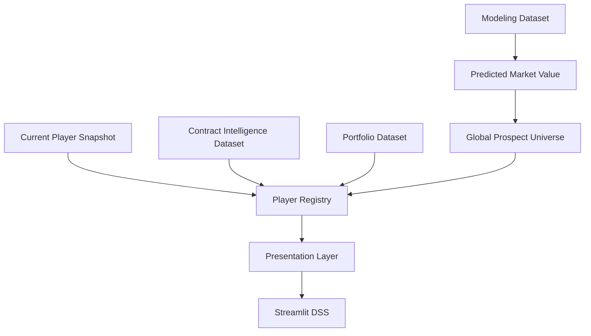

# 🧠 Resumen ejecutivo

**Market Value Dynamics and Market Inefficiency Detection in Professional Football** es una plataforma integral de Football Analytics orientada a scouting, recruitment y soporte cuantitativo a la toma de decisiones deportivas.

El objetivo principal del proyecto consiste en identificar ineficiencias de mercado dentro del fútbol profesional mediante la estimación del valor de mercado esperado de jugadores y la detección sistemática de activos potencialmente infravalorados.

La arquitectura desarrollada combina metodologías procedentes de múltiples disciplinas:

* Sports Analytics.
* Sports Economics.
* Econometría aplicada.
* Machine Learning supervisado.
* Explainable Artificial Intelligence (XAI).
* Decision Science.
* Operations Research.
* Portfolio Optimization.
* Data Governance.
* Decision Support Systems.

La evolución funcional del sistema ha seguido una progresión incremental desde modelos de valoración individuales hasta un entorno completo de apoyo a decisiones deportivas:

```text
Market Value Prediction
↓
Opportunity Detection
↓
Risk Assessment
↓
Player Intelligence
↓
Recruitment Intelligence
↓
Contract Intelligence
↓
Transfer Strategy Engine
↓
Portfolio Optimization
↓
Snapshot & Context Governance
↓
Decision Support System
```

El release actual consolida el proyecto como un DSS operativo con arquitectura de datos gobernada, autoridades separadas por dominio, contratos explícitos de DataFrame, identidad centralizada y una capa de presentación coherente para el dashboard.

```text
Release actual:
v2.0.0 — DSS Architecture, Data Contracts & Productization
```

La versión incorpora los resultados consolidados de:

```text
Sprint 13A   — Multi-League Expansion
Sprint 13A.1 — Coverage Audit & External Validation
Sprint 13B   — Advanced Data Expansion
Sprint 14    — Transfer Strategy Engine
Sprint 14.1  — Player Level Layer
Sprint TM.2  — Scoring & Ranking Integration
Sprint TM.3  — Contract Intelligence Layer
Sprint TM.6.x — Current Data, Performance & Visual Productization
Sprint TM.7.0 — Snapshot Authority
Sprint TM.7.1 — Presentation Layer
Sprint TM.7.6 — Legacy View Decommission
Sprint TM.8.6 — Performance Audit & Closure
Sprint TM.8.9 — Single Source of Truth / Registry Migration
Sprint TM.8.10 — DataFrame Contracts, Risk Authority & Release Closure
```

---

## Sprint 13A — Multi-League Expansion

Sprint 13A amplió el universo competitivo del proyecto desde siete hasta once ligas europeas, incrementando significativamente la cobertura de observaciones disponibles y permitiendo evaluar explícitamente la capacidad de generalización de la metodología.

Principales resultados:

* 11 ligas europeas integradas.
* 43.591 observaciones FBref procesadas.
* 5.527 observaciones modelables.
* 77 combinaciones liga-temporada.
* Match Rate global del 75,97%.

Esta fase constituyó la primera validación explícita de validez externa del sistema fuera del universo competitivo original.

---

## Sprint 13B — Advanced Data Expansion

Sprint 13B incorporó una nueva capa de métricas avanzadas derivadas de FBref con el objetivo de capturar dimensiones futbolísticas complejas insuficientemente representadas en versiones anteriores.

Variables promovidas a producción:

* `finishing_index_v2`
* `availability_index`
* `defensive_activity_index`

Los resultados obtenidos muestran mejoras consistentes tanto en econometría como en Machine Learning.

Hallazgo principal:

```text
finishing_index_v2
```

se identifica como la variable avanzada con mayor relevancia predictiva agregada.

Este resultado aporta evidencia empírica favorable sobre el valor incremental de métricas avanzadas para la estimación del valor de mercado de futbolistas profesionales.

---

## Sprint 14 — Transfer Strategy Engine

Sprint 14 representa la evolución conceptual más importante del proyecto desde la perspectiva de negocio y soporte a decisiones.

Hasta Sprint 13, el sistema respondía principalmente a la pregunta:

```text
¿Qué jugadores parecen infravalorados?
```

A partir de Sprint 14, el sistema es capaz de responder:

```text
¿Qué combinación de jugadores maximiza el valor esperado
bajo restricciones reales de club?
```

Para ello se desarrolla un motor de optimización basado en Programación Entera Binaria, capaz de construir carteras óptimas de fichajes considerando simultáneamente:

* presupuesto disponible;
* posiciones necesarias;
* perfil estratégico;
* nivel mínimo de calidad;
* número máximo de incorporaciones;
* restricciones de utilización presupuestaria.

La nueva capa incorpora conceptos procedentes de Operations Research y Portfolio Optimization.

---

## Sprint 14.1 — Player Level Layer

Como evolución del Transfer Strategy Engine se incorpora una capa de segmentación de calidad orientada a procesos reales de recruitment.

La plataforma clasifica automáticamente a los jugadores en diferentes niveles competitivos:

* Development Prospect.
* Rotation Profile.
* First Team Ready.
* Key Player Profile.
* Elite Target.

Esta funcionalidad permite incorporar restricciones explícitas de calidad mínima dentro de los procesos de optimización y mejora la alineación entre recomendaciones analíticas y necesidades deportivas reales de los clubes.

---

## Sprint TM.2 — Scoring & Ranking Integration

Sprint TM.2 resuelve una inconsistencia metodológica detectada tras la expansión multi-liga.

Aunque los modelos productivos ya operaban sobre un universo de once ligas europeas, parte de la capa DSS seguía utilizando artefactos heredados generados sobre la versión previa de siete ligas.

La intervención restauró la consistencia completa entre:

```text
Modeling Layer
↓
Scoring Layer
↓
Ranking Engine
↓
Transfer Strategy Engine
↓
Decision Support System
```

Principales resultados:

* Integración completa de las 11 ligas en la capa de scoring.
* Integración completa de las 11 ligas en ranking y opportunity detection.
* Integración completa de las 11 ligas en Transfer Strategy Engine.
* Reintegración automática de variables de crecimiento y confianza.
* Eliminación de dependencias operativas de la arquitectura pre-expansión.

---

## Sprint TM.3 — Contract Intelligence Layer

Sprint TM.3 incorpora una capa de inteligencia contractual orientada a complementar la evaluación deportiva y económica de candidatos mediante información procedente de Transfermarkt.

La nueva capa permite identificar:

* jugadores próximos a finalizar contrato;
* oportunidades pre-expiración;
* potenciales agentes libres;
* situaciones favorables de negociación.

La integración contractual se basa en:

```text
contract_expiration_date
```

y alcanza una cobertura del 95,90% sobre el universo DSS.

Variables implementadas:

* `contract_months_remaining`
* `contract_years_remaining`
* `contract_expiring_12m`
* `contract_critical_zone`
* `free_agent_horizon`
* `negotiation_leverage_score`
* `contract_opportunity_score`
* `recruitment_contract_score`

El indicador operativo principal se define como:

```text
Recruitment Contract Score
=
0.70 × Opportunity Score
+
0.30 × Contract Opportunity Score
```

Outputs generados:

* `contract_intelligence_dataset.csv`
* `top_contract_opportunities.csv`
* `top_recruitment_contract_targets.csv`

La información contractual opera como autoridad especializada aguas abajo del modelo predictivo. No altera la estimación de valor de mercado.

---

## Sprint TM.6.x — Current Data, Performance & Visual Productization

La serie TM.6.x consolidó el paso desde un prototipo analítico hacia un producto operativo.

Principales líneas de trabajo:

* construcción y aplicación del snapshot actual de Transfermarkt;
* actualización de rendimiento y disponibilidad de métricas deportivas;
* auditorías de matching FBref, Transfermarkt y Understat;
* incorporación de escudos, banderas, imágenes de jugadores y assets locales;
* normalización visual de clubes y ligas;
* mejora de Cloud deployment;
* revisión de UX, responsive y coherencia entre módulos.

El resultado fue una aplicación más actual, reconocible y orientada a uso ejecutivo.

---

## Sprint TM.7.0 — Snapshot Authority

TM.7.0 formalizó una autoridad específica para el contexto actual del jugador.

La decisión metodológica central consiste en separar:

```text
Season Context
→ Contexto histórico utilizado por el modelo.

Current Snapshot
→ Club, liga y valor de mercado actuales.

Display Context
→ Dato gobernado que se presenta al usuario.
```

Esta separación evita que un overlay actual sobrescriba silenciosamente variables históricas utilizadas por el modelo.

---

## Sprint TM.7.1 — Presentation Layer

TM.7.1 incorporó una capa explícita de presentación responsable de resolver de forma centralizada:

* nombre mostrado;
* club;
* liga;
* valor de mercado;
* escudo;
* bandera;
* imagen;
* etiquetas de contexto;
* fallbacks permitidos.

La capa de presentación garantiza una representación única y coherente del jugador en Opportunity, Recruitment, Contract, Strategy y Portfolio.

---

## Sprint TM.7.6 — Legacy View Decommission

TM.7.6 retiró la antigua capa `view_models` y consolidó el uso de:

* `PlayerRegistry`
* `PlayerView`
* `Presentation Engine`

La eliminación de vistas y módulos legacy reduce duplicidad, facilita el mantenimiento y evita rutas alternativas de enriquecimiento.

---

## Sprint TM.8.6 — Performance Audit & Closure

TM.8.6 auditó el coste de arranque, las lecturas de datasets y los puntos calientes del dashboard.

Problemas detectados:

* múltiples lecturas del mismo artefacto;
* joins equivalentes en diferentes módulos;
* enriquecimientos repetidos;
* trabajo analítico dentro del render;
* DataFrames construidos de forma diferente según la vista.

Medidas aplicadas:

* loaders centralizados y cacheados;
* datasets canónicos precomputados;
* reutilización de DataFrames preparados;
* reducción de overlays en tiempo de render;
* separación entre cálculo analítico y presentación;
* pinning de dependencias para Streamlit Cloud.

---

## Sprint TM.8.9 — Single Source of Truth / Registry Migration

TM.8.9 migró la aplicación hacia una arquitectura de Single Source of Truth.

```text
Fuentes especializadas
↓
Player Registry
↓
Presentation Layer
↓
Módulos del DSS
```

Cada dominio conserva su autoridad analítica, pero la identidad y los campos de presentación se resuelven de manera común.

Esta migración reduce:

* discrepancias entre módulos;
* joins ad hoc;
* riesgo de mezclar contextos;
* duplicidad de lógica;
* coste de mantenimiento.

---

## Sprint TM.8.10 — DataFrame Contracts, Risk Authority & Release Closure

TM.8.10 incorpora contratos explícitos para los DataFrames consumidos por el DSS y restaura la autoridad de `risk_score`.

Principios de DataFrame Contract:

* validación de columnas requeridas;
* aliases únicamente entre variables semánticamente equivalentes;
* ausencia de fabricación de valores `0`, `50` o `100`;
* mantenimiento de `NaN` cuando la información analítica no existe;
* comportamiento idempotente;
* helpers seguros de ordenación y agregación;
* garantía operativa frente a `KeyError` por columnas ausentes.

La incidencia de `risk_score = 0` para todos los jugadores se resolvió trasladando la autoridad de cálculo a:

```text
src/models/scouting/build_risk_score.py
```

e integrándola en:

```text
src/dss/build_global_prospect_universe.py
```

Estado final validado:

| Métrica | Resultado |
|---|---:|
| Cobertura Risk Score | 757/757 |
| Valores cero | 0 |
| Valores únicos | 580 |
| Mínimo | 0,13 |
| Mediana | 50,07 |
| Máximo | 100,00 |

---

## Contribución global del proyecto

La versión v2.0.0 representa la transición desde un sistema de valoración de mercado hacia una plataforma DSS capaz de integrar:

* valoración económica;
* detección de oportunidades;
* evaluación de riesgo;
* scouting cuantitativo;
* recruitment intelligence;
* contract intelligence;
* optimización de carteras;
* simulación estratégica;
* gobernanza de identidad y contexto;
* contratos de datos;
* productización visual;
* despliegue operativo en Streamlit Cloud.

El resultado es una arquitectura reproducible, interpretable y orientada a negocio que conecta analítica deportiva avanzada con procesos reales de toma de decisiones dentro del fútbol profesional.

---

# 📊 Estado actual

## Dataset

| Métrica | Valor consolidado |
|---|---:|
| Observaciones FBref procesadas | 43.591 |
| Dataset modelizable final | 5.527 |
| Cobertura temporal | 2019-2020 → 2025-2026 |
| Temporadas | 7 |
| Ligas | 11 |
| Combinaciones liga-temporada | 77 |
| Match Rate global FBref ↔ Transfermarkt | 75,97% |
| Universo DSS canónico | 757 jugadores |
| Variables DSS canónicas | 118 |
| Dataset Contract Intelligence | 757 × 134 |

Artefacto de modelización:

```text
data/processed/player_season_modeling_v13b_productive_candidate.parquet
```

Artefacto DSS canónico:

```text
reports/dss/global_prospect_universe.csv
```

Artefacto contractual especializado:

```text
reports/tm3_contract_intelligence/contract_intelligence_dataset.csv
```

---

## Cobertura operativa DSS

La cobertura competitiva del DSS está alineada con el universo de modelización.

| Componente | Cobertura |
|---|---:|
| Modeling Dataset | 11 ligas |
| Scoring Dataset | 11 ligas |
| Opportunity Dataset | 11 ligas |
| Transfer Portfolio Dataset | 11 ligas |
| Decision Support System | 11 ligas |
| Contract Intelligence | 95,90% |
| Current Snapshot | 681/757 — 89,96% |
| Presentation Layer | 757/757 — 100% |
| Risk Score | 757/757 — 100% |

Ligas soportadas en contexto de temporada y presentación:

* Premier League.
* LaLiga.
* Bundesliga.
* Serie A.
* Ligue 1.
* Eredivisie.
* Liga Portugal.
* Championship.
* Belgian Pro League.
* Austrian Bundesliga.
* Spanish Segunda División.

El snapshot actual cubre nueve ligas y 681 jugadores. La Presentation Layer mantiene cobertura completa mediante fallbacks gobernados al contexto de temporada para los 76 casos no enlazados.

---

## Arquitectura de autoridades

La versión v2.0.0 separa formalmente las responsabilidades de cada dominio.

| Autoridad | Artefacto o componente | Responsabilidad |
|---|---|---|
| Modeling Authority | `player_season_modeling_v13b_productive_candidate.parquet` | Variables históricas y predicción |
| DSS Authority | `reports/dss/global_prospect_universe.csv` | Opportunity, confidence, growth, risk y contexto DSS |
| Current Snapshot Authority | `data/processed/current_player_snapshot.*` | Club, liga y valor actuales |
| Contract Authority | `reports/tm3_contract_intelligence/contract_intelligence_dataset.csv` | Vencimiento, leverage y oportunidad contractual |
| Portfolio Authority | `reports/strategy/transfer_portfolio_dataset.csv` | Universo de optimización |
| Identity Authority | `PlayerRegistry` | Resolución única del jugador |
| Presentation Authority | Presentation Layer | Campos `display_*`, imágenes, escudos y banderas |
| DataFrame Contract Authority | `src/dss/contract/dataframe_contract.py` | Esquema estable para las vistas |



---

## Gobernanza de contexto

Campos de contexto de temporada:

```text
season_context_club
season_context_league
season_context_market_value_eur
```

Campos del snapshot actual:

```text
current_club_snapshot
current_league_snapshot
current_market_value_eur_snapshot
```

Campos de presentación:

```text
display_club
display_league
display_market_value_eur
```

Cobertura vigente:

| Campo | Cobertura |
|---|---:|
| `season_context_club` | 757/757 |
| `season_context_league` | 757/757 |
| `season_context_market_value_eur` | 757/757 |
| `current_club_snapshot` | 681/757 |
| `current_league_snapshot` | 681/757 |
| `current_market_value_eur_snapshot` | 681/757 |
| `display_club` | 757/757 |
| `display_league` | 757/757 |
| `display_market_value_eur` | 757/757 |

Estado de cambio de contexto:

```text
CONTEXT_CHANGED_CAUTION  747 jugadores
VALID_SAME_CONTEXT        10 jugadores
```

La etiqueta `CONTEXT_CHANGED_CAUTION` indica que el valor esperado pertenece al contexto histórico modelado, mientras que el valor mostrado procede del snapshot actual. El gap no debe interpretarse como una comparación estrictamente equivalente sin considerar ese cambio.

---

## Modelización

### Modelos oficiales (v2.0.0)

| Capa | Modelo oficial |
|---|---|
| Econometría | Growth OLS v13B |
| Machine Learning | Tuned XGBoost v13B |

---

### Referencias de rendimiento

| Resultado | Valor |
|---|---:|
| R² OLS productivo | 0,4549 |
| RMSE XGBoost productivo | 0,8692 |
| MAE XGBoost productivo | 0,6955 |
| R² XGBoost productivo | 0,5651 |
| Mejor R² histórico alcanzado | 0,5664 |

La referencia productiva vigente corresponde al pipeline consolidado del release v2.0.0:

```text
Tuned XGBoost v13B
RMSE = 0,8692
MAE  = 0,6955
R²   = 0,5651
```

Durante Sprint 13A.1 se alcanzó el máximo histórico de R² = 0,5664 bajo una configuración experimental distinta.

---

### Benchmark econométrico

| Modelo | R² |
|---|---:|
| M_A_v13A_base_spec_FE | 0,4505 |
| M_B_v13B_advanced_FE | 0,4549 |

Resultado:

```text
ΔR² = +0,0044
```

La incorporación de métricas avanzadas aporta capacidad explicativa incremental sin comprometer interpretabilidad.

---

### Modelo Machine Learning productivo

Modelo oficial:

```text
Tuned XGBoost v13B
```

Resultado productivo consolidado:

| Métrica | Valor |
|---|---:|
| RMSE | 0,8692 |
| MAE | 0,6955 |
| R² | 0,5651 |

Resultados comparativos de Sprint 13B:

| Arquitectura | Mejora observada |
|---|---:|
| XGBoost | +0,0096 |
| Random Forest | +0,0097 |
| HistGradientBoosting | +0,0144 |
| LightGBM | +0,0291 |

Todas las arquitecturas evaluadas mejoran tras incorporar las variables avanzadas, reforzando la robustez metodológica.

---

### Variable avanzada más relevante

Los análisis de importancia identifican:

```text
finishing_index_v2
```

como la variable avanzada con mayor relevancia predictiva agregada.

---

### Validación externa multi-liga (Sprint 13A.1)

Mejor resultado histórico:

| Modelo | RMSE | MAE | R² |
|---|---:|---:|---:|
| Tuned XGBoost | 0,8525 | 0,6834 | 0,5664 |

Este experimento constituye la principal evidencia de capacidad de generalización externa.

---

## Opportunity, Risk & Contract Framework

La plataforma incorpora una capa completa de evaluación de oportunidades de mercado.

Componentes operativos:

* Growth Score.
* Confidence Score.
* Opportunity Score.
* Risk Score.
* Risk-adjusted Opportunity Score.
* Contract Opportunity Score.
* Recruitment Contract Score.

Cobertura del universo DSS canónico:

| Score | Cobertura |
|---|---:|
| Growth Score | 757/757 |
| Confidence Score | 757/757 |
| Opportunity Score | 757/757 |
| Risk Score | 757/757 |

La ausencia de una columna denominada literalmente `inefficiency_score` en el artefacto canónico no implica ausencia del concepto analítico. La señal de infravaloración está representada por las predicciones y gaps de valoración utilizados por Opportunity Framework.

---

## Recruitment Intelligence

La capa de Recruitment Intelligence transforma rankings analíticos en herramientas operativas para departamentos deportivos.

Funcionalidades implementadas:

* Recruitment Board.
* Comparative Player Analysis.
* Candidate Selection.
* Executive Scouting Workflow.
* Positional Benchmarking.
* Global Search Engine.
* Executive Dashboard.
* Candidate funnel.
* Shortlists y filtros persistentes.
* Análisis de perfiles fuera de scouting sin alterar rankings.

---

## Contract Intelligence

### Estado

```text
Sprint TM.3 — COMPLETADO
Autoridad especializada activa
```

### Cobertura

```text
757 jugadores
134 columnas
95,90% cobertura contractual
```

### Variables implementadas

* `contract_expiration_date`
* `contract_months_remaining`
* `contract_years_remaining`
* `contract_expiring_12m`
* `contract_critical_zone`
* `free_agent_horizon`
* `negotiation_leverage_score`
* `contract_opportunity_score`
* `recruitment_contract_score`

### Indicador operativo

```text
Recruitment Contract Score
=
0.70 × Opportunity Score
+
0.30 × Contract Opportunity Score
```

### Outputs generados

* `contract_intelligence_dataset.csv`
* `top_contract_opportunities.csv`
* `top_recruitment_contract_targets.csv`

La Contract Authority se mantiene separada del universo DSS canónico y se integra mediante `PlayerRegistry`.

---

## Transfer Strategy Engine

### Estado

```text
Sprint 14    — COMPLETADO
Sprint 14.1  — COMPLETADO
Sprint TM.2  — COMPLETADO
Sprint TM.3  — COMPLETADO
Integración Registry — OPERATIVA
```

### Objetivo

Optimizar decisiones de fichaje bajo restricciones reales de club.

```text
¿Qué cartera de fichajes maximiza el valor esperado
bajo restricciones deportivas y presupuestarias?
```

---

### Inputs estratégicos

* Budget.
* Positions Needed.
* Scenario.
* Portfolio Style.
* Minimum Player Level.
* Maximum Signings.
* Budget Utilization Constraint.

---

### Escenarios implementados

| Escenario | Objetivo |
|---|---|
| Conservative | Prioriza estabilidad y robustez |
| Balanced | Equilibrio entre upside y riesgo |
| Aggressive | Maximización de upside esperado |

---

### Estilos de cartera

| Estilo | Objetivo |
|---|---|
| Value Opportunities | Maximizar oportunidades de mercado |
| Balanced Squad Building | Equilibrio entre concentración y diversificación |
| Star + Prospects | Combinar talento consolidado y desarrollo futuro |

---

### Player Level Layer

| Nivel | Descripción |
|---|---|
| Development Prospect | Jugador en desarrollo |
| Rotation Profile | Perfil de rotación |
| First Team Ready | Preparado para competir regularmente |
| Key Player Profile | Jugador diferencial |
| Elite Target | Objetivo estratégico prioritario |

---

### Metodología de optimización

El sistema utiliza Programación Entera Binaria mediante PuLP.

Restricciones consideradas:

* presupuesto máximo;
* utilización mínima del presupuesto;
* número máximo de incorporaciones;
* cobertura de posiciones;
* nivel mínimo de jugador;
* restricciones del estilo de cartera.

---

## Evolución visual y UX del dashboard

El dashboard se ha actualizado para aproximarse a un producto de scouting profesional.

Mejoras consolidadas:

* escudos de clubes y banderas;
* imágenes de jugadores;
* assets locales;
* cards ejecutivas;
* matrices oportunidad-riesgo;
* tablas Top 5;
* resúmenes de candidato;
* navegación y módulos ES/EN;
* responsive desktop/mobile;
* jerarquía visual homogénea;
* formatos monetarios y scores consistentes;
* etiquetas de cautela contextual;
* mejor distribución espacial entre filtros, resultados y decisión.

Flujo ejecutivo:

```text
Universe
↓
Filters
↓
Candidate Ranking
↓
Player Analysis
↓
Comparison
↓
Decision
```

---

## Performance y arquitectura de consumo

La mejora de velocidad derivó en una refactorización estructural de consumo de datos.

Arquitectura actual:

```text
Artefactos canónicos
↓
Loaders cacheados
↓
Player Registry
↓
Presentation Layer
↓
Vistas Streamlit
```

Mejoras aplicadas:

* reducción de lecturas repetidas;
* consolidación de DataFrames preparados;
* eliminación de overlays legacy;
* menor trabajo de enriquecimiento durante el render;
* separación entre lógica analítica y presentación;
* contratos de esquema antes de entrar en las vistas;
* pinning de dependencias para Cloud;
* retirada de runs, backups y artefactos obsoletos;
* rutas portables en outputs activos de snapshot.

Estado:

```text
TM.8.6–TM.8.10 cerrados
Streamlit Cloud validado
20/20 tests DSS superados
```

La aplicación principal continúa concentrada en `app/streamlit_app.py`. Su modularización adicional queda como mejora futura, no como bloqueo operativo.

---

## Evaluación de negocio

| Métrica | Valor |
|---|---:|
| Precision@10 | 90% |
| Precision@20 | 90% |
| Precision@50 | 90% |
| Precision@100 | 85% |

Los resultados respaldan la utilidad operativa del sistema para scouting, recruitment, contract intelligence y construcción de carteras.

---

## Estado general del proyecto

```text
Sprint 13A    — COMPLETADO
Sprint 13A.1  — COMPLETADO
Sprint 13B    — COMPLETADO
Sprint 14     — COMPLETADO
Sprint 14.1   — COMPLETADO
Sprint TM.2   — COMPLETADO
Sprint TM.3   — COMPLETADO
Sprint TM.6.x — COMPLETADO
Sprint TM.7.0 — COMPLETADO
Sprint TM.7.1 — COMPLETADO
Sprint TM.7.6 — COMPLETADO
Sprint TM.8.6 — COMPLETADO
Sprint TM.8.9 — COMPLETADO
Sprint TM.8.10 — COMPLETADO

Release v2.0.0 — OPERATIVO
Deployment Streamlit Cloud — VALIDADO
```

---

## Estado funcional

```text
Market Value Prediction
↓
Opportunity Detection
↓
Risk Assessment
↓
Player Intelligence
↓
Recruitment Intelligence
↓
Contract Intelligence
↓
Transfer Strategy Engine
↓
Portfolio Optimization
↓
Snapshot & Context Governance
↓
Identity & Presentation Governance
↓
DataFrame Contract Enforcement
↓
Decision Support System
```

La plataforma ha evolucionado desde un sistema de valoración de mercado hacia un entorno completo de apoyo cuantitativo a decisiones deportivas.

---

# 📚 Estado CRISP-DM

| Fase | Estado |
|---|---|
| Business Understanding | ✅ Completada |
| Data Understanding | ✅ Completada |
| Data Preparation | ✅ Completada |
| Modeling | ✅ Completada |
| Evaluation | ✅ Completada |
| Deployment | ✅ Completada |
| DSS Integration | ✅ Completada |
| Transfer Strategy Layer | ✅ Completada |
| Contract Intelligence | ✅ Completada |
| Snapshot Governance | ✅ Completada |
| Identity & Presentation | ✅ Completada |
| Data Contracts | ✅ Completada |
| Performance Closure | ✅ Completada |

La arquitectura DSS principal se considera cerrada, gobernada y operativa.

La evolución posterior corresponde a mejora incremental, automatización y ampliación de fuentes, no a resolución de fallos estructurales pendientes.

---

# 🎯 Objetivo académico alcanzado

El objetivo original del TFM consistía en desarrollar un sistema capaz de:

```text
Estimar el valor de mercado esperado de futbolistas
e identificar oportunidades de mercado potencialmente
infravaloradas.
```

Este objetivo ha sido alcanzado mediante:

* modelización econométrica;
* Machine Learning supervisado;
* Opportunity Detection;
* Risk Assessment;
* Recruitment Intelligence;
* Contract Intelligence;
* Transfer Strategy Engine;
* Portfolio Optimization;
* validación multi-liga;
* evaluación out-of-sample.

La solución supera el alcance inicialmente previsto al incorporar:

* gobernanza de contexto;
* identidad centralizada;
* contratos de datos;
* producto DSS desplegable;
* optimización matemática;
* soporte visual a decisiones.

---

# 🏆 Principales contribuciones del proyecto

## 1. Framework de valoración de mercado

Desarrollo de modelos explicativos y predictivos para estimar el valor de mercado esperado de futbolistas profesionales.

---

## 2. Detección sistemática de ineficiencias

Implementación de un Opportunity Framework basado en:

```text
Valor observado
vs
Valor esperado
```

capaz de priorizar activos potencialmente infravalorados.

---

## 3. Integración de métricas avanzadas

Incorporación de variables derivadas de FBref que mejoran simultáneamente:

* econometría;
* Machine Learning;
* interpretabilidad.

Hallazgo principal:

```text
finishing_index_v2
```

como variable avanzada más relevante.

---

## 4. Validación multi-liga

Expansión desde siete hasta once competiciones europeas.

Cobertura final:

* 11 ligas.
* 77 league-seasons.
* 43.591 observaciones.
* 5.527 observaciones modelables.

---

## 5. Consistencia DSS de extremo a extremo

Sprint TM.2 garantiza la propagación completa de la expansión multi-liga a todas las capas operativas.

Resultado:

```text
11 ligas integradas de extremo a extremo
```

---

## 6. Contract Intelligence Layer

Sprint TM.3 incorpora una dimensión de decisión basada en información contractual.

Capacidades:

* expiraciones;
* oportunidades pre-expiración;
* leverage negociador;
* potenciales agentes libres;
* contract-aware recruitment.

---

## 7. Transfer Strategy Engine

Implementación de una capa de optimización basada en Programación Entera Binaria.

```text
Seleccionar carteras óptimas de fichajes
bajo restricciones reales de club.
```

---

## 8. Snapshot & Context Governance

Separación formal entre contexto histórico, snapshot actual y dato mostrado.

Esta contribución evita fugas semánticas y permite utilizar información actual sin alterar la base histórica del modelo.

---

## 9. Identity Registry & Presentation Layer

Centralización de la identidad del jugador y de los fallbacks de presentación.

El resultado es una representación coherente entre módulos y una reducción de joins ad hoc.

---

## 10. DataFrame Contract Layer

Introducción de contratos explícitos para asegurar esquemas estables y prevenir errores por columnas ausentes.

Principio clave:

```text
Missing analytical value
≠
Default score
```

---

## 11. Performance & Productization

Refactorización del consumo de datos, mejora de caché, reducción de lecturas redundantes y consolidación visual del dashboard.

---

# 🚀 Roadmap futuro

Las siguientes líneas se consideran evoluciones naturales una vez cerrada la arquitectura v2.0.0.

## Prioridad alta

### TabPFN Benchmark

Comparar arquitecturas fundacionales para datos tabulares frente al stack de boosting.

Impacto esperado:

```text
Exploratorio
```

---

### CatBoost Benchmark

Evaluar mejora incremental frente a Tuned XGBoost.

Impacto esperado:

```text
Medio-Alto
```

---

### Modularización Streamlit

Objetivo:

* dividir `app/streamlit_app.py` por dominios;
* reducir acoplamiento visual;
* mejorar testabilidad;
* simplificar mantenimiento.

La modularización no es necesaria para la operación actual, pero sí para la evolución profesional del producto.

---

### Automated Snapshot Promotion

Objetivo:

```text
Candidate Snapshot
↓
Guardrails
↓
Health Report
↓
Controlled Promotion
```

La promoción automática debe mantenerse bloqueada cuando los guardrails detecten regresiones de cobertura, identidad o frescura.

---

### CI de contratos y documentación

Incorporar validaciones automáticas para:

* DataFrame Contracts;
* schema drift;
* enlaces Markdown;
* compilación;
* tests DSS;
* artefactos canónicos;
* divergencias entre README, Project Status y outputs reales.

---

## Prioridad media

### UEFA Club Strength Layer

Variables previstas:

* coeficiente UEFA;
* rendimiento europeo;
* experiencia continental.

---

### National Team Layer

Variables previstas:

* internacionalidades;
* minutos internacionales;
* torneos disputados.

---

### European Competition Layer

Variables previstas:

* Champions League;
* Europa League;
* Conference League.

---

### Club Development Index

Medición de la capacidad histórica de desarrollo y revalorización de talento de cada club.

---

## Prioridad baja

### Historical Availability Layer

Variables previstas:

* partidos perdidos;
* disponibilidad histórica;
* continuidad competitiva.

---

# 🔬 Líneas de investigación futuras

## Injury Prediction

Objetivo:

```text
Estimar riesgo futuro de lesión
mediante modelización específica.
```

Posibles fuentes:

* disponibilidad histórica;
* carga competitiva;
* minutos acumulados;
* historial médico.

Esta línea se considera un proyecto complementario independiente y una potencial capa futura de Health Intelligence.

---

# 📈 Estado final

```text
Release actual:
v2.0.0 — DSS Architecture, Data Contracts & Productization
```

Cobertura:

```text
11 ligas
77 league-seasons
43.591 observaciones FBref
5.527 observaciones modelables

757 jugadores DSS
118 variables DSS
757 × 134 Contract Intelligence

681/757 snapshot actual
757/757 presentación
757/757 Risk Score
20/20 tests DSS
```

Modelización:

```text
Growth OLS v13B
R² = 0,4549

Tuned XGBoost v13B
RMSE = 0,8692
MAE  = 0,6955
R²   = 0,5651

Mejor referencia histórica:
R² = 0,5664
```

Arquitectura:

```text
Market Value Prediction
↓
Opportunity Detection
↓
Risk Assessment
↓
Global Prospect Universe
↓
Current Snapshot Authority
↓
Player Registry
↓
Presentation Layer
↓
Recruitment / Contract / Strategy
↓
Portfolio Optimization
↓
DataFrame Contract Enforcement
↓
Decision Support System
```

Estado global:

```text
Arquitectura DSS completada
Validación multi-liga completada
Transfer Strategy Engine completado
Contract Intelligence operativa
Snapshot Authority operativa
Registry y Presentation Layer operativos
DataFrame Contract Layer operativa
Risk Score Authority restaurada
Performance Closure completado
Streamlit Cloud validado
Proyecto preparado para defensa académica
y evolución hacia plataforma profesional
```