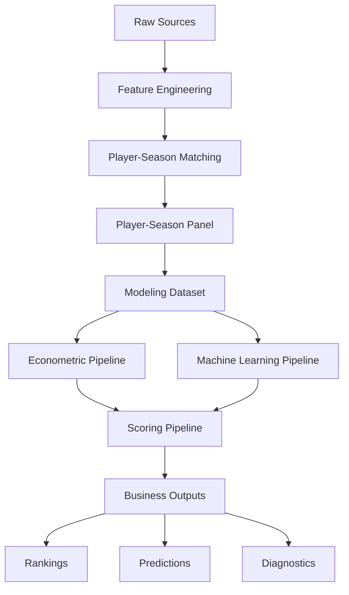

# 📌 Estado del proyecto

<div align="center">


</div>

---

# 📑 Tabla de contenidos

- [🧠 Resumen ejecutivo](#-resumen-ejecutivo)
- [📚 Estado CRISP-DM](#-estado-crisp-dm)
- [🔄 Evolución de arquitectura](#-evolución-de-arquitectura)
- [🏗️ Arquitectura actual del sistema](#️-arquitectura-actual-del-sistema)
- [⚠️ Problema crítico del proyecto](#️-problema-crítico-del-proyecto)
- [🛠️ Sistema de matching implementado](#️-sistema-de-matching-implementado)
- [📈 Resultados del matching](#-resultados-del-matching)
- [📊 Dataset final de modelización](#-dataset-final-de-modelización)
- [📈 Estado del pipeline econométrico](#-estado-del-pipeline-econométrico)
- [🤖 Estado del pipeline Machine Learning](#-estado-del-pipeline-machine-learning)
- [💡 Estado del scoring pipeline](#-estado-del-scoring-pipeline)
- [📊 Estado del evaluation pipeline](#-estado-del-evaluation-pipeline)
- [📤 Outputs generados](#-outputs-generados)
- [⚖️ Trade-offs metodológicos](#️-trade-offs-metodológicos)
- [🧱 Deuda técnica actual](#-deuda-técnica-actual)
- [🚀 Próximos pasos](#-próximos-pasos)
- [🧠 Conclusión](#-conclusión)

---

# 🧠 Resumen ejecutivo

El proyecto desarrolla un sistema analítico modular para identificar jugadores infravalorados en el mercado de fichajes europeo mediante modelos econométricos y Machine Learning aplicados al valor de mercado de futbolistas.

El sistema se basa en:

- integración robusta de múltiples fuentes
- feature engineering deportivo
- econometría aplicada
- validación temporal out-of-sample
- analytics engineering
- scouting cuantitativo

---

## 📊 Estado actual del sistema

| Métrica | Valor |
|---|---:|
| Observaciones panel | 23,580 |
| Dataset modelizable | 3,297 |
| Jugadores únicos | 1,847 |
| Cobertura temporal | 2019-2020 → 2024-2025 |
| Ligas | 7 |
| Match rate | 88.36% |

---

## ✅ Capacidades actuales

El sistema ya permite:

- estimar valor de mercado esperado
- calcular Inefficiency Score
- generar rankings de scouting
- comparar OLS vs Machine Learning
- producir predicciones out-of-sample
- persistir modelos entrenados
- generar outputs reproducibles

---

## 📌 Estado global

El proyecto ya ha superado las fases técnicamente más complejas relacionadas con:

```text id="4pabpb"
integración de fuentes
matching
pipeline reproducible
validación temporal
modelización base
```

Actualmente el principal cuello de botella ya no es arquitectónico, sino:

```text id="2o7f8z"
feature engineering y calidad de señal predictiva
```

---

# 📚 Estado CRISP-DM

## Fase actual

```text id="3f3o56"
Modeling → Evaluation
```

---

## ✅ Fases completadas

### Business Understanding

* definición del problema de scouting
* definición de objetivos empresariales
* framing econométrico
* definición de outputs de negocio

---

### Data Understanding

* análisis exploratorio
* análisis de distribuciones
* estudio de sesgos
* evaluación de calidad
* análisis de cobertura

---

### Data Preparation

* feature engineering inicial
* normalización
* matching
* construcción del panel
* dataset modelizable
* control de leakage

---

## 🔄 Fases en curso

### Modeling

* pipeline econométrico final
* pipeline ML supervisado
* scoring automático

---

### Evaluation

* validación temporal
* robustness checks
* estabilidad de rankings
* análisis comparativo OLS vs ML

---

## ⏳ Próximas fases

### Deployment

Pendiente:

* dashboard
* API scoring
* scouting reports automáticos

---

# 🔄 Evolución de arquitectura

El proyecto comenzó como un entorno principalmente exploratorio basado en notebooks.

Posteriormente evolucionó hacia:

```text id="c7f9g5"
pipeline modular reproducible
```

Actualmente:

* los notebooks se utilizan para análisis e interpretación
* la ejecución principal se realiza mediante pipelines desacoplados
* los modelos y outputs se generan automáticamente
* los artefactos se persisten
* la configuración está centralizada

---

## 📌 Cambio arquitectónico principal

### Antes

```text id="cajmvf"
Notebook-centric workflow
```

---

### Ahora

```text id="0j7h0n"
Modular analytics system
```

Separación clara entre:

* ingesta
* feature engineering
* matching
* modelización
* scoring
* evaluación
* outputs

---

# 🏗️ Arquitectura actual del sistema



---

## 📂 Arquitectura física

```text id="6d5ytr"
market-value-football-tfm/

├── artifacts/
├── config/
├── data/
├── docs/
├── notebooks/
├── reports/
├── src/
├── tests/
```

---

## 🧩 Componentes principales

| Componente          | Estado |
| ------------------- | ------ |
| Data pipelines      | ✅      |
| Matching pipeline   | ✅      |
| Modeling dataset    | ✅      |
| OLS pipeline        | ✅      |
| ML pipeline         | ✅      |
| Scoring pipeline    | ✅      |
| Evaluation pipeline | ✅      |
| Temporal validation | ✅      |
| Model persistence   | ✅      |
| Ranking generation  | ✅      |

---

# ⚠️ Problema crítico del proyecto

# Integración FBref ↔ Transfermarkt

El principal reto técnico del proyecto ha sido la integración entre FBref y Transfermarkt.

---

## 🚧 Problemas estructurales

* ❌ ausencia de identificador común
* ❌ nombres inconsistentes
* ❌ transliteraciones
* ❌ diferencias de clubes
* ❌ granularidad temporal distinta
* ❌ cambios intra-temporada

---

## 📉 Riesgos derivados

Sin matching robusto:

* false positives
* false negatives
* ruido en el modelo
* rankings incorrectos
* pérdida de validez del scoring

---

## 📌 Impacto técnico

Este problema consumió aproximadamente:

```text id="jlwmxf"
40-50% del trabajo técnico total
```

---

# 🛠️ Sistema de matching implementado

Se desarrolló un pipeline jerárquico multi-validación.

---

## 1️⃣ Normalización de nombres

* lowercase
* eliminación de acentos
* limpieza de strings

---

## 2️⃣ Matching exacto

Variables utilizadas:

* nombre normalizado
* temporada
* edad aproximada

---

## 3️⃣ Validación por club

Threshold:

```python id="wm6z6g"
MIN_CLUB_SCORE = 70
```

---

## 4️⃣ Matching fuzzy

Algoritmo:

```python id="jrn0ih"
RapidFuzz
```

Threshold:

```python id="6eh8lh"
FUZZY_THRESHOLD = 92
```

---

## 5️⃣ Validación por edad

```python id="y1x2ca"
MAX_AGE_DIFF = 1.5
```

---

# 📈 Resultados del matching

## 📊 Resultados globales

| Métrica                   | Resultado |
| ------------------------- | --------: |
| Match rate                |    88.36% |
| Observaciones emparejadas |    20,836 |
| Observaciones totales     |    23,580 |

---

## Distribución final

| Método                   | Resultado |
| ------------------------ | --------: |
| exact_age_validated      | dominante |
| exact_age_club_validated | relevante |
| fuzzy_age_club_validated |  residual |

---

## 📌 Interpretación

El matching exacto domina claramente la muestra final.

El fuzzy matching queda restringido a casos ambiguos específicos, reduciendo riesgo de false positives.

👉 El sistema prioriza cobertura manteniendo control de calidad.

---

# 📊 Dataset final de modelización

## Resultado tras filtros

| Métrica       | Valor |
| ------------- | ----: |
| Observaciones | 3,297 |
| Jugadores     | 1,847 |
| Ligas         |     7 |
| Edad          | 18–23 |

---

## Filtros aplicados

* matching válido
* edad válida
* minutos mínimos
* valor de mercado disponible
* posición válida

---

## Distribución por posición

| Posición | Observaciones |
| -------- | ------------: |
| MID      |         1,705 |
| DEF      |         1,147 |
| ATT      |           351 |
| GK       |            94 |

---

## Distribución por liga

| Liga           | Observaciones |
| -------------- | ------------: |
| Ligue 1        |           627 |
| Eredivisie     |           557 |
| Serie A        |           494 |
| Premier League |           466 |
| Bundesliga     |           438 |
| LaLiga         |           373 |
| Liga Portugal  |           342 |

---

# 📈 Estado del pipeline econométrico

```text id="9v4e7r"
src/models/econometric/
```

---

## Componentes implementados

| Archivo             | Estado |
| ------------------- | ------ |
| specifications.py   | ✅      |
| train_ols.py        | ✅      |
| run_ols_pipeline.py | ✅      |

---

## Funcionalidades actuales

* fórmula OLS centralizada
* HC3 robust covariance
* league FE
* season FE
* position FE
* scoring automático
* rankings automáticos
* export CSV
* evaluación temporal

---

## Modelo final

```python id="7zzw18"
log_market_value_eur ~
age +
log_minutes_played +
goals_per90 +
assists_per90 +
league FE +
season FE +
position FE
```

---

## 📊 Resultados out-of-sample

| Modelo          |        MAE |       RMSE |         R² |
| --------------- | ---------: | ---------: | ---------: |
| OLS simple      |     1.0036 |     1.2165 |     0.1472 |
| OLS + League FE |     0.7954 |     0.9896 |     0.4356 |
| OLS final FE    | **0.7907** | **0.9823** | **0.4439** |

---

## 📌 Hallazgos principales

### Premier League

* prima estructural positiva significativa

---

### Eredivisie / Liga Portugal

* descuentos estructurales relevantes

---

### Variables más relevantes

* minutos jugados
* goles por 90
* asistencias por 90

---

# 🤖 Estado del pipeline Machine Learning

```text id="ivksml"
src/models/machine_learning/
```

---

## Componentes implementados

| Archivo            | Estado |
| ------------------ | ------ |
| pipelines.py       | ✅      |
| train_ml.py        | ✅      |
| run_ml_pipeline.py | ✅      |

---

## Modelos implementados

* Random Forest
* HistGradientBoosting
* GradientBoostingRegressor

---

## Funcionalidades actuales

* preprocessing pipeline
* one-hot encoding
* temporal validation
* feature importance
* model persistence
* export automático

---

## 📊 Resultados ML

| Modelo               |        MAE |       RMSE |         R² |
| -------------------- | ---------: | ---------: | ---------: |
| OLS final            |     0.7907 |     0.9823 |     0.4439 |
| Random Forest        |     0.7704 |     0.9691 |     0.4587 |
| HistGradientBoosting |     0.7723 |     0.9680 |     0.4600 |
| Gradient Boosting    | **0.7613** | **0.9493** | **0.4807** |

---

## 📌 Conclusiones ML

* ML mejora moderadamente el rendimiento predictivo
* OLS mantiene mejor interpretabilidad
* existe estabilidad razonable entre rankings
* el principal cuello de botella es el feature engineering

---

# 💡 Estado del scoring pipeline

```text id="e3xjk9"
src/models/scoring/
```

---

## Componentes implementados

| Archivo         | Estado |
| --------------- | ------ |
| inefficiency.py | ✅      |
| rankings.py     | ✅      |

---

## Funcionalidades actuales

* predicted market value
* market value gap
* inefficiency score
* z-score normalization
* undervalued rankings
* overvalued rankings

---

## Estado operativo

```text id="oz5vrl"
Scoring automático completamente operativo
```

---

# 📊 Estado del evaluation pipeline

```text id="u5e4l0"
src/models/evaluation/
```

---

## Componentes implementados

| Archivo               | Estado |
| --------------------- | ------ |
| metrics.py            | ✅      |
| feature_importance.py | ✅      |
| model_comparison.py   | ✅      |

---

## Funcionalidades actuales

* regression metrics
* model comparison
* feature importance extraction
* standardized reporting

---

# 📤 Outputs generados

El sistema ya genera automáticamente:

* predicciones out-of-sample
* rankings infravalorados
* rankings sobrevalorados
* métricas econométricas
* métricas ML
* tablas de coeficientes
* feature importance
* análisis por liga
* análisis por posición

---

## 📂 Directorios de outputs

```text id="qlsv1r"
reports/
artifacts/
```

---

## Outputs principales

### Reports

```text id="6m4h5f"
reports/rankings/
reports/tables/
reports/model_diagnostics/
reports/scouting_reports/
```

---

### Artifacts

```text id="yw7eg9"
artifacts/models/
artifacts/predictions/
artifacts/feature_importance/
```

---

# ⚖️ Trade-offs metodológicos

## Cobertura vs precisión

Decisión adoptada:

```text id="9nvt8h"
Priorizar cobertura muestral
```

---

## Interpretabilidad vs complejidad

Decisión adoptada:

```text id="5pb31f"
OLS = núcleo principal
ML = extensión predictiva
```

---

## Robustez vs coste computacional

Se optimizó:

* reducción espacio matching
* filtrado jerárquico
* búsqueda por temporada

---

# 🧱 Deuda técnica actual

## ⚠️ Feature engineering limitado

El feature set actual sigue muy concentrado en:

* minutos
* goles
* asistencias

Esto limita:

* capacidad predictiva
* modelización defensiva
* detección avanzada de talento

---

## ⚠️ Variables contextuales pendientes

Pendiente incorporar:

* xG
* xA
* métricas progresivas
* métricas defensivas
* métricas de desarrollo
* trajectory features

---

## ⚠️ Growth Score pendiente

Todavía no implementado:

```text id="ndg9jj"
Growth Score pipeline
```

---

# 🚀 Próximos pasos

# 🔜 Prioridad inmediata

## Feature engineering avanzado

Diseñar e implementar:

* progression metrics
* age curves
* percentile features
* league normalization
* z-scores por posición
* rolling metrics
* growth indicators
* trajectory features
* market momentum

---

## Objetivo principal

Mejorar:

```text id="0s2a6o"
signal predictivo
```

del sistema.

---

# 🔜 Fase posterior

* Growth Score
* dashboard interactivo
* visualizaciones finales
* business insights
* scouting reports automáticos
* despliegue operativo

---

# 🧠 Conclusión

El proyecto ha superado con éxito las fases técnicamente más complejas relacionadas con:

* integración de fuentes heterogéneas
* matching robusto
* arquitectura reproducible
* validación temporal
* modelización base

Actualmente el sistema ya permite:

* estimar valor esperado
* detectar ineficiencias
* generar rankings cuantitativos
* comparar econometría y ML
* producir outputs reproducibles

El proyecto se encuentra en una fase avanzada y metodológicamente sólida para un Trabajo de Fin de Máster orientado a:

* sports analytics
* scouting cuantitativo
* econometría aplicada
* machine learning supervisado
* analytics engineering


