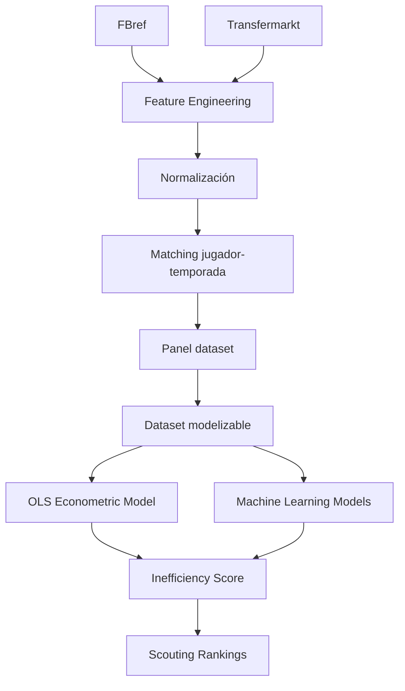

# 📌 Estado del proyecto

# 🧠 Resumen ejecutivo

El proyecto desarrolla un sistema analítico para identificar jugadores infravalorados en el mercado de fichajes europeo mediante modelos econométricos y Machine Learning aplicados al valor de mercado de futbolistas.

El sistema se basa en:

- integración de múltiples fuentes
- feature engineering deportivo
- econometría aplicada
- validación temporal out-of-sample
- scouting cuantitativo

---

## 📊 Estado actual del sistema

| Métrica | Valor |
|---|---:|
| Observaciones panel | 23,580 |
| Dataset modelizable | 3,297 |
| Jugadores únicos | 1,847 |
| Cobertura temporal | 2019-2020 → 2024-2025 |
| Ligas | 7 |
| Match rate | 88.36% |

---

## ✅ Capacidades actuales

El sistema ya permite:

- estimar valor de mercado esperado
- calcular Inefficiency Score
- generar rankings de scouting
- comparar OLS vs Machine Learning
- analizar diferencias estructurales entre ligas
- producir predicciones out-of-sample

---

# 📚 Estado CRISP-DM

## Fase actual

```text
Modeling → Evaluation
```

---

## ✅ Fases completadas

### Business Understanding

- definición del problema de scouting
- definición de objetivos de negocio
- framing econométrico

### Data Understanding

- análisis exploratorio
- estudio de distribuciones
- detección de sesgos
- evaluación de calidad

### Data Preparation

- feature engineering
- normalización
- matching
- construcción del panel
- dataset modelizable

---

## 🔄 Fases en curso

### Modeling

- modelo econométrico final
- machine learning supervisado
- scoring

### Evaluation

- validación temporal
- robustness checks
- estabilidad de rankings

---

# 🏗️ Arquitectura del pipeline



---

# ⚠️ Problema crítico: integración FBref ↔ Transfermarkt

## 🚧 Naturaleza del problema

El principal reto técnico del proyecto reside en la integración entre FBref y Transfermarkt.

Problemas detectados:

- ❌ ausencia de identificador común
- ❌ nombres inconsistentes
- ❌ transliteraciones
- ❌ diferencias entre clubes
- ❌ edades no alineadas
- ❌ granularidad temporal distinta
- ❌ cambios intra-temporada

👉 Este problema representa una de las principales fuentes de incertidumbre en sports analytics.

---

## 📉 Riesgos derivados

Sin matching robusto:

- false positives
- false negatives
- ruido en el modelo
- rankings incorrectos
- pérdida de validez del Inefficiency Score

---

# 🛠️ Estrategia de matching implementada

Se desarrolló un pipeline jerárquico multi-validación.

---

## 1️⃣ Normalización de nombres

- lowercase
- eliminación de acentos
- limpieza de strings

---

## 2️⃣ Matching exacto

Variables utilizadas:

- nombre normalizado
- temporada
- edad aproximada

---

## 3️⃣ Validación por club

- fuzzy matching
- token similarity

Threshold:

```python
MIN_CLUB_SCORE = 70
```

---

## 4️⃣ Matching fuzzy

Algoritmo:

```python
RapidFuzz
```

Threshold:

```python
FUZZY_THRESHOLD = 92
```

---

## 5️⃣ Validación por edad

```python
MAX_AGE_DIFF = 1.5
```

---

# 📈 Resultados del matching

## 📊 Resultados globales

| Métrica | Resultado |
|---|---:|
| Match rate | 88.36% |
| Observaciones emparejadas | 20,836 |
| Observaciones totales | 23,580 |

---

## Distribución final

| Método | Resultado |
|---|---:|
| exact_age_validated | dominante |
| exact_age_club_validated | relevante |
| fuzzy_age_club_validated | residual |

---

## 📌 Interpretación

El matching exacto domina claramente la muestra final.

El fuzzy matching queda limitado a casos ambiguos específicos, reduciendo riesgo de false positives.

👉 El sistema prioriza cobertura sin perder control de calidad.

---

# 📊 Dataset final de modelización

## Resultado tras filtros

| Métrica | Valor |
|---|---:|
| Observaciones | 3,297 |
| Jugadores | 1,847 |
| Ligas | 7 |
| Edad | 18–23 |

---

## Filtros aplicados

- matching válido
- edad válida
- minutos mínimos
- valor de mercado disponible
- posición válida

---

## Distribución por posición

| Posición | Observaciones |
|---|---:|
| MID | 1,705 |
| DEF | 1,147 |
| ATT | 351 |
| GK | 94 |

---

## Distribución por liga

| Liga | Observaciones |
|---|---:|
| Ligue 1 | 627 |
| Eredivisie | 557 |
| Serie A | 494 |
| Premier League | 466 |
| Bundesliga | 438 |
| LaLiga | 373 |
| Liga Portugal | 342 |

---

# 📈 Estado actual de la modelización

## Modelo econométrico final

El sistema ya incorpora un modelo OLS final interpretable con:

- efectos fijos por liga
- efectos fijos por temporada
- efectos fijos por posición
- errores robustos HC3

---

## Especificación principal

```python
log_market_value_eur ~
age +
log_minutes_played +
goals_per90 +
assists_per90 +
league FE +
season FE +
position FE
```

---

## 📊 Resultados out-of-sample

| Modelo | MAE | RMSE | R² |
|---|---:|---:|---:|
| OLS simple | 1.0036 | 1.2165 | 0.1472 |
| OLS + League FE | 0.7954 | 0.9896 | 0.4356 |
| OLS final FE | **0.7907** | **0.9823** | **0.4439** |

---

## 📌 Principales hallazgos

### Premier League

- prima estructural positiva significativa

### Eredivisie / Liga Portugal

- descuentos estructurales relevantes

### Drivers principales

- minutos jugados
- goles por 90
- asistencias por 90

👉 La liga tiene un impacto estructural muy fuerte sobre el valor de mercado.

---

# 🤖 Estado del Machine Learning

## Modelos implementados

- Random Forest
- HistGradientBoosting
- GradientBoostingRegressor

---

## 📊 Resultados ML

| Modelo | MAE | RMSE | R² |
|---|---:|---:|---:|
| OLS final | 0.7907 | 0.9823 | 0.4439 |
| Random Forest | 0.7704 | 0.9691 | 0.4587 |
| HistGradientBoosting | 0.7723 | 0.9680 | 0.4600 |
| Gradient Boosting | **0.7613** | **0.9493** | **0.4807** |

---

## 📌 Conclusiones ML

- ML mejora moderadamente el rendimiento predictivo
- OLS mantiene mejor interpretabilidad
- El feature engineering sigue siendo el principal cuello de botella
- Existe estabilidad razonable entre rankings OLS y ML

---

# 📤 Outputs generados

El pipeline ya genera automáticamente:

- predicciones out-of-sample
- rankings de infravalorados
- rankings de sobrevalorados
- métricas econométricas
- métricas ML
- tablas de coeficientes
- feature importance
- análisis por liga
- análisis por posición

---

# ⚖️ Trade-offs metodológicos

## Cobertura vs precisión

Decisión adoptada:

```text
Priorizar cobertura muestral
```

Justificación:

- mantener tamaño suficiente para modelización
- controlar ruido posteriormente mediante:
  - confidence score
  - robustness checks
  - filtros

---

## Interpretabilidad vs complejidad

Decisión adoptada:

```text
OLS como núcleo principal
```

ML se utiliza como:

- extensión predictiva
- comparación metodológica
- validación complementaria

---

## Robustez vs coste computacional

Se optimizó:

- reducción espacio de matching
- filtrado jerárquico
- búsqueda por temporada

---

# 🚀 Próximos pasos

## 🔜 Prioridad inmediata

- feature engineering avanzado
- índices deportivos por posición
- limpieza de features de matching en ML

---

## 🔜 Fase posterior

- Growth Score
- dashboard interactivo
- visualizaciones finales
- business insights
- scouting reports automáticos

---

# 🧠 Conclusión

El proyecto ha superado con éxito la fase técnicamente más compleja:

# la integración robusta de fuentes heterogéneas sin identificador común.

Actualmente, el sistema ya permite:

- estimar valor esperado
- detectar posibles ineficiencias
- generar rankings cuantitativos
- comparar econometría y ML
- producir validación temporal realista

El proyecto se encuentra en una fase avanzada y metodológicamente sólida para un Trabajo de Fin de Máster orientado a sports analytics y econometría aplicada al fútbol profesional.

