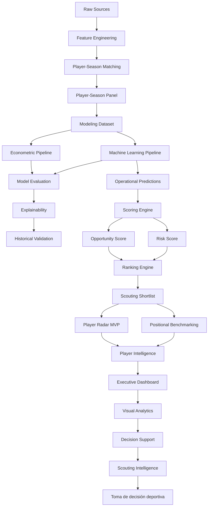

# 📊 Identificación de jugadores infravalorados en el mercado de fichajes europeo


---

# 🧠 Descripción del proyecto

Este proyecto desarrolla un sistema analítico modular para mejorar la
toma de decisiones en scouting y fichajes dentro del fútbol profesional
europeo.

El objetivo principal es estimar el valor de mercado esperado de
futbolistas jóvenes a partir de su rendimiento deportivo y detectar
ineficiencias de mercado que permitan identificar oportunidades de
fichaje bajo una estrategia:

> **Buy low → Sell high**

El sistema combina:

-   Econometría aplicada
-   Machine Learning supervisado
-   Feature engineering deportivo
-   Integración robusta de fuentes heterogéneas
-   Validación temporal out-of-sample
-   Analytics engineering
-   Scouting cuantitativo

La plataforma incorpora actualmente una capa completa de Decision Support y Scouting Intelligence que transforma predicciones en recomendaciones operativas mediante Opportunity Score, Risk Score, rankings automatizados, benchmarking posicional e informes individuales de jugador.

---

# 📑 Tabla de contenidos

-   [🧠 Descripción del proyecto](#-descripción-del-proyecto)
-   [🎯 Problema de negocio](#-problema-de-negocio)
-   [🧩 Objetivos analíticos](#-objetivos-analíticos)
-   [⚙️ Enfoque metodológico](#️-enfoque-metodológico)
-   [🔄 Evolución de arquitectura](#-evolución-de-arquitectura)
-   [🏗️ Analytics Engineering &
    Reproducibility](#️-analytics-engineering--reproducibility)
-   [🧪 Experiment Tracking & Dataset
    Versioning](#-experiment-tracking--dataset-versioning)
-   [📚 Metodología](#-metodología)
-   [⏳ Estrategia de validación
    temporal](#-estrategia-de-validación-temporal)
-   [📦 Fuentes de datos](#-fuentes-de-datos)
-   [⚠️ Problema crítico del proyecto](#️-problema-crítico-del-proyecto)
-   [🛠️ Sistema de matching
    implementado](#️-sistema-de-matching-implementado)
-   [📈 Resultados del matching](#-resultados-del-matching)
-   [🏗️ Arquitectura del pipeline](#️-arquitectura-del-pipeline)
-   [📊 Dataset final](#-dataset-final)
-   [📈 Pipeline econométrico](#-pipeline-econométrico)
-   [🤖 Pipeline Machine Learning](#-pipeline-machine-learning)
-   [🎯 Scouting Scoring Engine](#-scouting-scoring-engine)
-   [📋 Automated Ranking Engine](#-automated-ranking-engine)
-   [💡 Inefficiency Score](#-inefficiency-score)
-   [📤 Business Outputs](#-business-outputs)
-   [📂 Estructura del proyecto](#-estructura-del-proyecto)
-   [▶️ Ejecución reproducible](#️-ejecución-reproducible)
-   [📊 Resultados actuales](#-resultados-actuales)
-   [⚖️ Trade-offs metodológicos](#️-trade-offs-metodológicos)
-   [🚀 Próximos pasos](#-próximos-pasos)
-   [🧠 Valor del proyecto](#-valor-del-proyecto)
-   [👤 Autores](#-autores)

---

# 🎯 Problema de negocio

Los clubes toman decisiones de fichaje basándose en:

-   scouting tradicional
-   intuición
-   métricas limitadas
-   análisis parcialmente subjetivos

Sin embargo, el mercado presenta ineficiencias derivadas de:

-   información incompleta
-   sesgos mediáticos
-   diferencias estructurales entre ligas
-   asimetrías de información

👉 Este proyecto busca responder:

## ❓ ¿Qué jugadores están infravalorados respecto a su rendimiento real?

---

# 🧩 Objetivos analíticos

El sistema busca:

-   estimar el valor de mercado esperado
-   detectar jugadores infravalorados
-   construir rankings cuantitativos de scouting
-   analizar diferencias estructurales entre ligas
-   comparar econometría vs machine learning
-   generar outputs interpretables para toma de decisiones

---

# ⚙️ Enfoque metodológico

## Unidad de análisis

``` text
Jugador – Temporada
```

Cada observación representa:

-   rendimiento deportivo
-   contexto competitivo
-   valor de mercado
-   características demográficas

de un jugador en una temporada concreta.

---

# 🔄 Evolución de arquitectura

El proyecto comenzó como un entorno exploratorio basado principalmente
en notebooks y evolucionó hacia una arquitectura modular reproducible
orientada a analytics engineering y modelización escalable.

Actualmente:

-   los notebooks se utilizan para EDA, validación e interpretación
-   la ejecución principal se realiza mediante pipelines modulares
-   los outputs son reproducibles y versionables
-   los modelos pueden persistirse y reutilizarse
-   la validación temporal está centralizada
-   los artefactos de modelización quedan desacoplados del código
    analítico

Esta evolución permitió transformar el proyecto desde un prototipo
exploratorio hacia un sistema analítico estructurado y reproducible.

---

# 🏗️ Analytics Engineering & Reproducibility

El proyecto adopta principios de analytics engineering:

-   separación modular de pipelines
-   outputs reproducibles
-   persistencia de artefactos
-   trazabilidad de transformaciones
-   configuración desacoplada
-   validación temporal centralizada

Separación explícita entre:

``` text
raw data
processed data
modeling data
artifacts
business outputs
```

La arquitectura facilita:

-   mantenibilidad
-   escalabilidad
-   auditoría metodológica
-   replicabilidad académica
-   despliegue futuro

---

# 🧪 Experiment Tracking & Dataset Versioning

El proyecto incorpora un sistema de trazabilidad experimental orientado
a garantizar:

-   reproducibilidad
-   auditoría metodológica
-   comparación entre ejecuciones
-   persistencia de experimentos
-   control de versiones del dataset

---

## MLflow

Se implementó integración completa con:

``` text
MLflow
```

El sistema registra automáticamente:

-   métricas
-   hiperparámetros
-   configuración experimental
-   artifacts generados
-   metadata del dataset
-   timestamps
-   validación temporal utilizada

---

## Información registrada por experimento

Cada ejecución almacena automáticamente:

``` text
model_name
dataset_version
dataset_hash
train_period
test_period
features
metrics
artifacts
execution_timestamp
```

---

## Dataset Versioning

Se implementó versionado lógico del dataset modelizable.

Ejemplo:

``` text
player_season_modeling_v1
player_season_modeling_v2
player_season_modeling_v3
```

Cada versión almacena:

-   hash SHA256
-   número de filas
-   número de columnas
-   pipeline generador
-   fecha de creación

Metadata persistida en:

``` text
artifacts/metadata/
```

---

## Validación temporal reproducible

El pipeline econométrico utiliza:

``` text
strict temporal out-of-sample validation
```

Split actual:

| Split | Temporadas |
|---|---|
| Train | 2019-2020 → 2023-2024 |
| Test | 2024-2025 |

---

## Consideración metodológica importante

Los modelos predictivos temporales no utilizan:

``` text
season fixed effects
```

durante inferencia out-of-sample, ya que la temporada futura no existe
durante entrenamiento y generaría leakage estructural.

Sin embargo:

-   league FE
-   position FE

sí se mantienen para capturar heterogeneidad estructural del mercado.

---

## Artefactos experimentales

Los experimentos generan automáticamente:

``` text
mlruns/
artifacts/
reports/
```

Incluyendo:

-   métricas exportadas
-   rankings
-   metadata
-   outputs de scoring
-   predicciones
-   modelos persistidos

---

# 📚 Metodología

El proyecto sigue una adaptación de:

``` text
CRISP-DM
```

## Estado actual

``` text
Evaluation
↓
Decision Support
↓
Current Scouting
↓
Player Intelligence
↓
Scouting Intelligence
```

---

# ⏳ Estrategia de validación temporal

El sistema utiliza validación temporal estricta para evitar leakage
temporal y reproducir escenarios reales de scouting.

| Split | Temporadas |
|---|---|
| Train | 2019-2020 → 2023-2024 |
| Test | 2024-2025 |

👉 No se utiliza random split.

## Justificación

El random split:

-   rompe coherencia temporal
-   introduce leakage
-   genera optimismo artificial
-   sobreestima capacidad predictiva

La validación temporal reproduce un entorno real de scouting donde el
modelo debe generalizar hacia temporadas futuras.

---

# 📦 Fuentes de datos

## Transfermarkt / Kaggle Player Scores

### Variables principales

-   valor de mercado
-   edad
-   club
-   posición
-   historial de traspasos

### Uso

-   target principal
-   construcción del Inefficiency Score
-   contexto de mercado

### Dataset utilizado

``` text
Kaggle — davidcariboo/player-scores
```

---

## FBref

### Variables principales

-   estadísticas por 90 minutos
-   métricas ofensivas
-   métricas defensivas
-   métricas de posesión

### Uso

-   variables explicativas
-   feature engineering deportivo

---

## Understat (pendiente)

### Variables previstas

-   xG
-   xA

### Uso previsto

-   métricas ofensivas ajustadas por calidad
-   mejora del signal predictivo

---

# ⚠️ Problema crítico del proyecto

# Integración FBref ↔ Transfermarkt

Uno de los principales retos del proyecto es el matching entre ambas
fuentes.

## Problemas estructurales

-   ❌ no existe identificador único común
-   ❌ nombres inconsistentes
-   ❌ transliteraciones
-   ❌ diferencias de clubes
-   ❌ diferencias de edad
-   ❌ cambios intra-temporada
-   ❌ granularidad distinta

👉 Este problema consumió aproximadamente el 40-50% del trabajo técnico
total.

---

# 🛠️ Sistema de matching implementado

Se desarrolló un pipeline jerárquico robusto.

## 1️⃣ Normalización de nombres

-   lowercase
-   eliminación de acentos
-   limpieza de strings

---

## 2️⃣ Matching exacto

-   nombre
-   temporada
-   edad aproximada

---

## 3️⃣ Validación por club

-   fuzzy matching
-   similarity score

---

## 4️⃣ Matching fuzzy

-   RapidFuzz
-   token sort ratio
-   threshold elevado

---

## 5️⃣ Validación final

``` python
MAX_AGE_DIFF = 1.5
MIN_CLUB_SCORE = 70
FUZZY_THRESHOLD = 92
```

---

# 📈 Resultados del matching

| Métrica | Resultado |
|---|---:|
| Match rate | ≈88% |
| Observaciones emparejadas | 20,836 |
| Observaciones totales | 23,580 |

## Distribución

| Método | Resultado |
|---|---|
| exact_age_validated | dominante |
| exact_age_club_validated | relevante |
| fuzzy_age_club_validated | residual |

👉 El matching constituye uno de los principales aportes técnicos del
proyecto.

---

# 🏗️ Arquitectura del pipeline



---

# 📊 Dataset final

## Panel completo

| Métrica | Valor |
|----------|----------:|
| Observaciones | 24,194 |
| Temporadas | 2019-2020 → 2025-2026 |
| Ligas | 7 |

---

## Dataset modelizable

| Métrica | Valor |
|----------|----------:|
| Observaciones | 3,916 |
| Jugadores únicos | 2,136 |
| Edad | 18–23 |

### Distribución temporal

| Temporada | Observaciones |
|------------|------------:|
| 2019-2020 | 537 |
| 2020-2021 | 536 |
| 2021-2022 | 544 |
| 2022-2023 | 542 |
| 2023-2024 | 586 |
| 2024-2025 | 552 |
| 2025-2026 | 619 |

---

## Distribución por liga

| Liga | Observaciones |
|--------|------------:|
| Ligue 1 | 731 |
| Eredivisie | 660 |
| Serie A | 578 |
| Premier League | 545 |
| Bundesliga | 529 |
| LaLiga | 453 |
| Liga Portugal | 420 |

---

## Distribución por posición

| Posición | Observaciones |
|------------|------------:|
| MID | 2,042 |
| DEF | 1,358 |
| ATT | 407 |
| GK | 109 |

---

## Ligas incluidas

- Premier League
- LaLiga
- Bundesliga
- Serie A
- Ligue 1
- Eredivisie
- Liga Portugal

### Contribución Sprint 10.3

La incorporación de la temporada 2025-2026 permitió ampliar el dataset modelizable desde 3.297 hasta 3.916 observaciones manteniendo la estabilidad de los modelos predictivos y mejorando la representatividad temporal del sistema.

---

# 📈 Pipeline econométrico

``` text
src/models/econometric/
```

---

## Arquitectura

El pipeline econométrico está completamente modularizado.

### Componentes principales

-   `specifications.py`
-   `train_ols.py`
-   `evaluate_ols.py`
-   `run_ols_pipeline.py`

---

## Funcionalidades

-   fórmula OLS centralizada
-   efectos fijos
-   HC3 robust covariance
-   scoring automático
-   rankings automáticos
-   export de outputs
-   evaluación temporal
-   experiment tracking
-   dataset versioning
-   MLflow logging
-   temporal split reproducible

---

## Modelo econométrico final

Regresión OLS con:

-   league FE
-   position FE
-   HC3 robust standard errors
-   validación temporal estricta out-of-sample

---

## Consideración metodológica

Los season fixed effects se utilizan únicamente en análisis explicativos
e in-sample.

Para validación temporal futura:

``` text
season FE se desactiva
```

para evitar problemas de generalización hacia temporadas no observadas
durante entrenamiento.

---

## Variable objetivo

``` python
log_market_value_eur
```

---

## Especificación principal

``` python
log_market_value_eur ~
age +
log_minutes_played +
goals_per90 +
assists_per90 +
league FE +
position FE
```

---

## Outputs generados

``` text
reports/tables/
reports/rankings/
reports/model_diagnostics/
```

Outputs:

-   métricas OLS
-   coeficientes
-   rankings infravalorados
-   rankings sobrevalorados
-   residuos
-   tablas VIF

---

# 🤖 Pipeline Machine Learning

``` text
src/models/machine_learning/
```

---

## Modelos implementados

-   Random Forest
-   HistGradientBoosting
-   XGBoost
-   LightGBM

---

## Funcionalidades

-   preprocessing pipeline
-   one-hot encoding
-   temporal validation
-   feature importance
-   model persistence
-   export automático

---

## Arquitectura ML

El pipeline ML incluye:

-   preprocessing desacoplado
-   entrenamiento modular
-   evaluación centralizada
-   persistencia de modelos

---

## Persistencia de modelos

Los modelos entrenados se almacenan en:

``` text
artifacts/models/
```

Esto permite:

-   reutilización
-   comparación entre ejecuciones
-   scoring posterior
-   reproducibilidad
-   potencial despliegue futuro

---

## Outputs ML

``` text
artifacts/
reports/
```

Outputs:

-   métricas ML
-   feature importance
-   predicciones out-of-sample
-   modelos persistidos

---

# 🎯 Scouting Scoring Engine

Sprint 5 introduce una capa analítica orientada a convertir las
predicciones del modelo en una herramienta de apoyo real para scouting
profesional.

## Arquitectura del scoring

``` text
Predictions
↓
Inefficiency Score
↓
Growth Score
↓
Confidence Score
↓
Opportunity Score
↓
Automated Rankings
```

## Opportunity Score

``` python
opportunity_score =
0.55 × inefficiency_score_z
+ 0.25 × growth_score_z
+ 0.20 × confidence_score_z
```

Resultados actuales:

| Métrica | Valor |
|----------|----------:|
| Jugadores evaluados | 619 |
| Scouting Targets | 7 |
| High Priority + Targets | 70 |
---

## Risk Scoring Framework

Sprint 10 incorpora una nueva capa analítica orientada a evaluar la incertidumbre asociada a cada oportunidad de scouting.

Mientras que Opportunity Score mide el potencial relativo de mercado identificado por el sistema, Risk Score estima el nivel de riesgo asociado a cada recomendación.

### Objetivo

Incorporar una dimensión explícita de riesgo para evitar priorizar únicamente jugadores con alto upside potencial.

La evaluación combina señales relacionadas con:

- estabilidad del rendimiento
- robustez estadística de la muestra
- confianza de las predicciones
- consistencia competitiva

### Interpretación

| Risk Score | Interpretación |
|------------|----------------|
| Bajo | Perfil estable y validado |
| Medio | Riesgo moderado |
| Alto | Perfil con elevada incertidumbre |

### Aplicación

La combinación de Opportunity Score y Risk Score permite distinguir entre:

```text
High Potential / Low Risk
High Potential / High Risk
Moderate Potential / Low Risk
Moderate Potential / High Risk
```

Esta capa aproxima el sistema a procesos reales de toma de decisiones utilizados en departamentos de scouting profesional.

---

# 📋 Automated Ranking Engine

Outputs generados:

``` text
top_undervalued_global.csv
top_undervalued_by_league.csv
top_undervalued_by_position.csv
top_high_potential.csv
top_low_risk.csv
scouting_shortlist.csv
```

# 💡 Inefficiency Score

El sistema estima:

``` python
inefficiency_score =
valor_estimado - valor_observado
```

## Interpretación

| Score | Interpretación |
|---|---|
| Positivo | posible infravaloración |
| Negativo | posible sobrevaloración |

---

# 📤 Business Outputs

``` text
reports/rankings/
```

El sistema genera automáticamente:

-   jugadores infravalorados
-   jugadores sobrevalorados
-   rankings por liga
-   rankings por posición
-   scouting shortlists
-   feature importance
-   diagnostics
-   predicciones

---

# 📊 Opportunity vs Risk Matrix

Sprint 10 incorpora una matriz estratégica diseñada para facilitar la priorización de objetivos de scouting.

La visualización combina:

- Opportunity Score
- Risk Score

permitiendo segmentar automáticamente los jugadores según su perfil de riesgo-retorno.

## Interpretación estratégica

| Zona | Interpretación |
|--------|---------------|
| Alta oportunidad + bajo riesgo | Prioridad máxima |
| Alta oportunidad + alto riesgo | Apuesta estratégica |
| Oportunidad moderada + bajo riesgo | Seguimiento recomendado |
| Oportunidad moderada + alto riesgo | Baja prioridad |

## Objetivo

Transformar señales analíticas complejas en una herramienta visual orientada a la toma de decisiones deportivas.

Esta matriz constituye la primera implementación de una capa explícita de gestión del riesgo dentro del sistema de scouting.

---

# 🖥️ Dashboard de scouting

Sprint 7 introduce la primera interfaz interactiva del proyecto desarrollada mediante Streamlit.

## Objetivo

Transformar los outputs analíticos generados por los modelos, rankings y métricas de evaluación en una herramienta visual accesible para procesos de scouting cuantitativo.

## Funcionalidades principales

### 📊 Executive KPIs

Visualización integrada de indicadores clave:

* Jugadores en shortlist
* Precision@K
* Positive ROI Rate
* Ligas representadas

### 📋 Ranking interactivo

Exploración dinámica de jugadores mediante:

* Paginación
* Ordenación por Opportunity Score
* Segmentación por liga
* Segmentación por posición
* Segmentación por club
* Segmentación por temporada

### 👤 Informe individual de jugador

Visualización detallada de cada perfil:

* Valor de mercado actual
* Valor estimado por el modelo
* Gap de mercado
* Opportunity Score
* Growth Score
* Confidence Score
* Ranking dentro de la shortlist
* Recomendación analítica

### 🔍 Explainability

Integración de mecanismos de interpretabilidad:

* SHAP local
* Drivers positivos
* Drivers negativos
* Interpretación ejecutiva de predicciones

## Arquitectura funcional

```text
Modelos predictivos
↓
Scoring Engine
↓
Ranking Engine
↓
Explainability
↓
Dashboard Scouting
```

## Contribución

Sprint 7 constituye la primera capa de consumo de resultados del proyecto y conecta el sistema analítico con una interfaz interactiva orientada a usuarios de negocio.

Las capacidades avanzadas de Visual Analytics, segmentación estratégica y soporte a decisiones fueron desarrolladas posteriormente dentro del Sprint 9 — Executive Dashboard & Decision Support Layer.


## Sprint 8 — Reserved

Tras la revisión académica del proyecto, el Sprint 8 fue reservado y no se ejecutó como fase independiente.

Las funcionalidades inicialmente previstas evolucionaron hacia una capa completa de soporte a decisiones integrada posteriormente dentro del Sprint 9.

Esta decisión permitió evitar duplicidades funcionales y mantener una hoja de ruta más coherente para la evolución de la plataforma de scouting.

**Status:** Reserved.

## Sprint 9 — Executive Dashboard & Decision Support Layer

Sprint 9 consolida la evolución del proyecto desde un sistema de modelización y ranking hacia una plataforma de Football Analytics orientada a soporte de decisiones para scouting profesional.

### Objetivo

Reducir la distancia entre los resultados de los modelos y la toma de decisiones deportivas mediante visual analytics, segmentación avanzada y síntesis ejecutiva.

---

### Sprint 9.1 — Executive Scouting Filters

Se incorpora una capa de exploración dinámica del mercado basada en filtros ejecutivos y presets de scouting.

#### Funcionalidades implementadas

* presets de scouting
* filtros automáticos sin refresco manual
* universo modelado visible
* shortlist ejecutiva
* métricas de cobertura
* filtros activos visibles

#### Variables de segmentación

* Liga
* Posición
* Edad
* Opportunity Score
* Confidence Score

Resultado:

El dashboard evoluciona desde un ranking estático hacia una herramienta interactiva de exploración y priorización.

---

### Sprint 9.2 — Visual Analytics & Opportunity Matrix

#### 💎 Coste actual vs Upside estimado

Nueva matriz estratégica basada en:

* Valor de mercado actual
* Gap de mercado estimado
* Opportunity Score
* Tier de oportunidad

Cada jugador se representa mediante una burbuja donde:

* Eje X → coste actual de adquisición
* Eje Y → upside estimado
* Tamaño → Opportunity Score
* Color → prioridad de scouting

#### 📌 Segmentación estratégica

| Zona                  | Interpretación                       |
| --------------------- | ------------------------------------ |
| Comprar / priorizar   | Bajo coste y alto upside             |
| Oportunidades premium | Alto upside con mayor coste          |
| Seguimiento           | Interés moderado para monitorización |
| Menor prioridad       | Menor relación coste-potencial       |

#### 🏅 Top 5 destacados

Identificación automática de los cinco jugadores con mayor Opportunity Score dentro de los filtros activos.

#### 📈 Hallazgos ejecutivos

Indicadores incorporados:

* candidatos prioritarios
* oportunidades premium
* score oportunidad medio
* upside agregado identificado
* liga dominante

### Contribución metodológica

Sprint 9 representa la primera implementación completa de una capa DSS (Decision Support System) aplicada al mercado de fichajes.

El flujo operativo queda definido como:

```text
Predicción
↓
Scoring
↓
Ranking
↓
Visual Analytics
↓
Decision Support
↓
Scouting
↓
Decisión deportiva
```

### Impacto sobre el proyecto

La plataforma deja de ser únicamente un sistema predictivo para convertirse en una herramienta de priorización de talento y soporte cuantitativo a decisiones deportivas.

## Sprint 10 en el Dashboard

El sprint 10 incorpora:

• Risk Score
• Opportunity ajustada por riesgo
• Opportunity vs Risk Matrix
• Player Radar MVP
• Positional Benchmarking
• Player Intelligence Layer

---

# 🚀 Sprint 10 — Scouting Intelligence Platform

Sprint 10 representa la evolución más importante del proyecto desde su inicio.

La plataforma deja de funcionar únicamente como un sistema predictivo y de ranking para convertirse en una herramienta integral de Scouting Intelligence orientada a la identificación, priorización y evaluación de talento en el mercado de fichajes.

La principal contribución metodológica de esta fase es la separación explícita entre:

```text
Historical Evaluation Layer
↓
Current Scouting Layer
↓
Player Intelligence Layer
↓
Decision Support Layer
```

Esta arquitectura evita mezclar validación histórica con evaluación operativa de jugadores actuales y aproxima el funcionamiento del sistema a un entorno real de Football Analytics profesional.

---

## Sprint 10.1 — Player Radar MVP & Positional Benchmarking

### Objetivo

Transformar la shortlist cuantitativa en una herramienta de scouting explicativa mediante benchmarking dinámico y análisis individual de jugadores.

Hasta este momento el sistema identificaba oportunidades de mercado, pero no proporcionaba contexto visual suficiente para comprender el perfil deportivo de cada candidato.

Sprint 10.1 introduce una primera capa de Player Intelligence basada en comparación relativa mediante percentiles.

### Funcionalidades implementadas

#### 📡 Player Radar MVP

Se incorpora un radar interactivo basado en percentiles relativos al benchmark seleccionado.

Para mediocampistas y atacantes:

```text
Minutos
Goles/90
Asistencias/90
G+A/90
Growth Score
Confidence Score
```

Para defensores y porteros el sistema queda preparado para incorporar métricas específicas cuando existan en el dataset operativo.

#### 📊 Positional Benchmarking

Comparación dinámica frente a:

```text
Jugadores de la misma posición
o
Universo completo de scouting
```

El benchmark se recalcula automáticamente según la selección realizada por el usuario.

#### 🧾 Scouting Cards

Se generan tarjetas analíticas para cada dimensión evaluada:

```text
P97
Elite

P45
Promedio

P12
Bajo
```

facilitando la interpretación ejecutiva del perfil del jugador.

#### 🤖 Scouting Narrative

El sistema genera automáticamente una lectura descriptiva basada en los percentiles observados.

Ejemplo:

```text
El jugador destaca principalmente en Growth Score y minutos disputados, mostrando una señal sólida de desarrollo potencial.
```

### Contribución metodológica

Sprint 10.1 introduce la primera implementación de:

```text
Player Intelligence Layer
```

permitiendo interpretar perfiles individuales más allá del ranking cuantitativo.

---

## Sprint 10.2 — FBref Advanced Metrics Audit

### Objetivo

Evaluar la viabilidad técnica de incorporar métricas avanzadas de FBref para enriquecer el sistema de scouting.

Antes de ampliar el radar era necesario validar qué tablas y métricas podían integrarse de forma robusta dentro del pipeline actual.

### Auditoría realizada

Se analizaron las tablas:

```text
Shooting
Defense
Misc
Playing Time
Passing
Possession
Goal & Shot Creation
```

### Resultados

#### Alta viabilidad

```text
shots_per90
shots_on_target_per90
tackles_won_per90
interceptions_per90
blocks_per90
fouls_drawn_per90
crosses_per90
minutes_per_match
```

#### Viabilidad parcial

```text
Passing
Possession
Goal Creation
```

debido a limitaciones estructurales del dataset disponible.

### Impacto

Sprint 10.2 genera el roadmap técnico para la siguiente evolución del sistema:

```text
Advanced Football Radar
```

basado en métricas deportivas reales y comparables con herramientas profesionales de scouting.

---

## Sprint 10.3 — Current Season Scouting Refresh

### Objetivo

Actualizar la plataforma para operar sobre el mercado actual mediante la incorporación de la temporada 2025-2026.

Hasta este punto el sistema se centraba principalmente en la evaluación histórica y validación temporal de modelos. Sprint 10.3 introduce una capa operativa específica orientada al scouting actual mediante la incorporación de la temporada 2025-2026.

### Funcionalidades implementadas

#### ⚽ Integración temporada 2025-2026

Actualización completa de:

```text
FBref
Transfermarkt
Matching
Feature Engineering
Modeling Dataset
```

#### 🤖 Reentrenamiento integral

Se reconstruyen:

```text
Pipeline econométrico
Pipeline Machine Learning
Scoring Engine
Ranking Engine
```

utilizando el dataset ampliado.

#### 📈 Operational Scouting Layer

Generación automática de:

```text
Shortlist actualizada
Opportunity Score
Risk Score
Risk-adjusted Opportunity
```

sobre jugadores activos del mercado actual.

### 📊 Separación entre evaluación histórica y scouting operativo

Sprint 10.3 introduce una separación explícita entre dos capas analíticas diferenciadas:

#### Historical Evaluation Layer

Utilizada para:

- validación temporal
- comparación de modelos
- backtesting
- análisis metodológico
- memoria académica

Artefactos principales:

```text
player_season_modeling_indices.parquet
tuned_xgboost_test_predictions.csv
tuned_xgboost_full_predictions.csv
```

#### Current Scouting Layer

Utilizada para:

- rankings operativos
- dashboard
- scouting actual
- identificación de oportunidades de mercado

Artefactos principales:

```text
tuned_xgboost_predictions.csv
scoring_dataset.csv
scouting_shortlist.csv
scouting_shortlist_with_risk.csv
```

Esta separación evita mezclar oportunidades históricas con recomendaciones actuales y mejora la validez externa del sistema como herramienta de apoyo a decisiones deportivas.

#### 🎯 Risk Scoring Framework

Se incorpora una nueva dimensión de evaluación basada en riesgo analítico.

La oportunidad de fichaje deja de evaluarse únicamente por potencial de mercado e incorpora una medida explícita de incertidumbre.

Esto permite distinguir entre:

```text
High Potential / Low Risk
High Potential / High Risk
Moderate Potential / Low Risk
Moderate Potential / High Risk
```

#### 📊 Opportunity vs Risk Matrix

Se implementa una matriz estratégica para priorizar objetivos de scouting en función de:

```text
Opportunity Score
Risk Score
```

permitiendo identificar perfiles prioritarios y apuestas estratégicas.

### Contribución metodológica

Sprint 10.3 introduce una separación explícita entre:

```text
Historical Evaluation Layer
```

utilizada para validación temporal y evaluación metodológica,

y

```text
Current Scouting Layer
```

utilizada para generación de recomendaciones operativas.

Esta separación constituye una de las principales mejoras metodológicas del proyecto y refuerza la validez de los resultados obtenidos.

---

## Arquitectura funcional actual

La evolución completa del sistema puede resumirse mediante el siguiente flujo:

```text
Raw Data
↓
Feature Engineering
↓
Modeling Dataset
↓
Econometric & ML Models
↓
Historical Evaluation Layer
↓
Operational Scoring Layer
↓
Ranking Engine
↓
Player Intelligence Layer
↓
Executive Dashboard
↓
Decision Support Layer
↓
Scouting Intelligence
↓
Toma de decisión deportiva
```

---

## Impacto sobre el proyecto

Tras Sprint 10, la plataforma evoluciona desde un sistema predictivo hacia una solución completa de Football Analytics orientada a scouting profesional.

Las capacidades actuales incluyen:

* estimación de valor de mercado esperado
* identificación de ineficiencias de mercado
* scoring multicriterio de oportunidades
* evaluación explícita del riesgo
* rankings automatizados
* benchmarking posicional
* radar individual de jugador
* interpretabilidad mediante SHAP
* visual analytics interactivo
* soporte cuantitativo a decisiones deportivas

La plataforma constituye actualmente una primera versión funcional de un sistema de Scouting Intelligence aplicado al mercado de fichajes europeo.

# 📂 Estructura del proyecto

``` bash
market-value-football-tfm/

├── app/                                   # Aplicación interactiva y capa Decision Support
│   ├── streamlit_app.py                   # Executive Dashboard
│   └── utils/                             # Utilidades específicas del dashboard
│       ├── charts.py                      # Visualizaciones y gráficos interactivos
│       ├── formatters.py                  # Formateo de KPIs, métricas y valores monetarios
│       └── loaders.py                     # Carga de datos y outputs analíticos
│
├── artifacts/                             # Artefactos persistidos de modelos y predicciones
│   ├── encoders/                          # Encoders categóricos serializados
│   ├── feature_importance/                # Importancia de variables exportada
│   ├── metadata/                          # Metadata y hashes de datasets versionados
│   ├── models/                            # Modelos entrenados (.joblib)
│   ├── predictions/                       # Predicciones persistidas
│   └── scalers/                           # Transformadores numéricos serializados
│
├── config/                                # Configuración centralizada del sistema
│   ├── config.yaml
│   ├── config_backup.yaml
│   ├── features.yaml                      # Configuración de feature engineering
│   ├── matching.yaml                      # Parámetros de matching
│   ├── modeling.yaml                      # Configuración de modelización
│   ├── paths.yaml                         # Paths del proyecto
│   ├── project.yaml                       # Configuración global
│   ├── scoring.yaml                       # Configuración de scoring y rankings
│   └── validation.yaml                    # Configuración centralizada de validación temporal
│
├── data/
│   ├── external/                          # Datos auxiliares externos
│   ├── interim/                           # Datos parcialmente transformados
│   ├── processed/                         # Datasets finales reutilizables
│   └── raw/                               # Datos originales sin procesar
│
├── docs/                                  # Documentación técnica y metodológica
│   ├── architecture.md                    # Arquitectura completa del sistema
│   ├── data_dictionary.md                 # Diccionario de variables y outputs
│   ├── data_quality.md                    # Evaluación de calidad de datos
│   ├── data_sources.md                    # Fuentes de datos y matching
│   ├── feature_engineering_plan.md        # Roadmap de feature engineering
│   ├── modeling_decisions.md              # Decisiones metodológicas de modelización
│   ├── pipeline_reference.md              # Referencia técnica de pipelines
│   ├── README.md                          # Índice central de documentación
│   └── schema_decisions.md                # Diseño de esquema y arquitectura de datos
│
├── logs/                                  # Logs de ejecución y debugging
│
├── mlruns/                                # Tracking experimental MLflow
│
├── notebooks/                             # Notebooks exploratorios y análisis
│   ├── 01_data_understanding.ipynb
│   ├── 02_econometric_baseline.ipynb
│   ├── 03_econometric_model.ipynb
│   └── 04_supervised_machine_learning.ipynb
│
├── reports/                               # Outputs analíticos y reporting
│   ├── figures/                           # Visualizaciones
│   ├── model_diagnostics/                 # Diagnósticos de modelos
│   ├── rankings/                          # Rankings scouting
│   ├── scouting_reports/                  # Reports automáticos futuros
│   └── tables/                            # Métricas y tablas exportadas
│
├── src/                                   # Lógica principal del sistema
│   ├── data/                              # Ingesta, matching y datasets
│   ├── features/                          # Feature engineering
│   ├── models/
│   │   ├── econometric/                   # Pipeline OLS
│   │   ├── evaluation/                    # Métricas y comparación
│   │   ├── machine_learning/              # Pipelines ML
│   │   └── scoring/                       # Inefficiency scoring
│   └── utils/                             # Utilidades compartidas
│       ├── config.py                      # Loader centralizado de configuración YAML
│       ├── dataset_versioning.py          # Versionado y hashing de datasets
│       └── experiment_tracking.py         # Integración MLflow
│
├── tests/                                 # Tests futuros
│
├── environment.yml                        # Entorno Conda
├── PROJECT_STATUS.md                      # Estado operativo del proyecto
├── README.md                              # Documentación principal
├── requirements-lock.txt                  # Dependencias fijadas
└── requirements.txt                       # Dependencias Python
```

---

# ▶️ Ejecución reproducible

## 1️⃣ Construir features FBref

``` bash
python -m src.data.build_fbref_features
```

---

## 2️⃣ Construir features Transfermarkt

``` bash
python -m src.data.build_transfermarkt_features
```

---

## 3️⃣ Construir panel jugador--temporada

``` bash
python -m src.data.build_player_season_panel
```

---

## 4️⃣ Construir dataset modelizable

``` bash
python -m src.data.build_modeling_dataset
```

---

## 5️⃣ Ejecutar pipeline econométrico

``` bash
python -m src.models.econometric.run_ols_pipeline
```

---

## 6️⃣ Ejecutar pipeline Machine Learning

``` bash
python -m src.models.machine_learning.run_ml_pipeline
```

---


## 7️⃣ Ejecutar Scoring Engine

```bash
python -m src.models.scoring.build_inefficiency_score
python -m src.models.scoring.build_growth_score
python -m src.models.scoring.build_confidence_score
python -m src.models.scoring.build_opportunity_score
python -m src.models.scoring.generate_rankings
```

---

## 8️⃣ Ejecutar capa de evaluación

```bash
python -m src.models.evaluation.build_ranking_diagnostics
python -m src.models.evaluation.build_roi_simulation
python -m src.models.evaluation.build_precision_at_k
```

---

# 📊 Resultados actuales

## Modelo econométrico final

Evaluación realizada mediante validación temporal estricta
out-of-sample.

| Modelo | MAE | RMSE | R² |
|---|---:|---:|---:|
| OLS temporal final | 0.7947 | 0.9887 | 0.4366 |

---

## Interpretación metodológica

La degradación mínima respecto a modelos in-sample sugiere que:

``` text
el modelo mantiene capacidad explicativa robusta al generalizar hacia temporadas futuras
```

y que la señal predictiva proviene principalmente de variables
deportivas y contextuales, no de sobreajuste temporal.

---

## 🤖 Machine Learning

Tras la actualización completa del dataset y la incorporación de la temporada 2025-2026, se reentrenaron todos los modelos supervisados utilizando el dataset modelizable actualizado.

### Resultados finales

| Modelo | MAE | RMSE | R² |
|----------|----------:|----------:|----------:|
| Growth OLS | 0.7287 | 0.9053 | 0.5258 |
| Tuned Random Forest | 0.7486 | 0.9303 | 0.4980 |
| Tuned LightGBM | 0.7307 | 0.9052 | 0.5248 |
| HistGradientBoosting | 0.7292 | 0.9011 | 0.5291 |
| Tuned XGBoost | **0.7120** | **0.8892** | **0.5414** |

---

### Modelo ganador

```text
Tuned XGBoost
```

Métricas finales:

```text
RMSE = 0.8892
MAE  = 0.7120
R²   = 0.5414
```

---

### Interpretación metodológica

El modelo Tuned XGBoost mantiene la mejor capacidad predictiva del sistema tras la incorporación de 619 nuevas observaciones correspondientes a la temporada 2025-2026.

La mejora respecto al mejor modelo econométrico sigue siendo moderada:

```text
Growth OLS:
R² = 0.5258

Tuned XGBoost:
R² = 0.5414
```

ΔR² ≈ +0.0156

Este resultado sugiere que la mayor parte de la señal predictiva ya está capturada por variables deportivas y efectos estructurales, reforzando la validez de la aproximación econométrica como benchmark explicativo.

---

### Conclusión

Machine Learning supera consistentemente a la econometría tradicional, pero la diferencia permanece contenida.

Esta evidencia indica que futuras mejoras del sistema dependerán principalmente de:

- nuevas fuentes de datos
- métricas avanzadas de scouting
- enriquecimiento de variables
- ampliación de la señal deportiva

más que de la sustitución de algoritmos.

---

## Principales hallazgos

### 📌 La liga importa estructuralmente

-   Premier League → prima positiva
-   Eredivisie / Liga Portugal → descuentos estructurales

---

### 📌 Variables más relevantes

-   minutos jugados
-   goles por 90
-   asistencias por 90

---

### 📌 Insight metodológico clave

El hecho de que ML solo mejore moderadamente respecto a OLS indica que:

``` text
el principal cuello de botella actual es el signal predictivo del dataset
```

no necesariamente el algoritmo.

Esto refuerza la importancia futura de:

-   feature engineering avanzado
-   xG / xA
-   métricas defensivas
-   métricas de progresión

---

## Sprint 1 --- Positional Normalization Experiment

Se implementó un pipeline adicional de ingeniería de variables para
evaluar si una normalización contextual por posición y competición podía
mejorar la capacidad predictiva del modelo econométrico.

### Features añadidas

``` text
goals_per90_pos_z
assists_per90_pos_z
shots_per90_pos_z
goals_position_percentile
assists_position_percentile
```

Agrupación utilizada:

``` text
[position_group, league]
```

Motivación:

-   reducir sesgo ofensivo
-   mejorar comparabilidad entre jugadores
-   capturar diferencias estructurales entre ligas

### Resultados experimentales

| Modelo | RMSE ↓ | MAE ↓ | R² ↑ |
|---|---:|---:|---:|
| Baseline OLS | 1.0035 | 0.8130 | 0.4160 |
| Advanced Positional OLS | 1.0065 | 0.8166 | 0.4148 |

Conclusión:

Las nuevas variables no produjeron mejoras significativas y mostraron
una ligera degradación del rendimiento.

Las variables se mantienen implementadas y registradas mediante MLflow,
pero no serán incorporadas al modelo econométrico final.

---

## Sprint 2 --- Temporal Dynamics & Growth Features

Se implementó un segundo bloque de ingeniería de variables centrado en
dinámica temporal y progresión del jugador.

La motivación es que el mercado de fichajes no valora únicamente el
rendimiento actual, sino también señales de crecimiento y trayectoria
profesional.

### Variables añadidas

``` text
market_value_growth_prev
delta_log_market_value_prev
age_squared
career_year
breakout_indicator
```

Descripción:

-   market_value_growth_prev → tendencia reciente de valoración
-   delta_log_market_value_prev → velocidad de crecimiento
-   age_squared → relación no lineal entre edad y valor
-   career_year → experiencia acumulada
-   breakout_indicator → identificación de jóvenes en explosión

### Resultados experimentales

| Modelo | RMSE ↓ | MAE ↓ | R² ↑ |
|---|---:|---:|---:|
| Baseline OLS | 1.0035 | 0.8130 | 0.4160 |
| Positional OLS | 1.0065 | 0.8166 | 0.4148 |
| Growth OLS | 0.9046 | 0.7278 | 0.5255 |

Conclusión:

Las variables temporales mejoraron significativamente la capacidad
predictiva del modelo.

El modelo Growth OLS pasa a ser el modelo econométrico preferente para
siguientes iteraciones.

---

## Sprint 3 --- Composite Football Indices

Se implementó un bloque adicional de ingeniería de variables orientado a
construir indicadores agregados de rendimiento futbolístico.

El objetivo no era únicamente mejorar capacidad predictiva sino aumentar
la interpretabilidad del sistema desde una perspectiva de scouting y
toma de decisiones.

### Índices creados

``` text
finishing_index
playmaking_index
growth_index
experience_index
```

Descripción:

-   finishing_index → capacidad ofensiva y finalización
-   playmaking_index → generación ofensiva y creación
-   growth_index → señales de crecimiento reciente
-   experience_index → madurez y experiencia acumulada

### Resultados experimentales

| Modelo | RMSE ↓ | MAE ↓ | R² ↑ |
|---|---:|---:|---:|
| Growth OLS | 0.9046 | 0.7278 | 0.5255 |
| Growth OLS + Composite Indices | 0.9046 | 0.7278 | 0.5255 |

Conclusión:

Los índices compuestos no aportaron mejora predictiva adicional.

Sin embargo, proporcionan una representación más interpretable del
rendimiento deportivo y se mantienen para tareas de scouting y análisis
descriptivo.

---

## Sprint 4 --- Machine Learning Baseline

Se implementó una primera línea base de modelos supervisados para
comparar el rendimiento predictivo frente al modelo econométrico.

El objetivo fue evaluar si modelos no lineales podían capturar
relaciones complejas entre rendimiento deportivo y valor de mercado.

### Modelos evaluados

-   Random Forest
-   XGBoost
-   LightGBM

### Estrategia de validación

Se utilizó división temporal:

``` text
Train: temporadas < 2023
Test: temporadas ≥ 2023
```

Esta decisión evita leakage temporal y simula un escenario real de
predicción futura.

### Resultados

| Modelo | RMSE ↓ | MAE ↓ | R² ↑ |
|---|---:|---:|---:|
| Growth OLS | **0.9046** | **0.7278** | **0.5255** |
| Random Forest | 1.0481 | 0.8527 | 0.3599 |
| XGBoost | 1.0943 | 0.8801 | 0.3022 |
| LightGBM | 1.1078 | 0.8936 | 0.2848 |

Conclusión:

Los modelos ML baseline no superaron al modelo econométrico actual.

---

## Sprint 4B --- Improved Machine Learning Pipeline

Tras comprobar que los modelos supervisados baseline no superaban al
benchmark econométrico, se implementó una segunda iteración del pipeline
de Machine Learning orientada a mejorar la capacidad predictiva mediante
preprocesamiento robusto, ajuste de hiperparámetros y trazabilidad
experimental.

### Objetivo

Mejorar el rendimiento de los modelos supervisados frente al modelo
Growth OLS mediante:

-   validación temporal estricta
-   pipeline de preprocesamiento reproducible
-   búsqueda aleatoria de hiperparámetros
-   registro experimental con MLflow
-   exportación de importancia de variables

### Implementación

Archivo principal:

``` text
src/models/machine_learning/train_ml_tuned.py
```

### Estrategia de validación

Se mantiene la división temporal:

``` text
Train: temporadas < 2023
Test: temporadas >= 2023
```

Esta decisión evita leakage temporal y reproduce un escenario realista
de scouting, donde el modelo se entrena con información histórica y se
evalúa sobre temporadas posteriores.

### Pipeline de preprocesamiento

Se implementó un pipeline basado en:

-   `ColumnTransformer`
-   `SimpleImputer`
-   `StandardScaler`
-   `OneHotEncoder`

Esto permite tratar de forma separada variables numéricas y categóricas,
reduciendo errores manuales y mejorando la reproducibilidad del
entrenamiento.

### Modelos evaluados

-   Tuned Random Forest
-   Tuned XGBoost
-   Tuned LightGBM
-   HistGradientBoosting

### Tuning

Se utilizó:

``` text
RandomizedSearchCV
n_iter = 12
```

El objetivo no fue realizar una búsqueda exhaustiva, sino obtener una
mejora razonable del rendimiento manteniendo control computacional y
trazabilidad metodológica.

### MLflow

Cada experimento registra:

-   hiperparámetros
-   métricas
-   artefactos
-   modelos entrenados
-   feature importance

### Feature importance

Las importancias de variables se exportan en:

``` text
artifacts/feature_importance/
```

### Resultados

| Modelo | RMSE ↓ | MAE ↓ | R² ↑ |
|---|---:|---:|---:|
| Growth OLS | 0.9046 | 0.7278 | 0.5255 |
| Tuned Random Forest | 0.9076 | 0.7315 | 0.5200 |
| Tuned XGBoost | **0.8753** | **0.7004** | **0.5536** |
| Tuned LightGBM | 0.8864 | 0.7162 | 0.5421 |
| HistGradientBoosting | 0.8825 | 0.7118 | 0.5462 |

### Conclusión

El pipeline mejorado de Machine Learning supera por primera vez al
modelo econométrico Growth OLS.

El mejor modelo actual es:

``` text
Tuned XGBoost
```

con:

``` text
R² = 0.5536
RMSE = 0.8753
MAE = 0.7004
```

La mejora relativa respecto a Growth OLS es aproximadamente del 5.3% en
R².

Este resultado justifica metodológicamente la transición desde un
enfoque puramente econométrico hacia modelos supervisados más complejos,
manteniendo la econometría como benchmark interpretable y utilizando
Machine Learning como capa predictiva adicional.

No obstante, la mejora sigue siendo moderada, por lo que la siguiente
fase debe centrarse en explicabilidad, feature importance y análisis
SHAP para convertir el modelo en una herramienta interpretable de
scouting cuantitativo.

---

## Sprint 4C --- Explainability + Player-Level SHAP Analysis

Tras obtener un modelo supervisado con mejor rendimiento predictivo que
el benchmark econométrico, el siguiente paso consistió en incorporar
mecanismos de explicabilidad que permitieran interpretar las
predicciones y convertir el sistema en una herramienta útil para
scouting profesional.

### Objetivo

Transformar el mejor modelo predictivo actual en un sistema explicable
mediante:

-   feature importance comparativa
-   SHAP global
-   SHAP local por jugador
-   informes automáticos de scouting

### Implementación

Nuevos módulos:

``` text
src/models/explainability/

├── build_feature_importance_comparison.py
├── build_shap_analysis.py
├── build_player_shap_report.py
```

### Outputs generados

``` text
reports/tables/explainability/

├── feature_importance_comparison_top10.csv
├── shap_global_importance.csv

reports/figures/explainability/

├── feature_importance_comparison_top10.png
├── shap_summary.png

reports/scouting_reports/

├── player_shap_report.csv
```

### Feature importance comparativa

Se construyó una comparación agregada entre:

-   Random Forest
-   Tuned Random Forest
-   Tuned XGBoost
-   Tuned LightGBM
-   Gradient Boosting

El objetivo fue identificar qué variables muestran una señal consistente
independientemente del algoritmo utilizado.

Resultados destacados:

-   experience_index
-   goals_position_percentile
-   log_minutes_played
-   finishing_index
-   playmaking_index

### SHAP Global Importance

La explicación basada en SHAP permitió estimar la contribución real de
cada variable sobre las predicciones individuales.

Top variables observadas:

| Variable | Importancia |
|---|---:|
| matches_played | 1.199 |
| age_fbref | 0.697 |
| minutes_played | 0.682 |
| starts | 0.676 |
| goals | 0.344 |

### Diferencias entre Feature Importance y SHAP

Se observaron diferencias relevantes:

Feature importance clásica:

-   experience_index
-   finishing_index
-   playmaking_index

SHAP:

-   matches_played
-   minutes_played
-   starts
-   goals

Interpretación:

La importancia clásica refleja cuánto utiliza el modelo una variable
durante la construcción de árboles, mientras que SHAP refleja el impacto
efectivo sobre las predicciones.

### SHAP por jugador

Se implementó un reporte individual que genera automáticamente:

-   factores positivos
-   factores negativos
-   valor esperado estimado
-   gap de mercado
-   inefficiency score

Ejemplo:

``` text
Jugador: Yan Diomandé

Factores positivos:

+ goals_per90
+ league_LaLiga
+ assists_per90

Factores negativos:

− log_minutes_played
− league_PremierLeague
```

### Conclusión

Sprint 4C transforma el sistema desde un modelo predictivo hacia una
herramienta de scouting cuantitativo interpretable.

La combinación:

``` text
Machine Learning + SHAP + scoring
```

permite explicar no únicamente qué jugador aparece como infravalorado,
sino también por qué.

---

# 📊 Sprint 6 --- Ranking Validation & Business Evaluation

Sprint 6 incorpora una capa de validación cuantitativa y evaluación de
negocio orientada a medir el valor real del sistema para scouting
profesional.

## Nuevos módulos

``` text
src/models/evaluation/

├── build_ranking_diagnostics.py
├── build_roi_simulation.py
├── build_precision_at_k.py
```

## Outputs generados

``` text
reports/model_diagnostics/
ranking_summary.csv
ranking_by_league.csv
ranking_by_position.csv
ranking_score_correlations.csv
ranking_tier_summary.csv
```

``` text
reports/business/
roi_simulation.csv
roi_global_summary.csv
transfer_strategy_analysis.csv
roi_scouting_shortlist.csv
roi_scouting_shortlist_summary.csv
```

## Precision@K

| K | Precision@K |
|---:|---:|
|10|0.90|
|20|0.90|
|50|0.90|
|100|0.85|

## Objetivo

Convertir el sistema en una herramienta de decisión cuantitativa para
priorización de fichajes.

---

# 🎯 Resultados operativos actuales

Además de la evaluación estadística de modelos, el proyecto genera actualmente resultados operativos orientados a scouting profesional.

## Current Scouting Layer

Estado actual:

- Temporada operativa: 2025-2026
- Ranking Engine: implementado
- Opportunity Score: implementado
- Risk Score: implementado
- Opportunity ajustada por riesgo: implementada
- Executive Dashboard: implementado
- Player Radar MVP: implementado
- Positional Benchmarking: implementado
- Player Intelligence Layer: implementada

## Outputs operativos

El sistema genera automáticamente:

```text
Scouting Shortlist
Top Opportunities
Top Low Risk Targets
Opportunity vs Risk Matrix
Player Radar
Player Benchmarking
```

Estos outputs constituyen la capa final de consumo de resultados para procesos de identificación y priorización de talento.

---

# ⚖️ Trade-offs metodológicos

## Cobertura vs precisión

Decisión adoptada:

``` text
Priorizar cobertura muestral
```

---

## Interpretabilidad vs complejidad

Decisión adoptada:

``` text
OLS = modelo principal
ML = extensión predictiva
```

---

## Robustez vs coste computacional

Se optimizó:

-   matching jerárquico
-   reducción del espacio de búsqueda
-   filtrado temporal

---

# 🚀 Próximos pasos

## Sprint 11 - Advanced Football Radar

Advanced Football Radar:

Shooting
Defense
Misc
Playing Time

## Sprint 12 — Data Enrichment

### Objetivo

Incrementar la calidad de señal predictiva mediante nuevas fuentes de datos y métricas avanzadas.

### Funcionalidades previstas

* Integración Understat
* xG
* xA
* Métricas defensivas avanzadas
* Métricas de progresión
* Normalización avanzada por competición

---

## Sprint 13 — Advanced Modeling

### Objetivo

Evaluar algoritmos de nueva generación orientados a datasets tabulares.

### Funcionalidades previstas

* CatBoost
* TabPFN
* Ensemble Models
* Comparación econometría vs ML avanzado

---

## Sprint 14 — Production Layer

### Objetivo

Preparar el sistema para inferencia automatizada y despliegue.

### Funcionalidades previstas

* API de scoring
* Automatización de inferencia
* Actualización periódica de rankings
* Arquitectura de despliegue

---

# ✅ Estado actual del proyecto

La plataforma ha evolucionado desde un ejercicio de modelización predictiva hacia una solución integral de Football Analytics aplicada al scouting profesional.

Actualmente incorpora:

- integración multi-fuente FBref + Transfermarkt
- matching jerárquico validado
- panel longitudinal jugador-temporada
- econometría aplicada
- machine learning supervisado
- experiment tracking mediante MLflow
- explainability mediante SHAP
- Opportunity Score
- Risk Score
- Ranking Engine
- Executive Dashboard
- Opportunity vs Risk Matrix
- Player Radar MVP
- Positional Benchmarking
- Player Intelligence Layer
- Decision Support Layer
- Scouting Intelligence Layer

Versión actual:

```text
v1.0.0 — Scouting Intelligence Platform
```

La arquitectura resultante aproxima un flujo de trabajo real utilizado en departamentos modernos de Football Analytics y Scouting.

---

# 🧠 Valor del proyecto

El proyecto aporta:

-   integración robusta de datos heterogéneos
-   arquitectura modular reproducible
-   validación temporal realista
-   modelización interpretable
-   comparación econometría vs ML
-   aplicación directa a scouting profesional
-   detección de ineficiencias de mercado
-   experiment tracking reproducible
-   scoring multicriterio para scouting
-   generación automática de rankings accionables
-   dataset versioning
-   analytics engineering aplicado
-   trazabilidad experimental completa
-   dashboard ejecutivo para scouting profesional
-   sistema visual de priorización de fichajes
-   decision support system aplicado al mercado de transferencias
-   visual analytics para departamentos deportivos

El sistema ya constituye una base sólida para:

-   sports analytics
-   scouting cuantitativo
-   econometría aplicada
-   machine learning supervisado
-   toma de decisiones deportivas

---

# 🎯 Contribución académica y técnica

La aportación del proyecto no se limita a la construcción de un modelo predictivo.

Contribuciones principales:

- integración multi-fuente FBref + Transfermarkt mediante matching jerárquico
- construcción de un panel longitudinal jugador–temporada
- diseño de una arquitectura reproducible basada en Analytics Engineering
- comparación rigurosa entre econometría y Machine Learning
- incorporación de explainability mediante SHAP
- transformación de predicciones en señales accionables de scouting
- evaluación mediante métricas estadísticas y métricas de negocio

La arquitectura aproxima un entorno real de Football Analytics profesional:

```text
Predicción
↓
Scoring
↓
Ranking
↓
Visual Analytics
↓
Decision Support
↓
Scouting Intelligence
↓
Decisión deportiva
```

---

# ⚽ Aplicación profesional

La solución reproduce un flujo de trabajo habitual en departamentos de Football Analytics:

```text
Predicción
↓
Scoring
↓
Ranking
↓
Dashboard
↓
Decisión deportiva
```

Aplicaciones:

- Recruitment Analytics
- Market Intelligence
- Scouting cuantitativo
- Player Trading Strategies
- Identificación de ineficiencias de mercado

---

# 👤 Autores

-   Isabel Muñoz Martín
-   Laura González Macho
-   Manuel Pérez Bañuls

Trabajo Fin de Máster --- Data Science aplicado al fútbol profesional.

Enfoque:

-   sports analytics
-   scouting cuantitativo
-   econometría aplicada
-   machine learning
-   analytics engineering
-   identificación de ineficiencias de mercado
