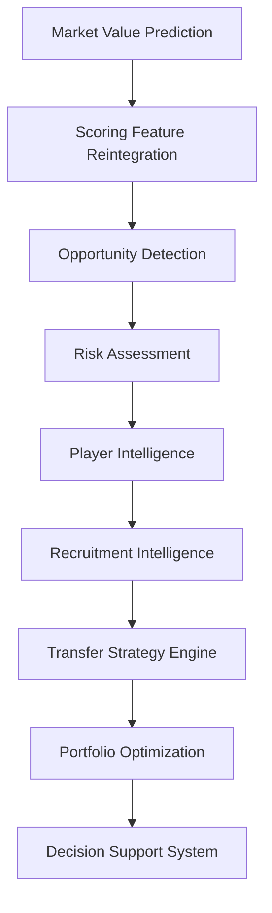

# 📊 Market Value Dynamics and Market Inefficiency Detection in Professional Football

### Football Analytics, Sports Economics, Recruitment Intelligence & Decision Science for Strategic Recruitment Optimization


---

# 📑 Tabla de contenidos

* [🧠 Resumen ejecutivo](#-resumen-ejecutivo)
* [📌 Resultados clave](#-resultados-clave)
* [🎯 Problema de negocio](#-problema-de-negocio)
* [🎯 Objetivos del proyecto](#-objetivos-del-proyecto)
* [🏆 Contribuciones del proyecto](#-contribuciones-del-proyecto)
* [🏗️ Arquitectura global](#️-arquitectura-global)
* [📚 Metodología](#-metodología)
* [📦 Datos y preparación](#-datos-y-preparación)
* [📈 Modelización](#-modelización)
* [🖥️ Decision Support System](#️-decision-support-system)
* [⚽ Valor para departamentos deportivos](#-valor-para-departamentos-deportivos)
* [✅ Estado actual del proyecto](#-estado-actual-del-proyecto)
* [⚠️ Limitaciones](#️-limitaciones)
* [🛣️ Roadmap](#️-roadmap)
* [📂 Estructura del proyecto](#-estructura-del-proyecto)
* [🔁 Reproducibilidad](#-reproducibilidad)
* [▶️ Ejecución reproducible](#️-ejecución-reproducible)
* [📚 Referencias](#-referencias)
* [👨‍🎓 Autoría](#-autoría)

---

# 🧠 Resumen ejecutivo

Este Trabajo Fin de Máster desarrolla una plataforma integral de Football Analytics, Sports Economics y Decision Science orientada a scouting, recruitment y optimización de decisiones de fichaje en fútbol profesional.

El proyecto integra:

* Econometría aplicada.
* Machine Learning supervisado.
* Explainable Artificial Intelligence.
* Opportunity Detection.
* Risk Assessment.
* Recruitment Intelligence.
* Transfer Strategy Engine.
* Portfolio Optimization.
* Decision Support Systems.

El objetivo trasciende la simple predicción del valor de mercado de futbolistas.

La finalidad consiste en transformar información deportiva y económica en recomendaciones accionables para departamentos de scouting, recruitment y dirección deportiva.

La plataforma permite:

* Estimar el valor de mercado esperado.
* Detectar ineficiencias de mercado.
* Identificar oportunidades de fichaje.
* Cuantificar riesgo e incertidumbre.
* Construir shortlists de scouting.
* Comparar candidatos simultáneamente.
* Optimizar carteras de fichajes.
* Simular escenarios estratégicos.
* Apoyar procesos reales de toma de decisiones mediante un DSS interactivo.

La arquitectura final combina Football Analytics, Sports Economics, Machine Learning, Explainability, Decision Science y Operations Research dentro de un único sistema analítico reproducible.

La versión actual opera sobre once competiciones europeas y constituye una plataforma DSS reproducible orientada tanto a investigación académica como a aplicaciones profesionales de scouting y recruitment.

---

## Evolución conceptual

La evolución funcional del proyecto puede resumirse mediante:

```text
Market Value Prediction
↓
Opportunity Detection
↓
Risk Assessment
↓
Player Intelligence
↓
Recruitment Intelligence
↓
Transfer Strategy Engine
↓
Portfolio Optimization
↓
Decision Support System
```

La principal aportación de las versiones recientes consiste en evolucionar desde la identificación de jugadores infravalorados hacia la optimización estratégica de decisiones de recruitment bajo restricciones reales de club.

---

## Release actual

```text
v1.2.2 — Transfer Strategy Engine + Multi-League DSS Integration
```

Sprint completados:

```text
Sprint 13A   — Multi-League Expansion
Sprint 13A.1 — External Validation
Sprint 13B   — Advanced Data Expansion
Sprint 14    — Transfer Strategy Engine
Sprint 14.1  — Player Level Layer
Sprint TM.2  — Scoring & Ranking Integration
```

---

# 📌 Resultados clave

| Indicador                     |              Valor |
| ----------------------------- | -----------------: |
| Ligas cubiertas               |                 11 |
| Temporadas                    |                  7 |
| Liga-temporada                |                 77 |
| Observaciones FBref           |             43.591 |
| Dataset modelizable           |              5.527 |
| Match Rate global             |             75,97% |
| Cobertura DSS                 |           11 ligas |
| Modelo econométrico oficial   |    Growth OLS v13B |
| Modelo ML oficial             | Tuned XGBoost v13B |
| R² OLS                        |             0.4549 |
| R² XGBoost                    |             0.4453 |
| Precision@10                  |                90% |
| Escenarios estratégicos       |                  3 |
| Player Levels                 |                  5 |
| Solver Portfolio Optimization |               PuLP |
| Estado actual                 |      DSS Operativo |

---

# 🎯 Problema de negocio

Los mercados de fichajes presentan características típicas de mercados imperfectos:

* información incompleta;
* incertidumbre elevada;
* asimetrías informativas;
* restricciones presupuestarias;
* recursos limitados.

Los clubes deben seleccionar un número reducido de objetivos dentro de un universo potencialmente compuesto por miles de futbolistas distribuidos entre múltiples ligas y contextos competitivos.

La pregunta central del proyecto evoluciona desde:

> ¿Qué jugadores parecen infravalorados?

hacia una cuestión de mayor relevancia operativa:

> ¿Qué combinación de jugadores maximiza el valor esperado bajo restricciones reales de club?

---

# 🎯 Objetivos del proyecto

## Objetivo empresarial

Desarrollar una metodología reproducible capaz de identificar oportunidades de mercado y optimizar decisiones de fichaje bajo una lógica:

```text
Buy Low
↓
Develop
↓
Create Value
↓
Sell High
```

---

## Objetivos analíticos

1. Construir un dataset longitudinal jugador-temporada mediante integración multi-fuente.
2. Modelizar el valor de mercado esperado mediante econometría y Machine Learning.
3. Comparar interpretabilidad y capacidad predictiva de ambos enfoques.
4. Detectar ineficiencias de mercado.
5. Diseñar métricas compuestas orientadas a scouting.
6. Incorporar Explainability para interpretar recomendaciones.
7. Cuantificar riesgo e incertidumbre.
8. Optimizar carteras de fichajes bajo restricciones reales.
9. Implementar un Decision Support System orientado a toma de decisiones deportivas.

---

# 🏆 Contribuciones del proyecto

## Contribuciones académicas

* Aplicación de CRISP-DM al fútbol profesional.
* Integración de econometría y Machine Learning.
* Validación temporal estricta.
* Evaluación mediante métricas de negocio.
* Estudio aplicado de ineficiencias de mercado.
* Validación externa multi-liga.
* Auditoría sistemática de cobertura.
* Evaluación empírica de métricas avanzadas de rendimiento.
* Integración DSS multi-liga.
* Aplicación de Decision Science al recruitment deportivo.
* Aplicación de Operations Research a optimización de fichajes.

---

## Contribuciones técnicas

* Matching multi-fuente FBref ↔ Transfermarkt.
* Arquitectura modular reproducible.
* Experiment Tracking mediante MLflow.
* Explainability mediante SHAP.
* Opportunity Framework.
* Risk Framework.
* Recruitment Intelligence Layer.
* Transfer Strategy Engine.
* Portfolio Optimization.
* Dashboard DSS interactivo.
* Internationalization EN/ES.
* Advanced Football Metrics Integration.
* Multi-League DSS Integration (TM.2).

---

## Contribuciones de negocio

* Opportunity Detection.
* Risk Assessment.
* Player Intelligence.
* Recruitment Intelligence.
* Candidate Comparison.
* Transfer Strategy Engine.
* Portfolio Construction.
* Scenario Simulation.
* Decision Support System.

---

## Historial de releases

| Release | Contenido principal            |
| ------- | ------------------------------ |
| v0.1.0  | Data Pipeline                  |
| v0.2.0  | Econometric Baseline           |
| v0.3.0  | MLflow                         |
| v0.4.0  | Machine Learning               |
| v0.5.0  | Explainability                 |
| v0.6.0  | Scoring Engine                 |
| v0.7.0  | Dashboard                      |
| v0.8.0  | Dashboard Productization       |
| v1.0.0  | Scouting Intelligence Platform |
| v1.1.0  | Recruitment Intelligence       |
| v1.2.0  | Multi-League Expansion         |
| v1.2.1  | Transfer Strategy Engine       |
| v1.2.2  | Multi-League DSS Integration   |


# 🏗️ Arquitectura global

La arquitectura se organiza en capas analíticas especializadas diseñadas para transformar datos deportivos y económicos en decisiones de recruitment reproducibles.

La versión actual implementa una arquitectura DSS multicapa capaz de conectar modelización predictiva, detección de oportunidades, evaluación de riesgo y optimización estratégica dentro de un único flujo analítico.

```text
Raw Sources
↓
Feature Engineering
↓
Advanced Metrics Layer
↓
Matching Layer
↓
Player Season Panel
↓
Modeling Dataset
↓
Econometric Modeling
+
Machine Learning
↓
Operational Predictions
↓
Scoring Feature Reintegration
↓
Opportunity Detection
↓
Risk Assessment
↓
Player Intelligence
↓
Recruitment Intelligence
↓
Transfer Strategy Engine
↓
Portfolio Optimization
↓
Decision Support System
```

Cada capa añade una nueva capacidad analítica sobre la anterior, evolucionando progresivamente desde predicción hacia soporte cuantitativo a decisiones deportivas.

---

## Evolución funcional

La evolución metodológica del proyecto puede resumirse mediante:

```text
Econometric Modeling
↓
Machine Learning
↓
Opportunity Detection
↓
Risk Assessment
↓
Player Intelligence
↓
Recruitment Intelligence
↓
Transfer Strategy Engine
↓
Portfolio Optimization
↓
Multi-League DSS Integration
↓
Decision Support System
```

La plataforma ha evolucionado desde una investigación centrada en valoración de mercado hacia una arquitectura completa de Recruitment Intelligence y Strategic Decision Support.

---

## Arquitectura DSS

La arquitectura DSS actual puede representarse mediante:



---

## Sprint TM.2 — Multi-League DSS Integration

Sprint TM.2 introduce una capa explícita de integración entre modelización y DSS.

Objetivo:

```text
Predictions
↓
Scoring Feature Reintegration
↓
Opportunity Framework
↓
Ranking Engine
↓
Transfer Strategy Engine
↓
Decision Support System
```

La intervención resuelve una inconsistencia detectada tras la expansión multi-liga, garantizando que las once competiciones soportadas por los modelos productivos se propaguen correctamente hasta todas las capas operativas.

Resultado:

| Componente                 | Cobertura |
| -------------------------- | --------: |
| Modeling Dataset           |  11 ligas |
| Scoring Dataset            |  11 ligas |
| Opportunity Dataset        |  11 ligas |
| Transfer Portfolio Dataset |  11 ligas |
| DSS                        |  11 ligas |

La cobertura competitiva queda alineada de extremo a extremo.

---

# 📚 Metodología

El proyecto sigue una adaptación de CRISP-DM orientada al contexto del fútbol profesional.


---

## 1. Business Understanding

Definición del problema económico y deportivo asociado a la identificación de oportunidades de mercado y optimización de decisiones de fichaje.

---

## 2. Data Understanding

Análisis exploratorio de:

* cobertura;
* calidad de datos;
* consistencia temporal;
* compatibilidad entre fuentes;
* validez externa multi-liga.

---

## 3. Data Preparation

Procesos de:

* matching;
* limpieza;
* normalización;
* feature engineering;
* construcción del panel longitudinal;
* integración multi-fuente.

---

## 4. Modeling

Desarrollo paralelo de:

* Econometría aplicada.
* Machine Learning supervisado.

para estimar el valor de mercado esperado.

---

## 5. Evaluation

Evaluación mediante:

* métricas predictivas;
* métricas de negocio;
* validación temporal;
* validación externa;
* robustez multi-liga.

---

## 6. Deployment

Implementación mediante:

* MLflow;
* artefactos reproducibles;
* pipelines productivos;
* dashboard DSS interactivo.

---

## 7. Decision Support

Transformación de resultados analíticos en decisiones deportivas accionables mediante:

* Opportunity Framework.
* Risk Framework.
* Recruitment Intelligence.
* Transfer Strategy Engine.
* Portfolio Optimization.

---

# 📦 Datos y preparación

## Fuentes de datos

El proyecto integra dos fuentes complementarias de información deportiva y económica.

---

### FBref

Fuente principal de rendimiento deportivo.

Variables utilizadas:

* minutos disputados;
* goles;
* asistencias;
* producción ofensiva;
* progresión;
* posesión;
* acciones defensivas;
* métricas avanzadas normalizadas por 90 minutos.

---

### Transfermarkt

Fuente principal de valoración económica.

Variables utilizadas:

* valor de mercado;
* histórico de valor;
* edad;
* posición;
* club;
* contexto competitivo.

---

## Cobertura actual

La plataforma incorpora actualmente:

| Métrica             |  Valor |
| ------------------- | -----: |
| Ligas               |     11 |
| Temporadas          |      7 |
| Liga-temporada      |     77 |
| Observaciones FBref | 43.591 |
| Dataset modelizable |  5.527 |
| Match Rate          | 75,97% |

---

## Competiciones incluidas

### Big Five

* Premier League
* LaLiga
* Bundesliga
* Serie A
* Ligue 1

### Upper-Mid European Leagues

* Eredivisie
* Liga Portugal
* Belgian Pro League
* Austrian Bundesliga

### Development & Secondary Competitions

* Championship
* Spanish Segunda División

---

## Cobertura DSS

Tras Sprint TM.2 la cobertura multi-liga ya no se limita a modelización.

La arquitectura DSS completa opera sobre las mismas once competiciones europeas.

```text
Modeling Layer
↓
Scoring Layer
↓
Opportunity Layer
↓
Ranking Layer
↓
Transfer Strategy Engine
↓
Decision Support System
```

---

## Cobertura temporal

```text
2019-2020
↓
2025-2026
```

---

# 🔗 Matching multi-fuente

Uno de los principales retos metodológicos del proyecto consiste en la ausencia de un identificador universal compartido entre FBref y Transfermarkt.

Para resolver este problema se desarrolló un pipeline jerárquico de matching orientado a maximizar precisión sin comprometer cobertura.

---

## Flujo de matching

```text
Normalización
↓
Exact Matching
↓
Club Validation
↓
Fuzzy Matching
↓
Age Validation
```

---

## Resultado

| Métrica             |  Valor |
| ------------------- | -----: |
| Observaciones FBref | 43.591 |
| Match Rate global   | 75,97% |

La reducción observada respecto a versiones anteriores se explica principalmente por la incorporación de ligas secundarias con menor cobertura histórica.

---

# 📊 Dataset final

Tras los procesos de integración y validación se construye un panel longitudinal jugador-temporada.

---

## Panel completo

| Métrica             |  Valor |
| ------------------- | -----: |
| Observaciones FBref | 43.591 |
| Ligas               |     11 |
| Temporadas          |      7 |
| Liga-temporada      |     77 |

---

## Dataset modelizable

La modelización se centra en jugadores con potencial de desarrollo y revalorización.

| Métrica       | Valor |
| ------------- | ----: |
| Observaciones | 5.527 |
| Ligas         |    11 |
| Temporadas    |     7 |

Dataset productivo actual:

```text
player_season_modeling_v13b_productive_candidate.parquet
```

---

# ⚙️ Feature Engineering

El proyecto incorpora múltiples capas de transformación orientadas a capturar rendimiento deportivo, experiencia competitiva y evolución temporal.

---

## Growth Features

Diseñadas para modelar trayectoria y evolución reciente.

Ejemplos:

* market_value_growth_prev
* delta_log_market_value_prev
* breakout_indicator
* career_year

---

## Composite Football Indices

Variables sintéticas construidas para representar dimensiones futbolísticas complejas.

Ejemplos:

* finishing_index
* playmaking_index
* growth_index
* experience_index

---

## Advanced Football Metrics (Sprint 13B)

Sprint 13B introduce tres nuevas variables productivas:

* finishing_index_v2
* availability_index
* defensive_activity_index

Estas variables constituyen la principal aportación analítica de la fase Advanced Data Expansion.

---

## Hallazgo principal

Entre las variables avanzadas evaluadas:

```text
finishing_index_v2
```

emerge como la métrica con mayor relevancia predictiva agregada dentro de las arquitecturas evaluadas.

---

## Transformaciones aplicadas

El pipeline incorpora:

* transformaciones logarítmicas;
* winsorización;
* escalado robusto;
* estandarización;
* normalización posicional.

Estas transformaciones permiten reducir sensibilidad a valores extremos y mejorar estabilidad estadística de los modelos.

# 📈 Modelización

El proyecto combina econometría aplicada y Machine Learning supervisado con el objetivo de estimar el valor de mercado esperado de futbolistas profesionales.

La coexistencia deliberada de ambos enfoques responde a una decisión metodológica explícita:

```text
Interpretabilidad
+
Capacidad predictiva
```

en lugar de optimizar únicamente métricas de rendimiento.

---

## Variable objetivo

Target principal:

```text
market_value_eur
```

Transformación utilizada:

```text
log_market_value_eur
```

La transformación logarítmica permite:

* reducir asimetría;
* estabilizar varianza;
* mejorar comportamiento estadístico;
* facilitar interpretación económica.

---

# 📊 Econometría

## Objetivo

Construir un benchmark interpretable capaz de explicar los determinantes económicos y deportivos del valor de mercado.

---

## Especificación oficial

```python
log_market_value_eur ~
age +
log_minutes_played +
goals_per90 +
assists_per90 +
growth variables +
advanced football metrics +
league FE +
position FE +
season FE
```

---

## Modelo oficial

```text
Growth OLS v13B
```

Características:

* efectos fijos por liga;
* efectos fijos por posición;
* efectos fijos por temporada;
* covarianza robusta HC3;
* validación temporal.

---

## Resultado

| Modelo                |     R² |
| --------------------- | -----: |
| M_A_v13A_base_spec_FE | 0.4505 |
| M_B_v13B_advanced_FE  | 0.4549 |

Mejora observada:

```text
ΔR² = +0.0044
```

---

## Interpretación

La incorporación de métricas avanzadas aporta capacidad explicativa incremental sin comprometer interpretabilidad.

El modelo econométrico permanece como referencia explicativa oficial del sistema.

---

# 🤖 Machine Learning

## Objetivo

Maximizar capacidad predictiva sobre datos no observados.

---

## Arquitecturas evaluadas

* Random Forest
* HistGradientBoosting
* LightGBM
* XGBoost

---

## Diseño experimental

La evaluación incorpora:

* validación temporal;
* imputación robusta;
* codificación categórica;
* escalado;
* búsqueda de hiperparámetros;
* experiment tracking mediante MLflow.

---

## Modelo productivo oficial

```text
Tuned XGBoost v13B
```

---

## Resultado comparativo Sprint 13B

| Modelo               | Mejora observada |
| -------------------- | ---------------: |
| XGBoost              |          +0.0096 |
| Random Forest        |          +0.0097 |
| HistGradientBoosting |          +0.0144 |
| LightGBM             |          +0.0291 |

---

## Hallazgo metodológico

Todas las arquitecturas mejoran simultáneamente tras incorporar:

* finishing_index_v2
* availability_index
* defensive_activity_index

Este comportamiento reduce significativamente el riesgo de sobreajuste metodológico a una única familia de modelos.

---

# 🔍 Explainability

La plataforma incorpora Explainable Artificial Intelligence mediante:

```text
SHAP
```

---

## Explainability global

Permite identificar:

* importancia de variables;
* contribución agregada;
* relaciones no lineales.

Pregunta objetivo:

```text
¿Qué variables explican el valor de mercado?
```

---

## Explainability local

Permite interpretar recomendaciones individuales.

Pregunta objetivo:

```text
¿Por qué este jugador aparece
como oportunidad de mercado?
```

---

## Hallazgo principal

Entre todas las variables avanzadas evaluadas:

```text
finishing_index_v2
```

emerge como la métrica con mayor relevancia predictiva agregada.

Este constituye el principal hallazgo analítico de Sprint 13B.

---

# 🌍 Validación externa

## Sprint 13A — Multi-League Expansion

Sprint 13A amplía la cobertura competitiva del sistema desde siete hasta once competiciones europeas.

Competiciones incorporadas:

* Championship
* Belgian Pro League
* Austrian Bundesliga
* Spanish Segunda División

---

## Cobertura final

| Métrica             |  Valor |
| ------------------- | -----: |
| Ligas               |     11 |
| Temporadas          |      7 |
| Liga-temporada      |     77 |
| Observaciones FBref | 43.591 |
| Dataset modelizable |  5.527 |

---

## Resultado metodológico

La expansión multi-liga permite evaluar explícitamente la capacidad de generalización de la metodología fuera de las cinco grandes ligas europeas.

Resultado:

```text
Validez externa fortalecida
```

---

# 🎯 Opportunity Framework

La predicción de valor constituye únicamente una etapa intermedia.

El sistema transforma estimaciones en oportunidades accionables mediante:

```text
Predicted Market Value
↓
Inefficiency Score
↓
Growth Score
↓
Confidence Score
↓
Opportunity Score
```

---

## Inefficiency Score

Captura desviaciones entre:

```text
Valor esperado
vs
Valor observado
```

---

## Growth Score

Captura:

* trayectoria;
* revalorización;
* potencial de crecimiento.

---

## Confidence Score

Captura:

* robustez del matching;
* completitud de datos;
* estabilidad temporal.

---

## Opportunity Score

Integra simultáneamente:

```text
Infravaloración
+
Potencial
+
Robustez
```

en una única métrica operativa orientada a scouting.

---

# ⚠️ Risk Framework

La oportunidad de mercado no implica necesariamente una recomendación segura.

Por este motivo se incorpora:

```text
Risk Score
```

como dimensión independiente.

---

## Objetivo

Cuantificar incertidumbre asociada a cada recomendación.

---

## Resultado

```text
Opportunity
+
Risk
=
Priorización más realista
```

para contextos de recruitment profesional.

---

# 🧠 Recruitment Intelligence

Sprint 11 transforma rankings analíticos en procesos estructurados de scouting y recruitment.

Capacidades implementadas:

* Recruitment Board.
* Candidate Selection.
* Comparative Player Analysis.
* Executive Shortlists.
* Positional Benchmarking.

---

# 🎯 Transfer Strategy Engine

## Sprint 14

La principal evolución conceptual del proyecto consiste en incorporar optimización estratégica de fichajes.

Pregunta objetivo:

```text
¿Qué combinación de jugadores
maximiza el valor esperado
bajo restricciones reales de club?
```

---

## Inputs

* presupuesto;
* posiciones requeridas;
* perfil estratégico;
* calidad mínima;
* número máximo de incorporaciones.

---

## Outputs

* cartera recomendada;
* coste total;
* utilización presupuestaria;
* ROI esperado;
* upside esperado;
* score medio de cartera.

---

## Optimización

La resolución utiliza:

```text
Binary Integer Programming
(PuLP)
```

permitiendo construir carteras óptimas bajo restricciones simultáneas.

---

# 🔄 Sprint TM.2 — Multi-League DSS Integration

Tras Sprint 13A y Sprint 13B se detectó una inconsistencia operativa:

```text
Modeling Layer
↓
11 ligas

Scoring DSS
↓
7 ligas
```

---

## Objetivo

Garantizar que la expansión multi-liga alcanzara todas las capas operativas del sistema.

---

## Resultado

Cobertura final:

```text
Modeling Dataset
↓
Scoring Dataset
↓
Opportunity Framework
↓
Ranking Engine
↓
Transfer Strategy Engine
↓
Decision Support System
```

```text
11 ligas
de extremo a extremo
```

---

## Impacto

Sprint TM.2 no modifica:

* modelos econométricos;
* modelos Machine Learning;
* metodología de scoring.

Su contribución consiste en asegurar consistencia metodológica completa entre modelización y DSS.

---

# 📊 Evaluación de negocio

La utilidad del sistema se evalúa mediante métricas orientadas a toma de decisiones.

| Métrica       | Valor |
| ------------- | ----: |
| Precision@10  |   90% |
| Precision@20  |   90% |
| Precision@50  |   90% |
| Precision@100 |   85% |

---

## Interpretación

Los resultados respaldan la utilidad operativa del sistema para:

* scouting;
* recruitment;
* construcción de shortlists;
* optimización de carteras de fichajes;
* soporte cuantitativo a decisiones deportivas.

La combinación de modelización, opportunity detection, risk assessment y portfolio optimization constituye la principal aportación metodológica del proyecto.

# 🖥️ Decision Support System

La capa DSS representa la consolidación de todas las capacidades analíticas desarrolladas a lo largo del proyecto.

Su función consiste en transformar resultados de modelización, scoring, evaluación de riesgo y optimización estratégica en herramientas utilizables por departamentos deportivos.

La aplicación se implementa mediante:

```text
Streamlit
```

y actúa como interfaz operativa de toda la arquitectura.

---

## Capacidades actuales

### Opportunity Intelligence

Permite identificar oportunidades de mercado mediante:

* Opportunity Score.
* Inefficiency Score.
* Growth Score.
* Confidence Score.

---

### Risk Intelligence

Permite evaluar:

* Risk Score.
* Risk Category.
* Risk-adjusted Opportunity.

---

### Player Intelligence

Permite:

* análisis individual;
* benchmarking posicional;
* radar de rendimiento;
* interpretación de fortalezas y debilidades.

---

### Recruitment Intelligence

Permite:

* construcción de shortlists;
* comparación simultánea de candidatos;
* priorización de perfiles;
* evaluación ejecutiva.

---

### Transfer Strategy Engine

Permite:

* definir restricciones deportivas;
* definir restricciones presupuestarias;
* simular escenarios estratégicos;
* optimizar carteras de fichajes.

---

### Portfolio Optimization

Permite generar automáticamente:

* Recommended Portfolio.
* Expected Upside.
* Expected ROI.
* Budget Utilization.
* Portfolio Composition.

---

## Cobertura DSS actual

Tras Sprint TM.2 la cobertura competitiva queda alineada con la cobertura de modelización.

```text
Modeling Layer
↓
Scoring Layer
↓
Opportunity Framework
↓
Ranking Engine
↓
Transfer Strategy Engine
↓
Decision Support System
```

Resultado:

```text
11 ligas
77 league-seasons
```

integradas de extremo a extremo.

---

# 📸 Dashboard (Demo)

## Executive Dashboard


Visualización ejecutiva de oportunidades, riesgo y métricas clave del sistema.

---

## Player Intelligence


Análisis individual de jugadores con benchmarking posicional y métricas compuestas.

---

## Recruitment Intelligence


Comparación simultánea de candidatos y construcción de shortlists operativas.

---

## Transfer Strategy Engine


Optimización de carteras de fichajes bajo restricciones reales de club.

---

# ⚽ Valor para departamentos deportivos

La plataforma permite responder preguntas habituales dentro de procesos de scouting y recruitment.

---

## Valoración de mercado

```text
¿Cuál debería ser el valor de mercado esperado
de este jugador?
```

---

## Oportunidades de mercado

```text
¿Qué jugadores parecen infravalorados?
```

---

## Riesgo

```text
¿Cuánto riesgo implica esta recomendación?
```

---

## Recruitment

```text
¿Qué candidatos cumplen nuestros criterios?
```

---

## Comparación

```text
¿Qué jugador ofrece mejor combinación
de potencial, riesgo y coste?
```

---

## Estrategia

```text
¿Qué combinación de jugadores maximiza
el valor esperado bajo restricciones reales?
```

---

# ✅ Estado actual del proyecto

## Estado general

```text
Release:
v1.2.2
```

Estado:

```text
Activo
```

---

## Sprint completados

```text
Sprint 13A   — Multi-League Expansion
Sprint 13A.1 — External Validation
Sprint 13B   — Advanced Data Expansion
Sprint 14    — Transfer Strategy Engine
Sprint 14.1  — Player Level Layer
Sprint TM.2  — Scoring & Ranking Integration
```

---

## Cobertura actual

| Métrica             |    Valor |
| ------------------- | -------: |
| Ligas               |       11 |
| Temporadas          |        7 |
| Liga-temporada      |       77 |
| Observaciones FBref |   43.591 |
| Dataset modelizable |    5.527 |
| Cobertura DSS       | 11 ligas |

---

## Modelos oficiales

| Capa             | Modelo             |
| ---------------- | ------------------ |
| Econometría      | Growth OLS v13B    |
| Machine Learning | Tuned XGBoost v13B |

---

## Estado funcional

```text
Market Value Prediction
↓
Opportunity Detection
↓
Risk Assessment
↓
Player Intelligence
↓
Recruitment Intelligence
↓
Transfer Strategy Engine
↓
Portfolio Optimization
↓
Decision Support System
```

---

# ⚠️ Limitaciones

Aunque la arquitectura principal puede considerarse completada, existen limitaciones inherentes a la disponibilidad de datos.

---

## Matching

La ausencia de identificadores universales entre FBref y Transfermarkt obliga a utilizar procesos probabilísticos de matching.

---

## Cobertura contractual

Actualmente no se incorporan variables relacionadas con:

* años restantes de contrato;
* expiración contractual;
* cláusulas;
* situación contractual.

---

## Competiciones internacionales

Actualmente no se incorporan explícitamente:

* Champions League;
* Europa League;
* Conference League;
* competiciones de selecciones nacionales.

---

## Lesiones

La plataforma no incorpora todavía:

* historial de lesiones;
* disponibilidad médica;
* modelos de Injury Prediction.

---

# 🛣️ Roadmap

Las siguientes líneas representan extensiones naturales del sistema.

---

## Prioridad alta

### Contract Intelligence Layer

Variables previstas:

* contrato restante;
* expiración contractual;
* free agency.

---

### UEFA Club Strength Layer

Variables previstas:

* coeficiente UEFA;
* rendimiento europeo;
* experiencia continental.

---

### CatBoost Benchmark

Comparación frente al stack actual.

---

### TabPFN Benchmark

Evaluación experimental de arquitecturas fundacionales para datos tabulares.

---

## Prioridad media

### National Team Layer

Variables previstas:

* internacionalidades;
* minutos internacionales;
* torneos disputados.

---

### European Competition Layer

Variables previstas:

* Champions League;
* Europa League;
* Conference League.

---

### Club Development Index

Medición de la capacidad histórica de desarrollo y revalorización de talento de cada club.

---

## Investigación futura

### Injury Prediction

Línea independiente de investigación orientada a:

```text
Health Intelligence
```

mediante modelización específica de riesgo de lesión.

---

# 📂 Estructura del proyecto

```bash
market-value-football-tfm/

├── app/                                   # Aplicación interactiva y capa Decision Support
│   ├── streamlit_app.py                   # Executive Dashboard
│   └── utils/                             # Utilidades específicas del dashboard
│       ├── charts.py                      # Visualizaciones y gráficos interactivos
│       ├── formatters.py                  # Formateo de KPIs, métricas y valores monetarios
│       └── loaders.py                     # Carga de datos y outputs analíticos
│
├── artifacts/                             # Artefactos persistidos de modelos y predicciones
│   ├── encoders/                          # Encoders categóricos serializados
│   ├── feature_importance/                # Importancia de variables exportada
│   ├── metadata/                          # Metadata y hashes de datasets versionados
│   ├── models/                            # Modelos entrenados (.joblib)
│   ├── predictions/                       # Predicciones persistidas
│   └── scalers/                           # Transformadores numéricos serializados
│
├── config/                                # Configuración centralizada del sistema
│   ├── config.yaml
│   ├── config_backup.yaml
│   ├── features.yaml                      # Configuración de feature engineering
│   ├── matching.yaml                      # Parámetros de matching
│   ├── modeling.yaml                      # Configuración de modelización
│   ├── paths.yaml                         # Paths del proyecto
│   ├── project.yaml                       # Configuración global
│   ├── scoring.yaml                       # Configuración de scoring y rankings
│   └── validation.yaml                    # Configuración centralizada de validación temporal
│
├── data/
│   ├── external/                          # Datos auxiliares externos
│   ├── interim/                           # Datos parcialmente transformados
│   ├── processed/                         # Datasets finales reutilizables
│   └── raw/                               # Datos originales sin procesar
│
├── docs/                                  # Documentación técnica y metodológica
│   ├── architecture.md                    # Arquitectura completa del sistema
│   ├── data_dictionary.md                 # Diccionario de variables y outputs
│   ├── data_quality.md                    # Evaluación de calidad de datos
│   ├── data_sources.md                    # Fuentes de datos y matching
│   ├── feature_engineering_plan.md        # Roadmap de feature engineering
│   ├── modeling_decisions.md              # Decisiones metodológicas de modelización
│   ├── pipeline_reference.md              # Referencia técnica de pipelines
│   ├── README.md                          # Índice central de documentación
│   └── schema_decisions.md                # Diseño de esquema y arquitectura de datos
│
├── logs/                                  # Logs de ejecución y debugging
│
├── mlruns/                                # Tracking experimental MLflow
│
├── notebooks/                             # Notebooks exploratorios y análisis
│   ├── 01_data_understanding.ipynb
│   ├── 02_econometric_baseline.ipynb
│   ├── 03_econometric_model.ipynb
│   ├── 04_supervised_machine_learning.ipynb
│   └── README.md
│
├── reports/                               # Outputs analíticos y reporting
│   ├── business/                          # Métricas de negocio y evaluación de impacto
│   ├── evaluation/                        # Resultados de validación y evaluación de modelos
│   ├── figures/                           # Visualizaciones y figuras exportadas
│   │   ├── dashboard/                     # Capturas del DSS y Scouting Intelligence Platform
│   │   └── explainability/                # SHAP, feature importance y análisis interpretativo
│   ├── model_diagnostics/                 # Diagnósticos econométricos y de Machine Learning
│   ├── portfolio/                         # Outputs del Transfer Strategy Engine
│   │   ├── portfolio_candidates.csv
│   │   ├── portfolio_candidates.parquet
│   │   ├── portfolio_dataset_metadata.json
│   │   ├── portfolio_dataset_summary.csv
│   │   ├── recommended_portfolio.csv
│   │   ├── recommended_portfolio_summary.json
│   │   └── scenarios/
│   │       ├── recommended_portfolio_conservative.csv
│   │       ├── recommended_portfolio_balanced.csv
│   │       ├── recommended_portfolio_aggressive.csv
│   │       ├── recommended_portfolio_conservative_summary.json
│   │       ├── recommended_portfolio_balanced_summary.json
│   │       ├── recommended_portfolio_aggressive_summary.json
│   │       ├── scenario_simulation_summary.csv
│   │       └── scenario_simulation_metadata.json
│   ├── rankings/                          # Rankings de scouting y oportunidades de mercado
│   ├── scouting_reports/                  # Informes individuales de scouting
│   └── tables/                            # Métricas, tablas y resultados exportados
│
├── src/                                   # Lógica principal del sistema
│   ├── data/                              # Ingesta, matching y datasets
│   ├── features/                          # Feature engineering
│   ├── models/
│   │   ├── econometric/                   # Pipeline OLS
│   │   ├── evaluation/                    # Métricas y comparación
│   │   ├── machine_learning/              # Pipelines ML
│   │   └── scoring/                       # Inefficiency scoring
│   ├── strategy/                          # Transfer Strategy Engine
│   │   ├── build_portfolio_dataset.py     # Construcción del universo optimizable
│   │   ├── optimize_transfer_strategy.py  # Optimización 0-1 Knapsack
│   │   └── simulate_transfer_scenarios.py # Simulación de escenarios estratégicos
│   └── utils/                             # Utilidades compartidas
│       ├── config.py                      # Loader centralizado de configuración YAML
│       ├── dataset_versioning.py          # Versionado y hashing de datasets
│       └── experiment_tracking.py         # Integración MLflow
│
├── tests/                                 # Estructura reservada para validaciones automatizadas futuras
│   └── .gitkeep                           # Mantiene la carpeta en Git aunque esté vacía
│
├── .gitignore                             # Reglas de exclusión de Git
├── dataset-metadata.json                  # Metadata versionada del dataset actual
├── environment.yml                        # Entorno Conda
├── PROJECT_STATUS.md                      # Estado operativo del proyecto
├── README.md                              # Documentación principal
├── requirements-lock.txt                  # Dependencias fijadas
├── requirements.txt                       # Dependencias Python
└── LICENSE
```

---

# 🔁 Reproducibilidad

El proyecto ha sido diseñado bajo principios de reproducibilidad científica.

Características principales:

* versionado completo;
* configuración centralizada;
* MLflow;
* artefactos persistentes;
* separación entre experimentación y producción;
* pipelines deterministas;
* documentación metodológica completa.

---

# ▶️ Ejecución reproducible

## 1. Clonar repositorio

```bash
git clone https://github.com/manuelpeba/market-value-football-tfm.git

cd market-value-football-tfm
```

---

## 2. Crear entorno virtual

```bash
python -m venv .venv
```

### Linux / macOS

```bash
source .venv/bin/activate
```

### Windows

```bash
.venv\Scripts\activate
```

---

## 3. Instalar dependencias

```bash
pip install -r requirements.txt
```

---

## 4. Ejecutar notebooks

Orden recomendado:

```text
01_data_understanding.ipynb

↓

02_econometric_baseline.ipynb

↓

03_econometric_model.ipynb

↓

04_supervised_machine_learning.ipynb
```

---

## 5. Generar rankings

```bash
python -m src.models.scoring.build_inefficiency_score

python -m src.models.scoring.build_growth_score

python -m src.models.scoring.build_confidence_score

python -m src.models.scoring.build_opportunity_score

python -m src.models.scoring.generate_rankings
```

---

## 6. Generar estrategia de fichajes

```bash
python -m src.models.scouting.build_risk_score

python src/strategy/build_transfer_portfolio_dataset.py

python src/strategy/optimize_transfer_portfolio.py
```

---

## 7. Lanzar dashboard

```bash
streamlit run app/streamlit_app.py
```

---

# 📚 Referencias

La construcción metodológica del proyecto combina contribuciones procedentes de:

* Football Analytics
* Sports Economics
* Econometrics
* Machine Learning
* Explainable AI
* Decision Science
* Operations Research
* Portfolio Optimization

## Referencias metodológicas principales

### Football Analytics

* Sumpter, D. — *Soccermatics*
* Kuper, S. & Szymanski, S. — *Soccernomics*

### Econometrics & Statistical Learning

* James, Witten, Hastie & Tibshirani — *An Introduction to Statistical Learning*
* Hastie, Tibshirani & Friedman — *The Elements of Statistical Learning*
* Wooldridge — *Introductory Econometrics*

### Machine Learning

* Kuhn & Johnson — *Applied Predictive Modeling*
* Breiman — *Random Forests*
* Chen & Guestrin — *XGBoost*

### Explainable Artificial Intelligence

* Molnar — *Interpretable Machine Learning*
* Lundberg & Lee — *SHAP: A Unified Approach to Interpreting Model Predictions*

### Decision Science & Operations Research

* Winston — *Operations Research: Applications and Algorithms*
* Hillier & Lieberman — *Introduction to Operations Research*

### Portfolio Optimization

* Markowitz — *Portfolio Selection*

---

## Herramientas y tecnologías utilizadas

* Python
* Pandas
* NumPy
* Scikit-Learn
* Statsmodels
* XGBoost
* LightGBM
* SHAP
* DuckDB
* MLflow
* Streamlit
* PuLP
* RapidFuzz

---

# 👨‍🎓 Autoría

Trabajo desarrollado como Trabajo Fin de Máster (TFM).

Título:

```text
Market Value Dynamics and Market Inefficiency Detection in Professional Football
```

## Autores

- Laura González Macho
- Isabel Muñoz Martín
- Manuel Pérez Bañuls

## Tutor académico

- Antonio Pita Lozano

## Desarrollo técnico y evolución posterior del proyecto

- Manuel Pérez Bañuls
  - Arquitectura software
  - Data Science
  - Machine Learning
  - Dashboard DSS
  - Transfer Strategy Engine

Versión actual:

```text
v1.2.2 — Transfer Strategy Engine + Multi-League DSS Integration
```