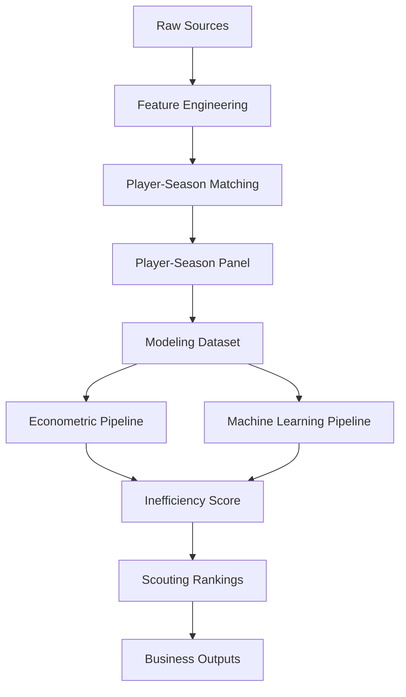

# 📊 Identificación de jugadores infravalorados en el mercado de fichajes europeo

<div align="center">


</div>

---

# 🧠 Descripción del proyecto

Este proyecto desarrolla un sistema analítico modular para mejorar la toma de decisiones en scouting y fichajes dentro del fútbol profesional europeo.

El objetivo principal es estimar el valor de mercado esperado de futbolistas jóvenes a partir de su rendimiento deportivo y detectar ineficiencias de mercado que permitan identificar oportunidades de fichaje bajo una estrategia:

> **Buy low → Sell high**

El sistema combina:

* Econometría aplicada
* Machine Learning supervisado
* Feature engineering deportivo
* Integración robusta de fuentes heterogéneas
* Validación temporal out-of-sample
* Analytics engineering
* Scouting cuantitativo

---

# 📑 Tabla de contenidos

* [🧠 Descripción del proyecto](#-descripción-del-proyecto)
* [🎯 Problema de negocio](#-problema-de-negocio)
* [🧩 Objetivos analíticos](#-objetivos-analíticos)
* [⚙️ Enfoque metodológico](#️-enfoque-metodológico)
* [🔄 Evolución de arquitectura](#-evolución-de-arquitectura)
* [🏗️ Analytics Engineering & Reproducibility](#️-analytics-engineering--reproducibility)
* [🧪 Experiment Tracking & Dataset Versioning](#-experiment-tracking--dataset-versioning)
* [📚 Metodología](#-metodología)
* [⏳ Estrategia de validación temporal](#-estrategia-de-validación-temporal)
* [📦 Fuentes de datos](#-fuentes-de-datos)
* [⚠️ Problema crítico del proyecto](#️-problema-crítico-del-proyecto)
* [🛠️ Sistema de matching implementado](#️-sistema-de-matching-implementado)
* [📈 Resultados del matching](#-resultados-del-matching)
* [🏗️ Arquitectura del pipeline](#️-arquitectura-del-pipeline)
* [📊 Dataset final](#-dataset-final)
* [📈 Pipeline econométrico](#-pipeline-econométrico)
* [🤖 Pipeline Machine Learning](#-pipeline-machine-learning)
* [💡 Inefficiency Score](#-inefficiency-score)
* [📤 Business Outputs](#-business-outputs)
* [📂 Estructura del proyecto](#-estructura-del-proyecto)
* [▶️ Ejecución reproducible](#️-ejecución-reproducible)
* [📊 Resultados actuales](#-resultados-actuales)
* [⚖️ Trade-offs metodológicos](#️-trade-offs-metodológicos)
* [🚀 Próximos pasos](#-próximos-pasos)
* [🧠 Valor del proyecto](#-valor-del-proyecto)
* [👤 Autores](#-autores)

---

# 🎯 Problema de negocio

Los clubes toman decisiones de fichaje basándose en:

* scouting tradicional
* intuición
* métricas limitadas
* análisis parcialmente subjetivos

Sin embargo, el mercado presenta ineficiencias derivadas de:

* información incompleta
* sesgos mediáticos
* diferencias estructurales entre ligas
* asimetrías de información

👉 Este proyecto busca responder:

## ❓ ¿Qué jugadores están infravalorados respecto a su rendimiento real?

---

# 🧩 Objetivos analíticos

El sistema busca:

* estimar el valor de mercado esperado
* detectar jugadores infravalorados
* construir rankings cuantitativos de scouting
* analizar diferencias estructurales entre ligas
* comparar econometría vs machine learning
* generar outputs interpretables para toma de decisiones

---

# ⚙️ Enfoque metodológico

## Unidad de análisis

```text
Jugador – Temporada
```

Cada observación representa:

* rendimiento deportivo
* contexto competitivo
* valor de mercado
* características demográficas

de un jugador en una temporada concreta.

---

# 🔄 Evolución de arquitectura

El proyecto comenzó como un entorno exploratorio basado principalmente en notebooks y evolucionó hacia una arquitectura modular reproducible orientada a analytics engineering y modelización escalable.

Actualmente:

* los notebooks se utilizan para EDA, validación e interpretación
* la ejecución principal se realiza mediante pipelines modulares
* los outputs son reproducibles y versionables
* los modelos pueden persistirse y reutilizarse
* la validación temporal está centralizada
* los artefactos de modelización quedan desacoplados del código analítico

Esta evolución permitió transformar el proyecto desde un prototipo exploratorio hacia un sistema analítico estructurado y reproducible.

---

# 🏗️ Analytics Engineering & Reproducibility

El proyecto adopta principios de analytics engineering:

* separación modular de pipelines
* outputs reproducibles
* persistencia de artefactos
* trazabilidad de transformaciones
* configuración desacoplada
* validación temporal centralizada

Separación explícita entre:

```text
raw data
processed data
modeling data
artifacts
business outputs
```

La arquitectura facilita:

* mantenibilidad
* escalabilidad
* auditoría metodológica
* replicabilidad académica
* despliegue futuro

---

# 🧪 Experiment Tracking & Dataset Versioning

El proyecto incorpora un sistema de trazabilidad experimental orientado a garantizar:

* reproducibilidad
* auditoría metodológica
* comparación entre ejecuciones
* persistencia de experimentos
* control de versiones del dataset

---

## MLflow

Se implementó integración completa con:

```text
MLflow
```

El sistema registra automáticamente:

* métricas
* hiperparámetros
* configuración experimental
* artifacts generados
* metadata del dataset
* timestamps
* validación temporal utilizada

---

## Información registrada por experimento

Cada ejecución almacena automáticamente:

```text
model_name
dataset_version
dataset_hash
train_period
test_period
features
metrics
artifacts
execution_timestamp
```

---

## Dataset Versioning

Se implementó versionado lógico del dataset modelizable.

Ejemplo:

```text
player_season_modeling_v1
player_season_modeling_v2
player_season_modeling_v3
```

Cada versión almacena:

* hash SHA256
* número de filas
* número de columnas
* pipeline generador
* fecha de creación

Metadata persistida en:

```text
artifacts/metadata/
```

---

## Validación temporal reproducible

El pipeline econométrico utiliza:

```text
strict temporal out-of-sample validation
```

Split actual:

| Split | Temporadas            |
| ----- | --------------------- |
| Train | 2019-2020 → 2023-2024 |
| Test  | 2024-2025             |

---

## Consideración metodológica importante

Los modelos predictivos temporales no utilizan:

```text
season fixed effects
```

durante inferencia out-of-sample, ya que la temporada futura no existe durante entrenamiento y generaría leakage estructural.

Sin embargo:

* league FE
* position FE

sí se mantienen para capturar heterogeneidad estructural del mercado.

---

## Artefactos experimentales

Los experimentos generan automáticamente:

```text
mlruns/
artifacts/
reports/
```

Incluyendo:

* métricas exportadas
* rankings
* metadata
* outputs de scoring
* predicciones
* modelos persistidos

---

# 📚 Metodología

El proyecto sigue una adaptación de:

```text
CRISP-DM
```

## Estado actual

```text
Modeling → Evaluation
```

---

# ⏳ Estrategia de validación temporal

El sistema utiliza validación temporal estricta para evitar leakage temporal y reproducir escenarios reales de scouting.

| Split | Temporadas            |
| ----- | --------------------- |
| Train | 2019-2020 → 2023-2024 |
| Test  | 2024-2025             |

👉 No se utiliza random split.

## Justificación

El random split:

* rompe coherencia temporal
* introduce leakage
* genera optimismo artificial
* sobreestima capacidad predictiva

La validación temporal reproduce un entorno real de scouting donde el modelo debe generalizar hacia temporadas futuras.

---

# 📦 Fuentes de datos

## Transfermarkt / Kaggle Player Scores

### Variables principales

* valor de mercado
* edad
* club
* posición
* historial de traspasos

### Uso

* target principal
* construcción del Inefficiency Score
* contexto de mercado

### Dataset utilizado

```text
Kaggle — davidcariboo/player-scores
```

---

## FBref

### Variables principales

* estadísticas por 90 minutos
* métricas ofensivas
* métricas defensivas
* métricas de posesión

### Uso

* variables explicativas
* feature engineering deportivo

---

## Understat (pendiente)

### Variables previstas

* xG
* xA

### Uso previsto

* métricas ofensivas ajustadas por calidad
* mejora del signal predictivo

---

# ⚠️ Problema crítico del proyecto

# Integración FBref ↔ Transfermarkt

Uno de los principales retos del proyecto es el matching entre ambas fuentes.

## Problemas estructurales

* ❌ no existe identificador único común
* ❌ nombres inconsistentes
* ❌ transliteraciones
* ❌ diferencias de clubes
* ❌ diferencias de edad
* ❌ cambios intra-temporada
* ❌ granularidad distinta

👉 Este problema consumió aproximadamente el 40-50% del trabajo técnico total.

---

# 🛠️ Sistema de matching implementado

Se desarrolló un pipeline jerárquico robusto.

## 1️⃣ Normalización de nombres

* lowercase
* eliminación de acentos
* limpieza de strings

---

## 2️⃣ Matching exacto

* nombre
* temporada
* edad aproximada

---

## 3️⃣ Validación por club

* fuzzy matching
* similarity score

---

## 4️⃣ Matching fuzzy

* RapidFuzz
* token sort ratio
* threshold elevado

---

## 5️⃣ Validación final

```python
MAX_AGE_DIFF = 1.5
MIN_CLUB_SCORE = 70
FUZZY_THRESHOLD = 92
```

---

# 📈 Resultados del matching

| Métrica                   | Resultado |
| ------------------------- | --------: |
| Match rate                |    88.36% |
| Observaciones emparejadas |    20,836 |
| Observaciones totales     |    23,580 |

## Distribución

| Método                   | Resultado |
| ------------------------ | --------: |
| exact_age_validated      | dominante |
| exact_age_club_validated | relevante |
| fuzzy_age_club_validated |  residual |

👉 El matching constituye uno de los principales aportes técnicos del proyecto.

---

# 🏗️ Arquitectura del pipeline



---

# 📊 Dataset final

## Panel completo

| Métrica       |                 Valor |
| ------------- | --------------------: |
| Observaciones |                23,580 |
| Temporadas    | 2019-2020 → 2024-2025 |
| Ligas         |                     7 |

---

## Dataset modelizable

| Métrica       | Valor |
| ------------- | ----: |
| Observaciones | 3,297 |
| Jugadores     | 1,847 |
| Edad          | 18–23 |

---

## Ligas incluidas

* Premier League
* LaLiga
* Bundesliga
* Serie A
* Ligue 1
* Eredivisie
* Liga Portugal

---

# 📈 Pipeline econométrico

```text
src/models/econometric/
```

---

## Arquitectura

El pipeline econométrico está completamente modularizado.

### Componentes principales

* `specifications.py`
* `train_ols.py`
* `evaluate_ols.py`
* `run_ols_pipeline.py`

---

## Funcionalidades

* fórmula OLS centralizada
* efectos fijos
* HC3 robust covariance
* scoring automático
* rankings automáticos
* export de outputs
* evaluación temporal
* experiment tracking
* dataset versioning
* MLflow logging
* temporal split reproducible

---

## Modelo econométrico final

Regresión OLS con:

* league FE
* position FE
* HC3 robust standard errors
* validación temporal estricta out-of-sample

---

## Consideración metodológica

Los season fixed effects se utilizan únicamente en análisis explicativos e in-sample.

Para validación temporal futura:

```text
season FE se desactiva
```

para evitar problemas de generalización hacia temporadas no observadas durante entrenamiento.

---

## Variable objetivo

```python
log_market_value_eur
```

---

## Especificación principal

```python
log_market_value_eur ~
age +
log_minutes_played +
goals_per90 +
assists_per90 +
league FE +
position FE
```

---

## Outputs generados

```text
reports/tables/
reports/rankings/
reports/model_diagnostics/
```

Outputs:

* métricas OLS
* coeficientes
* rankings infravalorados
* rankings sobrevalorados
* residuos
* tablas VIF

---

# 🤖 Pipeline Machine Learning

```text
src/models/machine_learning/
```

---

## Modelos implementados

* Random Forest
* HistGradientBoosting
* GradientBoostingRegressor

---

## Funcionalidades

* preprocessing pipeline
* one-hot encoding
* temporal validation
* feature importance
* model persistence
* export automático

---

## Arquitectura ML

El pipeline ML incluye:

* preprocessing desacoplado
* entrenamiento modular
* evaluación centralizada
* persistencia de modelos

---

## Persistencia de modelos

Los modelos entrenados se almacenan en:

```text
artifacts/models/
```

Esto permite:

* reutilización
* comparación entre ejecuciones
* scoring posterior
* reproducibilidad
* potencial despliegue futuro

---

## Outputs ML

```text
artifacts/
reports/
```

Outputs:

* métricas ML
* feature importance
* predicciones out-of-sample
* modelos persistidos

---

# 💡 Inefficiency Score

El sistema estima:

```python
inefficiency_score =
valor_estimado - valor_observado
```

## Interpretación

| Score    | Interpretación          |
| -------- | ----------------------- |
| Positivo | posible infravaloración |
| Negativo | posible sobrevaloración |

---

# 📤 Business Outputs

```text
reports/rankings/
```

El sistema genera automáticamente:

* jugadores infravalorados
* jugadores sobrevalorados
* rankings por liga
* rankings por posición
* scouting shortlists
* feature importance
* diagnostics
* predicciones

---

# 📂 Estructura del proyecto

```bash
market-value-football-tfm/

├── artifacts/                             # Artefactos persistidos de modelos y predicciones
│   ├── encoders/                          # Encoders categóricos serializados
│   ├── feature_importance/                # Importancia de variables exportada
│   ├── metadata/                          # Metadata y hashes de datasets versionados
│   ├── models/                            # Modelos entrenados (.joblib)
│   ├── predictions/                       # Predicciones persistidas
│   └── scalers/                           # Transformadores numéricos serializados
│
├── config/                                # Configuración centralizada del sistema
│   ├── config.yaml
│   ├── config_backup.yaml
│   ├── features.yaml                      # Configuración de feature engineering
│   ├── matching.yaml                      # Parámetros de matching
│   ├── modeling.yaml                      # Configuración de modelización
│   ├── paths.yaml                         # Paths del proyecto
│   ├── project.yaml                       # Configuración global
│   ├── scoring.yaml                       # Configuración de scoring y rankings
│   └── validation.yaml                    # Configuración centralizada de validación temporal
│
├── data/
│   ├── external/                          # Datos auxiliares externos
│   ├── interim/                           # Datos parcialmente transformados
│   ├── processed/                         # Datasets finales reutilizables
│   └── raw/                               # Datos originales sin procesar
│
├── docs/                                  # Documentación técnica y metodológica
│   ├── architecture.md                    # Arquitectura completa del sistema
│   ├── data_dictionary.md                 # Diccionario de variables y outputs
│   ├── data_quality.md                    # Evaluación de calidad de datos
│   ├── data_sources.md                    # Fuentes de datos y matching
│   ├── feature_engineering_plan.md        # Roadmap de feature engineering
│   ├── modeling_decisions.md              # Decisiones metodológicas de modelización
│   ├── pipeline_reference.md              # Referencia técnica de pipelines
│   ├── README.md                          # Índice central de documentación
│   └── schema_decisions.md                # Diseño de esquema y arquitectura de datos
│
├── logs/                                  # Logs de ejecución y debugging
│
├── mlruns/                                # Tracking experimental MLflow
│
├── notebooks/                             # Notebooks exploratorios y análisis
│   ├── 01_data_understanding.ipynb
│   ├── 02_econometric_baseline.ipynb
│   ├── 03_econometric_model.ipynb
│   └── 04_supervised_machine_learning.ipynb
│
├── reports/                               # Outputs analíticos y reporting
│   ├── figures/                           # Visualizaciones
│   ├── model_diagnostics/                 # Diagnósticos de modelos
│   ├── rankings/                          # Rankings scouting
│   ├── scouting_reports/                  # Reports automáticos futuros
│   └── tables/                            # Métricas y tablas exportadas
│
├── src/                                   # Lógica principal del sistema
│   ├── data/                              # Ingesta, matching y datasets
│   ├── features/                          # Feature engineering
│   ├── models/
│   │   ├── econometric/                   # Pipeline OLS
│   │   ├── evaluation/                    # Métricas y comparación
│   │   ├── machine_learning/              # Pipelines ML
│   │   └── scoring/                       # Inefficiency scoring
│   └── utils/                             # Utilidades compartidas
│       ├── config.py                      # Loader centralizado de configuración YAML
│       ├── dataset_versioning.py          # Versionado y hashing de datasets
│       └── experiment_tracking.py         # Integración MLflow
│
├── tests/                                 # Tests futuros
│
├── environment.yml                        # Entorno Conda
├── PROJECT_STATUS.md                      # Estado operativo del proyecto
├── README.md                              # Documentación principal
├── requirements-lock.txt                  # Dependencias fijadas
└── requirements.txt                       # Dependencias Python
```

---

# ▶️ Ejecución reproducible

## 1️⃣ Construir features FBref

```bash
python -m src.data.build_fbref_features
```

---

## 2️⃣ Construir features Transfermarkt

```bash
python -m src.data.build_transfermarkt_features
```

---

## 3️⃣ Construir panel jugador–temporada

```bash
python -m src.data.build_player_season_panel
```

---

## 4️⃣ Construir dataset modelizable

```bash
python -m src.data.build_modeling_dataset
```

---

## 5️⃣ Ejecutar pipeline econométrico

```bash
python -m src.models.econometric.run_ols_pipeline
```

---

## 6️⃣ Ejecutar pipeline Machine Learning

```bash
python -m src.models.machine_learning.run_ml_pipeline
```

---

# 📊 Resultados actuales

## Modelo econométrico final

Evaluación realizada mediante validación temporal estricta out-of-sample.

| Modelo             |    MAE |   RMSE |     R² |
| ------------------ | -----: | -----: | -----: |
| OLS temporal final | 0.7947 | 0.9887 | 0.4366 |

---

## Interpretación metodológica

La degradación mínima respecto a modelos in-sample sugiere que:

```text
el modelo mantiene capacidad explicativa robusta al generalizar hacia temporadas futuras
```

y que la señal predictiva proviene principalmente de variables deportivas y contextuales, no de sobreajuste temporal.

---

## Machine Learning

| Modelo               |        MAE |       RMSE |         R² |
| -------------------- | ---------: | ---------: | ---------: |
| OLS final            |     0.7907 |     0.9823 |     0.4439 |
| Random Forest        |     0.7704 |     0.9691 |     0.4587 |
| HistGradientBoosting |     0.7723 |     0.9680 |     0.4600 |
| Gradient Boosting    | **0.7613** | **0.9493** | **0.4807** |

---

## Principales hallazgos

### 📌 La liga importa estructuralmente

* Premier League → prima positiva
* Eredivisie / Liga Portugal → descuentos estructurales

---

### 📌 Variables más relevantes

* minutos jugados
* goles por 90
* asistencias por 90

---

### 📌 Insight metodológico clave

El hecho de que ML solo mejore moderadamente respecto a OLS indica que:

```text
el principal cuello de botella actual es el signal predictivo del dataset
```

no necesariamente el algoritmo.

Esto refuerza la importancia futura de:

* feature engineering avanzado
* xG / xA
* métricas defensivas
* métricas de progresión

---

# ⚖️ Trade-offs metodológicos

## Cobertura vs precisión

Decisión adoptada:

```text
Priorizar cobertura muestral
```

---

## Interpretabilidad vs complejidad

Decisión adoptada:

```text
OLS = modelo principal
ML = extensión predictiva
```

---

## Robustez vs coste computacional

Se optimizó:

* matching jerárquico
* reducción del espacio de búsqueda
* filtrado temporal

---

# 🚀 Próximos pasos

## Prioridad inmediata

* feature engineering avanzado
* índices deportivos por posición
* integración Understat
* limpieza de features de matching en ML

---

## Fase posterior

* Growth Score
* dashboard interactivo
* scouting reports automáticos
* visualizaciones finales
* business insights
* despliegue operativo

---

# 🧠 Valor del proyecto

El proyecto aporta:

* integración robusta de datos heterogéneos
* arquitectura modular reproducible
* validación temporal realista
* modelización interpretable
* comparación econometría vs ML
* aplicación directa a scouting profesional
* detección de ineficiencias de mercado
* experiment tracking reproducible
* dataset versioning
* analytics engineering aplicado
* trazabilidad experimental completa

El sistema ya constituye una base sólida para:

* sports analytics
* scouting cuantitativo
* econometría aplicada
* machine learning supervisado
* toma de decisiones deportivas

---

# 👤 Autores

* Isabel Muñoz Martín
* Laura González Macho
* Manuel Pérez Bañuls

Trabajo Fin de Máster — Data Science aplicado al fútbol profesional.

Enfoque:

* sports analytics
* scouting cuantitativo
* econometría aplicada
* machine learning
* analytics engineering
* identificación de ineficiencias de mercado