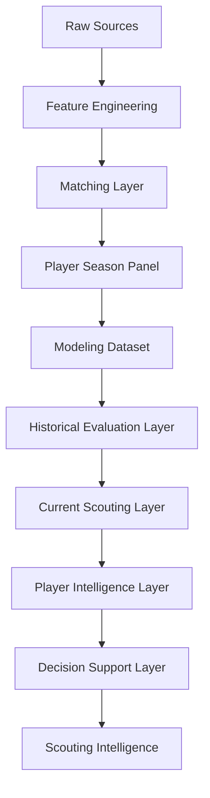
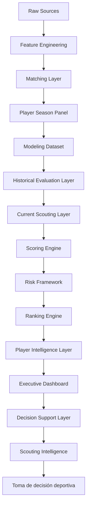
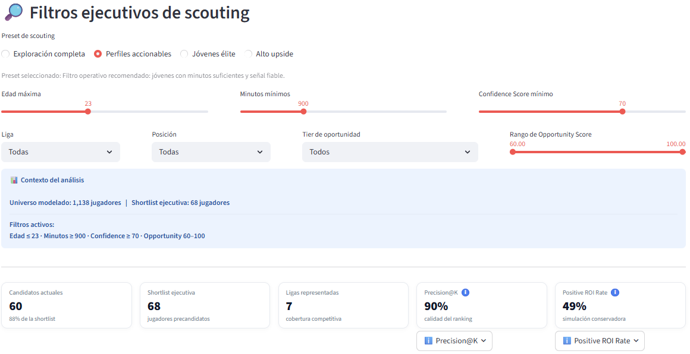
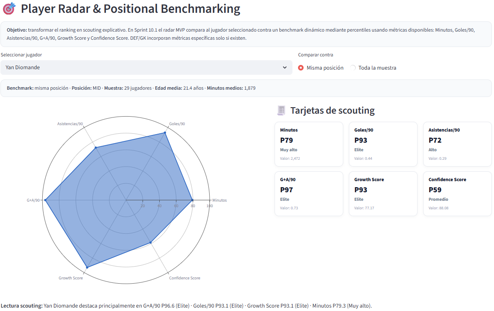
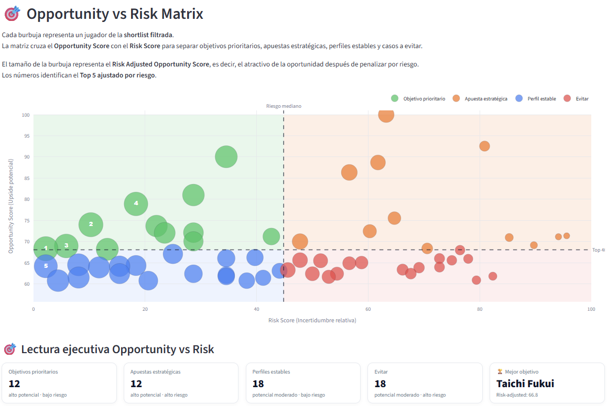

# 📊 Identificación de jugadores infravalorados en el mercado de fichajes europeo


## Historial de releases

| Release | Contenido principal |
|----------|----------|
| v0.1.0 | Data Pipeline |
| v0.2.0 | Econometric Baseline |
| v0.3.0 | MLflow |
| v0.4.0 | Machine Learning |
| v0.5.0 | Explainability |
| v0.6.0 | Scoring Engine |
| v0.7.0 | Dashboard |
| v0.8.0 | Dashboard Productizado |
| v1.0.0 | Scouting Intelligence Platform |

---

## 📑 Tabla de contenidos

- [Historial de releases](#historial-de-releases)
- [Resumen ejecutivo](#-resumen-ejecutivo)
- [Resultados clave](#-resultados-clave)
- [Problema de negocio](#-problema-de-negocio)
- [Objetivos del proyecto](#-objetivos-del-proyecto)
- [Contribuciones del proyecto](#-contribuciones-del-proyecto)
- [Arquitectura global](#-arquitectura-global)
- [Metodología](#-metodología)
- [Fuentes de datos](#-fuentes-de-datos)
- [Sistema de matching](#-sistema-de-matching)
- [Dataset final](#-dataset-final)
- [Diccionario resumido de variables](#-diccionario-resumido-de-variables)
- [Feature Engineering](#-feature-engineering)
- [Modelización econométrica](#-modelización-econométrica)
- [Machine Learning](#-machine-learning)
- [Experiment Tracking con MLflow](#-experiment-tracking-con-mlflow)
- [Explainability](#-explainability)
- [Evaluación técnica](#-evaluación-técnica)
- [Evaluación de negocio](#-evaluación-de-negocio)
- [Resultados finales](#-resultados-finales)
- [Scoring Intelligence Engine](#-scoring-intelligence-engine)
- [Capturas de la plataforma](#-capturas-de-la-plataforma)
- [Dashboard y DSS](#️-dashboard-y-dss)
- [Scouting Intelligence Platform](#-scouting-intelligence-platform)
- [Valor para departamentos deportivos](#-valor-para-departamentos-deportivos)
- [Estado actual del proyecto](#-estado-actual-del-proyecto)
- [Limitaciones](#-limitaciones)
- [Roadmap](#-roadmap)
- [Estructura del proyecto](#-estructura-del-proyecto)
- [Reproducibilidad](#-reproducibilidad)
- [Ejecución reproducible](#️-ejecución-reproducible)
- [Referencias](#-referencias)
- [Autoría](#-autoría)
- [Conclusión](#-conclusión)

---

## 🧠 Resumen ejecutivo

Este Trabajo Fin de Máster desarrolla una plataforma integral de Football Analytics orientada a la identificación de jugadores infravalorados en el mercado europeo de fichajes.

El proyecto combina:

- econometría aplicada
- machine learning supervisado
- explainability
- scoring multicriterio
- visual analytics
- decision support systems

con el objetivo de transformar grandes volúmenes de datos futbolísticos en recomendaciones accionables para departamentos deportivos.

La plataforma implementada permite:

- estimar el valor de mercado esperado de jugadores
- detectar ineficiencias de mercado
- identificar oportunidades de fichaje
- cuantificar el riesgo asociado a cada recomendación
- priorizar objetivos de scouting

La versión actual corresponde a:

```text
v1.0.0 — Scouting Intelligence Platform
```

y representa la culminación de diez sprints de desarrollo incremental.

---

## 📌 Resultados clave

- Match Rate: 88%
- 24.194 observaciones integradas
- 21.245 observaciones emparejadas
- 3.916 observaciones modelizables
- 2.136 jugadores únicos
- R² OLS: 0.5258
- R² Tuned XGBoost: 0.5414
- Precision@10: 90%
- Release: v1.0.0 — Scouting Intelligence Platform

---

## 🎯 Problema de negocio

La toma de decisiones en el mercado de fichajes se caracteriza por:

- información incompleta
- elevada incertidumbre
- recursos limitados
- sesgos cognitivos
- asimetrías informativas

Los clubes deben seleccionar un número reducido de jugadores dentro de un universo potencialmente compuesto por miles de futbolistas distribuidos entre múltiples ligas y competiciones.

La pregunta central del proyecto es:

> ¿Qué jugadores presentan un valor de mercado observado inferior al valor que cabría esperar dadas sus características deportivas, edad, experiencia y rendimiento reciente?

Responder esta pregunta permite detectar potenciales ineficiencias de mercado y apoyar estrategias de captación basadas en creación de valor.

---

## 🎯 Objetivos del proyecto

### Objetivo empresarial

Desarrollar una metodología reproducible capaz de identificar jugadores infravalorados bajo una lógica:

```text
Buy Low
↓
Develop
↓
Sell High
```

con potencial aplicación en departamentos de scouting profesional.

---

### Objetivos analíticos

#### Objetivo 1

Construir un dataset longitudinal jugador-temporada mediante integración de múltiples fuentes.

#### Objetivo 2

Modelizar el valor de mercado esperado mediante técnicas econométricas y de machine learning.

#### Objetivo 3

Comparar capacidad predictiva e interpretabilidad entre ambos enfoques.

#### Objetivo 4

Diseñar métricas compuestas orientadas a scouting.

#### Objetivo 5

Construir una capa de soporte a decisiones basada en rankings, scoring y visual analytics.

#### Objetivo 6

Transformar resultados analíticos en recomendaciones operativas para scouting profesional.

---

## 🏆 Contribuciones del proyecto

### Contribuciones académicas

- aplicación de CRISP-DM al ámbito futbolístico
- integración de econometría y machine learning
- validación temporal estricta
- evaluación orientada a negocio
- estudio de ineficiencias de mercado deportivas

---

### Contribuciones técnicas

- matching multi-fuente FBref ↔ Transfermarkt
- arquitectura modular reproducible
- experiment tracking mediante MLflow
- explainability basada en SHAP
- scoring multicriterio
- dashboard interactivo

---

### Contribuciones de negocio

- Opportunity Score
- Risk Score
- Ranking Engine
- Player Intelligence Layer
- Decision Support Layer
- Scouting Intelligence Platform

---

## 🏗️ Arquitectura global

La arquitectura final se organiza en múltiples capas analíticas especializadas.



---

### Arquitectura funcional

```text
Raw Sources
↓
Feature Engineering
↓
Matching Layer
↓
Player Season Panel
↓
Modeling Dataset
↓
Historical Evaluation Layer
↓
Current Scouting Layer
↓
Player Intelligence Layer
↓
Decision Support Layer
↓
Scouting Intelligence
```

---

### 🏗️ Arquitectura funcional final

La evolución completa del proyecto puede resumirse mediante:

```text
Raw Data
↓
Feature Engineering
↓
Matching Layer
↓
Player Season Panel
↓
Modeling Dataset
↓
Historical Evaluation Layer
↓
Current Scouting Layer
↓
Scoring Engine
↓
Risk Framework
↓
Ranking Engine
↓
Player Intelligence Layer
↓
Executive Dashboard
↓
Decision Support Layer
↓
Scouting Intelligence
↓
Toma de decisión deportiva
```

---

#### Diagrama global



---

### Historical Evaluation Layer

Responsable de:

- entrenamiento
- validación temporal
- comparación de modelos
- evaluación metodológica

---

### Current Scouting Layer

Responsable de:

- scoring operativo
- ranking actual
- oportunidades recientes
- shortlist de scouting

---

### Player Intelligence Layer

Responsable de:

- player radar
- benchmarking posicional
- perfiles individuales
- scouting narrative

---

### Decision Support Layer

Responsable de:

- visual analytics
- dashboards
- opportunity matrix
- risk matrix

---

## 📚 Metodología

El proyecto sigue una adaptación de CRISP-DM.


---

### 1. Business Understanding

Definición del problema:

```text
Identificación de jugadores infravalorados
```

y evaluación de su utilidad para procesos de scouting.

---

### 2. Data Understanding

Análisis exploratorio de:

- FBref
- Transfermarkt

incluyendo cobertura, calidad y compatibilidad.

---

### 3. Data Preparation

Incluye:

- matching
- feature engineering
- limpieza
- normalización
- construcción del panel

---

### 4. Modeling

Desarrollo de:

- modelos econométricos
- modelos ML
- tuning
- validación temporal

---

### 5. Evaluation

Evaluación:

#### Técnica

- RMSE
- MAE
- R²

#### Negocio

- Precision@K
- ROI potencial
- Positive ROI Rate

---

### 6. Deployment

Implementación mediante:

- MLflow
- artefactos serializados
- dashboard Streamlit

---

## 📦 Fuentes de datos

### FBref

Fuente principal de rendimiento deportivo.

Variables extraídas:

- minutos
- goles
- asistencias
- acciones defensivas
- progresión
- posesión

---

### Transfermarkt

Fuente principal de mercado.

Variables extraídas:

- valor de mercado
- edad
- club
- posición
- histórico de valor

---

### Cobertura geográfica

- Premier League
- LaLiga
- Bundesliga
- Serie A
- Ligue 1
- Eredivisie
- Liga Portugal

---

## 🔗 Sistema de matching

Uno de los principales retos técnicos del proyecto fue la ausencia de un identificador universal compartido entre FBref y Transfermarkt.

Se desarrolló un pipeline jerárquico específico.

```text
Normalización
↓
Exact Matching
↓
Club Validation
↓
Fuzzy Matching
↓
Age Validation
```

---

### Métricas oficiales v1.0.0

| Métrica | Valor |
|----------|----------:|
| Observaciones panel | 24.194 |
| Observaciones emparejadas | 21.245 |
| Match Rate | ≈88% |

---

### Contribución metodológica

El matching constituye uno de los principales aportes técnicos del proyecto y fue determinante para la construcción del panel longitudinal utilizado durante toda la investigación.

---

## 📊 Dataset final

### Panel completo

| Métrica | Valor |
|----------|----------:|
| Observaciones | 24.194 |
| Temporadas | 2019-2020 → 2025-2026 |
| Ligas | 7 |

---

### Dataset modelizable

| Métrica | Valor |
|----------|----------:|
| Observaciones | 3.916 |
| Jugadores únicos | 2.136 |
| Edad | 18-23 |

---

### Distribución temporal

| Temporada | Observaciones |
|----------|----------:|
| 2019-2020 | 537 |
| 2020-2021 | 536 |
| 2021-2022 | 544 |
| 2022-2023 | 542 |
| 2023-2024 | 586 |
| 2024-2025 | 552 |
| 2025-2026 | 619 |

---

## 📖 Diccionario resumido de variables

### Variables demográficas

- age
- position
- league
- club

---

### Variables de rendimiento

- minutes_played
- goals_per90
- assists_per90
- tackles_per90
- interceptions_per90

---

### Variables de mercado

- market_value_eur
- log_market_value_eur
- market_value_growth

---

### Variables derivadas

- growth_score
- confidence_score
- opportunity_score
- risk_score

---

## ⚙️ Feature Engineering

El proyecto incorpora múltiples capas de transformación.

### Growth Features

Variables orientadas a capturar evolución temporal.

Ejemplos:

- market_value_growth_prev
- delta_log_market_value_prev
- breakout_indicator
- career_year

---

### Composite Football Indices

Construidos durante Sprint 3.

Ejemplos:

- finishing_index
- playmaking_index
- experience_index
- growth_index

---

### Variables normalizadas

Se aplican transformaciones:

- logarítmicas
- escalado robusto
- winsorización
- estandarización

---

### Variables utilizadas en modelización

Las variables finales combinan:

- edad
- experiencia
- rendimiento ofensivo
- rendimiento defensivo
- progresión
- contexto competitivo
- dinámica temporal


## 📈 Modelización econométrica

La primera aproximación metodológica del proyecto se basa en econometría aplicada al fútbol profesional.

El objetivo es construir un modelo interpretable capaz de estimar el valor de mercado esperado de un jugador a partir de sus características deportivas y contextuales.

---

### Justificación

La literatura académica sobre valoración de futbolistas utiliza tradicionalmente modelos econométricos debido a:

- elevada interpretabilidad
- facilidad de explicación
- análisis de elasticidades
- inferencia estadística

Por ello, el proyecto incorpora una capa econométrica completa antes de desarrollar modelos de Machine Learning.

---

### Variable objetivo

Se utiliza:

```text
log_market_value_eur
```

en lugar del valor de mercado bruto.

#### Motivación

La distribución del valor de mercado presenta:

- fuerte asimetría positiva
- colas largas
- heterocedasticidad

La transformación logarítmica permite:

- estabilizar varianza
- mejorar capacidad predictiva
- facilitar interpretación

---

### Especificación base

```python
log_market_value_eur ~
age +
log_minutes_played +
goals_per90 +
assists_per90
```

---

### Evolución del modelo

#### Baseline OLS

Variables simples:

- edad
- minutos
- goles
- asistencias

---

#### Growth OLS

Incorpora:

- crecimiento histórico
- experiencia acumulada
- indicadores compuestos
- variables temporales

Esta especificación constituye el benchmark econométrico final.

---

### Resultados finales

| Modelo | MAE | RMSE | R² |
|----------|----------:|----------:|----------:|
| Growth OLS | 0.7287 | 0.9053 | 0.5258 |

---

### Interpretación

El modelo captura aproximadamente:

```text
52.6%
```

de la variabilidad observada en los valores de mercado.

Aunque existen limitaciones inherentes a la linealidad del modelo, proporciona una base sólida para comparación con algoritmos más complejos.

---

## 🤖 Machine Learning

Tras establecer el benchmark econométrico se desarrolla una segunda capa basada en Machine Learning supervisado.

---

### Objetivo

Capturar:

- relaciones no lineales
- interacciones complejas
- patrones difíciles de modelizar mediante regresión lineal

---

### Algoritmos evaluados

#### Random Forest

Ventajas:

- robustez
- baja sensibilidad al ruido
- interpretabilidad relativa

---

#### LightGBM

Ventajas:

- velocidad
- eficiencia computacional
- escalabilidad

---

#### HistGradientBoosting

Ventajas:

- implementación optimizada
- entrenamiento rápido

---

#### XGBoost

Ventajas:

- elevado rendimiento en datos tabulares
- capacidad de generalización
- manejo de relaciones complejas

---

### Tuning de hiperparámetros

Todos los modelos fueron optimizados mediante búsqueda sistemática.

Parámetros ajustados:

#### Random Forest

- n_estimators
- max_depth
- min_samples_leaf

#### LightGBM

- learning_rate
- num_leaves
- max_depth

#### XGBoost

- learning_rate
- max_depth
- n_estimators
- subsample
- colsample_bytree

---

### Modelo productivo

Tras la evaluación comparativa se selecciona:

```text
Tuned XGBoost
```

como modelo operativo.

---

### Resultados finales

| Modelo | MAE | RMSE | R² |
|----------|----------:|----------:|----------:|
| Tuned XGBoost | 0.7120 | 0.8892 | 0.5414 |

---

### Decisión metodológica

El proyecto adopta:

```text
Growth OLS
=
Benchmark interpretable

Tuned XGBoost
=
Modelo productivo
```

Esta separación combina:

- rigor académico
- interpretabilidad
- capacidad predictiva

---

## 🔬 Experiment Tracking con MLflow

El proyecto incorpora una capa completa de seguimiento experimental mediante MLflow.

---

### Objetivos

Garantizar:

- reproducibilidad
- trazabilidad
- comparabilidad

entre experimentos.

---

### Información registrada

#### Parámetros

- hiperparámetros
- configuraciones
- seeds

#### Métricas

- MAE
- RMSE
- R²
- métricas de negocio

#### Artefactos

- modelos serializados
- gráficos
- tablas
- datasets

---

### Beneficios

MLflow permite reconstruir completamente cualquier experimento ejecutado durante el desarrollo del TFM.

---

## 🔍 Explainability

Uno de los objetivos del proyecto es evitar sistemas de caja negra difíciles de interpretar.

Por ello se incorpora una capa de Explainability basada en SHAP.

---

### SHAP

SHAP (SHapley Additive exPlanations) permite explicar:

- predicciones globales
- predicciones individuales

---

### Explainability global

Responde a:

> ¿Qué variables son más importantes para el modelo?

Outputs generados:

- Feature Importance
- SHAP Importance
- Summary Plot

---

### Explainability local

Responde a:

> ¿Por qué el modelo estima un valor determinado para este jugador?

Outputs generados:

- drivers positivos
- drivers negativos
- explicación individual

---

### Aplicación a scouting

La interpretabilidad permite justificar recomendaciones ante:

- dirección deportiva
- scouting
- analistas

reduciendo la opacidad del modelo.

---

## 📊 Evaluación técnica

La evaluación técnica se realiza mediante validación temporal estricta.

---

### Motivación

Evitar:

```text
Data Leakage
```

y aproximar escenarios reales de uso.

---

### Esquema temporal final

```text
Train:
2019-2020 → 2024-2025

Current Scouting:
2025-2026
```

Las temporadas 2019-2020 → 2024-2025 se utilizan para entrenamiento y evaluación histórica.

La temporada 2025-2026 se reserva para la capa Current Scouting Layer y no participa en el entrenamiento de modelos.

---

### Métricas utilizadas

#### MAE

Error absoluto medio.

#### RMSE

Penaliza errores grandes.

#### R²

Capacidad explicativa.

---

### Comparativa final

| Modelo | MAE | RMSE | R² |
|----------|----------:|----------:|----------:|
| Growth OLS | 0.7287 | 0.9053 | 0.5258 |
| Tuned XGBoost | 0.7120 | 0.8892 | 0.5414 |

---

### Conclusión

El modelo ML mejora consistentemente el benchmark econométrico.

---

## 💼 Evaluación de negocio

La evaluación técnica resulta insuficiente para determinar utilidad operativa.

Por ello se desarrolla una capa de evaluación orientada a negocio.

---

### Pregunta principal

> ¿Los jugadores identificados generan realmente oportunidades de mercado?

---

### Precision@K

Mide:

```text
Proporción de jugadores exitosos
dentro de los K primeros rankings
```

---

### Resultados

| K | Precision@K |
|---:|---:|
| 10 | 0.90 |
| 20 | 0.90 |
| 50 | 0.90 |
| 100 | 0.85 |

---

### Positive ROI Rate

Evalúa:

```text
Porcentaje de jugadores con
retorno positivo potencial
```

---

### Simulación ROI

Se desarrollan simulaciones para estimar:

- valor capturado
- upside agregado
- potencial económico

---

### Conclusión

La evaluación de negocio demuestra que el sistema genera rankings con utilidad práctica para procesos de scouting.

---

## 🏆 Resultados finales

### Calidad del matching

| Métrica | Valor |
|----------|----------:|
| Observaciones panel | 24.194 |
| Observaciones emparejadas | 21.245 |
| Match Rate | 88% |

---

### Dataset modelizable

| Métrica | Valor |
|----------|----------:|
| Observaciones | 3.916 |
| Jugadores únicos | 2.136 |
| Cobertura | 2019-2020 → 2025-2026 |
| Ligas | 7 |

---

### Benchmark econométrico

| Modelo | MAE | RMSE | R² |
|----------|----------:|----------:|----------:|
| Growth OLS | 0.7287 | 0.9053 | 0.5258 |

---

### Modelo productivo

| Modelo | MAE | RMSE | R² |
|----------|----------:|----------:|----------:|
| Tuned XGBoost | 0.7120 | 0.8892 | 0.5414 |

---

### Evaluación de negocio

| K | Precision@K |
|---:|---:|
| 10 | 0.90 |
| 20 | 0.90 |
| 50 | 0.90 |
| 100 | 0.85 |

---

## 🎯 Scoring Intelligence Engine

Una vez generadas las predicciones, el proyecto transforma dichas señales en métricas operativas.

---

### Arquitectura

```text
Predicción
↓
Scoring
↓
Ranking
↓
Scouting Intelligence
```

---

### Filosofía

La decisión de fichar un jugador no depende únicamente del valor estimado.

Es necesario incorporar:

- potencial
- confianza
- riesgo
- contexto

---

### Inefficiency Score

Mide:

```text
Valor esperado
-
Valor observado
```

Cuanto mayor sea la diferencia positiva:

mayor potencial de infravaloración.

---

### Growth Score

Captura:

- evolución reciente
- trayectoria
- potencial futuro

---

### Confidence Score

Captura:

- estabilidad estadística
- robustez de la señal
- confianza en la predicción

---

### Opportunity Score

Combina todas las dimensiones anteriores.

```python
0.55 * inefficiency_score_z +
0.25 * growth_score_z +
0.20 * confidence_score_z
```

---

### Resultado

Obtención de una métrica única de priorización.

---

## 🏅 Ranking Engine

La última capa analítica transforma los scores en rankings accionables.

---

### Inputs

- Opportunity Score
- Growth Score
- Confidence Score

---

### Outputs

```text
scoring_dataset.csv
scouting_shortlist.csv
```

---

### Funciones

#### Ranking global

Todos los jugadores.

#### Ranking por posición

- DEF
- MID
- ATT
- GK

#### Ranking por liga

Comparación intra-competición.

#### Ranking operativo

Shortlist priorizada.

---

### Beneficio

Reduce miles de jugadores potenciales a un conjunto manejable de candidatos prioritarios.

---

## 🚀 Evolución metodológica (Sprint 1 → Sprint 6)

### Sprint 1

#### Positional Normalization

Objetivo:

Construir un lenguaje común entre competiciones.

Contribuciones:

- estandarización de posiciones
- limpieza inicial

---

### Sprint 2

#### Growth Features

Introducción de dinámica temporal.

Contribuciones:

- crecimiento histórico
- evolución del jugador

---

### Sprint 3

#### Composite Football Indices

Construcción de indicadores compuestos.

Contribuciones:

- finishing index
- playmaking index
- experience index
- growth index

---

### Sprint 4A

#### Machine Learning Baseline

Primeros modelos ML.

---

### Sprint 4B

#### Improved ML Pipeline

Tuning y optimización.

---

### Sprint 4C

#### Explainability

Integración de SHAP.

---

### Sprint 5

#### Scoring Engine

Nacimiento del Opportunity Score.

---

### Sprint 6

#### Business Evaluation

Evaluación orientada a negocio.

Introducción de:

- Precision@K
- ROI Analysis
- Positive ROI Rate

---

### Resultado acumulado

Tras Sprint 6 el proyecto ya dispone de:

```text
Dataset Integrado
+
Econometría
+
Machine Learning
+
Explainability
+
Scoring
+
Evaluación de negocio
```

constituyendo la base analítica sobre la que posteriormente se construyen el Dashboard, DSS y la Scouting Intelligence Platform.

---

## 📸 Capturas de la plataforma

Las siguientes figuras muestran las principales funcionalidades desarrolladas durante los Sprint 7–10.3 y representan la evolución del proyecto desde un sistema predictivo hasta una plataforma de Scouting Intelligence orientada a soporte a decisiones deportivas.

---

## 🖥️ Dashboard y DSS

A partir del Sprint 7 el proyecto evoluciona desde un sistema puramente analítico hacia una plataforma orientada al consumo de resultados por usuarios de negocio.

El objetivo es reducir la distancia entre:

```text
Modelo
↓
Resultado analítico
↓
Decisión deportiva
```

---

### 🚀 Sprint 7 — Executive Dashboard

Sprint 7 introduce la primera capa visual de consumo de resultados.

#### Objetivo

Transformar los outputs analíticos en una herramienta accesible para procesos de scouting cuantitativo.

---

#### Funcionalidades implementadas

##### 📊 Executive KPIs

Visualización integrada de:

- jugadores en shortlist
- Precision@K
- Positive ROI Rate
- ligas representadas
- opportunity score medio

---

##### 📋 Ranking interactivo

Exploración dinámica mediante:

- paginación
- ordenación
- filtros
- búsqueda

---

##### 🔍 Explainability

Integración de:

- SHAP local
- drivers positivos
- drivers negativos
- interpretación ejecutiva

---

##### 👤 Perfil individual

Cada jugador incorpora:

- valor actual
- valor esperado
- gap de mercado
- Opportunity Score
- ranking
- recomendación analítica

---

#### Contribución metodológica

Sprint 7 constituye la primera capa real de consumo de resultados del proyecto.

---

### 🚧 Sprint 8 — Reserved

Tras la revisión académica del proyecto se decidió reservar el Sprint 8.

Las funcionalidades inicialmente previstas evolucionaron posteriormente hacia el Sprint 9.

Esta decisión evitó:

- duplicidades funcionales
- complejidad innecesaria
- fragmentación metodológica

---

### 🎯 Sprint 9 — Executive Dashboard & Decision Support Layer

Sprint 9 representa la transición desde un dashboard descriptivo hacia un verdadero sistema DSS (Decision Support System).

---

#### Objetivo

Reducir la distancia entre:

```text
Predicción
↓
Scoring
↓
Ranking
↓
Decisión deportiva
```

---

#### Dashboard ejecutivo



---

#### Sprint 9.1 — Executive Scouting Filters

##### Funcionalidades

- filtros dinámicos
- presets de scouting
- segmentación automática
- shortlist ejecutiva

---

##### Variables de segmentación

- Liga
- Posición
- Edad
- Opportunity Score
- Confidence Score

---

#### Sprint 9.2 — Visual Analytics

##### Cost vs Upside Matrix

Nueva matriz estratégica basada en:

- coste de adquisición
- upside potencial
- Opportunity Score

---

##### Interpretación

| Zona | Significado |
|--------|--------|
| Comprar | Bajo coste + alto upside |
| Premium | Alto upside + coste elevado |
| Seguimiento | Potencial moderado |
| Baja prioridad | Menor atractivo |

---

##### Top 5 destacados

Identificación automática de los mejores perfiles dentro del universo filtrado.

---

#### Sprint 9.3 — Decision Support

Sprint 9 culmina con la primera implementación DSS del proyecto.

Arquitectura:

```text
Predicción
↓
Scoring
↓
Ranking
↓
Visual Analytics
↓
Decision Support
↓
Scouting
```

---

#### Contribución metodológica

La plataforma deja de ser únicamente un sistema predictivo para convertirse en una herramienta de apoyo a decisiones deportivas.

---

### 🧠 Scouting Intelligence Platform

El Sprint 10 constituye la evolución más importante del proyecto.

Introduce una arquitectura orientada explícitamente a procesos modernos de scouting profesional.

---

#### Objetivos

- separar validación histórica y scouting operativo
- incorporar riesgo analítico
- introducir benchmarking avanzado
- desarrollar inteligencia de jugador

---

#### 👤 Sprint 10.1 — Player Intelligence Layer

Sprint 10.1 introduce una nueva capa analítica centrada en la interpretación individual del jugador.

---

##### Player Intelligence Layer



---

##### Player Radar MVP

Construcción de radares posicionales para:

- MID
- ATT

Variables utilizadas:

- minutos
- goles/90
- asistencias/90
- G+A/90
- Growth Score
- Confidence Score

---

##### Positional Benchmarking

Comparación respecto a:

###### Grupo posicional

```text
MID vs MID
ATT vs ATT
DEF vs DEF
GK vs GK
```

###### Universo completo

Comparación relativa frente a todos los jugadores modelados.

---

##### Scouting Narrative

Generación automática de narrativa analítica basada en:

- fortalezas
- debilidades
- upside
- oportunidad

---

##### Contribución

Nacimiento de la:

```text
Player Intelligence Layer
```

---

#### 📈 Sprint 10.2 — FBref Advanced Metrics Audit

Antes de ampliar el modelo se realiza una auditoría completa de las tablas avanzadas disponibles en FBref.

---

##### Tablas auditadas

###### Shooting

- shots
- shots on target
- shot distance

###### Passing

- progressive passes
- key passes
- passes completed

###### Possession

- carries
- progressive carries
- take-ons

###### Defense

- tackles
- interceptions
- blocks

###### Goal & Shot Creation

- SCA
- GCA

###### Misc

- aerials
- fouls
- recoveries

###### Playing Time

- minutes
- starts
- appearances

---

##### Resultado

La auditoría sirve como base para futuras fases de enriquecimiento.

---

#### Sprint 10.3 — Risk Framework & Current Scouting Layer

Sprint 10.3 introduce una separación explícita entre evaluación histórica y scouting operativo, además de incorporar una dimensión formal de riesgo dentro del proceso de identificación de oportunidades de mercado.

---

##### Opportunity vs Risk Matrix



---

##### Problema metodológico

Hasta Sprint 10.2 coexistían en el mismo flujo analítico:

- validación histórica
- evaluación de modelos
- identificación de oportunidades actuales

Esta aproximación mezclaba objetivos metodológicos distintos y podía generar confusión entre el rendimiento histórico del sistema y su aplicación operativa en procesos de scouting.

---

##### Solución

Se introduce una separación formal entre:

```text
Historical Evaluation Layer
```

y

```text
Current Scouting Layer
```

permitiendo distinguir claramente entre:

- evaluación científica del modelo;
- validación temporal;
- identificación de oportunidades actuales;
- soporte a decisiones deportivas.

---

##### Historical Evaluation Layer

Capa utilizada exclusivamente para:

- entrenamiento de modelos;
- validación temporal;
- comparación de algoritmos;
- evaluación metodológica;
- análisis de robustez.

Su objetivo es responder a la pregunta:

> ¿Qué capacidad predictiva presenta el sistema sobre datos históricos?

---

##### Current Scouting Layer

Capa orientada a explotación operativa.

Se utiliza para:

- generar rankings actuales;
- identificar oportunidades recientes;
- construir shortlists;
- alimentar el dashboard ejecutivo.

Su objetivo es responder a la pregunta:

> ¿Qué jugadores representan actualmente oportunidades potenciales de mercado?

---

##### Outputs principales

```text
tuned_xgboost_predictions.csv

scoring_dataset.csv

scouting_shortlist.csv

scouting_shortlist_with_risk.csv
```

---

##### Risk Framework

Sprint 10.3 incorpora una dimensión explícita de riesgo dentro de la lógica de priorización de jugadores.

La oportunidad de fichaje no depende únicamente del upside potencial.

También depende de factores relacionados con:

- incertidumbre;
- estabilidad;
- robustez de la señal;
- confianza en la estimación.

El objetivo es aproximar una lógica de decisión basada en riesgo-retorno similar a la utilizada en otros ámbitos analíticos.

---

##### Risk Score

Métrica diseñada para cuantificar el nivel de riesgo asociado a cada recomendación generada por el sistema.

El score combina diferentes dimensiones relacionadas con:

- estabilidad estadística;
- consistencia histórica;
- robustez de la señal analítica.

Valores elevados indican una mayor incertidumbre asociada a la oportunidad identificada.

---

##### Risk Adjusted Opportunity

La combinación de Opportunity Score y Risk Score permite construir una evaluación ajustada por riesgo.

Esto permite diferenciar perfiles como:

```text
High Potential / Low Risk

High Potential / High Risk

Moderate Potential / Low Risk

Moderate Potential / High Risk
```

Esta aproximación resulta especialmente útil para adaptar la estrategia de scouting a diferentes perfiles de riesgo.

---

##### Opportunity vs Risk Matrix

La matriz Opportunity vs Risk constituye la principal herramienta visual desarrollada en Sprint 10.3.

Se construye a partir de:

```text
Opportunity Score
Risk Score
```

y permite clasificar automáticamente los jugadores según su equilibrio entre potencial y riesgo.

---

###### Objetivo

Priorizar:

- objetivos inmediatos;
- oportunidades de mercado;
- apuestas estratégicas;
- perfiles de seguimiento.

---

###### Beneficio

La incorporación explícita de la dimensión riesgo-retorno permite enriquecer significativamente el proceso de toma de decisiones deportivas y representa uno de los principales avances metodológicos de la Scouting Intelligence Platform.

---

###### Contribución metodológica

Sprint 10.3 culmina la evolución del proyecto desde un sistema de predicción de valor de mercado hacia una plataforma integral de Scouting Intelligence capaz de combinar:

```text
Predicción
+
Scoring
+
Riesgo
+
Ranking
+
Player Intelligence
+
Decision Support
```

dentro de un marco analítico unificado orientado a departamentos deportivos profesionales.

---

## ⚽ Valor para departamentos deportivos

La plataforma desarrollada permite transformar grandes volúmenes de información futbolística en procesos de decisión accionables.

Aplicaciones potenciales:

- Identificación de jugadores infravalorados.
- Priorización objetiva de targets.
- Reducción del universo de scouting.
- Comparación entre mercados y ligas.
- Detección temprana de talento emergente.
- Evaluación riesgo-retorno de fichajes.

La arquitectura propuesta permite complementar el scouting tradicional con evidencia cuantitativa reproducible.

---

## ✅ Estado actual del proyecto

Actualmente la plataforma incorpora:

- integración multi-fuente
- matching jerárquico
- panel longitudinal
- econometría aplicada
- machine learning supervisado
- MLflow
- SHAP
- Opportunity Score
- Risk Score
- Ranking Engine
- Executive Dashboard
- DSS
- Player Radar MVP
- Positional Benchmarking
- Player Intelligence Layer
- Scouting Intelligence Layer

Versión actual:

```text
v1.0.0 — Scouting Intelligence Platform
```

---

## ⚠️ Limitaciones

### Limitaciones de datos

- dependencia de Transfermarkt
- ausencia de identificador universal
- matching imperfecto

---

### Limitaciones deportivas

- ausencia de datos tracking
- ausencia de eventos avanzados completos
- cobertura parcial de algunas métricas

---

### Limitaciones metodológicas

- riesgo de cambios estructurales del mercado
- dependencia temporal
- posible drift futuro

---

## 🛣️ Roadmap

### Sprint 11 — Advanced Football Radar

Nuevos radares:

- Shooting
- Defense
- Possession
- Misc

---

### Sprint 12 — Data Enrichment

Integración:

- Understat
- xG
- xA
- progresión avanzada

---

### Sprint 13 — Advanced Modeling

Evaluación de:

- CatBoost
- TabPFN
- Ensemble Models

---

### Sprint 14 — Production Layer

Implementación de:

- API
- inferencia automatizada
- actualización periódica
- despliegue productivo

---

## 📂 Estructura del proyecto

``` bash
market-value-football-tfm/

├── app/                                   # Aplicación interactiva y capa Decision Support
│   ├── streamlit_app.py                   # Executive Dashboard
│   └── utils/                             # Utilidades específicas del dashboard
│       ├── charts.py                      # Visualizaciones y gráficos interactivos
│       ├── formatters.py                  # Formateo de KPIs, métricas y valores monetarios
│       └── loaders.py                     # Carga de datos y outputs analíticos
│
├── artifacts/                             # Artefactos persistidos de modelos y predicciones
│   ├── encoders/                          # Encoders categóricos serializados
│   ├── feature_importance/                # Importancia de variables exportada
│   ├── metadata/                          # Metadata y hashes de datasets versionados
│   ├── models/                            # Modelos entrenados (.joblib)
│   ├── predictions/                       # Predicciones persistidas
│   └── scalers/                           # Transformadores numéricos serializados
│
├── config/                                # Configuración centralizada del sistema
│   ├── config.yaml
│   ├── config_backup.yaml
│   ├── features.yaml                      # Configuración de feature engineering
│   ├── matching.yaml                      # Parámetros de matching
│   ├── modeling.yaml                      # Configuración de modelización
│   ├── paths.yaml                         # Paths del proyecto
│   ├── project.yaml                       # Configuración global
│   ├── scoring.yaml                       # Configuración de scoring y rankings
│   └── validation.yaml                    # Configuración centralizada de validación temporal
│
├── data/
│   ├── external/                          # Datos auxiliares externos
│   ├── interim/                           # Datos parcialmente transformados
│   ├── processed/                         # Datasets finales reutilizables
│   └── raw/                               # Datos originales sin procesar
│
├── docs/                                  # Documentación técnica y metodológica
│   ├── architecture.md                    # Arquitectura completa del sistema
│   ├── data_dictionary.md                 # Diccionario de variables y outputs
│   ├── data_quality.md                    # Evaluación de calidad de datos
│   ├── data_sources.md                    # Fuentes de datos y matching
│   ├── feature_engineering_plan.md        # Roadmap de feature engineering
│   ├── modeling_decisions.md              # Decisiones metodológicas de modelización
│   ├── pipeline_reference.md              # Referencia técnica de pipelines
│   ├── README.md                          # Índice central de documentación
│   └── schema_decisions.md                # Diseño de esquema y arquitectura de datos
│
├── logs/                                  # Logs de ejecución y debugging
│
├── mlruns/                                # Tracking experimental MLflow
│
├── notebooks/                             # Notebooks exploratorios y análisis
│   ├── 01_data_understanding.ipynb
│   ├── 02_econometric_baseline.ipynb
│   ├── 03_econometric_model.ipynb
│   ├── 04_supervised_machine_learning.ipynb
│   └── README.md
│
├── reports/                               # Outputs analíticos y reporting
│   ├── business/                          # Métricas de negocio y evaluación de impacto
│   ├── evaluation/                        # Resultados de validación y evaluación de modelos
│   ├── figures/                           # Visualizaciones y figuras exportadas
│   │   ├── dashboard/                     # Capturas del DSS y Scouting Intelligence Platform
│   │   └── explainability/                # SHAP, feature importance y análisis interpretativo
│   ├── model_diagnostics/                 # Diagnósticos econométricos y de Machine Learning
│   ├── rankings/                          # Rankings de scouting y oportunidades de mercado
│   ├── scouting_reports/                  # Informes individuales de scouting
│   └── tables/                            # Métricas, tablas y resultados exportados
│
├── scripts/                               # Scripts auxiliares de setup, descarga y mantenimiento
│   └── download_data.sh                   # Descarga reproducible del dataset base externo
│
├── src/                                   # Lógica principal del sistema
│   ├── data/                              # Ingesta, matching y datasets
│   ├── features/                          # Feature engineering
│   ├── models/
│   │   ├── econometric/                   # Pipeline OLS
│   │   ├── evaluation/                    # Métricas y comparación
│   │   ├── machine_learning/              # Pipelines ML
│   │   └── scoring/                       # Inefficiency scoring
│   └── utils/                             # Utilidades compartidas
│       ├── config.py                      # Loader centralizado de configuración YAML
│       ├── dataset_versioning.py          # Versionado y hashing de datasets
│       └── experiment_tracking.py         # Integración MLflow
│
├── tests/                                 # Estructura reservada para validaciones automatizadas futuras
│   └── .gitkeep                           # Mantiene la carpeta en Git aunque esté vacía
│
├── .gitignore                             # Reglas de exclusión de Git
├── dataset-metadata.json                  # Metadata versionada del dataset actual
├── environment.yml                        # Entorno Conda
├── PROJECT_STATUS.md                      # Estado operativo del proyecto
├── README.md                              # Documentación principal
├── requirements-lock.txt                  # Dependencias fijadas
└── requirements.txt                       # Dependencias Python
```

### Principios de diseño

La arquitectura del proyecto se ha diseñado siguiendo los siguientes principios:

- Modularidad.
- Reproducibilidad.
- Escalabilidad.
- Separación de responsabilidades.
- Configuración centralizada.
- Trazabilidad experimental mediante MLflow.
- Compatibilidad con futuras capas de Scouting Intelligence.

La estructura facilita la incorporación de nuevas fuentes de datos, modelos predictivos, métricas avanzadas y funcionalidades de soporte a decisiones sin necesidad de modificar la arquitectura principal del sistema.

---

## 🔁 Reproducibilidad

La reproducibilidad constituye uno de los principios fundamentales del proyecto.

La arquitectura ha sido diseñada para garantizar que cualquier resultado pueda regenerarse a partir de los datos de entrada y de la configuración versionada del sistema.

---

### Versionado y trazabilidad

#### MLflow

Todos los experimentos son registrados mediante MLflow.

Se almacenan:

- hiperparámetros
- métricas
- modelos entrenados
- artefactos analíticos
- configuraciones utilizadas

---

#### Dataset Versioning

Cada dataset generado incorpora:

- hash de versión
- timestamp de generación
- metadata descriptiva

Esto permite reconstruir exactamente cualquier experimento realizado durante el desarrollo del proyecto.

---

#### Configuración centralizada

La configuración se encuentra desacoplada del código mediante archivos YAML:

```text
config/
├── features.yaml
├── matching.yaml
├── modeling.yaml
├── scoring.yaml
└── validation.yaml
```

Esto facilita la repetibilidad de experimentos y la modificación controlada de parámetros.

---

## ▶️ Ejecución reproducible

La ejecución completa del pipeline puede reproducirse siguiendo las etapas descritas a continuación.

---

### 1️⃣ Construir features FBref

```bash
python -m src.data.build_fbref_features
```

---

### 2️⃣ Construir features Transfermarkt

```bash
python -m src.data.build_transfermarkt_features
```

---

### 3️⃣ Construir panel jugador-temporada

```bash
python -m src.data.build_player_season_panel
```

---

### 4️⃣ Construir dataset modelizable

```bash
python -m src.data.build_modeling_dataset
```

---

### 5️⃣ Ejecutar pipeline econométrico

```bash
python -m src.models.econometric.run_ols_pipeline
```

---

### 6️⃣ Ejecutar pipeline Machine Learning

```bash
python -m src.models.machine_learning.run_ml_pipeline
```

---

### 7️⃣ Ejecutar Scoring Engine

```bash
python -m src.models.scoring.build_inefficiency_score
python -m src.models.scoring.build_growth_score
python -m src.models.scoring.build_confidence_score
python -m src.models.scoring.build_opportunity_score
python -m src.models.scoring.generate_rankings
```

---

### 8️⃣ Ejecutar capa de evaluación

```bash
python -m src.models.evaluation.build_ranking_diagnostics
python -m src.models.evaluation.build_roi_simulation
python -m src.models.evaluation.build_precision_at_k
```

---

### Resultado final

La ejecución completa genera:

```text
Predicciones
↓
Scoring
↓
Rankings
↓
Evaluación de negocio
↓
Outputs de scouting
↓
Dashboard ejecutivo
```

garantizando la reproducibilidad integral de los resultados presentados en este Trabajo Fin de Máster.

---

## 📚 Referencias

### Fuentes de datos

- FBref
- Transfermarkt

### Frameworks

- Scikit-Learn
- XGBoost
- LightGBM
- SHAP
- MLflow
- Streamlit

### Metodologías

- CRISP-DM (Chapman et al., 2000)
- Explainable AI mediante SHAP (Lundberg & Lee, 2017)

### Literatura académica relacionada

- Müller et al. (2017). Market Value Analysis in European Football.
- Herm et al. (2014). Determinants of Market Values in Professional Football.
- Peeters (2018). Testing Market Inefficiencies in European Football.
- Franck & Nüesch (2012). Talent and Transfer Markets in Football.
- Breiman (2001). Random Forests.
- Chen & Guestrin (2016). XGBoost: A Scalable Tree Boosting System.

---

## 👨‍🎓 Autoría

Trabajo Fin de Máster

**Market Value Dynamics and Market Inefficiency Detection in European Football**

Autores:

- Laura González Macho
- Isabel Muñoz Martín
- Manuel Pérez Bañuls

Tutor:

- Antonio Pita Lozano

---

## 🏁 Conclusión

El proyecto evoluciona desde un ejercicio de modelización predictiva hacia una plataforma integral de Football Analytics orientada a scouting profesional.

La combinación de:

```text
Econometría
+
Machine Learning
+
Explainability
+
Scoring
+
Decision Support
+
Player Intelligence
```

permite transformar datos deportivos en recomendaciones accionables para procesos de captación de talento.

La release:

```text
v1.0.0 — Scouting Intelligence Platform
```

constituye la primera versión funcional completa de una plataforma de Scouting Intelligence aplicada al mercado europeo de fichajes.
```
