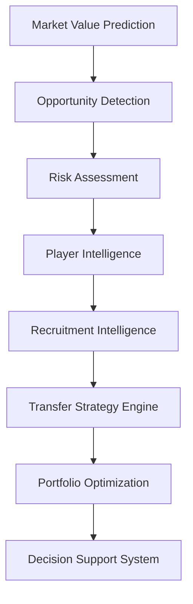

# 📊 Market Value Dynamics and Market Inefficiency Detection in Professional Football

### Football Analytics, Sports Economics & Decision Science for Recruitment Optimization


---

# 📑 Tabla de contenidos

* [🧠 Resumen ejecutivo](#-resumen-ejecutivo)
* [📌 Resultados clave](#-resultados-clave)
* [🎯 Problema de negocio](#-problema-de-negocio)
* [🎯 Objetivos del proyecto](#-objetivos-del-proyecto)
* [🏆 Contribuciones del proyecto](#-contribuciones-del-proyecto)
* [🏗️ Arquitectura global](#️-arquitectura-global)
* [📚 Metodología](#-metodología)
* [📦 Datos y preparación](#-datos-y-preparación)
* [📈 Modelización](#-modelización)
* [📊 Evaluación y resultados](#-evaluación-y-resultados)
* [🖥️ Decision Support System](#️-decision-support-system)
* [⚽ Valor para departamentos deportivos](#-valor-para-departamentos-deportivos)
* [✅ Estado actual del proyecto](#-estado-actual-del-proyecto)
* [⚠️ Limitaciones](#️-limitaciones)
* [🛣️ Roadmap](#️-roadmap)
* [📂 Estructura del proyecto](#-estructura-del-proyecto)
* [🔁 Reproducibilidad](#-reproducibilidad)
* [▶️ Ejecución reproducible](#️-ejecución-reproducible)
* [📚 Referencias](#-referencias)
* [👨‍🎓 Autoría](#-autoría)

---

# 🧠 Resumen ejecutivo

Este Trabajo Fin de Máster desarrolla una plataforma integral de **Football Analytics**, **Sports Economics** y **Decision Science** orientada a la identificación de oportunidades de mercado y a la optimización de decisiones de fichaje en fútbol profesional.

El proyecto combina:

* Econometría aplicada.
* Machine Learning supervisado.
* Explainable AI.
* Scoring multicriterio.
* Risk Assessment.
* Recruitment Analytics.
* Portfolio Optimization.
* Decision Support Systems.

El objetivo no consiste únicamente en predecir el valor de mercado de los jugadores, sino en transformar datos deportivos y económicos en decisiones accionables para departamentos de scouting, recruitment y dirección deportiva.

La plataforma permite:

* Estimar el valor de mercado esperado.
* Detectar ineficiencias de mercado.
* Identificar oportunidades de fichaje.
* Cuantificar riesgo e incertidumbre.
* Construir shortlists de scouting.
* Comparar candidatos simultáneamente.
* Optimizar carteras de fichajes.
* Simular estrategias alternativas de recruitment.
* Apoyar procesos de toma de decisiones mediante un DSS interactivo.

La arquitectura final integra técnicas de Football Analytics,
Sports Economics, Machine Learning y Operations Research
dentro de un único sistema de apoyo a decisiones deportivas.

---

## Evolución conceptual

La evolución metodológica del proyecto puede resumirse mediante:

```text
Market Value Prediction
↓
Opportunity Detection
↓
Risk Assessment
↓
Player Intelligence
↓
Recruitment Intelligence
↓
Transfer Strategy Engine
↓
Portfolio Optimization
↓
Decision Support System
```

La principal aportación de la versión actual consiste en extender la analítica desde la identificación de jugadores infravalorados hacia la optimización estratégica de carteras de fichajes bajo restricciones reales de club.

---

## Release actual

```text
v1.2.2 — Transfer Strategy Engine
```

Sprint completados:

```text
Sprint 13A   — Multi-League Expansion
Sprint 13A.1 — External Validation
Sprint 13B   — Advanced Data Expansion
Sprint 14    — Transfer Strategy Engine
Sprint 14.1  — Player Level Layer
```

---

# 📌 Resultados clave

| Indicador                     |                             Valor |
| ----------------------------- | --------------------------------: |
| Ligas cubiertas               |                                11 |
| Temporadas                    |                                 7 |
| Liga-temporada                |                                77 |
| Observaciones FBref           |                            43.591 |
| Dataset modelizable           |                             5.527 |
| Match Rate global             |                            75,97% |
| Modelo econométrico oficial   |                   Growth OLS v13B |
| Modelo ML oficial             |                Tuned XGBoost v13B |
| R² OLS                        |                            0.4549 |
| R² XGBoost                    |                            0.4453 |
| Precision@10                  |                               90% |
| Escenarios estratégicos       |                                 3 |
| Player Levels                 |                                 5 |
| Solver Portfolio Optimization | PuLP (Binary Integer Programming) |
| Estado actual                 |                     DSS Operativo |

---

# 🎯 Problema de negocio

Los mercados de fichajes presentan características típicas de mercados imperfectos:

* información incompleta;
* incertidumbre elevada;
* recursos limitados;
* asimetrías informativas;
* restricciones presupuestarias.

Los clubes deben seleccionar un número reducido de objetivos dentro de un universo potencialmente compuesto por miles de futbolistas distribuidos entre múltiples ligas y competiciones.

La pregunta central del proyecto evoluciona desde:

> ¿Qué jugadores parecen infravalorados?

hacia una pregunta de mayor relevancia operativa:

> ¿Qué combinación de jugadores maximiza el valor esperado bajo restricciones reales de club?

---

# 🎯 Objetivos del proyecto

## Objetivo empresarial

Desarrollar una metodología reproducible capaz de identificar oportunidades de mercado y optimizar decisiones de fichaje bajo una lógica:

```text
Buy Low
↓
Develop
↓
Create Value
↓
Sell High
```

---

## Objetivos analíticos

1. Construir un dataset longitudinal jugador-temporada mediante integración multi-fuente.
2. Modelizar el valor de mercado esperado mediante econometría y Machine Learning.
3. Comparar interpretabilidad y capacidad predictiva de ambos enfoques.
4. Detectar ineficiencias de mercado.
5. Diseñar métricas compuestas orientadas a scouting.
6. Incorporar explainability para interpretar recomendaciones.
7. Cuantificar riesgo e incertidumbre.
8. Optimizar carteras de fichajes bajo restricciones reales.
9. Implementar un sistema DSS orientado a toma de decisiones deportivas.

---

# 🏆 Contribuciones del proyecto

## Contribuciones académicas

* Aplicación de CRISP-DM al fútbol profesional.
* Integración de econometría y Machine Learning.
* Validación temporal estricta.
* Evaluación mediante métricas de negocio.
* Estudio aplicado de ineficiencias de mercado.
* Validación externa multi-liga.
* Auditoría sistemática de cobertura.
* Evaluación empírica de métricas avanzadas de rendimiento.
* Aplicación de Decision Science al recruitment deportivo.
* Aplicación de Operations Research a optimización de fichajes.

---

## Contribuciones técnicas

* Matching multi-fuente FBref ↔ Transfermarkt.
* Arquitectura modular reproducible.
* Experiment Tracking con MLflow.
* Explainability mediante SHAP.
* Opportunity Framework.
* Risk Framework.
* Recruitment Intelligence Layer.
* Transfer Strategy Engine.
* Portfolio Optimization.
* Dashboard DSS interactivo.
* Internationalization EN/ES.
* Advanced Football Metrics Integration.

---

## Contribuciones de negocio

* Opportunity Detection.
* Risk Assessment.
* Player Intelligence.
* Recruitment Intelligence.
* Candidate Comparison.
* Transfer Strategy Engine.
* Portfolio Construction.
* Scenario Simulation.
* Decision Support System.

---

## Historial de releases

| Release | Contenido principal            |
| ------- | ------------------------------ |
| v0.1.0  | Data Pipeline                  |
| v0.2.0  | Econometric Baseline           |
| v0.3.0  | MLflow                         |
| v0.4.0  | Machine Learning               |
| v0.5.0  | Explainability                 |
| v0.6.0  | Scoring Engine                 |
| v0.7.0  | Dashboard                      |
| v0.8.0  | Dashboard Productization       |
| v1.0.0  | Scouting Intelligence Platform |
| v1.1.0  | Recruitment Intelligence       |
| v1.2.0  | Multi-League Expansion         |
| v1.2.1  | Transfer Strategy Engine       |

# 🏗️ Arquitectura global

La arquitectura se organiza en capas analíticas especializadas diseñadas para transformar datos deportivos en decisiones de recruitment reproducibles.

```text
Raw Sources
↓
Feature Engineering
↓
Matching Layer
↓
Player Season Panel
↓
Modeling Dataset
↓
Econometric Modeling
+
Machine Learning
↓
Opportunity Detection
↓
Risk Assessment
↓
Player Intelligence
↓
Recruitment Intelligence
↓
Transfer Strategy Engine
↓
Portfolio Optimization
↓
Decision Support System
```

Cada capa añade una nueva capacidad analítica sobre la anterior, evolucionando progresivamente desde predicción hacia soporte a decisiones.

---

## Evolución funcional

La evolución metodológica del proyecto puede resumirse mediante:

```text
Econometric Modeling
↓
Machine Learning
↓
Opportunity Detection
↓
Risk Assessment
↓
Player Intelligence
↓
Recruitment Intelligence
↓
Transfer Strategy Engine
↓
Portfolio Optimization
↓
Decision Support System
```

Esta evolución refleja el paso desde una investigación centrada exclusivamente en estimación de valor de mercado hacia una plataforma orientada a decisiones deportivas reales.

---

## Arquitectura DSS

La arquitectura DSS actual puede representarse mediante:



La principal contribución de Sprint 14 consiste en la incorporación de las capas:

* Transfer Strategy Engine.
* Portfolio Optimization.

que introducen explícitamente conceptos de Decision Science y Operations Research dentro del flujo analítico.

---

# 📚 Metodología

El proyecto sigue una adaptación de CRISP-DM orientada al contexto del fútbol profesional.


---

## 1. Business Understanding

Definición del problema económico y deportivo asociado a la identificación de oportunidades de mercado.

---

## 2. Data Understanding

Análisis exploratorio de:

* cobertura;
* calidad de datos;
* consistencia temporal;
* compatibilidad entre fuentes.

---

## 3. Data Preparation

Procesos de:

* matching;
* limpieza;
* normalización;
* feature engineering;
* construcción del panel longitudinal.

---

## 4. Modeling

Desarrollo paralelo de:

* Econometría aplicada.
* Machine Learning supervisado.

para estimar el valor de mercado esperado.

---

## 5. Evaluation

Evaluación mediante:

* métricas predictivas;
* métricas de negocio;
* validación temporal;
* validación externa.

---

## 6. Deployment

Implementación de resultados mediante:

* MLflow;
* artefactos reproducibles;
* dashboard DSS interactivo.

---

# 📦 Datos y preparación

## Fuentes de datos

El proyecto integra dos fuentes complementarias de información deportiva y económica.

---

### FBref

Fuente principal de rendimiento deportivo.

Variables utilizadas:

* minutos disputados;
* goles;
* asistencias;
* producción ofensiva;
* progresión;
* posesión;
* acciones defensivas;
* métricas avanzadas normalizadas por 90 minutos.

---

### Transfermarkt

Fuente principal de valoración económica.

Variables utilizadas:

* valor de mercado;
* histórico de valor;
* edad;
* posición;
* club;
* contexto competitivo.

---

## Cobertura actual

La plataforma incorpora actualmente:

| Métrica             |  Valor |
| ------------------- | -----: |
| Ligas               |     11 |
| Temporadas          |      7 |
| Liga-temporada      |     77 |
| Observaciones FBref | 43.591 |
| Dataset modelizable |  5.527 |
| Match Rate          | 75,97% |

---

## Competiciones incluidas

* Premier League
* LaLiga
* Bundesliga
* Serie A
* Ligue 1
* Eredivisie
* Liga Portugal
* Championship
* Belgian Pro League
* Austrian Bundesliga
* Segunda División

---

## Cobertura temporal

```text
2019-2020
↓
2025-2026
```

---

# 🔗 Matching multi-fuente

Uno de los principales retos metodológicos del proyecto consiste en la ausencia de un identificador universal compartido entre FBref y Transfermarkt.

Para resolver este problema se desarrolló un pipeline jerárquico de matching orientado a maximizar precisión sin comprometer cobertura.

---

## Flujo de matching

```text
Normalización
↓
Exact Matching
↓
Club Validation
↓
Fuzzy Matching
↓
Age Validation
```

---

## Resultado

| Métrica             |  Valor |
| ------------------- | -----: |
| Observaciones FBref | 43.591 |
| Match Rate global   | 75,97% |

La reducción observada respecto a versiones anteriores se explica principalmente por la incorporación de ligas secundarias con menor cobertura histórica.

---

# 📊 Dataset final

Tras los procesos de integración y validación se construye un panel longitudinal jugador-temporada.

---

## Panel completo

| Métrica             |  Valor |
| ------------------- | -----: |
| Observaciones FBref | 43.591 |
| Ligas               |     11 |
| Temporadas          |      7 |
| Liga-temporada      |     77 |

---

## Dataset modelizable

La modelización se centra en jugadores con potencial de desarrollo y revalorización.

| Métrica       | Valor |
| ------------- | ----: |
| Observaciones | 5.527 |
| Ligas         |    11 |
| Temporadas    |     7 |

Dataset productivo actual:

```text
player_season_modeling_v13b_productive_candidate.parquet
```

---

# ⚙️ Feature Engineering

El proyecto incorpora múltiples capas de transformación orientadas a capturar rendimiento deportivo, experiencia competitiva y evolución temporal.

---

## Growth Features

Diseñadas para modelar trayectoria y evolución reciente.

Ejemplos:

* market_value_growth_prev
* delta_log_market_value_prev
* breakout_indicator
* career_year

---

## Composite Football Indices

Variables sintéticas construidas para representar dimensiones futbolísticas complejas.

Ejemplos:

* finishing_index
* playmaking_index
* growth_index
* experience_index

---

## Advanced Football Metrics (Sprint 13B)

Sprint 13B introduce tres nuevas variables productivas:

* finishing_index_v2
* availability_index
* defensive_activity_index

Estas variables constituyen la principal aportación analítica de la fase Advanced Data Expansion.

---

## Hallazgo principal

Entre las variables avanzadas evaluadas:

```text
finishing_index_v2
```

emerge como la métrica con mayor relevancia predictiva agregada dentro de las arquitecturas evaluadas.

---

## Transformaciones aplicadas

El pipeline incorpora:

* transformaciones logarítmicas;
* winsorización;
* escalado robusto;
* estandarización;
* normalización posicional.

Estas transformaciones permiten reducir sensibilidad a valores extremos y mejorar estabilidad estadística de los modelos.

# 📈 Modelización

El proyecto combina econometría aplicada y Machine Learning supervisado para estimar el valor de mercado esperado de futbolistas profesionales.

La decisión metodológica consiste en utilizar una arquitectura híbrida:

```text
Growth OLS v13B
↓
Interpretabilidad

+

Tuned XGBoost v13B
↓
Predicción
```

Esta aproximación permite equilibrar:

* capacidad explicativa;
* robustez metodológica;
* rendimiento predictivo;
* interpretabilidad.

---

## Variable objetivo

El objetivo de modelización consiste en estimar:

```text
log_market_value_eur
```

utilizando información deportiva, económica y temporal observada antes de la fecha de valoración.

---

## Principios metodológicos

El diseño experimental sigue cuatro principios fundamentales:

### Validación temporal

Todas las particiones respetan el orden cronológico de los datos.

Esto evita leakage y reproduce condiciones reales de toma de decisiones.

---

### Generalización

La metodología debe funcionar fuera de la muestra original.

La expansión multi-liga permite evaluar explícitamente este aspecto.

---

### Interpretabilidad

Las recomendaciones deben poder justificarse ante usuarios finales.

Por este motivo la arquitectura incorpora una capa completa de Explainability.

---

### Utilidad práctica

El objetivo no consiste únicamente en maximizar R².

La capacidad para generar mejores decisiones deportivas tiene prioridad sobre pequeñas mejoras predictivas.

---

# 📊 Econometría

## Modelo oficial

```text
Growth OLS v13B
```

---

## Especificación conceptual

La especificación combina:

* variables de rendimiento;
* variables de crecimiento;
* variables temporales;
* métricas avanzadas;
* efectos fijos.

---

## Resultado oficial

| Métrica |  Valor |
| ------- | -----: |
| R²      | 0.4549 |

---

## Rol dentro del sistema

La econometría actúa como:

```text
Benchmark interpretable
```

permitiendo comprender los determinantes económicos y deportivos del valor de mercado.

---

# 🤖 Machine Learning

## Modelos evaluados

Durante el proyecto se evaluaron:

* Random Forest
* HistGradientBoosting
* LightGBM
* XGBoost

---

## Pipeline productivo

El pipeline incorpora:

* imputación robusta;
* codificación categórica;
* validación temporal;
* búsqueda de hiperparámetros;
* MLflow;
* persistencia reproducible.

---

## Modelo oficial

```text
Tuned XGBoost v13B
```

---

## Resultado oficial

| Métrica |  Valor |
| ------- | -----: |
| R²      | 0.4453 |

---

## Justificación

XGBoost proporciona el mejor equilibrio entre:

* estabilidad;
* robustez;
* explainability;
* rendimiento out-of-sample.

---

# 🔬 Explainability

Uno de los requisitos fundamentales del proyecto consiste en garantizar interpretabilidad.

---

## Componentes implementados

### Feature Importance

Permite identificar variables relevantes a nivel global.

---

### SHAP Analysis

Permite interpretar contribuciones individuales de cada variable.

---

### Player-Level Explainability

Permite responder:

> ¿Por qué este jugador aparece como oportunidad?

---

## Resultado

La plataforma no se limita a generar predicciones.

También proporciona explicaciones defendibles ante usuarios finales.

---

# 🌍 Sprint 13A — Multi-League Expansion

Sprint 13A amplía significativamente el universo competitivo analizado.

---

## Motivación

Validar la capacidad de generalización de la metodología.

Pregunta principal:

```text
¿Funciona el modelo
fuera del universo original?
```

---

## Nuevas competiciones

* Championship
* Belgian Pro League
* Austrian Bundesliga
* Segunda División

---

## Resultado

| Métrica        |  Valor |
| -------------- | -----: |
| Ligas          |     11 |
| Temporadas     |      7 |
| Liga-temporada |     77 |
| Match Rate     | 75,97% |

---

## Contribución

Sprint 13A constituye la principal evidencia de validez externa incorporada al proyecto.

---

# 🔎 Sprint 13A.1 — External Validation

Tras la expansión competitiva se ejecuta una evaluación específica de robustez.

---

## Resultado

| Dataset  | R² Tuned XGBoost |
| -------- | ---------------: |
| 7 ligas  |           0.5414 |
| 11 ligas |           0.5664 |

---

## Hallazgo

La expansión multi-liga mejora simultáneamente:

* cobertura;
* representatividad;
* capacidad predictiva.

---

# ⚽ Sprint 13B — Advanced Data Expansion

Sprint 13B introduce una nueva capa de métricas avanzadas derivadas de FBref.

---

## Hipótesis

Las métricas futbolísticas avanzadas contienen señal predictiva adicional.

---

## Variables incorporadas

* finishing_index_v2
* availability_index
* defensive_activity_index

---

## Evaluación econométrica

| Modelo                |     R² |
| --------------------- | -----: |
| M_A_v13A_base_spec_FE | 0.4505 |
| M_B_v13B_advanced_FE  | 0.4549 |

Resultado:

```text
ΔR² = +0.0044
```

---

## Evaluación Machine Learning

| Modelo               | Mejora observada |
| -------------------- | ---------------: |
| XGBoost              |          +0.0096 |
| Random Forest        |          +0.0097 |
| HistGradientBoosting |          +0.0144 |
| LightGBM             |          +0.0291 |

---

## Hallazgo principal

```text
finishing_index_v2
```

es la variable avanzada con mayor relevancia predictiva agregada.

---

## Conclusión

Sprint 13B demuestra que las métricas avanzadas derivadas de rendimiento aportan valor incremental consistente.

---

# 🧠 Sprint 14 — Transfer Strategy Engine

Sprint 14 representa la principal evolución funcional y metodológica del proyecto.

---

## Problema identificado

Hasta Sprint 13 la plataforma respondía:

```text
¿Qué jugadores parecen infravalorados?
```

Sin embargo, los clubes deben seleccionar carteras de fichajes y no jugadores aislados.

---

## Nueva pregunta objetivo

```text
¿Qué combinación de jugadores
maximiza el valor esperado
bajo restricciones reales de club?
```

---

## Inputs estratégicos

* Budget
* Positions Needed
* Scenario
* Portfolio Style
* Maximum Signings

---

## Outputs estratégicos

* Recommended Portfolio
* Total Cost
* Budget Utilization
* Expected Upside
* Expected ROI
* Average Portfolio Score

---

## Metodología

```text
Binary Integer Programming
(PuLP)
```

---

## Restricciones implementadas

* presupuesto máximo;
* utilización mínima del presupuesto;
* número máximo de fichajes;
* restricciones posicionales.

---

## Escenarios

### Conservative

Prioriza estabilidad y robustez.

### Balanced

Equilibrio entre upside y riesgo.

### Aggressive

Maximización de upside esperado.

---

## Contribución académica

Sprint 14 incorpora formalmente:

* Decision Science;
* Operations Research;
* Portfolio Optimization.

constituyendo una de las principales aportaciones originales del proyecto.

---

# 🏷️ Sprint 14.1 — Player Level Layer

Sprint 14.1 introduce una nueva dimensión de calidad deportiva.

---

## Problema identificado

```text
Alto ROI
≠
Nivel deportivo suficiente
```

---

## Solución

Clasificación automática de jugadores mediante:

* Development Prospect
* Rotation Profile
* First Team Ready
* Key Player Profile
* Elite Target

---

## Nueva restricción

```text
Minimum Player Level
```

integrada dentro del optimizador.

---

## Beneficio

La construcción de carteras incorpora simultáneamente:

* valor económico;
* potencial de crecimiento;
* nivel competitivo.

---

# 📊 Evaluación

La evaluación del sistema combina métricas predictivas y métricas orientadas a negocio.

---

## Métricas predictivas

* RMSE
* MAE
* R²

---

## Métricas de negocio

* Precision@K
* Opportunity Quality
* Portfolio Quality
* Expected ROI

---

## Resultados actuales

|   K | Precision@K |
| --: | ----------: |
|  10 |         90% |
|  20 |         90% |
|  50 |         90% |
| 100 |         85% |

---

## Principio metodológico

```text
El mejor modelo
no es necesariamente
el que predice mejor,

sino el que ayuda a tomar
mejores decisiones deportivas.
```

---

# 🎯 Estado actual de modelización

Modelos oficiales:

| Capa             | Modelo             |
| ---------------- | ------------------ |
| Econometría      | Growth OLS v13B    |
| Machine Learning | Tuned XGBoost v13B |

Variables avanzadas productivas:

* finishing_index_v2
* availability_index
* defensive_activity_index

Capacidades actuales:

* Market Value Prediction
* Opportunity Detection
* Risk Assessment
* Player Intelligence
* Recruitment Intelligence
* Transfer Strategy Engine
* Portfolio Optimization

La arquitectura actual conecta predicción, interpretación, scouting y optimización estratégica dentro de un mismo sistema analítico reproducible.

---

# 🚀 Dashboard Preview

### Executive Overview


### Opportunity & Risk Matrix


### Transfer Strategy Engine


---

# 🖥️ Decision Support System

La plataforma incorpora un DSS (Decision Support System) diseñado para apoyar procesos reales de scouting, recruitment y planificación estratégica de fichajes.

Aplicación principal:

```text
app/streamlit_app.py
```

---

## Módulos disponibles

### Executive Overview

Resumen ejecutivo de oportunidades detectadas.

Incluye:

* KPIs principales.
* Opportunity Leaders.
* Market Inefficiency Analysis.
* Opportunity Distribution.

---

### Opportunity Detection

Exploración detallada de jugadores infravalorados.

Permite:

* filtrado avanzado;
* segmentación por liga;
* segmentación por posición;
* priorización ejecutiva.

---

### Risk Assessment

Evaluación conjunta de upside y riesgo.

Incluye:

* Risk Score.
* Risk Categories.
* Opportunity vs Risk Matrix.

---

### Player Intelligence

Análisis individual de candidatos.

Incluye:

* Player Radar.
* Positional Benchmarking.
* Opportunity Drivers.
* Scouting Narrative.

---

### Recruitment Intelligence

Comparación estructurada de candidatos.

Incluye:

* Recruitment Board.
* Comparative Analysis.
* Candidate Selection.

---

### Transfer Strategy Engine

Introducido durante Sprint 14.

Permite construir carteras optimizadas de fichajes bajo restricciones reales.

Inputs:

* Budget.
* Positions Needed.
* Scenario.
* Portfolio Style.
* Minimum Player Level.
* Maximum Signings.

Outputs:

* Recommended Portfolio.
* Total Cost.
* Budget Utilization.
* Expected Upside.
* Expected ROI.
* Average Portfolio Score.

---

### Internationalization

Idiomas soportados:

* Español.
* Inglés.

---

# ⚽ Valor para departamentos deportivos

La plataforma proporciona soporte cuantitativo para múltiples procesos de decisión.

---

## Scouting

Permite:

* detectar oportunidades de mercado;
* identificar jugadores infravalorados;
* priorizar observaciones.

---

## Recruitment

Permite:

* construir shortlists;
* comparar candidatos;
* analizar perfiles equivalentes.

---

## Dirección deportiva

Permite:

* optimizar recursos limitados;
* simular estrategias alternativas;
* evaluar impacto potencial de fichajes.

---

## Portfolio Planning

Permite:

* construir carteras coherentes;
* gestionar restricciones presupuestarias;
* equilibrar upside y riesgo.

---

# ✅ Estado actual del proyecto

Release actual:

```text
v1.2.2 — Transfer Strategy Engine
```

---

## Estado funcional

| Componente                 | Estado |
| -------------------------- | ------ |
| Data Pipeline              | ✅      |
| Matching Pipeline          | ✅      |
| Feature Engineering        | ✅      |
| Econometric Modeling       | ✅      |
| Machine Learning           | ✅      |
| Explainability             | ✅      |
| Opportunity Framework      | ✅      |
| Risk Framework             | ✅      |
| Player Intelligence        | ✅      |
| Recruitment Intelligence   | ✅      |
| Transfer Strategy Engine   | ✅      |
| Portfolio Optimization     | ✅      |
| Decision Support System    | ✅      |
| EN/ES Internationalization | ✅      |

---

## Sprint completados

```text
Sprint 13A   — COMPLETADO
Sprint 13A.1 — COMPLETADO
Sprint 13B   — COMPLETADO
Sprint 14    — COMPLETADO
Sprint 14.1  — COMPLETADO
```

---

# ⚠️ Limitaciones

A pesar de la madurez alcanzada, existen limitaciones documentadas.

---

## Datos

No se incorporan actualmente:

* salarios;
* duración contractual;
* cláusulas de rescisión;
* tracking data;
* event data avanzado.

---

## Modelización

Persisten desafíos asociados a:

* heterogeneidad posicional;
* cambios estructurales entre ligas;
* evolución temporal de mercados.

---

## Optimización

La capa actual utiliza:

```text
Binary Integer Programming
```

bajo una formulación monoobjetivo.

No incorpora todavía:

* optimización multiobjetivo;
* simulación dinámica de mercado;
* escenarios financieros avanzados.

---

## Integración pendiente

Backlog documentado:

```text
TM.2 — Scoring & Ranking Integration v13B
```

La limitación no afecta a los resultados principales ni a las conclusiones del proyecto.

---

# 🛣️ Roadmap

## Prioridad alta

### TM.1 — Transfermarkt Coverage Audit

Objetivo:

* diagnosticar limitaciones de cobertura;
* estimar techo de matching;
* mejorar integración multi-fuente.

---

### TM.2 — Scoring & Ranking Integration v13B

Objetivo:

```text
Predictions v13B
↓
Scoring Dataset v13B
↓
Opportunity Framework v13B
↓
Risk Framework v13B
↓
Rankings v13B
```

---

## Sprint 15 — Strategic Optimization Refinement

Objetivo:

refinar la capa de optimización incorporando:

* simplificación de restricciones;
* revisión de escenarios;
* evolución del perfil de riesgo;
* optimización multicriterio.

---

## Investigación futura

### Machine Learning

* CatBoost.
* TabPFN.
* Ensemble Learning.

### Football Analytics

* Similarity Engine.
* Career Trajectory Modeling.
* Club Development Intelligence.

### Sports Economics

* Dynamic Asset Valuation.
* Multi-Objective Optimization.
* Portfolio Simulation.

---

# 📂 Estructura del proyecto

market-value-football-tfm/

├── app/                                   # Aplicación interactiva y capa Decision Support
│   ├── streamlit_app.py                   # Executive Dashboard
│   └── utils/                             # Utilidades específicas del dashboard
│       ├── charts.py                      # Visualizaciones y gráficos interactivos
│       ├── formatters.py                  # Formateo de KPIs, métricas y valores monetarios
│       └── loaders.py                     # Carga de datos y outputs analíticos
│
├── artifacts/                             # Artefactos persistidos de modelos y predicciones
│   ├── encoders/                          # Encoders categóricos serializados
│   ├── feature_importance/                # Importancia de variables exportada
│   ├── metadata/                          # Metadata y hashes de datasets versionados
│   ├── models/                            # Modelos entrenados (.joblib)
│   ├── predictions/                       # Predicciones persistidas
│   └── scalers/                           # Transformadores numéricos serializados
│
├── config/                                # Configuración centralizada del sistema
│   ├── config.yaml
│   ├── config_backup.yaml
│   ├── features.yaml                      # Configuración de feature engineering
│   ├── matching.yaml                      # Parámetros de matching
│   ├── modeling.yaml                      # Configuración de modelización
│   ├── paths.yaml                         # Paths del proyecto
│   ├── project.yaml                       # Configuración global
│   ├── scoring.yaml                       # Configuración de scoring y rankings
│   └── validation.yaml                    # Configuración centralizada de validación temporal
│
├── data/
│   ├── external/                          # Datos auxiliares externos
│   ├── interim/                           # Datos parcialmente transformados
│   ├── processed/                         # Datasets finales reutilizables
│   └── raw/                               # Datos originales sin procesar
│
├── docs/                                  # Documentación técnica y metodológica
│   ├── architecture.md                    # Arquitectura completa del sistema
│   ├── data_dictionary.md                 # Diccionario de variables y outputs
│   ├── data_quality.md                    # Evaluación de calidad de datos
│   ├── data_sources.md                    # Fuentes de datos y matching
│   ├── feature_engineering_plan.md        # Roadmap de feature engineering
│   ├── modeling_decisions.md              # Decisiones metodológicas de modelización
│   ├── pipeline_reference.md              # Referencia técnica de pipelines
│   ├── README.md                          # Índice central de documentación
│   └── schema_decisions.md                # Diseño de esquema y arquitectura de datos
│
├── logs/                                  # Logs de ejecución y debugging
│
├── mlruns/                                # Tracking experimental MLflow
│
├── notebooks/                             # Notebooks exploratorios y análisis
│   ├── 01_data_understanding.ipynb
│   ├── 02_econometric_baseline.ipynb
│   ├── 03_econometric_model.ipynb
│   ├── 04_supervised_machine_learning.ipynb
│   └── README.md
│
├── reports/                               # Outputs analíticos y reporting
│   ├── business/                          # Métricas de negocio y evaluación de impacto
│   ├── evaluation/                        # Resultados de validación y evaluación de modelos
│   ├── figures/                           # Visualizaciones y figuras exportadas
│   │   ├── dashboard/                     # Capturas del DSS y Scouting Intelligence Platform
│   │   └── explainability/                # SHAP, feature importance y análisis interpretativo
│   ├── model_diagnostics/                 # Diagnósticos econométricos y de Machine Learning
│   ├── portfolio/                         # Outputs del Transfer Strategy Engine
│   │   ├── portfolio_candidates.csv
│   │   ├── portfolio_candidates.parquet
│   │   ├── portfolio_dataset_metadata.json
│   │   ├── portfolio_dataset_summary.csv
│   │   ├── recommended_portfolio.csv
│   │   ├── recommended_portfolio_summary.json
│   │   └── scenarios/
│   │       ├── recommended_portfolio_conservative.csv
│   │       ├── recommended_portfolio_balanced.csv
│   │       ├── recommended_portfolio_aggressive.csv
│   │       ├── recommended_portfolio_conservative_summary.json
│   │       ├── recommended_portfolio_balanced_summary.json
│   │       ├── recommended_portfolio_aggressive_summary.json
│   │       ├── scenario_simulation_summary.csv
│   │       └── scenario_simulation_metadata.json
│   ├── rankings/                          # Rankings de scouting y oportunidades de mercado
│   ├── scouting_reports/                  # Informes individuales de scouting
│   └── tables/                            # Métricas, tablas y resultados exportados
│
├── src/                                   # Lógica principal del sistema
│   ├── data/                              # Ingesta, matching y datasets
│   ├── features/                          # Feature engineering
│   ├── models/
│   │   ├── econometric/                   # Pipeline OLS
│   │   ├── evaluation/                    # Métricas y comparación
│   │   ├── machine_learning/              # Pipelines ML
│   │   └── scoring/                       # Inefficiency scoring
│   ├── strategy/                          # Transfer Strategy Engine
│   │   ├── build_portfolio_dataset.py     # Construcción del universo optimizable
│   │   ├── optimize_transfer_strategy.py  # Optimización 0-1 Knapsack
│   │   └── simulate_transfer_scenarios.py # Simulación de escenarios estratégicos
│   └── utils/                             # Utilidades compartidas
│       ├── config.py                      # Loader centralizado de configuración YAML
│       ├── dataset_versioning.py          # Versionado y hashing de datasets
│       └── experiment_tracking.py         # Integración MLflow
│
├── tests/                                 # Estructura reservada para validaciones automatizadas futuras
│   └── .gitkeep                           # Mantiene la carpeta en Git aunque esté vacía
│
├── .gitignore                             # Reglas de exclusión de Git
├── dataset-metadata.json                  # Metadata versionada del dataset actual
├── environment.yml                        # Entorno Conda
├── PROJECT_STATUS.md                      # Estado operativo del proyecto
├── README.md                              # Documentación principal
├── requirements-lock.txt                  # Dependencias fijadas
├── requirements.txt                       # Dependencias Python
└── LICENSE

---

# 🔁 Reproducibilidad

El proyecto se diseñó siguiendo principios de reproducibilidad científica.

Todos los resultados pueden regenerarse a partir de:

* código versionado;
* datasets versionados;
* configuraciones explícitas;
* artefactos persistidos;
* experimentos registrados en MLflow.

---

## Tracking experimental

Se utiliza:

```text
MLflow
```

para registrar:

* parámetros;
* métricas;
* artefactos;
* modelos.

---

# ▶️ Ejecución reproducible

## 1. Clonar repositorio

```bash
git clone https://github.com/<usuario>/market-value-football-tfm.git

cd market-value-football-tfm
```

---

## 2. Crear entorno virtual

```bash
python -m venv .venv
```

### Linux / macOS

```bash
source .venv/bin/activate
```

### Windows

```bash
.venv\Scripts\activate
```

---

## 3. Instalar dependencias

```bash
pip install -r requirements.txt
```

---

## 4. Ejecutar notebooks

Orden recomendado:

```text
01_data_understanding.ipynb

↓

02_econometric_baseline.ipynb

↓

03_econometric_model.ipynb

↓

04_supervised_machine_learning.ipynb
```

---

## 5. Generar rankings

```bash
python src/scoring/build_scoring_dataset.py

python src/scoring/build_rankings.py
```

---

## 6. Generar estrategia de fichajes

```bash
python src/strategy/build_transfer_portfolio_dataset.py

python src/strategy/optimize_transfer_portfolio.py
```

---

## 7. Lanzar dashboard

```bash
streamlit run app/streamlit_app.py
```

---

# 📚 Referencias

Principales áreas de referencia:

* Football Analytics.
* Sports Economics.
* Sports Management.
* Econometrics.
* Machine Learning.
* Explainable AI.
* Decision Science.
* Operations Research.
* Portfolio Optimization.

---

## Referencias metodológicas

* Kuhn & Johnson (Applied Predictive Modeling)
* James et al. (Introduction to Statistical Learning)
* Hastie, Tibshirani & Friedman (Elements of Statistical Learning)
* Molnar (Interpretable Machine Learning)
* Breiman (Random Forests)
* Chen & Guestrin (XGBoost)
* Markowitz (Portfolio Selection)
* Winston (Operations Research)

---

# 👨‍🎓 Autoría

Trabajo Fin de Máster - Data Science

Market Value Dynamics and Market Inefficiency Detection in Professional Football

Autores del TFM:
Laura González Macho
Isabel Muñoz Martín
Manuel Pérez Bañuls

Technical architecture, software development,
modeling, dashboard implementation and
post-academic evolution:

Manuel Pérez Bañuls

Tutor:

Antonio Pita Lozano

---

## Estado final

La plataforma ha evolucionado desde un sistema de predicción de valor de mercado hacia una solución integral de:

```text
Football Analytics
+
Sports Economics
+
Recruitment Intelligence
+
Decision Science
+
Portfolio Optimization
+
Decision Support Systems
```

capaz de apoyar procesos reales de scouting, recruitment y planificación estratégica de fichajes mediante metodologías reproducibles, interpretables y orientadas a la toma de decisiones deportivas.
