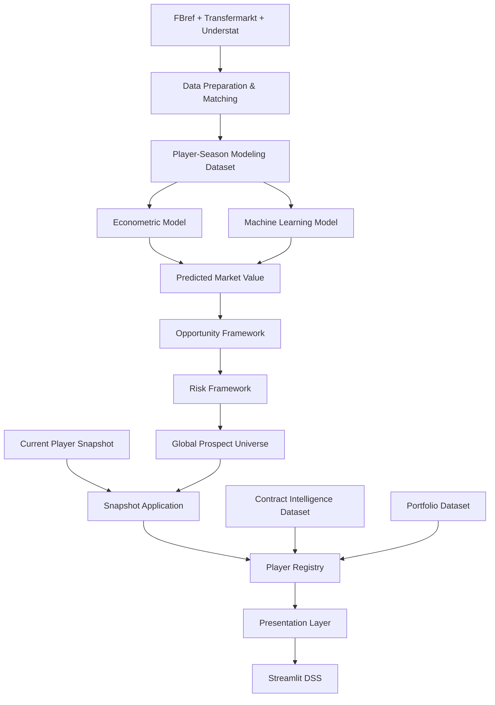
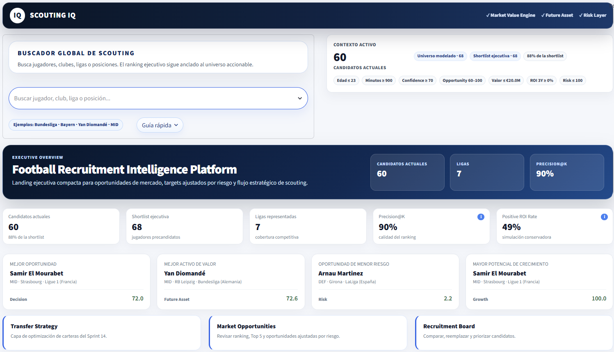
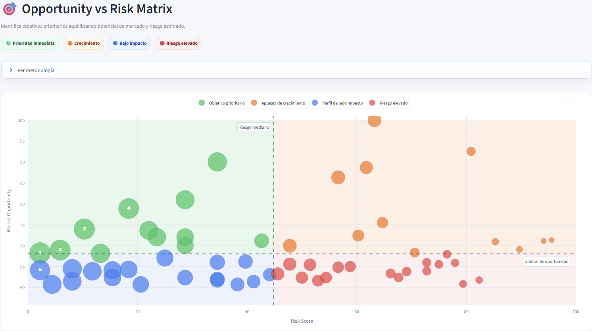
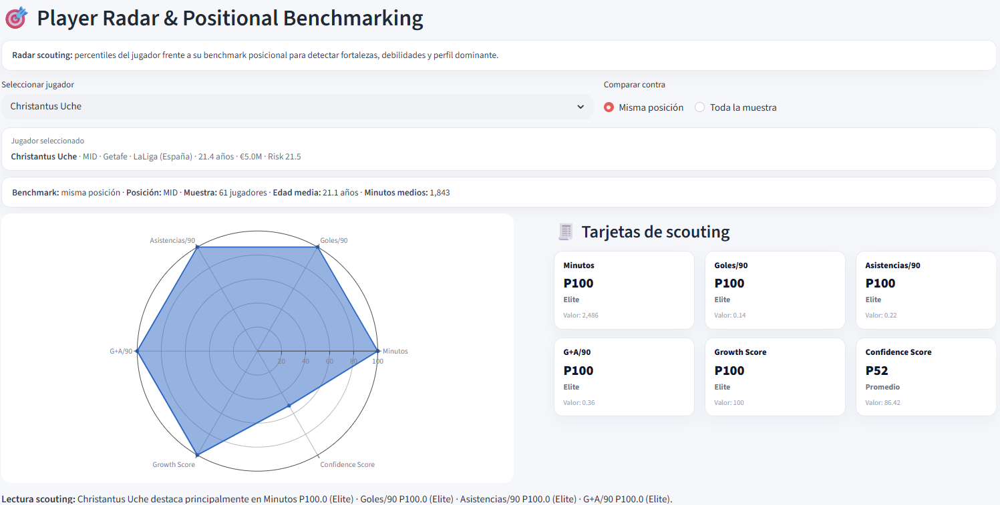
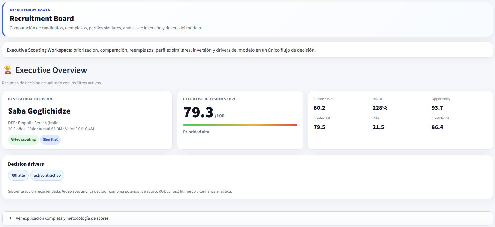
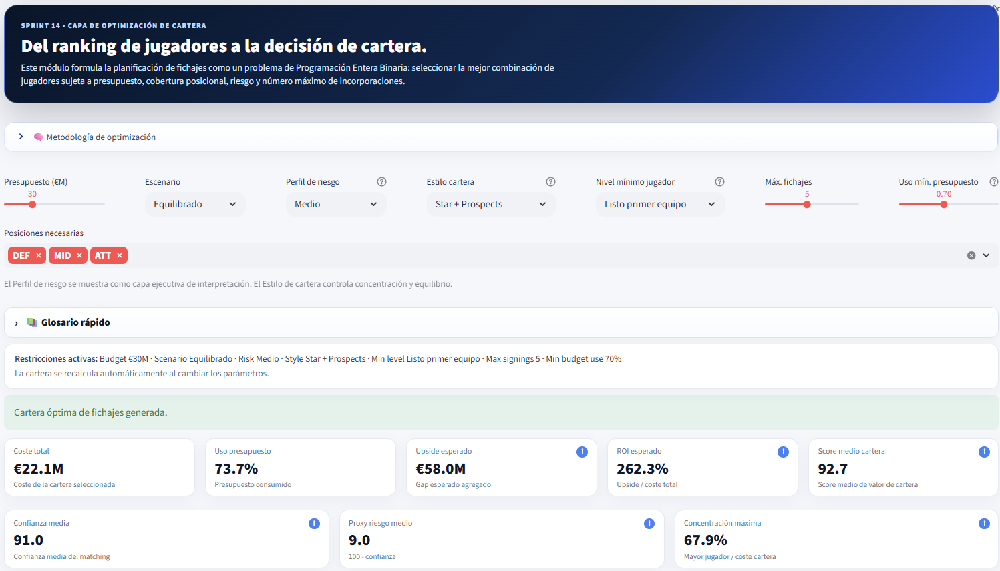

# 📊 Market Value Dynamics and Market Inefficiency Detection in Professional Football

### Football Analytics, Sports Economics, Recruitment Intelligence & Decision Science for Strategic Recruitment Optimization


---

# 📑 Tabla de contenidos

* [🧠 Resumen ejecutivo](#-resumen-ejecutivo)
* [📌 Resultados clave](#-resultados-clave)
* [🎯 Problema de negocio](#-problema-de-negocio)
* [🎯 Objetivos del proyecto](#-objetivos-del-proyecto)
* [🏆 Contribuciones del proyecto](#-contribuciones-del-proyecto)
* [🏗️ Arquitectura global](#️-arquitectura-global)
* [🧱 Gobernanza de datos, snapshots y contratos](#-gobernanza-de-datos-snapshots-y-contratos)
* [🎨 Evolución visual, UX y productización](#-evolución-visual-ux-y-productización)
* [⚡ Performance y arquitectura de consumo](#-performance-y-arquitectura-de-consumo)
* [📚 Metodología](#-metodología)
* [📦 Datos y preparación](#-datos-y-preparación)
* [🔗 Matching multi-fuente](#-matching-multi-fuente)
* [📊 Dataset final](#-dataset-final)
* [⚙️ Feature Engineering](#️-feature-engineering)
* [📈 Modelización](#-modelización)
* [📊 Econometría](#-econometría)
* [🤖 Machine Learning](#-machine-learning)
* [🔍 Explainability](#-explainability)
* [🌍 Validación externa](#-validación-externa)
* [🎯 Opportunity Framework](#-opportunity-framework)
* [⚠️ Risk Framework](#️-risk-framework)
* [🧠 Recruitment Intelligence](#-recruitment-intelligence)
* [🎯 Transfer Strategy Engine](#-transfer-strategy-engine)
* [🔄 Sprint TM.2 — Multi-League DSS Integration](#-sprint-tm2--multi-league-dss-integration)
* [📊 Evaluación de negocio](#-evaluación-de-negocio)
* [🖥️ Decision Support System](#️-decision-support-system)
* [📸 Dashboard (Demo)](#-dashboard-demo)
* [⚽ Valor para departamentos deportivos](#-valor-para-departamentos-deportivos)
* [✅ Estado actual del proyecto](#-estado-actual-del-proyecto)
* [⚠️ Limitaciones](#️-limitaciones)
* [🛣️ Roadmap](#️-roadmap)
* [📂 Estructura del proyecto](#-estructura-del-proyecto)
* [🔁 Reproducibilidad](#-reproducibilidad)
* [▶️ Ejecución reproducible](#️-ejecución-reproducible)
* [📚 Referencias](#-referencias)
* [👨‍🎓 Autoría](#-autoría)
* [📝 Cambios incorporados en v2.0.0](#-cambios-incorporados-en-v200)

---

# 🧠 Resumen ejecutivo

Este Trabajo Fin de Máster desarrolla una plataforma integral de Football Analytics, Sports Economics y Decision Science orientada a scouting, recruitment y optimización de decisiones de fichaje en fútbol profesional.

El proyecto integra:

* Econometría aplicada.
* Machine Learning supervisado.
* Explainable Artificial Intelligence.
* Opportunity Detection.
* Risk Assessment.
* Recruitment Intelligence.
* Contract Intelligence.
* Transfer Strategy Engine.
* Portfolio Optimization.
* Decision Support Systems.
* Gobernanza de datos y contratos de DataFrame.
* Arquitectura de snapshots y contexto temporal.
* Productización y despliegue en Streamlit Cloud.

El objetivo trasciende la simple predicción del valor de mercado de futbolistas. La finalidad consiste en transformar información deportiva y económica en recomendaciones accionables para departamentos de scouting, recruitment y dirección deportiva.

La plataforma permite:

* estimar el valor de mercado esperado;
* detectar ineficiencias de mercado;
* identificar oportunidades de fichaje;
* cuantificar riesgo e incertidumbre;
* evaluar disponibilidad contractual;
* identificar oportunidades pre-expiración;
* incorporar poder negociador en procesos de recruitment;
* construir shortlists de scouting;
* comparar candidatos simultáneamente;
* optimizar carteras de fichajes;
* simular escenarios estratégicos;
* separar explícitamente el contexto histórico de modelado del contexto actual de mercado;
* presentar identidad, club, liga y valor actual mediante una capa de presentación gobernada;
* apoyar procesos reales de toma de decisiones mediante un DSS interactivo.

La arquitectura final combina Football Analytics, Sports Economics, Machine Learning, Explainability, Decision Science y Operations Research dentro de un sistema analítico reproducible, con una separación explícita entre:

```text
Modeling Authority
Current Snapshot Authority
Presentation Authority
Contract Intelligence Authority
Decision Support Layer
```

La versión actual opera sobre once competiciones europeas y consolida un universo DSS de 757 jugadores únicos. El dashboard está desplegado y validado en Streamlit Cloud, con una arquitectura de consumo refactorizada, DataFrame Contracts y controles de calidad orientados a evitar fugas de contexto, desincronizaciones y errores de esquema.

---

## Evolución conceptual

La evolución funcional del proyecto puede resumirse mediante:

```text
Market Value Prediction
↓
Opportunity Detection
↓
Risk Assessment
↓
Player Intelligence
↓
Recruitment Intelligence
↓
Contract Intelligence
↓
Transfer Strategy Engine
↓
Portfolio Optimization
↓
Data Governance & Snapshot Authority
↓
Decision Support System
```

La principal aportación de las versiones recientes consiste en evolucionar desde la identificación de jugadores infravalorados hacia un producto DSS gobernado, portable y apto para soportar decisiones de recruitment bajo restricciones reales de club.

---

## Release actual

```text
v2.0.0 — DSS Architecture, Data Contracts & Productization
```

Sprints y bloques de evolución consolidados:

```text
Sprint 13A     — Multi-League Expansion
Sprint 13A.1   — External Validation
Sprint 13B     — Advanced Data Expansion
Sprint 14      — Transfer Strategy Engine
Sprint 14.1    — Player Level Layer
Sprint TM.2    — Scoring & Ranking Integration
Sprint TM.3    — Contract Intelligence Layer
Sprint TM.6.x  — Visual Identity, Asset Integration & Mobile UX
Sprint TM.7.0  — Snapshot Authority
Sprint TM.7.1  — Presentation Layer
Sprint TM.7.6  — Legacy View Decommission
Sprint TM.8.6  — Performance Audit & Closure
Sprint TM.8.9  — Single Source of Truth / Registry Migration
Sprint TM.8.10 — DataFrame Contract Layer, Risk Authority & Release Closure
```

---

# 📌 Resultados clave

| Indicador | Valor consolidado |
|---|---:|
| Ligas cubiertas por modelado y DSS | 11 |
| Temporadas | 7 |
| Liga-temporada | 77 |
| Observaciones FBref | 43.591 |
| Dataset modelizable | 5.527 |
| Match Rate global FBref ↔ Transfermarkt | 75,97% |
| Universo DSS canónico | 757 jugadores |
| Variables del universo DSS canónico | 118 |
| Dataset Contract Intelligence | 757 × 134 |
| Cobertura de snapshot actual | 681/757 — 89,96% |
| Cobertura de presentación | 757/757 — 100% |
| Cobertura de Risk Score | 757/757 — 100% |
| Risk Score con valor cero | 0 jugadores |
| Cobertura contractual DSS | 95,90% |
| Modelo econométrico oficial | Growth OLS v13B |
| Modelo ML productivo oficial | Tuned XGBoost v13B |
| R² OLS productivo | 0,4549 |
| RMSE XGBoost productivo | 0,8692 |
| MAE XGBoost productivo | 0,6955 |
| R² XGBoost productivo | 0,5651 |
| Mejor R² histórico alcanzado | 0,5664 |
| Precision@10 | 90% |
| Escenarios estratégicos | 3 |
| Player Levels | 5 |
| Solver Portfolio Optimization | PuLP |
| Tests DSS focalizados | 20/20 |
| Estado actual | DSS operativo en Cloud |

---

### Nota metodológica

La arquitectura mantiene dos referencias predictivas diferenciadas:

* **Modelo econométrico oficial:** Growth OLS v13B, utilizado como benchmark interpretable.
* **Modelo productivo de Machine Learning:** Tuned XGBoost v13B, utilizado para estimar el valor esperado.

La validación productiva consolidada del modelo XGBoost registra:

```text
RMSE = 0,8692
MAE  = 0,6955
R²   = 0,5651
```

Durante Sprint 13A.1 se alcanzó un máximo histórico de R² = 0,5664 en la validación externa multi-liga. La diferencia entre ambos resultados responde a cortes experimentales y artefactos de validación distintos; el release v2.0.0 utiliza como referencia operativa el pipeline productivo consolidado.

La versión actual incorpora además una regla de gobernanza esencial: el valor esperado se estima sobre el contexto histórico de temporada, mientras que club, liga y valor actual se incorporan desde el snapshot vigente únicamente para presentación y análisis contextual.

---

# 🎯 Problema de negocio

Los mercados de fichajes presentan características típicas de mercados imperfectos:

* información incompleta;
* incertidumbre elevada;
* asimetrías informativas;
* restricciones presupuestarias;
* recursos limitados;
* cambios rápidos de club, liga, contrato y valoración.

Los clubes deben seleccionar un número reducido de objetivos dentro de un universo potencialmente compuesto por miles de futbolistas distribuidos entre múltiples ligas y contextos competitivos.

La pregunta central del proyecto evoluciona desde:

> ¿Qué jugadores parecen infravalorados?

hacia una cuestión de mayor relevancia operativa:

> ¿Qué combinación de jugadores maximiza el valor esperado bajo restricciones reales de club, considerando riesgo, encaje, contrato y contexto actual?

El problema no es únicamente predictivo. También exige:

* garantizar identidad correcta del jugador;
* evitar mezclar contexto histórico y contexto actual;
* disponer de datasets coherentes entre módulos;
* mantener rankings y visualizaciones sincronizados;
* presentar la información con latencia asumible;
* evitar decisiones basadas en columnas ausentes, valores fabricados o fallbacks no equivalentes.

---

# 🎯 Objetivos del proyecto

## Objetivo empresarial

Desarrollar una metodología reproducible capaz de identificar oportunidades de mercado y optimizar decisiones de fichaje bajo una lógica:

```text
Buy Low
↓
Develop
↓
Create Value
↓
Sell High
```

La solución debe ser utilizable como sistema de apoyo a decisión, no solo como ejercicio de modelización.

---

## Objetivos analíticos

1. Construir un dataset longitudinal jugador-temporada mediante integración multi-fuente.
2. Modelizar el valor de mercado esperado mediante econometría y Machine Learning.
3. Comparar interpretabilidad y capacidad predictiva de ambos enfoques.
4. Detectar ineficiencias de mercado.
5. Diseñar métricas compuestas orientadas a scouting.
6. Incorporar Explainability para interpretar recomendaciones.
7. Cuantificar riesgo e incertidumbre.
8. Incorporar contexto contractual y poder negociador.
9. Optimizar carteras de fichajes bajo restricciones reales.
10. Implementar un Decision Support System orientado a toma de decisiones deportivas.
11. Separar contexto de modelado, snapshot actual y capa de presentación.
12. Definir contratos de datos que gobiernen las columnas requeridas por cada vista.
13. Asegurar consistencia de identidad, scoring y contexto entre módulos.
14. Optimizar la arquitectura de carga para reducir lecturas y transformaciones redundantes.
15. Validar el producto mediante tests automatizados y despliegue en Cloud.

---

# 🏆 Contribuciones del proyecto

## Contribuciones académicas

* Aplicación de CRISP-DM al fútbol profesional.
* Integración de econometría y Machine Learning.
* Validación temporal estricta.
* Evaluación mediante métricas de negocio.
* Estudio aplicado de ineficiencias de mercado.
* Validación externa multi-liga.
* Auditoría sistemática de cobertura.
* Evaluación empírica de métricas avanzadas de rendimiento.
* Integración DSS multi-liga.
* Aplicación de Decision Science al recruitment deportivo.
* Aplicación de Operations Research a optimización de fichajes.
* Separación metodológica entre contexto de temporada y contexto actual.
* Definición de una capa formal de contratos de datos para una aplicación analítica.
* Discusión explícita de los riesgos de interpretación cuando cambia el contexto competitivo del jugador.

---

## Contribuciones técnicas

* Matching multi-fuente FBref ↔ Transfermarkt.
* Arquitectura modular reproducible.
* Experiment Tracking mediante MLflow.
* Explainability mediante SHAP.
* Opportunity Framework.
* Risk Framework.
* Recruitment Intelligence Layer.
* Contract Intelligence Layer.
* Transfer Strategy Engine.
* Portfolio Optimization.
* Dashboard DSS interactivo.
* Internationalization EN/ES.
* Advanced Football Metrics Integration.
* Multi-League DSS Integration.
* Contract Opportunity Scoring.
* Negotiation Leverage Framework.
* Contract-Aware Recruitment Ranking.
* Identity Registry y Player Registry.
* Snapshot Authority para club, liga y valor actuales.
* Presentation Layer con campos `display_*`.
* DataFrame Contract Layer.
* Fallbacks restringidos a aliases explícitamente equivalentes.
* Preservación de valores analíticos ausentes como `NaN`.
* Helpers seguros para ordenación y agregación.
* Arquitectura de Single Source of Truth.
* Migración de consumo del dashboard hacia datasets canónicos.
* Caché y reducción de lecturas redundantes.
* Controles de contexto y semántica del gap.
* Validaciones automatizadas del DSS.
* Pinning de dependencias para Streamlit Cloud.
* Eliminación de módulos legacy y runs obsoletos.

---

## Contribuciones de negocio

* Opportunity Detection.
* Risk Assessment.
* Player Intelligence.
* Recruitment Intelligence.
* Candidate Comparison.
* Transfer Strategy Engine.
* Portfolio Construction.
* Scenario Simulation.
* Decision Support System.
* Contract Opportunity Detection.
* Pre-Expiry Recruitment Targeting.
* Negotiation Support Intelligence.
* Free-Agent Opportunity Detection.
* Contract-Aware Recruitment.
* Visualización ejecutiva de cambio de contexto.
* Distinción entre señal de oportunidad y fiabilidad de la comparación.
* Shortlists gobernadas por calidad de datos y riesgo.
* Reducción de fricción operativa mediante una interfaz más rápida y consistente.

---

## Historial de releases

| Release | Contenido principal |
|---|---|
| v0.1.0 | Data Pipeline |
| v0.2.0 | Econometric Baseline |
| v0.3.0 | MLflow |
| v0.4.0 | Machine Learning |
| v0.5.0 | Explainability |
| v0.6.0 | Scoring Engine |
| v0.7.0 | Dashboard |
| v0.8.0 | Dashboard Productization |
| v1.0.0 | Scouting Intelligence Platform |
| v1.1.0 | Recruitment Intelligence |
| v1.2.0 | Multi-League Expansion |
| v1.2.1 | Transfer Strategy Engine |
| v1.2.2 | Multi-League DSS Integration |
| v1.3.0 | Recruitment Intelligence & DSS |
| v1.4.0 | Contract Intelligence Layer |
| v2.0.0 | DSS Architecture, Data Contracts & Productization |

---

# 🏗️ Arquitectura global

La arquitectura se organiza en capas analíticas especializadas diseñadas para transformar datos deportivos y económicos en decisiones de recruitment reproducibles.

```text
Raw Sources
↓
Feature Engineering
↓
Advanced Metrics Layer
↓
Matching & Identity Layer
↓
Player-Season Panel
↓
Modeling Dataset
↓
Econometric Modeling + Machine Learning
↓
Operational Predictions
↓
Opportunity & Risk Scoring
↓
Global Prospect Universe
↓
Current Snapshot Overlay
↓
Player Registry & Presentation Layer
↓
Recruitment / Contract / Strategy Domains
↓
Portfolio Optimization
↓
Decision Support System
```

La arquitectura v2.0.0 añade una distinción formal entre cinco autoridades:

| Autoridad | Artefacto o componente | Responsabilidad |
|---|---|---|
| Modeling Authority | `player_season_modeling_v13b_productive_candidate.parquet` | Variables históricas y predicción |
| DSS Authority | `reports/dss/global_prospect_universe.csv` | Opportunity, confidence, risk y universo canónico |
| Current Snapshot Authority | `data/processed/current_player_snapshot.*` | Club, liga y valor actuales |
| Contract Authority | `reports/tm3_contract_intelligence/contract_intelligence_dataset.csv` | Vencimiento, leverage y oportunidad contractual |
| Presentation Authority | `PlayerRegistry` + Presentation Layer | Identidad y campos `display_*` |

Esta separación evita que una capa sobrescriba silenciosamente la semántica de otra.

---

## Evolución funcional

```text
Econometric Modeling
↓
Machine Learning
↓
Opportunity Detection
↓
Risk Assessment
↓
Player Intelligence
↓
Recruitment Intelligence
↓
Contract Intelligence
↓
Transfer Strategy Engine
↓
Portfolio Optimization
↓
Multi-League DSS Integration
↓
Snapshot & Identity Governance
↓
Data Contracts
↓
Decision Support System
```

La plataforma ha evolucionado desde una investigación centrada en valoración de mercado hacia una arquitectura completa de Recruitment Intelligence y Strategic Decision Support.

---

## Arquitectura DSS



---

## Sprint TM.2 — Multi-League DSS Integration

Sprint TM.2 introdujo una capa explícita de integración entre modelización y DSS para garantizar que las once competiciones soportadas por los modelos se propagaran hasta scoring, rankings, portfolio y dashboard.

Resultado consolidado:

| Componente | Cobertura |
|---|---:|
| Modeling Dataset | 11 ligas |
| Scoring Dataset | 11 ligas |
| Opportunity Dataset | 11 ligas |
| Transfer Portfolio Dataset | 11 ligas |
| DSS | 11 ligas |

La cobertura competitiva queda alineada de extremo a extremo.

---

## Sprint TM.3 — Contract Intelligence Layer

Sprint TM.3 incorpora una capa de inteligencia contractual orientada a complementar la evaluación deportiva y económica de candidatos mediante información procedente de Transfermarkt.

La nueva capa permite identificar:

* jugadores próximos a finalizar contrato;
* oportunidades pre-expiración;
* potenciales agentes libres;
* situaciones favorables de negociación.

Variables principales:

```text
contract_expiration_date
contract_months_remaining
contract_years_remaining
contract_expiring_12m
contract_critical_zone
free_agent_horizon
negotiation_leverage_score
contract_opportunity_score
recruitment_contract_score
```

El `Recruitment Contract Score` combina la señal principal de mercado con la oportunidad contractual:

| Componente | Peso |
|---|---:|
| Opportunity Score | 70% |
| Contract Opportunity Score | 30% |

La información contractual no modifica el modelo predictivo de valor de mercado. Opera aguas abajo, como dominio especializado del DSS.

---

# 🧱 Gobernanza de datos, snapshots y contratos

La versión v2.0.0 incorpora una arquitectura explícita de gobernanza destinada a evitar cruces de datos entre módulos.

## Contextos diferenciados

```text
Season Context
→ Contexto histórico utilizado por el modelo.

Current Snapshot
→ Club, liga y valor de mercado actuales.

Display Layer
→ Selección gobernada del dato que se muestra al usuario.
```

Campos representativos:

```text
season_context_club
season_context_league
season_context_market_value_eur

current_club_snapshot
current_league_snapshot
current_market_value_eur_snapshot

display_club
display_league
display_market_value_eur
```

El universo DSS conserva cobertura completa de presentación:

```text
display_club              757/757
display_league            757/757
display_market_value_eur  757/757
```

El snapshot actual cubre 681 de los 757 jugadores. Los 76 casos no enlazados conservan el contexto de temporada para presentación, sin inventar valores actuales.

---

## Semántica del gap

El gap de valoración se interpreta de forma diferente según exista o no cambio de contexto:

```text
VALID_SAME_CONTEXT
→ Comparación directa válida.

CONTEXT_CHANGED_CAUTION
→ El valor esperado pertenece al contexto histórico modelado,
  mientras que el valor mostrado procede del snapshot actual.
```

En el artefacto vigente:

```text
CONTEXT_CHANGED_CAUTION  747 jugadores
VALID_SAME_CONTEXT        10 jugadores
```

Esta etiqueta evita presentar como ineficiencia directamente comparable una diferencia que puede estar afectada por cambio de club, liga o valoración posterior.

---

## DataFrame Contract Layer

El módulo `src/dss/contract/dataframe_contract.py` define contratos explícitos para las columnas requeridas por el DSS.

Principios:

* las columnas de identidad, scoring y negocio se validan antes de renderizar;
* los fallbacks solo utilizan aliases declarados como equivalentes;
* las métricas ausentes permanecen como `NaN`;
* no se fabrican valores `0`, `50` o `100` para completar visualizaciones;
* la aplicación de contratos es idempotente;
* la ordenación y las agregaciones utilizan helpers seguros;
* las vistas reciben DataFrames preparados con un esquema estable.

Objetivo operativo:

```text
Dataset heterogéneo
↓
Contract Enforcement
↓
DataFrame gobernado
↓
Vista sin KeyError por columnas ausentes
```

---

## Identity Registry y Presentation Layer

La identidad del jugador se resuelve mediante registros especializados, evitando que cada módulo realice matching o enriquecimiento por su cuenta.

Componentes principales:

```text
Player Registry
Player Service
Player View
Presentation Engine
Current Snapshot
Contract Dataset
Performance Lookup
```

La capa de presentación es responsable de:

* seleccionar el nombre mostrado;
* resolver club y liga;
* aplicar escudos, banderas e imágenes;
* preservar el contexto de modelado;
* evitar joins ad hoc dentro de las vistas;
* entregar una única representación coherente del jugador.

---

## Risk Score Authority

TM.8.10 cerró una desincronización que había dejado `risk_score` a cero en todo el universo DSS.

Estado validado:

| Métrica | Resultado |
|---|---:|
| Cobertura | 757/757 |
| Valores cero | 0 |
| Valores únicos | 580 |
| Mínimo | 0,13 |
| Mediana | 50,07 |
| Máximo | 100,00 |

La autoridad de riesgo se construye en `src/models/scouting/build_risk_score.py` y se integra en `build_global_prospect_universe.py`, evitando cálculos duplicados en Streamlit.

---

# 🎨 Evolución visual, UX y productización

La fase de productización amplió el dashboard desde una interfaz analítica funcional hacia un producto visual orientado a dirección deportiva.

## Identidad visual y contexto

Se incorporaron:

* escudos de clubes;
* banderas de nacionalidad y liga;
* imágenes de jugadores;
* normalización de nombres de club;
* identidad visual consistente entre módulos;
* assets locales para evitar dependencias externas en tiempo de ejecución.

---

## Diseño ejecutivo

Se revisaron:

* jerarquía de títulos y subtítulos;
* composición de cards;
* KPIs ejecutivos;
* tablas Top 5;
* matrices oportunidad-riesgo;
* resúmenes de candidato;
* bloques de decisión y recomendación;
* consistencia visual entre Opportunity, Recruitment, Contract y Strategy.

El dashboard organiza la información mediante un funnel operativo:

```text
Universe
↓
Filters
↓
Candidate Ranking
↓
Player Analysis
↓
Comparison
↓
Decision
```

---

## Diseño responsive

Se auditó el comportamiento en mobile y desktop para:

* evitar solapes;
* preservar legibilidad de cards;
* mantener la composición horizontal en desktop;
* permitir reflow controlado en mobile;
* separar físicamente hero, búsqueda y contexto cuando el ancho es reducido;
* conservar operativas las tablas, matrices y filtros.

---

## Internacionalización

La aplicación mantiene soporte ES/EN en:

* navegación;
* títulos;
* KPIs;
* etiquetas;
* mensajes ejecutivos;
* ayudas contextuales;
* rankings y tablas.

---

## Accesibilidad operativa

Las mejoras priorizan:

* claridad de decisión;
* reducción de densidad visual;
* consistencia de formatos;
* uso de unidades monetarias homogéneas;
* estados de cautela visibles;
* ausencia de campos vacíos presentados como valores reales.

---

# ⚡ Performance y arquitectura de consumo

La optimización de velocidad derivó en una refactorización del modo en que Streamlit consume datos.

## Problema detectado

La aplicación realizaba múltiples lecturas, joins y enriquecimientos equivalentes en distintos módulos. Esto incrementaba:

* tiempo de arranque;
* coste de rerun;
* riesgo de inconsistencias;
* complejidad de mantenimiento;
* probabilidad de usar fuentes distintas para el mismo jugador.

---

## Solución implementada

```text
Fuentes especializadas
↓
Datasets canónicos precomputados
↓
Loaders centralizados y cacheados
↓
Player Registry
↓
Presentation Layer
↓
Vistas Streamlit
```

Cambios principales:

* reducción de lecturas repetidas de CSV y parquet;
* consolidación del universo DSS;
* aplicación centralizada del snapshot;
* eliminación de overlays legacy;
* migración hacia Single Source of Truth;
* reutilización de DataFrames preparados;
* contratos de esquema en el límite de la aplicación;
* separación entre cálculo analítico y render;
* pinning de dependencias para Cloud;
* eliminación de runs y artefactos obsoletos del repositorio.

---

## Estado de performance

El cierre de TM.8.6–TM.8.10 estabiliza el consumo de datos y reduce el trabajo redundante en los principales flujos del dashboard.

La aplicación sigue concentrando gran parte del render en `app/streamlit_app.py`. La modularización adicional de ese archivo permanece como mejora técnica futura, pero ya no es necesaria para garantizar consistencia de datos, despliegue o funcionamiento de la versión actual.

---

## Validación

La arquitectura DSS focalizada dispone de:

```text
20 tests
20 passed
```

Las validaciones cubren contratos, snapshots, registry y componentes DSS críticos. La compilación de la aplicación y de los entrypoints de snapshot forma parte del cierre previo a release.

---

# 📚 Metodología

El proyecto sigue una adaptación de CRISP-DM orientada al contexto del fútbol profesional.


---

## 1. Business Understanding

Definición del problema económico y deportivo asociado a la identificación de oportunidades de mercado y optimización de decisiones de fichaje.

---

## 2. Data Understanding

Análisis exploratorio de:

* cobertura;
* calidad de datos;
* consistencia temporal;
* compatibilidad entre fuentes;
* validez externa multi-liga;
* disponibilidad de identificadores;
* calidad de snapshots actuales.

---

## 3. Data Preparation

Procesos de:

* matching;
* limpieza;
* normalización;
* feature engineering;
* construcción del panel longitudinal;
* integración multi-fuente;
* construcción de registros de identidad;
* generación de datasets canónicos.

---

## 4. Modeling

Desarrollo paralelo de:

* Econometría aplicada.
* Machine Learning supervisado.

para estimar el valor de mercado esperado.

---

## 5. Evaluation

Evaluación mediante:

* métricas predictivas;
* métricas de negocio;
* validación temporal;
* validación externa;
* robustez multi-liga;
* auditoría de cobertura;
* tests de integración DSS.

---

## 6. Deployment

Implementación mediante:

* artefactos reproducibles;
* pipelines productivos;
* dashboard DSS interactivo;
* dependencias fijadas;
* despliegue en Streamlit Cloud.

MLflow se utiliza para tracking experimental local. El directorio `mlruns/` no forma parte del repositorio distribuido.

---

## 7. Decision Support

Transformación de resultados analíticos en decisiones deportivas accionables mediante:

* Opportunity Framework.
* Risk Framework.
* Recruitment Intelligence.
* Contract Intelligence.
* Transfer Strategy Engine.
* Portfolio Optimization.

---

## 8. Data Governance

Capa adicional incorporada durante la productización:

* autoridades de datos diferenciadas;
* snapshots actuales;
* contratos de DataFrame;
* control de contexto;
* datasets canónicos;
* validación automatizada.

---

# 📦 Datos y preparación

## Fuentes de datos

El proyecto integra fuentes complementarias de información deportiva y económica.

### FBref

Fuente principal de rendimiento deportivo.

Variables utilizadas:

* minutos disputados;
* goles;
* asistencias;
* producción ofensiva;
* progresión;
* posesión;
* acciones defensivas;
* métricas avanzadas normalizadas por 90 minutos.

### Transfermarkt

Fuente principal de valoración y contexto económico.

Variables utilizadas:

* valor de mercado;
* histórico de valor;
* edad;
* posición;
* club;
* liga;
* contexto contractual;
* identificadores de jugador.

### Understat

Fuente complementaria para métricas de expected goals y expected assists en los contextos competitivos disponibles.

La integración de Understat se utiliza como enriquecimiento de rendimiento, no como autoridad de identidad ni de valor de mercado.

---

## Cobertura actual

| Métrica | Valor |
|---|---:|
| Ligas | 11 |
| Temporadas | 7 |
| Liga-temporada | 77 |
| Observaciones FBref | 43.591 |
| Dataset modelizable | 5.527 |
| Match Rate | 75,97% |

---

## Competiciones incluidas

### Big Five

* Premier League
* LaLiga
* Bundesliga
* Serie A
* Ligue 1

### Upper-Mid European Leagues

* Eredivisie
* Liga Portugal
* Belgian Pro League
* Austrian Bundesliga

### Development & Secondary Competitions

* Championship
* Spanish Segunda División

---

## Cobertura DSS

La arquitectura DSS completa opera sobre las mismas once competiciones europeas utilizadas en modelización.

El snapshot actual cubre nueve ligas de primera división. Para Championship y Spanish Segunda División, la Presentation Layer conserva el contexto de temporada cuando no existe un match actual validado.

---

## Cobertura temporal

```text
2019-2020
↓
2025-2026
```

---

# 🔗 Matching multi-fuente

Uno de los principales retos metodológicos consiste en la ausencia de un identificador universal compartido entre FBref y Transfermarkt.

## Flujo de matching

```text
Normalización
↓
Exact Matching
↓
Player ID cuando está disponible
↓
Club Validation
↓
Fuzzy Matching
↓
Age Validation
↓
Unique-Name Fallback
↓
Homonym Guardrails
```

## Resultado

| Métrica | Valor |
|---|---:|
| Observaciones FBref | 43.591 |
| Match Rate global | 75,97% |
| Universo DSS con `player_id_tm` único | 757/757 |
| Snapshot actual por `player_id_tm` | 679 |
| Snapshot actual por nombre único | 2 |
| Snapshot actual no enlazado | 76 |

El matching por nombre se restringe a nombres únicos. Los homónimos se excluyen del fallback automático y permanecen sujetos a revisión.

---

# 📊 Dataset final

Tras los procesos de integración y validación se construye un panel longitudinal jugador-temporada y varios artefactos de decisión.

## Panel completo

| Métrica | Valor |
|---|---:|
| Observaciones FBref | 43.591 |
| Ligas | 11 |
| Temporadas | 7 |
| Liga-temporada | 77 |

## Dataset modelizable

| Métrica | Valor |
|---|---:|
| Observaciones | 5.527 |
| Ligas | 11 |
| Temporadas | 7 |

Dataset productivo:

```text
data/processed/player_season_modeling_v13b_productive_candidate.parquet
```

## Universo DSS canónico

```text
reports/dss/global_prospect_universe.csv
```

Características:

```text
757 jugadores
118 columnas
757 player_id_tm únicos
```

Autoridad de:

* predicción de valor;
* market value gap;
* opportunity;
* confidence;
* growth;
* risk;
* contexto de temporada;
* snapshot actual;
* campos de presentación.

## Dataset Contract Intelligence

```text
reports/tm3_contract_intelligence/contract_intelligence_dataset.csv
```

Características:

```text
757 jugadores
134 columnas
```

Autoridad de:

* expiración contractual;
* meses y años restantes;
* free-agent horizon;
* negotiation leverage;
* contract opportunity;
* recruitment contract score.

---

# ⚙️ Feature Engineering

El proyecto incorpora múltiples capas de transformación orientadas a capturar rendimiento deportivo, experiencia competitiva y evolución temporal.

## Growth Features

* `market_value_growth_prev`
* `delta_log_market_value_prev`
* `breakout_indicator`
* `career_year`

## Composite Football Indices

* `finishing_index`
* `playmaking_index`
* `growth_index`
* `experience_index`

## Advanced Football Metrics (Sprint 13B)

* `finishing_index_v2`
* `availability_index`
* `defensive_activity_index`

## Hallazgo principal

```text
finishing_index_v2
```

emerge como la variable avanzada con mayor relevancia predictiva agregada dentro de las arquitecturas evaluadas.

## Transformaciones aplicadas

* transformaciones logarítmicas;
* winsorización;
* escalado robusto;
* estandarización;
* normalización posicional;
* variables por 90 minutos;
* efectos fijos de liga, posición y temporada.

---

# 📈 Modelización

El proyecto combina econometría aplicada y Machine Learning supervisado para estimar el valor de mercado esperado.

```text
Interpretabilidad
+
Capacidad predictiva
```

La predicción se genera sobre el contexto histórico jugador-temporada. El snapshot actual no entra en el entrenamiento ni reescribe las variables del modelo.

## Variable objetivo

```text
market_value_eur
```

Transformación:

```text
log_market_value_eur
```

La transformación logarítmica permite:

* reducir asimetría;
* estabilizar varianza;
* mejorar comportamiento estadístico;
* facilitar interpretación económica.

---

# 📊 Econometría

## Objetivo

Construir un benchmark interpretable capaz de explicar los determinantes económicos y deportivos del valor de mercado.

## Especificación oficial

```python
log_market_value_eur ~
age +
log_minutes_played +
goals_per90 +
assists_per90 +
growth variables +
advanced football metrics +
league FE +
position FE +
season FE
```

## Modelo oficial

```text
Growth OLS v13B
```

Características:

* efectos fijos por liga;
* efectos fijos por posición;
* efectos fijos por temporada;
* covarianza robusta HC3;
* validación temporal.

## Resultado

| Modelo | R² |
|---|---:|
| M_A_v13A_base_spec_FE | 0,4505 |
| M_B_v13B_advanced_FE | 0,4549 |

```text
ΔR² = +0,0044
```

## Interpretación

La incorporación de métricas avanzadas aporta capacidad explicativa incremental sin comprometer interpretabilidad. El modelo econométrico permanece como referencia explicativa oficial del sistema.

---

# 🤖 Machine Learning

## Objetivo

Maximizar capacidad predictiva sobre datos no observados.

## Arquitecturas evaluadas

* Random Forest
* HistGradientBoosting
* LightGBM
* XGBoost

## Diseño experimental

* validación temporal;
* imputación robusta;
* codificación categórica;
* escalado;
* búsqueda de hiperparámetros;
* tracking experimental mediante MLflow;
* evaluación out-of-sample.

## Modelo productivo oficial

```text
Tuned XGBoost v13B
```

## Resultado productivo consolidado

| Métrica | Valor |
|---|---:|
| RMSE | 0,8692 |
| MAE | 0,6955 |
| R² | 0,5651 |

## Resultados históricos relevantes

Durante Sprint 13A.1 se alcanzó la mejor referencia histórica del proyecto. La métrica se conserva como benchmark de generalización, mientras que v2.0.0 utiliza el artefacto productivo consolidado descrito en la sección anterior.

## Resultado comparativo Sprint 13B

| Modelo | Mejora observada |
|---|---:|
| XGBoost | +0,0096 |
| Random Forest | +0,0097 |
| HistGradientBoosting | +0,0144 |
| LightGBM | +0,0291 |

## Hallazgo metodológico

Todas las arquitecturas mejoran tras incorporar:

* `finishing_index_v2`
* `availability_index`
* `defensive_activity_index`

La consistencia entre familias de modelos reduce el riesgo de atribuir la mejora a una única arquitectura.

---

# 🔍 Explainability

La plataforma incorpora Explainable Artificial Intelligence mediante:

```text
SHAP
```

## Explainability global

Permite identificar:

* importancia de variables;
* contribución agregada;
* relaciones no lineales.

Pregunta objetivo:

```text
¿Qué variables explican el valor de mercado?
```

## Explainability local

Permite interpretar recomendaciones individuales.

Pregunta objetivo:

```text
¿Por qué este jugador aparece como oportunidad?
```

## Hallazgo principal

`finishing_index_v2` es la métrica avanzada con mayor relevancia predictiva agregada en los análisis realizados.

---

# 🌍 Validación externa

## Sprint 13A.1 — External Validation

La validación externa evalúa la capacidad de generalización del sistema fuera de las cinco grandes ligas europeas.

Competiciones incorporadas:

* EFL Championship
* Belgian Pro League
* Austrian Bundesliga
* Spanish Segunda División

## Cobertura final

| Métrica | Valor |
|---|---:|
| Ligas | 11 |
| Temporadas | 7 |
| Liga-temporada | 77 |
| Observaciones FBref | 43.591 |
| Dataset modelizable | 5.527 |

## Mejor resultado Machine Learning obtenido

| Métrica | Valor |
|---|---:|
| Modelo | Tuned XGBoost |
| RMSE | 0,8525 |
| MAE | 0,6834 |
| R² | 0,5664 |

## Interpretación

La ampliación desde siete hasta once ligas no deterioró la capacidad de generalización. El experimento constituye la principal evidencia de validez externa de la metodología.

---

# 🎯 Opportunity Framework

La predicción de valor constituye una etapa intermedia.

```text
Predicted Market Value
↓
Market Value Gap
↓
Growth Score
↓
Confidence Score
↓
Opportunity Score
```

## Inefficiency Score

La formulación conceptual de ineficiencia compara:

```text
Valor esperado
vs
Valor observado
```

En v2.0.0 la autoridad operativa utiliza directamente el gap y los scores integrados del universo DSS. La columna histórica `inefficiency_score` no forma parte del artefacto canónico actual y no se fabrica mediante fallback.

## Growth Score

Captura:

* trayectoria;
* revalorización;
* potencial de crecimiento.

Cobertura actual:

```text
757/757
```

## Confidence Score

Captura:

* robustez del matching;
* completitud;
* estabilidad;
* disponibilidad de contexto.

Cobertura actual:

```text
757/757
```

## Opportunity Score

Integra:

```text
Infravaloración
+
Potencial
+
Robustez
```

Cobertura actual:

```text
757/757
```

---

# ⚠️ Risk Framework

La oportunidad de mercado no implica necesariamente una recomendación segura.

## Objetivo

Cuantificar la incertidumbre asociada a cada recomendación mediante:

```text
Risk Score
Risk Level
Risk-adjusted Opportunity
```

## Resultado

```text
Opportunity
+
Risk
=
Priorización más realista
```

La capa de riesgo se calcula antes de servir el universo DSS. Streamlit consume el resultado canónico y no reconstruye scores mediante reglas locales.

---

# 🧠 Recruitment Intelligence

Sprint 11 transforma rankings analíticos en procesos estructurados de scouting y recruitment.

Capacidades:

* Recruitment Board.
* Candidate Selection.
* Comparative Player Analysis.
* Executive Shortlists.
* Positional Benchmarking.
* Role-based filtering.
* Context-aware candidate summaries.
* Eligibility checks.
* Seguimiento pasivo mediante Watchlist/Monitor.

La capa de Recruitment Intelligence consume la identidad y los campos de presentación desde el Registry para evitar discrepancias entre listados, fichas y comparadores.

---

# 🎯 Transfer Strategy Engine

## Sprint 14

Pregunta objetivo:

```text
¿Qué combinación de jugadores
maximiza el valor esperado
bajo restricciones reales de club?
```

## Inputs

* presupuesto;
* posiciones requeridas;
* perfil estratégico;
* calidad mínima;
* número máximo de incorporaciones;
* coste de cartera;
* riesgo y upside.

## Outputs

* cartera recomendada;
* coste total;
* utilización presupuestaria;
* ROI esperado;
* upside esperado;
* score medio;
* composición por posición;
* escenario estratégico.

## Optimización

```text
Binary Integer Programming
PuLP
```

La formulación permite construir carteras óptimas bajo restricciones simultáneas.

---

# 🔄 Sprint TM.2 — Multi-League DSS Integration

TM.2 resolvió una inconsistencia histórica entre la cobertura de modelización y la cobertura del DSS.

## Impacto

La integración alineó modelado, scoring, rankings, portfolio y dashboard sin modificar la especificación predictiva.

Resultado:

```text
11 ligas de extremo a extremo
```

La integración no modificó las especificaciones econométricas ni los modelos de Machine Learning. Su aportación fue garantizar que scoring, rankings, portfolio y dashboard consumieran el universo multi-liga correcto.

Este bloque se mantiene como hito histórico. La arquitectura actual añade, sobre esa base, Registry, Snapshot Authority, Presentation Layer y DataFrame Contracts.

---

# 📊 Evaluación de negocio

| Métrica | Valor |
|---|---:|
| Precision@10 | 90% |
| Precision@20 | 90% |
| Precision@50 | 90% |
| Precision@100 | 85% |

## Interpretación

Los resultados respaldan la utilidad operativa del sistema para:

* scouting;
* recruitment;
* construcción de shortlists;
* optimización de carteras;
* soporte cuantitativo a decisiones deportivas.

La utilidad de negocio no depende únicamente de la precisión predictiva. También requiere:

* identidad correcta;
* contexto interpretable;
* cobertura suficiente;
* latencia operativa;
* consistencia entre módulos;
* señal de riesgo;
* transparencia sobre datos ausentes.

---

# 🖥️ Decision Support System

La capa DSS consolida modelización, scoring, riesgo, contexto contractual y optimización estratégica dentro de una aplicación Streamlit.

## Capacidades actuales

### Opportunity Intelligence

* Opportunity Score.
* Growth Score.
* Confidence Score.
* Market Value Gap.
* Context Change Caution.

### Risk Intelligence

* Risk Score.
* Risk Level.
* Risk-adjusted Opportunity.
* Distribución riesgo-oportunidad.

### Player Intelligence

* análisis individual;
* benchmarking posicional;
* radar de rendimiento;
* fortalezas y debilidades;
* contexto actual y de temporada;
* identidad visual.

### Recruitment Intelligence

* shortlists;
* comparación simultánea;
* priorización;
* filtros por rol, liga, edad y valor;
* resúmenes ejecutivos;
* board de candidatos.

### Contract Intelligence

* expiraciones;
* oportunidades pre-expiración;
* poder negociador;
* horizonte de agente libre;
* Contract Opportunity Score;
* Recruitment Contract Score.

### Transfer Strategy Engine

* restricciones deportivas;
* restricciones presupuestarias;
* escenarios;
* optimización de carteras.

### Portfolio Optimization

* Recommended Portfolio.
* Expected Upside.
* Expected ROI.
* Budget Utilization.
* Portfolio Composition.
* Perfiles conservador, equilibrado y agresivo.

### Data Quality & Governance

* Snapshot Health.
* Context Status.
* DataFrame Contracts.
* Registry Coverage.
* Safe fallbacks.
* Auditorías de matching.

---

## Cobertura DSS actual

```text
11 ligas
757 jugadores
118 variables canónicas
100% cobertura de presentación
100% cobertura de Opportunity, Confidence y Risk
89,96% cobertura de snapshot actual
```

---

# 📸 Dashboard (Demo)

## Executive Dashboard



Vista ejecutiva del universo, oportunidades, riesgo y métricas clave.

---

## Opportunity–Risk Matrix



Priorización visual de candidatos según oportunidad y riesgo.

---

## Player Intelligence



Análisis individual con benchmarking posicional, contexto e indicadores compuestos.

---

## Recruitment Intelligence



Comparación de candidatos y construcción de shortlists.

---

## Transfer Strategy Engine



Optimización de carteras bajo restricciones de club.

---

# ⚽ Valor para departamentos deportivos

## Valoración de mercado

```text
¿Cuál debería ser el valor de mercado esperado de este jugador?
```

## Oportunidades de mercado

```text
¿Qué jugadores presentan mayor gap positivo con suficiente confianza?
```

## Riesgo

```text
¿Cuánto riesgo implica esta recomendación?
```

## Recruitment

```text
¿Qué candidatos cumplen nuestros criterios deportivos y económicos?
```

## Comparación

```text
¿Qué jugador ofrece mejor combinación de potencial, riesgo y coste?
```

## Estrategia

```text
¿Qué combinación de jugadores maximiza el valor esperado
bajo restricciones reales?
```

## Oportunidad contractual

```text
¿Qué jugadores combinan oportunidad deportiva
y situación contractual favorable?
```

## Gobernanza

```text
¿La comparación utiliza el mismo contexto
o requiere una advertencia por cambio de club, liga o valoración?
```

---

# ✅ Estado actual del proyecto

## Estado general

```text
Release: v2.0.0
Estado: Operativo
Despliegue: Streamlit Cloud validado
```

## Sprint completados

```text
13A / 13A.1 / 13B
14 / 14.1
TM.2 / TM.3
TM.6.x
TM.7.0 / TM.7.1 / TM.7.6
TM.8.6 / TM.8.9 / TM.8.10
```

## Cobertura actual

| Métrica | Valor |
|---|---:|
| Ligas | 11 |
| Temporadas | 7 |
| Liga-temporada | 77 |
| Observaciones FBref | 43.591 |
| Dataset modelizable | 5.527 |
| Universo DSS | 757 |
| Cobertura snapshot | 89,96% |
| Cobertura presentación | 100% |
| Tests DSS | 20/20 |

## Modelos oficiales

| Capa | Modelo |
|---|---|
| Econometría | Growth OLS v13B |
| Machine Learning | Tuned XGBoost v13B |
| Referencia histórica | Tuned XGBoost — Sprint 13A.1 |

## Autoridades productivas

| Dominio | Autoridad |
|---|---|
| Modeling | `data/processed/player_season_modeling_v13b_productive_candidate.parquet` |
| DSS | `reports/dss/global_prospect_universe.csv` |
| Snapshot actual | `data/processed/current_player_snapshot.*` |
| Contratos | `reports/tm3_contract_intelligence/contract_intelligence_dataset.csv` |
| Portfolio | `reports/strategy/transfer_portfolio_dataset.csv` |
| Presentación | `src/dss/player_registry.py` + `src/dss/presentation.py` |
| Data contracts | `src/dss/contract/dataframe_contract.py` |

## Estado funcional

```text
Market Value Prediction
↓
Opportunity Detection
↓
Risk Assessment
↓
Player Intelligence
↓
Recruitment Intelligence
↓
Contract Intelligence
↓
Transfer Strategy Engine
↓
Portfolio Optimization
↓
Snapshot & Context Governance
↓
Decision Support System
```

---

# ⚠️ Limitaciones

## Matching

La ausencia de identificadores universales entre FBref y Transfermarkt obliga a combinar identificadores, normalización y matching probabilístico.

## Snapshot actual

La cobertura del snapshot actual es del 89,96%. Los jugadores no enlazados conservan el contexto de temporada para presentación y no reciben datos actuales fabricados.

## Cambio de contexto

La mayoría del universo DSS ha cambiado de club, liga o valoración respecto a la observación histórica. El gap requiere interpretación cautelosa cuando `gap_interpretation_status = CONTEXT_CHANGED_CAUTION`.

## Información contractual

La cobertura contractual es elevada, pero no completa. Las variables contractuales ausentes se mantienen como `NaN`.

## Competiciones internacionales

No se incorporan explícitamente:

* Champions League;
* Europa League;
* Conference League;
* competiciones de selecciones.

## Lesiones

No se incorpora todavía un historial médico completo ni un modelo específico de Injury Prediction.

## Arquitectura de interfaz

El consumo de datos está refactorizado, pero `app/streamlit_app.py` conserva una elevada concentración de lógica de render. La modularización adicional mejoraría mantenibilidad y capacidad de test.

## Automatización

Los snapshots y artefactos se generan mediante pipelines reproducibles, pero el refresh completo todavía requiere una ejecución controlada y validación de guardrails antes de promoción.

---

# 🛣️ Roadmap

## Prioridad alta

### TabPFN Benchmark

Evaluación de arquitecturas fundacionales para datos tabulares bajo validación out-of-sample.

### CatBoost Benchmark

Comparación frente al stack productivo actual, especialmente en el tratamiento de variables categóricas.

### Modularización Streamlit

Separación progresiva de `streamlit_app.py` en módulos de dominio, render y controladores.

### Automated Snapshot Promotion

Automatización del refresh con:

* candidate build;
* guardrails;
* health report;
* promoción controlada;
* rollback.

### CI de contratos y documentación

Incorporación de validaciones automáticas para:

* DataFrame contracts;
* imports;
* tests DSS;
* enlaces Markdown;
* artefactos canónicos.

## Prioridad media

### UEFA Club Strength Layer

* coeficiente UEFA;
* rendimiento europeo;
* experiencia continental.

### National Team Layer

* internacionalidades;
* minutos;
* torneos.

### European Competition Layer

* Champions League;
* Europa League;
* Conference League.

### Club Development Index

Medición de la capacidad histórica de desarrollo y revalorización de talento.

## Investigación futura

### Injury Prediction

Línea independiente de Health Intelligence orientada a modelizar disponibilidad y riesgo de lesión.

---

# 📂 Estructura del proyecto

```bash
market-value-football-tfm/

├── .devcontainer/                         # Entorno reproducible de desarrollo
├── .streamlit/                            # Configuración de Streamlit
│
├── app/                                   # Aplicación DSS
│   ├── streamlit_app.py                   # Entry point principal
│   ├── assets/                            # Escudos, banderas e imágenes locales
│   ├── data/                              # Manifests y datos auxiliares de presentación
│   └── ui/                                # Componentes visuales reutilizables
│
├── artifacts/                             # Modelos y metadata persistida
│   ├── metadata/
│   └── models/
│
├── config/                                # Configuración centralizada
│   ├── config.yaml
│   ├── features.yaml
│   ├── matching.yaml
│   ├── modeling.yaml
│   ├── paths.yaml
│   ├── project.yaml
│   ├── scoring.yaml
│   └── validation.yaml
│
├── data/
│   ├── external/                          # Datos auxiliares externos
│   ├── interim/                           # Transformaciones intermedias
│   ├── processed/                         # Datasets finales y snapshots
│   └── raw/                               # Fuentes originales
│
├── docs/
│   ├── README.md                          # Índice técnico
│   ├── architecture.md                    # Arquitectura del sistema
│   ├── data_contract.md                   # Contratos y gobernanza de DataFrames
│   ├── data_dictionary.md                 # Diccionario de variables
│   ├── data_quality.md                    # Calidad y auditorías
│   ├── data_sources.md                    # Fuentes y matching
│   ├── feature_engineering_plan.md        # Feature engineering
│   ├── modeling_decisions.md              # Decisiones metodológicas
│   ├── pipeline_reference.md              # Pipelines productivos
│   └── schema_decisions.md                # Decisiones de esquema
│
├── notebooks/
│   ├── 01_data_understanding.ipynb
│   ├── 02_econometric_baseline.ipynb
│   ├── 03_econometric_model.ipynb
│   ├── 04_supervised_machine_learning.ipynb
│   └── README.md
│
├── reports/
│   ├── data_quality/                      # Auditorías y health reports
│   ├── dss/
│   │   └── global_prospect_universe.csv   # Universo DSS canónico
│   ├── figures/
│   │   ├── dashboard/
│   │   └── explainability/
│   ├── performance/                       # Auditorías de carga y runtime
│   ├── portfolio/                         # Carteras y escenarios
│   ├── scouting_reports/                  # Informes individuales
│   ├── strategy/                          # Dataset de estrategia
│   ├── tables/
│   └── tm3_contract_intelligence/
│       └── contract_intelligence_dataset.csv
│
├── scripts/                               # Auditorías y utilidades operativas
│
├── src/
│   ├── data/                              # Ingesta, matching y refresh
│   ├── dss/
│   │   ├── contract/                      # DataFrame Contract Layer
│   │   ├── intelligence/                  # Dominios DSS
│   │   ├── apply_current_player_snapshot.py
│   │   ├── build_global_prospect_universe.py
│   │   ├── player_registry.py
│   │   ├── player_service.py
│   │   ├── player_view.py
│   │   ├── presentation.py
│   │   ├── registry.py
│   │   └── run_snapshot_refresh.py
│   ├── features/                          # Feature engineering
│   ├── models/
│   │   ├── econometric/
│   │   ├── evaluation/
│   │   ├── machine_learning/
│   │   └── scouting/
│   ├── scouting/
│   │   └── contracts/                     # Contract Intelligence
│   ├── strategy/                          # Portfolio Optimization
│   ├── utils/
│   └── visual/
│
├── tests/
│   └── dss/                               # Tests automatizados del DSS
│
├── .gitignore
├── dataset-metadata.json
├── environment.local.yml
├── LICENSE
├── PROJECT_STATUS.md
├── pytest.ini
├── README.md
├── requirements-lock.txt
└── requirements.txt
```

Los directorios `logs/`, `mlruns/`, caches, backups y candidatos de snapshot son outputs locales o regenerables y no forman parte del repositorio distribuido.

---

# 🔁 Reproducibilidad

El proyecto ha sido diseñado bajo principios de reproducibilidad científica y operativa.

Características:

* versionado de código y artefactos;
* configuración centralizada;
* dependencias fijadas;
* tracking experimental local;
* artefactos persistentes;
* separación entre experimentación y producción;
* pipelines deterministas;
* snapshots auditables;
* contratos de datos;
* tests automatizados;
* documentación metodológica.

Los outputs temporales, logs, caches y backups están excluidos del repositorio. Los artefactos necesarios para reproducir la aplicación se mantienen versionados o se generan mediante pipelines documentados.

---

# ▶️ Ejecución reproducible

## 1. Clonar repositorio

```bash
git clone https://github.com/manuelpeba/market-value-football-tfm.git
cd market-value-football-tfm
```

## 2. Crear entorno virtual

```bash
python -m venv .venv
```

### Linux / macOS

```bash
source .venv/bin/activate
```

### Windows

#### PowerShell

```powershell
.venv\Scripts\Activate.ps1
```

#### Git Bash

```bash
source .venv/Scripts/activate
```

## 3. Instalar dependencias

```bash
python -m pip install --upgrade pip
pip install -r requirements.txt
```

Dependencias principales fijadas:

```text
Python 3.11
Streamlit 1.57.0
Pandas 2.3.3
NumPy 2.4.4
Plotly 6.7.0
PyArrow 23.0.1
Scikit-learn 1.8.0
XGBoost 3.2.0
PuLP 3.3.2
RapidFuzz 3.14.5
Pillow 12.2.0
```

## 4. Ejecutar notebooks

Orden recomendado:

```text
01_data_understanding.ipynb
↓
02_econometric_baseline.ipynb
↓
03_econometric_model.ipynb
↓
04_supervised_machine_learning.ipynb
```

## 5. Generar rankings

```bash
python -m src.models.scoring.build_inefficiency_score
python -m src.models.scoring.build_growth_score
python -m src.models.scoring.build_confidence_score
python -m src.models.scoring.build_opportunity_score
python -m src.models.scouting.build_risk_score
python src/dss/build_global_prospect_universe.py
```

## 8. Generar Contract Intelligence

```bash
python src/scouting/contracts/build_contract_intelligence.py
```

## 9. Aplicar snapshot actual

```bash
python src/dss/apply_current_player_snapshot.py
```

Para inspeccionar el pipeline completo y sus guardrails:

```bash
python src/dss/run_snapshot_refresh.py --help
python src/dss/manage_snapshot_registry.py --help
```

## 6. Generar estrategia de fichajes

```bash
python src/strategy/build_transfer_portfolio_dataset.py
python src/strategy/optimize_transfer_portfolio.py
```

## 10. Ejecutar tests

```bash
python -m pytest tests/dss -q
```

Resultado validado para v2.0.0:

```text
20 passed
```

## 7. Lanzar dashboard

```bash
streamlit run app/streamlit_app.py
```

---

# 📚 Referencias

La construcción metodológica combina contribuciones procedentes de:

* Football Analytics
* Sports Economics
* Econometrics
* Machine Learning
* Explainable AI
* Decision Science
* Operations Research
* Portfolio Optimization
* Data Engineering
* Software Architecture

## Referencias metodológicas principales

### Football Analytics

* Sumpter, D. — *Soccermatics*
* Kuper, S. & Szymanski, S. — *Soccernomics*

### Econometrics & Statistical Learning

* James, Witten, Hastie & Tibshirani — *An Introduction to Statistical Learning*
* Hastie, Tibshirani & Friedman — *The Elements of Statistical Learning*
* Wooldridge — *Introductory Econometrics*

### Machine Learning

* Kuhn & Johnson — *Applied Predictive Modeling*
* Breiman — *Random Forests*
* Chen & Guestrin — *XGBoost*

### Explainable Artificial Intelligence

* Molnar — *Interpretable Machine Learning*
* Lundberg & Lee — *SHAP: A Unified Approach to Interpreting Model Predictions*

### Decision Science & Operations Research

* Winston — *Operations Research: Applications and Algorithms*
* Hillier & Lieberman — *Introduction to Operations Research*

### Portfolio Optimization

* Markowitz — *Portfolio Selection*

## Herramientas y tecnologías utilizadas

* Python
* Pandas
* NumPy
* Scikit-Learn
* Statsmodels
* XGBoost
* LightGBM
* SHAP
* DuckDB
* MLflow
* Streamlit
* Plotly
* PuLP
* RapidFuzz
* PyArrow

---

# 👨‍🎓 Autoría

Trabajo desarrollado como Trabajo Fin de Máster.

Título:

```text
Market Value Dynamics and Market Inefficiency Detection in Professional Football
```

## Autores

- Laura González Macho
- Isabel Muñoz Martín
- Manuel Pérez Bañuls

## Tutor académico

- Antonio Pita Lozano

Versión actual:

```text
v2.0.0 — DSS Architecture, Data Contracts & Productization
```