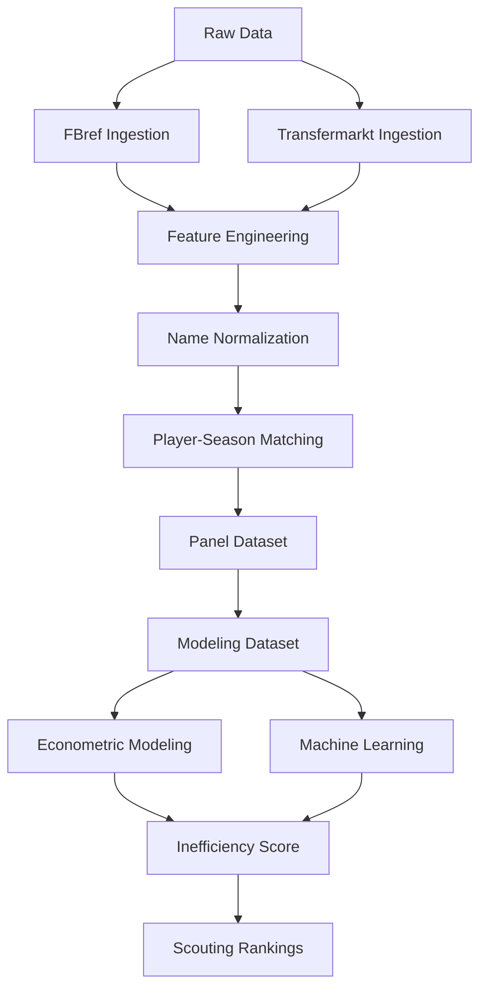

# 📊 Identificación de jugadores infravalorados en el mercado de fichajes europeo

<div align="center">


</div>

---

# 🧠 Descripción del proyecto

Este proyecto desarrolla un sistema analítico para mejorar la toma de decisiones en scouting y fichajes dentro del mercado europeo de fútbol profesional.

El objetivo principal es estimar el **valor de mercado esperado** de los futbolistas a partir de su rendimiento deportivo y detectar ineficiencias de mercado que permitan identificar oportunidades de fichaje bajo una estrategia:

> **Buy low → Sell high**

El sistema combina:

- Econometría aplicada
- Machine Learning supervisado
- Feature engineering deportivo
- Integración robusta de datos heterogéneos
- Scouting cuantitativo

---

# 📑 Tabla de contenidos

- [🧠 Descripción del proyecto](#-descripción-del-proyecto)
- [🎯 Problema de negocio](#-problema-de-negocio)
- [🧩 Objetivos analíticos](#-objetivos-analíticos)
- [⚙️ Enfoque metodológico](#️-enfoque-metodológico)
- [📚 Metodología](#-metodología)
- [⏳ Estrategia de validación](#-estrategia-de-validación)
- [📦 Fuentes de datos](#-fuentes-de-datos)
  - [Transfermarkt](#transfermarkt)
  - [FBref](#fbref)
- [⚠️ Problema crítico del proyecto](#️-problema-crítico-del-proyecto)
- [🛠️ Sistema de matching implementado](#️-sistema-de-matching-implementado)
- [📈 Resultados del matching](#-resultados-del-matching)
- [🏗️ Arquitectura del pipeline](#️-arquitectura-del-pipeline)
- [📊 Dataset final](#-dataset-final)
- [📈 Modelización econométrica](#-modelización-econométrica)
- [📊 Resultados econométricos](#-resultados-econométricos)
- [🤖 Machine Learning supervisado](#-machine-learning-supervisado)
- [📊 Resultados Machine Learning](#-resultados-machine-learning)
- [💡 Inefficiency Score](#-inefficiency-score)
- [📤 Outputs del sistema](#-outputs-del-sistema)
- [📂 Estructura del proyecto](#-estructura-del-proyecto)
- [▶️ Ejecución del pipeline](#️-ejecución-del-pipeline)
- [📊 Resultados del sistema](#-resultados-del-sistema)
- [🚀 Próximos pasos](#-próximos-pasos)
- [🧠 Valor del proyecto](#-valor-del-proyecto)
- [👤 Autores](#-autores)

---

# 🎯 Problema de negocio

Los clubes toman decisiones de fichaje basándose en:

- scouting tradicional
- intuición
- métricas limitadas
- análisis parcialmente subjetivos

Sin embargo, el mercado presenta ineficiencias derivadas de:

- información incompleta
- sesgos mediáticos
- diferencias estructurales entre ligas
- asimetrías de información

👉 Este proyecto busca responder:

## ❓ ¿Qué jugadores están infravalorados respecto a su rendimiento real?

---

# 🧩 Objetivos analíticos

El sistema busca:

- estimar el valor de mercado esperado
- detectar jugadores infravalorados
- construir rankings cuantitativos de scouting
- analizar diferencias estructurales entre ligas
- comparar econometría vs machine learning
- generar outputs interpretables para toma de decisiones

---

# ⚙️ Enfoque metodológico

## Unidad de análisis

```text
Jugador – Temporada
```

Cada observación representa:

- rendimiento deportivo
- contexto competitivo
- valor de mercado
- características demográficas

de un jugador en una temporada concreta.

---

# 📚 Metodología

El proyecto sigue una adaptación de:

```text
CRISP-DM
```

## Estado actual

```text
Modeling → Evaluation
```

---

# ⏳ Estrategia de validación

El sistema utiliza validación temporal estricta para evitar leakage temporal y reproducir escenarios reales de scouting.

| Split | Temporadas |
|---|---|
| Train | 2019-2020 → 2023-2024 |
| Test | 2024-2025 |

👉 No se utiliza random split.

---

# 📦 Fuentes de datos

## Transfermarkt

### Variables principales

- valor de mercado
- edad
- club
- posición
- historial de traspasos

### Uso

- target principal
- construcción del Inefficiency Score
- contexto de mercado

### Dataset utilizado

```text
Kaggle — player-scores (davidcariboo)
```

---

## FBref

### Variables principales

- estadísticas por 90 minutos
- métricas ofensivas
- métricas defensivas
- métricas de posesión

### Uso

- variables explicativas
- feature engineering deportivo

---

# ⚠️ Problema crítico del proyecto

# Integración FBref ↔ Transfermarkt

Uno de los principales retos del proyecto es el matching entre ambas fuentes.

## Problemas estructurales

- ❌ no existe identificador único común
- ❌ nombres inconsistentes
- ❌ transliteraciones
- ❌ diferencias de clubes
- ❌ diferencias de edad
- ❌ cambios intra-temporada
- ❌ granularidad distinta

👉 Este problema consumió aproximadamente el 40-50% del trabajo total del proyecto.

---

# 🛠️ Sistema de matching implementado

Se desarrolló un pipeline jerárquico robusto:

## 1️⃣ Normalización de nombres

- lowercase
- eliminación de acentos
- limpieza de strings

---

## 2️⃣ Matching exacto

- nombre
- temporada
- edad aproximada

---

## 3️⃣ Validación por club

- fuzzy matching
- similarity score

---

## 4️⃣ Matching fuzzy

- RapidFuzz
- token sort ratio
- threshold elevado

---

## 5️⃣ Validación final

- diferencia máxima de edad:
  
```python
MAX_AGE_DIFF = 1.5
```

---

# 📈 Resultados del matching

| Métrica | Resultado |
|---|---:|
| Match rate | 88.36% |
| Observaciones emparejadas | 20,836 |
| Observaciones totales | 23,580 |

## Distribución

- exact matching → dominante
- fuzzy matching → residual

👉 El matching constituye uno de los principales aportes técnicos del proyecto.

---

# 🏗️ Arquitectura del pipeline



---

# 📊 Dataset final

## Panel completo

| Métrica | Valor |
|---|---:|
| Observaciones | 23,580 |
| Temporadas | 2019-2020 → 2024-2025 |
| Ligas | 7 |

---

## Dataset modelizable

| Métrica | Valor |
|---|---:|
| Observaciones | 3,297 |
| Jugadores | 1,847 |
| Edad | 18–23 |

---

## Ligas incluidas

- Premier League
- LaLiga
- Bundesliga
- Serie A
- Ligue 1
- Eredivisie
- Liga Portugal

---

# 📈 Modelización econométrica

## Modelo econométrico final

Regresión OLS con:

- efectos fijos por liga
- efectos fijos por temporada
- efectos fijos por posición
- errores robustos HC3

## Variable objetivo

```python
log_market_value_eur
```

---

## Especificación principal

```python
log_market_value_eur ~
age +
log_minutes_played +
goals_per90 +
assists_per90 +
league FE +
season FE +
position FE
```

---

# 📊 Resultados econométricos

## Evaluación out-of-sample

| Modelo | MAE | RMSE | R² |
|---|---:|---:|---:|
| OLS simple | 1.0036 | 1.2165 | 0.1472 |
| OLS + League FE | 0.7954 | 0.9896 | 0.4356 |
| OLS final FE | **0.7907** | **0.9823** | **0.4439** |

---

## Principales hallazgos

### 📌 Premier League

- prima estructural positiva significativa

### 📌 Eredivisie / Liga Portugal

- descuentos estructurales relevantes

### 📌 Variables más importantes

- minutos jugados
- goles por 90
- asistencias por 90

👉 El contexto competitivo explica gran parte del valor de mercado.

---

# 🤖 Machine Learning supervisado

Se implementan modelos ML utilizando exactamente la misma partición temporal que el modelo econométrico.

## Modelos implementados

- Random Forest
- HistGradientBoosting
- GradientBoostingRegressor

---

# 📊 Resultados Machine Learning

| Modelo | MAE | RMSE | R² |
|---|---:|---:|---:|
| OLS final | 0.7907 | 0.9823 | 0.4439 |
| Random Forest | 0.7704 | 0.9691 | 0.4587 |
| HistGradientBoosting | 0.7723 | 0.9680 | 0.4600 |
| Gradient Boosting | **0.7613** | **0.9493** | **0.4807** |

---

# 💡 Inefficiency Score

El sistema estima:

```python
inefficiency_score = valor_estimado - valor_real
```

## Interpretación

| Score | Interpretación |
|---|---|
| Positivo | posible infravaloración |
| Negativo | posible sobrevaloración |

---

# 📤 Outputs del sistema

El pipeline genera automáticamente:

- predicciones de valor esperado
- rankings de jugadores infravalorados
- rankings de jugadores sobrevalorados
- métricas econométricas
- métricas ML
- tablas de coeficientes
- feature importance
- predicciones out-of-sample

---

# 📂 Estructura del proyecto

```bash
market-value-football-tfm/

├── data/
│   ├── raw/
│   ├── processed/
│   └── outputs/
│
├── docs/
│   ├── data_quality.md
│   ├── data_sources.md
│   ├── schema_decisions.md
│   ├── modeling_decisions.md
│   └── project_status.md
│
├── notebooks/
│   ├── 01_data_understanding.ipynb
│   ├── 02_econometric_baseline.ipynb
│   ├── 03_econometric_model.ipynb
│   └── 04_supervised_machine_learning.ipynb
│
├── src/
│   ├── data/
│   │   ├── ingest_fbref.py
│   │   ├── build_fbref_features.py
│   │   ├── build_transfermarkt_features.py
│   │   ├── build_player_season_panel.py
│   │   └── build_modeling_dataset.py
│   │
│   └── features/
│       └── build_performance_features.py
│
└── README.md
```

---

# ▶️ Ejecución del pipeline

## 1️⃣ Construir features FBref

```bash
python -m src.data.build_fbref_features
```

---

## 2️⃣ Construir features Transfermarkt

```bash
python -m src.data.build_transfermarkt_features
```

---

## 3️⃣ Construir panel jugador–temporada

```bash
python -m src.data.build_player_season_panel
```

---

## 4️⃣ Construir dataset modelizable

```bash
python -m src.data.build_modeling_dataset
```

---

# 📊 Resultados del sistema

El sistema permite:

✅ estimar valor esperado  
✅ detectar ineficiencias de mercado  
✅ generar rankings de scouting  
✅ comparar econometría vs ML  
✅ identificar ligas infravaloradas  
✅ construir shortlists cuantitativas  

---

# 🚀 Próximos pasos

- feature engineering avanzado
- Growth Score
- dashboard interactivo
- visualizaciones finales
- business insights
- scouting reports automáticos
- despliegue del sistema

---

# 🧠 Valor del proyecto

El proyecto aporta:

- integración robusta de datos heterogéneos
- modelización interpretable
- aplicación directa a decisiones de negocio
- validación temporal realista
- detección de ineficiencias de mercado
- enfoque reproducible y escalable

---

# 👤 Autores

- Isabel Muñoz Martín
- Laura González Macho
- Manuel Pérez Bañuls

Trabajo Fin de Máster — Data Science aplicado al fútbol profesional.

Enfoque:
- sports analytics
- scouting cuantitativo
- econometría aplicada
- machine learning
- identificación de ineficiencias de mercado