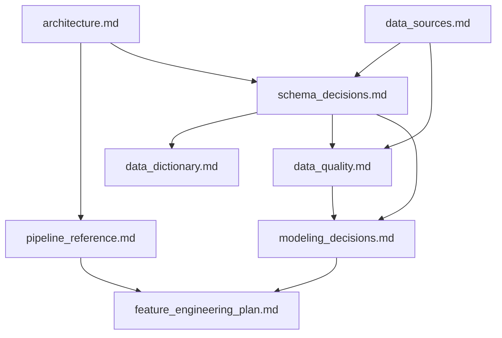

# 📚 Documentación técnica del proyecto

---

# 🧠 Objetivo

Esta carpeta contiene la documentación técnica y metodológica del sistema analítico desarrollado para el TFM:

<pre>
Identificación de jugadores infravalorados en el mercado de fichajes europeo
</pre>

La documentación recoge las decisiones de arquitectura, datos, calidad, modelización y evolución metodológica del proyecto.

---

# 📂 Índice de documentación

## 🏗️ Arquitectura y sistema

| Documento | Descripción |
|---|---|
| [architecture.md](architecture.md) | Arquitectura global del sistema, evolución notebooks → pipelines y decisiones de analytics engineering |
| [pipeline_reference.md](pipeline_reference.md) | Referencia operativa de pipelines, comandos de ejecución, inputs, outputs y dependencias |
| [schema_decisions.md](schema_decisions.md) | Decisiones de diseño del dataset, unidad de análisis, target, variables y prevención de leakage |

---

## 📊 Datos

| Documento | Descripción |
|---|---|
| [data_sources.md](data_sources.md) | Fuentes de datos utilizadas, rol de cada fuente y limitaciones metodológicas |
| [data_quality.md](data_quality.md) | Calidad del dataset, matching, sesgos, cobertura, limitaciones y riesgos |
| [data_dictionary.md](data_dictionary.md) | Diccionario de variables, outputs, variables de scoring y variables excluidas por leakage |

---

## 📈 Modelización y scoring

| Documento | Descripción |
|---|---|
| [modeling_decisions.md](modeling_decisions.md) | Decisiones metodológicas de modelización, OLS, ML, validación temporal y scoring |
| [feature_engineering_plan.md](feature_engineering_plan.md) | Plan de feature engineering avanzado aplicado a scouting y valoración de jugadores |

---

# 🔄 Estado actual del proyecto

El proyecto ha evolucionado desde un enfoque exploratorio basado en notebooks hacia una arquitectura modular reproducible.

## Estado metodológico

<pre>
Modeling → Evaluation
</pre>

## Capacidades actuales

- integración multi-fuente
- matching FBref ↔ Transfermarkt
- construcción de panel jugador-temporada
- dataset modelizable
- pipeline econométrico
- pipeline Machine Learning
- scoring de ineficiencia
- rankings de scouting
- validación temporal out-of-sample
- outputs reproducibles

---

# 🧱 Estructura documental recomendada

Para entender el proyecto de forma ordenada, se recomienda leer:

1. [architecture.md](architecture.md)
2. [data_sources.md](data_sources.md)
3. [schema_decisions.md](schema_decisions.md)
4. [data_quality.md](data_quality.md)
5. [modeling_decisions.md](modeling_decisions.md)
6. [pipeline_reference.md](pipeline_reference.md)
7. [feature_engineering_plan.md](feature_engineering_plan.md)
8. [data_dictionary.md](data_dictionary.md)

---

# 🧩 Relación entre documentación y arquitectura

---

# 📌 Convenciones

## Archivos de documentación

* Cada documento debe explicar decisiones, no solo describir código.
* Las decisiones metodológicas deben justificar trade-offs.
* Las limitaciones deben documentarse explícitamente.
* Los outputs generados deben estar alineados con la arquitectura real del repositorio.

---

## Relación notebooks / pipelines

Los notebooks se mantienen como soporte para:

* exploración
* validación
* interpretación
* análisis visual

La ejecución reproducible del sistema reside en:

<pre>
src/
</pre>

---

# 🚀 Próximas actualizaciones previstas

Documentos pendientes de actualización o creación:

* [x] architecture.md
* [ ] pipeline_reference.md
* [ ] modeling_decisions.md
* [ ] schema_decisions.md
* [ ] data_quality.md
* [ ] data_dictionary.md
* [ ] feature_engineering_plan.md

---

# 🧠 Criterio general

La documentación debe reflejar que el proyecto no es únicamente un análisis en notebooks, sino un sistema analítico modular, reproducible y orientado a generar outputs accionables para scouting cuantitativo.
