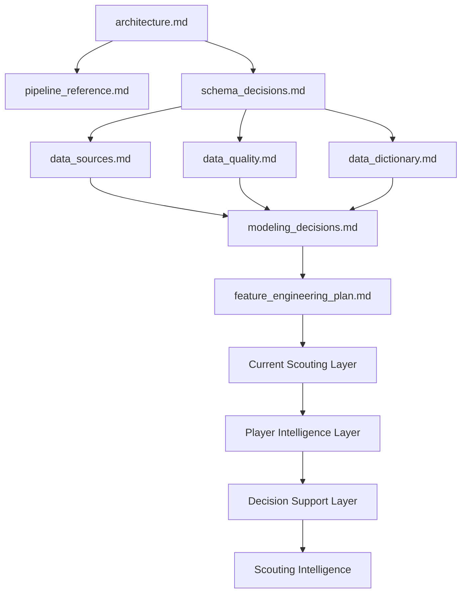

# 📚 Documentación Técnica del Proyecto

<div align="center">


</div>

---

# 🧠 Objetivo

Esta carpeta contiene la documentación técnica y metodológica de la plataforma desarrollada para el Trabajo Fin de Máster:

```text
Market Value Dynamics and Market Inefficiency Detection
in European Football
```

La documentación recoge las decisiones relacionadas con:

- arquitectura
- datos
- calidad
- modelización
- feature engineering
- explainability
- scoring
- player intelligence
- decision support
- scouting intelligence

Su objetivo no es únicamente describir el código, sino justificar las decisiones metodológicas adoptadas durante la evolución del sistema.

---

# 🚀 Estado actual del proyecto

La plataforma ha evolucionado desde un sistema predictivo centrado en estimación de valor de mercado hacia una solución integral de Football Analytics orientada a scouting profesional.

Estado actual:

```text
Historical Evaluation Layer
↓
Current Scouting Layer
↓
Player Intelligence Layer
↓
Decision Support Layer
↓
Scouting Intelligence
```

---

## Capacidades actuales

### Data Layer

- integración FBref + Transfermarkt
- matching jerárquico validado
- panel longitudinal jugador-temporada
- dataset modelizable reproducible

### Modeling Layer

- econometría aplicada
- machine learning supervisado
- validación temporal
- MLflow

### Scoring Layer

- Inefficiency Score
- Growth Score
- Confidence Score
- Opportunity Score
- Risk Score

### Player Intelligence Layer

- Player Radar MVP
- Positional Benchmarking
- Scouting Narrative

### Decision Support Layer

- Executive Dashboard
- Opportunity vs Risk Matrix
- Explainability SHAP
- Rankings interactivos

---

# 📊 Estado cuantitativo

| Métrica | Valor |
|----------|----------:|
| Observaciones modelizables | 3.916 |
| Jugadores únicos | 2.136 |
| Cobertura temporal | 2019-2020 → 2025-2026 |
| Ligas | 7 |
| Modelo productivo | Tuned XGBoost |
| R² final | 0.5414 |

---

# 📂 Índice documental

## 🏗️ Arquitectura y sistema

| Documento | Descripción |
|------------|-------------|
| architecture.md | Arquitectura global del sistema y evolución hasta Scouting Intelligence |
| pipeline_reference.md | Referencia completa de pipelines y flujos operativos |
| schema_decisions.md | Diseño de datasets, target, unidades de análisis y prevención de leakage |

---

## 📊 Datos

| Documento | Descripción |
|------------|-------------|
| data_sources.md | Fuentes de datos, matching e integración multi-fuente |
| data_quality.md | Controles de calidad, validaciones y prevención de leakage |
| data_dictionary.md | Diccionario completo de variables y outputs |

---

## 🤖 Modelización y analítica

| Documento | Descripción |
|------------|-------------|
| modeling_decisions.md | Decisiones metodológicas de econometría, ML, scoring y evaluación |
| feature_engineering_plan.md | Estrategia completa de Feature Engineering y roadmap futuro |

---

# 🧩 Evolución metodológica

La documentación refleja la evolución progresiva del proyecto.

| Sprint | Contribución principal |
|----------|----------------------|
| Sprint 1 | Positional Normalization |
| Sprint 2 | Temporal Dynamics |
| Sprint 3 | Composite Football Indices |
| Sprint 4 | Machine Learning |
| Sprint 4C | Explainability |
| Sprint 5 | Scoring Engine |
| Sprint 6 | Business Evaluation |
| Sprint 7 | Executive Dashboard |
| Sprint 9 | Decision Support Layer |
| Sprint 10.1 | Player Intelligence Layer |
| Sprint 10.2 | FBref Advanced Audit |
| Sprint 10.3 | Current Scouting Layer + Risk Framework |

---

# 🔄 Flujo documental recomendado

Para comprender el sistema de forma progresiva se recomienda el siguiente orden:

1. architecture.md
2. pipeline_reference.md
3. schema_decisions.md
4. data_sources.md
5. data_quality.md
6. data_dictionary.md
7. modeling_decisions.md
8. feature_engineering_plan.md

---

# 🧠 Relación entre documentos



---

# 🏗️ Relación con la arquitectura

La documentación sigue la misma estructura conceptual que la arquitectura del sistema.

```text
Raw Sources
↓
Feature Engineering
↓
Modeling Dataset
↓
Econometric & ML Models
↓
Historical Evaluation Layer
↓
Current Scouting Layer
↓
Player Intelligence Layer
↓
Decision Support Layer
↓
Scouting Intelligence
```

---

# 📌 Convenciones documentales

## Principios

Todos los documentos deben:

- justificar decisiones
- documentar trade-offs
- describir limitaciones
- explicar impactos metodológicos
- mantener trazabilidad

---

## Reproducibilidad

La ejecución reproducible reside en:

```text
src/
```

Los notebooks se mantienen como soporte para:

- exploración
- validación
- interpretación
- visualización

---

## Tracking experimental

MLflow se utiliza para:

```text
Parámetros
↓
Métricas
↓
Modelos
↓
Artefactos
```

Ubicación:

```text
mlruns/
```

---

## Outputs finales

| Directorio | Función |
|------------|----------|
| reports/ | resultados interpretables |
| artifacts/ | modelos y predicciones |
| mlruns/ | tracking experimental |
| logs/ | trazabilidad operativa |

---

# 🚀 Sprint 10 — Impacto documental

Sprint 10 obliga a actualizar la documentación para reflejar una nueva arquitectura conceptual.

Principales incorporaciones:

## Sprint 10.1

Player Intelligence Layer

- Player Radar MVP
- Positional Benchmarking
- Scouting Narrative

---

## Sprint 10.2

FBref Advanced Audit

- evaluación de nuevas métricas
- validación de viabilidad
- roadmap Advanced Football Radar

---

## Sprint 10.3

Current Scouting Layer

- temporada 2025-2026
- Risk Framework
- Opportunity vs Risk Matrix
- separación evaluación vs operación

---

# 📌 Próximas líneas documentales

## Sprint 11

Advanced Football Radar

Documentar:

- métricas avanzadas FBref
- benchmark posicional ampliado

---

## Sprint 12

Understat Integration

Documentar:

- xG
- xA
- nuevas señales ofensivas

---

## Sprint 13

Advanced Modeling

Documentar:

- CatBoost
- Ensembles
- modelos específicos por posición

---

# 🧠 Conclusión

La documentación refleja la transición desde un proyecto académico centrado en modelización hacia una plataforma integral de Football Analytics.

La principal contribución metodológica de la release v1.0.0 es la separación explícita entre:

```text
Historical Evaluation Layer
↓
Current Scouting Layer
↓
Player Intelligence Layer
↓
Decision Support Layer
```

permitiendo transformar modelos predictivos en recomendaciones operativas orientadas a scouting profesional.
