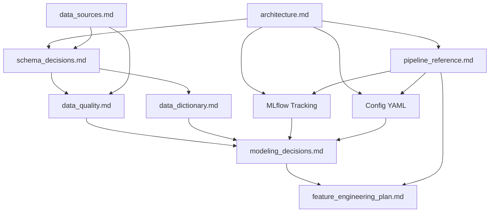

# 📚 Documentación técnica del proyecto

---

# 🧠 Objetivo

Esta carpeta contiene la documentación técnica y metodológica del sistema analítico desarrollado para el TFM:

<pre>
Identificación de jugadores infravalorados en el mercado de fichajes europeo
</pre>

La documentación recoge las decisiones de arquitectura, datos, calidad, modelización, feature engineering, trazabilidad experimental y evolución metodológica del proyecto.

El objetivo de esta carpeta no es únicamente describir el código, sino documentar las decisiones que explican cómo se ha construido el sistema analítico y por qué se han adoptado determinados trade-offs técnicos y metodológicos.

---

# 📂 Índice de documentación

## 🏗️ Arquitectura y sistema

| Documento | Descripción |
|---|---|
| [architecture.md](architecture.md) | Arquitectura global del sistema, evolución notebooks → pipelines, configuración centralizada, MLflow, logs y decisiones de analytics engineering |
| [pipeline_reference.md](pipeline_reference.md) | Referencia operativa de pipelines, comandos de ejecución, inputs, outputs, dependencias, configuración, logs y tracking experimental |
| [schema_decisions.md](schema_decisions.md) | Decisiones de diseño del dataset, unidad de análisis, target, variables, separación entre capas, prevención de leakage, MLflow y configuración YAML |

---

## 📊 Datos

| Documento | Descripción |
|---|---|
| [data_sources.md](data_sources.md) | Fuentes de datos utilizadas, rol de cada fuente, estrategia de integración, matching, trazabilidad y limitaciones metodológicas |
| [data_quality.md](data_quality.md) | Calidad del dataset, matching, sesgos, cobertura, validaciones, leakage, configuración, logging y riesgos |
| [data_dictionary.md](data_dictionary.md) | Diccionario de variables, outputs, variables de scoring, variables excluidas por leakage, variables de tracking y configuración |

---

## 📈 Modelización y scoring

| Documento | Descripción |
|---|---|
| [modeling_decisions.md](modeling_decisions.md) | Decisiones metodológicas de modelización, OLS, ML, validación temporal, scoring, MLflow y configuración centralizada |
| [feature_engineering_plan.md](feature_engineering_plan.md) | Plan de feature engineering avanzado aplicado a scouting, valoración de jugadores, normalización contextual y mejora del signal predictivo |

---

# 🔄 Estado actual del proyecto

El proyecto ha evolucionado desde un enfoque exploratorio basado en notebooks hacia una arquitectura modular reproducible, trazable y orientada a experimentación.

## Estado metodológico

<pre>
Modeling → Evaluation
</pre>

## Capacidades actuales

- integración multi-fuente
- matching FBref ↔ Transfermarkt
- construcción de panel jugador-temporada
- dataset modelizable
- pipeline econométrico
- pipeline Machine Learning
- scoring de ineficiencia
- rankings de scouting
- validación temporal out-of-sample
- outputs reproducibles
- configuración centralizada mediante YAML
- tracking experimental con MLflow
- persistencia de artefactos
- logging operativo
- separación clara entre datos, modelos, outputs y experimentos

---

# 🧱 Estructura documental recomendada

Para entender el proyecto de forma ordenada, se recomienda leer:

1. [architecture.md](architecture.md)
2. [pipeline_reference.md](pipeline_reference.md)
3. [schema_decisions.md](schema_decisions.md)
4. [data_sources.md](data_sources.md)
5. [data_quality.md](data_quality.md)
6. [data_dictionary.md](data_dictionary.md)
7. [modeling_decisions.md](modeling_decisions.md)
8. [feature_engineering_plan.md](feature_engineering_plan.md)

---

# 🧩 Relación entre documentación y arquitectura

---

# 📌 Convenciones

## Archivos de documentación

* Cada documento debe explicar decisiones, no solo describir código.
* Las decisiones metodológicas deben justificar trade-offs.
* Las limitaciones deben documentarse explícitamente.
* Los outputs generados deben estar alineados con la arquitectura real del repositorio.
* La documentación debe distinguir claramente entre datasets, outputs, artefactos, experimentos y logs.
* Las decisiones de modelización deben quedar vinculadas a validación temporal y trazabilidad experimental.
* La configuración debe documentarse como parte del sistema, no como un elemento auxiliar.

---

## Relación notebooks / pipelines

Los notebooks se mantienen como soporte para:

* exploración
* validación
* interpretación
* análisis visual
* explicación narrativa de resultados

La ejecución reproducible del sistema reside en:

<pre>
src/
</pre>

---

## Relación configuración / código

La configuración se centraliza en:

<pre>
config/
</pre>

El código consume dicha configuración desde los pipelines, evitando hardcoding de parámetros críticos.

La lógica funcional permanece en:

<pre>
src/
</pre>

---

## Relación MLflow / outputs

MLflow se utiliza para tracking experimental:

<pre>
mlruns/
</pre>

Los outputs finales del proyecto se mantienen separados en:

<pre>
reports/
artifacts/
</pre>

Por tanto:

| Elemento     | Función                                                |
| ------------ | ------------------------------------------------------ |
| `reports/`   | Outputs interpretables y tablas finales                |
| `artifacts/` | Modelos, predicciones y objetos persistidos            |
| `mlruns/`    | Runs, métricas, parámetros y artefactos experimentales |
| `logs/`      | Trazabilidad operativa y debugging                     |

---

# 🚀 Próximas actualizaciones previstas

Documentos actualizados tras la implementación de MLflow y configuración centralizada:

* [x] architecture.md
* [x] pipeline_reference.md
* [x] modeling_decisions.md
* [x] schema_decisions.md
* [x] data_quality.md
* [x] data_dictionary.md
* [x] feature_engineering_plan.md
* [x] data_sources.md
* [x] docs/README.md

---

# 📌 Próximas líneas documentales recomendadas

Tras esta actualización, las siguientes mejoras documentales recomendadas son:

* revisar PROJECT_STATUS.md si se añaden nuevos resultados de experimentos
* añadir una sección específica de MLflow en la memoria del TFM dentro de Tecnología o Modelización
* documentar la convención de versionado de experimentos si se consolida un flujo estable
* añadir ejemplos de ejecución reproducible con comandos completos

---

# 🧠 Criterio general

La documentación debe reflejar que el proyecto no es únicamente un análisis en notebooks, sino un sistema analítico modular, reproducible, trazable y orientado a generar outputs accionables para scouting cuantitativo.

La incorporación de MLflow, configuración centralizada y logging refuerza la madurez del proyecto, acercándolo a una práctica profesional de Data Science aplicada a football analytics.
