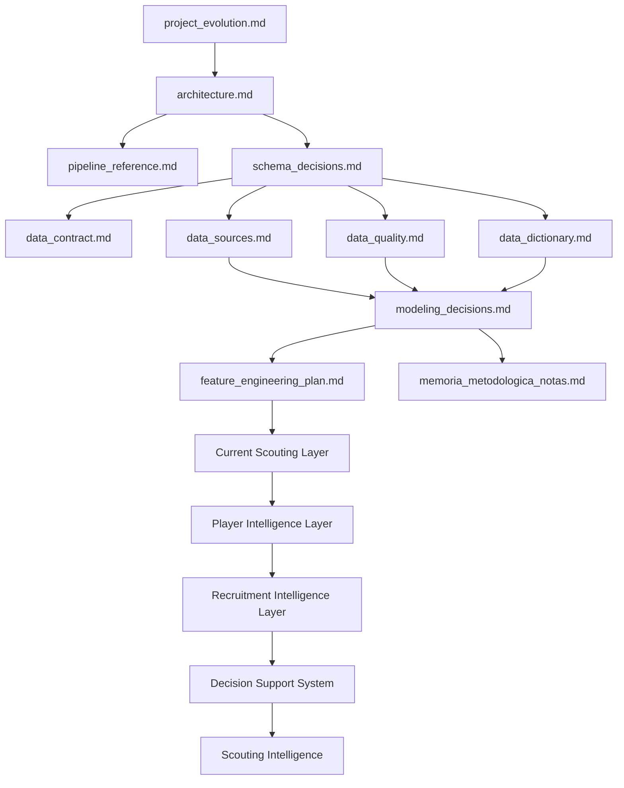

# 📚 Documentación Técnica del Proyecto

<div align="center">


</div>

---

# 🧠 Objetivo

Esta carpeta contiene la documentación técnica y metodológica de la plataforma desarrollada para el Trabajo Fin de Máster:

```text
Market Value Dynamics and Market Inefficiency Detection
in Professional Football
```

La documentación recoge las decisiones relacionadas con:

* arquitectura;
* datos;
* calidad;
* modelización;
* feature engineering;
* explainability;
* scoring;
* risk assessment;
* player intelligence;
* recruitment intelligence;
* decision support systems;
* validación externa.
* contratos de datos y separación de contextos temporales;
* autoridad de snapshots, identidad, presentación y riesgo;
* rendimiento, accesibilidad, responsive design e internacionalización.

Su objetivo no es únicamente describir el código, sino justificar las decisiones metodológicas adoptadas durante la evolución del sistema.

---

# 🚀 Estado actual del proyecto

La plataforma ha evolucionado desde un sistema predictivo centrado en estimación de valor de mercado hacia una solución integral de Football Analytics orientada a scouting profesional.

Estado productivo de la release `v2.0.0`:

```text
Data Sources → Historical Modeling Authority
             → Current Snapshot Authority
             → Identity Registry
             → Presentation Authority
             → Risk Authority
             → DSS Context
             → Streamlit Decision Support System
```

---

## Capacidades actuales

### Data Layer

* integración FBref + Transfermarkt;
* matching jerárquico validado;
* panel longitudinal jugador-temporada;
* expansión multi-liga;
* dataset modelizable reproducible.
* universo DSS canónico con snapshot actual;
* contratos explícitos para `season`, `current_snapshot` y `presentation`.

---

### Modeling Layer

* econometría aplicada;
* machine learning supervisado;
* validación temporal;
* MLflow;
* evaluación incremental de features.

---

### Scoring Layer

* Inefficiency Score;
* Growth Score;
* Confidence Score;
* Opportunity Score;
* Risk Score.
* Contract Opportunity Score;
* Risk Adjusted Opportunity Score sin fallbacks silenciosos.

---

### Player Intelligence Layer

* Player Radar;
* Positional Benchmarking;
* Scouting Narrative;
* Opportunity vs Risk Analysis.

---

### Recruitment Intelligence Layer

* Recruitment Board;
* Candidate Selection;
* Comparative Player Analysis;
* Executive Scouting Workflow.
* Contract Intelligence;
* Transfer Strategy Engine;
* Portfolio Optimization.

---

### Decision Support System

* Executive Dashboard;
* Advanced Search Engine;
* Explainability SHAP;
* Rankings interactivos;
* Internationalization EN/ES.
* diseño responsive y accesibilidad operativa;
* caché de contexto DSS y carga centralizada;
* registry canónico de identidad y presentación.

---

# 📊 Estado cuantitativo

| Métrica                        |                 Valor |
| ------------------------------ | --------------------: |
| Observaciones FBref procesadas |                43.591 |
| Dataset modelizable            |                 5.527 |
| Cobertura temporal             | 2019-2020 → 2025-2026 |
| Ligas                          |                    11 |
| Liga-temporada                 |                    77 |
| Modelo econométrico oficial    |       Growth OLS v13B |
| Modelo productivo oficial      |    Tuned XGBoost v13B |
| Release                        |                v2.0.0 |
| Universo DSS canónico          |          757 jugadores |
| Competiciones DSS              |                    11 |
| Cobertura contractual          |                95,90% |

---

## Evolución consolidada

### Sprint 13A — Multi-League Expansion

* expansión a 11 ligas;
* validación externa;
* auditoría de cobertura;
* generalización multi-liga.

---

### Sprint 13B — Advanced Data Expansion

* integración de métricas avanzadas FBref;
* nuevas variables productivas;
* mejora simultánea en econometría y Machine Learning;
* fortalecimiento de la capacidad explicativa.

### Sprint 14 y 14.1 — Strategy & Player Level

* Transfer Strategy Engine y escenarios de cartera;
* optimización bajo presupuesto y restricciones;
* capa de decisión a nivel de jugador.

### TM.2 y TM.3 — Integración DSS

* propagación multi-liga hasta scoring, rankings y portfolio;
* Contract Intelligence y contexto negociador;
* separación entre modelización histórica e inteligencia contractual operativa.

### TM.6.x — Productización visual

* identidad visual, activos de jugadores y clubes;
* UX móvil, diseño ejecutivo y consistencia Cloud/local;
* internacionalización y accesibilidad operativa.

### TM.7.0, TM.7.1 y TM.7.6 — Autoridades de consumo

* autoridad del snapshot actual;
* Presentation Layer canónica;
* retirada de vistas y rutas legacy.

### TM.8.6, TM.8.9 y TM.8.10 — Cierre arquitectónico

* auditoría y cierre de rendimiento;
* migración a Single Source of Truth e Identity Registry;
* DataFrame Contract Layer;
* restauración de la autoridad productiva de `risk_score`;
* cierre de release `v2.0.0`.

---

# 📂 Índice documental

La cronología completa de releases, sprints, estado y roadmap se mantiene en [project_evolution.md](project_evolution.md).

## 🏗️ Arquitectura y sistema

| Documento             | Descripción                                                              |
| --------------------- | ------------------------------------------------------------------------ |
| architecture.md       | Arquitectura global del sistema y evolución metodológica                 |
| pipeline_reference.md | Referencia completa de pipelines y flujos operativos                     |
| schema_decisions.md   | Diseño de datasets, target, unidades de análisis y prevención de leakage |
| data_contract.md      | Contrato de contextos, campos obligatorios e invariantes DSS             |

---

## 📊 Datos

| Documento          | Descripción                                                |
| ------------------ | ---------------------------------------------------------- |
| data_sources.md    | Fuentes de datos, matching e integración multi-fuente      |
| data_quality.md    | Controles de calidad, validaciones y prevención de leakage |
| data_dictionary.md | Diccionario completo de variables y outputs                |

---

## 🤖 Modelización y analítica

| Documento                   | Descripción                                                       |
| --------------------------- | ----------------------------------------------------------------- |
| modeling_decisions.md       | Decisiones metodológicas de econometría, ML, scoring y evaluación |
| feature_engineering_plan.md | Estrategia completa de Feature Engineering                        |
| memoria_metodologica_notas.md | Notas para la memoria académica, hipótesis y resultados          |
| project_evolution.md         | Cronología canónica, releases, sprints y roadmap vigente          |

---

# 🧩 Evolución metodológica

La documentación refleja la evolución progresiva del proyecto.

| Sprint       | Contribución principal                |
| ------------ | ------------------------------------- |
| Sprint 1     | Positional Normalization              |
| Sprint 2     | Temporal Dynamics                     |
| Sprint 3     | Composite Football Indices            |
| Sprint 4     | Machine Learning                      |
| Sprint 4C    | Explainability                        |
| Sprint 5     | Scoring Engine                        |
| Sprint 6     | Business Evaluation                   |
| Sprint 7     | Executive Dashboard                   |
| Sprint 9     | Decision Support Layer                |
| Sprint 10    | Player Intelligence + Risk Framework  |
| Sprint 11    | Recruitment Intelligence              |
| Sprint 12    | Productization & Internationalization |
| Sprint 13A   | Multi-League Expansion                |
| Sprint 13A.1 | External Validation & Coverage Audit  |
| Sprint 13B   | Advanced Data Expansion               |
| Sprint 14    | Transfer Strategy Engine              |
| Sprint 14.1  | Player Level Layer                    |
| TM.2         | Multi-League DSS Integration          |
| TM.3         | Contract Intelligence Layer           |
| TM.6.x       | Visual Identity, Assets & Mobile UX   |
| TM.7.0       | Snapshot Authority                    |
| TM.7.1       | Presentation Layer                    |
| TM.7.6       | Legacy View Decommission              |
| TM.8.6       | Performance Audit & Closure           |
| TM.8.9       | SSOT / Registry Migration             |
| TM.8.10      | Contracts, Risk Authority & Release   |

---

# 🔄 Flujo documental recomendado

Para comprender el sistema de forma progresiva se recomienda el siguiente orden:

1. `project_evolution.md`
2. `architecture.md`
3. `pipeline_reference.md`
4. `schema_decisions.md`
5. `data_contract.md`
6. `data_sources.md`
7. `data_quality.md`
8. `data_dictionary.md`
9. `feature_engineering_plan.md`
10. `modeling_decisions.md`
11. `memoria_metodologica_notas.md`

---

# 🧠 Relación entre documentos



# 🏗️ Relación con la arquitectura

La documentación sigue la misma estructura conceptual que la arquitectura del sistema.

```text id="h4e2m9"
Raw Sources
↓
Feature Engineering
↓
Advanced Metrics Layer
↓
Modeling Dataset
↓
Econometric & ML Models
↓
Historical Evaluation Layer
↓
Current Scouting Layer
↓
Player Intelligence Layer
↓
Recruitment Intelligence Layer
↓
Decision Support System
```

Cada documento describe una capa específica del sistema y las decisiones metodológicas asociadas.

---

# 📌 Convenciones documentales

## Principios

Todos los documentos deben:

* justificar decisiones;
* documentar trade-offs;
* describir limitaciones;
* explicar impactos metodológicos;
* mantener trazabilidad;
* garantizar reproducibilidad.

---

## Reproducibilidad

La ejecución reproducible reside en:

```text id="n8u7jw"
src/
```

Los notebooks se mantienen como soporte para:

* exploración;
* validación;
* interpretación;
* visualización;
* experimentación controlada.

---

## Tracking experimental

MLflow se utiliza para registrar:

```text id="8m4r5q"
Parámetros
↓
Métricas
↓
Modelos
↓
Artefactos
```

Ubicación:

```text id="z0q4gt"
mlruns/
```

---

## Outputs finales

| Directorio | Función                   |
| ---------- | ------------------------- |
| reports/   | resultados interpretables |
| artifacts/ | modelos y predicciones    |
| mlruns/    | tracking experimental     |
| logs/      | trazabilidad operativa    |

---

# 🚀 Contribuciones metodológicas recientes

## Sprint 13A — Multi-League Expansion

Sprint 13A constituye la principal ampliación de cobertura realizada hasta la fecha.

Principales contribuciones:

* expansión de 7 a 11 ligas;
* incorporación de 4 nuevas competiciones;
* parametrización de pipelines;
* auditoría de cobertura;
* diagnósticos de matching;
* validación externa.

---

### Resultado

| Métrica                        |  Valor |
| ------------------------------ | -----: |
| Observaciones FBref procesadas | 43.591 |
| Dataset modelizable            |  5.527 |
| Ligas                          |     11 |
| Temporadas                     |      7 |
| Liga-temporada                 |     77 |
| Match Rate global              | 75,97% |

---

### Impacto metodológico

Sprint 13A fortalece:

```text id="9hrc9r"
Validez externa
↓
Capacidad de generalización
↓
Representatividad competitiva
```

---

## Sprint 13B — Advanced Data Expansion

Sprint 13B amplía la profundidad analítica del sistema mediante la incorporación de métricas avanzadas derivadas de FBref.

---

### Nuevas variables productivas

* finishing_index_v2
* availability_index
* defensive_activity_index

---

### Resultados econométricos

| Modelo                |     R² |
| --------------------- | -----: |
| M_A_v13A_base_spec_FE | 0.4505 |
| M_B_v13B_advanced_FE  | 0.4549 |

Resultado:

```text id="q8v4md"
ΔR² = +0.0044
```

---

### Resultados Machine Learning

| Modelo               | Mejora observada |
| -------------------- | ---------------: |
| XGBoost              |          +0.0096 |
| Random Forest        |          +0.0097 |
| HistGradientBoosting |          +0.0144 |
| LightGBM             |          +0.0291 |

---

### Hallazgo principal

La variable avanzada con mayor relevancia predictiva agregada es:

```text id="q3gjcc"
finishing_index_v2
```

---

### Impacto metodológico

Sprint 13B fortalece:

```text id="95jzgm"
Capacidad explicativa
↓
Calidad de variables
↓
Robustez predictiva
```

---

# ⚠️ Limitación arquitectónica identificada

Durante Sprint 13B se intentó integrar la nueva capa de modelización dentro del pipeline histórico de scoring.

---

## Hallazgo

Se identifica una separación estructural entre:

```text id="k0vxr7"
Modeling Pipeline
≠
Scoring Pipeline
```

---

## Situación observada

El pipeline histórico de scoring depende de variables enriquecidas adicionales como:

* market_value_growth_prev;
* delta_log_market_value_prev;
* growth_index;
* career_year;
* breakout_indicator;
* matching_confidence.

Mientras que la capa productiva v13B genera principalmente:

* predicted_log_market_value_ml;
* predicted_market_value_ml_eur;
* inefficiency_score_ml.

---

## Decisión metodológica

No integrar esta capa dentro de Sprint 13B fue la decisión adoptada en aquel momento; la integración se ejecutó posteriormente como TM.2.

Motivos:

1. No afecta a la hipótesis principal.
2. No altera resultados econométricos.
3. No altera resultados de Machine Learning.
4. Constituye un trabajo de integración independiente.

---

# 🗂️ Backlog histórico documentado

> Esta sección conserva el plan existente al cierre de 13B. TM.2 y Sprint 14 fueron completados después; TM.1 quedó absorbido parcialmente por los diagnósticos de 13A.1. El roadmap vigente está en [project_evolution.md](project_evolution.md#roadmap-vigente).

## TM.1 — Transfermarkt Coverage Audit

Objetivo:

* diagnosticar limitaciones de cobertura;
* estimar techo teórico de matching;
* mejorar integración de datos.

---

## TM.2 — Scoring & Ranking Integration v13B — completado

Objetivo:

```text id="w5m6zn"
Predictions v13B
↓
Scoring Dataset v13B
↓
Opportunity Framework v13B
↓
Risk Framework v13B
↓
Rankings v13B
↓
Stability Analysis
```

---

## Sprint 14 — Transfer Strategy Enhancement — completado

Siguiente fase oficial del proyecto.

Objetivo:

```text id="h1l3ff"
Transformar oportunidades individuales
en estrategias óptimas de fichajes
bajo restricciones reales
de presupuesto y riesgo
```

Líneas previstas:

* Transfer Strategy Engine;
* Portfolio Optimization;
* Scenario Simulation;
* Strategic Recruitment.

---

# 🧠 Conclusión

La documentación refleja la evolución del proyecto desde un sistema académico centrado en modelización hacia una plataforma integral de Football Analytics orientada a scouting profesional, recruitment y soporte avanzado a decisiones deportivas.

La evolución metodológica puede resumirse mediante:

```text id="d8b0jw"
Modelización
↓
Scoring
↓
Player Intelligence
↓
Recruitment Intelligence
↓
Decision Support System
↓
External Validation
↓
Advanced Data Expansion
```

Las contribuciones más relevantes de la release:

```text id="t6qj2v"
v2.0.0 — DSS Architecture, Data Contracts & Productization
```

corresponden a:

### Sprint 13A

* ampliación multi-liga;
* validación externa;
* auditoría de cobertura.

### Sprint 13B

* integración de métricas avanzadas;
* validación incremental de variables;
* mejora simultánea en econometría y Machine Learning.

La hipótesis principal de Sprint 13B queda validada.

Las variables:

* finishing_index_v2;
* availability_index;
* defensive_activity_index;

aportan señal predictiva incremental consistente y pasan a formar parte de la arquitectura productiva oficial.

La siguiente línea histórica de evolución correspondió a:

```text id="mpq4u8"
Sprint 14
↓
Transfer Strategy Enhancement
```

orientada a transformar inteligencia de scouting en estrategias óptimas de construcción de plantilla.
