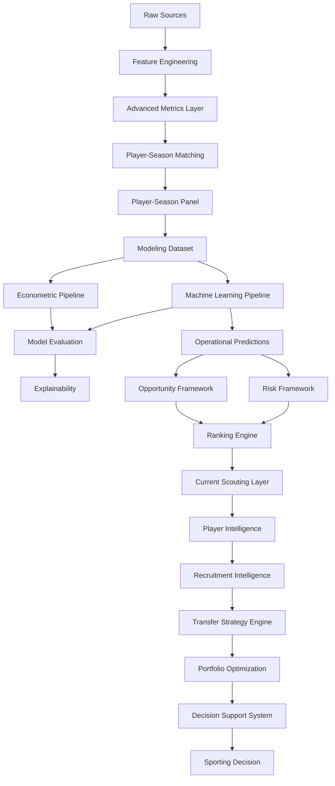

# 🏗️ Arquitectura del Sistema

## Visión general

La arquitectura del proyecto ha evolucionado desde un entorno exploratorio centrado en modelización predictiva hacia una plataforma integral de Football Analytics orientada a scouting profesional, recruitment intelligence y soporte cuantitativo a decisiones deportivas.

La versión actual:

```text
v1.2.2 — Transfer Strategy Engine
```

implementa una arquitectura multicapa capaz de transformar información deportiva y económica procedente de múltiples competiciones europeas en recomendaciones accionables para departamentos deportivos profesionales.

La evolución metodológica del sistema puede resumirse mediante:

```text
Data Engineering
↓
Modeling
↓
Opportunity Detection
↓
Risk Assessment
↓
Player Intelligence
↓
Recruitment Intelligence
↓
Transfer Strategy Engine
↓
Portfolio Optimization
↓
Decision Support System
↓
Sporting Decision
```

La incorporación de Sprint 14 introduce formalmente conceptos procedentes de:

* Decision Science;
* Operations Research;
* Portfolio Optimization;
* Strategic Recruitment.

permitiendo evolucionar desde la identificación de oportunidades individuales hacia la optimización de decisiones de fichaje bajo restricciones reales de club.

---

## Estado actual

| Métrica                        |  Valor |
| ------------------------------ | -----: |
| Observaciones FBref procesadas | 43.591 |
| Dataset modelizable            |  5.527 |
| Ligas                          |     11 |
| Temporadas                     |      7 |
| Liga-temporada                 |     77 |
| Match Rate global              | 75,97% |

---

## Principios arquitectónicos

La arquitectura se diseña siguiendo los siguientes principios:

* Modularidad.
* Reproducibilidad.
* Trazabilidad experimental.
* Separación de responsabilidades.
* Validación temporal.
* Interpretabilidad.
* Escalabilidad analítica.
* Orientación a negocio.
* Validez externa.
* Generalización multi-liga.
* Optimización bajo restricciones.

---

# 🧩 Arquitectura funcional actual



---

# 🏛️ Capas arquitectónicas

## 1. Data Layer

Responsable de la adquisición, limpieza y preparación de datos.

### Fuentes

* FBref
* Transfermarkt

### Responsabilidades

* Ingestión.
* Limpieza.
* Estandarización.
* Integración.
* Enriquecimiento.
* Construcción de variables.

### Componentes

```text
src/data/
src/features/
```

---

### Cobertura actual

| Métrica             |  Valor |
| ------------------- | -----: |
| Ligas               |     11 |
| Temporadas          |      7 |
| Observaciones FBref | 43.591 |

---

## 2. Advanced Metrics Layer

Introducida durante Sprint 13B.

### Objetivo

Integrar métricas avanzadas derivadas de FBref dentro de la arquitectura productiva.

---

### Variables productivas

* finishing_index_v2
* availability_index
* defensive_activity_index

---

### Resultado metodológico

Las tres variables fueron promovidas a producción tras demostrar mejoras consistentes tanto en econometría como en Machine Learning.

Hallazgo principal:

```text
finishing_index_v2
```

se identifica como la variable avanzada con mayor relevancia predictiva agregada.

---

## 3. Matching Layer

Responsable de la integración entre fuentes.

### Objetivo

```text
FBref ↔ Transfermarkt
```

---

### Metodología

* Exact Matching.
* Club Validation.
* Age Validation.
* Fuzzy Matching.

---

### Tecnología

```text
RapidFuzz
```

---

### Resultado actual

| Métrica           |  Valor |
| ----------------- | -----: |
| Match Rate global | 75,97% |

---

## 4. Modeling Layer

Responsable de la construcción del dataset modelizable y del entrenamiento de modelos predictivos.

### Dataset actual

| Métrica       | Valor |
| ------------- | ----: |
| Observaciones | 5.527 |
| Ligas         |    11 |
| Temporadas    |     7 |

---

### Modelos oficiales

#### Growth OLS v13B

Benchmark econométrico oficial.

| Métrica |  Valor |
| ------- | -----: |
| R²      | 0.4549 |

---

#### Tuned XGBoost v13B

Modelo productivo oficial.

| Métrica |  Valor |
| ------- | -----: |
| R²      | 0.4453 |

---

### Función arquitectónica

La coexistencia de ambas capas permite combinar:

* interpretabilidad;
* robustez metodológica;
* capacidad predictiva.

---

## 5. Historical Evaluation Layer

Responsable de la validación metodológica del sistema.

### Funciones

* Validación temporal.
* Comparación de algoritmos.
* Backtesting.
* Explainability.
* Robustness Checks.
* Feature Set Evaluation.

### Outputs

```text
Predictions
Metrics
Feature Importance
SHAP Analysis
Model Comparison
```

---

## 6. External Validation Layer

Introducida durante Sprint 13A.

### Objetivo

Evaluar la capacidad de generalización de la metodología mediante expansión sistemática del universo competitivo.

---

### Componentes

#### Multi-League Expansion

Incorporación de:

* Championship
* Belgian Pro League
* Austrian Bundesliga
* Spanish Segunda División

#### Coverage Diagnostics

Auditoría automática de:

* Match Rate por liga.
* Match Rate por temporada.
* Cobertura efectiva.
* Calidad de integración.

#### Coverage Audit

Validación analítica de observaciones no emparejadas.

---

### Resultado metodológico

La expansión multi-liga aporta simultáneamente:

* mayor cobertura;
* mayor diversidad competitiva;
* evidencia favorable de validez externa;
* mejora de rendimiento predictivo.

Esta capa constituye una de las principales contribuciones metodológicas del proyecto.

## 7. Current Scouting Layer

Responsable de separar validación histórica y explotación operativa.

### Objetivo

Transformar predicciones de valor de mercado en señales utilizables para scouting profesional.

---

### Funciones

* Predicción temporada vigente.
* Construcción de rankings.
* Identificación de oportunidades.
* Priorización de candidatos.
* Generación de shortlists.

---

### Outputs principales

```text
scouting_shortlist.csv
scouting_shortlist_with_risk.csv
```

---

### Universo operativo actual

| Métrica               |     Valor |
| --------------------- | --------: |
| Observaciones scoring |       811 |
| Ligas                 |        11 |
| Temporada actual      | 2025-2026 |

---

## 8. Opportunity & Risk Layer

Responsable de transformar predicciones en recomendaciones accionables.

### Componentes

```text
Inefficiency Score
Growth Score
Confidence Score
Opportunity Score
Risk Score
```

---

### Flujo conceptual

```text
Predicted Market Value
↓
Observed Market Value
↓
Market Mispricing
↓
Opportunity Score
↓
Risk Assessment
↓
Executive Ranking
```

---

### Objetivo

Priorizar candidatos considerando simultáneamente:

* upside esperado;
* nivel de riesgo;
* robustez estadística;
* confianza del modelo.

---

### Limitación documentada

Durante Sprint 13B se identificó una separación estructural entre:

```text
Modeling Pipeline
≠
Scoring Pipeline
```

La integración completa queda documentada como:

```text
TM.2 — Scoring & Ranking Integration v13B
```

Estado:

```text
Backlog prioritario
```

La limitación no afecta a la validez metodológica de los resultados obtenidos durante Sprint 13B.

---

## 9. Ranking Engine

Responsable de transformar scores analíticos en listas priorizadas de candidatos.

### Capacidades

* Rankings globales.
* Rankings por posición.
* Rankings por liga.
* Rankings por riesgo.
* Rankings ejecutivos.

---

### Output principal

```text
Scouting Shortlists
```

---

## 10. Player Intelligence Layer

Introducida durante Sprint 10.

### Objetivo

Transformar rankings en análisis individuales de jugadores.

---

### Componentes

#### Player Radar

Visualización multidimensional del perfil del jugador.

#### Positional Benchmarking

Comparación frente a jugadores equivalentes.

#### Opportunity vs Risk Matrix

Evaluación conjunta de potencial y riesgo.

#### Scouting Narrative

Interpretación automática de fortalezas y debilidades.

---

### Resultado

La plataforma evoluciona desde rankings descriptivos hacia inteligencia accionable a nivel de jugador.

---

## 11. Recruitment Intelligence Layer

Introducida durante Sprint 11.

### Objetivo

Transformar análisis individuales en procesos estructurados de recruitment.

---

### Componentes

#### Recruitment Board

Permite:

* construcción de shortlists;
* gestión de candidatos;
* evaluación colectiva.

#### Candidate Selection System

Permite:

* comparación simultánea;
* priorización dinámica;
* evaluación ejecutiva.

#### Comparative Player Analysis

Comparación directa de:

* Opportunity Score.
* Risk Score.
* Confidence Score.
* Market Value.
* Predicted Value.
* Market Mispricing.

---

### Workflow ejecutivo

```text
Opportunity Detection
↓
Filtering
↓
Shortlisting
↓
Comparative Analysis
↓
Recruitment Decision
```

---

## 12. Transfer Strategy Engine

Introducido durante Sprint 14.

### Objetivo

Responder a la pregunta:

```text
¿Qué cartera de fichajes maximiza
el valor esperado bajo restricciones
reales de club?
```

---

### Inputs

* Budget.
* Positions Needed.
* Scenario.
* Portfolio Style.
* Minimum Player Level.
* Maximum Signings.

---

### Outputs

* Recommended Portfolio.
* Total Cost.
* Budget Utilization.
* Expected Upside.
* Expected ROI.
* Average Portfolio Score.

---

### Escenarios implementados

#### Conservative

Prioriza estabilidad y robustez.

#### Balanced

Equilibrio entre upside y riesgo.

#### Aggressive

Maximización de upside esperado.

---

### Estilos de cartera

#### Value Opportunities

Maximización de oportunidades de mercado.

#### Balanced Squad Building

Equilibrio entre concentración y diversificación.

#### Star + Prospects

Combinación de talento consolidado y desarrollo futuro.

---

## 13. Portfolio Optimization Layer

Introducida durante Sprint 14.

### Metodología

```text
Binary Integer Programming
(PuLP)
```

---

### Restricciones implementadas

* Presupuesto máximo.
* Utilización mínima del presupuesto.
* Restricciones posicionales.
* Número máximo de incorporaciones.
* Nivel mínimo de jugador.
* Escenarios estratégicos.

---

### Player Level Layer (Sprint 14.1)

Niveles implementados:

* Development Prospect
* Rotation Profile
* First Team Ready
* Key Player Profile
* Elite Target

---

### Contribución metodológica

Esta capa introduce formalmente conceptos procedentes de:

* Operations Research.
* Decision Science.
* Portfolio Optimization.
* Strategic Recruitment Analytics.

Representa la principal evolución conceptual del proyecto.

---

## 14. Decision Support System Layer

Consolidada durante Sprint 12 y ampliada durante Sprint 14.

### Aplicación principal

```text
app/streamlit_app.py
```

---

### Capacidades actuales

#### Executive Dashboard

Visualización ejecutiva de oportunidades.

#### Player Intelligence

Benchmarking y análisis individual.

#### Recruitment Intelligence

Comparación y selección de candidatos.

#### Transfer Strategy Engine

Construcción de carteras optimizadas.

#### Portfolio Optimization

Simulación estratégica bajo restricciones.

#### Internationalization

Idiomas soportados:

* Español.
* Inglés.

---

# 🔄 Evolución arquitectónica

| Sprint       | Evolución                             |
| ------------ | ------------------------------------- |
| Sprint 1     | Positional Normalization              |
| Sprint 2     | Temporal Dynamics                     |
| Sprint 3     | Composite Football Indices            |
| Sprint 4     | Machine Learning                      |
| Sprint 4C    | Explainability                        |
| Sprint 5     | Scoring Engine                        |
| Sprint 6     | Business Evaluation                   |
| Sprint 7     | Executive Dashboard                   |
| Sprint 9     | Decision Support Layer                |
| Sprint 10    | Player Intelligence                   |
| Sprint 11    | Recruitment Intelligence              |
| Sprint 12    | Productization & Internationalization |
| Sprint 13A   | Multi-League Expansion                |
| Sprint 13A.1 | External Validation Layer             |
| Sprint 13B   | Advanced Metrics Layer                |
| Sprint 14    | Transfer Strategy Engine              |
| Sprint 14.1  | Player Level Layer                    |

---

# 🖥️ Arquitectura física

```text
market-value-football-tfm/

├── app/
├── artifacts/
├── config/
├── data/
├── docs/
├── mlruns/
├── notebooks/
├── reports/
│   ├── rankings/
│   ├── strategy/
│   ├── scouting_reports/
│   ├── data_quality/
│   └── sprint_13a1/
│
├── src/
│   ├── data/
│   ├── features/
│   ├── models/
│   ├── strategy/
│   └── utils/
│
└── tests/
```

---

# 🛣️ Roadmap arquitectónico

## TM.1 — Transfermarkt Coverage Audit

Estado:

```text
Backlog
```

Objetivo:

Analizar limitaciones de cobertura observadas tras la expansión multi-liga.

---

## TM.2 — Scoring & Ranking Integration v13B

Estado:

```text
Backlog prioritario
```

Objetivo:

Alinear completamente la nueva capa de modelización con el pipeline histórico de scoring y rankings.

---

## Sprint 15 — Strategic Optimization Refinement

Objetivo:

Refinar la capa de optimización incorporando:

* simplificación de restricciones estratégicas;
* revisión de escenarios;
* optimización multicriterio;
* evolución del perfil de riesgo.

---

# 🏁 Conclusión

La arquitectura actual representa la evolución desde un sistema de estimación de valor de mercado hacia una plataforma integral de Football Analytics orientada a scouting, recruitment y soporte cuantitativo a decisiones deportivas.

La cadena de valor actual puede resumirse mediante:

```text
Data Engineering
↓
Advanced Metrics Layer
↓
Econometrics
+
Machine Learning
↓
Opportunity Detection
↓
Risk Assessment
↓
Player Intelligence
↓
Recruitment Intelligence
↓
Transfer Strategy Engine
↓
Portfolio Optimization
↓
Decision Support System
```

Sprint 13A fortalece la validez externa.

Sprint 13B fortalece la capacidad explicativa.

Sprint 14 introduce Decision Science y Operations Research.

Sprint 14.1 incorpora segmentación estratégica de calidad mediante Player Level Layer.

Como resultado, la plataforma deja de responder únicamente:

```text
¿Qué jugador parece infravalorado?
```

para responder también:

```text
¿Qué combinación de jugadores
maximiza el valor esperado
bajo restricciones reales de club?
```

constituyendo la principal contribución metodológica y aplicada de la arquitectura actual.
