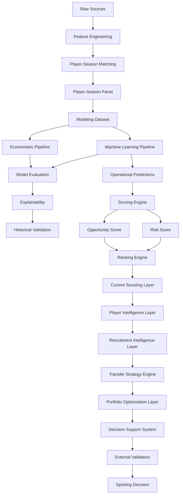

# 🏗️ Arquitectura del Sistema

## Visión general

La arquitectura del proyecto ha evolucionado desde un entorno exploratorio centrado en notebooks hacia una plataforma integral de Football Analytics orientada a scouting profesional, recruitment intelligence y soporte avanzado a decisiones deportivas.

La versión actual:

```text
v1.2.0 — Multi-League Expansion
```

implementa una arquitectura multicapa capaz de transformar información deportiva y económica procedente de múltiples competiciones europeas en recomendaciones accionables para departamentos deportivos profesionales.

La expansión desarrollada durante Sprint 13A incorpora una nueva dimensión metodológica orientada a evaluar explícitamente la capacidad de generalización y la validez externa de la metodología propuesta.

La arquitectura actual puede resumirse mediante:

```text
Fuentes de datos
↓
Feature Engineering
↓
Matching
↓
Player-Season Panel
↓
Modelización
↓
Opportunity Detection
↓
Risk Assessment
↓
Player Intelligence
↓
Recruitment Intelligence
↓
Transfer Strategy Engine
↓
Portfolio Optimization
↓
Decision Support System
↓
External Validation
```

---

## Estado actual

| Métrica                        |  Valor |
| ------------------------------ | -----: |
| Observaciones FBref procesadas | 43.591 |
| Dataset modelizable            |  5.527 |
| Ligas                          |     11 |
| Temporadas                     |      7 |
| Liga-temporada                 |     77 |
| Match Rate global              | 75,97% |

---

## Principios arquitectónicos

La arquitectura se ha diseñado siguiendo los siguientes principios:

* Modularidad.
* Reproducibilidad.
* Trazabilidad experimental.
* Separación de responsabilidades.
* Validación temporal.
* Interpretabilidad.
* Escalabilidad analítica.
* Orientación a negocio.
* Validez externa.
* Generalización multi-liga.

---

# 🧩 Arquitectura funcional actual



---

# 🏛️ Capas arquitectónicas

## 1. Data Layer

Responsable de la adquisición, limpieza y preparación de datos.

### Fuentes

* FBref.
* Transfermarkt.

### Responsabilidades

* Ingestión.
* Limpieza.
* Estandarización.
* Enriquecimiento.
* Generación de variables.

### Componentes

```text
src/data/
src/features/
```

---

### Cobertura actual

| Métrica             |  Valor |
| ------------------- | -----: |
| Ligas               |     11 |
| Temporadas          |      7 |
| Observaciones FBref | 43.591 |

---

## 2. Matching Layer

Responsable de la integración entre fuentes.

Objetivo:

```text
FBref ↔ Transfermarkt
```

---

### Metodología

* Exact Matching.
* Club Validation.
* Age Validation.
* Fuzzy Matching.

---

### Tecnología

```text
RapidFuzz
```

---

### Resultado Sprint 13A

| Métrica           |  Valor |
| ----------------- | -----: |
| Match Rate global | 75,97% |

---

### Interpretación

La reducción del match rate agregado respecto a releases anteriores se explica por la incorporación de competiciones secundarias con menor cobertura histórica disponible en Transfermarkt-Kaggle.

La evidencia obtenida durante Sprint 13A no apunta a degradación del algoritmo de matching.

---

## 3. Modeling Layer

Responsable de la construcción del dataset modelizable y entrenamiento de modelos.

### Componentes

```text
src/models/econometric/
src/models/machine_learning/
```

---

### Dataset modelizable actual

| Métrica       | Valor |
| ------------- | ----: |
| Observaciones | 5.527 |
| Ligas         |    11 |
| Temporadas    |     7 |

---

### Modelos implementados

#### Growth OLS Temporal

Benchmark econométrico principal.

Resultado Sprint 13A.1:

| Métrica |  Valor |
| ------- | -----: |
| RMSE    | 0.8689 |
| MAE     | 0.6989 |
| R²      | 0.5496 |

---

#### Tuned XGBoost

Modelo productivo de la plataforma.

Resultado Sprint 13A.1:

| Métrica |  Valor |
| ------- | -----: |
| RMSE    | 0.8525 |
| MAE     | 0.6834 |
| R²      | 0.5664 |

---

### Hallazgo metodológico

La expansión multi-liga produce simultáneamente:

* mayor cobertura;
* mayor representatividad;
* mejor rendimiento predictivo;
* mayor capacidad de generalización.

Este resultado constituye una evidencia favorable de validez externa para la metodología propuesta.

## 4. Historical Evaluation Layer

Responsable de la validación metodológica de modelos.

---

### Funciones

* Validación temporal.
* Comparación de algoritmos.
* Backtesting.
* Evaluación académica.
* Explainability.
* Robustness Checks.

---

### Outputs

```text
Predictions
Metrics
Feature Importance
SHAP Analysis
Model Comparison
```

---

### Resultado Sprint 13A.1

La capa de evaluación histórica deja de limitarse a un único universo competitivo.

Por primera vez los modelos son evaluados sobre:

```text
11 ligas europeas
```

permitiendo validar explícitamente la robustez de la metodología en contextos competitivos heterogéneos.

---

### Comparación principal

| Modelo              |   RMSE |    MAE |     R² |
| ------------------- | -----: | -----: | -----: |
| Growth OLS Temporal | 0.8689 | 0.6989 | 0.5496 |
| Tuned XGBoost       | 0.8525 | 0.6834 | 0.5664 |

---

## 5. External Validation Layer

Introducida durante Sprint 13A.

Objetivo:

Evaluar la capacidad de generalización del sistema mediante ampliación sistemática de cobertura competitiva.

---

### Pregunta metodológica

```text
¿La metodología mantiene su rendimiento
fuera del universo competitivo original?
```

---

### Componentes

#### Multi-League Expansion

Incorporación de:

* Championship
* Belgian Pro League
* Austrian Bundesliga
* Spanish Segunda División

---

#### Coverage Diagnostics

Auditoría automática de:

* Match Rate por liga.
* Match Rate por temporada.
* Cobertura efectiva.
* Calidad de integración.

---

#### Coverage Audit

Validación manual y analítica de observaciones no emparejadas.

---

### Resultado

La expansión multi-liga genera simultáneamente:

* mayor cobertura;
* mayor diversidad competitiva;
* mejor rendimiento predictivo.

---

### Contribución

Esta capa constituye una de las principales aportaciones metodológicas de la versión v1.2.0.

---

## 6. Current Scouting Layer

Responsable de separar evaluación histórica y explotación operativa.

---

### Funciones

* Predicción temporada vigente.
* Generación de rankings.
* Construcción de shortlists.
* Priorización de oportunidades.

---

### Outputs

```text
scouting_shortlist.csv
scouting_shortlist_with_risk.csv
```

---

### Universo actual

| Métrica               |     Valor |
| --------------------- | --------: |
| Observaciones scoring |       811 |
| Ligas                 |        11 |
| Temporada actual      | 2025-2026 |

---

## 7. Scoring Layer

Transforma predicciones en señales accionables.

---

### Componentes

```text
Inefficiency Score
Growth Score
Confidence Score
Opportunity Score
Risk Score
```

---

### Objetivo

Convertir predicciones en recomendaciones operativas para scouting.

---

### Flujo

```text
Predicted Value
↓
Market Mispricing
↓
Opportunity Score
↓
Risk Assessment
↓
Executive Ranking
```

---

## 8. Ranking Engine

Transforma scores en listas priorizadas de candidatos.

---

### Capacidades

* Rankings globales.
* Rankings por posición.
* Rankings por liga.
* Rankings por nivel de riesgo.
* Rankings ejecutivos.

---

### Resultado

```text
Scouting Shortlists
```

---

## 9. Player Intelligence Layer

Introducida durante Sprint 10.

Objetivo:

Transformar rankings en análisis individuales de jugadores.

---

### Componentes

#### Player Radar

Visualización multidimensional del perfil del jugador.

---

#### Positional Benchmarking

Comparación frente a jugadores equivalentes.

---

#### Opportunity vs Risk Matrix

Evaluación conjunta de potencial y riesgo.

---

#### Scouting Narrative

Interpretación automática de fortalezas y debilidades.

---

## 10. Recruitment Intelligence Layer

Introducida durante Sprint 11.

Objetivo:

Transformar análisis individuales en procesos operativos de recruitment.

---

### Recruitment Board

Permite:

* Construcción de shortlists.
* Selección múltiple.
* Gestión de candidatos.

---

### Candidate Selection System

Permite:

* Comparación simultánea.
* Priorización dinámica.
* Evaluación ejecutiva.

---

### Comparative Player Analysis

Comparación directa de:

* Opportunity Score.
* Risk Score.
* Confidence Score.
* Market Value.
* Predicted Value.
* Mispricing.

---

### Executive Scouting Workflow

```text
Opportunity Detection
↓
Filtering
↓
Shortlisting
↓
Comparative Analysis
↓
Recruitment Decision
```

---

## 11. Transfer Strategy Engine Layer

Introducida durante Sprint 14.

Objetivo:

Transformar recomendaciones individuales en estrategias completas de asignación de recursos bajo restricciones reales.

---

### Portfolio Dataset

Variables:

* Portfolio Cost.
* Future Asset Score.
* ROI Score.
* Executive Decision Score.

---

### Optimization Engine

Formulación:

```text
0-1 Knapsack Optimization
```

Implementación:

```text
PuLP
```

---

### Restricciones soportadas

* Presupuesto.
* Posiciones.
* Número máximo de fichajes.
* Perfil de riesgo.

---

### Scenario Simulator

Escenarios:

* Conservative.
* Balanced.
* Aggressive.

---

### Strategic Recruitment Engine

Capacidades:

* Configuración de presupuesto.
* Configuración de necesidades deportivas.
* Comparación de escenarios.
* Construcción automática de cartera óptima.

---

### Flujo operativo

```text
Recruitment Intelligence
↓
Portfolio Construction
↓
Scenario Optimization
↓
Transfer Strategy
↓
Sporting Decision
```

---

## 12. Decision Support System Layer

Consolidada durante Sprint 12.

Objetivo:

Facilitar la adopción operativa de resultados analíticos.

---

### Executive Dashboard

Aplicación principal:

```text
app/streamlit_app.py
```

---

### Componentes

#### Advanced Search Engine

Búsqueda por:

* jugador;
* club;
* liga;
* posición.

---

#### Player Intelligence

* benchmarking;
* comparativas;
* scouting reports.

---

#### Recruitment Intelligence

* filtros avanzados;
* shortlist management.

---

#### Strategic Recruitment

* portfolio builder;
* scenario comparison;
* transfer strategy engine.

---

#### Internationalization

Idiomas soportados:

* Español.
* Inglés.

---

# 🔄 Evolución arquitectónica

| Sprint       | Evolución                                         |
| ------------ | ------------------------------------------------- |
| Sprint 1     | Positional Normalization                          |
| Sprint 2     | Temporal Dynamics                                 |
| Sprint 3     | Composite Football Indices                        |
| Sprint 4     | Machine Learning                                  |
| Sprint 4C    | Explainability                                    |
| Sprint 5     | Scoring Engine                                    |
| Sprint 6     | Business Evaluation                               |
| Sprint 7     | Executive Dashboard                               |
| Sprint 9     | Decision Support Layer                            |
| Sprint 10    | Player Intelligence Layer                         |
| Sprint 11    | Recruitment Intelligence Layer                    |
| Sprint 12    | Productization & Internationalization             |
| Sprint 13A   | Multi-League Expansion                            |
| Sprint 13A.1 | External Validation Layer                         |
| Sprint 14    | Transfer Strategy Engine & Portfolio Optimization |

---

# 🖥️ Arquitectura física

```text
market-value-football-tfm/

├── app/
├── artifacts/
├── config/
├── data/
│   └── processed/
│       ├── fbref_features_v13a.parquet
│       ├── transfermarkt_features_v13a.parquet
│       ├── player_season_panel_v13a.parquet
│       ├── player_season_modeling_v13a.parquet
│       └── player_season_modeling_indices_v13a.parquet
│
├── docs/
├── mlruns/
├── notebooks/
├── reports/
│   ├── rankings/
│   ├── scouting_reports/
│   ├── data_quality/
│   ├── sprint_13a1/
│   └── portfolio/
│
├── src/
│   ├── data/
│   ├── features/
│   ├── models/
│   ├── strategy/
│   └── utils/
│
└── tests/
```

---

# 🏁 Conclusión

La arquitectura:

```text
v1.2.0 — Multi-League Expansion
```

consolida la evolución del proyecto desde un sistema de estimación de valor de mercado hacia una plataforma integral de Football Analytics orientada a scouting, recruitment y soporte avanzado a decisiones deportivas.

La incorporación sucesiva de las capas:

```text
Player Intelligence
↓
Recruitment Intelligence
↓
Transfer Strategy Engine
↓
Portfolio Optimization
↓
Decision Support System
↓
External Validation
```

permite transformar modelos predictivos en estrategias completas de captación de talento bajo restricciones reales de presupuesto, riesgo y necesidades deportivas.

Sprint 13A.1 aporta una contribución metodológica especialmente relevante.

La ampliación desde siete hasta once ligas produce simultáneamente:

* incremento de cobertura;
* incremento de representatividad;
* mejora predictiva;
* validación externa de la metodología.

Los resultados obtenidos:

| Modelo              |     R² |
| ------------------- | -----: |
| Growth OLS Temporal | 0.5496 |
| Tuned XGBoost       | 0.5664 |

sugieren que la metodología captura patrones estructurales del mercado de fichajes que permanecen estables a través de contextos competitivos distintos.

La arquitectura deja de responder únicamente a la pregunta:

```text
¿Qué jugador parece infravalorado?
```

para responder también:

```text
¿Puede una metodología de scouting cuantitativo
generalizar correctamente a distintos ecosistemas
competitivos europeos?
```

constituyendo la principal aportación metodológica de la release:

```text
v1.2.0 — Multi-League Expansion
```
