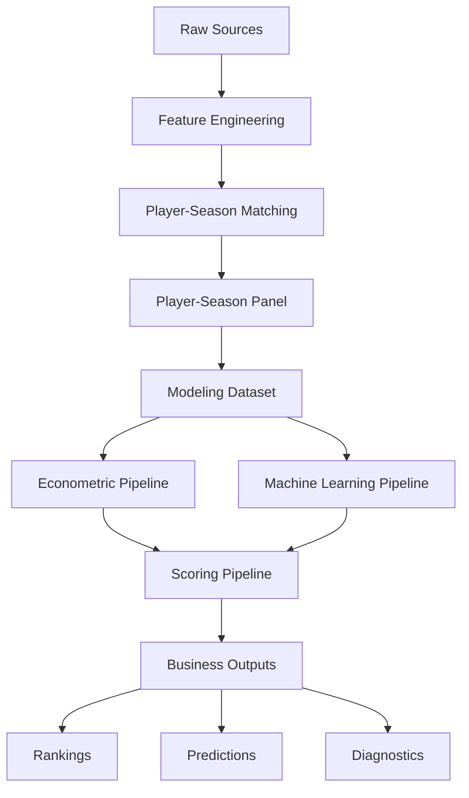
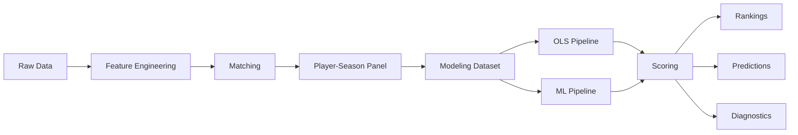

# 🏗️ Arquitectura del sistema

<div align="center">


</div>

---

# 📑 Tabla de contenidos

- [🧠 Visión general](#-visión-general)
- [🎯 Objetivos arquitectónicos](#-objetivos-arquitectónicos)
- [🔄 Evolución de arquitectura](#-evolución-de-arquitectura)
- [🏗️ Principios de diseño](#️-principios-de-diseño)
- [🧩 Arquitectura global del sistema](#-arquitectura-global-del-sistema)
- [📂 Estructura del repositorio](#-estructura-del-repositorio)
- [📦 Capas del sistema](#-capas-del-sistema)
- [📥 Data ingestion layer](#-data-ingestion-layer)
- [🧪 Feature engineering layer](#-feature-engineering-layer)
- [🔗 Matching layer](#-matching-layer)
- [📊 Modeling dataset layer](#-modeling-dataset-layer)
- [📈 Econometric modeling layer](#-econometric-modeling-layer)
- [🤖 Machine learning layer](#-machine-learning-layer)
- [💡 Scoring layer](#-scoring-layer)
- [📊 Evaluation layer](#-evaluation-layer)
- [📤 Outputs layer](#-outputs-layer)
- [🧠 Analytics engineering decisions](#-analytics-engineering-decisions)
- [⏳ Arquitectura de validación temporal](#-arquitectura-de-validación-temporal)
- [🛡️ Prevención de leakage](#️-prevención-de-leakage)
- [📂 Gestión de artefactos](#-gestión-de-artefactos)
- [⚙️ Configuración centralizada](#️-configuración-centralizada)
- [📈 Flujo end-to-end](#-flujo-end-to-end)
- [🚀 Escalabilidad futura](#-escalabilidad-futura)
- [🧠 Conclusión](#-conclusión)

---

# 🧠 Visión general

El proyecto desarrolla un sistema analítico modular orientado a identificar jugadores infravalorados en el mercado de fichajes europeo mediante técnicas de:

- econometría aplicada
- machine learning supervisado
- feature engineering deportivo
- analytics engineering

El sistema estima el valor de mercado esperado de futbolistas profesionales y detecta posibles ineficiencias de mercado utilizando datos deportivos y de mercado integrados desde múltiples fuentes.

---

# 🎯 Objetivos arquitectónicos

La arquitectura del sistema fue diseñada para resolver simultáneamente necesidades:

## Analíticas

- reproducibilidad
- robustez metodológica
- interpretabilidad
- evaluación temporal realista
- trazabilidad analítica

---

## Técnicas

- modularidad
- escalabilidad
- mantenibilidad
- desacoplamiento de componentes
- reutilización de pipelines

---

## Académicas

- transparencia metodológica
- replicabilidad del TFM
- separación clara entre fases CRISP-DM
- documentación técnica rigurosa

---

## Operativas

- generación automática de outputs
- persistencia de modelos
- rankings reproducibles
- capacidad de despliegue futuro

---

# 🔄 Evolución de arquitectura

El proyecto comenzó inicialmente como un entorno exploratorio basado principalmente en notebooks Jupyter.

La primera fase estuvo centrada en:

- exploración de datos
- validación de fuentes
- matching experimental
- análisis econométrico inicial

---

## Limitaciones del enfoque inicial

El enfoque notebook-centric generaba problemas de:

- reproducibilidad parcial
- duplicación de lógica
- dificultad de mantenimiento
- trazabilidad limitada
- escalabilidad reducida

---

## Evolución hacia arquitectura modular

El sistema evolucionó posteriormente hacia:

<pre>
pipeline modular reproducible
</pre>

La lógica del proyecto fue desacoplada progresivamente en:

- pipelines independientes
- módulos reutilizables
- capas funcionales
- outputs versionables

---

## Estado actual

Actualmente:

- los notebooks se utilizan como soporte analítico
- la ejecución principal reside en `src/`
- la validación está centralizada
- los modelos se persisten
- los outputs se generan automáticamente
- los pipelines son reproducibles

---

# 🏗️ Principios de diseño

La arquitectura sigue principios habituales de analytics engineering y sistemas analíticos productizables.

---

## 1️⃣ Modularidad

Cada componente del sistema tiene responsabilidades claramente separadas.

Ejemplos:

- ingesta
- matching
- modelización
- scoring
- evaluación

---

## 2️⃣ Reproducibilidad

Todo output debe poder reconstruirse mediante pipelines ejecutables.

La lógica principal no depende de notebooks manuales.

---

## 3️⃣ Separación de capas

Separación explícita entre:

<pre>
raw data
processed data
modeling data
artifacts
business outputs
</pre>

---

## 4️⃣ Validación temporal

La arquitectura prioriza escenarios realistas de generalización futura.

No se utilizan random splits.

---

## 5️⃣ Persistencia

Los modelos y outputs críticos se almacenan como artefactos reutilizables.

---

# 🧩 Arquitectura global del sistema



---

# 📂 Estructura del repositorio

```text
market-value-football-tfm/

├── artifacts/
│   ├── models/
│   ├── scalers/
│   ├── encoders/
│   ├── feature_importance/
│   └── predictions/
│
├── config/
│   ├── config.yaml
│   ├── modeling.yaml
│   ├── matching.yaml
│   ├── features.yaml
│   ├── paths.yaml
│   └── project.yaml
│
├── data/
│   ├── raw/
│   ├── interim/
│   ├── processed/
│   └── external/
│
├── docs/
│
├── notebooks/
│
├── reports/
│   ├── figures/
│   ├── tables/
│   ├── rankings/
│   ├── scouting_reports/
│   └── model_diagnostics/
│
├── src/
│   ├── data/
│   ├── features/
│   ├── models/
│   │   ├── econometric/
│   │   ├── machine_learning/
│   │   ├── scoring/
│   │   └── evaluation/
│   └── utils/
│
├── tests/
│
├── README.md
├── PROJECT_STATUS.md
├── requirements.txt
├── requirements-lock.txt
└── environment.yml
```

---

# 📦 Capas del sistema

La arquitectura se divide en varias capas desacopladas.

| Capa                 | Objetivo                   |
| -------------------- | -------------------------- |
| Ingestion            | Carga y parsing            |
| Feature Engineering  | Construcción de variables  |
| Matching             | Integración multi-fuente   |
| Modeling Dataset     | Dataset final analítico    |
| Econometric Modeling | Modelización interpretable |
| Machine Learning     | Extensión predictiva       |
| Scoring              | Detección de ineficiencias |
| Evaluation           | Métricas y comparación     |
| Outputs              | Rankings y artefactos      |

---

# 📥 Data ingestion layer

## Objetivo

Extraer y normalizar datos desde múltiples fuentes heterogéneas.

---

## Fuentes actuales

| Fuente        | Tipo        |
| ------------- | ----------- |
| FBref         | Rendimiento |
| Transfermarkt | Mercado     |

---

## Componentes principales

### FBref

<pre>
src/data/ingest_fbref.py
src/data/build_fbref_features.py
</pre>

---

### Transfermarkt

<pre>
src/data/ingest_transfermarkt.py
src/data/build_transfermarkt_features.py
</pre>

---

## Funcionalidades

* parsing HTML
* limpieza
* normalización
* validación
* generación parquet

---

# 🧪 Feature engineering layer

## Objetivo

Construir variables deportivas y contextuales utilizables por los modelos.

---

## Features actuales

### Rendimiento ofensivo

* goals_per90
* assists_per90
* g_a_per90

---

### Contexto

* age
* league
* season
* position_group

---

### Volumen de juego

* minutes_played
* log_minutes_played
* starts
* nineties

---

## Estado actual

El feature set actual representa un baseline sólido, aunque todavía limitado en señal predictiva avanzada.

---

## Próxima evolución

Pendiente incorporar:

* progression metrics
* percentile features
* z-scores por posición
* rolling metrics
* age curves
* market momentum
* trajectory features

---

# 🔗 Matching layer

## Objetivo

Integrar FBref y Transfermarkt sin identificador común.

---

## Problema principal

No existe una clave universal compartida entre ambas fuentes.

---

## Riesgos

* false positives
* false negatives
* ruido en modelos
* rankings incorrectos

---

## Estrategia implementada

Pipeline jerárquico:

1. normalización
2. matching exacto
3. validación club
4. matching fuzzy
5. validación edad

---

## Parámetros críticos

```python
MAX_AGE_DIFF = 1.5
MIN_CLUB_SCORE = 70
FUZZY_THRESHOLD = 92
```

---

## Resultado final

| Métrica                   | Resultado |
| ------------------------- | --------: |
| Match rate                |    88.36% |
| Observaciones emparejadas |    20,836 |

---

# 📊 Modeling dataset layer

## Objetivo

Construir el dataset final para modelización.

---

## Unidad de análisis

<pre>
Jugador – Temporada
</pre>

---

## Dataset final

| Métrica       | Valor |
| ------------- | ----: |
| Observaciones | 3,297 |
| Jugadores     | 1,847 |
| Edad          | 18–23 |

---

## Filtros aplicados

* matching válido
* edad válida
* minutos mínimos
* market value disponible
* posición válida

---

## Archivo principal

<pre>
data/processed/player_season_modeling.parquet
</pre>

---

# 📈 Econometric modeling layer

## Objetivo

Construir un modelo interpretable del valor de mercado.

---

## Arquitectura

<pre>
src/models/econometric/
</pre>

---

## Componentes

| Archivo             | Función              |
| ------------------- | -------------------- |
| specifications.py   | Fórmulas             |
| train_ols.py        | Entrenamiento        |
| run_ols_pipeline.py | Ejecución end-to-end |

---

## Modelo final

OLS con:

* league FE
* season FE
* position FE
* HC3 robust covariance

---

## Variable objetivo

```python
log_market_value_eur
```

---

## Resultados actuales

| Métrica | Resultado |
| ------- | --------: |
| R²      |      0.44 |
| MAE     |      0.79 |
| RMSE    |      0.98 |

---

## Justificación

El modelo econométrico actúa como núcleo principal del sistema debido a:

* interpretabilidad
* estabilidad
* robustez
* explicabilidad económica

---

# 🤖 Machine learning layer

## Objetivo

Evaluar capacidad predictiva adicional frente al modelo econométrico.

---

## Arquitectura

<pre>
src/models/machine_learning/
</pre>

---

## Modelos implementados

* Random Forest
* Gradient Boosting
* HistGradientBoosting

---

## Funcionalidades

* preprocessing pipeline
* one-hot encoding
* temporal validation
* feature importance
* model persistence

---

## Resultados actuales

| Modelo            |   R² |
| ----------------- | ---: |
| OLS final         | 0.44 |
| Gradient Boosting | 0.48 |

---

## Insight principal

La mejora moderada de ML respecto a OLS sugiere que:

<pre>
el principal cuello de botella es el signal del dataset
</pre>

y no necesariamente el algoritmo.

---

# 💡 Scoring layer

## Objetivo

Transformar predicciones en outputs accionables para scouting.

---

## Arquitectura

<pre>
src/models/scoring/
</pre>

---

## Componentes

| Archivo         | Función            |
| --------------- | ------------------ |
| inefficiency.py | Inefficiency Score |
| rankings.py     | Rankings scouting  |

---

## Fórmula conceptual

```python
inefficiency_score =
valor_estimado - valor_observado
```

---

## Outputs

* infravalorados
* sobrevalorados
* rankings por liga
* rankings por posición

---

# 📊 Evaluation layer

## Objetivo

Centralizar métricas y comparación de modelos.

---

## Arquitectura

<pre>
src/models/evaluation/
</pre>

---

## Componentes

| Archivo               | Función               |
| --------------------- | --------------------- |
| metrics.py            | Métricas              |
| feature_importance.py | Importancia variables |
| model_comparison.py   | Comparativa modelos   |

---

## Métricas utilizadas

* RMSE
* MAE
* R²

---

# 📤 Outputs layer

## Objetivo

Generar outputs analíticos reproducibles.

---

## Directorios principales

### Reports

<pre>
reports/
</pre>

---

### Artifacts

<pre>
artifacts/
</pre>

---

## Outputs generados

* rankings scouting
* métricas
* predicciones
* feature importance
* diagnósticos
* modelos persistidos

---

# 🧠 Analytics engineering decisions

## Separación entre capas

Se evita mezclar:

* datos crudos
* lógica analítica
* outputs
* artefactos

---

## Configuración desacoplada

Los parámetros críticos se almacenan en:

<pre>
config/
</pre>

---

## Outputs reproducibles

Todos los outputs relevantes son regenerables mediante pipelines.

---

## Persistencia

Los modelos se almacenan en:

<pre>
artifacts/models/
</pre>

---

# ⏳ Arquitectura de validación temporal

## Estrategia

| Split | Temporadas  |
| ----- | ----------- |
| Train | ≤ 2023-2024 |
| Test  | 2024-2025   |

---

## Justificación

No se utiliza random split porque:

* rompe coherencia temporal
* introduce leakage
* sobreestima generalización

---

## Objetivo

Simular escenarios reales de scouting futuro.

---

# 🛡️ Prevención de leakage

La arquitectura controla explícitamente:

* variables futuras
* target leakage
* leakage temporal
* leakage entre splits

---

## Variables excluidas

Ejemplos:

* market_value_next_eur
* delta_log_market_value_1y

---

## Principio general

Todo feature debe existir en el momento temporal de decisión.

---

# 📂 Gestión de artefactos

## Objetivo

Persistir outputs críticos reutilizables.

---

## Artefactos almacenados

* modelos
* predicciones
* feature importance
* scalers
* encoders

---

## Beneficios

* reproducibilidad
* comparación entre ejecuciones
* scoring posterior
* despliegue futuro

---

# ⚙️ Configuración centralizada

## Objetivo

Separar configuración y lógica de negocio.

---

## Directorio

<pre>
config/
</pre>

---

## Configuración actual

| Archivo       | Uso                   |
| ------------- | --------------------- |
| matching.yaml | Matching              |
| features.yaml | Features              |
| modeling.yaml | Modelización          |
| paths.yaml    | Paths                 |
| project.yaml  | Configuración general |

---

# 📈 Flujo end-to-end



---

# 🚀 Escalabilidad futura

La arquitectura actual permite incorporar fácilmente:

* nuevas ligas
* nuevas temporadas
* nuevas fuentes
* métricas avanzadas
* dashboards
* APIs
* automatización

---

## Próximas prioridades

### Feature engineering avanzado

* progression metrics
* percentile features
* z-scores
* rolling metrics
* growth indicators

---

### Integración futura

* Understat
* StatsBomb Open Data

---

### Business layer

* scouting reports automáticos
* dashboard interactivo
* Growth Score

---

# 🧠 Conclusión

El proyecto ha evolucionado desde un enfoque exploratorio basado en notebooks hacia un sistema analítico modular reproducible alineado con principios de:

* analytics engineering
* sports analytics
* econometría aplicada
* machine learning supervisado

La arquitectura actual permite:

* reproducibilidad
* trazabilidad
* mantenibilidad
* escalabilidad
* validación rigurosa
* generación automática de outputs

El sistema constituye una base sólida tanto para el Trabajo Fin de Máster como para una posible evolución futura hacia herramientas reales de scouting cuantitativo profesional.
