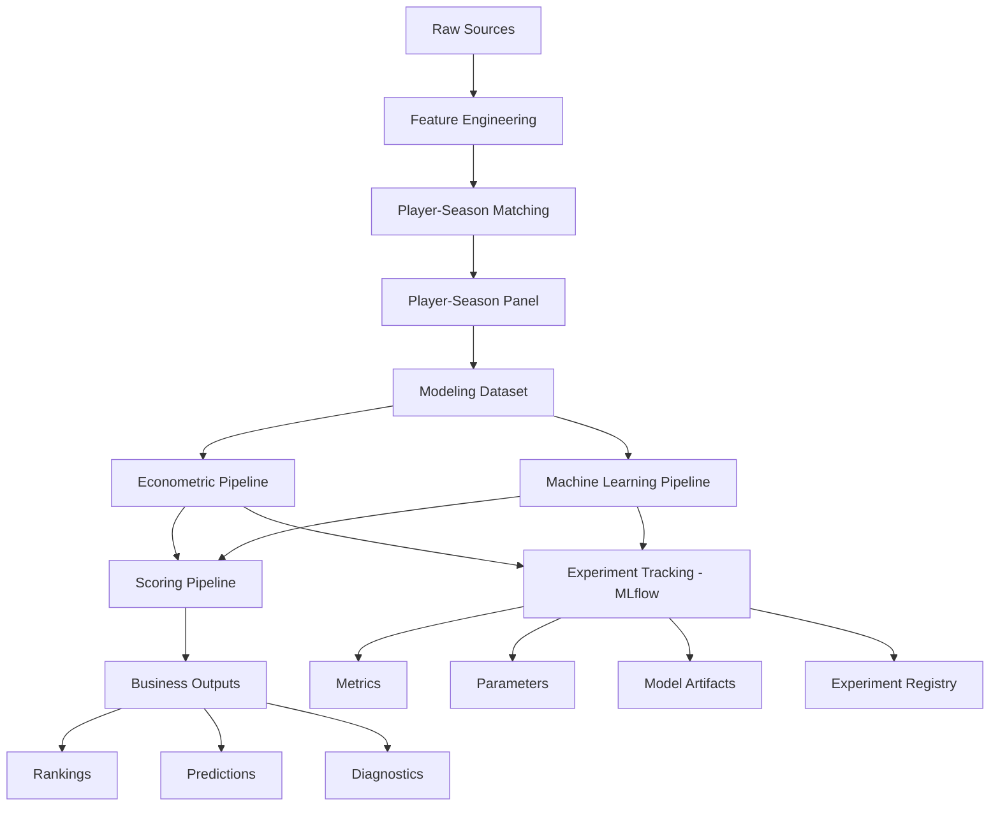
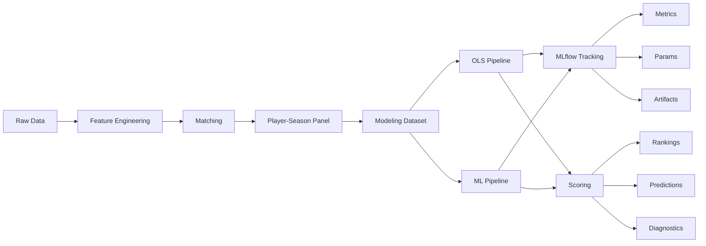

# 🏗️ Arquitectura del sistema

<div align="center">


</div>

---

# 📑 Tabla de contenidos

- [🧠 Visión general](#-visión-general)
- [🎯 Objetivos arquitectónicos](#-objetivos-arquitectónicos)
- [🔄 Evolución de arquitectura](#-evolución-de-arquitectura)
- [🏗️ Principios de diseño](#️-principios-de-diseño)
- [🧩 Arquitectura global del sistema](#-arquitectura-global-del-sistema)
- [📂 Estructura del repositorio](#-estructura-del-repositorio)
- [📦 Capas del sistema](#-capas-del-sistema)
- [📥 Data ingestion layer](#-data-ingestion-layer)
- [🧪 Feature engineering layer](#-feature-engineering-layer)
- [🔗 Matching layer](#-matching-layer)
- [📊 Modeling dataset layer](#-modeling-dataset-layer)
- [📈 Econometric modeling layer](#-econometric-modeling-layer)
- [🤖 Machine learning layer](#-machine-learning-layer)
- [🧪 Experiment tracking layer](#-experiment-tracking-layer)
- [💡 Scoring layer](#-scoring-layer)
- [📊 Evaluation layer](#-evaluation-layer)
- [📤 Outputs layer](#-outputs-layer)
- [🧠 Analytics engineering decisions](#-analytics-engineering-decisions)
- [⏳ Arquitectura de validación temporal](#-arquitectura-de-validación-temporal)
- [🛡️ Prevención de leakage](#️-prevención-de-leakage)
- [📂 Gestión de artefactos](#-gestión-de-artefactos)
- [⚙️ Configuración centralizada](#️-configuración-centralizada)
- [📝 Logging del sistema](#-logging-del-sistema)
- [📈 Flujo end-to-end](#-flujo-end-to-end)
- [🚀 Escalabilidad futura](#-escalabilidad-futura)
- [🧠 Conclusión](#-conclusión)

---

# 🧠 Visión general

El proyecto desarrolla un sistema analítico modular orientado a identificar jugadores infravalorados en el mercado de fichajes europeo mediante técnicas de:

- econometría aplicada
- machine learning supervisado
- feature engineering deportivo
- analytics engineering
- experiment tracking
- configuración centralizada

El sistema estima el valor de mercado esperado de futbolistas profesionales y detecta posibles ineficiencias de mercado utilizando datos deportivos y de mercado integrados desde múltiples fuentes.

La arquitectura actual no se limita a ejecutar modelos desde notebooks, sino que organiza el proyecto como un sistema analítico reproducible, trazable y extensible. Esto permite regenerar datasets, entrenar modelos, registrar experimentos, persistir artefactos y producir outputs de negocio de forma controlada.

---

# 🎯 Objetivos arquitectónicos

La arquitectura del sistema fue diseñada para resolver simultáneamente necesidades:

## Analíticas

- reproducibilidad
- robustez metodológica
- interpretabilidad
- evaluación temporal realista
- trazabilidad analítica
- comparación rigurosa entre experimentos

---

## Técnicas

- modularidad
- escalabilidad
- mantenibilidad
- desacoplamiento de componentes
- reutilización de pipelines
- configuración externa al código
- logging y tracking de ejecuciones

---

## Académicas

- transparencia metodológica
- replicabilidad del TFM
- separación clara entre fases CRISP-DM
- documentación técnica rigurosa
- justificación trazable de decisiones de modelización

---

## Operativas

- generación automática de outputs
- persistencia de modelos
- rankings reproducibles
- capacidad de despliegue futuro
- trazabilidad de experimentos mediante MLflow
- posibilidad de auditar versiones de modelos y configuraciones

---

# 🔄 Evolución de arquitectura

El proyecto comenzó inicialmente como un entorno exploratorio basado principalmente en notebooks Jupyter.

La primera fase estuvo centrada en:

- exploración de datos
- validación de fuentes
- matching experimental
- análisis econométrico inicial

---

## Limitaciones del enfoque inicial

El enfoque notebook-centric generaba problemas de:

- reproducibilidad parcial
- duplicación de lógica
- dificultad de mantenimiento
- trazabilidad limitada
- escalabilidad reducida
- dificultad para comparar ejecuciones
- pérdida potencial de información sobre hiperparámetros y configuraciones

---

## Evolución hacia arquitectura modular

El sistema evolucionó posteriormente hacia:

<pre>
pipeline modular reproducible
</pre>

La lógica del proyecto fue desacoplada progresivamente en:

- pipelines independientes
- módulos reutilizables
- capas funcionales
- outputs versionables
- configuración YAML centralizada
- registro experimental con MLflow

---

## Estado actual

Actualmente:

- los notebooks se utilizan como soporte analítico
- la ejecución principal reside en `src/`
- la validación está centralizada
- los modelos se persisten
- los outputs se generan automáticamente
- los pipelines son reproducibles
- los experimentos quedan registrados mediante MLflow
- los parámetros críticos se gestionan desde `config/`
- los logs de ejecución se almacenan de forma separada

---

# 🏗️ Principios de diseño

La arquitectura sigue principios habituales de analytics engineering y sistemas analíticos productizables.

---

## 1️⃣ Modularidad

Cada componente del sistema tiene responsabilidades claramente separadas.

Ejemplos:

- ingesta
- matching
- modelización
- scoring
- evaluación
- tracking experimental
- configuración

---

## 2️⃣ Reproducibilidad

Todo output debe poder reconstruirse mediante pipelines ejecutables.

La lógica principal no depende de notebooks manuales.

La reproducibilidad se refuerza mediante:

- configuración centralizada
- persistencia de modelos
- outputs deterministas
- registro de métricas
- almacenamiento de parámetros experimentales
- tracking de artefactos con MLflow

---

## 3️⃣ Separación de capas

Separación explícita entre:

<pre>
raw data
processed data
modeling data
artifacts
business outputs
experiment tracking
logs
configuration
</pre>

---

## 4️⃣ Validación temporal

La arquitectura prioriza escenarios realistas de generalización futura.

No se utilizan random splits.

---

## 5️⃣ Persistencia

Los modelos y outputs críticos se almacenan como artefactos reutilizables.

La persistencia incluye:

- modelos entrenados
- predicciones
- feature importance
- rankings
- métricas
- artefactos registrados en MLflow

---

## 6️⃣ Trazabilidad experimental

Cada ejecución relevante debe poder asociarse a:

- dataset utilizado
- features empleadas
- parámetros de configuración
- modelo entrenado
- métricas obtenidas
- artefactos generados
- fecha de ejecución

---

# 🧩 Arquitectura global del sistema



---

# 📂 Estructura del repositorio

```text
market-value-football-tfm/

├── artifacts/
│   ├── models/
│   ├── scalers/
│   ├── encoders/
│   ├── feature_importance/
│   └── predictions/
│
├── config/
│   ├── config.yaml
│   ├── modeling.yaml
│   ├── matching.yaml
│   ├── features.yaml
│   ├── paths.yaml
│   └── project.yaml
│
├── data/
│   ├── raw/
│   ├── interim/
│   ├── processed/
│   └── external/
│
├── docs/
│   ├── architecture.md
│   ├── data_dictionary.md
│   ├── data_quality.md
│   ├── data_sources.md
│   ├── feature_engineering_plan.md
│   ├── modeling_decisions.md
│   ├── pipeline_reference.md
│   ├── README.md
│   └── schema_decisions.md
│
├── logs/
│
├── mlruns/
│
├── notebooks/
│
├── reports/
│   ├── figures/
│   ├── tables/
│   ├── rankings/
│   ├── scouting_reports/
│   └── model_diagnostics/
│
├── src/
│   ├── data/
│   ├── features/
│   ├── models/
│   │   ├── econometric/
│   │   ├── machine_learning/
│   │   ├── scoring/
│   │   └── evaluation/
│   └── utils/
│
├── tests/
│
├── README.md
├── PROJECT_STATUS.md
├── requirements.txt
├── requirements-lock.txt
└── environment.yml
```

---

# 📦 Capas del sistema

La arquitectura se divide en varias capas desacopladas.

| Capa                 | Objetivo                                      |
| -------------------- | --------------------------------------------- |
| Ingestion            | Carga y parsing                               |
| Feature Engineering  | Construcción de variables                     |
| Matching             | Integración multi-fuente                      |
| Modeling Dataset     | Dataset final analítico                       |
| Econometric Modeling | Modelización interpretable                    |
| Machine Learning     | Extensión predictiva                          |
| Experiment Tracking  | Registro de métricas, parámetros y artefactos |
| Scoring              | Detección de ineficiencias                    |
| Evaluation           | Métricas y comparación                        |
| Outputs              | Rankings y artefactos                         |
| Configuration        | Gestión centralizada de parámetros            |
| Logging              | Trazabilidad de ejecución                     |

---

# 📥 Data ingestion layer

## Objetivo

Extraer y normalizar datos desde múltiples fuentes heterogéneas.

---

## Fuentes actuales

| Fuente        | Tipo        |
| ------------- | ----------- |
| FBref         | Rendimiento |
| Transfermarkt | Mercado     |

---

## Componentes principales

### FBref

<pre>
src/data/ingest_fbref.py
src/data/build_fbref_features.py
</pre>

---

### Transfermarkt

<pre>
src/data/ingest_transfermarkt.py
src/data/build_transfermarkt_features.py
</pre>

---

## Funcionalidades

* parsing HTML
* limpieza
* normalización
* validación
* generación parquet

---

## Relación con configuración

Los paths de entrada y salida se gestionan desde:

<pre>
config/paths.yaml
</pre>

Esto permite evitar rutas hardcodeadas y facilita la ejecución reproducible en distintos entornos.

---

# 🧪 Feature engineering layer

## Objetivo

Construir variables deportivas y contextuales utilizables por los modelos.

---

## Features actuales

### Rendimiento ofensivo

* goals_per90
* assists_per90
* g_a_per90

---

### Contexto

* age
* league
* season
* position_group

---

### Volumen de juego

* minutes_played
* log_minutes_played
* starts
* nineties

---

## Estado actual

El feature set actual representa un baseline sólido, aunque todavía limitado en señal predictiva avanzada.

---

## Próxima evolución

Pendiente incorporar:

* progression metrics
* percentile features
* z-scores por posición
* rolling metrics
* age curves
* market momentum
* trajectory features

---

## Relación con configuración

La configuración de variables, grupos de features y transformaciones previstas se centraliza en:

<pre>
config/features.yaml
</pre>

Esto permitirá activar o desactivar bloques de features sin modificar la lógica principal del pipeline.

---

# 🔗 Matching layer

## Objetivo

Integrar FBref y Transfermarkt sin identificador común.

---

## Problema principal

No existe una clave universal compartida entre ambas fuentes.

---

## Riesgos

* false positives
* false negatives
* ruido en modelos
* rankings incorrectos

---

## Estrategia implementada

Pipeline jerárquico:

1. normalización
2. matching exacto
3. validación club
4. matching fuzzy
5. validación edad

---

## Parámetros críticos

```python
MAX_AGE_DIFF = 1.5
MIN_CLUB_SCORE = 70
FUZZY_THRESHOLD = 92
```

---

## Configuración

Los parámetros críticos de matching se externalizan en:

<pre>
config/matching.yaml
</pre>

---

## Resultado final

| Métrica                   | Resultado |
| ------------------------- | --------: |
| Match rate                |    88.36% |
| Observaciones emparejadas |    20,836 |

---

# 📊 Modeling dataset layer

## Objetivo

Construir el dataset final para modelización.

---

## Unidad de análisis

<pre>
Jugador – Temporada
</pre>

---

## Dataset final

| Métrica       | Valor |
| ------------- | ----: |
| Observaciones | 3,297 |
| Jugadores     | 1,847 |
| Edad          | 18–23 |

---

## Filtros aplicados

* matching válido
* edad válida
* minutos mínimos
* market value disponible
* posición válida

---

## Archivo principal

<pre>
data/processed/player_season_modeling.parquet
</pre>

---

## Relación con trazabilidad experimental

El dataset final constituye la entrada común para:

* pipeline econométrico
* pipeline ML
* scoring
* evaluación

En fases posteriores, cada ejecución deberá registrar en MLflow información relativa a:

* dataset utilizado
* número de observaciones
* temporada de train/test
* features activas
* filtros aplicados

---

# 📈 Econometric modeling layer

## Objetivo

Construir un modelo interpretable del valor de mercado.

---

## Arquitectura

<pre>
src/models/econometric/
</pre>

---

## Componentes

| Archivo             | Función              |
| ------------------- | -------------------- |
| specifications.py   | Fórmulas             |
| train_ols.py        | Entrenamiento        |
| run_ols_pipeline.py | Ejecución end-to-end |

---

## Modelo final

OLS con:

* league FE
* season FE
* position FE
* HC3 robust covariance

---

## Variable objetivo

```python
log_market_value_eur
```

---

## Resultados actuales

| Métrica | Resultado |
| ------- | --------: |
| R²      |      0.44 |
| MAE     |      0.79 |
| RMSE    |      0.98 |

---

## Justificación

El modelo econométrico actúa como núcleo principal del sistema debido a:

* interpretabilidad
* estabilidad
* robustez
* explicabilidad económica

---

## Relación con MLflow

El pipeline econométrico registra:

* nombre del experimento
* especificación del modelo
* variable objetivo
* variables explicativas
* fixed effects
* métricas out-of-sample
* artefactos generados
* rankings derivados cuando corresponda

---

# 🤖 Machine learning layer

## Objetivo

Evaluar capacidad predictiva adicional frente al modelo econométrico.

---

## Arquitectura

<pre>
src/models/machine_learning/
</pre>

---

## Modelos implementados

* Random Forest
* Gradient Boosting
* HistGradientBoosting

---

## Funcionalidades

* preprocessing pipeline
* one-hot encoding
* temporal validation
* feature importance
* model persistence
* experiment tracking

---

## Resultados actuales

| Modelo            |   R² |
| ----------------- | ---: |
| OLS final         | 0.44 |
| Gradient Boosting | 0.48 |

---

## Insight principal

La mejora moderada de ML respecto a OLS sugiere que:

<pre>
el principal cuello de botella es el signal del dataset
</pre>

y no necesariamente el algoritmo.

---

## Relación con MLflow

El pipeline ML registra:

* tipo de modelo
* hiperparámetros
* features utilizadas
* split temporal
* métricas de evaluación
* feature importance
* modelo serializado
* predicciones out-of-sample

---

# 🧪 Experiment tracking layer

## Objetivo

Garantizar trazabilidad completa de los experimentos de modelización.

La capa de experiment tracking se implementa mediante:

<pre>
MLflow
</pre>

---

## Directorio principal

<pre>
mlruns/
</pre>

---

## Información registrada

### Parámetros

* modelo entrenado
* hiperparámetros
* features utilizadas
* target
* fixed effects
* split temporal
* configuración aplicada

---

### Métricas

* MAE
* RMSE
* R²

---

### Artefactos

* modelos persistidos
* predicciones
* feature importance
* rankings
* métricas exportadas
* diagnósticos

---

## Beneficios

MLflow mejora:

* reproducibilidad
* comparabilidad entre modelos
* auditoría metodológica
* trazabilidad de decisiones
* defensa académica
* transición futura hacia despliegue

---

## Decisión metodológica

MLflow no sustituye a los outputs del repositorio.

Su función es complementar la arquitectura mediante un registro estructurado de experimentos, manteniendo separación entre:

| Elemento                | Directorio   |
| ----------------------- | ------------ |
| Artefactos del proyecto | `artifacts/` |
| Reports finales         | `reports/`   |
| Tracking experimental   | `mlruns/`    |
| Logs operativos         | `logs/`      |

---

# 💡 Scoring layer

## Objetivo

Transformar predicciones en outputs accionables para scouting.

---

## Arquitectura

<pre>
src/models/scoring/
</pre>

---

## Componentes

| Archivo         | Función            |
| --------------- | ------------------ |
| inefficiency.py | Inefficiency Score |
| rankings.py     | Rankings scouting  |

---

## Fórmula conceptual

```python
inefficiency_score =
valor_estimado - valor_observado
```

---

## Outputs

* infravalorados
* sobrevalorados
* rankings por liga
* rankings por posición

---

## Relación con experiment tracking

Los outputs de scoring pueden registrarse como artefactos de MLflow cuando derivan de un experimento concreto.

Esto permite vincular un ranking de scouting con:

* modelo que lo generó
* fecha de ejecución
* variables utilizadas
* métricas del modelo
* configuración de scoring

---

# 📊 Evaluation layer

## Objetivo

Centralizar métricas y comparación de modelos.

---

## Arquitectura

<pre>
src/models/evaluation/
</pre>

---

## Componentes

| Archivo               | Función               |
| --------------------- | --------------------- |
| metrics.py            | Métricas              |
| feature_importance.py | Importancia variables |
| model_comparison.py   | Comparativa modelos   |

---

## Métricas utilizadas

* RMSE
* MAE
* R²

---

## Relación con MLflow

Las métricas calculadas por la capa de evaluación se registran en MLflow para permitir comparación entre ejecuciones.

Esto permite responder preguntas como:

* qué modelo obtuvo mejor RMSE
* qué configuración mejoró el R²
* qué features aportaron más señal
* qué experimento generó un ranking determinado

---

# 📤 Outputs layer

## Objetivo

Generar outputs analíticos reproducibles.

---

## Directorios principales

### Reports

<pre>
reports/
</pre>

---

### Artifacts

<pre>
artifacts/
</pre>

---

### MLflow

<pre>
mlruns/
</pre>

---

### Logs

<pre>
logs/
</pre>

---

## Outputs generados

* rankings scouting
* métricas
* predicciones
* feature importance
* diagnósticos
* modelos persistidos
* experimentos registrados
* logs de ejecución

---

# 🧠 Analytics engineering decisions

## Separación entre capas

Se evita mezclar:

* datos crudos
* lógica analítica
* outputs
* artefactos
* configuración
* tracking experimental

---

## Configuración desacoplada

Los parámetros críticos se almacenan en:

<pre>
config/
</pre>

---

## Outputs reproducibles

Todos los outputs relevantes son regenerables mediante pipelines.

---

## Persistencia

Los modelos se almacenan en:

<pre>
artifacts/models/
</pre>

---

## Tracking experimental

Los experimentos se registran en:

<pre>
mlruns/
</pre>

---

## Logging operativo

Los logs de ejecución se almacenan en:

<pre>
logs/
</pre>

---

## Decisión clave

El sistema diferencia entre:

| Concepto     | Función                          |
| ------------ | -------------------------------- |
| `config/`    | Parámetros y configuración       |
| `src/`       | Lógica funcional                 |
| `data/`      | Datasets                         |
| `artifacts/` | Modelos y artefactos persistidos |
| `reports/`   | Outputs analíticos finales       |
| `mlruns/`    | Registro de experimentos         |
| `logs/`      | Trazabilidad operativa           |

---

# ⏳ Arquitectura de validación temporal

## Estrategia

| Split | Temporadas  |
| ----- | ----------- |
| Train | ≤ 2023-2024 |
| Test  | 2024-2025   |

---

## Justificación

No se utiliza random split porque:

* rompe coherencia temporal
* introduce leakage
* sobreestima generalización

---

## Objetivo

Simular escenarios reales de scouting futuro.

---

## Relación con configuración

La definición del split temporal se centraliza en:

<pre>
config/modeling.yaml
</pre>

Esto permite modificar el esquema de validación sin alterar el código de entrenamiento.

---

## Relación con MLflow

Cada experimento debe registrar:

* temporada de entrenamiento
* temporada de test
* criterio de partición
* tamaño de train
* tamaño de test

---

# 🛡️ Prevención de leakage

La arquitectura controla explícitamente:

* variables futuras
* target leakage
* leakage temporal
* leakage entre splits
* contaminación entre outputs y features

---

## Variables excluidas

Ejemplos:

* market_value_next_eur
* delta_log_market_value_1y

---

## Principio general

Todo feature debe existir en el momento temporal de decisión.

---

## Separación de outputs

Las variables generadas por los modelos no deben volver al dataset base como inputs.

Ejemplos:

* predicted_market_value_eur
* inefficiency_score
* market_value_gap_eur
* rankings

Estas variables pertenecen a:

<pre>
reports/
artifacts/
mlruns/
</pre>

pero no al dataset base de modelización.

---

# 📂 Gestión de artefactos

## Objetivo

Persistir outputs críticos reutilizables.

---

## Artefactos almacenados

* modelos
* predicciones
* feature importance
* scalers
* encoders

---

## Beneficios

* reproducibilidad
* comparación entre ejecuciones
* scoring posterior
* despliegue futuro

---

## Artefactos locales vs MLflow

El proyecto mantiene dos niveles de persistencia:

| Nivel                     | Directorio   | Uso                                        |
| ------------------------- | ------------ | ------------------------------------------ |
| Artefactos operativos     | `artifacts/` | Reutilización directa en el proyecto       |
| Artefactos experimentales | `mlruns/`    | Trazabilidad y comparación de experimentos |

---

# ⚙️ Configuración centralizada

## Objetivo

Separar configuración y lógica de negocio.

---

## Directorio

<pre>
config/
</pre>

---

## Configuración actual

| Archivo       | Uso                                |
| ------------- | ---------------------------------- |
| config.yaml   | Configuración general agregada     |
| matching.yaml | Matching                           |
| features.yaml | Features                           |
| modeling.yaml | Modelización                       |
| paths.yaml    | Paths                              |
| project.yaml  | Configuración general del proyecto |

---

## Beneficios

La configuración centralizada permite:

* reducir hardcoding
* facilitar experimentación
* mejorar mantenibilidad
* parametrizar pipelines
* documentar decisiones
* versionar cambios metodológicos

---

## Relación con MLflow

Las configuraciones relevantes pueden registrarse como parámetros o artefactos de MLflow.

Esto permite reconstruir qué configuración produjo cada resultado.

---

## Decisión metodológica

La configuración no debe contener lógica compleja.

Su función es declarar parámetros, rutas, filtros y opciones de ejecución que el código consume de manera controlada.

---

# 📝 Logging del sistema

## Objetivo

Registrar información operativa de ejecución para facilitar debugging, auditoría y mantenimiento.

---

## Directorio

<pre>
logs/
</pre>

---

## Uso previsto

Los logs permiten registrar:

* inicio y fin de pipelines
* paths utilizados
* número de filas procesadas
* errores controlados
* métricas de ejecución
* advertencias relevantes

---

## Diferencia entre logs y MLflow

| Elemento  | Uso                                            |
| --------- | ---------------------------------------------- |
| `logs/`   | Trazabilidad operativa y debugging             |
| `mlruns/` | Tracking experimental y comparación de modelos |

---

## Decisión arquitectónica

Los logs no sustituyen a MLflow.

Ambos componentes son complementarios:

* logs explican qué ocurrió durante una ejecución
* MLflow registra qué resultado analítico produjo esa ejecución

---

# 📈 Flujo end-to-end



---

# 🚀 Escalabilidad futura

La arquitectura actual permite incorporar fácilmente:

* nuevas ligas
* nuevas temporadas
* nuevas fuentes
* métricas avanzadas
* dashboards
* APIs
* automatización
* nuevos modelos
* nuevos experimentos trackeados
* comparación sistemática de modelos
* despliegue controlado de modelos versionados

---

## Próximas prioridades

### Feature engineering avanzado

* progression metrics
* percentile features
* z-scores
* rolling metrics
* growth indicators

---

### Integración futura

* Understat
* StatsBomb Open Data

---

### Modelización futura

* CatBoost
* TabPFN
* modelos con mayor capacidad no lineal
* modelos específicos por posición
* modelos con features longitudinales

---

### Explainability

* SHAP global
* SHAP individual
* explicación de rankings
* estabilidad de variables

---

### Business layer

* scouting reports automáticos
* dashboard interactivo
* Growth Score
* Opportunity Score

---

# 🧠 Conclusión

El proyecto ha evolucionado desde un enfoque exploratorio basado en notebooks hacia un sistema analítico modular reproducible alineado con principios de:

* analytics engineering
* sports analytics
* econometría aplicada
* machine learning supervisado
* experiment tracking
* configuración centralizada

La arquitectura actual permite:

* reproducibilidad
* trazabilidad
* mantenibilidad
* escalabilidad
* validación rigurosa
* generación automática de outputs
* comparación sistemática de experimentos
* persistencia de modelos y artefactos

La incorporación de MLflow y configuración YAML supone un salto metodológico importante, porque convierte el proyecto en un entorno experimental auditable y más cercano a una práctica profesional de Data Science.

El sistema constituye una base sólida tanto para el Trabajo Fin de Máster como para una posible evolución futura hacia herramientas reales de scouting cuantitativo profesional.
