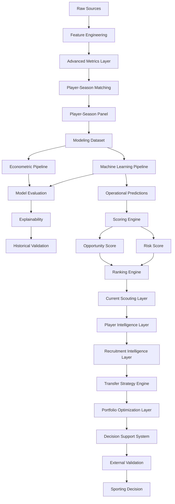

# 🏗️ Arquitectura del Sistema

## Visión general

La arquitectura del proyecto ha evolucionado desde un entorno exploratorio centrado en notebooks hacia una plataforma integral de Football Analytics orientada a scouting profesional, recruitment intelligence y soporte avanzado a decisiones deportivas.

La versión actual:

```text
v1.2.1 — Advanced Data Expansion
```

implementa una arquitectura multicapa capaz de transformar información deportiva y económica procedente de múltiples competiciones europeas en recomendaciones accionables para departamentos deportivos profesionales.

Tras la expansión competitiva desarrollada durante Sprint 13A, Sprint 13B incorpora una nueva capa metodológica orientada a integrar métricas avanzadas derivadas de FBref dentro del pipeline de modelización.

La arquitectura actual puede resumirse mediante:

```text
Data
↓
Modeling
↓
Scoring
↓
Player Intelligence
↓
Recruitment Intelligence
↓
Transfer Strategy Engine
↓
Decision Support System
↓
Sporting Decision
```

---

## Estado actual

| Métrica                        |  Valor |
| ------------------------------ | -----: |
| Observaciones FBref procesadas | 43.591 |
| Dataset modelizable            |  5.527 |
| Ligas                          |     11 |
| Temporadas                     |      7 |
| Liga-temporada                 |     77 |
| Match Rate global              | 75,97% |

---

## Principios arquitectónicos

La arquitectura se ha diseñado siguiendo los siguientes principios:

* Modularidad.
* Reproducibilidad.
* Trazabilidad experimental.
* Separación de responsabilidades.
* Validación temporal.
* Interpretabilidad.
* Escalabilidad analítica.
* Orientación a negocio.
* Validez externa.
* Generalización multi-liga.

---

# 🧩 Arquitectura funcional actual



---

# 🏛️ Capas arquitectónicas

## 1. Data Layer

Responsable de la adquisición, limpieza y preparación de datos.

### Fuentes

* FBref.
* Transfermarkt.

### Responsabilidades

* Ingestión.
* Limpieza.
* Estandarización.
* Enriquecimiento.
* Generación de variables.

### Componentes

```text
src/data/
src/features/
```

---

### Cobertura actual

| Métrica             |  Valor |
| ------------------- | -----: |
| Ligas               |     11 |
| Temporadas          |      7 |
| Observaciones FBref | 43.591 |

---

## 2. Advanced Metrics Layer

Introducida durante Sprint 13B.

Objetivo:

Integrar métricas avanzadas derivadas de FBref dentro de la arquitectura de modelización.

---

### Variables incorporadas

* finishing_index_v2
* availability_index
* defensive_activity_index

Estado:

Las tres variables fueron promovidas a producción tras validar
mejoras consistentes en econometría y Machine Learning.

---

### Hallazgo principal

Estos son los resultados principales del Sprint 13B:

Econometría:
R² 0.4505 → 0.4549

XGBoost:
R² 0.4357 → 0.4453

LightGBM:
ΔR² +0.0291

---

### Contribución

Esta capa constituye la principal aportación metodológica de la release:

```text
v1.2.1 — Advanced Data Expansion
```

---

## 3. Matching Layer

Responsable de la integración entre fuentes.

Objetivo:

```text
FBref ↔ Transfermarkt
```

---

### Metodología

* Exact Matching.
* Club Validation.
* Age Validation.
* Fuzzy Matching.

---

### Tecnología

```text
RapidFuzz
```

---

### Resultado Sprint 13A

| Métrica           |  Valor |
| ----------------- | -----: |
| Match Rate global | 75,97% |

---

### Interpretación

La reducción del match rate agregado respecto a releases anteriores se explica por la incorporación de competiciones secundarias con menor cobertura histórica disponible en Transfermarkt-Kaggle.

La evidencia obtenida durante Sprint 13A no apunta a degradación del algoritmo de matching.

---

## 4. Modeling Layer

Responsable de la construcción del dataset modelizable y entrenamiento de modelos.

### Componentes

```text
src/models/econometric/
src/models/machine_learning/
```

---

### Dataset modelizable actual

| Métrica       | Valor |
| ------------- | ----: |
| Observaciones | 5.527 |
| Ligas         |    11 |
| Temporadas    |     7 |

---

### Modelos oficiales

#### Growth OLS v13B

Benchmark econométrico principal.

Resultado Sprint 13B:

| Métrica |  Valor |
| ------- | -----: |
| R²      | 0.4549 |

---

#### Tuned XGBoost v13B

Modelo productivo oficial.

Resultado Sprint 13B:

| Métrica |  Valor |
| ------- | -----: |
| R²      | 0.4453 |

---

### Hallazgo metodológico

La incorporación de métricas avanzadas produce mejoras consistentes tanto en econometría como en Machine Learning.

Resultado principal:

```text
finishing_index_v2
```

aparece como la variable avanzada con mayor relevancia predictiva agregada.

---

## 5. Historical Evaluation Layer

Responsable de la validación metodológica de modelos.

---

### Funciones

* Validación temporal.
* Comparación de algoritmos.
* Backtesting.
* Evaluación académica.
* Explainability.
* Robustness Checks.
* Evaluación incremental de features.

---

### Outputs

```text
Predictions
Metrics
Feature Importance
SHAP Analysis
Model Comparison
```

---

### Resultado Sprint 13B

La evaluación deja de centrarse exclusivamente en algoritmos para incorporar también:

```text
Feature Set Evaluation
```

permitiendo medir explícitamente el valor incremental aportado por nuevas variables.

---

### Comparación principal

```text
Feature Set A (v13A)

vs

Feature Set B (v13B)
```

Resultado:

Todas las arquitecturas evaluadas mejoran simultáneamente tras incorporar las nuevas variables avanzadas.

---

## 6. External Validation Layer

Introducida durante Sprint 13A.

Objetivo:

Evaluar la capacidad de generalización del sistema mediante ampliación sistemática de cobertura competitiva.

---

### Pregunta metodológica

```text id="c7dz3u"
¿La metodología mantiene su rendimiento
fuera del universo competitivo original?
```

---

### Componentes

#### Multi-League Expansion

Incorporación de:

* Championship
* Belgian Pro League
* Austrian Bundesliga
* Spanish Segunda División

---

#### Coverage Diagnostics

Auditoría automática de:

* Match Rate por liga.
* Match Rate por temporada.
* Cobertura efectiva.
* Calidad de integración.

---

#### Coverage Audit

Validación manual y analítica de observaciones no emparejadas.

---

### Resultado

La expansión multi-liga genera simultáneamente:

* mayor cobertura;
* mayor diversidad competitiva;
* mejor rendimiento predictivo;
* evidencia favorable de validez externa.

---

### Contribución

Esta capa constituye una de las principales aportaciones metodológicas de la versión:

```text id="5v6j3m"
v1.2.1 — Advanced Data Expansion
```

---

## 7. Current Scouting Layer

Responsable de separar evaluación histórica y explotación operativa.

---

### Funciones

* Predicción temporada vigente.
* Generación de rankings.
* Construcción de shortlists.
* Priorización de oportunidades.

---

### Outputs

```text id="kqmv6z"
scouting_shortlist.csv
scouting_shortlist_with_risk.csv
```

---

### Universo actual

| Métrica               |     Valor |
| --------------------- | --------: |
| Observaciones scoring |       811 |
| Ligas                 |        11 |
| Temporada actual      | 2025-2026 |

---

## 8. Scoring Layer

Transforma predicciones en señales accionables.

---

### Componentes

```text id="1r1grm"
Inefficiency Score
Growth Score
Confidence Score
Opportunity Score
Risk Score
```

---

### Objetivo

Convertir predicciones en recomendaciones operativas para scouting.

---

### Flujo conceptual

```text id="36lrmt"
Predicted Value
↓
Market Mispricing
↓
Opportunity Score
↓
Risk Assessment
↓
Executive Ranking
```

---

### Limitación identificada en Sprint 13B

Durante la integración de la nueva capa de modelización se detectó una separación estructural entre:

```text id="3h8v7j"
Modeling Pipeline
≠
Scoring Pipeline
```

El pipeline histórico de scoring depende de variables enriquecidas adicionales no presentes actualmente en la capa productiva de predicción.

Por este motivo la integración completa queda documentada como:

```text id="g2u4jo"
TM.2 — Scoring & Ranking Integration v13B
```

sin afectar a la validez de los resultados obtenidos en Sprint 13B.

Estado: Backlog metodológico.

---

## 9. Ranking Engine

Transforma scores en listas priorizadas de candidatos.

---

### Capacidades

* Rankings globales.
* Rankings por posición.
* Rankings por liga.
* Rankings por nivel de riesgo.
* Rankings ejecutivos.

---

### Resultado

```text id="v3uc5u"
Scouting Shortlists
```

---

## 10. Player Intelligence Layer

Introducida durante Sprint 10.

Objetivo:

Transformar rankings en análisis individuales de jugadores.

---

### Componentes

#### Player Radar

Visualización multidimensional del perfil del jugador.

---

#### Positional Benchmarking

Comparación frente a jugadores equivalentes.

---

#### Opportunity vs Risk Matrix

Evaluación conjunta de potencial y riesgo.

---

#### Scouting Narrative

Interpretación automática de fortalezas y debilidades.

---

## 11. Recruitment Intelligence Layer

Introducida durante Sprint 11.

Objetivo:

Transformar análisis individuales en procesos operativos de recruitment.

---

### Recruitment Board

Permite:

* construcción de shortlists;
* selección múltiple;
* gestión de candidatos.

---

### Candidate Selection System

Permite:

* comparación simultánea;
* priorización dinámica;
* evaluación ejecutiva.

---

### Comparative Player Analysis

Comparación directa de:

* Opportunity Score.
* Risk Score.
* Confidence Score.
* Market Value.
* Predicted Value.
* Mispricing.

---

### Executive Scouting Workflow

```text id="rfk3vw"
Opportunity Detection
↓
Filtering
↓
Shortlisting
↓
Comparative Analysis
↓
Recruitment Decision
```

---

## 12. Decision Support System Layer

Consolidada durante Sprint 12.

Objetivo:

Facilitar la adopción operativa de resultados analíticos.

---

### Executive Dashboard

Aplicación principal:

```text id="l4tavf"
app/streamlit_app.py
```

---

### Componentes

#### Advanced Search Engine

Búsqueda por:

* jugador;
* club;
* liga;
* posición.

---

#### Player Intelligence

* benchmarking;
* comparativas;
* scouting reports.

---

#### Recruitment Intelligence

* filtros avanzados;
* shortlist management.

---

#### Internationalization

Idiomas soportados:

* Español.
* Inglés.

---

# 🔄 Evolución arquitectónica

| Sprint       | Evolución                             |
| ------------ | ------------------------------------- |
| Sprint 1     | Positional Normalization              |
| Sprint 2     | Temporal Dynamics                     |
| Sprint 3     | Composite Football Indices            |
| Sprint 4     | Machine Learning                      |
| Sprint 4C    | Explainability                        |
| Sprint 5     | Scoring Engine                        |
| Sprint 6     | Business Evaluation                   |
| Sprint 7     | Executive Dashboard                   |
| Sprint 9     | Decision Support Layer                |
| Sprint 10    | Player Intelligence Layer             |
| Sprint 11    | Recruitment Intelligence Layer        |
| Sprint 12    | Productization & Internationalization |
| Sprint 13A   | Multi-League Expansion                |
| Sprint 13A.1 | External Validation Layer             |
| Sprint 13B   | Advanced Metrics Layer                |

---

# 🖥️ Arquitectura física

```text id="jzgz1z"
market-value-football-tfm/

├── app/
├── artifacts/
├── config/
├── data/
│   └── processed/
│       ├── fbref_features_v13a.parquet
│       ├── transfermarkt_features_v13a.parquet
│       ├── player_season_panel_v13a.parquet
│       ├── player_season_modeling_v13a.parquet
│       ├── player_season_modeling_v13b_advanced.parquet
│       └── player_season_modeling_v13b_productive_candidate.parquet
│
├── docs/
├── mlruns/
├── notebooks/
├── reports/
│   ├── rankings/
│   ├── scouting_reports/
│   ├── data_quality/
│   ├── sprint_13a1/
│   └── ml/
│
├── src/
│   ├── data/
│   ├── features/
│   ├── models/
│   └── utils/
│
└── tests/
```

---

# 🛣️ Roadmap arquitectónico

## TM.2 — Scoring & Ranking Integration v13B

Objetivo:

```text id="hjv2t7"
Predictions v13B
↓
Scoring Dataset v13B
↓
Opportunity Framework v13B
↓
Risk Framework v13B
↓
Rankings v13B
```

---

## Sprint 14 — Transfer Strategy Enhancement

Próxima evolución arquitectónica prevista.

Sprint 14 busca evolucionar y ampliar las capacidades actuales del
Transfer Strategy Engine mediante optimización avanzada de cartera,
simulación de escenarios y planificación estratégica de fichajes.

---

# 🏁 Conclusión

La arquitectura:

```text id="85o4pv"
v1.2.1 — Advanced Data Expansion
```

consolida la evolución del proyecto desde un sistema de estimación de valor de mercado hacia una plataforma integral de Football Analytics orientada a scouting, recruitment y soporte avanzado a decisiones deportivas.

La incorporación sucesiva de las capas:

```text id="a8rlvh"
Player Intelligence
↓
Recruitment Intelligence
↓
Decision Support System
↓
External Validation
↓
Advanced Metrics Layer
```

permite transformar modelos predictivos en inteligencia accionable para departamentos deportivos profesionales.

Sprint 13A aporta una validación explícita de la capacidad de generalización de la metodología mediante expansión multi-liga.

Sprint 13B aporta una validación explícita del valor incremental de métricas avanzadas derivadas de rendimiento futbolístico.

Los resultados obtenidos muestran que:

```text id="i5r0wf"
Sprint 13A
→ fortalece la validez externa

Sprint 13B
→ fortalece la capacidad explicativa
```

reforzando simultáneamente la robustez metodológica y el valor analítico de la plataforma.

La arquitectura deja de responder únicamente a la pregunta:

```text id="f7cz70"
¿Qué jugador parece infravalorado?
```

para responder también:

```text id="6evccr"
¿Por qué parece infravalorado?

¿Con qué nivel de riesgo?

¿Es una oportunidad robusta?

¿Cómo se compara con alternativas?
```

constituyendo la principal aportación de la release:

```text id="mmp0cd"
v1.2.1 — Advanced Data Expansion
```
