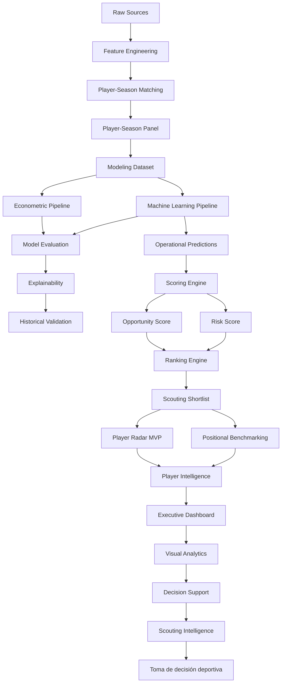

# Arquitectura del Sistema

## Visión general

La arquitectura del proyecto ha evolucionado desde un entorno exploratorio centrado en notebooks hacia una plataforma modular de Football Analytics orientada a Scouting Intelligence.

El sistema implementa un flujo completo de generación de valor analítico:

```text
Fuentes de datos
↓
Feature Engineering
↓
Modelización
↓
Evaluación histórica
↓
Scouting operativo
↓
Player Intelligence
↓
Decision Support
↓
Scouting Intelligence
↓
Toma de decisión deportiva
```

---

# Principios arquitectónicos

La arquitectura se ha diseñado siguiendo los siguientes principios:

- modularidad
- reproducibilidad
- trazabilidad experimental
- separación de responsabilidades
- validación temporal
- interpretabilidad
- escalabilidad analítica

---

# Arquitectura funcional actual



---

# Capas arquitectónicas

## 1. Data Layer

Responsable de la integración y preparación de datos.

Fuentes:

- FBref
- Transfermarkt

Componentes:

```text
src/data/
src/features/
```

Funciones:

- ingestión
- limpieza
- estandarización
- enriquecimiento
- generación de variables

---

## 2. Matching Layer

Responsable de la integración jugador-temporada entre fuentes.

Objetivo:

```text
FBref ↔ Transfermarkt
```

Metodología:

- matching exacto
- validación por edad
- validación por club
- fuzzy matching controlado

Resultado:

```text
Match Rate ≈ 88%
```

---

## 3. Modeling Layer

Construcción del dataset modelizable y entrenamiento de modelos.

Dataset actual:

| Métrica | Valor |
|----------|----------:|
| Observaciones | 3.916 |
| Jugadores únicos | 2.136 |
| Temporadas | 2019-2020 → 2025-2026 |

Componentes:

```text
src/models/econometric/
src/models/machine_learning/
```

---

## 4. Historical Evaluation Layer

Introducida y consolidada durante Sprint 10.

Objetivo:

Evaluar rigurosamente la capacidad predictiva de los modelos.

Funciones:

- validación temporal
- comparación de modelos
- backtesting
- análisis metodológico
- evaluación académica

Outputs:

```text
tuned_xgboost_test_predictions.csv
tuned_xgboost_full_predictions.csv
evaluation metrics
feature importance
SHAP analysis
```

---

## 5. Current Scouting Layer

Introducida en Sprint 10.3.

Objetivo:

Separar evaluación histórica de recomendaciones operativas.

Funciones:

- scoring actual
- rankings de scouting
- generación de shortlists
- actualización temporada vigente

Outputs:

```text
tuned_xgboost_predictions.csv
scoring_dataset.csv
scouting_shortlist.csv
scouting_shortlist_with_risk.csv
```

---

## 6. Scoring Layer

Transforma predicciones en señales accionables.

Componentes:

```text
build_inefficiency_score.py
build_growth_score.py
build_confidence_score.py
build_opportunity_score.py
build_risk_score.py
generate_rankings.py
```

Scores implementados:

### Inefficiency Score

```text
Valor esperado - Valor observado
```

### Growth Score

Captura potencial de desarrollo.

### Confidence Score

Captura robustez de la señal.

### Opportunity Score

Priorización multicriterio.

### Risk Score

Nueva dimensión incorporada en Sprint 10.

Permite distinguir:

```text
High Potential / Low Risk
High Potential / High Risk
Moderate Potential / Low Risk
Moderate Potential / High Risk
```

---

## 7. Ranking Engine

Transforma scores en recomendaciones priorizadas.

Outputs:

- scouting_shortlist
- top opportunities
- top low risk targets
- rankings por liga
- rankings por posición

---

## 8. Player Intelligence Layer

Incorporada en Sprint 10.1.

Objetivo:

Transformar rankings en análisis individuales de jugadores.

Componentes:

### Player Radar MVP

Métricas actuales:

- minutos
- goles/90
- asistencias/90
- G+A/90
- Growth Score
- Confidence Score

### Positional Benchmarking

Comparación dinámica contra:

- misma posición
- universo completo

### Scouting Narrative

Interpretación automática de perfiles.

---

## 9. Decision Support Layer

Implementada entre Sprint 7 y Sprint 10.

Componentes:

### Executive Dashboard

Aplicación:

```text
app/streamlit_app.py
```

Capacidades:

- filtros ejecutivos
- rankings interactivos
- explainability
- scouting reports
- player radar
- benchmarking

### Opportunity vs Risk Matrix

Introducida en Sprint 10.3.

Objetivo:

Facilitar priorización estratégica de objetivos.

---

## 10. Scouting Intelligence Layer

Capa final del sistema.

Integra:

- predicción
- scoring
- riesgo
- ranking
- benchmarking
- visual analytics

Resultado:

```text
Recomendaciones accionables para scouting profesional
```

---

# Evolución arquitectónica

| Sprint | Evolución principal |
|----------|------------------|
| Sprint 1 | Positional Normalization |
| Sprint 2 | Temporal Dynamics |
| Sprint 3 | Composite Football Indices |
| Sprint 4 | Machine Learning |
| Sprint 4C | Explainability |
| Sprint 5 | Scoring Engine |
| Sprint 6 | Business Evaluation |
| Sprint 7 | Dashboard |
| Sprint 9 | Decision Support System |
| Sprint 10.1 | Player Intelligence |
| Sprint 10.2 | FBref Advanced Audit |
| Sprint 10.3 | Current Scouting Layer + Risk Framework |

---

# Arquitectura física

```text
market-value-football-tfm/

├── app/
├── artifacts/
├── config/
├── data/
├── docs/
├── mlruns/
├── notebooks/
├── reports/
├── src/
└── tests/
```

---

# Conclusión

La principal contribución arquitectónica del Sprint 10 es la separación explícita entre:

```text
Historical Evaluation Layer
↓
Current Scouting Layer
↓
Player Intelligence Layer
↓
Decision Support Layer
```

Esta decisión evita mezclar validación histórica con recomendaciones operativas y aproxima el sistema a arquitecturas utilizadas en departamentos profesionales de Football Analytics.

La versión v1.0.0 consolida la transición desde un sistema de estimación de valor de mercado hacia una plataforma integral de Scouting Intelligence orientada a identificación, priorización y evaluación de oportunidades de mercado.
