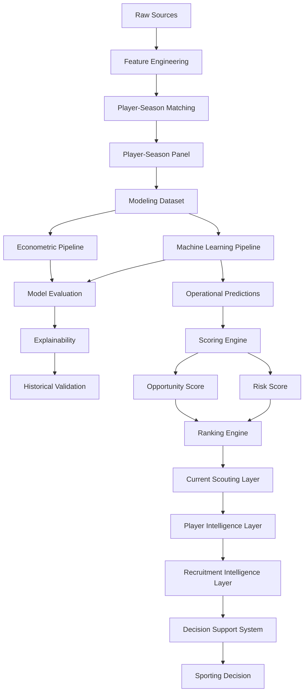

# 🏗️ Arquitectura del Sistema

## Visión general

La arquitectura del proyecto ha evolucionado desde un entorno exploratorio centrado en notebooks hacia una plataforma integral de Football Analytics orientada a scouting profesional y soporte a decisiones.

La versión actual (v1.1.0) implementa una arquitectura multicapa que transforma datos deportivos en recomendaciones accionables para procesos de recruitment.

```text
Fuentes de datos
↓
Feature Engineering
↓
Matching
↓
Modelización
↓
Opportunity Detection
↓
Risk Assessment
↓
Player Intelligence
↓
Recruitment Intelligence
↓
Decision Support System
```

---

## Principios arquitectónicos

La arquitectura se ha diseñado siguiendo los siguientes principios:

* Modularidad.
* Reproducibilidad.
* Trazabilidad experimental.
* Separación de responsabilidades.
* Validación temporal.
* Interpretabilidad.
* Escalabilidad analítica.
* Orientación a negocio.

---

# 🧩 Arquitectura funcional actual



---

# 🏛️ Capas arquitectónicas

## 1. Data Layer

Responsable de la adquisición, limpieza y preparación de datos.

### Fuentes

* FBref.
* Transfermarkt.

### Responsabilidades

* Ingestión.
* Limpieza.
* Estandarización.
* Enriquecimiento.
* Generación de variables.

### Componentes

```text
src/data/
src/features/
```

---

## 2. Matching Layer

Responsable de la integración entre fuentes.

Objetivo:

```text
FBref ↔ Transfermarkt
```

### Metodología

* Exact Matching.
* Club Validation.
* Age Validation.
* Fuzzy Matching.

### Resultado

```text
Match Rate ≈ 88%
```

---

## 3. Modeling Layer

Responsable de la construcción del dataset modelizable y entrenamiento de modelos.

### Componentes

```text
src/models/econometric/
src/models/machine_learning/
```

### Modelos implementados

#### Growth OLS

Benchmark interpretable.

#### Tuned XGBoost

Modelo productivo de la plataforma.

---

## 4. Historical Evaluation Layer

Responsable de la validación metodológica de modelos.

### Funciones

* Validación temporal.
* Comparación de algoritmos.
* Backtesting.
* Evaluación académica.
* Explainability.

### Outputs

```text
Predictions
Metrics
Feature Importance
SHAP Analysis
```

---

## 5. Current Scouting Layer

Responsable de separar evaluación histórica y explotación operativa.

### Funciones

* Predicción temporada vigente.
* Generación de rankings.
* Construcción de shortlists.
* Priorización de oportunidades.

### Outputs

```text
scouting_shortlist.csv
scouting_shortlist_with_risk.csv
```

---

## 6. Scoring Layer

Transforma predicciones en señales accionables.

### Componentes

```text
Inefficiency Score
Growth Score
Confidence Score
Opportunity Score
Risk Score
```

### Objetivo

Convertir predicciones en recomendaciones operativas para scouting.

---

## 7. Ranking Engine

Transforma scores en listas priorizadas de candidatos.

### Capacidades

* Rankings globales.
* Rankings por posición.
* Rankings por liga.
* Rankings por nivel de riesgo.

### Resultado

```text
Scouting Shortlists
```

---

## 8. Player Intelligence Layer

Introducida durante Sprint 10.

Objetivo:

Transformar rankings en análisis individuales de jugadores.

### Componentes

#### Player Radar

Visualización multidimensional del perfil del jugador.

#### Positional Benchmarking

Comparación respecto a jugadores de la misma posición.

#### Scouting Narrative

Interpretación automática de fortalezas y debilidades.

---

## 9. Recruitment Intelligence Layer

Introducida durante Sprint 11.

Objetivo:

Transformar análisis individuales en procesos operativos de recruitment.

### Recruitment Board

Permite:

* Construcción de shortlists.
* Selección múltiple.
* Gestión de candidatos.

### Candidate Selection System

Permite:

* Selección simultánea.
* Comparación dinámica.
* Priorización operativa.

### Comparative Player Analysis

Comparación directa de:

* Opportunity Score.
* Risk Score.
* Confidence Score.
* Market Value.
* Predicted Value.
* Mispricing.

### Executive Scouting Workflow

```text
Opportunity Detection
↓
Filtering
↓
Shortlisting
↓
Comparative Analysis
↓
Recruitment Decision
```

---

## 10. Decision Support System Layer

Consolidada durante Sprint 12.

Objetivo:

Facilitar la adopción operativa de resultados analíticos por usuarios de negocio.

### Executive Dashboard

Aplicación principal:

```text
app/streamlit_app.py
```

### Componentes

#### Advanced Search Engine

Búsqueda por:

* Jugador.
* Club.
* Liga.
* Posición.

#### Search Suggestions

Autocompletado dinámico.

#### Search Chips

Indicadores visuales de filtros activos.

#### UX Redesign

Optimización de:

* Filtros.
* Navegación.
* Interacción.

#### Internationalization

Idiomas soportados:

* Español.
* Inglés.

---

# 🔄 Evolución arquitectónica

| Sprint    | Evolución                                 |
| --------- | ----------------------------------------- |
| Sprint 1  | Positional Normalization                  |
| Sprint 2  | Temporal Dynamics                         |
| Sprint 3  | Composite Football Indices                |
| Sprint 4  | Machine Learning                          |
| Sprint 4C | Explainability                            |
| Sprint 5  | Scoring Engine                            |
| Sprint 6  | Business Evaluation                       |
| Sprint 7  | Executive Dashboard                       |
| Sprint 9  | Decision Support Layer                    |
| Sprint 10 | Player Intelligence Layer                 |
| Sprint 11 | Recruitment Intelligence Layer            |
| Sprint 12 | Productization, UX & Internationalization |

---

# 🖥️ Arquitectura física

```text
market-value-football-tfm/

├── app/
├── artifacts/
├── config/
├── data/
├── docs/
├── mlruns/
├── notebooks/
├── reports/
├── src/
└── tests/
```

---

# 🏁 Conclusión

La arquitectura v1.1.0 consolida la evolución del proyecto desde un sistema de estimación de valor de mercado hacia una plataforma DSS orientada a scouting y recruitment profesional.

La incorporación de las capas de:

```text
Player Intelligence
↓
Recruitment Intelligence
↓
Decision Support System
```

permite transformar modelos predictivos en procesos de decisión accionables alineados con las necesidades reales de departamentos deportivos.

