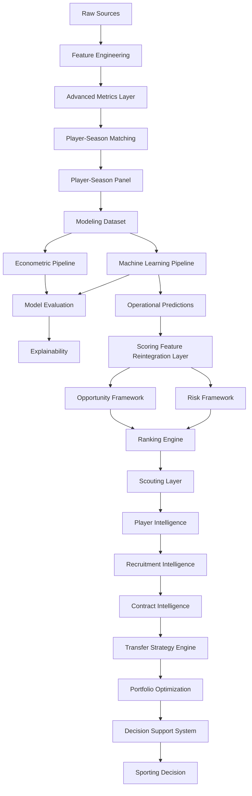

# 🏗️ Arquitectura del Sistema

## Visión general

La arquitectura del proyecto ha evolucionado desde un entorno exploratorio centrado en modelización predictiva hacia una plataforma integral de Football Analytics orientada a scouting profesional, recruitment intelligence, contract intelligence y soporte cuantitativo a decisiones deportivas.

La versión actual:

```text
v1.4.0 — Contract Intelligence Layer
```

implementa una arquitectura multicapa capaz de transformar información deportiva, económica y contractual procedente de múltiples competiciones europeas en recomendaciones accionables para departamentos deportivos profesionales.

La evolución metodológica del sistema puede resumirse mediante:

```text
Data Engineering
↓
Modeling
↓
Opportunity Detection
↓
Risk Assessment
↓
Player Intelligence
↓
Recruitment Intelligence
↓
Contract Intelligence
↓
Transfer Strategy Engine
↓
Portfolio Optimization
↓
Decision Support System
↓
Sporting Decision
```

La arquitectura integra actualmente conceptos procedentes de:

* Sports Analytics
* Sports Economics
* Econometría aplicada
* Machine Learning supervisado
* Explainable AI
* Decision Science
* Operations Research
* Portfolio Optimization
* Contract Intelligence
* Recruitment Analytics

permitiendo evolucionar desde la identificación de oportunidades individuales hacia la optimización de decisiones de fichaje bajo restricciones reales de club, incorporando además contexto contractual y poder negociador.

---

## Estado actual

| Métrica                        |  Valor |
| ------------------------------ | -----: |
| Observaciones FBref procesadas | 43.591 |
| Dataset modelizable            |  5.527 |
| Ligas                          |     11 |
| Temporadas                     |      7 |
| Combinaciones liga-temporada   |     77 |
| Match Rate global              | 75,97% |
| Jugadores DSS enriquecidos     |    757 |
| Cobertura contractual DSS      | 95,90% |

---

## Principios arquitectónicos

La arquitectura se diseña siguiendo los siguientes principios:

* Modularidad.
* Reproducibilidad.
* Trazabilidad experimental.
* Separación de responsabilidades.
* Validación temporal.
* Interpretabilidad.
* Escalabilidad analítica.
* Orientación a negocio.
* Validez externa.
* Generalización multi-liga.
* Optimización bajo restricciones.
* Integración contractual sin leakage temporal.
* Separación entre modelización histórica y explotación DSS.

---

# 🧩 Arquitectura funcional actual



---

## Contribución arquitectónica de Sprint TM.2

Sprint TM.2 introduce una capa explícita de reintegración de variables entre la salida de predicción y el Opportunity Framework.

Objetivo:

```text
Predictions
↓
Scoring Feature Reintegration
↓
Opportunity Framework
↓
Ranking Engine
↓
Transfer Strategy Engine
```

Esta capa garantiza que la expansión multi-liga introducida durante Sprint 13A y Sprint 13B se propague correctamente hasta todas las capas operativas del DSS.

Resultado:

```text
Modeling Layer             → 11 ligas
Scoring Layer              → 11 ligas
Opportunity Layer          → 11 ligas
Transfer Strategy Engine   → 11 ligas
Decision Support System    → 11 ligas
```

La arquitectura elimina así dependencias heredadas de versiones anteriores y asegura consistencia metodológica de extremo a extremo.

---

## Contribución arquitectónica de Sprint TM.3

Sprint TM.3 introduce una capa explícita de inteligencia contractual entre Recruitment Intelligence y Transfer Strategy Engine.

Objetivo:

```text
Recruitment Intelligence
↓
Contract Intelligence
↓
Contract-Aware Recruitment
↓
Decision Support System
```

Esta capa permite incorporar información contractual de Transfermarkt al universo DSS sin modificar los modelos econométricos ni los modelos de Machine Learning.

La decisión arquitectónica principal consiste en mantener Contract Intelligence como una capa operativa DSS, no como una variable histórica de modelización.

Justificación:

* evita temporal leakage;
* mantiene la integridad del panel histórico jugador-temporada;
* respeta la naturaleza snapshot de los datos contractuales;
* añade contexto negociador al proceso de recruitment;
* mejora la utilidad ejecutiva del DSS sin alterar los modelos productivos.

Resultado:

```text
DSS Universe                 → 757 jugadores
Contract Intelligence        → 95,90% cobertura contractual
Contract Opportunity Outputs → 3 artefactos principales
```

Outputs generados:

```text
reports/tm3_contract_intelligence/contract_intelligence_dataset.csv
reports/tm3_contract_intelligence/top_contract_opportunities.csv
reports/tm3_contract_intelligence/top_recruitment_contract_targets.csv
```

---

# 🏛️ Capas arquitectónicas

## 1. Data Layer

Responsable de la adquisición, limpieza y preparación de datos.

### Fuentes

* FBref
* Transfermarkt

### Responsabilidades

* Ingestión.
* Limpieza.
* Estandarización.
* Integración.
* Enriquecimiento.
* Construcción de variables.
* Preparación de snapshots operativos para DSS.

### Componentes

```text
src/data/
src/features/
```

---

### Cobertura actual

| Métrica             |  Valor |
| ------------------- | -----: |
| Ligas               |     11 |
| Temporadas          |      7 |
| Observaciones FBref | 43.591 |

---

## 2. Advanced Metrics Layer

Introducida durante Sprint 13B.

### Objetivo

Integrar métricas avanzadas derivadas de FBref dentro de la arquitectura productiva.

### Variables productivas

* finishing_index_v2
* availability_index
* defensive_activity_index

### Resultado metodológico

Las tres variables fueron promovidas a producción tras demostrar mejoras consistentes tanto en econometría como en Machine Learning.

Hallazgo principal:

```text
finishing_index_v2
```

se identifica como la variable avanzada con mayor relevancia predictiva agregada.

---

## 3. Matching Layer

Responsable de la integración entre fuentes.

### Objetivo

```text
FBref ↔ Transfermarkt
```

### Metodología

* Exact Matching.
* Club Validation.
* Age Validation.
* Fuzzy Matching.

### Tecnología

```text
RapidFuzz
```

### Resultado actual

| Métrica           |  Valor |
| ----------------- | -----: |
| Match Rate global | 75,97% |

---

## 4. Modeling Layer

Responsable de la construcción del dataset modelizable y del entrenamiento de modelos predictivos.

### Dataset actual

| Métrica       | Valor |
| ------------- | ----: |
| Observaciones | 5.527 |
| Ligas         |    11 |
| Temporadas    |     7 |

### Modelos oficiales

#### Growth OLS v13B

Benchmark econométrico oficial.

R²:

```text
0.4549
```

#### Tuned XGBoost v13B

Modelo Machine Learning productivo.

Resultado productivo:

```text
RMSE = 0.9639
MAE  = 0.7777
R²   = 0.4453
```

#### Referencia histórica de validación externa

Sprint 13A.1 obtuvo el mejor resultado predictivo alcanzado durante el proyecto:

```text
Tuned XGBoost
RMSE = 0.8525
MAE  = 0.6834
R²   = 0.5664
```

Este resultado constituye la principal evidencia de capacidad de generalización multi-liga de la metodología desarrollada.

### Resultado

La modelización opera actualmente sobre un universo multi-liga de once competiciones europeas y constituye la base de todas las capas posteriores del DSS.

---

## 5. Opportunity Framework Layer

Introducida durante Sprint 5 y ampliada progresivamente hasta Sprint TM.2.

### Objetivo

Transformar predicciones de valor de mercado en oportunidades accionables de scouting.

La lógica central del sistema se basa en la comparación entre:

```text
Observed Market Value
vs
Expected Market Value
```

permitiendo identificar potenciales ineficiencias de mercado.

---

### Componentes

#### Inefficiency Score

Mide el grado de infravaloración o sobrevaloración relativa.

#### Growth Score

Captura señales de crecimiento y evolución reciente del jugador.

#### Confidence Score

Evalúa la robustez y fiabilidad de la recomendación.

#### Opportunity Score

Combina las dimensiones anteriores en una métrica única orientada a toma de decisiones.

---

### Resultado operativo

Tras Sprint TM.2:

```text
Opportunity Framework
↓
11 ligas integradas
↓
6.208 observaciones elegibles
```

garantizando consistencia con la cobertura de modelización.

---

## 6. Risk Framework Layer

Responsable de la evaluación del riesgo asociado a cada recomendación.

### Objetivo

Complementar el análisis de oportunidad con una medida explícita de incertidumbre.

### Componentes

* Risk Score.
* Risk Category.
* Opportunity vs Risk Matrix.
* Risk-adjusted Opportunity.

### Resultado

La plataforma permite evaluar simultáneamente:

```text
Potencial esperado
+
Nivel de riesgo
```

mejorando la calidad de las decisiones de recruitment.

---

## 7. Ranking Engine Layer

Responsable de transformar Opportunity Framework y Risk Framework en rankings operativos.

### Función principal

```text
Opportunity Framework
+
Risk Framework
↓
Ranking Engine
↓
Scouting Prioritization
```

---

### Outputs principales

#### Global Rankings

Ranking global de oportunidades.

#### Positional Rankings

Rankings específicos por posición.

#### Recruitment Rankings

Rankings orientados a scouting y recruitment.

#### Executive Shortlists

Selección priorizada de candidatos para evaluación ejecutiva.

#### Contract-Aware Rankings

Rankings enriquecidos con contexto contractual y oportunidad negociadora.

---

### Sprint TM.2

Sprint TM.2 resolvió una inconsistencia arquitectónica detectada tras la expansión multi-liga.

Situación previa:

```text
Modeling Layer      → 11 ligas
Ranking Engine      → 7 ligas
```

Situación actual:

```text
Modeling Layer      → 11 ligas
Ranking Engine      → 11 ligas
```

Resultado:

Consistencia completa entre modelización y capa operativa.

---

### Sprint TM.3

Sprint TM.3 amplía el Ranking Engine mediante la incorporación de rankings contractuales derivados de:

* contract_opportunity_score;
* recruitment_contract_score;
* negotiation_leverage_score;
* contract_status;
* free_agent_horizon.

Resultado:

```text
Opportunity Rankings
↓
Contract-Aware Rankings
↓
Recruitment Contract Targets
```

---

## 8. Player Intelligence Layer

Introducida durante Sprint 10.

### Objetivo

Transformar rankings en análisis individuales de jugadores.

### Componentes

#### Player Radar

Visualización multidimensional del perfil del jugador.

#### Positional Benchmarking

Comparación frente a perfiles equivalentes.

#### Opportunity vs Risk Matrix

Evaluación conjunta de potencial y riesgo.

#### Scouting Narrative

Interpretación automática de fortalezas y debilidades.

### Resultado

La plataforma evoluciona desde rankings descriptivos hacia inteligencia accionable a nivel de jugador.

---

## 9. Recruitment Intelligence Layer

Introducida durante Sprint 11.

### Objetivo

Transformar análisis individuales en procesos estructurados de recruitment.

### Componentes

#### Recruitment Board

Permite:

* construcción de shortlists;
* gestión de candidatos;
* evaluación colectiva.

#### Candidate Selection System

Permite:

* comparación simultánea;
* priorización dinámica;
* evaluación ejecutiva.

#### Comparative Player Analysis

Comparación directa de:

* Opportunity Score.
* Risk Score.
* Confidence Score.
* Market Value.
* Predicted Value.
* Market Mispricing.

---

### Workflow ejecutivo

```text
Opportunity Detection
↓
Filtering
↓
Shortlisting
↓
Comparative Analysis
↓
Recruitment Decision
```

---

## 10. Contract Intelligence Layer

Introducida durante Sprint TM.3.

### Objetivo

Incorporar contexto contractual al proceso de recruitment sin modificar la capa de modelización histórica.

La capa permite responder a una pregunta operativa adicional:

```text
¿Qué jugadores combinan oportunidad deportiva
y situación contractual favorable?
```

---

### Fuente

La información contractual procede de Transfermarkt.

Variable base:

```text
contract_expiration_date
```

---

### Variables derivadas

* contract_months_remaining
* contract_years_remaining
* contract_expiring_12m
* contract_critical_zone
* free_agent_horizon
* negotiation_leverage_score
* contract_opportunity_score
* contract_status

---

### Métrica principal

```text
Recruitment Contract Score
=
0.70 × Opportunity Score
+
0.30 × Contract Opportunity Score
```

### Justificación

El Opportunity Score mantiene el peso principal del sistema porque resume infravaloración, potencial y robustez analítica.

El Contract Opportunity Score actúa como capa complementaria de contexto económico y negociador.

No se incorpora Risk Score en esta métrica porque no está disponible de forma homogénea para todo el universo DSS.

---

### Outputs principales

```text
contract_intelligence_dataset.csv
top_contract_opportunities.csv
top_recruitment_contract_targets.csv
```

---

### Cobertura

| Métrica                    |  Valor |
| -------------------------- | -----: |
| Jugadores DSS enriquecidos |    757 |
| Cobertura contractual DSS  | 95,90% |
| Outputs TM.3               |      3 |

---

### Resultado

La arquitectura evoluciona desde recruitment basado en oportunidad deportiva y económica hacia recruitment enriquecido por situación contractual.

```text
Recruitment Intelligence
↓
Contract Intelligence
↓
Contract-Aware Recruitment
```

## 11. Transfer Strategy Engine

Introducido durante Sprint 14.

### Objetivo

Responder a la pregunta:

```text
¿Qué cartera de fichajes maximiza
el valor esperado bajo restricciones
reales de club?
```

---

### Inputs

* Budget.
* Positions Needed.
* Scenario.
* Portfolio Style.
* Minimum Player Level.
* Maximum Signings.

---

### Outputs

* Recommended Portfolio.
* Total Cost.
* Budget Utilization.
* Expected Upside.
* Expected ROI.
* Average Portfolio Score.

---

### Escenarios implementados

#### Conservative

Prioriza estabilidad y robustez.

#### Balanced

Equilibrio entre upside y riesgo.

#### Aggressive

Maximización de upside esperado.

---

### Estilos de cartera

#### Value Opportunities

Maximización de oportunidades de mercado.

#### Balanced Squad Building

Equilibrio entre concentración y diversificación.

#### Star + Prospects

Combinación de talento consolidado y desarrollo futuro.

---

## 12. Portfolio Optimization Layer

Introducida durante Sprint 14.

### Metodología

```text
Binary Integer Programming
(PuLP)
```

### Restricciones implementadas

* Presupuesto máximo.
* Utilización mínima del presupuesto.
* Restricciones posicionales.
* Número máximo de incorporaciones.
* Nivel mínimo de jugador.
* Escenarios estratégicos.

---

### Player Level Layer (Sprint 14.1)

Niveles implementados:

* Development Prospect
* Rotation Profile
* First Team Ready
* Key Player Profile
* Elite Target

---

### Contribución metodológica

Esta capa introduce formalmente conceptos procedentes de:

* Operations Research.
* Decision Science.
* Portfolio Optimization.
* Strategic Recruitment Analytics.

Representa la principal evolución conceptual del proyecto.

---

## 13. Decision Support System Layer

Consolidada durante Sprint 12 y ampliada durante Sprint 14, Sprint TM.2 y Sprint TM.3.

### Aplicación principal

```text
app/streamlit_app.py
```

### Capacidades actuales

#### Executive Dashboard

Visualización ejecutiva de oportunidades.

#### Player Intelligence

Benchmarking y análisis individual.

#### Recruitment Intelligence

Comparación y selección de candidatos.

#### Contract Intelligence

Evaluación contractual, leverage negociador y detección de oportunidades pre-expiración.

#### Transfer Strategy Engine

Construcción de carteras optimizadas.

#### Portfolio Optimization

Simulación estratégica bajo restricciones.

#### Internationalization

Idiomas soportados:

* Español.
* Inglés.

---

### Cobertura DSS actual

```text
Modeling Dataset
↓
Scoring Dataset
↓
Opportunity Framework
↓
Ranking Engine
↓
Recruitment Intelligence
↓
Contract Intelligence
↓
Transfer Strategy Engine
↓
Decision Support System
```

Cobertura:

```text
11 ligas
77 league-seasons

757 jugadores DSS enriquecidos
95.90% cobertura contractual
```

La cobertura competitiva y contractual es ahora consistente en todas las capas operativas del sistema.

---

# 🔄 Evolución arquitectónica

| Sprint       | Evolución                             |
| ------------ | ------------------------------------- |
| Sprint 1     | Positional Normalization              |
| Sprint 2     | Temporal Dynamics                     |
| Sprint 3     | Composite Football Indices            |
| Sprint 4     | Machine Learning                      |
| Sprint 4C    | Explainability                        |
| Sprint 5     | Opportunity Framework                 |
| Sprint 6     | Business Evaluation                   |
| Sprint 7     | Executive Dashboard                   |
| Sprint 9     | Decision Support Layer                |
| Sprint 10    | Player Intelligence                   |
| Sprint 11    | Recruitment Intelligence              |
| Sprint 12    | Productization & Internationalization |
| Sprint 13A   | Multi-League Expansion                |
| Sprint 13A.1 | External Validation Layer             |
| Sprint 13B   | Advanced Metrics Layer                |
| Sprint 14    | Transfer Strategy Engine              |
| Sprint 14.1  | Player Level Layer                    |
| TM.2         | Multi-League DSS Integration          |
| TM.3         | Contract Intelligence Layer           |

---

# 🖥️ Arquitectura física

```text
market-value-football-tfm/

├── app/
├── artifacts/
├── config/
├── data/
├── docs/
├── mlruns/
├── notebooks/
├── reports/
│   ├── rankings/
│   ├── strategy/
│   ├── scouting_reports/
│   ├── data_quality/
│   ├── sprint_13a1/
│   └── tm3_contract_intelligence/
│
├── src/
│   ├── data/
│   ├── features/
│   ├── models/
│   ├── strategy/
│   └── utils/
│
└── tests/
```

---

# 🛣️ Roadmap arquitectónico

## TM.1 — Transfermarkt Coverage Audit

Estado:

```text
Backlog
```

Objetivo:

Analizar el techo teórico de matching y las limitaciones estructurales de integración entre FBref y Transfermarkt.

---

## Prioridad alta

### UEFA Club Strength Layer

Variables previstas:

* coeficiente UEFA;
* participaciones europeas;
* rendimiento continental.

---

### CatBoost Benchmark

Objetivo:

```text
Validar si existe mejora incremental
respecto a Tuned XGBoost.
```

---

### TabPFN Benchmark

Objetivo:

```text
Comparar arquitecturas fundacionales
para datos tabulares frente a enfoques
de boosting tradicionales.
```

---

## Prioridad media

### National Team Layer

Variables previstas:

* internacionalidades;
* minutos internacionales;
* torneos disputados.

---

### European Competition Layer

Variables previstas:

* Champions League;
* Europa League;
* Conference League.

---

### Club Development Index

Variables previstas:

* capacidad histórica de desarrollo;
* revalorización de talento;
* generación de plusvalías deportivas.

---

## Investigación futura

### Machine Learning

* CatBoost.
* TabPFN.
* Ensemble Learning.

### Football Analytics

* Similarity Engine.
* Career Trajectory Modeling.
* Club Development Intelligence.

### Sports Economics

* Dynamic Asset Valuation.
* Multi-Objective Optimization.
* Portfolio Simulation.

### Health Intelligence

* Historical Availability Layer.
* Injury Prediction.
* Medical Risk Analytics.

---

# 🏁 Conclusión

La arquitectura ha evolucionado desde un sistema de valoración de mercado hacia una plataforma DSS completa capaz de integrar:

```text
Market Value Prediction
↓
Opportunity Detection
↓
Risk Assessment
↓
Player Intelligence
↓
Recruitment Intelligence
↓
Contract Intelligence
↓
Transfer Strategy Engine
↓
Portfolio Optimization
↓
Decision Support System
```

Sprint 13A aporta validez externa mediante expansión multi-liga.

Sprint 13A.1 aporta evidencia explícita de generalización mediante validación externa sobre once competiciones europeas, alcanzando el mejor rendimiento predictivo observado durante el proyecto:

```text
Tuned XGBoost
RMSE = 0.8525
MAE  = 0.6834
R²   = 0.5664
```

Sprint 13B aporta profundidad analítica mediante métricas avanzadas.

Sprint 14 introduce optimización bajo restricciones reales.

Sprint TM.2 garantiza consistencia metodológica de extremo a extremo entre modelización y DSS.

Sprint TM.3 incorpora inteligencia contractual y contexto negociador dentro del proceso de recruitment.

La versión productiva actual opera sobre una arquitectura completamente integrada de once ligas europeas, 757 jugadores DSS enriquecidos y una cobertura contractual del 95.90%.

La arquitectura actual constituye una plataforma reproducible, interpretable y orientada a negocio preparada tanto para defensa académica como para evolución hacia una solución profesional de Football Analytics, Recruitment Intelligence y Decision Support Systems.
