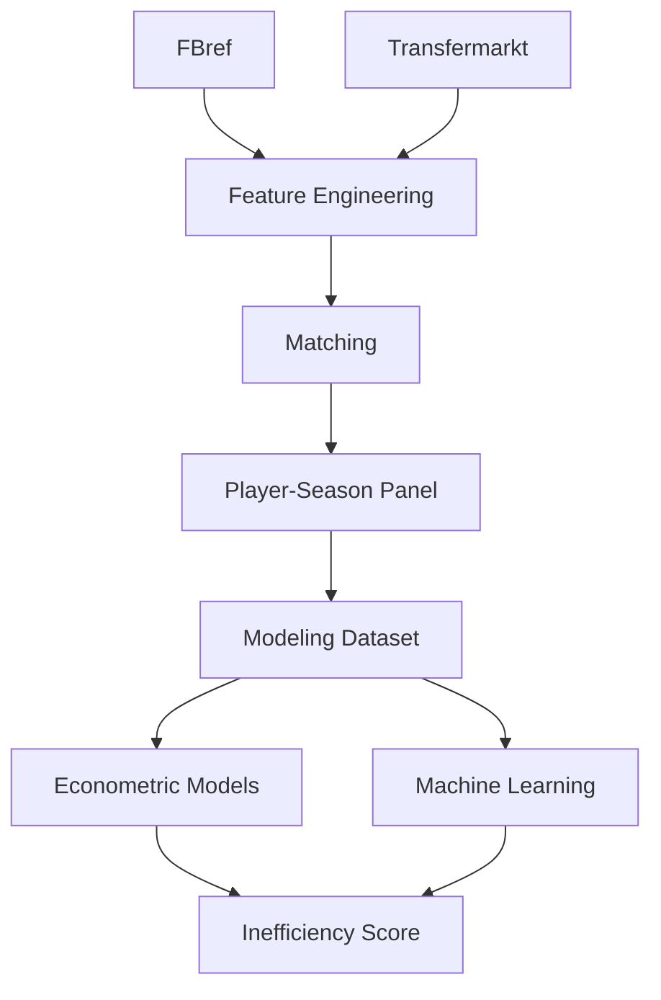
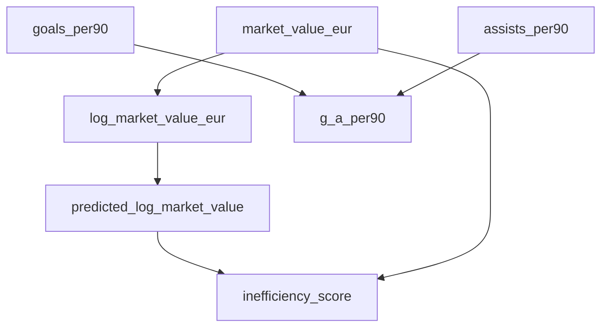

# 📘 Data Dictionary

---

# 📑 Tabla de contenidos

- [🧠 Descripción general](#-descripción-general)
- [⚙️ Unidad de análisis](#️-unidad-de-análisis)
- [🏗️ Arquitectura conceptual del dataset](#️-arquitectura-conceptual-del-dataset)
- [🔑 Variables de identificación](#-variables-de-identificación)
- [📚 Variables temporales](#-variables-temporales)
- [🌍 Variables contextuales](#-variables-contextuales)
- [👤 Variables demográficas](#-variables-demográficas)
- [💰 Variables de mercado](#-variables-de-mercado)
- [📈 Variables deportivas actualmente implementadas](#-variables-deportivas-actualmente-implementadas)
- [🚀 Variables deportivas previstas](#-variables-deportivas-previstas)
- [📊 Variables derivadas](#-variables-derivadas)
- [🏷️ Variables categóricas](#️-variables-categóricas)
- [⚠️ Variables de matching y calidad](#️-variables-de-matching-y-calidad)
- [📈 Variables econométricas](#-variables-econométricas)
- [🤖 Variables Machine Learning](#-variables-machine-learning)
- [💡 Variables de scoring](#-variables-de-scoring)
- [⏳ Variables de validación temporal](#-variables-de-validación-temporal)
- [📤 Outputs generados](#-outputs-generados)
- [🚨 Variables excluidas por leakage](#-variables-excluidas-por-leakage)
- [📚 Relación conceptual entre variables](#-relación-conceptual-entre-variables)
- [📊 Métricas actuales del sistema](#-métricas-actuales-del-sistema)
- [🧠 Observaciones metodológicas](#-observaciones-metodológicas)

---

# 🧠 Descripción general

## Dataset principal

```text
player_season_modeling.parquet
```

El dataset integra:

- información de mercado (Transfermarkt)
- métricas deportivas (FBref)
- variables derivadas
- variables de matching
- outputs de modelización

El objetivo es construir un sistema para:

- estimar valor esperado
- detectar ineficiencias
- generar rankings de scouting

---

# ⚙️ Unidad de análisis

```text
Jugador – Temporada
```

Cada fila representa:

- rendimiento deportivo
- contexto competitivo
- valor de mercado
- características demográficas

de un jugador en una temporada concreta.

---

# 🏗️ Arquitectura conceptual del dataset



---

# 🔑 Variables de identificación

| Variable | Tipo | Descripción | Fuente |
|---|---|---|---|
| `player_id` | string/int | identificador interno unificado | interna |
| `player_id_tm` | int | identificador Transfermarkt | Transfermarkt |
| `fbref_id` | string | identificador FBref | FBref |
| `player_name` | string | nombre del jugador | FBref / Transfermarkt |
| `player_name_norm` | string | nombre normalizado | interna |

---

# 📚 Variables temporales

| Variable | Tipo | Descripción |
|---|---|---|
| `season` | string | temporada deportiva |
| `season_start_year` | int | año inicial de temporada |
| `split` | category | train / test |

---

# 🌍 Variables contextuales

| Variable | Tipo | Descripción |
|---|---|---|
| `league` | category | liga principal |
| `club` | string | club del jugador |
| `club_norm` | string | club normalizado |
| `current_club_name_tm` | string | club según Transfermarkt |

---

# 👤 Variables demográficas

| Variable | Tipo | Descripción |
|---|---|---|
| `age` | float | edad del jugador |
| `age_tm` | float | edad según Transfermarkt |
| `position` | string | posición específica |
| `position_group` | category | grupo posicional |
| `nationality` | string | nacionalidad principal |

---

# 💰 Variables de mercado

| Variable | Tipo | Descripción |
|---|---|---|
| `market_value_eur` | float | valor observado |
| `log_market_value_eur` | float | logaritmo del valor |
| `market_value_prev_eur` | float | valor previo |
| `market_value_next_eur` | float | valor futuro |
| `market_value_growth_1y` | float | crecimiento porcentual |
| `delta_log_market_value_1y` | float | crecimiento logarítmico |

---

## 📌 Nota metodológica

El valor de mercado representa:

```text
estimación pública de mercado
```

No implica necesariamente:

- precio real de transferencia
- valor contractual exacto

---

# 📈 Variables deportivas actualmente implementadas

## Producción ofensiva

| Variable | Tipo | Descripción |
|---|---|---|
| `goals_per90` | float | goles por 90 |
| `assists_per90` | float | asistencias por 90 |
| `g_a_per90` | float | goles + asistencias |

---

## Volumen competitivo

| Variable | Tipo | Descripción |
|---|---|---|
| `minutes_played` | float | minutos disputados |
| `log_minutes_played` | float | logaritmo de minutos |

---

# 🚀 Variables deportivas previstas

## Finalización

- `shots_per90`
- `shot_creating_actions_per90`

---

## Progresión

- `progressive_passes_per90`
- `progressive_carries_per90`

---

## Defensa

- `tackles_per90`
- `interceptions_per90`

---

## Calidad ofensiva

- `xg_per90`
- `xa_per90`

---

# 📊 Variables derivadas

| Variable | Tipo | Descripción |
|---|---|---|
| `log_market_value_eur` | float | target principal |
| `log_minutes_played` | float | transformación logarítmica |
| `g_a_per90` | float | contribución ofensiva total |
| `season_start_year` | int | extracción temporal |

---

# 🏷️ Variables categóricas

## Position Group

| Valor | Descripción |
|---|---|
| `GK` | portero |
| `DEF` | defensa |
| `MID` | centrocampista |
| `ATT` | atacante |

---

## League

Valores principales:

- Premier League
- LaLiga
- Bundesliga
- Serie A
- Ligue 1
- Eredivisie
- Liga Portugal

---

# ⚠️ Variables de matching y calidad

## Objetivo

Estas variables miden:

```text
calidad del matching
```

NO rendimiento deportivo.

---

| Variable | Tipo | Descripción |
|---|---|---|
| `matching_method` | string | método de matching |
| `matching_confidence` | float | score de confianza |
| `age_diff` | float | diferencia de edad |
| `club_score` | float | similitud de club |
| `matching_status` | string | estado del matching |

---

## Métodos implementados

| Método | Descripción |
|---|---|
| `exact_age_validated` | matching exacto |
| `exact_age_club_validated` | matching validado por club |
| `fuzzy_age_club_validated` | fuzzy matching |

---

## Resultados finales

| Método | Resultado |
|---|---:|
| exact_age_validated | 18,669 |
| exact_age_club_validated | 2,146 |
| fuzzy_age_club_validated | 21 |

---

# 📈 Variables econométricas

## Variables explicativas principales

| Variable | Uso |
|---|---|
| `age` | demografía |
| `log_minutes_played` | volumen competitivo |
| `goals_per90` | producción ofensiva |
| `assists_per90` | creación ofensiva |

---

## Fixed Effects

| Variable | Tipo |
|---|---|
| `league` | league FE |
| `season` | season FE |
| `position_group` | position FE |

---

## Variables dummy generadas

Ejemplos:

```text
league_Eredivisie
league_LaLiga
league_Premier League
season_2022-2023
position_group_DEF
position_group_MID
```

---

# 🤖 Variables Machine Learning

## Variables actualmente utilizadas

| Variable | Tipo |
|---|---|
| `age` | numérica |
| `minutes_played` | numérica |
| `goals_per90` | numérica |
| `assists_per90` | numérica |
| `league` | categórica |
| `position_group` | categórica |
| `season` | categórica |

---

## Variables temporalmente incluidas

Variables utilizadas para robustness / comparación:

| Variable |
|---|
| `club_score` |
| `matching_confidence` |
| `age_diff` |

---

## 📌 Decisión metodológica

Estas variables:

```text
NO deberían formar parte del modelo predictivo final
```

porque representan:

- calidad del matching
- no rendimiento deportivo

---

# 💡 Variables de scoring

## Predicciones

| Variable | Descripción |
|---|---|
| `predicted_log_market_value` | predicción logarítmica |
| `predicted_market_value_eur` | predicción en euros |

---

## Residuos y scoring

| Variable | Descripción |
|---|---|
| `residual_observed_minus_predicted` | residuo clásico |
| `inefficiency_score` | score de infravaloración |
| `inefficiency_score_z` | score estandarizado |
| `market_value_gap_eur` | gap monetario |
| `market_value_gap_pct` | gap relativo |

---

## Variables de confianza

| Variable | Descripción |
|---|---|
| `confidence_score` | fiabilidad estimación |
| `opportunity_score` | score ajustado |

---

# ⏳ Variables de validación temporal

## Split temporal

| Split | Temporadas |
|---|---|
| Train | 2019-2020 → 2023-2024 |
| Test | 2024-2025 |

---

## Objetivo

Evitar:

- leakage temporal
- optimismo artificial
- contaminación entre periodos

---

# 📤 Outputs generados

## Outputs econométricos

| Output | Descripción |
|---|---|
| `03_econometric_model_metrics.csv` | métricas OLS |
| `03_econometric_model_coefficients.csv` | coeficientes |
| `03_vif_table.csv` | multicolinealidad |

---

## Outputs ML

| Output | Descripción |
|---|---|
| `04_ml_metrics.csv` | métricas ML |
| `04_feature_importance.csv` | permutation importance |
| `04_predictions.parquet` | predicciones ML |

---

## Rankings

| Output | Descripción |
|---|---|
| `03_undervalued_ranking.csv` | infravalorados |
| `03_overvalued_ranking.csv` | sobrevalorados |

---

# 🚨 Variables excluidas por leakage

Variables NO utilizadas como features predictivas:

| Variable | Motivo |
|---|---|
| `market_value_next_eur` | información futura |
| `delta_log_market_value_1y` | leakage temporal |
| `predicted_market_value_eur` | output derivado |
| `inefficiency_score` | output derivado |

---

# 📚 Relación conceptual entre variables



---

# 📊 Métricas actuales del sistema

## Modelo econométrico final

| Métrica | Valor |
|---|---:|
| MAE | 0.7907 |
| RMSE | 0.9823 |
| R² | 0.4439 |

---

## Mejor modelo ML

| Modelo | R² |
|---|---:|
| Gradient Boosting | 0.4807 |

---

# 🧠 Observaciones metodológicas

- El target se modeliza en escala logarítmica.
- El sistema prioriza interpretabilidad.
- OLS constituye el núcleo principal.
- ML actúa como extensión predictiva.
- Los rankings NO representan recomendaciones automáticas.
- El matching puede introducir ruido residual.
- Los scores deben interpretarse como herramientas de priorización para scouting experto.
- Parte de la varianza no explicada puede deberse a:
  - reputación
  - salario
  - agente
  - contrato
  - lesiones
  - percepción mediática