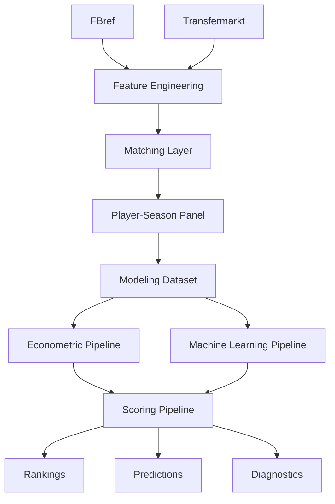
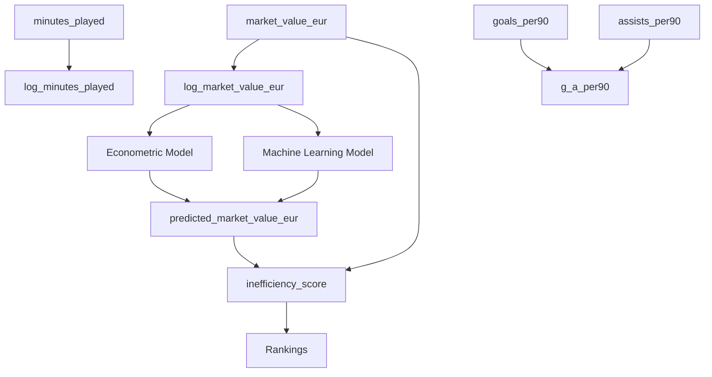

# 📘 Data Dictionary

---

# 🧠 Descripción general

Este documento describe las variables, artefactos y outputs utilizados en el sistema analítico para identificar jugadores infravalorados en el mercado de fichajes europeo.

El dataset principal de modelización es:

<pre>
data/processed/player_season_modeling.parquet
</pre>

Este dataset integra:

- información de mercado procedente de Transfermarkt / Kaggle Player Scores
- métricas deportivas procedentes de FBref
- variables demográficas
- variables contextuales
- variables de matching
- variables derivadas para modelización

El sistema genera posteriormente predicciones, scores, rankings y artefactos derivados mediante pipelines modulares ubicados en `src/`.

---

# 📑 Tabla de contenidos

- [🧠 Descripción general](#-descripción-general)
- [⚙️ Unidad de análisis](#️-unidad-de-análisis)
- [🏗️ Arquitectura conceptual](#️-arquitectura-conceptual)
- [🔑 Variables de identificación](#-variables-de-identificación)
- [📚 Variables temporales](#-variables-temporales)
- [🌍 Variables contextuales](#-variables-contextuales)
- [👤 Variables demográficas](#-variables-demográficas)
- [💰 Variables de mercado](#-variables-de-mercado)
- [📈 Variables deportivas actuales](#-variables-deportivas-actuales)
- [🚀 Variables deportivas previstas](#-variables-deportivas-previstas)
- [📊 Variables derivadas](#-variables-derivadas)
- [🏷️ Variables categóricas](#️-variables-categóricas)
- [⚠️ Variables de matching y calidad](#️-variables-de-matching-y-calidad)
- [📈 Variables econométricas](#-variables-econométricas)
- [🤖 Variables Machine Learning](#-variables-machine-learning)
- [💡 Variables de scoring](#-variables-de-scoring)
- [📤 Outputs generados](#-outputs-generados)
- [📂 Artefactos generados](#-artefactos-generados)
- [⏳ Variables de validación temporal](#-variables-de-validación-temporal)
- [🚨 Variables excluidas por leakage](#-variables-excluidas-por-leakage)
- [📚 Relación conceptual entre variables](#-relación-conceptual-entre-variables)
- [📊 Métricas actuales del sistema](#-métricas-actuales-del-sistema)
- [🧠 Observaciones metodológicas](#-observaciones-metodológicas)

---

# ⚙️ Unidad de análisis

La unidad de análisis del sistema es:

<pre>
Jugador – Temporada
</pre>

Cada fila representa el rendimiento, contexto competitivo, situación demográfica y valor de mercado de un jugador en una temporada concreta.

---

# 🏗️ Arquitectura conceptual

---

# 🔑 Variables de identificación

| Variable            | Tipo       | Descripción                             | Fuente        |
| ------------------- | ---------- | --------------------------------------- | ------------- |
| `player_id`         | string/int | Identificador interno unificado         | Interna       |
| `player_id_tm`      | int        | Identificador Transfermarkt             | Transfermarkt |
| `fbref_id`          | string     | Identificador FBref, si está disponible | FBref         |
| `player_name`       | string     | Nombre principal del jugador            | Integrada     |
| `player_name_fbref` | string     | Nombre del jugador según FBref          | FBref         |
| `player_name_tm`    | string     | Nombre del jugador según Transfermarkt  | Transfermarkt |
| `player_name_norm`  | string     | Nombre normalizado para matching        | Interna       |

---

# 📚 Variables temporales

| Variable                  | Tipo     | Descripción                                         |
| ------------------------- | -------- | --------------------------------------------------- |
| `season`                  | string   | Temporada deportiva                                 |
| `season_start_year`       | int      | Año inicial de la temporada                         |
| `season_start_year_fbref` | int      | Año inicial según FBref, si existe tras merge       |
| `season_start_year_tm`    | int      | Año inicial según Transfermarkt                     |
| `valuation_date`          | datetime | Fecha de valoración de mercado                      |
| `split`                   | category | División train/test cuando se genera explícitamente |

---

# 🌍 Variables contextuales

| Variable               | Tipo     | Descripción                                |
| ---------------------- | -------- | ------------------------------------------ |
| `league`               | category | Liga principal                             |
| `club`                 | string   | Club según FBref                           |
| `club_norm`            | string   | Club normalizado                           |
| `current_club_name_tm` | string   | Club según Transfermarkt                   |
| `current_club_id_tm`   | int      | Identificador de club Transfermarkt        |
| `competition_id_tm`    | string   | Identificador de competición Transfermarkt |

---

# 👤 Variables demográficas

| Variable          | Tipo     | Descripción                          |
| ----------------- | -------- | ------------------------------------ |
| `age`             | float    | Edad final utilizada en modelización |
| `age_fbref`       | float    | Edad según FBref                     |
| `age_tm`          | float    | Edad según Transfermarkt             |
| `date_of_birth`   | datetime | Fecha de nacimiento                  |
| `position`        | string   | Posición original                    |
| `position_tm`     | string   | Posición según Transfermarkt         |
| `sub_position_tm` | string   | Subposición según Transfermarkt      |
| `position_group`  | category | Agrupación posicional final          |
| `nationality`     | string   | Nacionalidad principal               |
| `foot`            | string   | Pierna dominante                     |
| `height_in_cm`    | float    | Altura en centímetros                |

---

# 💰 Variables de mercado

| Variable                    | Tipo  | Descripción                             |
| --------------------------- | ----- | --------------------------------------- |
| `market_value_eur`          | float | Valor de mercado observado              |
| `log_market_value_eur`      | float | Logaritmo natural del valor de mercado  |
| `market_value_prev_eur`     | float | Valor de mercado previo                 |
| `market_value_next_eur`     | float | Valor de mercado futuro                 |
| `market_value_growth_1y`    | float | Crecimiento porcentual futuro del valor |
| `delta_log_market_value_1y` | float | Diferencia logarítmica futura del valor |

---

## 📌 Nota metodológica

`market_value_eur` representa una estimación pública del valor de mercado, no necesariamente el precio real de transferencia.

Puede incorporar:

* rendimiento deportivo
* edad
* potencial percibido
* club
* liga
* reputación
* exposición mediática
* expectativas futuras

---

# 📈 Variables deportivas actuales

## Producción ofensiva

| Variable               | Tipo  | Descripción                                     |
| ---------------------- | ----- | ----------------------------------------------- |
| `goals`                | float | Goles totales                                   |
| `assists`              | float | Asistencias totales                             |
| `g_a`                  | float | Goles + asistencias                             |
| `goals_minus_pk`       | float | Goles sin penaltis                              |
| `goals_per90`          | float | Goles por 90 minutos                            |
| `assists_per90`        | float | Asistencias por 90 minutos                      |
| `g_a_per90`            | float | Goles + asistencias por 90 minutos              |
| `goals_minus_pk_per90` | float | Goles sin penaltis por 90 minutos               |
| `g_a_minus_pk_per90`   | float | Goles + asistencias sin penaltis por 90 minutos |

---

## Volumen competitivo

| Variable             | Tipo  | Descripción                                            |
| -------------------- | ----- | ------------------------------------------------------ |
| `matches_played`     | float | Partidos disputados                                    |
| `starts`             | float | Partidos como titular                                  |
| `minutes_played`     | float | Minutos disputados                                     |
| `nineties`           | float | Minutos expresados en partidos completos de 90 minutos |
| `log_minutes_played` | float | Logaritmo de minutos jugados                           |

---

## Disciplina

| Variable              | Tipo  | Descripción         |
| --------------------- | ----- | ------------------- |
| `yellow_cards`        | float | Tarjetas amarillas  |
| `red_cards`           | float | Tarjetas rojas      |
| `penalties_scored`    | float | Penaltis anotados   |
| `penalties_attempted` | float | Penaltis intentados |

---

# 🚀 Variables deportivas previstas

Estas variables forman parte del roadmap de feature engineering avanzado.

## Finalización

* `shots_per90`
* `shots_on_target_per90`
* `xg_per90`
* `npxg_per90`

---

## Creación

* `xa_per90`
* `key_passes_per90`
* `shot_creating_actions_per90`
* `goal_creating_actions_per90`

---

## Progresión

* `progressive_passes_per90`
* `progressive_carries_per90`
* `passes_into_final_third_per90`
* `carries_into_final_third_per90`

---

## Defensa

* `tackles_per90`
* `interceptions_per90`
* `blocks_per90`
* `aerial_duels_won_pct`
* `recoveries_per90`

---

## Desarrollo y trayectoria

* `delta_minutes_yoy`
* `delta_goals_per90_yoy`
* `delta_assists_per90_yoy`
* `market_value_growth_prev`
* `age_relative_to_peak`
* `early_breakout_flag`

---

# 📊 Variables derivadas

| Variable               | Tipo  | Descripción                           |
| ---------------------- | ----- | ------------------------------------- |
| `log_market_value_eur` | float | Target principal transformado         |
| `log_minutes_played`   | float | Transformación logarítmica de minutos |
| `g_a_per90`            | float | Contribución ofensiva por 90          |
| `season_start_year`    | int   | Año inicial de temporada              |
| `age_diff`             | float | Diferencia de edad entre fuentes      |
| `market_value_gap_eur` | float | Diferencia monetaria estimada         |
| `market_value_gap_pct` | float | Diferencia porcentual estimada        |
| `inefficiency_score`   | float | Score de infravaloración              |
| `inefficiency_score_z` | float | Score normalizado                     |

---

# 🏷️ Variables categóricas

## Position Group

| Valor | Descripción    |
| ----- | -------------- |
| `GK`  | Portero        |
| `DEF` | Defensa        |
| `MID` | Centrocampista |
| `ATT` | Atacante       |

---

## League

Valores principales:

* Premier League
* LaLiga
* Bundesliga
* Serie A
* Ligue 1
* Eredivisie
* Liga Portugal

---

# ⚠️ Variables de matching y calidad

Estas variables miden calidad de integración entre fuentes.

No representan rendimiento deportivo.

| Variable              | Tipo   | Descripción                                                 |
| --------------------- | ------ | ----------------------------------------------------------- |
| `matching_status`     | bool   | Indica si el jugador-temporada fue emparejado correctamente |
| `matching_method`     | string | Método de matching utilizado                                |
| `matching_confidence` | float  | Confianza estimada del matching                             |
| `age_diff`            | float  | Diferencia absoluta de edad entre fuentes                   |
| `club_score`          | float  | Score de similitud entre clubes                             |

---

## Métodos implementados

| Método                     | Descripción                              |
| -------------------------- | ---------------------------------------- |
| `exact_age_validated`      | Matching exacto con validación por edad  |
| `exact_age_club_validated` | Matching exacto validado por edad y club |
| `fuzzy_age_club_validated` | Matching fuzzy validado por edad y club  |

---

## Uso metodológico

Estas variables pueden utilizarse para:

* filtros de calidad
* robustness checks
* confidence scoring
* auditoría del matching

No deben incorporarse como variables deportivas principales.

---

# 📈 Variables econométricas

## Target

| Variable               | Uso                            |
| ---------------------- | ------------------------------ |
| `log_market_value_eur` | Variable dependiente principal |

---

## Variables explicativas actuales

| Variable             | Uso                 |
| -------------------- | ------------------- |
| `age`                | Control demográfico |
| `log_minutes_played` | Volumen competitivo |
| `goals_per90`        | Producción ofensiva |
| `assists_per90`      | Creación ofensiva   |
| `league`             | Fixed effects       |
| `season`             | Fixed effects       |
| `position_group`     | Fixed effects       |

---

## Fixed Effects

| Variable         | Tipo        |
| ---------------- | ----------- |
| `league`         | League FE   |
| `season`         | Season FE   |
| `position_group` | Position FE |

---

# 🤖 Variables Machine Learning

## Variables actualmente utilizadas

| Variable             | Tipo       |
| -------------------- | ---------- |
| `age`                | Numérica   |
| `minutes_played`     | Numérica   |
| `log_minutes_played` | Numérica   |
| `goals_per90`        | Numérica   |
| `assists_per90`      | Numérica   |
| `league`             | Categórica |
| `season`             | Categórica |
| `position_group`     | Categórica |

---

## Variables de calidad con uso restringido

| Variable              | Motivo               |
| --------------------- | -------------------- |
| `club_score`          | Calidad del matching |
| `matching_confidence` | Calidad del matching |
| `age_diff`            | Calidad del matching |

Estas variables pueden utilizarse para análisis de robustez, pero no deben interpretarse como drivers deportivos.

---

# 💡 Variables de scoring

Las variables de scoring se generan a partir de los modelos entrenados.

No forman parte del dataset base de modelización.

## Predicciones

| Variable                     | Descripción                      |
| ---------------------------- | -------------------------------- |
| `predicted_log_market_value` | Predicción en escala logarítmica |
| `predicted_market_value_eur` | Predicción transformada a euros  |

---

## Residuos y gaps

| Variable                            | Descripción                          |
| ----------------------------------- | ------------------------------------ |
| `residual_observed_minus_predicted` | Valor observado menos valor predicho |
| `market_value_gap_eur`              | Valor predicho menos valor observado |
| `market_value_gap_pct`              | Gap relativo sobre valor observado   |

---

## Inefficiency Score

| Variable               | Descripción                 |
| ---------------------- | --------------------------- |
| `inefficiency_score`   | Score de infravaloración    |
| `inefficiency_score_z` | Score estandarizado         |
| `opportunity_score`    | Score compuesto futuro      |
| `confidence_score`     | Fiabilidad de la estimación |

---

## Interpretación

| Score    | Interpretación          |
| -------- | ----------------------- |
| Positivo | Posible infravaloración |
| Negativo | Posible sobrevaloración |

---

# 📤 Outputs generados

## Outputs econométricos

| Output                  | Descripción                                   |
| ----------------------- | --------------------------------------------- |
| `ols_model_metrics.csv` | Métricas del modelo OLS                       |
| `ols_undervalued.csv`   | Ranking de jugadores infravalorados según OLS |
| `ols_overvalued.csv`    | Ranking de jugadores sobrevalorados según OLS |
| `ols_coefficients.csv`  | Coeficientes estimados                        |
| `ols_predictions.csv`   | Predicciones del modelo OLS                   |

---

## Outputs Machine Learning

| Output                     | Descripción                         |
| -------------------------- | ----------------------------------- |
| `ml_model_metrics.csv`     | Métricas de modelos ML              |
| `ml_predictions.csv`       | Predicciones out-of-sample          |
| `feature_importance_*.csv` | Importancia de variables por modelo |
| `model_comparison.csv`     | Comparativa de modelos              |

---

## Outputs de scouting

| Output                    | Descripción                            |
| ------------------------- | -------------------------------------- |
| `undervalued_ranking.csv` | Ranking general de oportunidades       |
| `overvalued_ranking.csv`  | Ranking de posibles sobrevalorados     |
| `scouting_shortlist.csv`  | Lista priorizada para análisis experto |
| `league_rankings.csv`     | Rankings por liga                      |
| `position_rankings.csv`   | Rankings por posición                  |

---

# 📂 Artefactos generados

Los artefactos se almacenan en:

<pre>
artifacts/
</pre>

## Modelos

| Directorio          | Contenido                    |
| ------------------- | ---------------------------- |
| `artifacts/models/` | Modelos entrenados `.joblib` |

---

## Predicciones

| Directorio               | Contenido                |
| ------------------------ | ------------------------ |
| `artifacts/predictions/` | Predicciones persistidas |

---

## Feature importance

| Directorio                      | Contenido                |
| ------------------------------- | ------------------------ |
| `artifacts/feature_importance/` | Importancia de variables |

---

## Encoders y scalers

| Directorio            | Contenido                 |
| --------------------- | ------------------------- |
| `artifacts/encoders/` | Encoders categóricos      |
| `artifacts/scalers/`  | Transformadores numéricos |

---

# ⏳ Variables de validación temporal

## Split temporal

| Split | Temporadas            |
| ----- | --------------------- |
| Train | 2019-2020 → 2023-2024 |
| Test  | 2024-2025             |

---

## Objetivo

Evitar:

* leakage temporal
* optimismo artificial
* contaminación entre periodos

---

# 🚨 Variables excluidas por leakage

Variables no utilizadas como features predictivas del modelo de valor actual.

| Variable                     | Motivo                          |
| ---------------------------- | ------------------------------- |
| `market_value_next_eur`      | Información futura              |
| `delta_log_market_value_1y`  | Target futuro para Growth Score |
| `market_value_growth_1y`     | Información futura              |
| `predicted_market_value_eur` | Output derivado del modelo      |
| `predicted_log_market_value` | Output derivado del modelo      |
| `inefficiency_score`         | Output derivado                 |
| `inefficiency_score_z`       | Output derivado                 |
| `market_value_gap_eur`       | Output derivado                 |
| `market_value_gap_pct`       | Output derivado                 |

---

# 📚 Relación conceptual entre variables

---

# 📊 Métricas actuales del sistema

## Modelo econométrico final

| Métrica | Valor aproximado |
| ------- | ---------------: |
| MAE     |             0.79 |
| RMSE    |             0.98 |
| R²      |             0.44 |

---

## Mejor modelo ML actual

| Modelo            | R² aproximado |
| ----------------- | ------------: |
| Gradient Boosting |          0.48 |

---

# 🧠 Observaciones metodológicas

* El target se modeliza en escala logarítmica.
* El sistema prioriza interpretabilidad.
* OLS constituye el núcleo principal.
* ML actúa como extensión predictiva complementaria.
* Los rankings no representan recomendaciones automáticas de fichaje.
* El matching puede introducir ruido residual.
* Las variables de matching deben tratarse con cautela.
* El feature set actual todavía está limitado.
* El siguiente salto de calidad depende del feature engineering avanzado.
* Los scores deben interpretarse como herramientas de priorización para scouting experto.

---

# 🚀 Próximas ampliaciones del diccionario

Este documento deberá actualizarse cuando se implementen:

* métricas xG / xA
* métricas progresivas
* z-scores por posición
* percentiles por liga y posición
* rolling metrics
* Growth Score
* Confidence Score
* scouting reports automáticos
