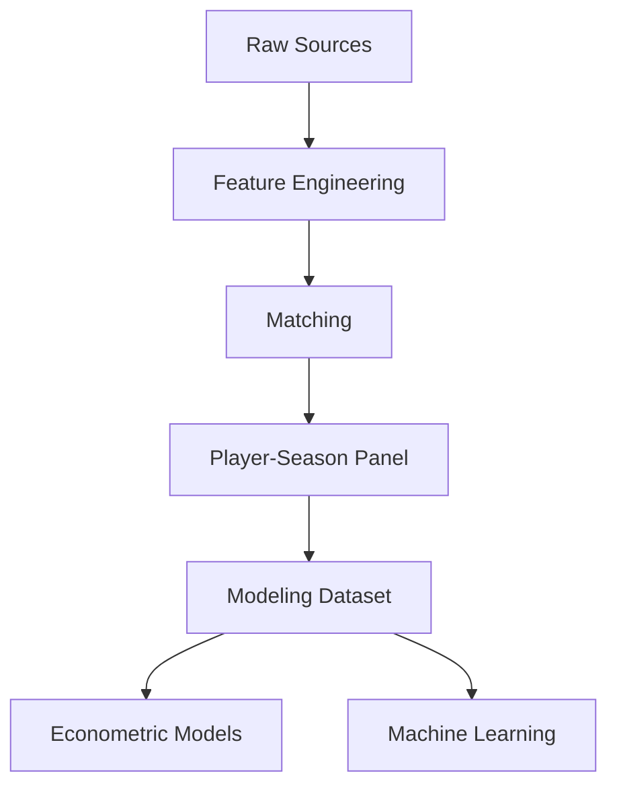

# 📘 Data Quality Report

<div align="center">


</div>

---

# 📑 Tabla de contenidos

- [🧠 Objetivo del informe](#-objetivo-del-informe)
- [📊 Resumen general del dataset](#-resumen-general-del-dataset)
- [🏗️ Calidad estructural del pipeline](#️-calidad-estructural-del-pipeline)
- [⚠️ Problema crítico: integración de fuentes](#️-problema-crítico-integración-de-fuentes)
- [🛠️ Calidad del matching](#️-calidad-del-matching)
- [📈 Cobertura del dataset](#-cobertura-del-dataset)
- [🌍 Calidad por liga](#-calidad-por-liga)
- [👤 Calidad por posición](#-calidad-por-posición)
- [📊 Calidad de las distribuciones](#-calidad-de-las-distribuciones)
- [📉 Missing values y completitud](#-missing-values-y-completitud)
- [⏳ Calidad temporal](#-calidad-temporal)
- [⚖️ Sesgos identificados](#️-sesgos-identificados)
- [🚨 Riesgos y limitaciones](#-riesgos-y-limitaciones)
- [🛡️ Estrategias de mitigación](#️-estrategias-de-mitigación)
- [📌 Evaluación global de calidad](#-evaluación-global-de-calidad)
- [🧠 Conclusión](#-conclusión)

---

# 🧠 Objetivo del informe

Este documento evalúa la calidad del dataset utilizado para modelar el valor de mercado de futbolistas profesionales.

El análisis incluye:

- calidad estructural
- cobertura
- robustez del matching
- sesgos
- limitaciones
- riesgos metodológicos

---

# 📊 Resumen general del dataset

## Dataset panel completo

| Métrica | Valor |
|---|---:|
| Observaciones | 23,580 |
| Temporadas | 2019-2020 → 2024-2025 |
| Ligas | 7 |
| Match rate | 88.36% |

---

## Dataset final modelizable

| Métrica | Valor |
|---|---:|
| Observaciones | 3,297 |
| Jugadores | 1,847 |
| Edad objetivo | 18–23 |

---

## Cobertura competitiva

Ligas incluidas:

- Premier League
- LaLiga
- Bundesliga
- Serie A
- Ligue 1
- Eredivisie
- Liga Portugal

---

# 🏗️ Calidad estructural del pipeline

## Fortalezas principales

El pipeline presenta:

- arquitectura modular
- trazabilidad
- reproducibilidad
- separación clara de etapas

---

## Componentes implementados



---

## Validaciones implementadas

- normalización de nombres
- validación por edad
- validación por club
- filtros temporales
- filtros de minutos
- controles de leakage

---

# ⚠️ Problema crítico: integración de fuentes

## Naturaleza del problema

FBref y Transfermarkt:

```text id="kjy4xa"
NO comparten identificador único
```

---

## Problemas detectados

- diferencias de nombres
- transliteraciones
- cambios de club
- granularidad temporal distinta
- edades no alineadas

---

## Riesgos asociados

- false positives
- false negatives
- ruido estadístico
- pérdida de observaciones

---

# 🛠️ Calidad del matching

## Estrategia implementada

Matching jerárquico basado en:

1. normalización
2. exact matching
3. validación por club
4. fuzzy matching

---

## Thresholds utilizados

```python
MAX_AGE_DIFF = 1.5
MIN_CLUB_SCORE = 70
FUZZY_THRESHOLD = 92
```

---

## Resultados globales

| Métrica | Resultado |
|---|---:|
| Match rate | 88.36% |
| Observaciones emparejadas | 20,836 |
| Observaciones totales | 23,580 |

---

## Distribución del matching

| Método | Resultado |
|---|---:|
| exact_age_validated | 18,669 |
| exact_age_club_validated | 2,146 |
| fuzzy_age_club_validated | 21 |

---

## 📌 Interpretación

La mayoría de observaciones provienen de matching exacto.

El fuzzy matching queda restringido a casos ambiguos específicos, reduciendo riesgo de errores críticos.

---

# 📈 Cobertura del dataset

## Cobertura temporal

| Temporada |
|---|
| 2019-2020 |
| 2020-2021 |
| 2021-2022 |
| 2022-2023 |
| 2023-2024 |
| 2024-2025 |

---

## Cobertura competitiva

El dataset cubre:

- Big 5
- Eredivisie
- Liga Portugal

---

## 📌 Justificación

Eredivisie y Liga Portugal se mantienen porque:

- son ligas exportadoras
- presentan posibles ineficiencias
- son relevantes para scouting

---

# 🌍 Calidad por liga

## Match rate por liga

| Liga | Match Rate |
|---|---:|
| Bundesliga | 93.2% |
| Premier League | 92.8% |
| Serie A | 91.8% |
| Ligue 1 | 90.7% |
| Eredivisie | 90.6% |
| LaLiga | 84.7% |
| Liga Portugal | 75.1% |

---

## 📌 Interpretación

### Bundesliga / Premier League

- naming más consistente
- mayor estabilidad estructural

---

### Liga Portugal

Menor match rate debido a:

- mayor variabilidad lingüística
- transliteraciones
- menor consistencia entre fuentes

---

# 👤 Calidad por posición

## Distribución final

| Posición | Observaciones |
|---|---:|
| MID | 1,705 |
| DEF | 1,147 |
| ATT | 351 |
| GK | 94 |

---

## Sesgos detectados

### MID sobrerrepresentados

Explicación:

- mayor volumen de jugadores
- mayor estabilidad de minutos

---

### GK infrarepresentados

Explicación:

- menor rotación
- menor volumen de mercado
- métricas menos comparables

---

# 📊 Calidad de las distribuciones

## 💰 Valor de mercado

### Características

- fuerte skewness positiva
- colas largas
- presencia de outliers

---

## Decisión adoptada

```python
log_market_value_eur
```

---

## 📌 Justificación

La transformación logarítmica:

- estabiliza varianza
- mejora linealidad
- reduce influencia de extremos

---

## 👤 Edad

Distribución:

```text id="18vrqs"
18–23 años
```

---

## 📌 Implicaciones

El dataset se enfoca en:

- jugadores jóvenes
- scouting
- potencial de revalorización

---

## ⏱️ Minutos jugados

Se aplican filtros mínimos para:

- eliminar ruido
- reducir muestras poco fiables
- mejorar estabilidad del modelo

---

# 📉 Missing values y completitud

## Variables críticas

Las variables principales presentan:

```text id="w6knf5"
baja tasa de missing values
```

---

## Variables con mayor riesgo futuro

- xG
- xA
- métricas avanzadas
- métricas defensivas

---

## Estrategia aplicada

- filtrado
- exclusión controlada
- reducción de dimensionalidad inicial

---

# ⏳ Calidad temporal

## Validación temporal

| Split | Temporadas |
|---|---|
| Train | 2019-2020 → 2023-2024 |
| Test | 2024-2025 |

---

## 📌 Justificación

Se evita:

- leakage temporal
- optimismo artificial
- contaminación futura

---

## Decisión metodológica crítica

```text id="e1fqpu"
NO utilizar random split
```

---

# ⚖️ Sesgos identificados

## 🌍 Sesgo por liga

La Premier League domina estructuralmente los valores de mercado.

Implicación:

- necesidad de league fixed effects
- diferencias estructurales de mercado

---

## 👤 Sesgo por posición

El mercado valora posiciones de forma distinta.

Implicación:

- necesidad de position fixed effects

---

## 📺 Sesgo mediático

Transfermarkt incorpora:

- percepción pública
- reputación
- narrativa mediática

---

## 📈 Sesgo de supervivencia

El dataset modelizable incluye:

- jugadores con minutos suficientes
- jugadores visibles competitivamente

---

# 🚨 Riesgos y limitaciones

## Matching residual

Puede persistir:

- ruido de matching
- uniones imperfectas

---

## Variables omitidas

El modelo no incorpora aún:

- salarios
- duración contractual
- lesiones
- agentes
- reputación

---

## Métricas defensivas limitadas

Actualmente existe:

```text id="x5r4qf"
mayor peso ofensivo
```

en el feature set inicial.

---

## Dependencia de fuentes públicas

Las fuentes utilizadas:

- pueden contener errores
- pueden presentar retrasos
- no representan información privada de clubes

---

# 🛡️ Estrategias de mitigación

## Para matching

- confidence score
- robustness checks
- thresholds elevados

---

## Para sesgos estructurales

- league FE
- season FE
- position FE

---

## Para leakage

- split temporal
- exclusión de variables futuras

---

## Para outliers

- transformación logarítmica
- filtros mínimos

---

# 📌 Evaluación global de calidad

| Dimensión | Evaluación |
|---|---|
| Cobertura temporal | Alta |
| Cobertura competitiva | Alta |
| Calidad matching | Alta |
| Robustez metodológica | Alta |
| Riesgo leakage | Bajo |
| Interpretabilidad | Alta |
| Ruido residual | Moderado |
| Sesgos estructurales | Controlados |

---

# 🧠 Conclusión

El dataset presenta un nivel de calidad adecuado para:

- econometría aplicada
- machine learning supervisado
- scouting cuantitativo

La principal complejidad técnica del proyecto —la integración de fuentes sin identificador común— ha sido resuelta mediante un sistema de matching robusto con resultados sólidos.

Aunque persisten limitaciones inherentes al uso de datos públicos y al mercado futbolístico, el sistema dispone de:

- controles metodológicos
- validación temporal
- robustez estructural
- trazabilidad suficiente

para sustentar un Trabajo de Fin de Máster con rigor académico y aplicabilidad real al scouting profesional.