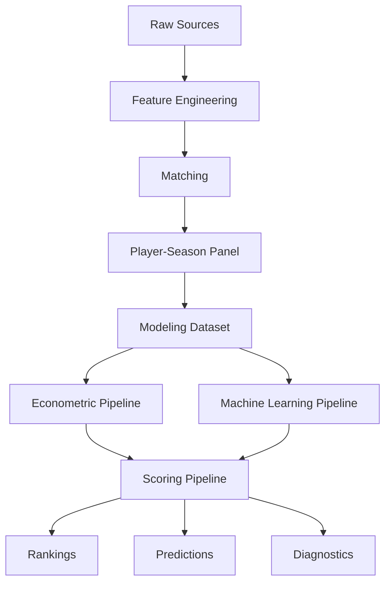

# 📘 Data Quality Report

<div align="center">


</div>

---

# 📑 Tabla de contenidos

- [🧠 Objetivo del informe](#-objetivo-del-informe)
- [📊 Resumen general del dataset](#-resumen-general-del-dataset)
- [🏗️ Calidad estructural del pipeline](#️-calidad-estructural-del-pipeline)
- [⚠️ Problema crítico: integración de fuentes](#️-problema-crítico-integración-de-fuentes)
- [🛠️ Calidad del matching](#️-calidad-del-matching)
- [📈 Cobertura del dataset](#-cobertura-del-dataset)
- [🌍 Calidad por liga](#-calidad-por-liga)
- [👤 Calidad por posición](#-calidad-por-posición)
- [📊 Calidad de las distribuciones](#-calidad-de-las-distribuciones)
- [📉 Missing values y completitud](#-missing-values-y-completitud)
- [⏳ Calidad temporal](#-calidad-temporal)
- [🧪 Calidad del feature set actual](#-calidad-del-feature-set-actual)
- [📈 Calidad de outputs y scoring](#-calidad-de-outputs-y-scoring)
- [⚖️ Sesgos identificados](#️-sesgos-identificados)
- [🚨 Riesgos y limitaciones](#-riesgos-y-limitaciones)
- [🛡️ Estrategias de mitigación](#️-estrategias-de-mitigación)
- [📌 Evaluación global de calidad](#-evaluación-global-de-calidad)
- [🚀 Próximas mejoras de calidad](#-próximas-mejoras-de-calidad)
- [🧠 Conclusión](#-conclusión)

---

# 🧠 Objetivo del informe

Este documento evalúa la calidad del dataset utilizado para modelar el valor de mercado de futbolistas profesionales e identificar posibles ineficiencias en el mercado de fichajes europeo.

El análisis incluye:

- calidad estructural
- cobertura
- robustez del matching
- consistencia temporal
- sesgos
- limitaciones
- riesgos metodológicos
- calidad del feature set actual
- calidad de outputs generados por pipelines

La evaluación se realiza desde una perspectiva doble:

1. **Calidad de datos**, entendida como consistencia, completitud, trazabilidad y robustez.
2. **Calidad analítica**, entendida como utilidad de las variables para explicar y predecir el valor de mercado.

---

# 📊 Resumen general del dataset

## Dataset panel completo

| Métrica | Valor |
|---|---:|
| Observaciones | 23,580 |
| Temporadas | 2019-2020 → 2024-2025 |
| Ligas | 7 |
| Match rate | 88.36% |

---

## Dataset final modelizable

| Métrica | Valor |
|---|---:|
| Observaciones | 3,297 |
| Jugadores | 1,847 |
| Edad objetivo | 18–23 |

---

## Cobertura competitiva

Ligas incluidas:

- Premier League
- LaLiga
- Bundesliga
- Serie A
- Ligue 1
- Eredivisie
- Liga Portugal

---

## Interpretación general

El dataset final es suficientemente robusto para:

- modelización econométrica
- machine learning supervisado
- validación temporal
- generación de rankings
- análisis de ineficiencias de mercado

No obstante, la calidad analítica del sistema todavía está condicionada por la amplitud limitada del feature set deportivo actual.

---

# 🏗️ Calidad estructural del pipeline

## Fortalezas principales

El pipeline presenta:

- arquitectura modular
- trazabilidad
- reproducibilidad
- separación clara de etapas
- generación automática de outputs
- control explícito de leakage

---

## Componentes implementados



---

## Validaciones implementadas

* normalización de nombres
* validación por edad
* validación por club
* filtros temporales
* filtros de minutos
* controles de leakage
* validación temporal out-of-sample
* persistencia de outputs y artefactos

---

## Calidad arquitectónica

La evolución desde notebooks hacia pipelines modulares mejora significativamente:

* reproducibilidad
* mantenibilidad
* auditoría metodológica
* escalabilidad futura
* consistencia entre ejecuciones

Los notebooks quedan como soporte de exploración e interpretación, mientras que la ejecución principal del sistema reside en `src/`.

---

# ⚠️ Problema crítico: integración de fuentes

## Naturaleza del problema

FBref y Transfermarkt:

<pre>
NO comparten identificador único
</pre>

Esto obliga a construir un proceso de integración propio.

---

## Problemas detectados

* diferencias de nombres
* transliteraciones
* cambios de club
* granularidad temporal distinta
* edades no alineadas
* variantes de nombres de clubes
* posibles homónimos

---

## Riesgos asociados

* false positives
* false negatives
* ruido estadístico
* pérdida de observaciones
* contaminación del target
* rankings incorrectos

---

## Interpretación metodológica

La integración de fuentes heterogéneas constituye uno de los principales retos técnicos del proyecto y uno de los principales factores de incertidumbre residual.

---

# 🛠️ Calidad del matching

## Estrategia implementada

Matching jerárquico basado en:

1. normalización
2. exact matching
3. validación por club
4. fuzzy matching
5. validación por edad

---

## Thresholds utilizados

```python
MAX_AGE_DIFF = 1.5
MIN_CLUB_SCORE = 70
FUZZY_THRESHOLD = 92
```

---

## Resultados globales

| Métrica                   | Resultado |
| ------------------------- | --------: |
| Match rate                |    88.36% |
| Observaciones emparejadas |    20,836 |
| Observaciones totales     |    23,580 |

---

## Distribución del matching

| Método                   | Resultado |
| ------------------------ | --------: |
| exact_age_validated      |    18,669 |
| exact_age_club_validated |     2,146 |
| fuzzy_age_club_validated |        21 |

---

## 📌 Interpretación

La mayoría de observaciones proceden de matching exacto o matching exacto validado por edad y club.

El fuzzy matching queda restringido a casos ambiguos específicos, reduciendo el riesgo de errores críticos.

---

## Calidad global del matching

El matching puede considerarse robusto porque:

* alcanza alta cobertura
* mantiene trazabilidad del método utilizado
* limita fuzzy matching a casos residuales
* incorpora validación por edad
* incorpora validación contextual por club
* conserva variables de calidad para análisis posteriores

---

# 📈 Cobertura del dataset

## Cobertura temporal

| Temporada |
| --------- |
| 2019-2020 |
| 2020-2021 |
| 2021-2022 |
| 2022-2023 |
| 2023-2024 |
| 2024-2025 |

---

## Cobertura competitiva

El dataset cubre:

* Big 5
* Eredivisie
* Liga Portugal

---

## Justificación

Eredivisie y Liga Portugal se mantienen porque:

* son ligas exportadoras
* presentan posibles ineficiencias
* son relevantes para scouting
* permiten detectar oportunidades fuera de los mercados más eficientes

---

## Cobertura analítica

La cobertura es adecuada para el objetivo del proyecto, aunque la muestra final queda reducida por los filtros necesarios para garantizar calidad:

* edad 18–23
* minutos mínimos
* valor de mercado disponible
* matching válido
* posición válida

---

# 🌍 Calidad por liga

## Match rate por liga

| Liga           | Match Rate |
| -------------- | ---------: |
| Bundesliga     |      93.2% |
| Premier League |      92.8% |
| Serie A        |      91.8% |
| Ligue 1        |      90.7% |
| Eredivisie     |      90.6% |
| LaLiga         |      84.7% |
| Liga Portugal  |      75.1% |

---

## Interpretación

### Bundesliga / Premier League

Presentan mayor calidad de matching debido a:

* naming más consistente
* mayor estabilidad estructural
* mayor cobertura y visibilidad

---

### Liga Portugal

Presenta menor match rate debido a:

* mayor variabilidad lingüística
* transliteraciones
* menor consistencia entre fuentes
* posibles diferencias en nombres de clubes y jugadores

---

## Implicación metodológica

La calidad por liga no es homogénea. Por tanto, los resultados deben interpretarse teniendo en cuenta:

* sesgo de cobertura
* diferencias estructurales entre mercados
* distinta fiabilidad por competición

---

# 👤 Calidad por posición

## Distribución final

| Posición | Observaciones |
| -------- | ------------: |
| MID      |         1,705 |
| DEF      |         1,147 |
| ATT      |           351 |
| GK       |            94 |

---

## Sesgos detectados

### MID sobrerrepresentados

Explicación:

* mayor volumen de jugadores
* mayor estabilidad de minutos
* mayor presencia en plantillas

---

### GK infrarepresentados

Explicación:

* menor rotación
* menor volumen de mercado
* menor número de observaciones
* métricas menos comparables con jugadores de campo

---

### ATT con muestra más reducida

Explicación:

* menor número relativo de atacantes jóvenes con minutos suficientes
* mayor concentración de valor en pocos jugadores
* mayor sensibilidad a outliers

---

## Implicación metodológica

La distribución posicional obliga a:

* incorporar efectos fijos por posición
* construir futuras normalizaciones por posición
* evitar interpretar métricas ofensivas de forma homogénea para todos los roles

---

# 📊 Calidad de las distribuciones

## 💰 Valor de mercado

### Características

El valor de mercado presenta:

* fuerte skewness positiva
* colas largas
* presencia de outliers
* diferencias estructurales entre ligas

---

## Decisión adoptada

Se utiliza:

```python
log_market_value_eur
```

---

## Justificación

La transformación logarítmica:

* estabiliza varianza
* mejora linealidad
* reduce influencia de valores extremos
* facilita interpretación relativa
* mejora ajuste econométrico

---

## 👤 Edad

Distribución:

<pre>
18–23 años
</pre>

---

## Implicaciones

El dataset se enfoca en:

* jugadores jóvenes
* scouting
* potencial de revalorización
* oportunidades de mercado

---

## ⏱️ Minutos jugados

Se aplican filtros mínimos para:

* eliminar ruido
* reducir muestras poco fiables
* mejorar estabilidad del modelo
* evitar valorar jugadores con exposición competitiva insuficiente

---

# 📉 Missing values y completitud

## Variables críticas

Las variables principales presentan baja tasa de missing values tras los filtros finales:

* market_value_eur
* log_market_value_eur
* age
* minutes_played
* goals_per90
* assists_per90
* league
* season
* position_group

---

## Variables con mayor riesgo futuro

Las siguientes variables pueden presentar problemas de completitud cuando se incorporen:

* xG
* xA
* métricas defensivas
* métricas de progresión
* rolling metrics
* variables longitudinales

---

## Estrategia aplicada

* filtrado de observaciones críticas
* exclusión controlada
* reducción de dimensionalidad inicial
* priorización de variables con alta disponibilidad

---

## Estrategia futura

Para nuevas features se evaluará:

* tasa de missing values
* cobertura por liga
* cobertura por posición
* estabilidad temporal
* impacto en tamaño muestral

---

# ⏳ Calidad temporal

## Validación temporal

| Split | Temporadas            |
| ----- | --------------------- |
| Train | 2019-2020 → 2023-2024 |
| Test  | 2024-2025             |

---

## Justificación

Se evita:

* leakage temporal
* optimismo artificial
* contaminación futura
* sobreestimación del rendimiento predictivo

---

## Decisión metodológica crítica

<pre>
NO utilizar random split
</pre>

---

## Interpretación

La validación temporal reproduce un escenario realista de scouting:

* se entrena con información histórica
* se evalúa en una temporada futura
* se simula una decisión fuera de muestra

---

# 🧪 Calidad del feature set actual

## Features actualmente utilizadas

El modelo actual se apoya principalmente en:

* age
* minutes_played
* log_minutes_played
* goals_per90
* assists_per90
* league
* season
* position_group

---

## Fortalezas

El feature set actual es:

* interpretable
* estable
* disponible
* adecuado como baseline
* coherente con una primera modelización econométrica

---

## Limitaciones

El feature set todavía es limitado porque:

* concentra señal en variables ofensivas básicas
* no incorpora métricas avanzadas de calidad
* no incorpora métricas defensivas suficientemente ricas
* no incorpora métricas de progresión
* no incorpora trayectorias longitudinales
* no incorpora variables contractuales ni salariales

---

## Implicación en resultados

Los resultados actuales muestran que ML mejora solo moderadamente respecto a OLS.

Esto sugiere que el principal cuello de botella del sistema es:

<pre>
la señal predictiva disponible en las variables
</pre>

más que la elección del algoritmo.

---

## Conclusión sobre calidad de features

El feature set actual es válido como baseline metodológico, pero la siguiente mejora sustancial del proyecto debe venir de:

* feature engineering avanzado
* normalización por liga
* z-scores por posición
* percentiles
* métricas de progresión
* age curves
* market momentum

---

# 📈 Calidad de outputs y scoring

## Outputs generados

El sistema genera automáticamente:

* predicciones out-of-sample
* rankings de infravalorados
* rankings de sobrevalorados
* métricas econométricas
* métricas ML
* feature importance
* diagnósticos
* artefactos persistidos

---

## Calidad de outputs

Los outputs son adecuados porque:

* se generan mediante pipelines reproducibles
* están desacoplados del dataset base
* pueden regenerarse tras cambios metodológicos
* permiten trazabilidad entre modelo y ranking
* facilitan interpretación de negocio

---

## Riesgo principal

Los rankings dependen de:

* calidad del modelo
* calidad del matching
* calidad del feature set
* calidad del target Transfermarkt

Por tanto, no deben interpretarse como recomendaciones automáticas de fichaje, sino como herramientas de priorización para scouting experto.

---

# ⚖️ Sesgos identificados

## 🌍 Sesgo por liga

La Premier League domina estructuralmente los valores de mercado.

Implicación:

* necesidad de league fixed effects
* necesidad de normalización contextual
* riesgo de infravalorar ligas menos mediáticas

---

## 👤 Sesgo por posición

El mercado valora posiciones de forma distinta.

Implicación:

* necesidad de position fixed effects
* necesidad de z-scores por posición
* riesgo de penalizar perfiles defensivos o porteros

---

## 📺 Sesgo mediático

Transfermarkt incorpora:

* percepción pública
* reputación
* narrativa mediática
* visibilidad internacional

---

## 📈 Sesgo de supervivencia

El dataset modelizable incluye:

* jugadores con minutos suficientes
* jugadores visibles competitivamente
* jugadores con valor de mercado disponible

Esto puede excluir jóvenes con potencial pero baja exposición.

---

## ⚽ Sesgo ofensivo

El feature set actual está más concentrado en variables ofensivas que defensivas.

Implicación:

* posible sobrevaloración de atacantes
* posible infravaloración de perfiles defensivos
* necesidad de métricas específicas por rol

---

# 🚨 Riesgos y limitaciones

## Matching residual

Puede persistir:

* ruido de matching
* uniones imperfectas
* pérdida de observaciones
* sesgo por liga

---

## Variables omitidas

El modelo no incorpora aún:

* salarios
* duración contractual
* lesiones
* agentes
* reputación
* cláusulas
* internacionalidades
* historial médico

---

## Métricas defensivas limitadas

Actualmente existe mayor peso ofensivo en el feature set inicial.

---

## Dependencia de fuentes públicas

Las fuentes utilizadas:

* pueden contener errores
* pueden presentar retrasos
* no representan información privada de clubes
* no incluyen todas las variables utilizadas realmente por departamentos deportivos

---

## Target imperfecto

Transfermarkt no representa necesariamente:

* precio real de transferencia
* valor contractual
* disponibilidad real del jugador
* willingness to sell del club

---

# 🛡️ Estrategias de mitigación

## Para matching

* confidence score
* robustness checks
* thresholds elevados
* validación por edad
* validación por club

---

## Para sesgos estructurales

* league FE
* season FE
* position FE
* futura normalización por liga
* futuros z-scores por posición

---

## Para leakage

* split temporal
* exclusión de variables futuras
* separación entre dataset base y outputs derivados
* validación out-of-sample

---

## Para outliers

* transformación logarítmica
* filtros mínimos
* análisis descriptivo
* control de valores extremos

---

## Para limitación de features

* roadmap de feature engineering avanzado
* integración futura de Understat
* enriquecimiento con métricas de progresión
* desarrollo de métricas longitudinales

---

# 📌 Evaluación global de calidad

| Dimensión                                   | Evaluación               |
| ------------------------------------------- | ------------------------ |
| Cobertura temporal                          | Alta                     |
| Cobertura competitiva                       | Alta                     |
| Calidad matching                            | Alta                     |
| Robustez metodológica                       | Alta                     |
| Riesgo leakage                              | Bajo                     |
| Interpretabilidad                           | Alta                     |
| Reproducibilidad                            | Alta                     |
| Calidad arquitectónica                      | Alta                     |
| Ruido residual                              | Moderado                 |
| Sesgos estructurales                        | Controlados parcialmente |
| Calidad del feature set actual              | Media                    |
| Potencial de mejora vía feature engineering | Alto                     |

---

# 🚀 Próximas mejoras de calidad

## Corto plazo

* ampliar métricas deportivas desde FBref
* revisar unmatched cases
* separar features de calidad de matching del modelo final
* documentar estabilidad de rankings

---

## Medio plazo

* integrar Understat
* añadir xG y xA
* construir z-scores por posición
* construir percentiles por liga y posición
* incorporar métricas de progresión

---

## Largo plazo

* incorporar Growth Score
* crear Confidence Score
* evaluar robustez longitudinal
* analizar estabilidad de modelos por temporada
* construir scouting reports automáticos

---

# 🧠 Conclusión

El dataset presenta un nivel de calidad adecuado para:

* econometría aplicada
* machine learning supervisado
* scouting cuantitativo
* generación de rankings de ineficiencia

La principal complejidad técnica del proyecto —la integración de fuentes sin identificador común— ha sido resuelta mediante un sistema de matching robusto con resultados sólidos.

La evolución hacia una arquitectura modular reproducible mejora de forma relevante la calidad técnica del proyecto, al permitir:

* trazabilidad
* replicabilidad
* mantenimiento
* generación automática de outputs
* separación entre datos, modelos y artefactos

Aunque persisten limitaciones inherentes al uso de datos públicos y al mercado futbolístico, el sistema dispone de controles metodológicos suficientes para sustentar un Trabajo de Fin de Máster con rigor académico y aplicabilidad real al scouting profesional.

La prioridad actual no es rediseñar la arquitectura ni añadir modelos más complejos de forma prematura, sino mejorar la calidad de la señal predictiva mediante feature engineering avanzado.