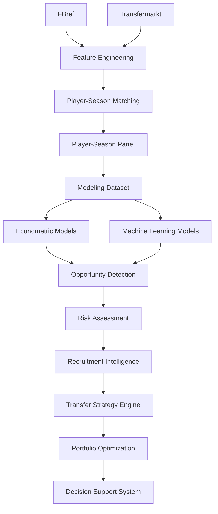

# 📚 Data Sources

## Objetivo

Este documento describe las fuentes de datos utilizadas en la versión **v1.2.0 — Multi-League Expansion**.

Su finalidad es documentar:

* origen de los datos;
* rol de cada fuente dentro de la arquitectura analítica;
* estrategia de integración multi-fuente;
* cobertura temporal y competitiva;
* metodología de matching;
* limitaciones observadas;
* líneas futuras de expansión.

---

# Filosofía de integración

El proyecto adopta una estrategia de:

Multi-Source Football Analytics

Principio fundamental:

Ninguna fuente individual contiene toda la señal necesaria para modelizar el valor de mercado de un futbolista profesional.

Por ello se combinan distintas fuentes con funciones complementarias:

* rendimiento deportivo;
* contexto competitivo;
* evolución temporal;
* valoración económica.

La integración de múltiples fuentes permite capturar dimensiones distintas del fenómeno analizado y reducir la dependencia de una única base de datos.

---

# Objetivo metodológico

La arquitectura de datos se diseñó para responder a la siguiente pregunta:

> ¿Qué jugadores presentan un valor de mercado observado inferior al valor que cabría esperar dadas sus características deportivas, edad, experiencia y rendimiento reciente?

La respuesta requiere combinar:

* información deportiva;
* información económica;
* contexto temporal;
* contexto competitivo.

---

# Arquitectura de integración



---

# Resumen de fuentes

| Fuente              | Rol principal         | Estado    |
| ------------------- | --------------------- | --------- |
| FBref               | Rendimiento deportivo | Integrada |
| Transfermarkt       | Valoración económica  | Integrada |
| Understat           | xG / xA               | Roadmap   |
| StatsBomb Open Data | Event Data            | Roadmap   |

---

# FBref

## Rol dentro del sistema

FBref constituye la principal fuente de información deportiva del proyecto.

Tipo:

Performance Data Source

Su función principal es proporcionar variables explicativas capaces de modelizar el valor de mercado esperado de cada futbolista.

---

## Cobertura Sprint 13A

Durante Sprint 13A se amplió significativamente la cobertura competitiva de FBref.

Resultado:

| Métrica                      |                 Valor |
| ---------------------------- | --------------------: |
| Observaciones procesadas     |                43.591 |
| Temporadas                   |                     7 |
| Ligas                        |                    11 |
| Combinaciones liga-temporada |                    77 |
| Cobertura temporal           | 2019-2020 → 2025-2026 |

---

## Cobertura competitiva

### Ligas históricas

* Premier League
* LaLiga
* Bundesliga
* Serie A
* Ligue 1
* Eredivisie
* Liga Portugal

### Nuevas ligas incorporadas en Sprint 13A

* Championship
* Belgian Pro League
* Austrian Bundesliga
* Spanish Segunda División

---

## Distribución de observaciones

| Liga                     | Observaciones |
| ------------------------ | ------------: |
| Championship             |         5.244 |
| Spanish Segunda División |         4.778 |
| Serie A                  |         4.313 |
| LaLiga                   |         4.186 |
| Ligue 1                  |         3.990 |
| Liga Portugal            |         3.964 |
| Premier League           |         3.874 |
| Eredivisie               |         3.673 |
| Belgian Pro League       |         3.597 |
| Bundesliga               |         3.547 |
| Austrian Bundesliga      |         2.425 |

---

## Información utilizada

### Producción ofensiva

* goals
* assists
* goals_per90
* assists_per90

### Participación

* minutes_played
* starts
* nineties

### Defensa

* tackles
* interceptions
* blocks

### Contexto competitivo

* league
* club
* position

---

## Uso dentro del proyecto

FBref constituye la principal fuente de:

Predictive Features

utilizadas por:

* modelos econométricos;
* modelos de Machine Learning;
* Opportunity Detection;
* Risk Assessment;
* Recruitment Intelligence.

---

## Auditoría avanzada de variables

Durante la evolución del proyecto se realizó una auditoría técnica de las tablas avanzadas disponibles en FBref.

Tablas analizadas:

* Shooting
* Defense
* Misc
* Playing Time
* Passing
* Possession
* Goal & Shot Creation

Esta auditoría constituye la base técnica de futuras ampliaciones de variables y funcionalidades avanzadas de scouting.

---

# Transfermarkt

## Rol dentro del sistema

Transfermarkt constituye la principal fuente económica del proyecto.

Tipo:

Market Valuation Source

Su función principal es proporcionar la variable objetivo utilizada durante la modelización.

---

## Información utilizada

### Mercado

* market_value_eur
* historical_market_value

### Contexto

* age
* position
* club

### Información temporal

* valuation_dates
* historical_evolution

---

## Variable objetivo

Variable original:

market_value_eur

Transformación utilizada:

log_market_value_eur

La transformación logarítmica reduce la asimetría de la distribución y mejora la estabilidad de los modelos predictivos.

---

## Uso dentro del proyecto

Transfermarkt proporciona:

* variable objetivo;
* contexto económico;
* evolución histórica del jugador;
* referencia para la detección de ineficiencias de mercado.

---

## Limitaciones conceptuales

El valor de mercado publicado por Transfermarkt incorpora elementos no observables directamente en los datos deportivos:

* percepción humana;
* contexto mediático;
* reputación;
* potencial percibido;
* expectativas de mercado.

Por tanto:

Valor de mercado ≠ precio real de transferencia

Esta limitación es inherente al problema de investigación y forma parte del marco conceptual del proyecto.

# Matching Pipeline

## Problema de integración

Uno de los principales retos metodológicos del proyecto es la ausencia de un identificador universal compartido entre FBref y Transfermarkt.

Las dos fuentes utilizan estructuras independientes para identificar jugadores, lo que obliga a implementar una estrategia específica de resolución de entidades.

---

## Restricción principal

Las fuentes:

NO comparten identificador universal.

Esto genera problemas potenciales asociados a:

* transliteraciones;
* nombres inconsistentes;
* cambios de club;
* cambios de competición;
* diferencias temporales entre fuentes;
* granularidad distinta de los registros.

---

## Riesgos asociados

Un matching incorrecto puede generar:

* false positives;
* false negatives;
* contaminación del dataset;
* sesgo en la modelización;
* pérdida de capacidad predictiva.

Por este motivo se adopta una estrategia conservadora.

Principio metodológico:

Calidad > Cobertura

---

## Estrategia implementada

El pipeline de matching sigue la siguiente secuencia:

Normalización
↓
Exact Matching
↓
Club Validation
↓
Fuzzy Matching
↓
Age Validation

---

## Algoritmo

Tecnología utilizada:

RapidFuzz

---

## Thresholds operativos

```python
MAX_AGE_DIFF = 1.5
MIN_CLUB_SCORE = 70
FUZZY_THRESHOLD = 92
```

Estos parámetros fueron definidos para minimizar errores de emparejamiento sin comprometer excesivamente la cobertura.

---

# Sprint 13A — Multi-League Expansion

## Objetivo

Evaluar la generalización de la metodología a mercados y ecosistemas competitivos distintos mediante una ampliación sistemática de cobertura.

La pregunta metodológica asociada es:

> ¿La metodología generaliza correctamente a ligas con diferentes niveles de competitividad, visibilidad mediática y profundidad de mercado?

---

## Contribución principal

Sprint 13A no modifica:

* modelos predictivos;
* scoring multicriterio;
* explainability;
* dashboard;
* Recruitment Intelligence;
* Transfer Strategy Engine.

Su contribución principal consiste en ampliar la cobertura competitiva y evaluar la validez externa de la metodología.

---

## Parametrización de pipelines

Durante Sprint 13A se introdujo parametrización explícita para permitir la generación de artefactos versionados y completamente reproducibles.

### build_fbref_features.py

Nuevo argumento:

```text
--output
```

Ejemplo:

```bash
python -m src.data.build_fbref_features \
  --output data/processed/fbref_features_v13a.parquet
```

---

### build_player_season_panel.py

Nuevos argumentos:

```text
--fbref-input
--tm-input
--output
```

Ejemplo:

```bash
python -m src.data.build_player_season_panel \
  --fbref-input data/processed/fbref_features_v13a.parquet \
  --tm-input data/processed/transfermarkt_features_v13a.parquet \
  --output data/processed/player_season_panel_v13a.parquet
```

---

## Beneficio metodológico

La parametrización permite:

* versionado explícito de datasets;
* trazabilidad completa;
* reproducibilidad académica;
* comparación entre releases;
* auditoría de resultados.

---

# Resultados de matching

## Resultado global Sprint 13A

| Métrica                        |  Valor |
| ------------------------------ | -----: |
| Observaciones FBref procesadas | 43.591 |
| Match Rate global              | 75,97% |

---

## Match Rate por liga

| Liga                     | Match Rate |
| ------------------------ | ---------: |
| Bundesliga               |     92,75% |
| Premier League           |     92,62% |
| Serie A                  |     91,10% |
| Eredivisie               |     89,95% |
| Ligue 1                  |     89,70% |
| LaLiga                   |     84,26% |
| Belgian Pro League       |     79,68% |
| Liga Portugal            |     75,10% |
| Austrian Bundesliga      |     56,00% |
| Championship             |     50,36% |
| Spanish Segunda División |     43,03% |

---

## Interpretación

Las principales ligas europeas mantienen niveles elevados de matching, generalmente superiores al 84%.

La reducción del match rate global respecto a releases anteriores se explica principalmente por la incorporación de ligas secundarias con menor cobertura histórica en Transfermarkt-Kaggle.

La evidencia disponible no apunta a un fallo estructural del algoritmo de matching implementado.

---

# Auditoría de cobertura

## Objetivo

Determinar si las pérdidas de matching observadas en determinadas competiciones proceden de:

* FBref;
* algoritmo de matching;
* Transfermarkt;
* cobertura temporal disponible.

---

## Caso auditado

Matt Grimes

Resultado observado:

* Transfermarkt-Kaggle contiene valoraciones hasta 2023-06-01.
* La temporada máxima disponible es 2022-2023.
* FBref contiene observaciones posteriores.

---

## Conclusión

La evidencia obtenida durante Sprint 13A sugiere que parte de la pérdida de matching observada en ligas secundarias y temporadas recientes no procede del pipeline FBref ni del algoritmo de matching.

La principal limitación observada apunta a la cobertura disponible en Transfermarkt-Kaggle.

---

# Cobertura actual

## Cobertura temporal

| Periodo               | Estado    |
| --------------------- | --------- |
| 2019-2020 → 2025-2026 | Integrado |

---

## Cobertura competitiva

| Métrica                      | Valor |
| ---------------------------- | ----: |
| Ligas                        |    11 |
| Temporadas                   |     7 |
| Combinaciones liga-temporada |    77 |

---

## Universo modelizable

La fase de modelización continúa centrándose en jugadores jóvenes con potencial de desarrollo y revalorización.

| Métrica            |                 Valor |
| ------------------ | --------------------: |
| Observaciones      |                 3.916 |
| Jugadores únicos   |                 2.138 |
| Cobertura temporal | 2019-2020 → 2025-2026 |

El universo modelizable utilizado por los modelos predictivos mantiene actualmente las siete ligas originales del proyecto.

La expansión multi-liga de Sprint 13A se ha implementado sobre la capa de integración y panelización de datos, constituyendo la base para futuras ampliaciones del universo de modelización.

---

# Arquitectura de almacenamiento

## Estructura general

```text
data/

├── raw/
├── interim/
├── processed/
└── external/
```

---

## Artefactos principales

### Features deportivas

```text
fbref_features_v13a.parquet
```

### Player-Season Panel

```text
player_season_panel_v13a.parquet
```

### Evaluación histórica

```text
tuned_xgboost_test_predictions.csv
tuned_xgboost_full_predictions.csv
```

### Current Scouting Layer

```text
tuned_xgboost_predictions.csv
scoring_dataset.csv
scouting_shortlist.csv
scouting_shortlist_with_risk.csv
```

---

# Tracking y trazabilidad

## MLflow

El proyecto incorpora una capa completa de experiment tracking mediante MLflow.

Información registrada:

### Parámetros

* hiperparámetros;
* configuraciones;
* semillas.

### Métricas

* MAE;
* RMSE;
* R²;
* métricas de negocio.

### Artefactos

* modelos;
* gráficos;
* tablas;
* datasets.

Beneficio principal:

Reconstrucción completa de experimentos.

---

# Trade-offs metodológicos

| Trade-off                             | Decisión                  |
| ------------------------------------- | ------------------------- |
| Cobertura vs precisión                | Priorizar precisión       |
| Matching agresivo vs conservador      | Conservador               |
| Dataset grande vs fiable              | Fiable                    |
| Nuevas fuentes vs robustez            | Integración progresiva    |
| Cobertura competitiva vs homogeneidad | Priorizar validez externa |

---

# Limitaciones actuales

## Transfermarkt

El valor de mercado no representa necesariamente un precio real de transferencia.

La valoración incorpora factores no observables directamente en los datos deportivos.

---

## Matching residual

Siempre existe riesgo residual de matching imperfecto en cualquier integración multi-fuente sin identificador universal.

---

## Cobertura

Las ligas secundarias y algunas temporadas recientes presentan menor cobertura disponible en Transfermarkt-Kaggle.

---

## Datos avanzados

Actualmente no se incorporan:

* tracking data;
* datos espaciales;
* salarios;
* contratos;
* datos event-based avanzados.

---

# Roadmap

## TM.1 — Transfermarkt Coverage Audit

Estado:

Backlog futuro.

Objetivo:

Determinar si las limitaciones observadas durante Sprint 13A proceden de:

* Transfermarkt-Kaggle;
* Transfermarkt como fuente original;
* pipeline de extracción.

Esta investigación no forma parte de Sprint 13A.

---

## Sprint 13B — Advanced Data Expansion

Objetivo:

Incrementar profundidad analítica y cobertura de variables deportivas.

Líneas previstas:

### FBref avanzado

* Shooting.
* Passing.
* Possession.
* Goal & Shot Creation.
* Defense.

### Understat

* xG.
* xA.
* xGChain.
* xGBuildup.

---

## Exploración futura

### StatsBomb Open Data

Posibles líneas:

* pressures;
* recoveries;
* carries;
* progressive actions;
* spatial context.

---

# Conclusión

La arquitectura de datos del proyecto combina información deportiva y económica para construir una plataforma integral de Football Analytics orientada a scouting, recruitment y soporte a decisiones deportivas.

La incorporación de Sprint 13A amplía la cobertura competitiva desde siete hasta once ligas europeas e introduce una evaluación explícita de validez externa mediante expansión multi-liga.

La arquitectura actual puede resumirse mediante:

Performance Data
+
Market Data
↓
Matching
↓
Player-Season Panel
↓
Modeling Dataset
↓
Opportunity Detection
↓
Recruitment Intelligence
↓
Transfer Strategy Engine
↓
Portfolio Optimization
↓
Decision Support System

La principal prioridad futura no consiste únicamente en incorporar nuevas fuentes, sino en enriquecer la señal disponible manteniendo la calidad de integración, la trazabilidad y la robustez metodológica del sistema.
