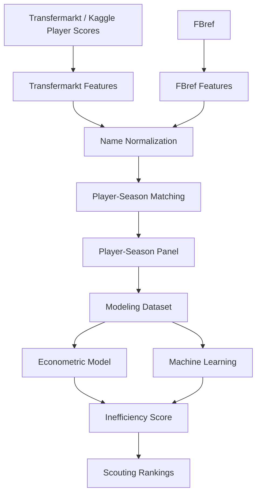

# 📘 Fuentes de datos

<div align="center">


</div>

---

# 📑 Tabla de contenidos

- [🧠 Objetivo del documento](#-objetivo-del-documento)
- [📊 Resumen ejecutivo de fuentes](#-resumen-ejecutivo-de-fuentes)
- [🏗️ Arquitectura de integración](#️-arquitectura-de-integración)
- [💰 Transfermarkt / Kaggle Player Scores](#-transfermarkt--kaggle-player-scores)
- [⚽ FBref](#-fbref)
- [🔗 Integración Transfermarkt ↔ FBref](#-integración-transfermarkt--fbref)
- [📊 Dataset final de modelización](#-dataset-final-de-modelización)
- [📈 Understat](#-understat)
- [🧩 StatsBomb Open Data](#-statsbomb-open-data)
- [🛠️ Decisión sobre scraping directo](#️-decisión-sobre-scraping-directo)
- [🧮 Relación entre fuentes y variables](#-relación-entre-fuentes-y-variables)
- [🚨 Limitaciones actuales](#-limitaciones-actuales)
- [⚖️ Riesgos metodológicos](#️-riesgos-metodológicos)
- [🚀 Próximos pasos sobre fuentes](#-próximos-pasos-sobre-fuentes)
- [🧠 Conclusión](#-conclusión)

---

# 🧠 Objetivo del documento

Este documento describe las fuentes de datos utilizadas en el TFM, su función dentro del sistema analítico, las decisiones metodológicas adoptadas y los riesgos asociados.

El objetivo del proyecto es construir un panel:

```text
jugador–temporada
```

que permita:

- estimar valor de mercado esperado
- detectar ineficiencias de mercado
- generar rankings de scouting
- comparar modelos econométricos y Machine Learning

---

# 📊 Resumen ejecutivo de fuentes

| Fuente | Tipo de información | Uso en el proyecto | Estado |
|---|---|---|---|
| Transfermarkt / Kaggle Player Scores | mercado, edad, club, posición, histórico de valor | target y contexto de mercado | integrada |
| FBref | rendimiento deportivo por jugador y temporada | variables explicativas | integrada |
| Understat | xG, xA y métricas ofensivas avanzadas | enriquecimiento futuro | pendiente |
| StatsBomb Open Data | eventos avanzados | extensión opcional | pendiente |

---

# 🏗️ Arquitectura de integración



---

# 💰 Transfermarkt / Kaggle Player Scores

## Descripción

Transfermarkt es la fuente principal para la dimensión de mercado del proyecto.

En lugar de realizar scraping directo de Transfermarkt, se utiliza el dataset estructurado de Kaggle:

```text
davidcariboo/player-scores
```

Esta decisión mejora:

- reproducibilidad
- trazabilidad
- estabilidad del pipeline
- facilidad de replicación académica

---

## Archivos utilizados

| Archivo | Uso |
|---|---|
| `player_valuations.csv` | valores de mercado históricos |
| `players.csv` | información maestra del jugador |

---

## Variables principales

- `market_value_eur`
- `log_market_value_eur`
- `market_value_prev_eur`
- `market_value_next_eur`
- `market_value_growth_1y`
- `delta_log_market_value_1y`
- `age_tm`
- `player_id_tm`
- `current_club_name_tm`
- `position_tm`
- `sub_position_tm`
- `nationality`

---

## Script principal

```text
src/data/build_transfermarkt_features.py
```

---

## Proceso

1. Carga de `player_valuations.csv`.
2. Carga de `players.csv`.
3. Conversión de fechas.
4. Asignación de valoraciones a temporadas deportivas.
5. Agregación a nivel jugador–temporada.
6. Selección del valor representativo de mercado.
7. Enriquecimiento con información maestra del jugador.
8. Cálculo de `log_market_value_eur`.
9. Generación de variables dinámicas.
10. Normalización de nombres para matching.

---

## Output

```text
data/processed/transfermarkt_features.parquet
```

---

## Estado actual

| Métrica | Valor |
|---|---:|
| Observaciones Transfermarkt procesadas | 616,377 |

---

## Justificación metodológica

El valor de mercado de Transfermarkt se utiliza como proxy del valor observado de mercado.

No representa necesariamente:

- precio real de transferencia
- valor contractual
- valoración interna de un club

pero sí ofrece:

- cobertura histórica
- granularidad suficiente
- comparabilidad entre ligas
- disponibilidad pública
- utilidad como target analítico

---

## Limitaciones

- estimación subjetiva agregada
- posible sesgo de reputación
- posible sesgo de liga
- posible sesgo mediático
- incorporación implícita de expectativas futuras
- reacción no inmediata al rendimiento deportivo

---

# ⚽ FBref

## Descripción

FBref es la fuente principal de rendimiento deportivo.

Aporta métricas por:

- jugador
- temporada
- competición

---

## Variables utilizadas actualmente

| Variable | Uso |
|---|---|
| `minutes_played` | volumen competitivo |
| `goals_per90` | producción ofensiva |
| `assists_per90` | creación ofensiva |
| `player_name_fbref` | identificación |
| `season` | panel temporal |
| `league` | contexto competitivo |
| `club` | contexto / matching |
| `position_group` | efectos fijos / segmentación |

---

## Variables previstas desde FBref

| Variable | Uso futuro |
|---|---|
| `shots_per90` | finalización |
| `progressive_passes_per90` | progresión |
| `progressive_carries_per90` | conducción |
| `tackles_per90` | defensa |
| `interceptions_per90` | defensa |
| `shot_creating_actions_per90` | creación |
| `key_passes_per90` | creación |
| `touches_attacking_third_per90` | participación ofensiva |
| `touches_box_per90` | presencia en área |

---

## Script principal

```text
src/data/build_fbref_features.py
```

---

## Output

```text
data/processed/fbref_features.parquet
```

---

## Estado actual

| Métrica | Valor |
|---|---:|
| Observaciones FBref procesadas | 23,580 |
| Temporadas | 2019-2020 → 2024-2025 |
| Ligas | 7 |

---

## Uso en modelización

En los modelos actuales se utilizan principalmente:

```text
minutes_played
goals_per90
assists_per90
```

Justificación:

- alta disponibilidad
- baja complejidad
- interpretabilidad
- relación directa con valor de mercado

---

## Limitaciones

- diferencias de naming frente a Transfermarkt
- cambios de formato en tablas fuente
- posibles duplicidades por cambios de club
- cobertura variable por temporada
- menor riqueza actual en métricas defensivas y progresivas

---

# 🔗 Integración Transfermarkt ↔ FBref

## Problema central

Transfermarkt y FBref:

```text
NO comparten identificador único común
```

Esto obliga a construir un proceso de matching validado.

---

## Casuísticas problemáticas

- nombres abreviados
- acentos
- transliteraciones
- jugadores homónimos
- cambios de club
- diferencias de edad
- variantes de nombres de clubes

---

## Script de integración

```text
src/data/build_player_season_panel.py
```

---

## Criterios de matching

- nombre normalizado
- temporada
- edad
- club
- similitud fuzzy

---

## Parámetros finales

```python
MAX_AGE_DIFF = 1.5
MIN_CLUB_SCORE = 70
FUZZY_THRESHOLD = 92
```

---

## Resultados finales del matching

| Métrica | Resultado |
|---|---:|
| FBref rows | 23,580 |
| Transfermarkt rows | 616,377 |
| Panel rows | 23,580 |
| Match rate | 88.36% |

---

## Distribución final

| Método | Observaciones |
|---|---:|
| `exact_age_validated` | 18,669 |
| `exact_age_club_validated` | 2,146 |
| `fuzzy_age_club_validated` | 21 |

---

## Output

```text
data/processed/player_season_panel.parquet
```

---

## Variables de trazabilidad

| Variable | Descripción |
|---|---|
| `matching_method` | método de matching |
| `matching_confidence` | confianza del matching |
| `age_diff` | diferencia de edad entre fuentes |
| `club_score` | score de similitud entre clubes |
| `matching_status` | estado del matching |

---

## Decisión metodológica

Se prioriza:

```text
cobertura muestral
```

sobre matching ultra restrictivo.

El riesgo se mitiga mediante:

- confidence score
- robustness checks
- filtros posteriores
- trazabilidad explícita

---

# 📊 Dataset final de modelización

## Archivo

```text
data/processed/player_season_modeling.parquet
```

---

## Script

```text
src/data/build_modeling_dataset.py
```

---

## Resultado final

| Métrica | Valor |
|---|---:|
| Observaciones | 3,297 |
| Jugadores | 1,847 |
| Ligas | 7 |
| Temporadas | 2019-2020 → 2024-2025 |
| Edad | 18–23 |

---

## Uso

Este dataset se utiliza en:

| Notebook | Uso |
|---|---|
| `01_data_understanding.ipynb` | EDA |
| `02_econometric_baseline.ipynb` | baseline econométrico |
| `03_econometric_model.ipynb` | modelo econométrico final |
| `04_supervised_machine_learning.ipynb` | Machine Learning supervisado |

---

# 📈 Understat

## Descripción

Understat proporciona métricas avanzadas de calidad ofensiva:

- Expected Goals
- Expected Assists

---

## Variables previstas

```text
xg_per90
xa_per90
```

---

## Uso previsto

Understat se incorporará para:

- reducir dependencia de goles observados
- medir calidad subyacente
- identificar jugadores con bajo output pero buen proceso ofensivo

---

## Estado

```text
Pendiente de integración
```

---

# 🧩 StatsBomb Open Data

## Descripción

StatsBomb Open Data ofrece datos de eventos avanzados.

---

## Variables potenciales

- presión
- acciones defensivas
- secuencias ofensivas
- pases bajo presión
- eventos espaciales

---

## Decisión metodológica

StatsBomb no se utiliza como fuente core porque su cobertura no es homogénea para:

- ligas objetivo
- temporadas objetivo
- jugadores objetivo

Uso recomendado:

```text
extensión complementaria en submuestras
```

---

# 🛠️ Decisión sobre scraping directo

Se descarta el scraping directo complejo de Transfermarkt como fuente principal.

## Motivos

- fragilidad ante cambios HTML
- mayor coste de mantenimiento
- riesgo de bloqueos
- menor reproducibilidad
- mayor dificultad de replicación académica

---

## Decisión adoptada

Se prioriza:

```text
Kaggle player-scores
```

por:

- estabilidad
- trazabilidad
- reproducibilidad
- facilidad de uso

---

# 🧮 Relación entre fuentes y variables

| Componente | Fuente principal | Variables |
|---|---|---|
| Target | Transfermarkt | `market_value_eur`, `log_market_value_eur` |
| Rendimiento básico | FBref | `minutes_played`, `goals_per90`, `assists_per90` |
| Contexto competitivo | FBref | `league`, `season`, `club`, `position_group` |
| Matching | Interna | `matching_method`, `age_diff`, `club_score` |
| Calidad ofensiva avanzada | Understat | `xg_per90`, `xa_per90` |
| Eventos avanzados | StatsBomb | pendiente |

---

# 🚨 Limitaciones actuales

## Limitaciones de mercado

Transfermarkt mide:

```text
valor estimado
```

no precio real de transferencia.

---

## Limitaciones deportivas

El feature set actual todavía está concentrado en:

- minutos
- goles
- asistencias

---

## Limitaciones contextuales

Aún no se incorporan:

- salarios
- duración contractual
- lesiones
- internacionalidades
- agentes
- cláusulas
- fuerza económica del club

---

## Limitaciones de cobertura

- jugadores con pocos minutos pueden quedar fuera
- jugadores con nombres ambiguos pueden ser más difíciles de emparejar
- cambios de club intra-temporada generan ruido

---

# ⚖️ Riesgos metodológicos

## Variable objetivo

El valor de mercado puede capturar:

- rendimiento
- potencial
- reputación
- club
- liga
- contrato
- agente
- narrativa mediática
- expectativas futuras

---

## Matching

Errores de matching pueden contaminar:

- target
- variables explicativas
- rankings finales

---

## Cobertura

El dataset puede infrarrepresentar:

- jugadores con baja exposición
- porteros
- perfiles defensivos
- ligas con menor consistencia de naming

---

# 🚀 Próximos pasos sobre fuentes

## Corto plazo

- revisar unmatched cases
- guardar tablas de calidad de matching
- documentar ejemplos correctos e incorrectos
- separar variables de matching del modelo ML final

---

## Medio plazo

- enriquecer FBref con métricas avanzadas
- integrar Understat
- añadir xG y xA
- construir índices deportivos por posición

---

## Largo plazo

- evaluar fuentes contractuales
- incorporar lesiones
- incorporar internacionalidades
- construir Growth Score
- evaluar actualización automática

---

# 🧠 Conclusión

El sistema dispone actualmente de una base integrada y modelizable suficientemente robusta para:

- estimar valor esperado de mercado
- construir Inefficiency Score
- generar rankings de scouting
- comparar modelos econométricos y Machine Learning

La integración FBref–Transfermarkt ha sido el principal reto técnico y constituye uno de los aportes centrales del proyecto.

La prioridad actual ya no es la recopilación básica de datos, sino:

- enriquecer el feature engineering
- mejorar la capacidad predictiva
- ampliar variables contextuales
- consolidar outputs de negocio