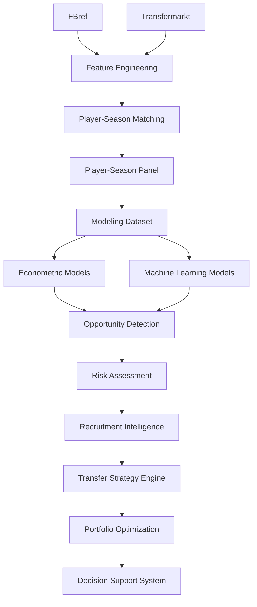

# 📚 Data Sources

## Objetivo

Este documento describe las fuentes de datos utilizadas en la versión **v1.2.0 — Multi-League Expansion**.

Su finalidad es documentar:

* origen de los datos;
* rol de cada fuente dentro de la arquitectura analítica;
* estrategia de integración multi-fuente;
* cobertura temporal y competitiva;
* metodología de matching;
* validación externa;
* limitaciones observadas;
* líneas futuras de expansión.

---

# Resumen ejecutivo

La arquitectura de datos constituye uno de los elementos centrales del proyecto.

El objetivo principal consiste en construir un panel longitudinal de futbolistas profesionales capaz de explicar y predecir el valor de mercado observado mediante la integración de información deportiva y económica procedente de múltiples fuentes.

Durante Sprint 13A se ejecutó una expansión sistemática de cobertura competitiva orientada a evaluar la capacidad de generalización de la metodología fuera del universo inicial de entrenamiento.

La ampliación incorporó cuatro nuevas competiciones profesionales europeas y elevó la cobertura desde siete hasta once ligas, incrementando el dataset modelizable desde 3.916 hasta 5.527 observaciones jugador-temporada (+41,1%).

Los resultados obtenidos muestran que la expansión competitiva no solo aumenta la representatividad del universo analizado, sino que mejora simultáneamente el rendimiento predictivo de los modelos econométricos y de Machine Learning.

Esta evidencia constituye uno de los principales resultados metodológicos de la versión v1.2.0.

---

# Filosofía de integración

El proyecto adopta una estrategia de:

```text
Multi-Source Football Analytics
```

Principio fundamental:

> Ninguna fuente individual contiene toda la señal necesaria para modelizar el valor de mercado de un futbolista profesional.

Por ello se combinan distintas fuentes con funciones complementarias:

* rendimiento deportivo;
* contexto competitivo;
* evolución temporal;
* valoración económica.

La integración multi-fuente permite capturar dimensiones distintas del fenómeno estudiado y reduce la dependencia de una única base de datos.

---

# Objetivo metodológico

La arquitectura de datos se diseñó para responder a la siguiente pregunta:

> ¿Qué jugadores presentan un valor de mercado observado inferior al valor que cabría esperar dadas sus características deportivas, edad, experiencia y rendimiento reciente?

La respuesta requiere combinar:

* información deportiva;
* información económica;
* contexto temporal;
* contexto competitivo.

---

# Arquitectura de integración



---

# Resumen de fuentes

| Fuente              | Rol principal         | Estado    |
| ------------------- | --------------------- | --------- |
| FBref               | Rendimiento deportivo | Integrada |
| Transfermarkt       | Valoración económica  | Integrada |
| Understat           | xG / xA               | Roadmap   |
| StatsBomb Open Data | Event Data            | Roadmap   |

---

# FBref

## Rol dentro del sistema

FBref constituye la principal fuente de información deportiva del proyecto.

Tipo:

```text
Performance Data Source
```

Su función principal es proporcionar variables explicativas capaces de modelizar el valor de mercado esperado de cada futbolista.

---

## Cobertura Sprint 13A.1

La expansión multi-liga ejecutada durante Sprint 13A incrementó significativamente la cobertura competitiva del proyecto.

| Métrica                  |                 Valor |
| ------------------------ | --------------------: |
| Observaciones procesadas |                43.591 |
| Temporadas               |                     7 |
| Ligas                    |                    11 |
| Liga-temporada           |                    77 |
| Cobertura temporal       | 2019-2020 → 2025-2026 |

La ampliación de cobertura constituye la principal fuente de mejora observada en los modelos predictivos de la versión v1.2.0.

---

## Cobertura competitiva

### Ligas históricas

* Premier League
* LaLiga
* Bundesliga
* Serie A
* Ligue 1
* Eredivisie
* Liga Portugal

### Nuevas ligas incorporadas

* Championship
* Belgian Pro League
* Austrian Bundesliga
* Spanish Segunda División

---

## Distribución de observaciones

| Liga                     | Observaciones |
| ------------------------ | ------------: |
| Championship             |         5.244 |
| Spanish Segunda División |         4.778 |
| Serie A                  |         4.313 |
| LaLiga                   |         4.186 |
| Ligue 1                  |         3.990 |
| Liga Portugal            |         3.964 |
| Premier League           |         3.874 |
| Eredivisie               |         3.673 |
| Belgian Pro League       |         3.597 |
| Bundesliga               |         3.547 |
| Austrian Bundesliga      |         2.425 |

---

## Información utilizada

### Producción ofensiva

* goals
* assists
* goals_per90
* assists_per90

### Participación

* minutes_played
* starts
* nineties

### Defensa

* tackles
* interceptions
* blocks

### Contexto competitivo

* league
* club
* position_group

---

## Uso dentro del proyecto

FBref constituye la principal fuente de:

```text
Predictive Features
```

utilizadas por:

* modelos econométricos;
* modelos de Machine Learning;
* Opportunity Detection;
* Risk Assessment;
* Recruitment Intelligence;
* Transfer Strategy Engine.

---

## Auditoría avanzada de variables

Durante Sprint 13A se realizó una auditoría técnica completa de las tablas avanzadas disponibles en FBref.

Tablas evaluadas:

* Shooting
* Passing
* Possession
* Goal & Shot Creation
* Defense
* Miscellaneous
* Playing Time

Esta auditoría constituye la base metodológica de Sprint 13B — Advanced Data Expansion.

---

# Transfermarkt

## Rol dentro del sistema

Transfermarkt constituye la principal fuente económica del proyecto.

Tipo:

```text
Market Valuation Source
```

Su función principal es proporcionar la variable objetivo utilizada durante la modelización.

---

## Información utilizada

### Mercado

* market_value_eur
* historical_market_value

### Contexto

* age
* position
* club

### Información temporal

* valuation_dates
* historical_evolution

---

## Variable objetivo

Variable original:

```text
market_value_eur
```

Transformación utilizada:

```text
log_market_value_eur
```

La transformación logarítmica reduce la asimetría de la distribución y mejora la estabilidad de los modelos predictivos.

---

## Uso dentro del proyecto

Transfermarkt proporciona:

* variable objetivo;
* contexto económico;
* evolución histórica;
* referencia para la detección de ineficiencias de mercado.

---

## Limitaciones conceptuales

El valor de mercado publicado por Transfermarkt incorpora factores no observables directamente en los datos deportivos:

* percepción humana;
* reputación;
* contexto mediático;
* potencial percibido;
* expectativas de mercado.

Por tanto:

```text
Valor de mercado ≠ precio real de transferencia
```

Esta limitación forma parte inherente del problema de investigación y constituye uno de los principales desafíos metodológicos del proyecto.

# Matching Pipeline

## Problema de integración

Uno de los principales retos metodológicos del proyecto es la ausencia de un identificador universal compartido entre FBref y Transfermarkt.

Las dos fuentes utilizan estructuras independientes para identificar jugadores, lo que obliga a implementar una estrategia específica de resolución de entidades.

---

## Restricción principal

Las fuentes:

```text
NO comparten identificador universal
```

Esto genera problemas potenciales asociados a:

* transliteraciones;
* nombres inconsistentes;
* cambios de club;
* cambios de competición;
* diferencias temporales entre fuentes;
* granularidad distinta de los registros.

---

## Riesgos asociados

Un matching incorrecto puede generar:

* false positives;
* false negatives;
* contaminación del dataset;
* sesgo en la modelización;
* pérdida de capacidad predictiva.

Por este motivo se adopta una estrategia conservadora.

Principio metodológico:

```text
Calidad > Cobertura
```

---

## Estrategia implementada

El pipeline de matching sigue la siguiente secuencia:

```text
Normalización
↓
Exact Matching
↓
Club Validation
↓
Fuzzy Matching
↓
Age Validation
```

---

## Algoritmo

Tecnología utilizada:

```text
RapidFuzz
```

---

## Thresholds operativos

```python
MAX_AGE_DIFF = 1.5
MIN_CLUB_SCORE = 70
FUZZY_THRESHOLD = 92
```

Estos parámetros fueron definidos para minimizar errores de emparejamiento sin comprometer excesivamente la cobertura.

---

# Sprint 13A — Multi-League Expansion

## Objetivo

Evaluar la capacidad de generalización de la metodología mediante una ampliación sistemática de cobertura competitiva.

La pregunta metodológica asociada es:

> ¿La metodología mantiene su capacidad explicativa y predictiva cuando se aplica a ligas con diferentes niveles competitivos, estructuras salariales, perfiles de desarrollo y profundidad de mercado?

---

## Contribución principal

Sprint 13A amplía la cobertura competitiva del sistema y evalúa explícitamente la validez externa de la metodología.

A diferencia de releases anteriores, esta fase permite comprobar si los resultados obtenidos dependen exclusivamente del universo inicial de entrenamiento o si generalizan correctamente a nuevos ecosistemas futbolísticos.

---

## Parametrización de pipelines

Durante Sprint 13A se introdujo parametrización explícita para permitir la generación de artefactos completamente reproducibles y versionados.

### build_fbref_features.py

Nuevo argumento:

```text
--output
```

### build_player_season_panel.py

Nuevos argumentos:

```text
--fbref-input
--tm-input
--output
```

### Beneficios

* trazabilidad completa;
* reproducibilidad académica;
* comparación entre releases;
* auditoría de resultados;
* experimentación controlada.

---

## Resultados estructurales

| Métrica                        |  Valor |
| ------------------------------ | -----: |
| Observaciones FBref procesadas | 43.591 |
| Dataset modelizable final      |  5.527 |
| Temporadas                     |      7 |
| Ligas                          |     11 |
| Liga-temporada                 |     77 |
| Match Rate global              | 75,97% |

---

## Resultados predictivos

### Tuned XGBoost

| Dataset  |       RMSE |        MAE |         R² |
| -------- | ---------: | ---------: | ---------: |
| 7 ligas  |     0.8892 |     0.7120 |     0.5414 |
| 11 ligas | **0.8525** | **0.6834** | **0.5664** |

### Growth OLS Temporal

| Dataset  |   RMSE |    MAE |     R² |
| -------- | -----: | -----: | -----: |
| 11 ligas | 0.8689 | 0.6989 | 0.5496 |

---

## Hallazgo principal

La ampliación multi-liga produce simultáneamente:

* mayor cobertura;
* mayor representatividad;
* mejor rendimiento predictivo;
* mayor capacidad de generalización.

La mejora observada afecta tanto a modelos econométricos como a algoritmos de Machine Learning.

Esto sugiere que el incremento de cobertura incorpora señal adicional útil para la estimación del valor de mercado.

---

# Resultados de matching

## Resultado global

| Métrica                        |  Valor |
| ------------------------------ | -----: |
| Observaciones FBref procesadas | 43.591 |
| Match Rate global              | 75,97% |

---

## Match Rate por liga

| Liga                     | Match Rate |
| ------------------------ | ---------: |
| Bundesliga               |     92,75% |
| Premier League           |     92,62% |
| Serie A                  |     91,10% |
| Eredivisie               |     89,95% |
| Ligue 1                  |     89,70% |
| LaLiga                   |     84,26% |
| Belgian Pro League       |     79,68% |
| Liga Portugal            |     75,10% |
| Austrian Bundesliga      |     56,00% |
| Championship             |     50,36% |
| Spanish Segunda División |     43,03% |

---

## Interpretación

Las principales ligas europeas mantienen niveles de matching elevados, generalmente superiores al 84%.

La reducción del match rate global respecto a versiones anteriores se explica principalmente por la incorporación de competiciones secundarias con menor cobertura histórica disponible en Transfermarkt-Kaggle.

La evidencia disponible no apunta a un problema estructural del algoritmo de matching implementado.

---

# Auditoría de cobertura

## Objetivo

Determinar el origen de las pérdidas de matching observadas en determinadas ligas y temporadas.

Fuentes potenciales:

* FBref;
* algoritmo de matching;
* Transfermarkt;
* cobertura temporal disponible.

---

## Evidencia obtenida

Los análisis realizados durante Sprint 13A muestran que una parte relevante de las pérdidas observadas procede de limitaciones de cobertura presentes en Transfermarkt-Kaggle.

El pipeline de matching mantiene niveles elevados de precisión incluso en escenarios de expansión competitiva.

---

## Conclusión

Las limitaciones observadas no parecen derivar del algoritmo de matching ni de la integración FBref-Transfermarkt.

La principal restricción identificada corresponde a la disponibilidad histórica de datos en determinadas competiciones y temporadas.

---

# Cobertura actual

## Cobertura temporal

| Periodo               | Estado    |
| --------------------- | --------- |
| 2019-2020 → 2025-2026 | Integrado |

---

## Cobertura competitiva

| Métrica        | Valor |
| -------------- | ----: |
| Ligas          |    11 |
| Temporadas     |     7 |
| Liga-temporada |    77 |

---

## Universo modelizable

La expansión multi-liga se encuentra plenamente integrada dentro del pipeline de modelización.

| Métrica            |                 Valor |
| ------------------ | --------------------: |
| Observaciones      |                 5.527 |
| Cobertura temporal | 2019-2020 → 2025-2026 |
| Ligas              |                    11 |

El universo utilizado por los modelos predictivos incorpora actualmente todas las ligas integradas durante Sprint 13A.

La mejora observada en los resultados de modelización constituye una evidencia favorable de validez externa para la metodología propuesta.

---

# Arquitectura de almacenamiento

## Estructura general

```text
data/
├── raw/
├── interim/
├── processed/
└── external/
```

---

## Artefactos principales

### Features deportivas

```text
fbref_features_v13a.parquet
```

### Player-Season Panel

```text
player_season_panel_v13a.parquet
```

### Modeling Dataset

```text
player_season_modeling_v13a.parquet
player_season_modeling_indices_v13a.parquet
```

### Evaluación histórica

```text
tuned_xgboost_test_predictions.csv
tuned_xgboost_full_predictions.csv
```

### Current Scouting Layer

```text
tuned_xgboost_predictions.csv
scoring_dataset.csv
scouting_shortlist.csv
scouting_shortlist_with_risk.csv
```

---

# Tracking y trazabilidad

## MLflow

El proyecto incorpora una capa completa de experiment tracking mediante MLflow.

Información registrada:

### Parámetros

* hiperparámetros;
* configuraciones;
* semillas.

### Métricas

* MAE;
* RMSE;
* R²;
* métricas de negocio.

### Artefactos

* modelos;
* gráficos;
* tablas;
* datasets.

Beneficio principal:

```text
Reconstrucción completa de experimentos
```

---

# Trade-offs metodológicos

| Trade-off                             | Decisión                  |
| ------------------------------------- | ------------------------- |
| Cobertura vs precisión                | Priorizar precisión       |
| Matching agresivo vs conservador      | Conservador               |
| Dataset grande vs fiable              | Fiable                    |
| Nuevas fuentes vs robustez            | Integración progresiva    |
| Cobertura competitiva vs homogeneidad | Priorizar validez externa |

---

# Limitaciones actuales

## Transfermarkt

El valor de mercado no representa necesariamente un precio real de transferencia.

La valoración incorpora factores no observables directamente en los datos deportivos.

---

## Matching residual

Siempre existe riesgo residual de matching imperfecto en integraciones multi-fuente sin identificador universal.

---

## Cobertura

Las ligas secundarias y algunas temporadas recientes presentan menor cobertura disponible en Transfermarkt-Kaggle.

---

## Datos avanzados

Actualmente no se incorporan:

* tracking data;
* datos espaciales;
* salarios;
* contratos;
* event data avanzado.

---

# Roadmap

## TM.1 — Transfermarkt Coverage Audit

Estado:

Backlog futuro.

Objetivo:

Determinar si las limitaciones observadas proceden de:

* Transfermarkt-Kaggle;
* Transfermarkt original;
* pipeline de extracción.

---

## Sprint 13B — Advanced Data Expansion

Objetivo:

Incrementar la profundidad analítica y la riqueza informativa del sistema.

### FBref avanzado

* Shooting
* Passing
* Possession
* Goal & Shot Creation
* Defense

### Understat

* xG
* xA
* xGChain
* xGBuildup

### Impacto esperado

* mejora predictiva;
* enriquecimiento del Feature Engineering;
* fortalecimiento del scouting cuantitativo;
* ampliación del benchmarking posicional.

---

## Exploración futura

### StatsBomb Open Data

Posibles líneas:

* pressures;
* recoveries;
* carries;
* progressive actions;
* contexto espacial.

---

# Conclusión

La arquitectura de datos desarrollada combina información deportiva y económica para construir una plataforma integral de Football Analytics orientada a scouting, recruitment y soporte avanzado a decisiones deportivas.

Sprint 13A constituye un punto de inflexión metodológico dentro del proyecto.

La expansión competitiva desde siete hasta once ligas no solo incrementa la cobertura y representatividad del universo analizado, sino que mejora simultáneamente el rendimiento predictivo de los modelos econométricos y de Machine Learning.

La arquitectura actual puede resumirse mediante:

```text
Performance Data
+
Market Data
↓
Matching
↓
Player-Season Panel
↓
Modeling Dataset
↓
Econometric Models
+
Machine Learning Models
↓
Opportunity Detection
↓
Recruitment Intelligence
↓
Transfer Strategy Engine
↓
Portfolio Optimization
↓
Decision Support System
```

Los resultados obtenidos sugieren que la calidad y amplitud de los datos constituyen un factor tan relevante como la complejidad del modelo utilizado.

La prioridad futura no consiste únicamente en incorporar nuevas fuentes, sino en enriquecer la señal disponible manteniendo la trazabilidad, reproducibilidad y robustez metodológica de la arquitectura analítica.
