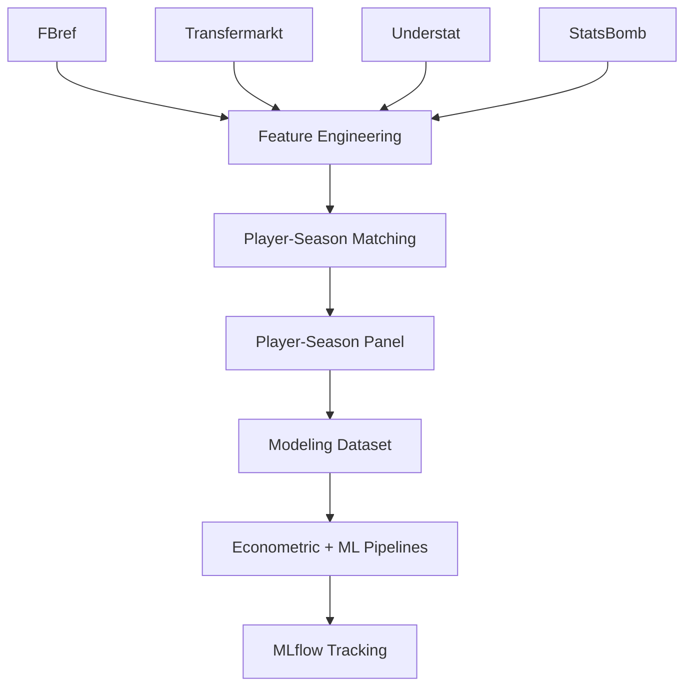

````md id="1m5k2z"
# 📚 Fuentes de datos

<div align="center">


</div>

---

# 📑 Tabla de contenidos

- [🧠 Objetivo del documento](#-objetivo-del-documento)
- [⚙️ Filosofía de integración multi-fuente](#️-filosofía-de-integración-multi-fuente)
- [📊 Resumen de fuentes](#-resumen-de-fuentes)
- [🏗️ Arquitectura de ingestión](#️-arquitectura-de-ingestión)
- [⚽ FBref](#-fbref)
- [💰 Transfermarkt](#-transfermarkt)
- [📈 Understat](#-understat)
- [📊 StatsBomb Open Data](#-statsbomb-open-data)
- [🔗 Problema de integración entre fuentes](#-problema-de-integración-entre-fuentes)
- [🛠️ Estrategia de matching implementada](#️-estrategia-de-matching-implementada)
- [📦 Arquitectura de almacenamiento](#-arquitectura-de-almacenamiento)
- [⚙️ Configuración centralizada](#️-configuración-centralizada)
- [🧪 Tracking experimental y trazabilidad](#-tracking-experimental-y-trazabilidad)
- [📝 Logging y auditoría](#-logging-y-auditoría)
- [📊 Cobertura temporal y competitiva](#-cobertura-temporal-y-competitiva)
- [⚖️ Trade-offs metodológicos](#️-trade-offs-metodológicos)
- [📉 Limitaciones actuales](#-limitaciones-actuales)
- [🚀 Evolución futura prevista](#-evolución-futura-prevista)
- [🧠 Conclusión](#-conclusión)

---

# 🧠 Objetivo del documento

Este documento describe las fuentes de datos utilizadas en el sistema analítico orientado a:

```text id="z1g4jo"
identificar jugadores infravalorados mediante estimación de valor de mercado esperado
```

El objetivo es documentar:

* fuentes utilizadas
* rol de cada fuente
* arquitectura de ingestión
* integración multi-fuente
* limitaciones
* riesgos metodológicos
* calidad de datos
* trazabilidad experimental

---

# ⚙️ Filosofía de integración multi-fuente

El sistema se basa en una arquitectura:

```text id="s4e1d4"
multi-source football analytics
```

---

## Justificación

Ninguna fuente individual proporciona simultáneamente:

* rendimiento deportivo completo
* contexto competitivo
* valoración de mercado
* evolución temporal
* métricas avanzadas

---

## Estrategia adoptada

Combinar:

| Tipo de información   | Fuente        |
| --------------------- | ------------- |
| Rendimiento deportivo | FBref         |
| Valor de mercado      | Transfermarkt |
| xG / xA               | Understat     |
| Eventos avanzados     | StatsBomb     |

---

## Beneficio

La integración multi-fuente permite:

* enriquecer señal predictiva
* reducir sesgos parciales
* construir modelos más robustos
* aproximarse a entornos profesionales de scouting

---

# 📊 Resumen de fuentes

| Fuente              | Tipo de información         | Estado    |
| ------------------- | --------------------------- | --------- |
| FBref               | Rendimiento deportivo       | Integrada |
| Transfermarkt       | Valor de mercado y contexto | Integrada |
| Understat           | xG y xA                     | Pendiente |
| StatsBomb Open Data | Eventos avanzados           | Pendiente |

---

# 🏗️ Arquitectura de ingestión



---

# ⚽ FBref

## Tipo de fuente

```text id="th2dyj"
Performance data source
```

---

## Información utilizada

### Rendimiento ofensivo

* goals
* assists
* shots
* shots_on_target

---

### Rendimiento defensivo

* tackles
* interceptions
* blocks
* aerial duels

---

### Volumen de juego

* minutes_played
* starts
* nineties

---

### Progresión y posesión

* progressive_passes
* progressive_carries
* carries_into_final_third

---

## Uso dentro del proyecto

FBref constituye la principal fuente de:

```text id="epx44x"
variables explicativas del modelo
```

---

## Justificación

FBref ofrece:

* cobertura amplia
* métricas relativamente estandarizadas
* granularidad por temporada
* estadísticas avanzadas accesibles

---

## Limitaciones

* ausencia de identificador universal
* posibles inconsistencias de nombres
* limitación táctica contextual
* menor riqueza que datos event-based completos

---

## Pipeline asociado

<pre>
src/data/ingest_fbref.py
src/data/build_fbref_features.py
</pre>

---

## Output principal

<pre>
data/processed/fbref_features.parquet
</pre>

---

# 💰 Transfermarkt

## Tipo de fuente

```text id="v5x1rz"
Market valuation source
```

---

## Información utilizada

### Mercado

* market_value_eur
* historical_market_value
* transfer history

---

### Contexto

* age
* club
* nationality
* position

---

### Información temporal

* valuation dates
* temporal evolution

---

## Uso dentro del proyecto

Transfermarkt constituye la principal fuente de:

```text id="pnf28m"
variable objetivo del sistema
```

---

## Variable objetivo principal

```python id="mnizlq"
market_value_eur
```

---

## Transformación utilizada

```python id="mjlwm0"
log_market_value_eur
```

---

## Justificación

Transfermarkt es actualmente:

* referencia estándar de mercado
* ampliamente utilizada en sports analytics
* suficientemente granular
* longitudinalmente consistente

---

## Limitaciones

### Subjetividad

El valor de mercado incorpora:

* percepción humana
* contexto mediático
* especulación
* información no observable

---

### No representa

* precio exacto de transferencia
* valor contractual real
* valor económico objetivo absoluto

---

## Pipeline asociado

<pre>
src/data/ingest_transfermarkt.py
src/data/build_transfermarkt_features.py
</pre>

---

## Output principal

<pre>
data/processed/transfermarkt_features.parquet
</pre>

---

# 📈 Understat

## Tipo de fuente

```text id="i0y8l0"
Advanced offensive analytics source
```

---

## Estado actual

```text id="n56qyv"
Pendiente de integración
```

---

## Variables previstas

| Variable  | Descripción            |
| --------- | ---------------------- |
| xG        | Expected Goals         |
| xA        | Expected Assists       |
| xGChain   | Participación ofensiva |
| xGBuildup | Construcción ofensiva  |

---

## Objetivo

Incrementar señal predictiva ofensiva mediante métricas de calidad de ocasiones.

---

## Justificación

xG y xA permiten capturar:

* calidad de ocasiones
* producción subyacente
* rendimiento más estable que goles brutos

---

## Riesgos

* integración compleja
* cobertura parcial
* matching adicional
* consistencia temporal

---

## Integración prevista

<pre>
src/data/ingest_understat.py
</pre>

---

# 📊 StatsBomb Open Data

## Tipo de fuente

```text id="rxl4zn"
Event-based football analytics source
```

---

## Estado actual

```text id="1bzqiw"
Pendiente / extensión futura
```

---

## Variables previstas

| Variable                | Tipo             |
| ----------------------- | ---------------- |
| pressures               | Presión          |
| recoveries              | Recuperación     |
| carries                 | Conducción       |
| passes into final third | Progresión       |
| shot locations          | Calidad ofensiva |

---

## Objetivo

Incorporar:

* contexto táctico
* métricas avanzadas
* eventos espaciales
* señales no disponibles en datasets agregados

---

## Limitaciones

* cobertura incompleta
* complejidad de integración
* granularidad distinta
* mayor coste computacional

---

# 🔗 Problema de integración entre fuentes

## Problema principal

Las fuentes:

```text id="x9fck3"
NO comparten identificador universal
```

---

## Problemas derivados

* transliteraciones
* nombres inconsistentes
* cambios de club
* diferencias temporales
* granularidad distinta

---

## Riesgos

* false positives
* false negatives
* contaminación del dataset
* rankings erróneos

---

## Impacto técnico

El matching representa aproximadamente:

```text id="x6hzsh"
40–50% del esfuerzo técnico total
```

---

# 🛠️ Estrategia de matching implementada

## Pipeline jerárquico

1. normalización
2. matching exacto
3. validación club
4. matching fuzzy
5. validación edad

---

## Algoritmo fuzzy

```text id="v2r7vt"
RapidFuzz
```

---

## Thresholds actuales

```python id="0w3iut"
MAX_AGE_DIFF = 1.5
MIN_CLUB_SCORE = 70
FUZZY_THRESHOLD = 92
```

---

## Variables de auditoría

| Variable            | Función            |
| ------------------- | ------------------ |
| matching_method     | Método utilizado   |
| matching_confidence | Calidad estimada   |
| age_diff            | Diferencia edad    |
| club_score          | Similaridad clubes |

---

## Resultado actual

| Métrica                   | Resultado |
| ------------------------- | --------: |
| Match rate                |    88.36% |
| Observaciones emparejadas |    20,836 |

---

## Decisión metodológica

Se prioriza:

```text id="s2brj4"
precisión y robustez
```

frente a:

```text id="nkj5jz"
máxima cobertura posible
```

---

# 📦 Arquitectura de almacenamiento

## Directorios principales

```text
data/

├── raw/
├── interim/
├── processed/
└── external/
```

---

## Separación conceptual

| Directorio | Función                |
| ---------- | ---------------------- |
| raw        | Datos originales       |
| interim    | Datos intermedios      |
| processed  | Datasets reutilizables |
| external   | Datos auxiliares       |

---

## Outputs analíticos

| Tipo      | Directorio   |
| --------- | ------------ |
| Reports   | `reports/`   |
| Artifacts | `artifacts/` |
| Tracking  | `mlruns/`    |
| Logs      | `logs/`      |

---

## Formato principal

```text id="b9t4sl"
Apache Parquet
```

---

## Justificación

Parquet mejora:

* velocidad
* compresión
* integración analítica
* eficiencia computacional

---

# ⚙️ Configuración centralizada

## Directorio

<pre>
config/
</pre>

---

## Archivos relevantes

| Archivo       | Función      |
| ------------- | ------------ |
| paths.yaml    | Rutas        |
| matching.yaml | Matching     |
| features.yaml | Features     |
| modeling.yaml | Modelización |

---

## Beneficios

La configuración centralizada permite:

* evitar hardcoding
* mantener coherencia
* reproducir ejecuciones
* comparar experimentos
* facilitar mantenimiento

---

## Ejemplo conceptual

```yaml id="6gq67f"
matching:
  max_age_diff: 1.5
  fuzzy_threshold: 92
```

---

# 🧪 Tracking experimental y trazabilidad

## Herramienta utilizada

```text id="lfrx4h"
MLflow
```

---

## Objetivo

Registrar:

* configuraciones
* métricas
* modelos
* artefactos
* outputs

---

## Información registrada

### Parámetros

* features utilizadas
* target
* hiperparámetros
* split temporal

---

### Métricas

* RMSE
* MAE
* R²

---

### Artefactos

* modelos
* rankings
* predicciones
* feature importance

---

## Beneficio metodológico

MLflow permite:

```text id="n2uzph"
reconstruir exactamente qué datos y configuraciones produjeron cada resultado
```

---

# 📝 Logging y auditoría

## Directorio

<pre>
logs/
</pre>

---

## Objetivo

Registrar información operativa de pipelines.

---

## Contenido previsto

* filas procesadas
* warnings
* errores controlados
* paths utilizados
* duración pipelines

---

## Diferencia respecto a MLflow

| Elemento | Función                   |
| -------- | ------------------------- |
| logs     | Trazabilidad operativa    |
| mlruns   | Trazabilidad experimental |

---

# 📊 Cobertura temporal y competitiva

## Cobertura temporal

| Periodo               | Estado    |
| --------------------- | --------- |
| 2019-2020 → 2024-2025 | Integrado |

---

## Cobertura competitiva

| Liga           | Estado    |
| -------------- | --------- |
| Premier League | Integrada |
| LaLiga         | Integrada |
| Bundesliga     | Integrada |
| Serie A        | Integrada |
| Ligue 1        | Integrada |
| Eredivisie     | Integrada |
| Liga Portugal  | Integrada |

---

## Cobertura actual

| Métrica             |  Valor |
| ------------------- | -----: |
| Observaciones panel | 23,580 |
| Dataset modelizable |  3,297 |
| Jugadores únicos    |  1,847 |

---

# ⚖️ Trade-offs metodológicos

## Cobertura vs calidad

Trade-off principal de integración.

---

## Decisión adoptada

Priorizar:

```text id="3xvc1x"
robustez metodológica
```

frente a:

```text id="r4rtgz"
máxima cantidad posible de datos
```

---

## Coste

Se pierden observaciones ambiguas.

---

## Beneficio

Se reduce:

* ruido
* contaminación
* false positives
* rankings incorrectos

---

# 📉 Limitaciones actuales

## Cobertura avanzada

Todavía faltan:

* xG integrado
* xA integrado
* eventos avanzados
* contexto táctico profundo

---

## Subjetividad de mercado

Transfermarkt incorpora inevitablemente:

* percepción humana
* componentes mediáticos
* información no observable

---

## Matching residual

Siempre existe:

```text id="pxcn34"
riesgo residual de matching imperfecto
```

---

## Dataset size

El tamaño actual limita parcialmente:

* modelos muy complejos
* deep learning
* segmentación extrema

---

# 🚀 Evolución futura prevista

## Integraciones prioritarias

### Understat

* xG
* xA
* producción ofensiva subyacente

---

### StatsBomb

* eventos avanzados
* métricas espaciales
* secuencias tácticas

---

## Evolución del feature set

* z-scores posicionales
* percentiles
* progression metrics
* rolling metrics

---

## Explainability

* SHAP
* explicación rankings
* estabilidad variables

---

## Automatización futura

* pipelines automáticos
* actualización periódica
* dashboards
* scoring recurrente

---

# 🧠 Conclusión

La arquitectura de fuentes de datos del proyecto está diseñada para construir un sistema analítico modular y reproducible orientado a scouting cuantitativo.

La combinación de:

* FBref
* Transfermarkt
* matching validado
* configuración centralizada
* tracking experimental con MLflow

permite construir una base metodológicamente robusta para modelización econométrica y Machine Learning aplicada al mercado de fichajes.

El principal reto futuro no será únicamente incorporar más fuentes, sino integrarlas manteniendo:

```text id="scw9az"
coherencia temporal, calidad de matching y robustez metodológica
```