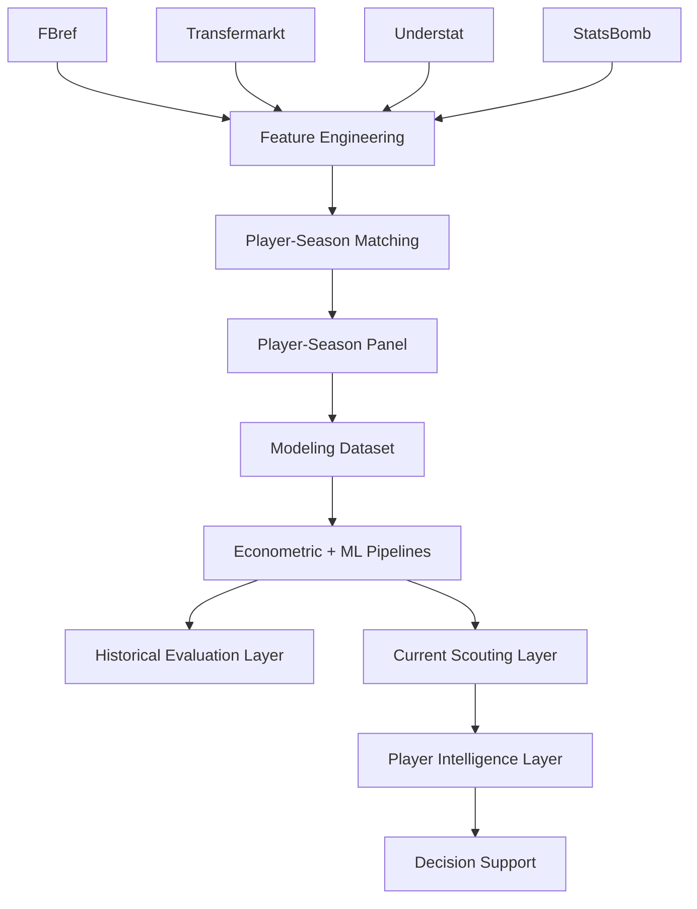

# 📚 Fuentes de Datos

## Objetivo

Este documento describe las fuentes de datos utilizadas en la versión v1.0.0 — Scouting Intelligence Platform.

Su finalidad es documentar:

- origen de los datos
- rol de cada fuente
- integración multi-fuente
- arquitectura de ingestión
- limitaciones metodológicas
- roadmap de enriquecimiento

---

# Filosofía de integración

El proyecto adopta una estrategia:

```text
Multi-Source Football Analytics
```

Principio:

```text
Ninguna fuente individual contiene toda la señal necesaria
para modelizar el valor de mercado de un futbolista.
```

Por ello se combinan distintas fuentes con objetivos complementarios.

---

# Resumen de fuentes

| Fuente | Tipo | Estado |
|----------|----------|----------|
| FBref | Rendimiento deportivo | Integrada |
| Transfermarkt | Valor de mercado | Integrada |
| Understat | xG / xA | Roadmap |
| StatsBomb Open Data | Eventos avanzados | Roadmap |

---

# Arquitectura de integración



---

# FBref

## Rol dentro del sistema

Fuente principal de variables explicativas.

Tipo:

```text
Performance Data Source
```

---

## Información utilizada

### Producción ofensiva

- goals
- assists
- goals_per90
- assists_per90

### Participación

- minutes_played
- starts
- nineties

### Defensa

- tackles
- interceptions
- blocks

### Contexto deportivo

- liga
- club
- posición

---

## Uso en modelización

FBref constituye la principal fuente de:

```text
Features predictivas
```

utilizadas tanto por los modelos econométricos como por los modelos de Machine Learning.

---

## Sprint 10.2 — Advanced Audit

Durante Sprint 10.2 se realizó una auditoría completa de las tablas avanzadas disponibles.

Tablas analizadas:

- Shooting
- Defense
- Misc
- Playing Time
- Passing
- Possession
- Goal & Shot Creation

---

## Resultado de la auditoría

### Alta viabilidad

Variables identificadas:

- shots_per90
- shots_on_target_per90
- tackles_won_per90
- interceptions_per90
- blocks_per90
- fouls_drawn_per90
- crosses_per90

### Viabilidad parcial

- Passing
- Possession
- Goal Creation

---

## Contribución al proyecto

La auditoría constituye la base técnica del futuro:

```text
Advanced Football Radar
```

previsto para Sprint 11.

---

# Transfermarkt

## Rol dentro del sistema

Fuente económica principal.

Tipo:

```text
Market Valuation Source
```

---

## Información utilizada

### Mercado

- market_value_eur
- historical_market_value

### Contexto

- edad
- posición
- club

### Información temporal

- valuation dates
- evolución histórica

---

## Variable objetivo

```python
market_value_eur
```

Transformación:

```python
log_market_value_eur
```

---

## Uso dentro del proyecto

Transfermarkt constituye la fuente de:

```text
Variable objetivo del sistema
```

---

## Limitaciones

El valor de mercado incorpora:

- subjetividad
- percepción humana
- contexto mediático
- factores no observables

Por tanto:

```text
No representa un precio real de transferencia.
```

---

# Understat

## Estado

```text
Roadmap
```

---

## Objetivo

Incorporar métricas avanzadas de producción ofensiva.

Variables previstas:

- xG
- xA
- xGChain
- xGBuildup

---

## Beneficio esperado

Capturar:

- calidad de ocasiones
- producción ofensiva subyacente
- señal más estable que goles observados

---

# StatsBomb Open Data

## Estado

```text
Roadmap
```

---

## Objetivo

Incorporar datos event-based.

Variables previstas:

- pressures
- recoveries
- carries
- passes into final third
- shot locations

---

## Beneficio esperado

Capturar:

- contexto táctico
- comportamiento espacial
- acciones avanzadas

---

# Problema de integración

## Restricción principal

Las fuentes:

```text
NO comparten identificador universal
```

---

## Problemas derivados

- transliteraciones
- nombres inconsistentes
- cambios de club
- diferencias temporales
- granularidad distinta

---

## Riesgos

- false positives
- false negatives
- contaminación del dataset

---

# Matching Pipeline

## Estrategia implementada

```text
Normalización
↓
Matching exacto
↓
Validación por club
↓
Matching fuzzy
↓
Validación por edad
```

---

## Algoritmo

```text
RapidFuzz
```

---

## Thresholds

```python
MAX_AGE_DIFF = 1.5
MIN_CLUB_SCORE = 70
FUZZY_THRESHOLD = 92
```

---

## Resultado actual

| Métrica | Valor |
|----------|----------:|
| Observaciones panel | 24.194 |
| Observaciones emparejadas | 21.245 |
| Match Rate | ≈ 88% |

---

## Decisión metodológica

Principio:

```text
Calidad > Cobertura
```

---

# Cobertura actual

## Cobertura temporal

| Periodo | Estado |
|----------|----------|
| 2019-2020 → 2025-2026 | Integrado |

---

## Cobertura competitiva

- Premier League
- LaLiga
- Bundesliga
- Serie A
- Ligue 1
- Eredivisie
- Liga Portugal

---

## Cobertura modelizable

| Métrica | Valor |
|----------|----------:|
| Observaciones | 3.916 |
| Jugadores únicos | 2.136 |
| Temporadas | 2019-2020 → 2025-2026 |

---

# Arquitectura de almacenamiento

```text
data/

├── raw/
├── interim/
├── processed/
└── external/
```

---

## Outputs principales

### Historical Evaluation Layer

```text
tuned_xgboost_test_predictions.csv
tuned_xgboost_full_predictions.csv
```

### Current Scouting Layer

```text
tuned_xgboost_predictions.csv
scoring_dataset.csv
scouting_shortlist.csv
scouting_shortlist_with_risk.csv
```

---

# Sprint 10 — Impacto sobre fuentes

## Sprint 10.1

Player Intelligence Layer

Consume:

- métricas FBref
- scores operativos
- benchmarking posicional

---

## Sprint 10.2

FBref Advanced Audit

Valida futuras integraciones.

---

## Sprint 10.3

Current Season Refresh

Integra:

```text
Temporada 2025-2026
```

Resultado:

| Métrica | Antes | Después |
|----------|----------:|----------:|
| Observaciones modelizables | 3.297 | 3.916 |
| Cobertura temporal | 2024-2025 | 2025-2026 |

---

# Tracking y trazabilidad

## MLflow

Registra:

- parámetros
- métricas
- modelos
- artefactos

Beneficio:

```text
Reconstrucción completa de experimentos
```

---

# Trade-offs metodológicos

| Trade-off | Decisión |
|----------|-----------|
| Cobertura vs precisión | Priorizar precisión |
| Matching agresivo vs conservador | Conservador |
| Dataset grande vs fiable | Fiable |
| Nuevas fuentes vs robustez | Integración progresiva |
| Evaluación histórica vs operación | Separación Sprint 10 |

---

# Limitaciones actuales

## Pendiente de integración

- xG
- xA
- salarios
- contratos
- datos event-based

---

## Matching residual

Existe siempre:

```text
riesgo residual de matching imperfecto
```

---

## Transfermarkt

Limitación estructural:

```text
Valor de mercado ≠ precio real de transferencia
```

---

# Roadmap

## Sprint 11

Advanced Football Radar

Basado en:

- Shooting
- Defense
- Misc
- Playing Time

---

## Sprint 12

Understat Integration

Variables:

- xG
- xA
- xGChain

---

## Sprint 13

Advanced Data Layer

Exploración:

- StatsBomb
- eventos avanzados
- contexto espacial

---

# Conclusión

La arquitectura de fuentes del proyecto combina datos deportivos y económicos para construir una plataforma integral de Scouting Intelligence.

La incorporación de Sprint 10 amplía el papel de las fuentes más allá de la modelización, permitiendo alimentar:

- Current Scouting Layer
- Player Intelligence Layer
- Risk Framework
- Decision Support Layer

La principal prioridad futura no es incorporar más datos, sino enriquecer la señal manteniendo la calidad de integración y la robustez metodológica del sistema.
