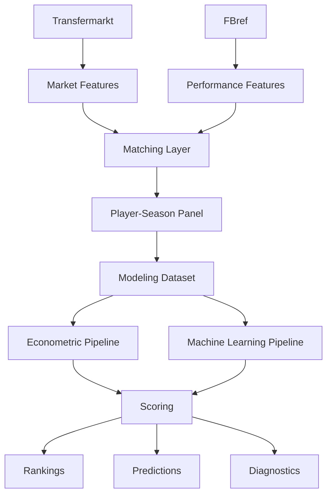

# 📚 Fuentes de datos

<div align="center">


</div>

---

# 📑 Tabla de contenidos

- [🧠 Objetivo del documento](#-objetivo-del-documento)
- [🏗️ Rol de las fuentes dentro de la arquitectura](#️-rol-de-las-fuentes-dentro-de-la-arquitectura)
- [📊 Resumen general de fuentes](#-resumen-general-de-fuentes)
- [⚽ Transfermarkt / Kaggle Player Scores](#-transfermarkt--kaggle-player-scores)
- [📈 FBref](#-fbref)
- [📊 Understat](#-understat)
- [📡 StatsBomb Open Data](#-statsbomb-open-data)
- [🔗 Integración multi-fuente y matching](#-integración-multi-fuente-y-matching)
- [📂 Flujo de datos dentro del sistema](#-flujo-de-datos-dentro-del-sistema)
- [📦 Arquitectura de almacenamiento](#-arquitectura-de-almacenamiento)
- [📈 Uso de las fuentes en modelización](#-uso-de-las-fuentes-en-modelización)
- [🚀 Relación con feature engineering avanzado](#-relación-con-feature-engineering-avanzado)
- [⚠️ Limitaciones de las fuentes](#️-limitaciones-de-las-fuentes)
- [🛡️ Estrategias de mitigación](#️-estrategias-de-mitigación)
- [📌 Evaluación global de las fuentes](#-evaluación-global-de-las-fuentes)
- [🧠 Conclusión](#-conclusión)

---

# 🧠 Objetivo del documento

Este documento describe las fuentes de datos utilizadas en el sistema analítico desarrollado para identificar jugadores infravalorados en el mercado de fichajes europeo.

El objetivo es documentar:

- origen de los datos
- función de cada fuente
- calidad y limitaciones
- decisiones metodológicas
- integración multi-fuente
- relación con la arquitectura modular del proyecto

---

# 🏗️ Rol de las fuentes dentro de la arquitectura

Cada fuente cumple una función específica dentro del sistema.

| Fuente | Rol principal |
|---|---|
| Transfermarkt / Kaggle Player Scores | Target y contexto de mercado |
| FBref | Variables deportivas y feature engineering |
| Understat | Métricas avanzadas ofensivas |
| StatsBomb Open Data | Eventos avanzados y enriquecimiento futuro |

---

## 📌 Separación conceptual

La arquitectura del proyecto separa explícitamente:

- información de mercado
- información deportiva
- información contextual
- outputs derivados
- artefactos de modelización

---

## 📌 Evolución arquitectónica

Inicialmente las fuentes eran utilizadas principalmente desde notebooks exploratorios.

Actualmente:

- alimentan pipelines reproducibles
- generan datasets persistidos
- forman parte de una arquitectura modular
- se integran mediante pipelines desacoplados

La lógica principal reside en:

<pre>
src/
</pre>

---

# 📊 Resumen general de fuentes

| Fuente | Tipo de información | Uso principal | Estado |
|---|---|---|---|
| Transfermarkt / Kaggle Player Scores | Mercado, valor, clubes, edad | Target y contexto de mercado | ✅ Integrada |
| FBref | Rendimiento deportivo | Variables explicativas | ✅ Integrada |
| Understat | xG, xA y métricas avanzadas | Enriquecimiento futuro | ⏳ Pendiente |
| StatsBomb Open Data | Eventos avanzados | Expansión opcional futura | ⏳ No integrada |

---

# ⚽ Transfermarkt / Kaggle Player Scores

## 📌 Descripción

Transfermarkt constituye la principal fuente de información de mercado utilizada en el proyecto.

La integración se realiza mediante datasets estructurados procedentes del proyecto público de Kaggle:

<pre>
davidcariboo/player-scores
</pre>

---

## 📌 Información utilizada

### Mercado

- valor de mercado actual
- histórico de valor
- evolución temporal

---

### Contexto competitivo

- club
- liga
- posición
- edad
- nacionalidad

---

### Historial profesional

- traspasos
- fechas de transferencia
- clubes anteriores

---

## 📌 Uso dentro del sistema

Transfermarkt actúa como:

### Variable objetivo principal

```python
market_value_eur
```

---

### Fuente contextual

Permite incorporar:

* contexto competitivo
* liga
* club
* situación de mercado

---

### Fuente para scoring

El sistema utiliza el valor observado para calcular:

* market value gap
* inefficiency score
* rankings de infravaloración

---

## 📌 Justificación metodológica

Aunque Transfermarkt no representa necesariamente el precio real de transferencia, constituye:

* una referencia pública ampliamente utilizada
* una proxy razonable de valoración de mercado
* una estimación consistente longitudinalmente

---

## 📌 Limitaciones

Transfermarkt puede incorporar:

* sesgo mediático
* reputación
* percepción pública
* exposición internacional
* narrativa de mercado

Por tanto, el target no representa exclusivamente rendimiento deportivo puro.

---

# 📈 FBref

## 📌 Descripción

FBref constituye la principal fuente de métricas deportivas del sistema.

---

## 📌 Información utilizada

### Rendimiento ofensivo

* goles
* asistencias
* goles por 90
* asistencias por 90

---

### Volumen competitivo

* minutos jugados
* titularidades
* partidos disputados

---

### Variables contextuales

* posición
* competición
* temporada

---

## 📌 Uso dentro del sistema

FBref constituye:

<pre>
la principal fuente de feature engineering deportivo
</pre>

---

## 📌 Estado actual de integración

Actualmente se utilizan principalmente:

* goals_per90
* assists_per90
* minutes_played
* log_minutes_played

---

## 📌 Próxima expansión

FBref será la principal fuente para construir:

* progression metrics
* z-scores por posición
* percentiles
* rolling metrics
* métricas progresivas
* métricas defensivas
* trajectory features

---

## 📌 Justificación metodológica

FBref proporciona:

* granularidad adecuada
* cobertura amplia
* métricas estandarizadas
* consistencia longitudinal razonable

---

## 📌 Limitaciones

Las principales limitaciones son:

* cambios estructurales entre temporadas
* cobertura desigual según competición
* diferencias metodológicas históricas
* ausencia de ciertos eventos avanzados

---

# 📊 Understat

## 📌 Descripción

Understat proporciona métricas avanzadas ofensivas basadas en expected goals.

---

## 📌 Variables previstas

* xG
* xA
* np_xG
* xGChain
* xGBuildup

---

## 📌 Estado actual

<pre>
Pendiente de integración
</pre>

---

## 📌 Rol previsto

Understat permitirá enriquecer:

* calidad ofensiva
* calidad de finalización
* creación de ocasiones
* rendimiento ajustado por calidad de tiro

---

## 📌 Justificación metodológica

Las métricas xG y xA ayudan a distinguir entre:

* output observado
* calidad subyacente del rendimiento

Esto resulta especialmente importante en scouting joven, donde:

* pequeñas muestras generan ruido
* la conversión puede ser muy volátil

---

## 📌 Limitaciones

* cobertura pública limitada
* dependencia de scraping
* diferencias metodológicas frente a otras fuentes

---

# 📡 StatsBomb Open Data

## 📌 Descripción

StatsBomb Open Data constituye una posible extensión futura del sistema.

---

## 📌 Información potencial

* eventos
* presión
* secuencias
* recuperaciones
* acciones defensivas avanzadas

---

## 📌 Estado actual

<pre>
No integrada
</pre>

---

## 📌 Uso potencial

Podría permitir:

* modelización táctica
* métricas defensivas avanzadas
* análisis de presión
* enriquecimiento contextual

---

## 📌 Limitaciones

La cobertura pública es limitada respecto a:

* temporadas
* ligas
* jugadores

Por tanto, actualmente no se considera prioritaria frente a la expansión de FBref y Understat.

---

# 🔗 Integración multi-fuente y matching

## 📌 Problema estructural

FBref y Transfermarkt:

<pre>
NO comparten identificador único
</pre>

Esto convierte la integración en uno de los principales retos técnicos del proyecto.

---

## 📌 Problemas detectados

* transliteraciones
* nombres inconsistentes
* cambios de club
* granularidad distinta
* edades no alineadas
* homónimos

---

## 📌 Estrategia implementada

Se desarrolló un pipeline jerárquico de matching basado en:

1. normalización
2. matching exacto
3. validación por edad
4. validación por club
5. fuzzy matching residual

---

## 📌 Thresholds utilizados

```python
MAX_AGE_DIFF = 1.5
MIN_CLUB_SCORE = 70
FUZZY_THRESHOLD = 92
```

---

## 📌 Resultados actuales

| Métrica                   | Resultado |
| ------------------------- | --------: |
| Match rate                |    88.36% |
| Observaciones emparejadas |    20,836 |

---

## 📌 Interpretación

El matching exacto domina claramente la muestra final.

El fuzzy matching queda restringido a casos ambiguos específicos para minimizar:

* false positives
* contaminación del target
* ruido analítico

---

# 📂 Flujo de datos dentro del sistema



---

# 📦 Arquitectura de almacenamiento

La arquitectura separa explícitamente:

| Capa              | Directorio        |
| ----------------- | ----------------- |
| Raw data          | `data/raw/`       |
| Datos intermedios | `data/interim/`   |
| Datos procesados  | `data/processed/` |
| Artefactos        | `artifacts/`      |
| Outputs           | `reports/`        |

---

## 📌 Beneficios

Esta separación mejora:

* trazabilidad
* reproducibilidad
* mantenibilidad
* auditoría metodológica

---

# 📈 Uso de las fuentes en modelización

## Econometría

### Transfermarkt

* target
* fixed effects contextuales

---

### FBref

* rendimiento deportivo
* volumen competitivo
* variables explicativas

---

## Machine Learning

Las fuentes permiten construir:

* variables numéricas
* variables categóricas
* features derivadas
* features longitudinales futuras

---

## Scoring

Las predicciones generadas se combinan con:

```python
market_value_eur
```

para construir:

* market value gap
* inefficiency score
* rankings scouting

---

# 🚀 Relación con feature engineering avanzado

La siguiente fase del proyecto depende principalmente de ampliar la señal deportiva disponible.

---

## FBref

Será la principal fuente para:

* progression metrics
* z-scores por posición
* percentiles
* rolling metrics
* métricas defensivas
* métricas progresivas

---

## Understat

Permitirá incorporar:

* xG
* xA
* calidad ofensiva subyacente

---

## Objetivo

Mejorar:

<pre>
signal predictivo del sistema
</pre>

más que añadir algoritmos más complejos prematuramente.

---

# ⚠️ Limitaciones de las fuentes

## Transfermarkt

### Riesgos

* subjetividad parcial
* sesgo reputacional
* influencia mediática
* efecto liga

---

## FBref

### Riesgos

* cambios estructurales
* diferencias históricas
* cobertura desigual
* posibles inconsistencias menores

---

## Understat

### Riesgos

* cobertura parcial
* dependencia de scraping
* limitaciones públicas

---

## StatsBomb

### Riesgos

* cobertura limitada
* baja escalabilidad actual
* escasa prioridad relativa

---

# 🛡️ Estrategias de mitigación

## Matching robusto

* validación por edad
* validación por club
* fuzzy matching residual
* thresholds conservadores

---

## Robustez econométrica

* league FE
* season FE
* position FE
* validación temporal

---

## Control de leakage

* separación temporal train/test
* exclusión de variables futuras
* separación entre dataset base y outputs derivados

---

## Reproducibilidad

* pipelines modulares
* outputs persistidos
* configuración centralizada
* arquitectura desacoplada

---

# 📌 Evaluación global de las fuentes

| Dimensión                    | Evaluación    |
| ---------------------------- | ------------- |
| Cobertura competitiva        | Alta          |
| Cobertura temporal           | Alta          |
| Calidad matching             | Alta          |
| Robustez contextual          | Alta          |
| Calidad target mercado       | Moderada-Alta |
| Cobertura métricas avanzadas | Media         |
| Escalabilidad futura         | Alta          |

---

# 🧠 Conclusión

El sistema se construye sobre una arquitectura multi-fuente donde:

* Transfermarkt aporta contexto y target de mercado
* FBref aporta señal deportiva
* Understat enriquecerá métricas avanzadas
* StatsBomb constituye una posible extensión futura

La principal complejidad técnica del proyecto ha sido la integración robusta entre fuentes sin identificador común.

La evolución desde notebooks exploratorios hacia pipelines modulares reproducibles mejora significativamente:

* calidad metodológica
* trazabilidad
* mantenibilidad
* replicabilidad

Aunque las fuentes públicas presentan limitaciones inherentes, el sistema actual proporciona una base suficientemente sólida para:

* econometría aplicada
* machine learning supervisado
* scouting cuantitativo
* análisis de ineficiencias de mercado
* desarrollo futuro de herramientas analíticas profesionales
