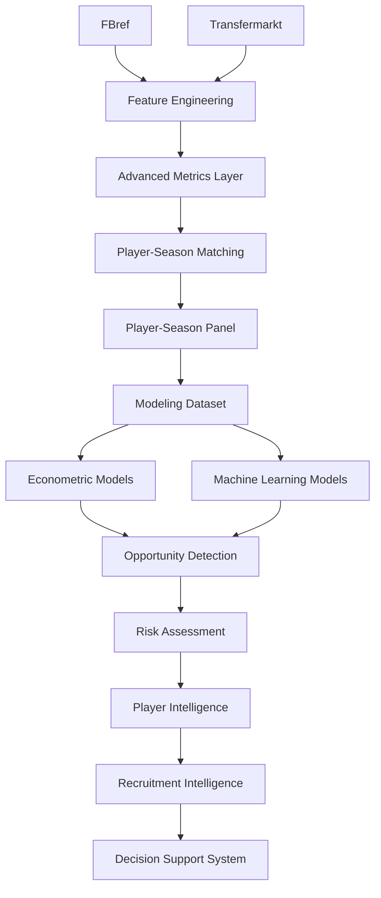

# 📚 Data Sources

## Objetivo

Este documento describe las fuentes de datos utilizadas en la versión:

```text
v2.0.0 — DSS Architecture, Data Contracts & Productization
```

Su finalidad es documentar:

* origen de los datos;
* rol de cada fuente dentro de la arquitectura analítica;
* estrategia de integración multi-fuente;
* cobertura temporal y competitiva;
* metodología de matching;
* validación externa;
* integración de métricas avanzadas;
* limitaciones observadas;
* líneas futuras de evolución.

---

# Resumen ejecutivo

La arquitectura de datos constituye uno de los pilares fundamentales del proyecto.

El objetivo principal consiste en construir un panel longitudinal de futbolistas profesionales capaz de explicar y estimar el valor de mercado observado mediante la integración de información deportiva y económica procedente de múltiples fuentes.

Durante Sprint 13A se ejecutó una expansión sistemática de cobertura competitiva orientada a evaluar la capacidad de generalización de la metodología fuera del universo inicial de entrenamiento.

Posteriormente, Sprint 13B amplió la profundidad informativa disponible mediante la integración de métricas avanzadas derivadas de FBref.

La combinación de ambas fases permitió:

* ampliar cobertura competitiva;
* incrementar representatividad;
* fortalecer validez externa;
* enriquecer la señal predictiva disponible;
* mejorar simultáneamente econometría y Machine Learning.

---

## Estado actual

| Métrica                        |  Valor |
| ------------------------------ | -----: |
| Observaciones FBref procesadas | 43.591 |
| Dataset modelizable            |  5.527 |
| Ligas                          |     11 |
| Temporadas                     |      7 |
| Liga-temporada                 |     77 |
| Match Rate global              | 75,97% |

---

# Filosofía de integración

El proyecto adopta una estrategia de:

```text
Multi-Source Football Analytics
```

Principio fundamental:

> Ninguna fuente individual contiene toda la información necesaria para modelizar el valor de mercado de un futbolista profesional.

Por ello se combinan fuentes con funciones complementarias:

* rendimiento deportivo;
* contexto competitivo;
* evolución temporal;
* valoración económica.

---

# Objetivo metodológico

La arquitectura de datos fue diseñada para responder a la pregunta central del proyecto:

> ¿Qué jugadores presentan un valor de mercado observado inferior al valor que cabría esperar dadas sus características deportivas, edad, experiencia y rendimiento reciente?

Responder a esta pregunta requiere combinar simultáneamente:

* información deportiva;
* información económica;
* contexto temporal;
* contexto competitivo.

---

# Arquitectura de integración



---

# Resumen de fuentes

| Fuente              | Rol principal         | Estado               |
| ------------------- | --------------------- | -------------------- |
| FBref               | Rendimiento deportivo | Integrada            |
| Transfermarkt       | Valoración económica  | Integrada            |
| Understat           | xG / xA               | Investigación futura |
| StatsBomb Open Data | Event Data            | Investigación futura |

---

# FBref

## Rol dentro del sistema

FBref constituye la principal fuente deportiva del proyecto.

Tipo:

```text
Performance Data Source
```

Su función principal consiste en proporcionar variables explicativas capaces de modelizar el valor de mercado esperado de cada futbolista.

---

## Cobertura actual

| Métrica                  |                 Valor |
| ------------------------ | --------------------: |
| Observaciones procesadas |                43.591 |
| Temporadas               |                     7 |
| Ligas                    |                    11 |
| Liga-temporada           |                    77 |
| Cobertura temporal       | 2019-2020 → 2025-2026 |

---

## Cobertura competitiva

### Ligas históricas

* Premier League
* LaLiga
* Bundesliga
* Serie A
* Ligue 1
* Eredivisie
* Liga Portugal

### Ligas incorporadas en Sprint 13A

* Championship
* Belgian Pro League
* Austrian Bundesliga
* Spanish Segunda División

---

## Distribución de observaciones

| Liga                     | Observaciones |
| ------------------------ | ------------: |
| Championship             |         5.244 |
| Spanish Segunda División |         4.778 |
| Serie A                  |         4.313 |
| LaLiga                   |         4.186 |
| Ligue 1                  |         3.990 |
| Liga Portugal            |         3.964 |
| Premier League           |         3.874 |
| Eredivisie               |         3.673 |
| Belgian Pro League       |         3.597 |
| Bundesliga               |         3.547 |
| Austrian Bundesliga      |         2.425 |

---

## Información utilizada

### Producción ofensiva

* goals
* assists
* goals_per90
* assists_per90

---

### Participación

* minutes_played
* starts
* nineties

---

### Defensa

* tackles
* interceptions
* blocks

---

### Contexto competitivo

* league
* club
* position_group

---

## Métricas avanzadas integradas en Sprint 13B

Sprint 13B incorpora una nueva capa de información derivada de tablas avanzadas de FBref.

Tablas auditadas:

* Shooting
* Passing
* Possession
* Goal & Shot Creation
* Defense
* Miscellaneous
* Playing Time

---

### Variables promovidas a producción

* finishing_index_v2
* availability_index
* defensive_activity_index

---

### Resultado observado

Las nuevas variables producen mejoras simultáneas en:

* econometría;
* XGBoost;
* Random Forest;
* HistGradientBoosting;
* LightGBM.

---

### Hallazgo principal

```text
finishing_index_v2
```

aparece como la variable avanzada con mayor relevancia predictiva agregada.

---

## Uso dentro del proyecto

FBref constituye la principal fuente de:

```text
Predictive Features
```

utilizadas por:

* modelos econométricos;
* modelos de Machine Learning;
* Opportunity Detection;
* Risk Assessment;
* Player Intelligence;
* Recruitment Intelligence.

---

# Transfermarkt

## Rol dentro del sistema

Transfermarkt constituye la principal fuente económica del proyecto.

Tipo:

```text
Market Valuation Source
```

Su función principal consiste en proporcionar la variable objetivo utilizada durante la modelización.

---

## Información utilizada

### Mercado

* market_value_eur
* historical_market_value

---

### Contexto

* age
* position
* club

---

### Información temporal

* valuation_dates
* historical_evolution

---

## Variable objetivo

Variable original:

```text
market_value_eur
```

Transformación utilizada:

```text
log_market_value_eur
```

La transformación logarítmica reduce la asimetría de la distribución y mejora la estabilidad estadística de los modelos.

---

## Uso dentro del proyecto

Transfermarkt proporciona:

* variable objetivo;
* contexto económico;
* evolución histórica;
* referencia para detección de ineficiencias de mercado.

---

## Limitaciones conceptuales

El valor de mercado publicado por Transfermarkt incorpora factores no observables directamente en los datos deportivos:

* reputación;
* percepción humana;
* contexto mediático;
* potencial percibido;
* expectativas de mercado.

Por tanto:

```text
Valor de mercado ≠ precio real de transferencia
```

Esta limitación constituye una característica inherente al problema de investigación y no un defecto de la fuente.

# 🔗 Matching Pipeline

## Problema de integración

Uno de los principales retos metodológicos del proyecto es la ausencia de un identificador universal compartido entre FBref y Transfermarkt.

Las dos fuentes utilizan estructuras independientes para identificar jugadores, lo que obliga a implementar una estrategia específica de resolución de entidades.

---

## Restricción principal

Las fuentes:

```text id="q1jlwm"
NO comparten identificador universal
```

Esto genera problemas potenciales asociados a:

* transliteraciones;
* nombres inconsistentes;
* cambios de club;
* cambios de competición;
* diferencias temporales entre fuentes;
* granularidad distinta de los registros.

---

## Riesgos asociados

Un matching incorrecto puede generar:

* false positives;
* false negatives;
* contaminación del dataset;
* sesgo en la modelización;
* pérdida de capacidad predictiva.

Por este motivo se adopta una estrategia conservadora.

Principio metodológico:

```text id="2g3nkt"
Calidad > Cobertura
```

---

## Estrategia implementada

El pipeline de matching sigue la siguiente secuencia:

```text id="0rrr1l"
Normalización
↓
Exact Matching
↓
Club Validation
↓
Fuzzy Matching
↓
Age Validation
```

---

## Algoritmo

Tecnología utilizada:

```text id="h7yq99"
RapidFuzz
```

---

## Thresholds operativos

```python id="5sbc6o"
MAX_AGE_DIFF = 1.5
MIN_CLUB_SCORE = 70
FUZZY_THRESHOLD = 92
```

Estos parámetros fueron definidos para minimizar errores de emparejamiento sin comprometer excesivamente la cobertura disponible.

---

# 🌍 Sprint 13A — Multi-League Expansion

## Objetivo

Evaluar la capacidad de generalización de la metodología mediante una ampliación sistemática de cobertura competitiva.

Pregunta metodológica:

> ¿La metodología mantiene su capacidad explicativa y predictiva cuando se aplica a ligas con diferentes niveles competitivos, estructuras salariales, perfiles de desarrollo y profundidad de mercado?

---

## Contribución principal

Sprint 13A amplía la cobertura competitiva del sistema y evalúa explícitamente la validez externa de la metodología.

Por primera vez se comprueba si los resultados obtenidos generalizan correctamente fuera del universo competitivo original.

---

## Parametrización de pipelines

Durante Sprint 13A se introdujo parametrización explícita para permitir la generación de artefactos completamente reproducibles.

### build_fbref_features.py

Nuevo argumento:

```text id="c0h44u"
--output
```

---

### build_player_season_panel.py

Nuevos argumentos:

```text id="kw0f5z"
--fbref-input
--tm-input
--output
```

---

### Beneficios

* trazabilidad completa;
* reproducibilidad académica;
* comparación entre releases;
* auditoría de resultados;
* experimentación controlada.

---

## Resultados estructurales

| Métrica                        |  Valor |
| ------------------------------ | -----: |
| Observaciones FBref procesadas | 43.591 |
| Dataset modelizable final      |  5.527 |
| Temporadas                     |      7 |
| Ligas                          |     11 |
| Liga-temporada                 |     77 |
| Match Rate global              | 75,97% |

---

## Resultados predictivos

### Tuned XGBoost

| Dataset  |       RMSE |        MAE |         R² |
| -------- | ---------: | ---------: | ---------: |
| 7 ligas  |     0.8892 |     0.7120 |     0.5414 |
| 11 ligas | **0.8525** | **0.6834** | **0.5664** |

---

### Hallazgo principal

La expansión multi-liga produce simultáneamente:

* mayor cobertura;
* mayor representatividad;
* mejor rendimiento predictivo;
* mayor capacidad de generalización.

La mejora observada constituye una evidencia favorable de validez externa.

---

# 🔬 Sprint 13B — Advanced Data Expansion

## Objetivo

Evaluar si la incorporación de métricas avanzadas derivadas de FBref aporta capacidad predictiva adicional a los modelos de valoración de mercado.

---

## Variables incorporadas

Sprint 13B introduce tres nuevas variables productivas:

* finishing_index_v2
* availability_index
* defensive_activity_index

Estas variables proceden de la nueva capa:

```text id="f29z54"
Advanced Metrics Layer
```

incorporada a la arquitectura de datos.

---

## Resultados econométricos

| Modelo                |     R² |
| --------------------- | -----: |
| M_A_v13A_base_spec_FE | 0.4505 |
| M_B_v13B_advanced_FE  | 0.4549 |

Resultado:

```text id="3bgc9i"
ΔR² = +0.0044
```

---

## Resultados Machine Learning

| Modelo               | Mejora observada |
| -------------------- | ---------------: |
| XGBoost              |          +0.0096 |
| Random Forest        |          +0.0097 |
| HistGradientBoosting |          +0.0144 |
| LightGBM             |          +0.0291 |

---

## Hallazgo principal

Todas las arquitecturas evaluadas mejoran simultáneamente tras incorporar las nuevas variables.

La variable avanzada con mayor relevancia predictiva agregada es:

```text id="pl0sqt"
finishing_index_v2
```

---

## Conclusión

La hipótesis principal de Sprint 13B queda validada.

Las métricas avanzadas derivadas de FBref aportan señal predictiva incremental consistente tanto en econometría como en Machine Learning.

---

# 📊 Resultados de matching

## Resultado global

| Métrica                        |  Valor |
| ------------------------------ | -----: |
| Observaciones FBref procesadas | 43.591 |
| Match Rate global              | 75,97% |

---

## Match Rate por liga

| Liga                     | Match Rate |
| ------------------------ | ---------: |
| Bundesliga               |     92,75% |
| Premier League           |     92,62% |
| Serie A                  |     91,10% |
| Eredivisie               |     89,95% |
| Ligue 1                  |     89,70% |
| LaLiga                   |     84,26% |
| Belgian Pro League       |     79,68% |
| Liga Portugal            |     75,10% |
| Austrian Bundesliga      |     56,00% |
| Championship             |     50,36% |
| Spanish Segunda División |     43,03% |

---

## Interpretación

Las principales ligas europeas mantienen niveles elevados de matching.

La reducción del match rate agregado se explica principalmente por limitaciones históricas de cobertura disponibles en Transfermarkt-Kaggle para determinadas competiciones secundarias.

La evidencia disponible no apunta a degradación del algoritmo de matching.

---

# 🔍 Auditoría de cobertura

## Objetivo

Determinar el origen de las pérdidas de matching observadas en determinadas ligas y temporadas.

Fuentes potenciales:

* FBref;
* algoritmo de matching;
* Transfermarkt;
* cobertura temporal disponible.

---

## Evidencia obtenida

Los análisis realizados durante Sprint 13A muestran que una parte relevante de las pérdidas observadas procede de limitaciones de cobertura presentes en Transfermarkt-Kaggle.

---

## Conclusión

Las limitaciones observadas no parecen derivar del algoritmo de matching ni de la integración FBref-Transfermarkt.

La principal restricción identificada corresponde a disponibilidad histórica de datos.

---

# 📦 Cobertura actual

## Cobertura temporal

| Periodo               | Estado    |
| --------------------- | --------- |
| 2019-2020 → 2025-2026 | Integrado |

---

## Cobertura competitiva

| Métrica        | Valor |
| -------------- | ----: |
| Ligas          |    11 |
| Temporadas     |     7 |
| Liga-temporada |    77 |

---

## Universo modelizable

| Métrica            |                 Valor |
| ------------------ | --------------------: |
| Observaciones      |                 5.527 |
| Cobertura temporal | 2019-2020 → 2025-2026 |
| Ligas              |                    11 |

---

# 🗄️ Arquitectura de almacenamiento

## Estructura general

```text id="w8czrn"
data/
├── raw/
├── interim/
├── processed/
└── external/
```

---

## Artefactos principales

### Features deportivas

```text id="wnol2o"
fbref_features_v13a.parquet
```

---

### Player-Season Panel

```text id="p9gxts"
player_season_panel_v13a.parquet
```

---

### Modeling Datasets

```text id="d75yc9"
player_season_modeling_v13a.parquet

player_season_modeling_v13b_advanced.parquet

player_season_modeling_v13b_productive_candidate.parquet
```

---

### Evaluación histórica

```text id="j4jl0e"
tuned_xgboost_test_predictions.csv

tuned_xgboost_full_predictions.csv
```

---

### Current Scouting Layer

```text id="c5f7pb"
tuned_xgboost_predictions.csv
```

---

# 🔄 Tracking y trazabilidad

## MLflow

El proyecto incorpora una capa completa de experiment tracking mediante MLflow.

---

### Parámetros

* hiperparámetros;
* configuraciones;
* semillas;
* versiones de datasets;
* feature sets.

---

### Métricas

* MAE;
* RMSE;
* R²;
* métricas de negocio;
* métricas de matching.

---

### Artefactos

* modelos;
* gráficos;
* tablas;
* predicciones;
* explainability.

---

## Beneficio principal

```text id="2hmygk"
Reconstrucción completa
de experimentos
```

---

# ⚖️ Trade-offs metodológicos

| Trade-off                             | Decisión                  |
| ------------------------------------- | ------------------------- |
| Cobertura vs precisión                | Priorizar precisión       |
| Matching agresivo vs conservador      | Conservador               |
| Dataset grande vs fiable              | Fiable                    |
| Nuevas fuentes vs robustez            | Integración progresiva    |
| Cobertura competitiva vs homogeneidad | Priorizar validez externa |
| Nuevas variables vs sobreajuste       | Validación multi-modelo   |

---

# ⚠️ Limitaciones actuales

## Transfermarkt

El valor de mercado no representa necesariamente un precio real de transferencia.

---

## Matching residual

Siempre existe riesgo residual de matching imperfecto en integraciones multi-fuente sin identificador universal.

---

## Cobertura

Las ligas secundarias presentan menor cobertura disponible en Transfermarkt-Kaggle.

---

## Datos avanzados

Actualmente no se incorporan:

* tracking data;
* datos espaciales;
* salarios;
* contratos;
* event data avanzado.

---

## Integración de scoring

Durante Sprint 13B se identificó una separación estructural entre:

```text id="qm3v55"
Modeling Pipeline
≠
Scoring Pipeline
```

La integración completa queda documentada como:

```text id="r85rdz"
TM.2 — Scoring & Ranking Integration v13B
```

sin afectar a la validez metodológica de Sprint 13B.

---

# 🗂️ Roadmap histórico

> Este bloque reproduce la planificación posterior a 13B. TM.2 y Sprint 14 están completados; el roadmap vigente se centraliza en [project_evolution.md](project_evolution.md#roadmap-vigente).

## TM.1 — Transfermarkt Coverage Audit

Objetivo:

* diagnosticar limitaciones de cobertura;
* estimar techo teórico de matching;
* mejorar integración de datos.

---

## TM.2 — Scoring & Ranking Integration v13B — completado

Objetivo:

```text id="ycjxhh"
Predictions v13B
↓
Scoring Dataset v13B
↓
Opportunity Framework v13B
↓
Risk Framework v13B
↓
Rankings v13B
```

---

## Sprint 14 — Transfer Strategy Enhancement — completado

Próxima fase principal del proyecto.

Líneas previstas:

* Transfer Strategy Engine.
* Portfolio Optimization.
* Scenario Simulation.
* Strategic Recruitment.

---

## Investigación futura

### Datos

* nuevas métricas avanzadas FBref;
* event data avanzado;
* tracking data;
* información contractual;
* datos salariales.

### Modelización

* TabPFN;
* CatBoost;
* ensemble learning.

---

# 🏁 Conclusión

La arquitectura de datos desarrollada combina información deportiva y económica para construir una plataforma integral de Football Analytics orientada a scouting, recruitment y soporte avanzado a decisiones deportivas.

Sprint 13A constituye la principal contribución relacionada con cobertura y validez externa.

Sprint 13B constituye la principal contribución relacionada con profundidad analítica y calidad informativa.

La evolución puede resumirse mediante:

```text id="e1wlcn"
Performance Data
+
Market Data
↓
Advanced Metrics Layer
↓
Matching
↓
Player-Season Panel
↓
Modeling Dataset
↓
Econometric Models
+
Machine Learning Models
↓
Opportunity Detection
↓
Risk Assessment
↓
Player Intelligence
↓
Recruitment Intelligence
↓
Decision Support System
```

Los resultados obtenidos muestran que la calidad y riqueza de los datos constituyen un factor tan relevante como la complejidad de los algoritmos utilizados.

La release:

```text id="i8j86o"
v2.0.0 — DSS Architecture, Data Contracts & Productization
```

consolida una arquitectura de datos más amplia, más profunda y metodológicamente más robusta que cualquier versión anterior del proyecto.

## Consumo de fuentes en v2.0.0

La release distingue la función temporal de cada fuente. FBref y el panel Transfermarkt histórico alimentan el modelado jugador-temporada; el snapshot actual de Transfermarkt alimenta contexto de club, liga, valor y contrato para el DSS. Ambas ramas se unen mediante identidad canónica, no mediante sobrescritura de columnas históricas.

Las imágenes y escudos son activos de presentación y no autoridades analíticas. Su ausencia activa un recurso visual predeterminado, pero nunca altera el matching, los scores o el contexto del jugador.

Las futuras capas UEFA, selecciones, competiciones europeas y lesiones permanecen fuera de la autoridad productiva hasta superar sus propios controles de cobertura, temporalidad y licencia.
