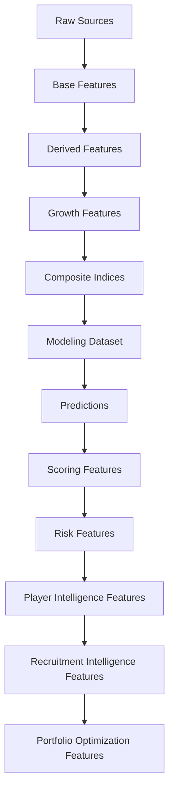

# 🧪 Feature Engineering

## Objetivo

Este documento describe la estrategia de Feature Engineering implementada en la release:

```text
v1.1.0 — Strategic Recruitment & Decision Support System
```

Su finalidad es documentar:

* variables utilizadas
* transformaciones aplicadas
* decisiones metodológicas
* evolución por sprints
* prevención de leakage
* soporte a modelización
* soporte a scoring
* soporte a recruitment intelligence
* soporte a portfolio optimization

---

# Filosofía

Principio central:

```text
Incrementar señal predictiva
sin incrementar complejidad innecesaria.
```

La estrategia de Feature Engineering se orienta a construir variables que capturen:

* rendimiento deportivo
* contexto competitivo
* trayectoria profesional
* potencial de crecimiento
* robustez analítica
* riesgo
* valor estratégico

El objetivo no es únicamente mejorar R² o RMSE, sino alimentar correctamente:

```text
Modelización
↓
Scoring
↓
Player Intelligence
↓
Recruitment Intelligence
↓
Transfer Strategy Engine
↓
Decision Support System
```

---

# Estado actual

La plataforma incorpora actualmente:

* features ofensivas
* features defensivas
* contexto competitivo
* variables longitudinales
* growth features
* composite indices
* scoring features
* risk features
* recruitment features
* portfolio optimization features
* business evaluation features

Dataset actual:

| Métrica            |                 Valor |
| ------------------ | --------------------: |
| Observaciones      |                 3.916 |
| Jugadores únicos   |                 2.136 |
| Cobertura temporal | 2019-2020 → 2025-2026 |

---

# Arquitectura de Feature Engineering



---

# Features actuales

## Producción ofensiva

* goals
* assists
* goals_per90
* assists_per90
* g_a_per90
* shots_per90

---

## Volumen competitivo

* minutes_played
* log_minutes_played
* starts
* nineties

---

## Contexto

* age
* league
* season
* club
* position_group

---

## Features defensivas

* tackles_per90
* interceptions_per90
* blocks_per90
* aerial_duels_won_pct

---

## Matching & Quality

* matching_confidence
* matching_method
* age_diff
* club_score

Estas variables alimentan directamente la construcción del Confidence Score.

---

# Features derivadas

## Transformaciones logarítmicas

### log_market_value_eur

Target principal.

### log_minutes_played

Proxy de exposición competitiva.

---

## Transformaciones de edad

### age_squared

Captura relaciones no lineales asociadas al ciclo de vida del jugador.

---

## Trayectoria

### career_year

Proxy de experiencia.

### breakout_indicator

Detecta explosiones tempranas de rendimiento.

---

# Growth Features

Introducidas durante Sprint 2.

Variables:

| Variable                    | Objetivo              |
| --------------------------- | --------------------- |
| market_value_growth_prev    | crecimiento histórico |
| delta_log_market_value_prev | evolución relativa    |
| breakout_indicator          | explosión temprana    |
| growth_index                | potencial             |
| career_year                 | experiencia           |

---

## Impacto observado

| Modelo       |     R² |
| ------------ | -----: |
| Baseline OLS | 0.4160 |
| Growth OLS   | 0.5258 |

Conclusión:

Las variables longitudinales representan una de las mejoras más relevantes de todo el proyecto.

---

# Composite Football Indices

Introducidos durante Sprint 3.

Variables:

* finishing_index
* playmaking_index
* growth_index
* experience_index

Objetivo principal:

```text
Interpretabilidad
```

---

# Sprint 5 — Scoring Features

Sprint 5 transforma predicciones en señales accionables.

Flujo:

```text
Predicción
↓
Inefficiency Score
↓
Growth Score
↓
Confidence Score
↓
Opportunity Score
```

---

## Opportunity Features

* opportunity_score
* opportunity_rank
* opportunity_tier

---

## Confidence Features

* confidence_score
* confidence_score_z

---

## Growth Features derivadas

* growth_score
* growth_score_z

---

# Sprint 10 — Risk Features

Problema identificado:

```text
Alta oportunidad
≠
bajo riesgo
```

---

## Risk Variables

### risk_score

Cuantificación de incertidumbre.

### risk_level

* Low
* Medium
* High

### risk_adjusted_opportunity_score

Combina:

```text
Opportunity
+
Risk
```

para mejorar priorización.

---

# Sprint 10 — Player Intelligence Features

Introducidas para soportar:

* Player Radar
* Positional Benchmarking
* Scouting Narrative

---

## Radar Features

MID / ATT

* minutes_played
* goals_per90
* assists_per90
* g_a_per90
* growth_score
* confidence_score

DEF

* tackles_per90
* interceptions_per90
* blocks_per90
* growth_score
* confidence_score

GK

* save_pct
* clean_sheets
* growth_score
* confidence_score

---

# Sprint 11 — Recruitment Intelligence Features

Introducidas para soportar:

* Recruitment Board
* Candidate Selection
* Comparative Analysis
* Executive Workflow

Variables utilizadas:

* opportunity_score
* risk_score
* confidence_score
* market_value_gap_pct
* risk_adjusted_opportunity_score

Objetivo:

```text
Transformar análisis individuales
en procesos operativos de recruitment.
```

---

# Sprint 14 — Portfolio Optimization Features

Introducidas para soportar el Transfer Strategy Engine.

---

## Portfolio Features

* portfolio_cost_eur
* portfolio_score_conservative
* portfolio_score_balanced
* portfolio_score_aggressive

---

## Future Asset Features

* future_asset_score

Objetivo:

```text
Capturar potencial futuro
como activo deportivo y económico.
```

---

## ROI Features

* roi_score

---

## Strategic Recruitment Features

* selection_rationale
* scenario_type
* recruitment_profile

---

## Objetivo

Transformar recomendaciones individuales en activos comparables dentro de procesos de optimización.

---

# Business Features

Introducidas durante Sprint 6.

No utilizadas para entrenamiento.

## ROI Features

* expected_profit_eur
* expected_roi_pct
* risk_adjusted_profit_eur
* risk_adjusted_roi_pct
* positive_roi_rate

---

## Ranking Features

* transfer_strategy_segment
* ranking_tier
* is_top_k
* is_scouting_shortlist

---

# Feature Tracking

MLflow registra:

* feature set
* transformaciones
* métricas
* importancia
* scores
* rankings
* artefactos

Beneficio:

```text
Reproducibilidad completa
```

---

# Prevención de leakage

Variables excluidas:

* market_value_next_eur
* predicted_market_value_eur
* market_value_gap_eur
* inefficiency_score
* growth_score
* confidence_score
* opportunity_score
* risk_score
* rankings derivados

---

## Principio

```text
Toda variable predictiva
debe existir en el momento real
de la decisión.
```

---

# Trade-offs metodológicos

| Trade-off                            | Decisión                     |
| ------------------------------------ | ---------------------------- |
| Muchas features vs interpretabilidad | Equilibrio                   |
| Complejidad vs estabilidad           | Modularización               |
| Precisión vs explicabilidad          | Arquitectura híbrida         |
| Cobertura vs robustez                | Quality First                |
| Ranking agresivo vs fiabilidad       | Opportunity + Risk           |
| Evaluación histórica vs operación    | Separación temporal          |
| Optimización vs interpretabilidad    | Portfolio Scores explicables |

---

# Roadmap

## Sprint 13 — Multi-League Expansion

* Championship
* Segunda División
* Belgian Pro League
* Austrian Bundesliga
* Danish Superliga

---

## Sprint 15 — Advanced Recruitment Intelligence

* Benchmarking avanzado
* Comparación enriquecida
* Radar multicriterio ampliado
* Explainability avanzada

---

## Sprint 16 — Transfer Replacement Engine

* Similarity Matching
* Replacement Analysis
* Tactical Compatibility
* Budget-Constrained Replacements

---

## Investigación futura

* TabPFN
* CatBoost
* Métricas avanzadas FBref
* Tracking Data
* Optimización multiobjetivo

---

# Conclusión

El Feature Engineering constituye uno de los principales vectores de mejora del sistema.

La evolución observada durante los distintos sprints demuestra que:

* las variables longitudinales aportan la mayor ganancia predictiva
* los índices compuestos aportan interpretabilidad
* el scoring transforma predicciones en señales accionables
* el Risk Framework mejora la priorización
* el Recruitment Intelligence Layer transforma análisis en procesos operativos
* el Transfer Strategy Engine transforma candidatos en estrategias de fichajes

La evolución funcional puede resumirse mediante:

```text
Modelización
↓
Scoring
↓
Player Intelligence
↓
Recruitment Intelligence
↓
Transfer Strategy Engine
↓
Portfolio Optimization
↓
Decision Support System
```

consolidando la transición desde un sistema predictivo hacia una plataforma integral de Football Analytics aplicada al scouting, recruitment y optimización de decisiones deportivas.
