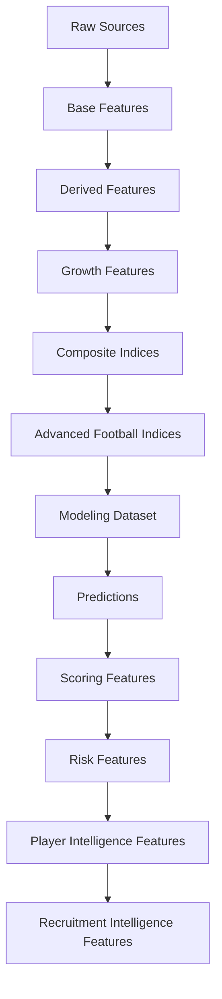

# 🧪 Feature Engineering

## Objetivo

Este documento describe la estrategia de Feature Engineering implementada en la release:

```text
v2.0.0 — DSS Architecture, Data Contracts & Productization
```

Su finalidad es documentar:

* variables utilizadas
* transformaciones aplicadas
* decisiones metodológicas
* evolución por sprints
* prevención de leakage
* soporte a modelización
* soporte a scoring
* soporte a recruitment intelligence
* soporte a decision support systems
* validación externa
* integración de métricas avanzadas

---

# Filosofía

Principio central:

```text
Incrementar señal predictiva
sin incrementar complejidad innecesaria.
```

La estrategia de Feature Engineering se orienta a construir variables que capturen:

* rendimiento deportivo
* contexto competitivo
* trayectoria profesional
* potencial de crecimiento
* robustez analítica
* riesgo
* valor estratégico

El objetivo no es únicamente mejorar métricas predictivas, sino alimentar correctamente:

```text
Modelización
↓
Scoring
↓
Player Intelligence
↓
Recruitment Intelligence
↓
Decision Support System
```

---

# Estado actual

La plataforma incorpora actualmente:

* features ofensivas
* features defensivas
* contexto competitivo
* variables longitudinales
* growth features
* composite indices
* advanced football indices
* scoring features
* risk features
* recruitment features
* business evaluation features

Dataset actual:

| Métrica                        |                 Valor |
| ------------------------------ | --------------------: |
| Observaciones modelables       |                 5.527 |
| Observaciones FBref procesadas |                43.591 |
| Ligas                          |                    11 |
| Temporadas                     |                     7 |
| Cobertura temporal             | 2019-2020 → 2025-2026 |

---

# Arquitectura de Feature Engineering



---

# Evolución metodológica

La evolución real de la capa de Feature Engineering puede resumirse mediante:

```text
Base Features
↓
Derived Features
↓
Growth Features
↓
Composite Indices
↓
Scoring Features
↓
Risk Features
↓
Recruitment Features
↓
Multi-League Expansion
↓
Advanced Football Indices
```

Las principales contribuciones recientes corresponden a:

```text
Sprint 13A
↓
External Validation
```

y

```text
Sprint 13B
↓
Advanced Data Expansion
```

---

# Features actuales

## Producción ofensiva

* goals
* assists
* goals_per90
* assists_per90
* g_a_per90
* shots_per90

---

## Volumen competitivo

* minutes_played
* log_minutes_played
* starts
* nineties

---

## Contexto

* age
* league
* season
* club
* position_group

---

## Features defensivas

* tackles_per90
* interceptions_per90
* blocks_per90
* aerial_duels_won_pct

---

## Matching & Quality

* matching_confidence
* matching_method
* age_diff
* club_score

Estas variables alimentan directamente la construcción del Confidence Score y los procesos de auditoría de matching.

---

# Features derivadas

## Transformaciones logarítmicas

### log_market_value_eur

Target principal.

---

### log_minutes_played

Proxy de exposición competitiva.

---

## Transformaciones de edad

### age_squared

Captura relaciones no lineales asociadas al ciclo de vida del jugador.

---

## Trayectoria

### career_year

Proxy de experiencia.

---

### breakout_indicator

Detecta explosiones tempranas de rendimiento.

---

# Growth Features

Introducidas durante Sprint 2.

Variables:

| Variable                    | Objetivo              |
| --------------------------- | --------------------- |
| market_value_growth_prev    | crecimiento histórico |
| delta_log_market_value_prev | evolución relativa    |
| breakout_indicator          | explosión temprana    |
| growth_index                | potencial             |
| career_year                 | experiencia           |

---

## Impacto observado

| Modelo       |     R² |
| ------------ | -----: |
| Baseline OLS | 0.4160 |
| Growth OLS   | 0.5258 |

Conclusión:

Las variables longitudinales representan una de las mejoras predictivas más importantes de todo el proyecto.

Constituyen todavía hoy el núcleo explicativo principal de la arquitectura econométrica.

---

# Composite Football Indices

Introducidos durante Sprint 3.

Variables:

* finishing_index
* playmaking_index
* growth_index
* experience_index

Objetivo principal:

```text
Interpretabilidad
```

Estos índices permiten resumir múltiples dimensiones futbolísticas dentro de variables sintéticas más fácilmente interpretables por usuarios de negocio.

Aunque su impacto predictivo inicial fue limitado, demostraron gran utilidad para:

* explainability;
* scouting reports;
* player intelligence;
* benchmarking posicional.

---

# Sprint 13B — Advanced Football Indices

Sprint 13B introduce una nueva generación de variables sintéticas construidas a partir de métricas avanzadas derivadas de FBref.

Variables incorporadas:

* finishing_index_v2
* availability_index
* defensive_activity_index

---

## Objetivo

Capturar dimensiones futbolísticas complejas que no estaban completamente representadas en la capa de features existente.

---

## Resultados observados

### Econometría

```text
ΔR² = +0.0044
```

### Machine Learning

```text
XGBoost:
+0.0096

Random Forest:
+0.0097

HistGradientBoosting:
+0.0144

LightGBM:
+0.0291
```

---

## Hallazgo principal

Todas las arquitecturas evaluadas mejoran simultáneamente tras incorporar estas variables.

---

## Variable más relevante

Los análisis de importancia realizados durante Sprint 13B identifican:

```text
finishing_index_v2
```

como la variable avanzada con mayor relevancia predictiva agregada.

---

## Estado actual

Las variables:

* finishing_index_v2
* availability_index
* defensive_activity_index

han sido promovidas a producción y permanecen en el conjunto oficial de features de la versión v2.0.0.

# Sprint 5 — Scoring Features

Sprint 5 transforma predicciones en señales accionables.

Flujo:

```text id="0nmkzk"
Predicción
↓
Inefficiency Score
↓
Growth Score
↓
Confidence Score
↓
Opportunity Score
```

---

## Opportunity Features

* opportunity_score
* opportunity_rank
* opportunity_tier

---

## Confidence Features

* confidence_score
* confidence_score_z

---

## Growth Features derivadas

* growth_score
* growth_score_z

---

# Sprint 10 — Risk Features

Problema identificado:

```text id="7v2u3m"
Alta oportunidad
≠
bajo riesgo
```

---

## Risk Variables

### risk_score

Cuantificación de incertidumbre.

---

### risk_level

* Low
* Medium
* High

---

### risk_adjusted_opportunity_score

Combina:

```text id="af67sx"
Opportunity
+
Risk
```

para mejorar priorización.

---

# Sprint 10 — Player Intelligence Features

Introducidas para soportar:

* Player Radar
* Positional Benchmarking
* Scouting Narrative

---

## Radar Features

MID / ATT

* minutes_played
* goals_per90
* assists_per90
* g_a_per90
* growth_score
* confidence_score

DEF

* tackles_per90
* interceptions_per90
* blocks_per90
* growth_score
* confidence_score

GK

* save_pct
* clean_sheets
* growth_score
* confidence_score

---

# Sprint 11 — Recruitment Intelligence Features

Introducidas para soportar:

* Recruitment Board
* Candidate Selection
* Comparative Analysis
* Executive Workflow

Variables utilizadas:

* opportunity_score
* risk_score
* confidence_score
* market_value_gap_pct
* risk_adjusted_opportunity_score

Objetivo:

```text id="m5ih2v"
Transformar análisis individuales
en procesos operativos de recruitment.
```

---

# Sprint 13A — Multi-League Expansion

Sprint 13A no introduce nuevas familias de variables, pero amplía significativamente el universo competitivo sobre el que se construyen y validan las features existentes.

Nuevas ligas incorporadas:

* Championship
* Belgian Pro League
* Austrian Bundesliga
* Segunda División de España

Resultado:

| Métrica             |  Valor |
| ------------------- | -----: |
| Observaciones FBref | 43.591 |
| Dataset modelizable |  5.527 |
| Ligas               |     11 |
| Temporadas          |      7 |
| Liga-temporada      |     77 |

---

## Contribución metodológica

La expansión multi-liga permite evaluar explícitamente:

* robustez de features;
* estabilidad de relaciones predictivas;
* capacidad de generalización.

Sprint 13A constituye la primera validación externa formal de la arquitectura de Feature Engineering.

---

# Sprint 13A.1 — Coverage Diagnostics

Variables introducidas para auditoría de cobertura:

* match_rate
* matched_records
* unmatched_records
* coverage_rate

Objetivo:

```text id="ntt3mn"
Evaluar calidad de integración
por liga y temporada.
```

Artefactos generados:

```text id="qic8hf"
matching_by_league

matching_by_league_season

coverage_audit
```

Estas variables no participan en entrenamiento de modelos.

Su finalidad es exclusivamente diagnóstica y metodológica.

---

# Sprint 13B — Advanced Football Metrics Integration

Sprint 13B constituye la ampliación más importante de la capa de Feature Engineering desde Sprint 2.

---

## Hipótesis

```text id="jjglj7"
Las métricas avanzadas de rendimiento
aportan información adicional capaz
de mejorar la estimación del valor
de mercado esperado.
```

---

## Variables incorporadas

### finishing_index_v2

Captura información avanzada asociada a capacidad finalizadora y eficiencia ofensiva.

---

### availability_index

Captura disponibilidad competitiva efectiva y continuidad de participación.

---

### defensive_activity_index

Captura actividad defensiva agregada mediante métricas avanzadas derivadas de FBref.

---

## Resultados observados

### Econometría

```text id="rffwlk"
ΔR² = +0.0044
```

---

### Machine Learning

```text id="9zstvk"
XGBoost:
+0.0096

Random Forest:
+0.0097

HistGradientBoosting:
+0.0144

LightGBM:
+0.0291
```

---

## Hallazgo principal

Todas las arquitecturas evaluadas mejoran simultáneamente tras incorporar las nuevas variables.

Este comportamiento aporta evidencia especialmente sólida sobre la utilidad de las métricas avanzadas incorporadas.

---

## Principal contribución analítica

Los análisis de importancia identifican:

```text id="4xajqt"
finishing_index_v2
```

como la variable avanzada con mayor relevancia predictiva agregada.

---

## Promoción productiva

Las variables:

* finishing_index_v2
* availability_index
* defensive_activity_index

forman parte del conjunto oficial de features productivas de:

```text id="vwjj3d"
player_season_modeling_v13b_productive_candidate.parquet
```

---

# Business Features

Introducidas durante Sprint 6.

No utilizadas para entrenamiento.

---

## ROI Features

* expected_profit_eur
* expected_roi_pct
* risk_adjusted_profit_eur
* risk_adjusted_roi_pct
* positive_roi_rate

---

## Ranking Features

* transfer_strategy_segment
* ranking_tier
* is_top_k
* is_scouting_shortlist

---

# Feature Tracking

MLflow registra:

* feature set
* transformaciones
* métricas
* importancia
* scores
* rankings
* artefactos

Beneficio:

```text id="2hpr2r"
Reproducibilidad completa
```

---

# Prevención de leakage

Variables excluidas:

* market_value_next_eur
* predicted_market_value_eur
* market_value_gap_eur
* inefficiency_score
* growth_score
* confidence_score
* opportunity_score
* risk_score
* rankings derivados

---

## Principio

```text id="v5ym0s"
Toda variable predictiva
debe existir en el momento real
de la decisión.
```

---

# Integración Scoring v13B

Durante Sprint 13B se identificó una separación estructural entre:

```text id="cc08o7"
Modeling Pipeline
≠
Scoring Pipeline
```

El pipeline histórico de scoring requiere variables enriquecidas adicionales no presentes actualmente en la capa productiva de predicción.

Por este motivo, la integración completa entre:

```text id="mpzcyw"
Predictions v13B
↓
Scoring Dataset v13B
↓
Growth Score
↓
Confidence Score
↓
Opportunity Score
↓
Risk Score
↓
Rankings v13B
```

quedó documentada entonces como trabajo independiente y fue completada posteriormente en TM.2.

Backlog asociado:

```text id="afjlwm"
TM.2 — Scoring & Ranking Integration v13B
```

La decisión metodológica fue no ejecutar esta integración dentro de Sprint 13B al no afectar a la validación de la hipótesis principal.

---

# Trade-offs metodológicos

| Trade-off                            | Decisión                |
| ------------------------------------ | ----------------------- |
| Muchas features vs interpretabilidad | Equilibrio              |
| Complejidad vs estabilidad           | Modularización          |
| Precisión vs explicabilidad          | Arquitectura híbrida    |
| Cobertura vs robustez                | Quality First           |
| Ranking agresivo vs fiabilidad       | Opportunity + Risk      |
| Evaluación histórica vs operación    | Separación temporal     |
| Expansión multi-liga vs consistencia | External Validation     |
| Nuevas métricas vs sobreajuste       | Validación multi-modelo |

---

# Roadmap histórico

> TM.2 y Sprint 14 se completaron después de redactarse este plan. El roadmap vigente está en [project_evolution.md](project_evolution.md#roadmap-vigente).

## TM.1 — Transfermarkt Coverage Audit

Objetivo:

* diagnosticar limitaciones de cobertura;
* estimar techo teórico de matching;
* mejorar integración de datos.

---

## TM.2 — Scoring & Ranking Integration v13B — completado

Objetivo:

```text id="r4a7ma"
Predictions v13B
↓
Scoring Dataset v13B
↓
Opportunity Framework v13B
↓
Rankings v13B
```

---

## Sprint 14 — Transfer Strategy Enhancement — completado

Líneas de trabajo previstas:

* Transfer Strategy Engine
* Portfolio Optimization
* Scenario Simulation
* Strategic Recruitment

---

## Investigación futura

### Modelización

* TabPFN
* CatBoost
* Ensemble Learning

### Datos

* Nuevas métricas avanzadas FBref
* Event Data avanzado
* Tracking Data
* Datos contractuales
* Datos salariales

### Football Analytics

* Similarity Engine
* Advanced Football Radar
* Career Trajectory Modeling

---

# Conclusión

El Feature Engineering constituye uno de los principales motores de mejora de la plataforma.

Los resultados acumulados durante el proyecto muestran que:

* las variables longitudinales aportan la mayor mejora predictiva estructural;
* los índices compuestos aportan interpretabilidad;
* el scoring transforma predicciones en señales accionables;
* el Risk Framework mejora priorización;
* Recruitment Intelligence transforma análisis en procesos operativos;
* la expansión multi-liga fortalece la validez externa;
* las métricas avanzadas mejoran simultáneamente econometría y Machine Learning.

Las principales contribuciones recientes corresponden a:

```text id="x8n4qn"
Sprint 13A
↓
External Validation
```

y

```text id="yp67px"
Sprint 13B
↓
Advanced Data Expansion
```

La hipótesis principal de Sprint 13B queda validada.

Las variables:

* finishing_index_v2
* availability_index
* defensive_activity_index

aportan señal predictiva incremental consistente y pasan a formar parte del conjunto oficial de features productivas.

La evolución funcional puede resumirse mediante:

```text id="chzhgc"
Modelización
↓
Scoring
↓
Player Intelligence
↓
Recruitment Intelligence
↓
Decision Support System
↓
External Validation
↓
Advanced Football Metrics
```

consolidando la transición desde un sistema predictivo hacia una plataforma integral de Football Analytics orientada a scouting, recruitment y soporte avanzado a decisiones deportivas.

## Estado de features en v2.0.0

TM.2 completó la propagación de las features v13B hacia scoring y rankings. TM.3 añadió variables contractuales únicamente aguas abajo, en el DSS; no entran en Growth OLS v13B ni Tuned XGBoost v13B. TM.7–TM.8 añadieron campos de contexto, identidad, presentación y control, que son variables operativas y no predictores.

Esta separación conserva tres familias:

1. features predictivas históricas, libres de leakage;
2. señales de decisión derivadas de predicciones y scoring;
3. atributos actuales de contexto y presentación.

El roadmap vigente se limita a benchmarks o nuevas capas explícitas; la integración TM.2 ya no se considera trabajo futuro.
