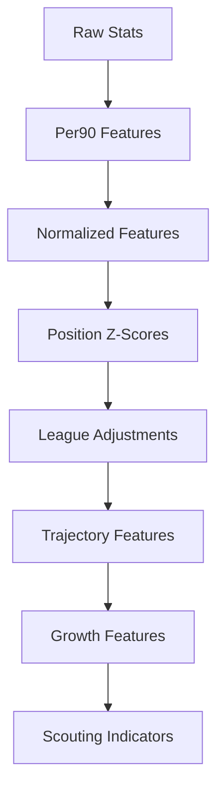

# 🧪 Plan de Feature Engineering

---

# 📑 Tabla de contenidos

- [🧠 Objetivo](#-objetivo)
- [📊 Situación actual](#-situación-actual)
- [⚠️ Problema actual del sistema](#️-problema-actual-del-sistema)
- [🎯 Objetivos del feature engineering avanzado](#-objetivos-del-feature-engineering-avanzado)
- [🏗️ Filosofía metodológica](#️-filosofía-metodológica)
- [🧩 Arquitectura futura de features](#-arquitectura-futura-de-features)
- [📈 Bloques de features prioritarios](#-bloques-de-features-prioritarios)
- [⚽ Features de rendimiento ofensivo](#-features-de-rendimiento-ofensivo)
- [🛡️ Features defensivas](#️-features-defensivas)
- [📦 Features de volumen y uso](#-features-de-volumen-y-uso)
- [📈 Features de progresión](#-features-de-progresión)
- [📊 Features relativas y percentiles](#-features-relativas-y-percentiles)
- [🌍 Normalización por liga](#-normalización-por-liga)
- [👥 Z-scores por posición](#-z-scores-por-posición)
- [📉 Rolling metrics](#-rolling-metrics)
- [📈 Growth features](#-growth-features)
- [📊 Market momentum](#-market-momentum)
- [🧠 Age curves y development indicators](#-age-curves-y-development-indicators)
- [🛡️ Prevención de leakage](#️-prevención-de-leakage)
- [⚖️ Trade-offs metodológicos](#️-trade-offs-metodológicos)
- [📂 Arquitectura prevista](#-arquitectura-prevista)
- [🚀 Roadmap de implementación](#-roadmap-de-implementación)
- [🧠 Conclusión](#-conclusión)

---

# 🧠 Objetivo

Este documento define la estrategia de feature engineering avanzado del sistema analítico orientado a identificar jugadores infravalorados en el mercado de fichajes europeo.

El objetivo principal es incrementar:

- señal predictiva
- capacidad explicativa
- valor scouting real
- robustez econométrica
- generalización temporal

---

# 📊 Situación actual

El sistema actual utiliza un conjunto relativamente reducido de variables.

## Features actuales

### Rendimiento ofensivo

- goals_per90
- assists_per90

---

### Volumen de juego

- minutes_played
- log_minutes_played

---

### Contexto

- age
- league
- season
- position_group

---

# ⚠️ Problema actual del sistema

Los resultados actuales muestran que:

| Modelo | R² |
|---|---:|
| OLS final | ~0.44 |
| Gradient Boosting | ~0.48 |

La mejora relativamente moderada de ML respecto a OLS indica que:

<pre>
el principal cuello de botella actual es el signal predictivo del dataset
</pre>

y no necesariamente el algoritmo utilizado.

---

# 🎯 Objetivos del feature engineering avanzado

La siguiente fase del proyecto busca:

- capturar calidad deportiva real
- modelar progresión y desarrollo
- reducir ruido contextual
- aumentar capacidad predictiva
- mejorar utilidad scouting
- construir señales más robustas

---

# 🏗️ Filosofía metodológica

El diseño de nuevas variables seguirá principios de:

- interpretabilidad
- coherencia futbolística
- robustez estadística
- prevención de leakage
- generalización temporal

---

## Principio fundamental

Las variables deben representar:

<pre>
información disponible en el momento real de decisión
</pre>

---

# 🧩 Arquitectura futura de features

---

# 📈 Bloques de features prioritarios

| Bloque                     | Prioridad |
| -------------------------- | --------- |
| Progression metrics        | Alta      |
| Percentiles                | Alta      |
| Z-scores por posición      | Alta      |
| League normalization       | Alta      |
| Growth indicators          | Alta      |
| Rolling metrics            | Media     |
| Market momentum            | Media     |
| Advanced defensive metrics | Media     |
| Age curves                 | Alta      |

---

# ⚽ Features de rendimiento ofensivo

## Objetivo

Capturar calidad ofensiva real más allá de goles brutos.

---

## Features previstas

### Producción ofensiva

* shots_per90
* shots_on_target_per90
* non_penalty_goals_per90
* goals_minus_pk_per90

---

### Creación

* key_passes_per90
* shot_creating_actions_per90
* goal_creating_actions_per90

---

### Calidad ofensiva

* xG_per90
* xA_per90
* np_xG_per90

---

## Fuentes previstas

| Fuente    | Estado     |
| --------- | ---------- |
| FBref     | Disponible |
| Understat | Pendiente  |

---

# 🛡️ Features defensivas

## Objetivo

Mejorar valoración de defensas y mediocampistas.

---

## Features previstas

* tackles_per90
* interceptions_per90
* blocks_per90
* aerial_duels_won_pct
* pressures_per90
* recoveries_per90

---

## Problema actual

El sistema actual favorece excesivamente producción ofensiva.

---

## Objetivo metodológico

Reducir sesgo ofensivo estructural del modelo.

---

# 📦 Features de volumen y uso

## Objetivo

Capturar confianza competitiva y relevancia contextual.

---

## Features previstas

* starts_pct
* minutes_share
* team_minutes_share
* nineties
* availability_rate

---

## Interpretación scouting

Estas variables permiten identificar:

* regularidad
* consolidación
* confianza táctica
* exposición competitiva

---

# 📈 Features de progresión

## Objetivo

Capturar evolución deportiva longitudinal.

---

## Features previstas

### Year-over-year deltas

* delta_minutes_yoy
* delta_goals_per90_yoy
* delta_assists_per90_yoy
* delta_xG_yoy
* delta_xA_yoy

---

## Interpretación

Estas variables ayudan a identificar:

* breakout players
* aceleración de desarrollo
* crecimiento competitivo

---

# 📊 Features relativas y percentiles

## Objetivo

Evaluar rendimiento relativo respecto al entorno competitivo.

---

## Features previstas

### Percentiles

* goals_per90_position_percentile
* assists_per90_position_percentile
* xG_per90_position_percentile
* minutes_position_percentile

---

## Justificación

Los percentiles:

* reducen dependencia de escala
* facilitan interpretación scouting
* mejoran comparación interliga

---

# 🌍 Normalización por liga

## Objetivo

Reducir diferencias estructurales entre ligas.

---

## Problema actual

El valor de mercado está fuertemente condicionado por:

* exposición mediática
* capacidad económica
* visibilidad internacional
* reputación competitiva

---

## Features previstas

* league_adjusted_goals
* league_adjusted_xG
* league_strength_score
* relative_league_performance

---

## Justificación

Permite comparar jugadores de:

* Eredivisie
* Liga Portugal
* Ligue 1

respecto a ligas premium.

---

# 👥 Z-scores por posición

## Objetivo

Comparar jugadores respecto a perfiles funcionales similares.

---

## Features previstas

* goals_per90_pos_z
* assists_per90_pos_z
* xG_per90_pos_z
* progression_index_pos_z

---

## Justificación

No es metodológicamente correcto comparar:

* centrales
* pivotes
* extremos
* delanteros

utilizando distribuciones globales idénticas.

---

# 📉 Rolling metrics

## Objetivo

Capturar estabilidad y consistencia temporal.

---

## Features previstas

* rolling_xG
* rolling_minutes
* rolling_form_score
* rolling_goal_contribution

---

## Beneficio

Permite detectar:

* rachas sostenidas
* consistencia
* volatilidad

---

# 📈 Growth features

## Objetivo

Capturar potencial de revalorización futura.

---

## Features previstas

* lag_market_value
* market_value_growth_prev
* market_value_acceleration
* delta_market_value_yoy

---

## Uso previsto

Estas variables serán especialmente relevantes para:

<pre>
Growth Score
</pre>

---

# 📊 Market momentum

## Objetivo

Modelar dinámica reciente del mercado.

---

## Features previstas

* transfer_activity_score
* market_visibility_score
* market_trend_signal

---

## Justificación

El mercado incorpora componentes:

* mediáticos
* contextuales
* reputacionales

que no dependen exclusivamente del rendimiento.

---

# 🧠 Age curves y development indicators

## Objetivo

Capturar fases de desarrollo deportivo.

---

## Features previstas

* age_relative_to_peak
* early_breakout_flag
* accelerated_development_flag
* age_position_expected_value

---

## Justificación

El mismo rendimiento no implica el mismo valor esperado en:

* un jugador de 18 años
* un jugador de 24 años

---

# 🛡️ Prevención de leakage

## Principio fundamental

Toda variable debe existir en el momento temporal de decisión.

---

# Variables explícitamente prohibidas

## Leakage temporal

* market_value_next_eur
* future_minutes
* future_xG

---

## Leakage derivado

* delta_log_market_value_1y
* next_season_metrics

---

## Regla general

No se utilizará información futura para predecir:

<pre>
valor de mercado actual
</pre>

---

# ⚖️ Trade-offs metodológicos

## Complejidad vs interpretabilidad

Se priorizarán features:

* interpretables
* futbolísticamente coherentes
* robustas

---

## Señal vs ruido

No toda feature avanzada mejora capacidad predictiva.

Se evitará:

* sobreingeniería
* dimensionalidad excesiva
* ruido contextual innecesario

---

## Cobertura vs calidad

Algunas variables avanzadas reducirán cobertura muestral.

Esto será evaluado cuidadosamente.

---

# 📂 Arquitectura prevista

## Directorio objetivo

<pre>
src/features/advanced/
</pre>

---

## Módulos previstos

| Archivo                    | Objetivo                |
| -------------------------- | ----------------------- |
| normalization.py           | Normalización           |
| percentiles.py             | Percentiles             |
| zscores.py                 | Z-scores                |
| trajectories.py            | Features longitudinales |
| growth.py                  | Growth indicators       |
| rolling.py                 | Rolling metrics         |
| age_curves.py              | Curvas de desarrollo    |
| build_advanced_features.py | Pipeline principal      |

---

# 🚀 Roadmap de implementación

## Fase 1

### Features base ampliadas

* shots
* xG
* xA
* key passes
* progressive actions

---

## Fase 2

### Normalización contextual

* league normalization
* position z-scores
* percentiles

---

## Fase 3

### Features longitudinales

* rolling metrics
* trajectories
* growth indicators

---

## Fase 4

### Growth Score

Construcción de score de potencial futuro.

---

# 🧠 Conclusión

El siguiente salto de calidad del sistema no depende principalmente de:

<pre>
algoritmos más complejos
</pre>

sino de:

* mejor señal predictiva
* feature engineering avanzado
* modelización contextual
* representación más rica del rendimiento deportivo

La siguiente fase del proyecto busca evolucionar desde un baseline sólido hacia un sistema de scouting cuantitativo mucho más cercano a entornos reales de sports analytics profesional.