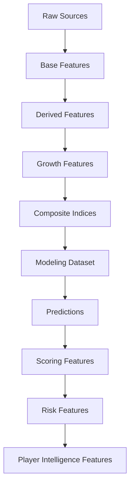

# 🧪 Feature Engineering

## Objetivo

Este documento describe la estrategia de Feature Engineering implementada en la release v1.0.0 — Scouting Intelligence Platform.

Su finalidad es documentar:

- variables utilizadas
- transformaciones aplicadas
- decisiones metodológicas
- evolución por sprints
- prevención de leakage
- roadmap futuro

---

# Filosofía

Principio central:

```text
Incrementar señal predictiva
sin incrementar complejidad innecesaria.
```

La estrategia de Feature Engineering se orienta a construir variables que capturen:

- rendimiento deportivo
- contexto competitivo
- trayectoria profesional
- potencial de crecimiento
- robustez analítica

El objetivo no es únicamente mejorar R² o RMSE, sino alimentar correctamente:

```text
Modelización
↓
Scoring
↓
Ranking
↓
Player Intelligence
↓
Decision Support
```

---

# Estado actual

La plataforma incorpora actualmente:

- features ofensivas
- features defensivas básicas
- contexto competitivo
- variables longitudinales
- growth features
- composite indices
- scoring features
- risk features
- business evaluation features

Dataset actual:

| Métrica | Valor |
|----------|----------:|
| Observaciones | 3.916 |
| Jugadores únicos | 2.136 |
| Cobertura temporal | 2019-2020 → 2025-2026 |

---

# Arquitectura de Feature Engineering



---

# Features actuales

## Producción ofensiva

- goals
- assists
- goals_per90
- assists_per90
- g_a_per90
- shots_per90

---

## Volumen competitivo

- minutes_played
- log_minutes_played
- starts
- nineties

---

## Contexto

- age
- league
- season
- club
- position_group

---

## Features defensivas

- tackles_per90
- interceptions_per90
- blocks_per90
- aerial_duels_won_pct

---

## Matching & Quality

- matching_confidence
- matching_method
- age_diff
- club_score

Estas variables alimentan directamente la construcción del Confidence Score.

---

# Features derivadas

## Transformaciones logarítmicas

### log_market_value_eur

Target principal.

Objetivo:

- estabilizar varianza
- reducir asimetría
- mejorar ajuste

### log_minutes_played

Objetivo:

- reducir influencia de outliers
- capturar volumen competitivo

---

## Transformaciones de edad

### age_squared

Captura relaciones no lineales.

Justificación:

```text
El mercado no valora igual
un mismo rendimiento a los 18 años
que a los 23.
```

---

## Trayectoria

### career_year

Proxy de experiencia.

### breakout_indicator

Detecta explosión temprana.

---

# Growth Features

Introducidas durante Sprint 2.

Variables:

| Variable | Objetivo |
|----------|----------|
| market_value_growth_prev | crecimiento histórico |
| delta_log_market_value_prev | evolución relativa |
| breakout_indicator | explosión temprana |
| growth_index | potencial |
| career_year | experiencia |

---

## Impacto observado

| Modelo | R² |
|----------|----------:|
| Baseline OLS | 0.4160 |
| Growth OLS | 0.5258 |

Conclusión:

Las variables longitudinales representan una de las mejoras más relevantes de todo el proyecto.

---

# Composite Football Indices

Introducidos durante Sprint 3.

Variables:

- finishing_index
- playmaking_index
- growth_index
- experience_index

---

## Uso actual

Utilizados en:

- scouting
- reporting
- explainability
- benchmarking

No utilizados en:

```text
Modelo predictivo final
```

Debido a redundancia parcial con variables base.

---

## Decisión metodológica

Mantenerlos por:

```text
Valor interpretativo
```

aunque no mejoren directamente las métricas predictivas.

---

# Sprint 5 — Scoring Features

Sprint 5 transforma las predicciones en señales accionables.

Flujo:

```text
Predicción
↓
Inefficiency Score
↓
Growth Score
↓
Confidence Score
↓
Opportunity Score
```

---

## Inefficiency Features

- predicted_market_value_eur
- market_value_gap_eur
- market_value_gap_pct
- inefficiency_score
- inefficiency_score_z

Objetivo:

```text
Detección de infravaloración
```

---

## Growth Features derivadas

- growth_score
- growth_score_z

---

## Confidence Features

- confidence_score
- confidence_score_z

Componentes:

- matching_confidence
- minutes_reliability
- feature_completeness
- temporal_stability

---

## Opportunity Features

- opportunity_score
- opportunity_rank
- opportunity_tier

Fórmula conceptual:

```python
0.55 * inefficiency_score_z +
0.25 * growth_score_z +
0.20 * confidence_score_z
```

---

# Sprint 10 — Risk Features

Sprint 10.3 incorpora una nueva familia de variables.

Problema identificado:

```text
Alta oportunidad
≠
bajo riesgo
```

---

## Risk Variables

### risk_score

Objetivo:

```text
Cuantificar incertidumbre
```

---

### risk_level

Valores:

- Low
- Medium
- High

---

### risk_adjusted_opportunity_score

Combina:

```text
Opportunity
+
Risk
```

para mejorar priorización.

---

# Sprint 10.1 — Player Intelligence Features

Introducidas para soportar:

- Player Radar MVP
- Positional Benchmarking
- Scouting Narrative

---

## Radar Features

MID / ATT

- minutes_played
- goals_per90
- assists_per90
- g_a_per90
- growth_score
- confidence_score

---

DEF

- minutes_played
- tackles_per90
- interceptions_per90
- blocks_per90
- growth_score
- confidence_score

---

GK

- minutes_played
- save_pct
- clean_sheets
- growth_score
- confidence_score

---

## Benchmarking Features

### radar_percentile

Percentil de la métrica.

### benchmark_group

Valores:

- Position
- Global

---

## Scouting Narrative Features

Variables utilizadas:

- opportunity_score
- risk_score
- growth_score
- confidence_score

---

# Sprint 10.2 — FBref Advanced Audit

Objetivo:

Evaluar nuevas fuentes de señal.

Tablas auditadas:

- Shooting
- Defense
- Misc
- Playing Time
- Passing
- Possession
- Goal & Shot Creation

---

## Variables candidatas

Alta prioridad:

- shots_per90
- shots_on_target_per90
- tackles_won_per90
- interceptions_per90
- blocks_per90
- fouls_drawn_per90
- crosses_per90

---

## Resultado

Base técnica para:

```text
Advanced Football Radar
```

Sprint 11.

---

# Business Features

Introducidas durante Sprint 6.

No utilizadas para entrenamiento.

---

## ROI Features

- expected_profit_eur
- expected_roi_pct
- risk_adjusted_profit_eur
- risk_adjusted_roi_pct
- positive_roi_rate

---

## Ranking Features

- transfer_strategy_segment
- ranking_tier
- is_top_k
- is_scouting_shortlist

---

# Feature Tracking

MLflow registra:

- feature set
- transformaciones
- métricas
- importancia
- scores
- rankings
- artefactos

Beneficio:

```text
Reproducibilidad completa
```

---

# Prevención de leakage

Variables excluidas:

- market_value_next_eur
- predicted_market_value_eur
- market_value_gap_eur
- inefficiency_score
- growth_score
- confidence_score
- opportunity_score
- risk_score
- rankings derivados

---

## Principio

```text
Toda variable predictiva
debe existir en el momento real
de la decisión.
```

---

# Trade-offs metodológicos

| Trade-off | Decisión |
|----------|-----------|
| Muchas features vs interpretabilidad | Equilibrio |
| Complejidad vs estabilidad | Modularización |
| Precisión vs explicabilidad | Arquitectura híbrida |
| Cobertura vs robustez | Quality First |
| Ranking agresivo vs fiabilidad | Opportunity + Risk |
| Evaluación histórica vs operación | Separación Sprint 10 |

---

# Roadmap

## Sprint 11

Advanced Football Radar

Variables previstas:

- shots_per90
- shots_on_target_per90
- tackles_won_per90
- interceptions_per90
- blocks_per90
- fouls_drawn_per90
- crosses_per90

---

## Sprint 12

Understat Integration

Variables:

- xG
- xA
- xGChain
- xGBuildup

---

## Sprint 13

Advanced Modeling

- position-specific features
- rolling metrics
- similarity engine
- automated scouting reports

---

# Conclusión

El Feature Engineering constituye actualmente el principal vector de mejora del sistema.

La evolución observada durante los distintos sprints demuestra que:

- las variables longitudinales aportan la mayor ganancia predictiva
- los índices compuestos aportan interpretabilidad
- el scoring transforma predicciones en señales accionables
- el Risk Framework mejora la priorización
- el Player Intelligence Layer convierte métricas en análisis operativos

La principal contribución de Sprint 10 es ampliar el alcance del Feature Engineering más allá de la modelización, permitiendo alimentar:

```text
Current Scouting Layer
↓
Player Intelligence Layer
↓
Decision Support Layer
↓
Scouting Intelligence
```

y consolidando la transición desde un sistema predictivo hacia una plataforma integral de Football Analytics aplicada al scouting profesional.
