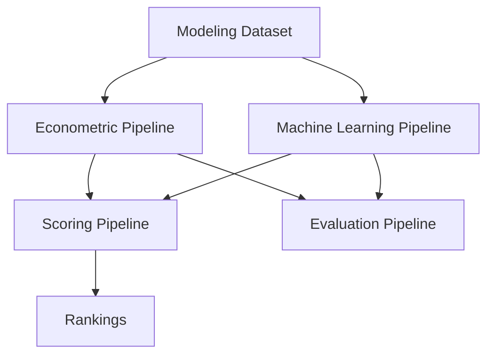

````md id="8p6s2z"
# 📈 Decisiones de modelización

<div align="center">


</div>

---

# 📑 Tabla de contenidos

- [🧠 Objetivo del documento](#-objetivo-del-documento)
- [🎯 Objetivo analítico del sistema](#-objetivo-analítico-del-sistema)
- [⚙️ Unidad de análisis](#️-unidad-de-análisis)
- [🏗️ Filosofía general de modelización](#️-filosofía-general-de-modelización)
- [📊 Variable objetivo](#-variable-objetivo)
- [📈 Transformación logarítmica](#-transformación-logarítmica)
- [🌍 Variables contextuales](#-variables-contextuales)
- [👥 Variables posicionales](#-variables-posicionales)
- [📚 Features actuales utilizadas](#-features-actuales-utilizadas)
- [📈 Arquitectura de modelización](#-arquitectura-de-modelización)
- [📊 Pipeline econométrico](#-pipeline-econométrico)
- [🤖 Pipeline Machine Learning](#-pipeline-machine-learning)
- [💡 Pipeline de scoring](#-pipeline-de-scoring)
- [📊 Pipeline de evaluación](#-pipeline-de-evaluación)
- [⏳ Validación temporal](#-validación-temporal)
- [🛡️ Prevención de leakage](#️-prevención-de-leakage)
- [⚖️ Econometría vs Machine Learning](#️-econometría-vs-machine-learning)
- [📈 Resultados actuales](#-resultados-actuales)
- [🧠 Interpretación metodológica](#-interpretación-metodológica)
- [⚠️ Limitaciones actuales](#️-limitaciones-actuales)
- [🚀 Próximas mejoras previstas](#-próximas-mejoras-previstas)
- [🧠 Conclusión](#-conclusión)

---

# 🧠 Objetivo del documento

Este documento describe las decisiones metodológicas y arquitectónicas adoptadas en la construcción del sistema de modelización orientado a:

<pre>
estimar el valor de mercado esperado de futbolistas profesionales
</pre>

e identificar posibles ineficiencias en el mercado de fichajes europeo.

---

# 🎯 Objetivo analítico del sistema

El objetivo principal del sistema es construir modelos capaces de:

- explicar el valor de mercado observado
- estimar valor esperado
- detectar infravaloraciones
- generar rankings de scouting cuantitativo
- comparar rendimiento entre jugadores y ligas

---

## 📌 Enfoque general

El sistema combina:

- econometría aplicada
- machine learning supervisado
- feature engineering deportivo
- scoring analítico

---

# ⚙️ Unidad de análisis

La unidad de análisis del sistema es:

<pre>
Jugador – Temporada
</pre>

Cada observación representa:

- rendimiento deportivo
- contexto competitivo
- características demográficas
- valor de mercado

para un jugador en una temporada específica.

---

# 🏗️ Filosofía general de modelización

La estrategia de modelización sigue varios principios fundamentales.

---

## 1️⃣ Interpretabilidad

El proyecto prioriza modelos:

- interpretables
- explicables
- económicamente coherentes

especialmente en fases iniciales.

---

## 2️⃣ Robustez temporal

La validación debe aproximarse a escenarios reales de scouting.

Por ello:

<pre>
NO se utilizan random splits
</pre>

---

## 3️⃣ Modularidad

La lógica del sistema se desacopla en pipelines independientes:

- econometría
- ML
- scoring
- evaluación

---

## 4️⃣ Reproducibilidad

Todos los outputs relevantes deben ser:

- regenerables
- persistidos
- trazables

---

## 5️⃣ Coherencia futbolística

Las decisiones metodológicas deben mantener sentido desde la perspectiva de:

- scouting
- mercado
- desarrollo de jugadores

---

# 📊 Variable objetivo

## Target principal

```python
market_value_eur
```

---

## Transformación utilizada

```python
log_market_value_eur
```

---

## Justificación

El valor de mercado presenta:

* skewness positiva
* colas largas
* heterocedasticidad
* outliers extremos

La transformación logarítmica mejora:

* linealidad
* estabilidad
* robustez
* interpretabilidad relativa

---

# 📈 Transformación logarítmica

## Fórmula aplicada

y = \log(\text{market_value_eur})

---

## Beneficios metodológicos

La transformación:

* reduce influencia de outliers
* estabiliza varianza
* mejora ajuste econométrico
* facilita interpretación porcentual aproximada

---

## Interpretación económica

Los coeficientes pueden interpretarse aproximadamente como:

<pre>
variaciones porcentuales esperadas del valor de mercado
</pre>

---

# 🌍 Variables contextuales

## League Fixed Effects

El sistema incorpora efectos fijos por liga debido a que:

* los mercados no son homogéneos
* existe distinta exposición internacional
* las ligas tienen distinta capacidad económica
* existen primas estructurales de mercado

---

## Season Fixed Effects

Se incorporan efectos fijos temporales para controlar:

* inflación de mercado
* shocks macroeconómicos
* cambios estructurales
* dinámicas temporales

---

# 👥 Variables posicionales

## Position Fixed Effects

El mercado valora posiciones de manera distinta.

Ejemplos:

* delanteros premium
* centrales menos visibles
* porteros con dinámica propia

---

## Justificación

No incorporar efectos posicionales generaría:

* sesgos estructurales
* penalización injusta de perfiles defensivos
* mala calibración del valor esperado

---

# 📚 Features actuales utilizadas

## Variables numéricas

| Variable             | Función                |
| -------------------- | ---------------------- |
| `age`                | Control demográfico    |
| `minutes_played`     | Volumen competitivo    |
| `log_minutes_played` | Transformación robusta |
| `goals_per90`        | Producción ofensiva    |
| `assists_per90`      | Creación ofensiva      |

---

## Variables categóricas

| Variable         | Tipo        |
| ---------------- | ----------- |
| `league`         | League FE   |
| `season`         | Season FE   |
| `position_group` | Position FE |

---

# 📈 Arquitectura de modelización



---

# 📊 Pipeline econométrico

## Arquitectura

<pre>
src/models/econometric/
</pre>

---

## Componentes

| Archivo               | Función                |
| --------------------- | ---------------------- |
| `specifications.py`   | Fórmulas centralizadas |
| `train_ols.py`        | Entrenamiento          |
| `run_ols_pipeline.py` | Pipeline end-to-end    |

---

## Modelo final implementado

\log(\text{market_value}) = \beta_0 + \beta_1 age + \beta_2 \log(minutes) + \beta_3 goals_per90 + \beta_4 assists_per90 + League\ FE + Season\ FE + Position\ FE + \varepsilon

---

## Estimación

El modelo utiliza:

```python
HC3 robust covariance
```

---

## Justificación HC3

HC3 mejora robustez frente a:

* heterocedasticidad
* leverage points
* tamaños muestrales desiguales

---

## Rol del modelo econométrico

El modelo OLS constituye:

<pre>
el núcleo interpretable principal del sistema
</pre>

---

# 🤖 Pipeline Machine Learning

## Arquitectura

<pre>
src/models/machine_learning/
</pre>

---

## Modelos implementados

* RandomForestRegressor
* GradientBoostingRegressor
* HistGradientBoostingRegressor

---

## Objetivo

Evaluar:

* capacidad predictiva adicional
* relaciones no lineales
* interacciones complejas

---

## Funcionalidades

* preprocessing pipeline
* one-hot encoding
* temporal validation
* model persistence
* feature importance

---

## Interpretación metodológica

ML actúa como:

<pre>
extensión predictiva complementaria
</pre>

y no como sustituto completo del enfoque econométrico.

---

# 💡 Pipeline de scoring

## Arquitectura

<pre>
src/models/scoring/
</pre>

---

## Objetivo

Transformar predicciones en:

* rankings
* señales scouting
* oportunidades de mercado

---

## Fórmula conceptual

\text{inefficiency_score} = \widehat{MV} - MV

---

## Interpretación

| Score    | Interpretación          |
| -------- | ----------------------- |
| Positivo | Posible infravaloración |
| Negativo | Posible sobrevaloración |

---

# 📊 Pipeline de evaluación

## Arquitectura

<pre>
src/models/evaluation/
</pre>

---

## Componentes

| Archivo                 | Función               |
| ----------------------- | --------------------- |
| `metrics.py`            | Métricas              |
| `feature_importance.py` | Importancia variables |
| `model_comparison.py`   | Comparación modelos   |

---

## Métricas utilizadas

* RMSE
* MAE
* R²

---

## Objetivo

Centralizar:

* evaluación
* comparación
* reporting
* diagnósticos

---

# ⏳ Validación temporal

## Estrategia

| Split | Temporadas  |
| ----- | ----------- |
| Train | ≤ 2023-2024 |
| Test  | 2024-2025   |

---

## Justificación

El mercado futbolístico es:

* dinámico
* temporal
* no estacionario

---

## Riesgo del random split

Un random split produciría:

* leakage temporal
* optimismo artificial
* sobreestimación del rendimiento

---

## Objetivo

Simular un escenario real de scouting futuro.

---

# 🛡️ Prevención de leakage

## Principio fundamental

Toda variable utilizada debe existir en el momento real de decisión.

---

## Variables excluidas

| Variable                    | Motivo             |
| --------------------------- | ------------------ |
| `market_value_next_eur`     | Información futura |
| `delta_log_market_value_1y` | Información futura |
| `future_minutes`            | Información futura |
| `future_xG`                 | Información futura |

---

## Outputs derivados excluidos

También se excluyen como inputs:

* predictions
* inefficiency scores
* ranking outputs

---

# ⚖️ Econometría vs Machine Learning

## Resultados observados

| Modelo            | R² aproximado |
| ----------------- | ------------: |
| OLS final         |         ~0.44 |
| Gradient Boosting |         ~0.48 |

---

## Interpretación principal

La mejora relativamente moderada de ML respecto a OLS sugiere que:

<pre>
el principal cuello de botella actual es la calidad del feature set
</pre>

más que la complejidad algorítmica.

---

## Implicación metodológica

La siguiente fase del proyecto debe centrarse principalmente en:

* feature engineering avanzado
* enriquecimiento contextual
* métricas longitudinales
* progression metrics

---

# 📈 Resultados actuales

## Econometría

| Métrica | Resultado aproximado |
| ------- | -------------------: |
| MAE     |                 0.79 |
| RMSE    |                 0.98 |
| R²      |                 0.44 |

---

## Machine Learning

| Modelo               | R² aproximado |
| -------------------- | ------------: |
| Random Forest        |         ~0.46 |
| HistGradientBoosting |         ~0.46 |
| Gradient Boosting    |         ~0.48 |

---

## Conclusiones preliminares

* OLS mantiene gran capacidad explicativa
* ML aporta mejora predictiva moderada
* existe señal estructural consistente
* el mercado incorpora componentes no observables relevantes

---

# 🧠 Interpretación metodológica

## El mercado no depende solo del rendimiento

El valor de mercado incorpora:

* edad
* potencial
* exposición mediática
* club
* liga
* reputación
* contexto contractual

---

## Implicación

Incluso modelos técnicamente sólidos tendrán:

<pre>
capacidad explicativa limitada estructuralmente
</pre>

---

## Valor del sistema

El objetivo no es predecir perfectamente el mercado, sino:

* detectar ineficiencias
* priorizar scouting
* identificar oportunidades relativas

---

# ⚠️ Limitaciones actuales

## Feature set limitado

Actualmente predominan:

* minutos
* goles
* asistencias

---

## Variables aún no incorporadas

* xG
* xA
* métricas defensivas
* progression metrics
* rolling metrics
* percentiles
* z-scores por posición

---

## Variables no observables

El sistema no incorpora aún:

* salarios
* contratos
* lesiones
* agentes
* narrativa mediática
* información privada de clubes

---

# 🚀 Próximas mejoras previstas

## Feature engineering avanzado

Pendiente implementar:

* progression metrics
* age curves
* percentiles
* z-scores por posición
* league normalization
* rolling metrics
* growth indicators
* market momentum

---

## Nuevas fuentes

* Understat
* StatsBomb Open Data

---

## Nuevos outputs

* Growth Score
* Confidence Score
* scouting reports automáticos

---

# 🧠 Conclusión

El sistema actual combina:

* econometría aplicada
* machine learning supervisado
* scoring cuantitativo
* validación temporal
* pipelines modulares reproducibles

La arquitectura prioriza:

* interpretabilidad
* robustez
* trazabilidad
* coherencia futbolística

El modelo econométrico actúa como núcleo principal del sistema, mientras que Machine Learning aporta capacidad predictiva complementaria.

Los resultados actuales muestran que el siguiente salto de calidad del proyecto depende principalmente de:

* feature engineering avanzado
* enriquecimiento contextual
* mejor representación del rendimiento deportivo

más que de algoritmos significativamente más complejos.

El sistema constituye una base sólida tanto para el Trabajo Fin de Máster como para futuras evoluciones hacia herramientas reales de scouting cuantitativo profesional.