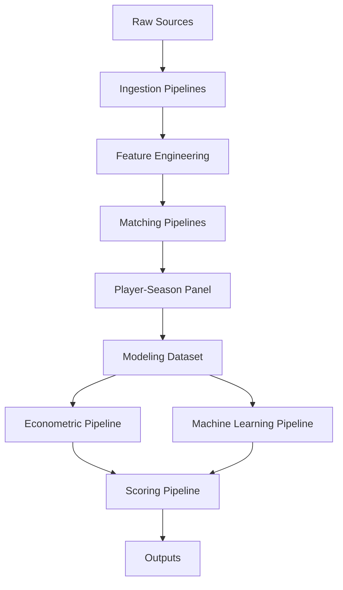

````md id="xw0c2p"
# ⚙️ Referencia de pipelines

<div align="center">


</div>

---

# 📑 Tabla de contenidos

- [🧠 Objetivo](#-objetivo)
- [🏗️ Filosofía de pipelines](#️-filosofía-de-pipelines)
- [📂 Arquitectura general](#-arquitectura-general)
- [📦 Pipeline inventory](#-pipeline-inventory)
- [📥 Data ingestion pipelines](#-data-ingestion-pipelines)
- [🧪 Feature engineering pipelines](#-feature-engineering-pipelines)
- [🔗 Matching pipelines](#-matching-pipelines)
- [📊 Modeling dataset pipelines](#-modeling-dataset-pipelines)
- [📈 Econometric pipelines](#-econometric-pipelines)
- [🤖 Machine learning pipelines](#-machine-learning-pipelines)
- [💡 Scoring pipelines](#-scoring-pipelines)
- [📊 Evaluation pipelines](#-evaluation-pipelines)
- [📤 Output generation](#-output-generation)
- [⏳ Temporal validation workflow](#-temporal-validation-workflow)
- [▶️ Ejecución completa del sistema](#️-ejecución-completa-del-sistema)
- [🛡️ Controles y validaciones](#️-controles-y-validaciones)
- [📂 Inputs y outputs](#-inputs-y-outputs)
- [🚀 Evolución futura](#-evolución-futura)

---

# 🧠 Objetivo

Este documento describe los pipelines analíticos implementados en el sistema, así como:

- dependencias
- inputs
- outputs
- orden de ejecución
- validaciones
- responsabilidades funcionales

El objetivo es garantizar:

- reproducibilidad
- mantenibilidad
- trazabilidad
- ejecución modular

---

# 🏗️ Filosofía de pipelines

La arquitectura del proyecto sigue principios de analytics engineering.

Cada pipeline:

- tiene una responsabilidad específica
- genera outputs reproducibles
- desacopla lógica funcional
- evita dependencia de notebooks
- facilita validación y mantenimiento

---

## Principio general

La lógica principal del sistema reside en:

<pre>
src/
</pre>

Los notebooks quedan reservados para:

- exploración
- validación
- interpretación
- análisis visual

---

# 📂 Arquitectura general



---

# 📦 Pipeline inventory

| Pipeline             | Estado |
| -------------------- | ------ |
| Data ingestion       | ✅      |
| Feature engineering  | ✅      |
| Matching             | ✅      |
| Modeling dataset     | ✅      |
| Econometric modeling | ✅      |
| Machine Learning     | ✅      |
| Scoring              | ✅      |
| Evaluation           | ✅      |

---

# 📥 Data ingestion pipelines

## Objetivo

Extraer y normalizar datos desde múltiples fuentes heterogéneas.

---

# FBref ingestion

## Pipeline

<pre>
src/data/ingest_fbref.py
</pre>

---

## Funcionalidades

* parsing HTML
* extracción de tablas
* limpieza básica
* export parquet

---

## Input

<pre>
data/raw/fbref/
</pre>

---

## Output

<pre>
data/processed/fbref_features.parquet
</pre>

---

# Transfermarkt ingestion

## Pipeline

<pre>
src/data/ingest_transfermarkt.py
</pre>

---

## Funcionalidades

* lectura datasets Kaggle
* normalización
* limpieza
* validación

---

## Input

<pre>
data/raw/transfermarkt/
</pre>

---

## Output

<pre>
data/processed/transfermarkt_features.parquet
</pre>

---

# 🧪 Feature engineering pipelines

## Objetivo

Construir variables deportivas y contextuales para modelización.

---

# FBref features

## Pipeline

<pre>
src/features/build_performance_features.py
</pre>

---

## Features actuales

### Rendimiento ofensivo

* goals_per90
* assists_per90
* g_a_per90

---

### Volumen de juego

* minutes_played
* log_minutes_played
* starts
* nineties

---

### Contexto

* age
* league
* season
* position_group

---

## Output

<pre>
data/processed/fbref_features.parquet
</pre>

---

## Estado actual

El sistema dispone actualmente de un baseline sólido, aunque todavía limitado en señal predictiva avanzada.

---

# 🔗 Matching pipelines

## Objetivo

Integrar FBref y Transfermarkt sin identificador común.

---

# Player-season matching

## Pipeline

<pre>
src/data/build_player_season_panel.py
</pre>

---

## Problemas resueltos

* transliteraciones
* diferencias de nombre
* cambios de club
* granularidad distinta
* edades inconsistentes

---

## Estrategia implementada

Pipeline jerárquico:

1. normalización
2. matching exacto
3. validación por club
4. matching fuzzy
5. validación por edad

---

## Parámetros críticos

```python id="ryjhn0"
MAX_AGE_DIFF = 1.5
MIN_CLUB_SCORE = 70
FUZZY_THRESHOLD = 92
```

---

## Output principal

<pre>
data/processed/player_season_panel.parquet
</pre>

---

## Resultado actual

| Métrica                   |  Valor |
| ------------------------- | -----: |
| Match rate                | 88.36% |
| Observaciones emparejadas | 20,836 |

---

# 📊 Modeling dataset pipelines

## Objetivo

Construir el dataset final para modelización econométrica y ML.

---

# Modeling dataset

## Pipeline

<pre>
src/data/build_modeling_dataset.py
</pre>

---

## Funcionalidades

* filtros finales
* validación temporal
* selección variables
* control leakage
* dataset final

---

## Filtros aplicados

* edad válida
* minutos mínimos
* market value disponible
* posición válida
* matching válido

---

## Output

<pre>
data/processed/player_season_modeling.parquet
</pre>

---

## Resultado final

| Métrica       | Valor |
| ------------- | ----: |
| Observaciones | 3,297 |
| Jugadores     | 1,847 |

---

# 📈 Econometric pipelines

## Objetivo

Construir modelos interpretables del valor de mercado.

---

# Arquitectura

<pre>
src/models/econometric/
</pre>

---

## Componentes

| Archivo             | Función             |
| ------------------- | ------------------- |
| specifications.py   | Fórmulas            |
| train_ols.py        | Entrenamiento       |
| run_ols_pipeline.py | Pipeline end-to-end |

---

# Modelo implementado

OLS con:

* league FE
* season FE
* position FE
* HC3 robust covariance

---

## Variable objetivo

```python id="8x1qjm"
log_market_value_eur
```

---

## Ejecución

```bash
python -m src.models.econometric.run_ols_pipeline
```

---

## Funcionalidades

* entrenamiento
* evaluación
* scoring
* rankings
* export automático

---

## Outputs generados

### Reports

<pre>
reports/tables/
reports/rankings/
reports/model_diagnostics/
</pre>

---

### Métricas

* MAE
* RMSE
* R²

---

## Outputs específicos

* ols_model_metrics.csv
* ols_undervalued.csv
* ols_overvalued.csv

---

# 🤖 Machine learning pipelines

## Objetivo

Evaluar capacidad predictiva adicional respecto a OLS.

---

# Arquitectura

<pre>
src/models/machine_learning/
</pre>

---

## Componentes

| Archivo            | Función             |
| ------------------ | ------------------- |
| pipelines.py       | Preprocessing       |
| train_ml.py        | Entrenamiento       |
| run_ml_pipeline.py | Pipeline end-to-end |

---

## Modelos implementados

* RandomForestRegressor
* GradientBoostingRegressor
* HistGradientBoostingRegressor

---

## Funcionalidades

* preprocessing pipeline
* one-hot encoding
* temporal validation
* feature importance
* model persistence

---

## Ejecución

```bash
python -m src.models.machine_learning.run_ml_pipeline
```

---

## Outputs

### Artifacts

<pre>
artifacts/models/
artifacts/predictions/
artifacts/feature_importance/
</pre>

---

### Reports

<pre>
reports/tables/
reports/model_diagnostics/
</pre>

---

## Outputs específicos

* ml_model_metrics.csv
* feature importance CSVs
* modelos .joblib

---

# 💡 Scoring pipelines

## Objetivo

Transformar predicciones en outputs accionables para scouting.

---

# Arquitectura

<pre>
src/models/scoring/
</pre>

---

## Componentes

| Archivo         | Función            |
| --------------- | ------------------ |
| inefficiency.py | Inefficiency Score |
| rankings.py     | Rankings scouting  |

---

## Funcionalidades

* predicted market value
* market value gap
* inefficiency score
* z-score normalization
* rankings automáticos

---

## Fórmula conceptual

```python id="d6st3v"
inefficiency_score =
valor_estimado - valor_observado
```

---

## Outputs

* jugadores infravalorados
* jugadores sobrevalorados
* rankings por liga
* rankings por posición

---

# 📊 Evaluation pipelines

## Objetivo

Centralizar métricas y comparación de modelos.

---

# Arquitectura

<pre>
src/models/evaluation/
</pre>

---

## Componentes

| Archivo               | Función               |
| --------------------- | --------------------- |
| metrics.py            | Regression metrics    |
| feature_importance.py | Importancia variables |
| model_comparison.py   | Comparación modelos   |

---

## Métricas utilizadas

* RMSE
* MAE
* R²

---

## Funcionalidades

* evaluación estandarizada
* comparación OLS vs ML
* feature importance
* reporting automático

---

# 📤 Output generation

## Objetivo

Generar outputs reproducibles y reutilizables.

---

# Directorios principales

## Reports

<pre>
reports/
</pre>

---

## Artifacts

<pre>
artifacts/
</pre>

---

# Outputs generados

## Reports

* rankings scouting
* métricas
* diagnósticos
* feature importance

---

## Artifacts

* modelos persistidos
* predicciones
* encoders
* scalers

---

# ⏳ Temporal validation workflow

## Estrategia implementada

| Split | Temporadas  |
| ----- | ----------- |
| Train | ≤ 2023-2024 |
| Test  | 2024-2025   |

---

## Objetivo

Simular capacidad real de generalización futura.

---

## Justificación

No se utiliza random split debido a:

* leakage temporal
* optimismo artificial
* incoherencia deportiva

---

# ▶️ Ejecución completa del sistema

## 1️⃣ Ingesta FBref

```bash
python -m src.data.ingest_fbref
```

---

## 2️⃣ Ingesta Transfermarkt

```bash
python -m src.data.ingest_transfermarkt
```

---

## 3️⃣ Construcción features

```bash
python -m src.features.build_performance_features
```

---

## 4️⃣ Construcción panel jugador-temporada

```bash
python -m src.data.build_player_season_panel
```

---

## 5️⃣ Construcción dataset modelizable

```bash
python -m src.data.build_modeling_dataset
```

---

## 6️⃣ Pipeline econométrico

```bash
python -m src.models.econometric.run_ols_pipeline
```

---

## 7️⃣ Pipeline Machine Learning

```bash
python -m src.models.machine_learning.run_ml_pipeline
```

---

# 🛡️ Controles y validaciones

## Validaciones actuales

* validación temporal
* control leakage
* control matching
* validación tipos
* control missing values

---

## Validaciones futuras

* data drift
* monitoring
* estabilidad longitudinal

---

# 📂 Inputs y outputs

| Pipeline         | Input                 | Output                  |
| ---------------- | --------------------- | ----------------------- |
| Ingestion        | raw data              | processed parquet       |
| Features         | processed data        | engineered features     |
| Matching         | multi-source features | player-season panel     |
| Modeling dataset | panel dataset         | modeling dataset        |
| OLS              | modeling dataset      | rankings + metrics      |
| ML               | modeling dataset      | predictions + artifacts |
| Scoring          | predictions           | scouting outputs        |

---

# 🚀 Evolución futura

La arquitectura actual permite incorporar fácilmente:

* nuevas ligas
* nuevas temporadas
* métricas avanzadas
* nuevas fuentes
* dashboards
* APIs
* despliegue operativo

---

# Próximas prioridades

## Feature engineering avanzado

* progression metrics
* age curves
* percentile features
* z-scores
* rolling metrics
* growth indicators

---

## Integración futura

* Understat
* StatsBomb Open Data

---

## Business layer

* scouting reports automáticos
* dashboard interactivo
* Growth Score

---

# 🧠 Conclusión

El sistema ha evolucionado desde un enfoque exploratorio basado en notebooks hacia una arquitectura modular reproducible alineada con principios de:

* analytics engineering
* sports analytics
* econometría aplicada
* machine learning supervisado

La estructura actual permite:

* mantenibilidad
* trazabilidad
* escalabilidad
* validación rigurosa
* generación automática de outputs
* evolución futura del sistema

El pipeline constituye una base sólida tanto para el Trabajo Fin de Máster como para una posible evolución hacia herramientas reales de scouting cuantitativo profesional.
