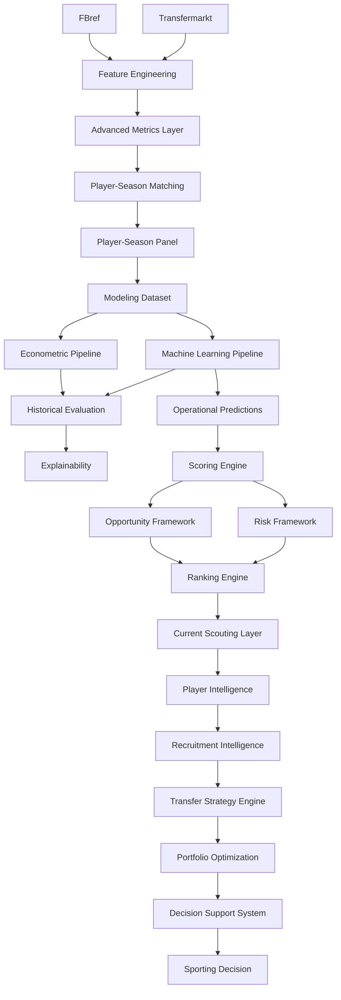

# 🔄 Pipeline Reference

## Objetivo

Este documento describe la arquitectura completa de pipelines implementada en la release:

```text
v2.0.0 — DSS Architecture, Data Contracts & Productization
```

Su finalidad es garantizar:

* reproducibilidad;
* trazabilidad;
* auditabilidad;
* mantenibilidad;
* consistencia metodológica;
* escalabilidad analítica;
* validez externa;
* generalización multi-liga;
* integración de métricas avanzadas;
* optimización estratégica de fichajes.

La arquitectura actual transforma información deportiva y económica procedente de múltiples fuentes en recomendaciones accionables para scouting, recruitment y soporte avanzado a decisiones deportivas.

---

# 🧠 Filosofía de diseño

La arquitectura sigue seis principios fundamentales.

---

## Reproducibilidad

Todos los resultados pueden regenerarse a partir de:

* datos fuente;
* scripts versionados;
* configuraciones explícitas;
* artefactos parametrizados.

La reproducibilidad constituye un requisito fundamental tanto para investigación académica como para aplicaciones operativas.

---

## Modularidad

Cada pipeline implementa una responsabilidad específica dentro del sistema.

Beneficios:

* mantenimiento simplificado;
* extensibilidad;
* reutilización;
* testing independiente;
* evolución incremental.

---

## Separación entre análisis y decisión

### Analytical Layer

* Data Engineering
* Feature Engineering
* Advanced Metrics
* Econometrics
* Machine Learning
* Explainability

### Decision Layer

* Opportunity Detection
* Risk Assessment
* Player Intelligence
* Recruitment Intelligence
* Transfer Strategy
* Portfolio Optimization
* Decision Support

Esta separación permite desacoplar la generación de conocimiento analítico de la toma de decisiones deportivas.

---

## Validación externa

Introducida durante Sprint 13A.

Principio:

```text
External Validation by Expansion
```

La robustez metodológica se evalúa mediante ampliación sistemática de cobertura competitiva.

La metodología debe demostrar capacidad de generalización fuera del universo competitivo original.

---

## Validación incremental de features

Introducida durante Sprint 13B.

Principio:

```text
Feature Validation by Incremental Contribution
```

Toda nueva variable debe demostrar capacidad explicativa adicional antes de ser promovida a producción.

Las métricas avanzadas incorporadas durante Sprint 13B siguen este principio.

---

## Decision Science & Operations Research

Introducida durante Sprint 14.

Principio:

```text
Decision Optimization under Real Constraints
```

La plataforma no se limita a identificar oportunidades individuales.

El objetivo final consiste en construir estrategias óptimas de captación considerando simultáneamente:

* restricciones presupuestarias;
* necesidades posicionales;
* calidad mínima requerida;
* perfiles estratégicos;
* utilización eficiente de recursos.

Este principio introduce formalmente conceptos procedentes de:

* Decision Science;
* Operations Research;
* Portfolio Optimization.

---

# 📊 Estado actual

| Pipeline                          | Estado |
| --------------------------------- | ------ |
| Data Ingestion Pipeline           | ✅      |
| Feature Engineering Pipeline      | ✅      |
| Advanced Metrics Pipeline         | ✅      |
| Matching Pipeline                 | ✅      |
| Player-Season Panel Pipeline      | ✅      |
| Modeling Dataset Pipeline         | ✅      |
| Econometric Pipeline              | ✅      |
| Machine Learning Pipeline         | ✅      |
| Historical Evaluation Pipeline    | ✅      |
| Explainability Pipeline           | ✅      |
| Scoring Pipeline                  | ✅      |
| Ranking Pipeline                  | ✅      |
| Current Scouting Pipeline         | ✅      |
| Player Intelligence Pipeline      | ✅      |
| Recruitment Intelligence Pipeline | ✅      |
| Transfer Strategy Pipeline        | ✅      |
| Portfolio Optimization Pipeline   | ✅      |
| Decision Support Pipeline         | ✅      |
| Internationalization Layer        | ✅      |
| Multi-League Expansion Layer      | ✅      |
| Coverage Diagnostics Pipeline     | ✅      |
| Coverage Audit Pipeline           | ✅      |

---

# 🏗️ Arquitectura global



---

# 🔄 Evolución funcional

```text
Econometric Model
↓
Machine Learning
↓
Opportunity Detection
↓
Risk Assessment
↓
Player Intelligence
↓
Recruitment Intelligence
↓
Transfer Strategy Engine
↓
Portfolio Optimization
↓
Decision Support System
```

Contribuciones principales por fase:

### Sprint 13A

* Multi-League Expansion.
* External Validation.
* Coverage Diagnostics.
* Coverage Audit.

### Sprint 13B

* Advanced Metrics Layer.
* Feature Set Evaluation.
* Incremental Feature Validation.
* Explainability Enhancement.

### Sprint 14

* Transfer Strategy Engine.
* Binary Integer Programming.
* Portfolio Optimization.
* Scenario Simulation.

### Sprint 14.1

* Player Level Layer.
* Quality-Constrained Optimization.
* Strategic Recruitment Segmentation.

---

# 🎯 Arquitectura DSS actual

La plataforma ha evolucionado desde un sistema de estimación de valor de mercado hacia un DSS (Decision Support System) completo para procesos de scouting y recruitment.

La cadena de valor actual puede resumirse mediante:

```text
Data Engineering
↓
Advanced Metrics Layer
↓
Econometrics
+
Machine Learning
↓
Opportunity Detection
↓
Risk Assessment
↓
Player Intelligence
↓
Recruitment Intelligence
↓
Transfer Strategy Engine
↓
Portfolio Optimization
↓
Decision Support System
```

Esta arquitectura constituyó el estado productivo tras Sprint 14 y 14.1 y fue ampliada posteriormente por TM.2, TM.3 y los cierres TM.6–TM.8 descritos en este documento.

# 📦 Data Ingestion Pipeline

## Objetivo

Responsable de la adquisición, normalización y organización de las fuentes de datos utilizadas por el sistema.

---

## Fuentes integradas

### FBref

Tipo:

```text
Performance Data Source
```

Proporciona:

* estadísticas deportivas;
* métricas avanzadas;
* rendimiento por 90 minutos;
* contexto competitivo.

---

### Transfermarkt

Tipo:

```text
Market Valuation Source
```

Proporciona:

* valor de mercado;
* evolución temporal;
* edad;
* posición;
* contexto económico.

---

## Outputs

```text
data/raw/
data/interim/
```

---

# ⚙️ Feature Engineering Pipeline

## Objetivo

Transformar datos deportivos y económicos en variables analíticas utilizables por los modelos.

---

## Transformaciones principales

### Deportivas

* métricas por 90;
* percentiles posicionales;
* normalización por posición;
* métricas relativas;
* índices compuestos.

### Económicas

* log_market_value_eur;
* market_value_growth_prev;
* delta_log_market_value_prev.

### Temporales

* career_year;
* breakout_indicator;
* experience_index;
* age_squared.

---

# 🔬 Advanced Metrics Pipeline

Introducido durante Sprint 13B.

## Variables productivas

* finishing_index_v2
* availability_index
* defensive_activity_index

---

## Resultado metodológico

Las tres variables aportan capacidad predictiva incremental y fueron promovidas a producción tras superar validación econométrica y Machine Learning.

Hallazgo principal:

```text
finishing_index_v2
```

representa la métrica avanzada con mayor relevancia predictiva agregada.

---

# 🔗 Matching Pipeline

## Objetivo

Resolver la integración:

```text
FBref ↔ Transfermarkt
```

manteniendo un enfoque conservador orientado a maximizar calidad de matching.

---

## Estrategia

```text
Normalización
↓
Exact Matching
↓
Club Validation
↓
Fuzzy Matching
↓
Age Validation
```

---

## Resultado actual

| Métrica           |  Valor |
| ----------------- | -----: |
| Match Rate global | 75,97% |

---

# 📈 Player-Season Panel Pipeline

## Objetivo

Construir el panel longitudinal jugador-temporada utilizado por todas las capas posteriores.

---

## Resultado actual

| Métrica             |  Valor |
| ------------------- | -----: |
| Observaciones FBref | 43.591 |
| Ligas               |     11 |
| Temporadas          |      7 |
| Liga-temporada      |     77 |

---

## Cobertura competitiva

### Ligas principales

* Premier League
* LaLiga
* Bundesliga
* Serie A
* Ligue 1
* Eredivisie
* Liga Portugal

### Ligas incorporadas

* Championship
* Belgian Pro League
* Austrian Bundesliga
* Spanish Segunda División

---

# 📈 Modeling Dataset Pipeline

## Objetivo

Generar el dataset final utilizado por los modelos predictivos.

---

## Dataset productivo actual

| Métrica        | Valor |
| -------------- | ----: |
| Observaciones  | 5.527 |
| Ligas          |    11 |
| Temporadas     |     7 |
| Liga-temporada |    77 |

---

## Beneficio metodológico

La combinación de:

```text
Sprint 13A
+
Sprint 13B
```

incrementa simultáneamente:

* representatividad;
* diversidad competitiva;
* capacidad explicativa;
* robustez metodológica.

---

# 📈 Econometric Pipeline

## Modelo oficial

```text
Growth OLS v13B
```

---

## Objetivo

Actuar como benchmark interpretable para explicar los determinantes económicos y deportivos del valor de mercado.

---

## Resultado oficial

| Métrica |  Valor |
| ------- | -----: |
| R²      | 0.4549 |

---

## Rol dentro del sistema

```text
Academic Benchmark Model
```

---

# 🤖 Machine Learning Pipeline

## Modelo oficial

```text
Tuned XGBoost v13B
```

---

## Objetivo

Maximizar capacidad predictiva mediante modelos no lineales capaces de capturar relaciones complejas entre rendimiento deportivo y valoración económica.

---

## Rol dentro del sistema

```text
Production Prediction Engine
```

## Resultado productivo oficial

```text
Tuned XGBoost v13B

RMSE = 0.9639
MAE  = 0.7777
R²   = 0.4453
```

## Referencia histórica de validación externa

Sprint 13A.1 obtuvo el mejor resultado predictivo alcanzado durante el proyecto:

```text
Tuned XGBoost

RMSE = 0.8525
MAE  = 0.6834
R²   = 0.5664
```

Este experimento constituye la principal evidencia de capacidad de generalización multi-liga de la metodología desarrollada.

---

# 🔬 Explainability Pipeline

## Componentes

* Feature Importance
* SHAP Analysis
* Player-Level Explainability

---

## Objetivo

Transformar modelos complejos en conocimiento interpretable para scouting y recruitment.

---

# 🎯 Opportunity & Risk Pipeline

## Opportunity Framework

```text
Predicted Market Value
↓
Observed Market Value
↓
Inefficiency Detection
↓
Opportunity Score
```

---

## Risk Framework

```text
Risk Score
↓
Risk Category
↓
Risk-adjusted Opportunity
```

---

## Objetivo

Priorizar oportunidades considerando simultáneamente upside esperado y nivel de incertidumbre asociado.

---

# ⚽ Player Intelligence Pipeline

## Componentes

* Player Radar
* Positional Benchmarking
* Opportunity vs Risk Matrix
* Scouting Narrative

---

## Objetivo

Transformar resultados analíticos en conocimiento accionable a nivel individual.

---

# 🎯 Recruitment Intelligence Pipeline

## Componentes

* Recruitment Board
* Candidate Selection
* Comparative Analysis
* Executive Scouting Workflow
* Global Search Engine

---

## Objetivo

Transformar análisis individuales en procesos estructurados de recruitment.

---

# 🧠 Transfer Strategy Pipeline

Introducido durante Sprint 14.

## Pregunta objetivo

```text
¿Qué cartera de fichajes maximiza
el valor esperado bajo restricciones
reales de club?
```

---

## Inputs

* Budget
* Positions Needed
* Scenario
* Portfolio Style
* Minimum Player Level
* Maximum Signings

---

## Outputs

* Recommended Portfolio
* Total Cost
* Budget Utilization
* Expected Upside
* Expected ROI
* Average Portfolio Score

---

# 📊 Portfolio Optimization Pipeline

Introducido durante Sprint 14.

## Metodología

```text
Binary Integer Programming
(PuLP)
```

---

## Restricciones implementadas

* presupuesto máximo;
* utilización mínima del presupuesto;
* restricciones posicionales;
* número máximo de incorporaciones;
* nivel mínimo de jugador;
* escenarios estratégicos.

---

## Escenarios

### Conservative

Prioriza estabilidad y robustez.

### Balanced

Equilibrio entre upside y riesgo.

### Aggressive

Maximización de upside esperado.

---

## Player Level Layer (Sprint 14.1)

Niveles implementados:

* Development Prospect
* Rotation Profile
* First Team Ready
* Key Player Profile
* Elite Target

Esta capa permite incorporar restricciones explícitas de calidad mínima dentro de los procesos de optimización.

---

# 🖥️ Decision Support Pipeline

## Aplicación principal

```text
app/streamlit_app.py
```

---

## Capacidades actuales

* Executive Dashboard.
* Opportunity Detection.
* Risk Assessment.
* Recruitment Intelligence.
* Transfer Strategy Engine.
* Portfolio Optimization.
* EN/ES Internationalization.

---

# 🔄 Evolución histórica

| Sprint       | Evolución                             |
| ------------ | ------------------------------------- |
| Sprint 5     | Scoring Engine                        |
| Sprint 6     | Business Evaluation Layer             |
| Sprint 7     | Executive Dashboard                   |
| Sprint 9     | Decision Support Layer                |
| Sprint 10    | Player Intelligence                   |
| Sprint 11    | Recruitment Intelligence              |
| Sprint 12    | Productization & Internationalization |
| Sprint 13A   | Multi-League Expansion                |
| Sprint 13A.1 | External Validation                   |
| Sprint 13B   | Advanced Metrics Layer                |
| Sprint 14    | Transfer Strategy Engine              |
| Sprint 14.1  | Player Level Layer                    |
| TM.2         | Multi-League DSS Integration          |

---

# 🔁 Reproducibilidad

La arquitectura permite reconstruir completamente cualquier resultado publicado mediante:

* código versionado;
* datasets versionados;
* MLflow;
* pipelines parametrizados;
* trazabilidad completa de artefactos.

---

# 🛣️ Roadmap

> TM.2 está completado. TM.1 quedó parcialmente absorbido por 13A.1; las prioridades todavía abiertas se mantienen en [project_evolution.md](project_evolution.md#roadmap-vigente).

## TM.1 — Transfermarkt Coverage Audit

Estado:

```text
Backlog
```

Objetivo:

Determinar el origen de las limitaciones de cobertura observadas tras la expansión multi-liga.

---

## TM.2 — Multi-League DSS Integration

Estado:

```text
COMPLETADO
```

Objetivo alcanzado:

Alinear completamente la cobertura de modelización multi-liga con las capas de scoring, rankings, Transfer Strategy Engine y DSS.

Resultado:

```text
Modeling Layer
↓
11 ligas

Scoring Layer
↓
11 ligas

Ranking Engine
↓
11 ligas

Transfer Strategy Engine
↓
11 ligas

Decision Support System
↓
11 ligas
```

TM.2 garantiza consistencia metodológica completa entre modelización y capas operativas sin modificar modelos econométricos, modelos Machine Learning ni lógica de scoring.


---

## Sprint 15 — Strategic Optimization Refinement

Objetivo:

Refinar la capa de optimización incorporando:

* simplificación de restricciones estratégicas;
* revisión de escenarios;
* evolución del perfil de riesgo;
* optimización multicriterio.

---

## Investigación futura

### Modelización

* CatBoost.
* TabPFN.
* Ensemble Learning.

### Datos

* nuevas métricas FBref;
* event data;
* tracking data;
* información contractual;
* información salarial.

### Football Analytics

* Similarity Engine.
* Career Trajectory Modeling.
* Club Development Intelligence.

### Sports Economics

* Dynamic Asset Valuation.
* Multi-Objective Optimization.
* Portfolio Simulation.

---

# 🏁 Conclusión

La arquitectura actual representa la evolución desde un sistema de predicción de valor de mercado hacia una plataforma integral de Football Analytics orientada a scouting, recruitment y soporte cuantitativo a decisiones deportivas.

La cadena de valor actual puede resumirse mediante:

```text
Data Engineering
↓
Advanced Metrics Layer
↓
Econometrics
+
Machine Learning
↓
Opportunity Detection
↓
Risk Assessment
↓
Player Intelligence
↓
Recruitment Intelligence
↓
Transfer Strategy Engine
↓
Portfolio Optimization
↓
Decision Support System
```

La incorporación de Sprint 14 y Sprint 14.1 constituye la transición desde la identificación de oportunidades individuales hacia la optimización estratégica de decisiones de fichaje bajo restricciones reales de club, incorporando formalmente conceptos de Decision Science y Operations Research dentro de la arquitectura del proyecto.

## Pipelines añadidos hasta v2.0.0

### Snapshot y presentación

El snapshot actual se aplica mediante un entrypoint controlado y conserva separadas las columnas históricas. El Presentation Layer deriva nombres, club, liga, nacionalidad, valor e identidad visual consumidos por Streamlit.

### Registry y contratos

El Identity Registry actúa como SSOT de jugadores. La DataFrame Contract Layer valida esquema y contexto antes de entregar el universo a scoring, rankings, portfolio o interfaz.

### Riesgo y contexto DSS

La Risk Authority suministra el score canónico. El contexto DSS agrega una sola vez las fuentes necesarias y se reutiliza mediante caché, evitando cargas y transformaciones redundantes por vista.

### Validación de cierre

La secuencia de release incluye tests de contratos, snapshots, registry, presentación y consumidores DSS, además de compilación de la aplicación. La promoción automatizada de snapshots y el CI documental continúan en roadmap.
