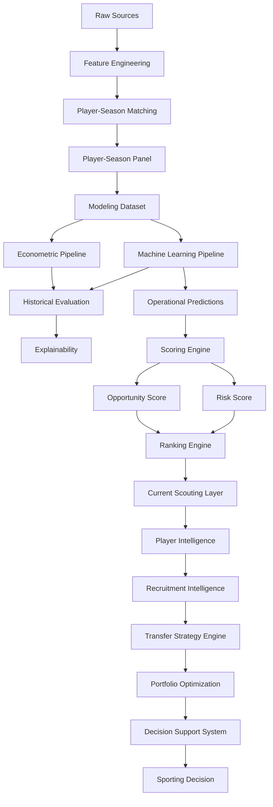

# 🔄 Referencia de Pipelines

## Objetivo

Este documento describe la arquitectura de pipelines implementada en la release:

```text
v1.1.0 — Strategic Recruitment & Decision Support System
```

Su objetivo es garantizar:

* Reproducibilidad.
* Trazabilidad.
* Auditabilidad.
* Mantenibilidad.
* Consistencia metodológica.
* Escalabilidad analítica.

---

# 📊 Estado actual

| Pipeline                          | Estado |
| --------------------------------- | ------ |
| Data Ingestion                    | ✅      |
| Feature Engineering               | ✅      |
| Matching Pipeline                 | ✅      |
| Modeling Dataset                  | ✅      |
| Econometric Pipeline              | ✅      |
| Machine Learning Pipeline         | ✅      |
| Historical Evaluation Pipeline    | ✅      |
| Explainability Pipeline           | ✅      |
| Scoring Engine                    | ✅      |
| Ranking Engine                    | ✅      |
| Current Scouting Pipeline         | ✅      |
| Player Intelligence Pipeline      | ✅      |
| Recruitment Intelligence Pipeline | ✅      |
| Transfer Strategy Pipeline        | ✅      |
| Scenario Simulation Pipeline      | ✅      |
| Portfolio Optimization Pipeline   | ✅      |
| Decision Support Pipeline         | ✅      |
| Internationalization Layer        | ✅      |

---

# 🏗️ Pipeline global



---

# 📦 Data Pipeline

Responsable de la adquisición y consolidación de datos.

## Fuentes

* FBref.
* Transfermarkt.

## Outputs

```text
data/raw/
data/interim/
```

---

# ⚙️ Feature Engineering Pipeline

Responsable de la construcción de variables deportivas y económicas.

## Outputs

```text
player_season_panel.parquet
player_season_modeling.parquet
```

## Dataset modelizable

| Métrica            |                 Valor |
| ------------------ | --------------------: |
| Observaciones      |                 3.916 |
| Jugadores únicos   |                 2.136 |
| Cobertura temporal | 2019-2020 → 2025-2026 |

---

# 🔗 Matching Pipeline

Objetivo:

```text
FBref ↔ Transfermarkt
```

## Metodología

* Exact Matching.
* Club Validation.
* Age Validation.
* Fuzzy Matching.

## Resultado

```text
Match Rate ≈ 88%
```

## Output principal

```text
player_season_panel.parquet
```

---

# 📈 Econometric Pipeline

Ubicación:

```text
src/models/econometric/
```

## Objetivo

Construir un benchmark interpretable.

## Modelo principal

```text
Growth OLS
```

## Resultado

| Modelo     |     R² |
| ---------- | -----: |
| Growth OLS | 0.5258 |

---

# 🤖 Machine Learning Pipeline

Ubicación:

```text
src/models/machine_learning/
```

## Modelos evaluados

* Random Forest.
* HistGradientBoosting.
* LightGBM.
* XGBoost.

## Modelo productivo

```text
Tuned XGBoost
```

## Resultado

| Modelo        |     R² |
| ------------- | -----: |
| Tuned XGBoost | 0.5414 |

---

# 📊 Historical Evaluation Pipeline

Responsable de la validación metodológica de modelos.

## Funciones

* Validación temporal.
* Comparación de algoritmos.
* Backtesting.
* Evaluación académica.

## Artefactos

```text
test_predictions.csv
full_predictions.csv
evaluation_metrics.csv
```

---

# 🔬 Explainability Pipeline

Responsable de interpretar decisiones de los modelos.

## Componentes

```text
Feature Importance
SHAP Analysis
Player SHAP Reports
```

## Outputs

```text
reports/figures/explainability/
reports/scouting_reports/
```

---

# 🎯 Scoring Engine

Transforma predicciones en señales accionables.

## Flujo

```text
Predictions
↓
Inefficiency Score
↓
Growth Score
↓
Confidence Score
↓
Opportunity Score
↓
Risk Score
```

---

# 📋 Ranking Engine

Transforma scores en recomendaciones priorizadas.

## Outputs

```text
Global Rankings
League Rankings
Position Rankings
Risk Rankings
Scouting Shortlists
```

---

# ⚽ Current Scouting Pipeline

Introducido durante Sprint 10.

## Capacidades

* Opportunity Detection.
* Risk Assessment.
* Opportunity vs Risk Matrix.
* Scouting Shortlists.

---

# 🧠 Player Intelligence Pipeline

Introducido durante Sprint 10.

## Componentes

### Player Radar

Visualización multidimensional de rendimiento.

### Positional Benchmarking

Comparación respecto a jugadores de la misma posición.

### Scouting Narrative

Interpretación automática de fortalezas y debilidades.

---

# 🎯 Recruitment Intelligence Pipeline

Introducido durante Sprint 11.

## Objetivo

Transformar análisis individuales en procesos operativos de recruitment.

### Componentes

* Recruitment Board.
* Candidate Selection System.
* Comparative Player Analysis.
* Executive Scouting Workflow.

### Flujo

```text
Opportunity Detection
↓
Filtering
↓
Shortlisting
↓
Comparative Analysis
↓
Recruitment Decision
```

---

# 📈 Transfer Strategy Pipeline

Introducido durante Sprint 14.

## Objetivo

Transformar shortlists de scouting en estrategias óptimas de fichajes.

---

## Portfolio Dataset

Construcción del universo optimizable.

### Outputs

```text
reports/portfolio/portfolio_candidates.csv
reports/portfolio/portfolio_candidates.parquet
```

---

## Optimization Engine

Implementación:

```text
0-1 Knapsack Optimization
PuLP
```

### Restricciones

* Presupuesto.
* Posiciones.
* Número máximo de fichajes.

### Outputs

```text
recommended_portfolio.csv
recommended_portfolio_summary.json
```

---

# 📊 Scenario Simulation Pipeline

Introducido durante Sprint 14.

## Escenarios

* Conservative.
* Balanced.
* Aggressive.

### Outputs

```text
reports/portfolio/scenarios/
```

---

# 💼 Portfolio Optimization Pipeline

Objetivo:

Transformar candidatos individuales en estrategias completas de asignación de recursos.

### Inputs

* Budget.
* Positions.
* Risk Profile.

### Outputs

* Recommended Portfolio.
* Portfolio KPIs.
* Scenario Comparison.

### Resultado

```text
Strategic Recruitment Engine
```

---

# 🖥️ Decision Support Pipeline

Consolidado durante Sprint 12.

## Aplicación principal

```text
app/streamlit_app.py
```

## Componentes

### Advanced Search Engine

* Jugador.
* Club.
* Liga.
* Posición.

### UX Layer

* Search Suggestions.
* Search Chips.
* Executive Navigation.
* Quick Guide.

### Internationalization

* Español.
* Inglés.

### Strategic Recruitment

* Portfolio Builder.
* Scenario Comparison.
* Transfer Strategy Engine.

---

# 🔄 Evolución de pipelines

| Sprint    | Evolución                                         |
| --------- | ------------------------------------------------- |
| Sprint 5  | Scoring Engine                                    |
| Sprint 6  | Evaluation Layer                                  |
| Sprint 7  | Executive Dashboard                               |
| Sprint 9  | Decision Support Layer                            |
| Sprint 10 | Player Intelligence Layer                         |
| Sprint 11 | Recruitment Intelligence Layer                    |
| Sprint 12 | Productization, UX & Internationalization         |
| Sprint 14 | Transfer Strategy Engine & Portfolio Optimization |

---

# 🏁 Conclusión

La arquitectura de pipelines v1.1.0 consolida la evolución del proyecto desde un sistema predictivo hacia una plataforma DSS orientada a scouting, recruitment y optimización de decisiones deportivas.

La incorporación de:

```text
Opportunity Detection
↓
Risk Assessment
↓
Player Intelligence
↓
Recruitment Intelligence
↓
Transfer Strategy Engine
↓
Portfolio Optimization
↓
Decision Support System
```

permite transformar predicciones de valor de mercado en estrategias completas de captación de talento bajo restricciones reales de presupuesto, riesgo y necesidades deportivas.

La principal contribución de la release consiste en extender el sistema desde la identificación de oportunidades individuales hacia la construcción de carteras óptimas de fichajes mediante técnicas de optimización y simulación de escenarios.