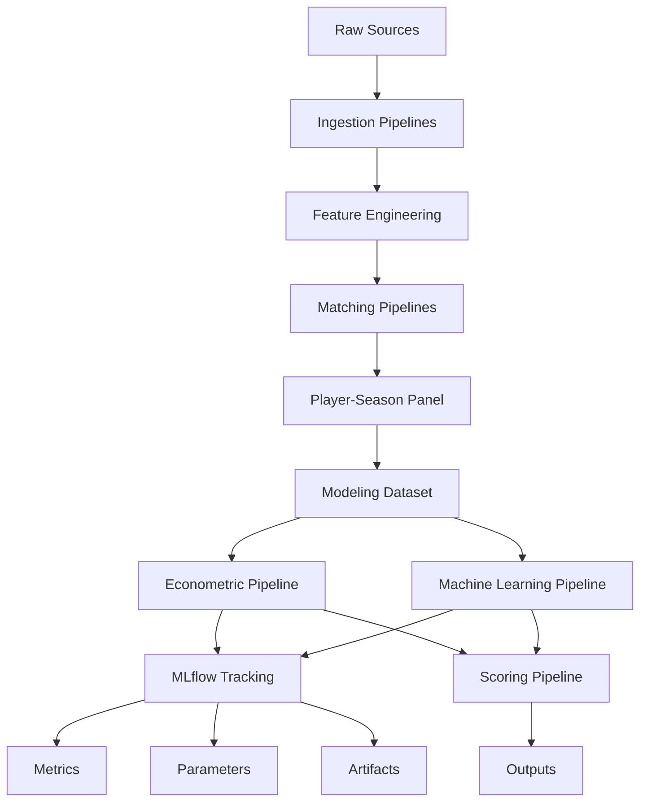

# ⚙️ Referencia de pipelines

<div align="center">


</div>

---

# 📑 Tabla de contenidos

- [🧠 Objetivo](#-objetivo)
- [🏗️ Filosofía de pipelines](#️-filosofía-de-pipelines)
- [📂 Arquitectura general](#-arquitectura-general)
- [📦 Pipeline inventory](#-pipeline-inventory)
- [⚙️ Configuración centralizada](#️-configuración-centralizada)
- [📥 Data ingestion pipelines](#-data-ingestion-pipelines)
- [🧪 Feature engineering pipelines](#-feature-engineering-pipelines)
- [🔗 Matching pipelines](#-matching-pipelines)
- [📊 Modeling dataset pipelines](#-modeling-dataset-pipelines)
- [📈 Econometric pipelines](#-econometric-pipelines)
- [🤖 Machine learning pipelines](#-machine-learning-pipelines)
- [🧪 MLflow experiment tracking](#-mlflow-experiment-tracking)
- [💡 Scoring pipelines](#-scoring-pipelines)
- [📊 Evaluation pipelines](#-evaluation-pipelines)
- [📤 Output generation](#-output-generation)
- [📝 Logging](#-logging)
- [⏳ Temporal validation workflow](#-temporal-validation-workflow)
- [▶️ Ejecución completa del sistema](#️-ejecución-completa-del-sistema)
- [🛡️ Controles y validaciones](#️-controles-y-validaciones)
- [📂 Inputs y outputs](#-inputs-y-outputs)
- [🚀 Evolución futura](#-evolución-futura)

---

# 🧠 Objetivo

Este documento describe los pipelines analíticos implementados en el sistema, así como:

- dependencias
- inputs
- outputs
- orden de ejecución
- validaciones
- responsabilidades funcionales
- configuración utilizada
- artefactos generados
- tracking experimental

El objetivo es garantizar:

- reproducibilidad
- mantenibilidad
- trazabilidad
- ejecución modular
- comparación rigurosa entre experimentos
- replicabilidad académica del TFM

---

# 🏗️ Filosofía de pipelines

La arquitectura del proyecto sigue principios de analytics engineering.

Cada pipeline:

- tiene una responsabilidad específica
- genera outputs reproducibles
- desacopla lógica funcional
- evita dependencia de notebooks
- facilita validación y mantenimiento
- consume configuración externa
- puede integrarse en tracking experimental

---

## Principio general

La lógica principal del sistema reside en:

<pre>
src/
</pre>

Los notebooks quedan reservados para:

- exploración
- validación
- interpretación
- análisis visual

---

## Separación conceptual

El sistema separa explícitamente:

```text
datos fuente
features procesadas
dataset modelizable
modelos entrenados
outputs de negocio
artefactos
experimentos
logs
configuración
```

---

# 📂 Arquitectura general



---

# 📦 Pipeline inventory

| Pipeline                 | Estado |
| ------------------------ | ------ |
| Data ingestion           | ✅      |
| Feature engineering      | ✅      |
| Matching                 | ✅      |
| Modeling dataset         | ✅      |
| Econometric modeling     | ✅      |
| Machine Learning         | ✅      |
| MLflow tracking          | ✅      |
| Scoring                  | ✅      |
| Evaluation               | ✅      |
| Logging                  | ✅      |
| Configuration management | ✅      |

---

# ⚙️ Configuración centralizada

## Objetivo

Centralizar parámetros, rutas y decisiones metodológicas fuera del código fuente.

---

## Directorio

<pre>
config/
</pre>

---

## Archivos principales

| Archivo         | Función                                   |
| --------------- | ----------------------------------------- |
| `config.yaml`   | Configuración general agregada            |
| `paths.yaml`    | Rutas de datos, reports, artifacts y logs |
| `project.yaml`  | Metadatos generales del proyecto          |
| `matching.yaml` | Parámetros del matching                   |
| `features.yaml` | Configuración de feature engineering      |
| `modeling.yaml` | Target, features, modelos y validación    |

---

## Beneficios

La configuración centralizada permite:

* evitar hardcoding
* modificar experimentos sin tocar lógica de negocio
* facilitar reproducibilidad
* documentar decisiones técnicas
* registrar configuraciones en MLflow
* mejorar mantenibilidad

---

## Decisión metodológica

La configuración declara parámetros.

La lógica de transformación, entrenamiento y evaluación permanece en:

<pre>
src/
</pre>

---

# 📥 Data ingestion pipelines

## Objetivo

Extraer y normalizar datos desde múltiples fuentes heterogéneas.

---

# FBref ingestion

## Pipeline

<pre>
src/data/ingest_fbref.py
</pre>

---

## Funcionalidades

* parsing HTML
* extracción de tablas
* limpieza básica
* export parquet

---

## Input

<pre>
data/raw/fbref/
</pre>

---

## Output

<pre>
data/processed/fbref_features.parquet
</pre>

---

## Configuración asociada

<pre>
config/paths.yaml
</pre>

---

# Transfermarkt ingestion

## Pipeline

<pre>
src/data/ingest_transfermarkt.py
</pre>

---

## Funcionalidades

* lectura datasets Kaggle
* normalización
* limpieza
* validación

---

## Input

<pre>
data/raw/transfermarkt/
</pre>

---

## Output

<pre>
data/processed/transfermarkt_features.parquet
</pre>

---

## Configuración asociada

<pre>
config/paths.yaml
</pre>

---

# 🧪 Feature engineering pipelines

## Objetivo

Construir variables deportivas y contextuales para modelización.

---

# FBref features

## Pipeline

<pre>
src/data/build_fbref_features.py
</pre>

---

## Features actuales

### Rendimiento ofensivo

* goals_per90
* assists_per90
* g_a_per90

---

### Volumen de juego

* minutes_played
* log_minutes_played
* starts
* nineties

---

### Contexto

* age
* league
* season
* position_group

---

## Output

<pre>
data/processed/fbref_features.parquet
</pre>

---

## Configuración asociada

<pre>
config/features.yaml
config/paths.yaml
</pre>

---

## Estado actual

El sistema dispone actualmente de un baseline sólido, aunque todavía limitado en señal predictiva avanzada.

La próxima fase de mejora debe centrarse en:

* z-scores por posición
* percentiles
* progression metrics
* métricas defensivas
* rolling metrics
* growth indicators

---

# 🔗 Matching pipelines

## Objetivo

Integrar FBref y Transfermarkt sin identificador común.

---

# Player-season matching

## Pipeline

<pre>
src/data/build_player_season_panel.py
</pre>

---

## Problemas resueltos

* transliteraciones
* diferencias de nombre
* cambios de club
* granularidad distinta
* edades inconsistentes

---

## Estrategia implementada

Pipeline jerárquico:

1. normalización
2. matching exacto
3. validación por club
4. matching fuzzy
5. validación por edad

---

## Parámetros críticos

```python
MAX_AGE_DIFF = 1.5
MIN_CLUB_SCORE = 70
FUZZY_THRESHOLD = 92
```

---

## Configuración asociada

<pre>
config/matching.yaml
</pre>

---

## Output principal

<pre>
data/processed/player_season_panel.parquet
</pre>

---

## Resultado actual

| Métrica                   |  Valor |
| ------------------------- | -----: |
| Match rate                | 88.36% |
| Observaciones emparejadas | 20,836 |
| Observaciones totales     | 23,580 |

---

## Variables de auditoría

El pipeline preserva variables que permiten evaluar la calidad del matching:

* matching_status
* matching_method
* matching_confidence
* age_diff
* club_score

---

# 📊 Modeling dataset pipelines

## Objetivo

Construir el dataset final para modelización econométrica y ML.

---

# Modeling dataset

## Pipeline

<pre>
src/data/build_modeling_dataset.py
</pre>

---

## Funcionalidades

* filtros finales
* validación temporal
* selección de variables
* control leakage
* dataset final

---

## Filtros aplicados

* edad válida
* minutos mínimos
* market value disponible
* posición válida
* matching válido
* confianza mínima de matching

---

## Parámetros principales

```python
MIN_SEASON = 2019
MAX_SEASON = 2024
MIN_AGE = 18
MAX_AGE = 23
MIN_MINUTES = 300
MIN_MATCHING_CONFIDENCE = 0.85
MIN_MARKET_VALUE_EUR = 500_000
```

---

## Configuración asociada

<pre>
config/modeling.yaml
config/features.yaml
config/paths.yaml
</pre>

---

## Output

<pre>
data/processed/player_season_modeling.parquet
</pre>

---

## Resultado final

| Métrica       | Valor |
| ------------- | ----: |
| Observaciones | 3,297 |
| Jugadores     | 1,847 |
| Ligas         |     7 |
| Edad          | 18–23 |

---

# 📈 Econometric pipelines

## Objetivo

Construir modelos interpretables del valor de mercado.

---

# Arquitectura

<pre>
src/models/econometric/
</pre>

---

## Componentes

| Archivo               | Función                     |
| --------------------- | --------------------------- |
| `specifications.py`   | Fórmulas y especificaciones |
| `train_ols.py`        | Entrenamiento OLS           |
| `run_ols_pipeline.py` | Pipeline end-to-end         |

---

# Modelo implementado

OLS con:

* league FE
* season FE
* position FE
* HC3 robust covariance

---

## Variable objetivo

```python
log_market_value_eur
```

---

## Especificación principal

```python
log_market_value_eur ~
age +
log_minutes_played +
goals_per90 +
assists_per90 +
league FE +
season FE +
position FE
```

---

## Ejecución

```bash
python -m src.models.econometric.run_ols_pipeline
```

---

## Configuración asociada

<pre>
config/modeling.yaml
config/paths.yaml
config/project.yaml
</pre>

---

## Funcionalidades

* entrenamiento
* evaluación
* scoring
* rankings
* export automático
* validación temporal
* logging de métricas
* registro experimental MLflow

---

## Outputs generados

### Reports

<pre>
reports/tables/
reports/rankings/
reports/model_diagnostics/
</pre>

---

### Artifacts

<pre>
artifacts/models/
artifacts/predictions/
</pre>

---

### MLflow

<pre>
mlruns/
</pre>

---

## Métricas

* MAE
* RMSE
* R²

---

## Outputs específicos

* `ols_model_metrics.csv`
* `ols_undervalued.csv`
* `ols_overvalued.csv`
* predicciones out-of-sample
* coeficientes
* diagnósticos

---

# 🤖 Machine learning pipelines

## Objetivo

Evaluar capacidad predictiva adicional respecto a OLS.

---

# Arquitectura

<pre>
src/models/machine_learning/
</pre>

---

## Componentes

| Archivo              | Función             |
| -------------------- | ------------------- |
| `pipelines.py`       | Preprocessing       |
| `train_ml.py`        | Entrenamiento       |
| `run_ml_pipeline.py` | Pipeline end-to-end |

---

## Modelos implementados

* RandomForestRegressor
* GradientBoostingRegressor
* HistGradientBoostingRegressor

---

## Funcionalidades

* preprocessing pipeline
* one-hot encoding
* temporal validation
* feature importance
* model persistence
* experiment tracking
* export automático

---

## Ejecución

```bash
python -m src.models.machine_learning.run_ml_pipeline
```

---

## Configuración asociada

<pre>
config/modeling.yaml
config/features.yaml
config/paths.yaml
config/project.yaml
</pre>

---

## Outputs

### Artifacts

<pre>
artifacts/models/
artifacts/predictions/
artifacts/feature_importance/
</pre>

---

### Reports

<pre>
reports/tables/
reports/model_diagnostics/
</pre>

---

### MLflow

<pre>
mlruns/
</pre>

---

## Outputs específicos

* `ml_model_metrics.csv`
* feature importance CSVs
* modelos `.joblib`
* predicciones out-of-sample
* métricas registradas en MLflow

---

# 🧪 MLflow experiment tracking

## Objetivo

Registrar de forma estructurada los experimentos de modelización.

---

## Directorio

<pre>
mlruns/
</pre>

---

## Pipelines integrados

| Pipeline         | Tracking           |
| ---------------- | ------------------ |
| OLS              | ✅                  |
| Machine Learning | ✅                  |
| Evaluation       | ✅                  |
| Scoring derivado | Parcial / previsto |

---

## Información registrada

### Parámetros

* nombre del modelo
* target
* features utilizadas
* fixed effects
* hiperparámetros
* split temporal
* configuración relevante

---

### Métricas

* MAE
* RMSE
* R²

---

### Artefactos

* modelos
* predicciones
* métricas exportadas
* feature importance
* rankings
* diagnósticos

---

## Uso previsto

MLflow permite responder preguntas como:

* qué configuración generó un determinado ranking
* qué modelo obtuvo mejor RMSE
* qué features se usaron en un experimento
* qué hiperparámetros tenía el modelo entrenado
* qué ejecución debe tomarse como baseline reproducible

---

## Comando de interfaz

```bash
mlflow ui
```

---

## Acceso local

```text
http://127.0.0.1:5000
```

---

## Decisión metodológica

MLflow complementa los outputs del proyecto.

No sustituye a:

<pre>
reports/
artifacts/
logs/
</pre>

Su función es registrar la trazabilidad experimental.

---

# 💡 Scoring pipelines

## Objetivo

Transformar predicciones en outputs accionables para scouting.

---

# Arquitectura

<pre>
src/models/scoring/
</pre>

---

## Componentes

| Archivo           | Función            |
| ----------------- | ------------------ |
| `inefficiency.py` | Inefficiency Score |
| `rankings.py`     | Rankings scouting  |

---

## Funcionalidades

* predicted market value
* market value gap
* inefficiency score
* z-score normalization
* rankings automáticos

---

## Fórmula conceptual

```python
inefficiency_score =
valor_estimado - valor_observado
```

---

## Outputs

* jugadores infravalorados
* jugadores sobrevalorados
* rankings por liga
* rankings por posición

---

## Directorio principal

<pre>
reports/rankings/
</pre>

---

## Relación con MLflow

Cuando los rankings derivan de un experimento concreto, pueden registrarse como artefactos asociados al run correspondiente.

Esto permite vincular un ranking con:

* modelo
* configuración
* métricas
* features
* fecha de ejecución

---

# 📊 Evaluation pipelines

## Objetivo

Centralizar métricas y comparación de modelos.

---

# Arquitectura

<pre>
src/models/evaluation/
</pre>

---

## Componentes

| Archivo                 | Función               |
| ----------------------- | --------------------- |
| `metrics.py`            | Regression metrics    |
| `feature_importance.py` | Importancia variables |
| `model_comparison.py`   | Comparación modelos   |

---

## Métricas utilizadas

* RMSE
* MAE
* R²

---

## Funcionalidades

* evaluación estandarizada
* comparación OLS vs ML
* feature importance
* reporting automático
* logging de métricas en MLflow

---

## Outputs

<pre>
reports/tables/
reports/model_diagnostics/
artifacts/feature_importance/
mlruns/
</pre>

---

# 📤 Output generation

## Objetivo

Generar outputs reproducibles y reutilizables.

---

# Directorios principales

## Reports

<pre>
reports/
</pre>

---

## Artifacts

<pre>
artifacts/
</pre>

---

## MLflow

<pre>
mlruns/
</pre>

---

## Logs

<pre>
logs/
</pre>

---

# Outputs generados

## Reports

* rankings scouting
* métricas
* diagnósticos
* tablas comparativas
* outputs interpretables

---

## Artifacts

* modelos entrenados
* predicciones
* feature importance
* scalers
* encoders

---

## MLflow

* runs experimentales
* parámetros
* métricas
* artefactos asociados
* modelos registrados localmente

---

## Logs

* trazas de ejecución
* mensajes de pipeline
* advertencias
* errores controlados

---

# 📝 Logging

## Objetivo

Registrar eventos operativos de ejecución.

---

## Directorio

<pre>
logs/
</pre>

---

## Uso

Los logs permiten auditar:

* inicio y fin de pipelines
* número de filas procesadas
* paths de entrada y salida
* errores controlados
* warnings
* duración aproximada de ejecuciones

---

## Diferencia entre logging y MLflow

| Elemento  | Función                                        |
| --------- | ---------------------------------------------- |
| `logs/`   | Debugging y trazabilidad operativa             |
| `mlruns/` | Tracking experimental y comparación de modelos |

---

# ⏳ Temporal validation workflow

## Estrategia

| Split | Temporadas            |
| ----- | --------------------- |
| Train | 2019-2020 → 2023-2024 |
| Test  | 2024-2025             |

---

## Justificación

El mercado futbolístico es dinámico y no estacionario.

Por tanto, se evita:

```text
random split
```

---

## Objetivo

Simular un escenario realista de scouting futuro:

* entrenar con temporadas históricas
* evaluar sobre temporada futura
* evitar leakage temporal
* medir capacidad real de generalización

---

## Configuración asociada

<pre>
config/modeling.yaml
</pre>

---

## Registro en MLflow

Cada experimento debe registrar:

* temporada de train
* temporada de test
* número de observaciones train
* número de observaciones test
* criterio de split

---

# ▶️ Ejecución completa del sistema

## 1️⃣ Construir features FBref

```bash
python -m src.data.build_fbref_features
```

---

## 2️⃣ Construir features Transfermarkt

```bash
python -m src.data.build_transfermarkt_features
```

---

## 3️⃣ Construir panel jugador–temporada

```bash
python -m src.data.build_player_season_panel
```

---

## 4️⃣ Construir dataset modelizable

```bash
python -m src.data.build_modeling_dataset
```

---

## 5️⃣ Ejecutar pipeline econométrico

```bash
python -m src.models.econometric.run_ols_pipeline
```

---

## 6️⃣ Ejecutar pipeline Machine Learning

```bash
python -m src.models.machine_learning.run_ml_pipeline
```

---

## 7️⃣ Abrir MLflow UI

```bash
mlflow ui
```

---

## 8️⃣ Consultar interfaz local

```text
http://127.0.0.1:5000
```

---

# 🛡️ Controles y validaciones

## Controles de datos

* existencia de columnas críticas
* tipos de datos válidos
* valores de mercado positivos
* edad válida
* minutos mínimos
* posición válida

---

## Controles de matching

* validación por edad
* validación por club
* confidence score
* trazabilidad de método
* exclusión de matches de baja confianza

---

## Controles temporales

* split cronológico
* exclusión de información futura
* train/test separados por temporada

---

## Controles de leakage

Variables excluidas como inputs:

* market_value_next_eur
* delta_log_market_value_1y
* predicted_market_value_eur
* inefficiency_score
* rankings derivados

---

## Controles de modelización

* métricas out-of-sample
* comparación OLS vs ML
* feature importance
* persistencia de modelos
* tracking MLflow

---

# 📂 Inputs y outputs

## Inputs principales

| Input             | Ruta                      |
| ----------------- | ------------------------- |
| FBref raw         | `data/raw/fbref/`         |
| Transfermarkt raw | `data/raw/transfermarkt/` |
| Configuración     | `config/`                 |

---

## Datasets procesados

| Dataset                | Ruta                                            |
| ---------------------- | ----------------------------------------------- |
| FBref features         | `data/processed/fbref_features.parquet`         |
| Transfermarkt features | `data/processed/transfermarkt_features.parquet` |
| Player-season panel    | `data/processed/player_season_panel.parquet`    |
| Modeling dataset       | `data/processed/player_season_modeling.parquet` |

---

## Outputs principales

| Output              | Ruta                            |
| ------------------- | ------------------------------- |
| Rankings            | `reports/rankings/`             |
| Métricas            | `reports/tables/`               |
| Diagnósticos        | `reports/model_diagnostics/`    |
| Modelos             | `artifacts/models/`             |
| Predicciones        | `artifacts/predictions/`        |
| Feature importance  | `artifacts/feature_importance/` |
| Experimentos MLflow | `mlruns/`                       |
| Logs                | `logs/`                         |

---

# 🚀 Evolución futura

## Feature engineering

Próximos pipelines previstos:

* z-scores por posición
* percentiles por liga y posición
* métricas defensivas
* progression metrics
* rolling features
* age curves
* growth indicators

---

## Modelización

Próximos modelos previstos:

* CatBoost
* TabPFN
* modelos específicos por posición
* modelos con features longitudinales

---

## Scoring

Próxima evolución:

* Growth Score
* Confidence Score ampliado
* Opportunity Score
* estabilidad de rankings

---

## Explainability

Próximos módulos:

* SHAP global
* SHAP individual
* explicación automática por jugador
* explicación de rankings

---

## Producto final

Posibles extensiones:

* dashboard scouting
* scouting reports automáticos
* API de scoring
* automatización periódica

---

# 🧠 Conclusión

El sistema de pipelines ha evolucionado desde una estructura exploratoria hacia un entorno analítico modular, reproducible y trazable.

Actualmente el proyecto cuenta con:

* pipelines de datos
* matching multi-fuente
* dataset modelizable
* modelización econométrica
* machine learning supervisado
* scoring automático
* evaluación centralizada
* configuración YAML
* logs operativos
* tracking experimental con MLflow

La incorporación de MLflow y configuración centralizada refuerza notablemente el rigor metodológico del proyecto, ya que permite comparar experimentos, auditar decisiones y reconstruir ejecuciones relevantes.

El siguiente salto de valor no depende principalmente de añadir más infraestructura, sino de incrementar la señal predictiva mediante feature engineering avanzado y construir outputs de scouting más accionables.
