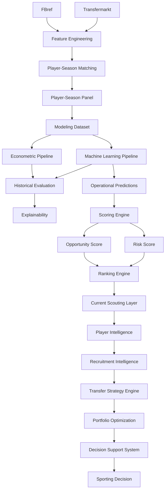

# 🔄 Pipeline Reference

## Objetivo

Este documento describe la arquitectura completa de pipelines implementada en la release:

```text
v1.2.0 — Multi-League Expansion
```

Su finalidad es garantizar:

* reproducibilidad;
* trazabilidad;
* auditabilidad;
* mantenibilidad;
* consistencia metodológica;
* escalabilidad analítica;
* validez externa;
* generalización multi-liga.

La arquitectura actual transforma información deportiva y económica procedente de múltiples fuentes en recomendaciones accionables para scouting, recruitment, portfolio optimization y soporte avanzado a decisiones deportivas.

---

# 🧠 Filosofía de diseño

La arquitectura sigue cuatro principios fundamentales.

## Reproducibilidad

Todos los resultados pueden regenerarse a partir de:

* datos fuente;
* scripts versionados;
* configuraciones explícitas;
* artefactos parametrizados.

---

## Modularidad

Cada pipeline implementa una responsabilidad concreta dentro del sistema.

Beneficios:

* mantenimiento simplificado;
* extensibilidad;
* reutilización;
* testing independiente.

---

## Separación entre análisis y decisión

### Analytical Layer

* Data Engineering
* Econometrics
* Machine Learning
* Explainability

### Decision Layer

* Opportunity Detection
* Risk Assessment
* Recruitment Intelligence
* Transfer Strategy Engine
* Portfolio Optimization
* Decision Support System

---

## Validación externa

Sprint 13A incorpora un cuarto principio:

```text
External Validation by Expansion
```

La robustez metodológica se evalúa mediante ampliación sistemática de cobertura competitiva.

---

# 📊 Estado actual

| Pipeline                          | Estado |
| --------------------------------- | ------ |
| Data Ingestion Pipeline           | ✅      |
| Feature Engineering Pipeline      | ✅      |
| Matching Pipeline                 | ✅      |
| Player-Season Panel Pipeline      | ✅      |
| Modeling Dataset Pipeline         | ✅      |
| Econometric Pipeline              | ✅      |
| Machine Learning Pipeline         | ✅      |
| Historical Evaluation Pipeline    | ✅      |
| Explainability Pipeline           | ✅      |
| Scoring Pipeline                  | ✅      |
| Ranking Pipeline                  | ✅      |
| Current Scouting Pipeline         | ✅      |
| Player Intelligence Pipeline      | ✅      |
| Recruitment Intelligence Pipeline | ✅      |
| Transfer Strategy Pipeline        | ✅      |
| Scenario Simulation Pipeline      | ✅      |
| Portfolio Optimization Pipeline   | ✅      |
| Decision Support Pipeline         | ✅      |
| Internationalization Layer        | ✅      |
| Multi-League Expansion Layer      | ✅      |
| Coverage Diagnostics Pipeline     | ✅      |
| Coverage Audit Pipeline           | ✅      |

---

# 🏗️ Arquitectura global



---

# 🔄 Evolución funcional de la arquitectura

```text
Econometric Model
↓
Machine Learning
↓
Opportunity Detection
↓
Risk Assessment
↓
Player Intelligence
↓
Recruitment Intelligence
↓
Transfer Strategy Engine
↓
Portfolio Optimization
↓
Decision Support System
↓
Multi-League External Validation
```

Sprint 13A no modifica la lógica analítica central del sistema.

Su principal contribución consiste en validar empíricamente la capacidad de generalización de la metodología mediante ampliación de cobertura competitiva.

---

# 📦 Data Ingestion Pipeline

Responsable de la adquisición y organización de datos fuente.

---

## Fuentes integradas

### FBref

Tipo:

```text
Performance Data Source
```

Proporciona:

* rendimiento deportivo;
* métricas por 90;
* contexto competitivo;
* información de participación.

---

### Transfermarkt

Tipo:

```text
Market Valuation Source
```

Proporciona:

* valor de mercado;
* edad;
* posición;
* contexto económico;
* evolución temporal.

---

## Outputs

```text
data/raw/
data/interim/
```

---

# ⚙️ Feature Engineering Pipeline

Responsable de la construcción de variables deportivas, económicas y temporales utilizadas durante la modelización.

---

## Inputs

```text
FBref Features
Transfermarkt Features
```

---

## Outputs principales

```text
fbref_features_v13a.parquet
transfermarkt_features_v13a.parquet
player_season_panel_v13a.parquet
player_season_modeling_v13a.parquet
player_season_modeling_indices_v13a.parquet
```

---

## Transformaciones deportivas

* métricas por 90;
* normalización posicional;
* percentiles por posición;
* índices compuestos;
* variables de rendimiento relativo.

---

## Transformaciones económicas

* log_market_value_eur;
* market_value_growth_prev;
* delta_log_market_value_prev;
* variables de evolución histórica.

---

## Transformaciones temporales

* career_year;
* breakout_indicator;
* experience_index;
* age_squared.

---

# 📈 Modeling Dataset Pipeline

Responsable de generar el dataset final utilizado por los modelos predictivos.

---

## Resultado Sprint 13A.1

| Métrica            |                 Valor |
| ------------------ | --------------------: |
| Observaciones      |                 5.527 |
| Ligas              |                    11 |
| Temporadas         |                     7 |
| Liga-temporada     |                    77 |
| Cobertura temporal | 2019-2020 → 2025-2026 |

---

## Beneficio metodológico

La ampliación multi-liga incrementa:

* representatividad;
* diversidad competitiva;
* robustez estadística;
* capacidad de generalización.

---

# 🔗 Matching Pipeline

## Objetivo

Resolver la integración:

```text
FBref ↔ Transfermarkt
```

mediante una estrategia conservadora orientada a maximizar calidad de emparejamiento.

---

## Filosofía

Principio metodológico:

```text
Calidad > Cobertura
```

---

## Estrategia implementada

```text
Normalización
↓
Exact Matching
↓
Club Validation
↓
Fuzzy Matching
↓
Age Validation
```

---

## Tecnología

```text
RapidFuzz
```

---

## Parámetros operativos

```python
MAX_AGE_DIFF = 1.5
MIN_CLUB_SCORE = 70
FUZZY_THRESHOLD = 92
```

---

## Output principal

```text
player_season_panel_v13a.parquet
```

---

# 📈 Player-Season Panel Pipeline

Responsable de construir el panel longitudinal jugador-temporada utilizado por todas las capas posteriores del sistema.

---

## Resultado Sprint 13A.1

| Métrica                        |  Valor |
| ------------------------------ | -----: |
| Observaciones FBref procesadas | 43.591 |
| Ligas                          |     11 |
| Temporadas                     |      7 |
| Liga-temporada                 |     77 |

---

## Cobertura competitiva

### Ligas originales

* Premier League
* LaLiga
* Bundesliga
* Serie A
* Ligue 1
* Eredivisie
* Liga Portugal

### Nuevas ligas incorporadas

* Championship
* Belgian Pro League
* Austrian Bundesliga
* Spanish Segunda División

---

# 🌍 Multi-League Expansion Pipeline

## Sprint 13A — Multi-League Expansion

Introduce una nueva capa arquitectónica orientada a evaluar explícitamente la validez externa de la metodología.

Pregunta de investigación:

> ¿La metodología mantiene su rendimiento cuando se aplica a ligas con estructuras competitivas y económicas distintas?

---

## Resultado estructural

| Métrica                        |  Valor |
| ------------------------------ | -----: |
| Observaciones FBref procesadas | 43.591 |
| Dataset modelizable            |  5.527 |
| Ligas                          |     11 |
| Temporadas                     |      7 |
| Liga-temporada                 |     77 |

---

## Parametrización introducida

### build_fbref_features.py

```text
--output
```

### build_player_season_panel.py

```text
--fbref-input
--tm-input
--output
```

### build_modeling_dataset.py

Versionado explícito de datasets.

---

## Beneficios

* reproducibilidad académica;
* comparación entre releases;
* auditoría de resultados;
* trazabilidad completa;
* experimentación controlada.

---

# 📊 Coverage Diagnostics Pipeline

Introducido durante Sprint 13A.

Objetivo:

Evaluar calidad de matching y cobertura efectiva por competición y temporada.

---

## Artefactos generados

```text
reports/data_quality/

sprint_13a_matching_by_league.csv
sprint_13a_matching_by_league_season.csv
sprint_13a_coverage_summary.md
```

---

## Resultado global

| Métrica           |  Valor |
| ----------------- | -----: |
| Match Rate global | 75,97% |

---

## Interpretación

La reducción del match rate agregado se explica por la incorporación de competiciones secundarias con menor cobertura histórica en Transfermarkt-Kaggle.

Los resultados obtenidos no sugieren deterioro del algoritmo de matching.

---

# 🔍 Coverage Audit Pipeline

## Objetivo

Investigar el origen de las pérdidas de matching observadas durante Sprint 13A.

---

## Hallazgo principal

La evidencia obtenida apunta a limitaciones de cobertura presentes en Transfermarkt-Kaggle y no a fallos estructurales en:

* Matching Pipeline;
* Feature Engineering Pipeline;
* Player-Season Panel Pipeline.

---

## Resultado metodológico

Sprint 13A no solo amplía cobertura.

También aporta evidencia favorable de:

* calidad de integración;
* robustez metodológica;
* validez externa;
* capacidad de generalización.

# 📈 Econometric Pipeline

## Ubicación

```text
src/models/econometric/
```

---

## Objetivo

Construir benchmarks interpretables capaces de explicar el valor de mercado observado mediante relaciones económicas y deportivas observables.

La capa econométrica cumple una doble función:

* benchmark académico;
* mecanismo de validación metodológica.

---

## Modelos implementados

### Baseline OLS

Modelo explicativo inicial.

Variables:

* edad;
* minutos;
* goles;
* asistencias.

---

### Advanced Positional OLS

Incorpora normalización posicional y percentiles relativos.

Variables adicionales:

* goals_position_percentile;
* assists_position_percentile;
* métricas normalizadas por posición.

---

### Growth OLS

Introduce dinámica temporal y desarrollo profesional.

Variables adicionales:

* career_year;
* breakout_indicator;
* índices compuestos;
* edad cuadrática.

---

# 🕒 Temporal Econometric Validation

Introducida durante Sprint 13A.1.

---

## Objetivo

Evaluar capacidad predictiva real mediante separación temporal estricta.

---

## Split utilizado

| Dataset | Temporadas            |
| ------- | --------------------- |
| Train   | 2019-2020 → 2022-2023 |
| Test    | 2023-2024 → 2025-2026 |

---

## Resultado principal

### Growth OLS Temporal

| Métrica |  Valor |
| ------- | -----: |
| RMSE    | 0.8689 |
| MAE     | 0.6989 |
| R²      | 0.5496 |

---

## Interpretación

El modelo econométrico mantiene capacidad predictiva elevada incluso tras incorporar cuatro nuevas competiciones.

La mejora respecto a releases anteriores sugiere que la expansión competitiva aporta señal adicional útil para la estimación del valor de mercado.

---

## Rol dentro del sistema

Growth OLS continúa actuando como:

```text
Academic Benchmark Model
```

proporcionando interpretabilidad económica y capacidad explicativa complementaria a los modelos no lineales.

---

# 🤖 Machine Learning Pipeline

## Ubicación

```text
src/models/machine_learning/
```

---

## Objetivo

Maximizar capacidad predictiva mediante algoritmos no lineales capaces de capturar relaciones complejas entre rendimiento deportivo y valoración económica.

---

## Algoritmos evaluados

* Random Forest
* HistGradientBoosting
* LightGBM
* XGBoost

---

# 🏆 Tuned Model Comparison (Sprint 13A.1)

## Resultado global

| Modelo               |   RMSE |    MAE |     R² |
| -------------------- | -----: | -----: | -----: |
| Tuned XGBoost        | 0.8525 | 0.6834 | 0.5664 |
| Tuned LightGBM       | 0.8617 | 0.6998 | 0.5570 |
| HistGradientBoosting | 0.8631 | 0.6996 | 0.5556 |
| Tuned Random Forest  | 0.8952 | 0.7232 | 0.5219 |

---

## Modelo productivo

```text
Tuned XGBoost
```

---

## Comparación histórica

| Dataset  |     R² |
| -------- | -----: |
| 7 ligas  | 0.5414 |
| 11 ligas | 0.5664 |

---

## Hallazgo principal

La expansión multi-liga mejora simultáneamente:

* cobertura;
* diversidad competitiva;
* capacidad predictiva.

Este resultado constituye una de las evidencias más relevantes obtenidas durante Sprint 13A.

---

## Rol dentro del sistema

Tuned XGBoost continúa siendo:

```text
Production Prediction Engine
```

utilizado para:

* estimación de valor esperado;
* detección de ineficiencias;
* scoring operativo;
* scouting actual.

---

# 📊 Historical Evaluation Pipeline

Responsable de la validación metodológica de modelos.

---

## Funciones

* validación temporal;
* comparación de algoritmos;
* backtesting;
* evaluación académica;
* evaluación de negocio.

---

## Artefactos principales

```text
tuned_xgboost_test_predictions.csv
tuned_xgboost_full_predictions.csv
ml_tuned_model_comparison.csv
```

---

## Evolución Sprint 13A.1

La evaluación histórica deja de limitarse a un único universo competitivo.

Por primera vez la metodología es validada sobre:

```text
11 ligas europeas
```

lo que incrementa significativamente la validez externa de los resultados.

---

# 🔬 Explainability Pipeline

Responsable de interpretar el comportamiento de los modelos predictivos.

---

## Componentes

```text
Feature Importance
SHAP Analysis
Player SHAP Reports
```

---

## Objetivo

Transformar modelos predictivos complejos en conocimiento interpretable para procesos de scouting y recruitment.

---

## Outputs

```text
reports/figures/explainability/
reports/scouting_reports/
```

---

# 🎯 Scoring Pipeline

Transforma predicciones en señales accionables.

---

## Flujo

```text
Predictions
↓
Inefficiency Score
↓
Growth Score
↓
Confidence Score
↓
Opportunity Score
↓
Risk Score
```

---

## Resultado

Conversión de estimaciones predictivas en recomendaciones operativas de scouting.

---

# 📋 Ranking Pipeline

Transforma scores en rankings priorizados.

---

## Outputs

```text
Global Rankings
League Rankings
Position Rankings
Risk Rankings
Scouting Shortlists
```

---

# ⚽ Recruitment Intelligence Pipeline

Introducido durante Sprint 11.

---

## Objetivo

Transformar análisis individuales en procesos operativos de recruitment.

---

## Componentes

* Recruitment Board
* Candidate Selection System
* Comparative Player Analysis
* Executive Scouting Workflow
* Global Search Engine

---

## Flujo

```text
Opportunity Detection
↓
Filtering
↓
Shortlisting
↓
Comparative Analysis
↓
Recruitment Decision
```

---

# 💼 Transfer Strategy Pipeline

Introducido durante Sprint 14.

---

## Objetivo

Transformar shortlists de scouting en estrategias óptimas de fichajes.

---

## Inputs

* presupuesto;
* posiciones;
* perfil de riesgo;
* escenario estratégico.

---

## Outputs

* Recommended Portfolio
* Total Cost
* Expected ROI
* Expected Upside
* Average Risk
* Average Confidence

---

## Motor de optimización

```text
0-1 Knapsack Optimization
PuLP
```

---

# 📊 Scenario Simulation Pipeline

Introducido durante Sprint 14.

---

## Escenarios

* Conservative
* Balanced
* Aggressive

---

## Objetivo

Simular estrategias alternativas de fichajes bajo distintas restricciones y perfiles de riesgo.

---

# 📈 Portfolio Optimization Pipeline

## Inputs

* Budget
* Positions Needed
* Risk Profile

---

## Outputs

* Recommended Portfolio
* Portfolio KPIs
* Scenario Comparison

---

## Resultado final

```text
Strategic Recruitment Engine
```

---

# 🖥️ Decision Support Pipeline

## Aplicación principal

```text
app/streamlit_app.py
```

---

## Componentes

### Advanced Search Engine

* jugador;
* club;
* liga;
* posición.

### Player Intelligence

* benchmarking;
* comparativas;
* scouting reports.

### Recruitment Intelligence

* filtros avanzados;
* shortlist management.

### Strategic Recruitment

* portfolio builder;
* scenario comparison;
* transfer strategy engine.

### Internationalization

* español;
* inglés.

---

# 🔄 Evolución histórica de pipelines

| Sprint       | Evolución                             |
| ------------ | ------------------------------------- |
| Sprint 5     | Scoring Engine                        |
| Sprint 6     | Evaluation Layer                      |
| Sprint 7     | Executive Dashboard                   |
| Sprint 9     | Decision Support Layer                |
| Sprint 10    | Player Intelligence Layer             |
| Sprint 11    | Recruitment Intelligence Layer        |
| Sprint 12    | Productization & Internationalization |
| Sprint 13A   | Multi-League Expansion                |
| Sprint 13A.1 | External Validation & Coverage Audit  |
| Sprint 14    | Transfer Strategy Engine              |

---

# 🔁 Reproducibilidad

La arquitectura actual permite reconstruir completamente cualquier resultado publicado.

Principios:

* código versionado;
* datasets versionados;
* MLflow;
* trazabilidad de artefactos;
* pipelines parametrizados.

---

## Capacidad de regeneración

```text
Raw Sources
↓
Feature Engineering
↓
Matching
↓
Player-Season Panel
↓
Modeling Dataset
↓
Econometric Models
+
Machine Learning Models
↓
Scoring
↓
Recruitment Intelligence
↓
Transfer Strategy Engine
↓
Decision Support System
```

---

# 🛣️ Roadmap

## TM.1 — Transfermarkt Coverage Audit

Estado:

```text
Backlog futuro
```

Objetivo:

Determinar si las limitaciones observadas durante Sprint 13A proceden de:

* Transfermarkt-Kaggle;
* Transfermarkt original;
* pipeline de extracción.

---

## Sprint 13B — Advanced Data Expansion

### FBref avanzado

* Shooting
* Passing
* Possession
* Goal & Shot Creation
* Defense

### Understat

* xG
* xA
* xGChain
* xGBuildup

---

## Impacto esperado

* mejora predictiva;
* enriquecimiento del Feature Engineering;
* fortalecimiento del scouting cuantitativo;
* mejora del benchmarking posicional;
* aumento de capacidad explicativa.

---

# 🏁 Conclusión

La arquitectura de pipelines de la release:

```text
v1.2.0 — Multi-League Expansion
```

representa la evolución del proyecto desde un sistema predictivo hacia una plataforma integral de Football Analytics orientada a soporte avanzado a decisiones deportivas.

Sprint 13A.1 aporta una contribución metodológica especialmente relevante:

* ampliación de cobertura desde 7 hasta 11 ligas;
* incremento del dataset modelizable hasta 5.527 observaciones;
* validación temporal multi-liga;
* auditoría de cobertura;
* evaluación explícita de validez externa.

La evidencia obtenida demuestra que la expansión competitiva no solo aumenta cobertura, sino que mejora simultáneamente el rendimiento de los modelos principales:

| Modelo              |     R² |
| ------------------- | -----: |
| Growth OLS Temporal | 0.5496 |
| Tuned XGBoost       | 0.5664 |

La arquitectura actual puede resumirse mediante:

```text
Data Engineering
↓
Econometrics
+
Machine Learning
↓
Opportunity Detection
↓
Risk Assessment
↓
Recruitment Intelligence
↓
Transfer Strategy Engine
↓
Portfolio Optimization
↓
Decision Support System
↓
External Validation
```

La principal contribución de Sprint 13A.1 consiste en demostrar que la metodología generaliza correctamente fuera del universo competitivo original, reforzando de forma significativa la robustez académica y la validez externa del proyecto.
