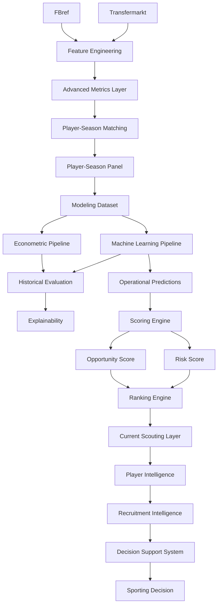

# 🔄 Pipeline Reference

## Objetivo

Este documento describe la arquitectura completa de pipelines implementada en la release:

```text
v1.2.1 — Advanced Data Expansion
```

Su finalidad es garantizar:

* reproducibilidad;
* trazabilidad;
* auditabilidad;
* mantenibilidad;
* consistencia metodológica;
* escalabilidad analítica;
* validez externa;
* generalización multi-liga;
* integración de métricas avanzadas.

La arquitectura actual transforma información deportiva y económica procedente de múltiples fuentes en recomendaciones accionables para scouting, recruitment y soporte avanzado a decisiones deportivas.

---

# 🧠 Filosofía de diseño

La arquitectura sigue cuatro principios fundamentales.

---

## Reproducibilidad

Todos los resultados pueden regenerarse a partir de:

* datos fuente;
* scripts versionados;
* configuraciones explícitas;
* artefactos parametrizados.

---

## Modularidad

Cada pipeline implementa una responsabilidad concreta dentro del sistema.

Beneficios:

* mantenimiento simplificado;
* extensibilidad;
* reutilización;
* testing independiente.

---

## Separación entre análisis y decisión

### Analytical Layer

* Data Engineering
* Econometrics
* Machine Learning
* Explainability

### Decision Layer

* Opportunity Detection
* Risk Assessment
* Player Intelligence
* Recruitment Intelligence
* Decision Support System

---

## Validación externa

Introducida durante Sprint 13A.

Principio:

```text id="5m4t8v"
External Validation by Expansion
```

La robustez metodológica se evalúa mediante ampliación sistemática de cobertura competitiva.

---

## Validación incremental de features

Introducida durante Sprint 13B.

Principio:

```text id="rkw0lw"
Feature Validation by Incremental Contribution
```

Toda nueva variable debe demostrar capacidad explicativa adicional antes de ser promovida a producción.

---

# 📊 Estado actual

| Pipeline                          | Estado |
| --------------------------------- | ------ |
| Data Ingestion Pipeline           | ✅      |
| Feature Engineering Pipeline      | ✅      |
| Advanced Metrics Pipeline         | ✅      |
| Matching Pipeline                 | ✅      |
| Player-Season Panel Pipeline      | ✅      |
| Modeling Dataset Pipeline         | ✅      |
| Econometric Pipeline              | ✅      |
| Machine Learning Pipeline         | ✅      |
| Historical Evaluation Pipeline    | ✅      |
| Explainability Pipeline           | ✅      |
| Scoring Pipeline                  | ✅      |
| Ranking Pipeline                  | ✅      |
| Current Scouting Pipeline         | ✅      |
| Player Intelligence Pipeline      | ✅      |
| Recruitment Intelligence Pipeline | ✅      |
| Decision Support Pipeline         | ✅      |
| Internationalization Layer        | ✅      |
| Multi-League Expansion Layer      | ✅      |
| Coverage Diagnostics Pipeline     | ✅      |
| Coverage Audit Pipeline           | ✅      |

---

# 🏗️ Arquitectura global



---

# 🔄 Evolución funcional

```text id="w0v94h"
Econometric Model
↓
Machine Learning
↓
Opportunity Detection
↓
Risk Assessment
↓
Player Intelligence
↓
Recruitment Intelligence
↓
Decision Support System
↓
External Validation
↓
Advanced Data Expansion
```

Sprint 13A fortalece la validez externa.

Sprint 13B fortalece la capacidad explicativa mediante nuevas métricas avanzadas.

---

# 📦 Data Ingestion Pipeline

Responsable de la adquisición y organización de datos fuente.

---

## Fuentes integradas

### FBref

Tipo:

```text id="x3xmpv"
Performance Data Source
```

Proporciona:

* rendimiento deportivo;
* métricas por 90;
* contexto competitivo;
* métricas avanzadas.

---

### Transfermarkt

Tipo:

```text id="8cx7kt"
Market Valuation Source
```

Proporciona:

* valor de mercado;
* edad;
* posición;
* contexto económico;
* evolución temporal.

---

## Outputs

```text id="uqcvks"
data/raw/
data/interim/
```

---

# ⚙️ Feature Engineering Pipeline

Responsable de construir variables deportivas, económicas y temporales.

---

## Inputs

```text id="cbgk5n"
FBref Features
Transfermarkt Features
```

---

## Outputs principales

```text id="m91bxh"
fbref_features_v13a.parquet

transfermarkt_features_v13a.parquet

player_season_panel_v13a.parquet

player_season_modeling_v13a.parquet

player_season_modeling_v13b_advanced.parquet

player_season_modeling_v13b_productive_candidate.parquet
```

---

## Transformaciones deportivas

* métricas por 90;
* normalización posicional;
* percentiles por posición;
* índices compuestos;
* variables de rendimiento relativo.

---

## Transformaciones económicas

* log_market_value_eur;
* market_value_growth_prev;
* delta_log_market_value_prev;
* variables longitudinales.

---

## Transformaciones temporales

* career_year;
* breakout_indicator;
* experience_index;
* age_squared.

---

# 🔬 Advanced Metrics Pipeline

Introducido durante Sprint 13B.

Objetivo:

Integrar métricas avanzadas derivadas de FBref dentro del pipeline productivo.

---

## Variables incorporadas

* finishing_index_v2
* availability_index
* defensive_activity_index

---

## Resultado observado

Las nuevas variables mejoran simultáneamente:

* econometría;
* XGBoost;
* Random Forest;
* HistGradientBoosting;
* LightGBM.

---

## Hallazgo principal

```text id="6jrlm8"
finishing_index_v2
```

aparece como la variable avanzada con mayor relevancia predictiva agregada.

---

## Estado

Las tres variables fueron promovidas a producción tras Sprint 13B.

---

# 📈 Modeling Dataset Pipeline

Responsable de generar el dataset final utilizado por modelos predictivos.

---

## Dataset actual

| Métrica            |                 Valor |
| ------------------ | --------------------: |
| Observaciones      |                 5.527 |
| Ligas              |                    11 |
| Temporadas         |                     7 |
| Liga-temporada     |                    77 |
| Cobertura temporal | 2019-2020 → 2025-2026 |

---

## Beneficio metodológico

La combinación:

```text id="o8h50u"
Sprint 13A
+
Sprint 13B
```

incrementa simultáneamente:

* representatividad;
* diversidad competitiva;
* capacidad explicativa;
* robustez metodológica.

---

# 🔗 Matching Pipeline

## Objetivo

Resolver la integración:

```text id="r6mjlwm"
FBref ↔ Transfermarkt
```

mediante una estrategia conservadora orientada a maximizar calidad de emparejamiento.

---

## Filosofía

Principio metodológico:

```text id="r6gdhv"
Calidad > Cobertura
```

---

## Estrategia implementada

```text id="r8r8v8"
Normalización
↓
Exact Matching
↓
Club Validation
↓
Fuzzy Matching
↓
Age Validation
```

---

## Tecnología

```text id="n1s4fy"
RapidFuzz
```

---

## Parámetros operativos

```python
MAX_AGE_DIFF = 1.5
MIN_CLUB_SCORE = 70
FUZZY_THRESHOLD = 92
```

---

## Resultado Sprint 13A

| Métrica           |  Valor |
| ----------------- | -----: |
| Match Rate global | 75,97% |

---

## Interpretación

La reducción del match rate agregado se explica principalmente por limitaciones de cobertura presentes en competiciones secundarias y no por degradación del algoritmo de matching.

---

# 📈 Player-Season Panel Pipeline

Responsable de construir el panel longitudinal jugador-temporada utilizado por todas las capas posteriores.

---

## Resultado actual

| Métrica                        |  Valor |
| ------------------------------ | -----: |
| Observaciones FBref procesadas | 43.591 |
| Ligas                          |     11 |
| Temporadas                     |      7 |
| Liga-temporada                 |     77 |

---

## Cobertura competitiva

### Ligas originales

* Premier League
* LaLiga
* Bundesliga
* Serie A
* Ligue 1
* Eredivisie
* Liga Portugal

### Ligas incorporadas

* Championship
* Belgian Pro League
* Austrian Bundesliga
* Spanish Segunda División

---

## Contribución

Esta capa constituye la base sobre la que se construyen:

* modelos econométricos;
* modelos ML;
* Opportunity Detection;
* Player Intelligence;
* Recruitment Intelligence.

# 🌍 Multi-League Expansion Pipeline

## Sprint 13A — Multi-League Expansion

Introduce una nueva capa arquitectónica orientada a evaluar explícitamente la validez externa de la metodología.

Pregunta de investigación:

> ¿La metodología mantiene su rendimiento cuando se aplica a ligas con estructuras competitivas y económicas distintas?

---

## Resultado estructural

| Métrica                        |  Valor |
| ------------------------------ | -----: |
| Observaciones FBref procesadas | 43.591 |
| Dataset modelizable            |  5.527 |
| Ligas                          |     11 |
| Temporadas                     |      7 |
| Liga-temporada                 |     77 |

---

## Parametrización introducida

### build_fbref_features.py

```text id="s2k1ab"
--output
```

### build_player_season_panel.py

```text id="a7m4zf"
--fbref-input
--tm-input
--output
```

### build_modeling_dataset.py

Versionado explícito de datasets.

---

## Beneficios

* reproducibilidad académica;
* comparación entre releases;
* auditoría de resultados;
* trazabilidad completa;
* experimentación controlada.

---

# 📊 Coverage Diagnostics Pipeline

Introducido durante Sprint 13A.

Objetivo:

Evaluar calidad de matching y cobertura efectiva por competición y temporada.

---

## Artefactos generados

```text id="y0z5oq"
reports/data_quality/

sprint_13a_matching_by_league.csv

sprint_13a_matching_by_league_season.csv

sprint_13a_coverage_summary.md
```

---

## Resultado global

| Métrica           |  Valor |
| ----------------- | -----: |
| Match Rate global | 75,97% |

---

## Interpretación

La reducción del match rate agregado se explica por la incorporación de competiciones secundarias con menor cobertura histórica disponible en Transfermarkt-Kaggle.

Los resultados obtenidos no sugieren deterioro del algoritmo de matching.

---

# 🔍 Coverage Audit Pipeline

## Objetivo

Investigar el origen de las pérdidas de matching observadas durante Sprint 13A.

---

## Hallazgo principal

La evidencia obtenida apunta a limitaciones de cobertura presentes en Transfermarkt-Kaggle y no a fallos estructurales en:

* Matching Pipeline;
* Feature Engineering Pipeline;
* Player-Season Panel Pipeline.

---

## Resultado metodológico

Sprint 13A no solo amplía cobertura.

También aporta evidencia favorable de:

* calidad de integración;
* robustez metodológica;
* validez externa;
* capacidad de generalización.

---

# 📈 Econometric Pipeline

## Ubicación

```text id="i4szdo"
src/models/econometric/
```

---

## Objetivo

Construir benchmarks interpretables capaces de explicar el valor de mercado observado mediante relaciones económicas y deportivas observables.

La capa econométrica cumple una doble función:

* benchmark académico;
* mecanismo de validación metodológica.

---

## Evolución de modelos

### Baseline OLS

Modelo explicativo inicial.

---

### Advanced Positional OLS

Incorpora normalización posicional.

---

### Growth OLS

Introduce dinámica temporal y desarrollo profesional.

---

### Growth OLS v13B

Incorpora:

* variables longitudinales;
* efectos fijos;
* métricas avanzadas Sprint 13B.

---

## Modelo oficial

```text id="w7q9cr"
Growth OLS v13B
```

---

## Resultado Sprint 13B

| Métrica |  Valor |
| ------- | -----: |
| R²      | 0.4549 |

Comparación principal:

| Modelo                |     R² |
| --------------------- | -----: |
| M_A_v13A_base_spec_FE | 0.4505 |
| M_B_v13B_advanced_FE  | 0.4549 |

Resultado:

```text id="yb7s9w"
ΔR² = +0.0044
```

---

## Interpretación

Las nuevas métricas avanzadas aportan capacidad explicativa incremental y mejoran simultáneamente:

* MAE;
* RMSE;
* AIC;
* BIC.

---

## Rol dentro del sistema

Growth OLS v13B continúa actuando como:

```text id="zlm99v"
Academic Benchmark Model
```

aportando interpretabilidad económica y capacidad explicativa.

---

# 🤖 Machine Learning Pipeline

## Ubicación

```text id="a8q77o"
src/models/machine_learning/
```

---

## Objetivo

Maximizar capacidad predictiva mediante algoritmos no lineales capaces de capturar relaciones complejas entre rendimiento deportivo y valoración económica.

---

## Algoritmos evaluados

* Random Forest
* HistGradientBoosting
* LightGBM
* XGBoost

---

# 🔬 Sprint 13B — Feature Set Evaluation

Comparación:

```text id="uv8j1x"
Feature Set A (v13A)

vs

Feature Set B (v13B)
```

---

## Resultados

| Modelo               | Mejora observada |
| -------------------- | ---------------: |
| XGBoost              |          +0.0096 |
| Random Forest        |          +0.0097 |
| HistGradientBoosting |          +0.0144 |
| LightGBM             |          +0.0291 |

---

## Hallazgo principal

Todas las arquitecturas evaluadas mejoran simultáneamente tras incorporar:

* finishing_index_v2
* availability_index
* defensive_activity_index

---

## Modelo productivo oficial

```text id="zz4r6l"
Tuned XGBoost v13B
```

---

## Rol dentro del sistema

```text id="snwwym"
Production Prediction Engine
```

utilizado para:

* estimación de valor esperado;
* detección de ineficiencias;
* scoring operativo;
* scouting actual.

---

# 📊 Historical Evaluation Pipeline

Responsable de la validación metodológica de modelos.

---

## Funciones

* validación temporal;
* comparación de algoritmos;
* backtesting;
* evaluación académica;
* evaluación incremental de features.

---

## Artefactos principales

```text id="8hpxkp"
test_predictions

full_predictions

model_comparison

feature_set_comparison
```

---

## Evolución Sprint 13B

La evaluación histórica deja de centrarse exclusivamente en algoritmos para incorporar también:

```text id="nzzq6u"
Feature Set Evaluation
```

permitiendo medir explícitamente el valor incremental aportado por nuevas variables.

---

# 🔬 Explainability Pipeline

Responsable de interpretar el comportamiento de los modelos predictivos.

---

## Componentes

```text id="6gk3b7"
Feature Importance

SHAP Analysis

Player SHAP Reports
```

---

## Objetivo

Transformar modelos predictivos complejos en conocimiento interpretable para procesos de scouting y recruitment.

---

## Hallazgo Sprint 13B

La nueva capa de explainability permite evaluar explícitamente la contribución de las métricas avanzadas.

Resultado principal:

```text id="4xxm4n"
finishing_index_v2
```

como variable avanzada más relevante.

---

# 🎯 Scoring Pipeline

Transforma predicciones en señales accionables.

---

## Flujo actual

```text id="f7mbpi"
Predictions
↓
Inefficiency Score
↓
Growth Score
↓
Confidence Score
↓
Opportunity Score
↓
Risk Score
```

---

## Limitación identificada

Durante Sprint 13B se detectó una separación estructural entre:

```text id="m4hv5l"
Modeling Pipeline
≠
Scoring Pipeline
```

---

## Situación actual

El pipeline histórico de scoring requiere variables enriquecidas adicionales no presentes actualmente en la capa productiva de predicción.

Por este motivo, la integración completa queda documentada como:

```text id="qklb3i"
TM.2 — Scoring & Ranking Integration v13B
```

sin afectar a la validez metodológica de Sprint 13B.

---

# 📋 Ranking Pipeline

Transforma scores en rankings priorizados.

---

## Outputs

```text id="7sh0z3"
Global Rankings

League Rankings

Position Rankings

Risk Rankings

Scouting Shortlists
```

---

# ⚽ Player Intelligence Pipeline

Introducido durante Sprint 10.

---

## Objetivo

Transformar rankings en análisis individuales de jugadores.

---

## Componentes

* Player Radar
* Positional Benchmarking
* Opportunity vs Risk Matrix
* Scouting Narrative

---

# 🎯 Recruitment Intelligence Pipeline

Introducido durante Sprint 11.

---

## Objetivo

Transformar análisis individuales en procesos operativos de recruitment.

---

## Componentes

* Recruitment Board
* Candidate Selection System
* Comparative Player Analysis
* Executive Scouting Workflow
* Global Search Engine

---

## Flujo

```text id="f4pjh3"
Opportunity Detection
↓
Filtering
↓
Shortlisting
↓
Comparative Analysis
↓
Recruitment Decision
```

---

# 🖥️ Decision Support Pipeline

## Aplicación principal

```text id="mjlwmu"
app/streamlit_app.py
```

---

## Componentes

### Advanced Search Engine

* jugador;
* club;
* liga;
* posición.

### Player Intelligence

* benchmarking;
* comparativas;
* scouting reports.

### Recruitment Intelligence

* filtros avanzados;
* shortlist management.

### Internationalization

* español;
* inglés.

---

# 🔄 Evolución histórica de pipelines

| Sprint       | Evolución                             |
| ------------ | ------------------------------------- |
| Sprint 5     | Scoring Engine                        |
| Sprint 6     | Business Evaluation Layer             |
| Sprint 7     | Executive Dashboard                   |
| Sprint 9     | Decision Support Layer                |
| Sprint 10    | Player Intelligence Layer             |
| Sprint 11    | Recruitment Intelligence Layer        |
| Sprint 12    | Productization & Internationalization |
| Sprint 13A   | Multi-League Expansion                |
| Sprint 13A.1 | External Validation & Coverage Audit  |
| Sprint 13B   | Advanced Metrics Layer                |

---

# 🔁 Reproducibilidad

La arquitectura actual permite reconstruir completamente cualquier resultado publicado.

Principios:

* código versionado;
* datasets versionados;
* MLflow;
* trazabilidad de artefactos;
* pipelines parametrizados.

---

## Capacidad de regeneración

```text id="v9h6x5"
Raw Sources
↓
Feature Engineering
↓
Advanced Metrics Layer
↓
Matching
↓
Player-Season Panel
↓
Modeling Dataset
↓
Econometric Models
+
Machine Learning Models
↓
Scoring
↓
Recruitment Intelligence
↓
Decision Support System
```

---

# 🛣️ Roadmap

## TM.1 — Transfermarkt Coverage Audit

Estado:

```text id="w2l8c3"
Backlog
```

Objetivo:

Determinar si las limitaciones observadas durante Sprint 13A proceden de:

* Transfermarkt-Kaggle;
* Transfermarkt original;
* cobertura histórica disponible.

---

## TM.2 — Scoring & Ranking Integration v13B

Objetivo:

```text id="dx0khf"
Predictions v13B
↓
Scoring Dataset v13B
↓
Opportunity Framework v13B
↓
Risk Framework v13B
↓
Rankings v13B
↓
Stability Analysis
```

---

## Sprint 14 — Transfer Strategy Enhancement

Próxima fase principal del proyecto.

Objetivo:

```text id="w54ht5"
Transformar oportunidades individuales
en estrategias óptimas de fichajes
bajo restricciones reales.
```

Líneas previstas:

* Transfer Strategy Engine
* Portfolio Optimization
* Scenario Simulation
* Strategic Recruitment

---

## Investigación futura

### Modelización

* TabPFN
* CatBoost
* Ensemble Learning

### Datos

* nuevas métricas avanzadas FBref;
* event data avanzado;
* tracking data;
* información contractual;
* datos salariales.

---

# 🏁 Conclusión

La arquitectura de pipelines de la release:

```text id="o3ocpl"
v1.2.1 — Advanced Data Expansion
```

representa la evolución del proyecto desde un sistema predictivo hacia una plataforma integral de Football Analytics orientada a scouting, recruitment y soporte avanzado a decisiones deportivas.

Sprint 13A aporta una contribución metodológica centrada en:

* ampliación de cobertura;
* validación externa;
* auditoría de cobertura;
* capacidad de generalización.

Sprint 13B aporta una contribución metodológica centrada en:

* integración de métricas avanzadas;
* validación incremental de features;
* mejora simultánea de econometría y Machine Learning;
* fortalecimiento de la capacidad explicativa.

La arquitectura actual puede resumirse mediante:

```text id="uhzrqg"
Data Engineering
↓
Advanced Metrics Layer
↓
Econometrics
+
Machine Learning
↓
Opportunity Detection
↓
Risk Assessment
↓
Player Intelligence
↓
Recruitment Intelligence
↓
Decision Support System
↓
External Validation
```

La hipótesis principal de Sprint 13B queda validada.

Las variables:

* finishing_index_v2
* availability_index
* defensive_activity_index

aportan señal predictiva incremental consistente y pasan a formar parte de la arquitectura productiva oficial.

La siguiente evolución natural del proyecto corresponde a:

```text id="z8vxgk"
Sprint 14
↓
Transfer Strategy Enhancement
```

orientada a transformar inteligencia de scouting en decisiones estratégicas de construcción de plantilla.
