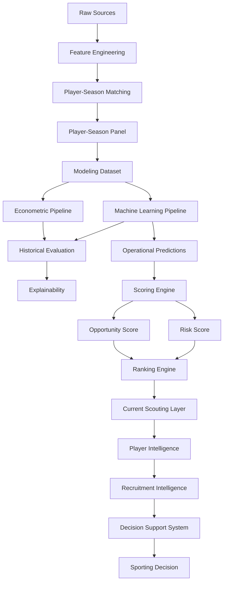

# 🔄 Referencia de Pipelines

## Objetivo

Este documento describe la arquitectura de pipelines implementada en la versión v1.1.0 del proyecto.

Su objetivo es garantizar:

* Reproducibilidad.
* Trazabilidad.
* Auditabilidad.
* Mantenibilidad.
* Consistencia metodológica.
* Escalabilidad analítica.

---

# 📊 Estado actual

| Pipeline                          | Estado |
| --------------------------------- | ------ |
| Data Ingestion                    | ✅      |
| Feature Engineering               | ✅      |
| Matching Pipeline                 | ✅      |
| Modeling Dataset                  | ✅      |
| Econometric Pipeline              | ✅      |
| Machine Learning Pipeline         | ✅      |
| Historical Evaluation Pipeline    | ✅      |
| Explainability Pipeline           | ✅      |
| Scoring Engine                    | ✅      |
| Ranking Engine                    | ✅      |
| Current Scouting Pipeline         | ✅      |
| Player Intelligence Pipeline      | ✅      |
| Recruitment Intelligence Pipeline | ✅      |
| Decision Support Pipeline         | ✅      |
| Internationalization Layer        | ✅      |

---

# 🏗️ Pipeline global



---

# 📦 Data Pipeline

Responsable de la adquisición y consolidación de datos.

## Fuentes

* FBref.
* Transfermarkt.

## Outputs

```text
data/raw/
data/interim/
```

---

# ⚙️ Feature Engineering Pipeline

Responsable de la construcción de variables deportivas y económicas.

## Outputs

```text
player_season_panel.parquet
player_season_modeling.parquet
```

## Dataset modelizable

| Métrica            |                 Valor |
| ------------------ | --------------------: |
| Observaciones      |                 3.916 |
| Jugadores únicos   |                 2.136 |
| Cobertura temporal | 2019-2020 → 2025-2026 |

---

# 🔗 Matching Pipeline

Objetivo:

```text
FBref ↔ Transfermarkt
```

## Metodología

* Exact Matching.
* Club Validation.
* Age Validation.
* Fuzzy Matching.

## Resultado

```text
Match Rate ≈ 88%
```

## Output principal

```text
player_season_panel.parquet
```

---

# 📈 Econometric Pipeline

Ubicación:

```text
src/models/econometric/
```

## Objetivo

Construir un benchmark interpretable.

## Modelo principal

```text
Growth OLS
```

## Resultado

| Modelo     |     R² |
| ---------- | -----: |
| Growth OLS | 0.5258 |

---

# 🤖 Machine Learning Pipeline

Ubicación:

```text
src/models/machine_learning/
```

## Modelos evaluados

* Random Forest.
* HistGradientBoosting.
* LightGBM.
* XGBoost.

## Modelo productivo

```text
Tuned XGBoost
```

## Resultado

| Modelo        |     R² |
| ------------- | -----: |
| Tuned XGBoost | 0.5414 |

---

# 📊 Historical Evaluation Pipeline

Responsable de la validación metodológica de modelos.

## Funciones

* Validación temporal.
* Comparación de algoritmos.
* Backtesting.
* Evaluación académica.

## Artefactos

```text
test_predictions.csv
full_predictions.csv
evaluation_metrics.csv
```

---

# 🔬 Explainability Pipeline

Responsable de interpretar decisiones de los modelos.

## Componentes

```text
Feature Importance
SHAP Analysis
Player SHAP Reports
```

## Outputs

```text
reports/figures/explainability/
reports/scouting_reports/
```

---

# 🎯 Scoring Engine

Transforma predicciones en señales accionables.

## Flujo

```text
Predictions
↓
Inefficiency Score
↓
Growth Score
↓
Confidence Score
↓
Opportunity Score
↓
Risk Score
```

## Scores implementados

### Inefficiency Score

Captura desviaciones entre valor observado y esperado.

### Growth Score

Captura potencial de desarrollo.

### Confidence Score

Captura robustez de la señal.

### Opportunity Score

Priorización multicriterio.

### Risk Score

Evaluación de incertidumbre asociada a cada recomendación.

---

# 📋 Ranking Engine

Transforma scores en recomendaciones priorizadas.

## Outputs

```text
Global Rankings
League Rankings
Position Rankings
Risk Rankings
Scouting Shortlists
```

---

# ⚽ Current Scouting Pipeline

Introducido durante Sprint 10.

## Objetivo

Separar validación histórica y explotación operativa.

## Capacidades

* Opportunity Detection.
* Risk Assessment.
* Opportunity vs Risk Matrix.
* Scouting Shortlists.

---

# 🧠 Player Intelligence Pipeline

Introducido durante Sprint 10.

## Objetivo

Transformar rankings en análisis individuales.

## Componentes

### Player Radar

Visualización multidimensional de rendimiento.

### Positional Benchmarking

Comparación respecto a jugadores de la misma posición.

### Scouting Narrative

Interpretación automática de fortalezas y debilidades.

---

# 🎯 Recruitment Intelligence Pipeline

Introducido durante Sprint 11.

## Objetivo

Transformar análisis individuales en procesos operativos de recruitment.

### Recruitment Board

Permite:

* Construcción de shortlists.
* Gestión de candidatos.
* Selección múltiple.

### Candidate Selection System

Permite:

* Comparación simultánea.
* Selección dinámica.
* Priorización operativa.

### Comparative Player Analysis

Comparación directa de:

* Opportunity Score.
* Risk Score.
* Confidence Score.
* Market Value.
* Predicted Value.
* Mispricing.

### Executive Scouting Workflow

```text
Opportunity Detection
↓
Filtering
↓
Shortlisting
↓
Comparative Analysis
↓
Recruitment Decision
```

---

# 🖥️ Decision Support Pipeline

Consolidado durante Sprint 12.

## Aplicación principal

```text
app/streamlit_app.py
```

## Componentes

### Advanced Search Engine

Búsqueda por:

* Jugador.
* Club.
* Liga.
* Posición.

### Search Suggestions

Autocompletado dinámico.

### Search Chips

Indicadores visuales de filtros activos.

### UX Redesign

Optimización de filtros y navegación.

### Internationalization

Idiomas disponibles:

* Español.
* Inglés.

---

# 🔄 Evolución de pipelines

| Sprint    | Evolución                                 |
| --------- | ----------------------------------------- |
| Sprint 5  | Scoring Engine                            |
| Sprint 6  | Evaluation Layer                          |
| Sprint 7  | Executive Dashboard                       |
| Sprint 9  | Decision Support Layer                    |
| Sprint 10 | Player Intelligence Layer                 |
| Sprint 11 | Recruitment Intelligence Layer            |
| Sprint 12 | Productization, UX & Internationalization |

---

# 🏁 Conclusión

La arquitectura de pipelines v1.1.0 consolida la evolución del proyecto desde un sistema predictivo hacia una plataforma DSS orientada a scouting y recruitment profesional.

La incorporación de:

```text
Opportunity Detection
↓
Risk Assessment
↓
Player Intelligence
↓
Recruitment Intelligence
↓
Decision Support System
```

permite transformar predicciones de valor de mercado en procesos operativos de captación de talento alineados con entornos profesionales de Football Analytics.

