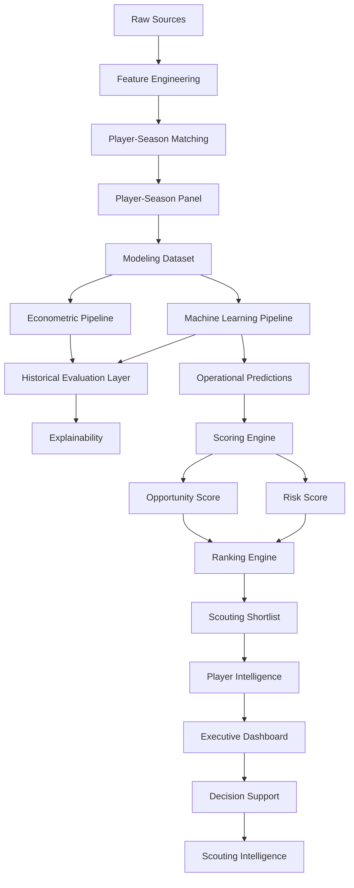

# 🔄 Referencia de Pipelines

## Objetivo

Este documento describe la arquitectura de pipelines implementada en la versión v1.0.0 del proyecto.

Su objetivo es garantizar:

- reproducibilidad
- trazabilidad
- mantenibilidad
- auditabilidad
- consistencia metodológica

---

# Estado actual

| Pipeline | Estado |
|----------|----------|
| Data Ingestion | ✅ |
| Feature Engineering | ✅ |
| Matching | ✅ |
| Modeling Dataset | ✅ |
| Econometric Pipeline | ✅ |
| Machine Learning Pipeline | ✅ |
| Explainability Pipeline | ✅ |
| Scoring Engine | ✅ |
| Risk Engine | ✅ |
| Ranking Engine | ✅ |
| Evaluation Layer | ✅ |
| Current Scouting Layer | ✅ |
| Player Intelligence Layer | ✅ |
| Executive Dashboard | ✅ |
| Decision Support Layer | ✅ |

---

# Pipeline global



---

# Data Pipeline

Responsable de la ingestión y consolidación de datos.

Fuentes:

- FBref
- Transfermarkt

Scripts principales:

```text
ingest_fbref.py
ingest_transfermarkt.py
```

Outputs:

```text
data/raw/
data/interim/
```

---

# Feature Engineering Pipeline

Responsable de construir variables deportivas y económicas.

Scripts:

```text
build_fbref_features.py
build_transfermarkt_features.py
build_modeling_dataset.py
```

Outputs:

```text
player_season_panel.parquet
player_season_modeling.parquet
```

Dataset actual:

| Métrica | Valor |
|----------|----------:|
| Observaciones | 3.916 |
| Jugadores únicos | 2.136 |
| Cobertura temporal | 2019-2020 → 2025-2026 |

---

# Matching Pipeline

Objetivo:

```text
FBref ↔ Transfermarkt
```

Metodología:

- matching exacto
- validación por edad
- validación por club
- fuzzy matching controlado

Resultado:

```text
Match Rate ≈ 88%
```

Output:

```text
player_season_panel.parquet
```

---

# Econometric Pipeline

Ubicación:

```text
src/models/econometric/
```

Objetivo:

Construir benchmark interpretable.

Modelo principal:

```text
Growth OLS
```

Resultados finales:

| Modelo | MAE | RMSE | R² |
|----------|----------:|----------:|----------:|
| Growth OLS | 0.7287 | 0.9053 | 0.5258 |

Outputs:

```text
econometric_metrics.csv
ols_predictions.csv
```

---

# Machine Learning Pipeline

Ubicación:

```text
src/models/machine_learning/
```

Modelos entrenados:

- Tuned Random Forest
- Tuned LightGBM
- HistGradientBoosting
- Tuned XGBoost

Resultados finales:

| Modelo | MAE | RMSE | R² |
|----------|----------:|----------:|----------:|
| Tuned Random Forest | 0.7486 | 0.9303 | 0.4980 |
| Tuned LightGBM | 0.7307 | 0.9052 | 0.5248 |
| HistGradientBoosting | 0.7292 | 0.9011 | 0.5291 |
| Tuned XGBoost | **0.7120** | **0.8892** | **0.5414** |

Modelo productivo:

```text
Tuned XGBoost
```

---

# Historical Evaluation Pipeline

Introducido y consolidado en Sprint 10.

Objetivo:

Separar validación histórica de scouting operativo.

Funciones:

- validación temporal
- comparación de modelos
- backtesting
- análisis metodológico

Artefactos:

```text
tuned_xgboost_test_predictions.csv
tuned_xgboost_full_predictions.csv
```

---

# Explainability Pipeline

Objetivo:

Interpretar decisiones de los modelos.

Componentes:

```text
build_feature_importance_comparison.py
build_shap_analysis.py
build_player_shap_report.py
```

Outputs:

```text
reports/figures/explainability/
reports/scouting_reports/
```

---

# Scoring Engine

Transforma predicciones en señales accionables.

Flujo:

```text
Predictions
↓
Inefficiency Score
↓
Growth Score
↓
Confidence Score
↓
Opportunity Score
↓
Risk Score
```

Componentes:

```text
build_inefficiency_score.py
build_growth_score.py
build_confidence_score.py
build_opportunity_score.py
build_risk_score.py
```

---

# Ranking Engine

Genera recomendaciones priorizadas.

Outputs:

```text
top_undervalued_global.csv
top_undervalued_by_league.csv
top_undervalued_by_position.csv
top_high_potential.csv
top_low_risk.csv
scouting_shortlist.csv
scouting_shortlist_with_risk.csv
```

---

# Current Scouting Pipeline

Introducido en Sprint 10.3.

Objetivo:

Operar sobre el mercado actual.

Inputs:

```text
tuned_xgboost_predictions.csv
```

Outputs:

```text
scoring_dataset.csv
scouting_shortlist.csv
scouting_shortlist_with_risk.csv
```

Capacidades:

- Opportunity Score
- Risk Score
- Opportunity vs Risk Matrix
- Shortlist operativa

---

# Player Intelligence Pipeline

Introducido en Sprint 10.1.

Objetivo:

Transformar rankings en análisis individuales.

Componentes:

### Player Radar MVP

- minutos
- goles/90
- asistencias/90
- G+A/90
- Growth Score
- Confidence Score

### Positional Benchmarking

Comparación frente a:

- misma posición
- universo completo

### Scouting Narrative

Generación automática de interpretación.

---

# Executive Dashboard Pipeline

Aplicación principal:

```text
app/streamlit_app.py
```

Capas implementadas:

### Executive Filters

- liga
- posición
- edad
- opportunity score
- confidence score

### Visual Analytics

- Coste vs Upside
- Opportunity vs Risk Matrix
- Executive Insights

### Player Intelligence

- radar
- benchmarking
- scouting cards

### Explainability

- SHAP individual
- drivers positivos
- drivers negativos

---

# Decision Support Pipeline

Objetivo:

Convertir resultados analíticos en decisiones operativas.

Resultado:

```text
Predicción
↓
Scoring
↓
Ranking
↓
Player Intelligence
↓
Dashboard
↓
Decision Support
↓
Scouting Intelligence
```

---

# Evolución por sprints

| Sprint | Contribución |
|----------|-------------|
| Sprint 5 | Scoring Engine |
| Sprint 6 | Evaluation Layer |
| Sprint 7 | Dashboard |
| Sprint 9 | Decision Support System |
| Sprint 10.1 | Player Intelligence |
| Sprint 10.2 | FBref Advanced Audit |
| Sprint 10.3 | Current Scouting Layer + Risk Framework |

---

# Conclusión

La principal evolución introducida durante Sprint 10 es la separación explícita entre:

```text
Historical Evaluation Layer
↓
Current Scouting Layer
↓
Player Intelligence Layer
↓
Decision Support Layer
```

Esta arquitectura evita mezclar validación histórica con recomendaciones operativas y aproxima el proyecto a plataformas utilizadas en entornos profesionales de Football Analytics y Scouting.

La versión v1.0.0 consolida la transición desde un sistema predictivo hacia una plataforma integral de Scouting Intelligence.
