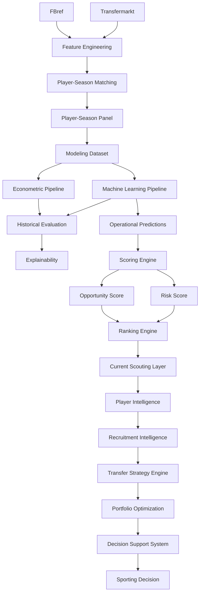

# 🔄 Pipeline Reference

## Objetivo

Este documento describe la arquitectura de pipelines implementada en la release:

v1.2.0 — Multi-League Expansion

Su objetivo es garantizar:

* reproducibilidad;
* trazabilidad;
* auditabilidad;
* mantenibilidad;
* consistencia metodológica;
* escalabilidad analítica;
* validez externa.

La arquitectura actual permite transformar datos deportivos y económicos procedentes de múltiples fuentes en recomendaciones accionables para procesos de scouting, recruitment y planificación estratégica de fichajes.

---

# 🧠 Filosofía de diseño

La arquitectura del proyecto sigue tres principios fundamentales.

## Reproducibilidad

Todos los artefactos pueden regenerarse a partir de:

* datos fuente;
* scripts versionados;
* configuraciones explícitas.

---

## Modularidad

Cada pipeline resuelve una responsabilidad concreta dentro del flujo analítico.

Beneficios:

* mantenimiento simplificado;
* extensibilidad;
* reutilización;
* testing independiente.

---

## Separación entre análisis y decisión

La arquitectura distingue explícitamente entre:

### Analytical Layer

* Data Engineering.
* Econometrics.
* Machine Learning.
* Explainability.

### Decision Layer

* Opportunity Detection.
* Risk Assessment.
* Recruitment Intelligence.
* Transfer Strategy Engine.
* Portfolio Optimization.
* Decision Support System.

---

# 📊 Estado actual

| Pipeline                          | Estado |
| --------------------------------- | ------ |
| Data Ingestion Pipeline           | ✅      |
| Feature Engineering Pipeline      | ✅      |
| Matching Pipeline                 | ✅      |
| Player-Season Panel Pipeline      | ✅      |
| Modeling Dataset Pipeline         | ✅      |
| Econometric Pipeline              | ✅      |
| Machine Learning Pipeline         | ✅      |
| Historical Evaluation Pipeline    | ✅      |
| Explainability Pipeline           | ✅      |
| Scoring Pipeline                  | ✅      |
| Ranking Pipeline                  | ✅      |
| Current Scouting Pipeline         | ✅      |
| Player Intelligence Pipeline      | ✅      |
| Recruitment Intelligence Pipeline | ✅      |
| Transfer Strategy Pipeline        | ✅      |
| Scenario Simulation Pipeline      | ✅      |
| Portfolio Optimization Pipeline   | ✅      |
| Decision Support Pipeline         | ✅      |
| Internationalization Layer        | ✅      |
| Multi-League Expansion Layer      | ✅      |
| Coverage Diagnostics Pipeline     | ✅      |

---

# 🏗️ Arquitectura global



---

# 🔄 Evolución funcional de la arquitectura

La evolución metodológica del proyecto puede resumirse mediante:

```text
Econometric Model
↓
Machine Learning
↓
Opportunity Detection
↓
Risk Assessment
↓
Player Intelligence
↓
Recruitment Intelligence
↓
Transfer Strategy Engine
↓
Portfolio Optimization
↓
Decision Support System
↓
Multi-League Expansion
```

Sprint 13A amplía la cobertura competitiva del sistema sin modificar la lógica analítica ni los modelos productivos existentes.

Su principal contribución consiste en evaluar la validez externa de la metodología mediante expansión multi-liga.

---

# 📦 Data Ingestion Pipeline

Responsable de la adquisición y organización de datos fuente.

## Fuentes integradas

### FBref

Tipo:

Performance Data Source

Proporciona:

* rendimiento deportivo;
* contexto competitivo;
* métricas futbolísticas.

---

### Transfermarkt

Tipo:

Market Valuation Source

Proporciona:

* valor de mercado;
* información demográfica;
* contexto económico.

---

## Outputs

```text
data/raw/
data/interim/
```

---

# ⚙️ Feature Engineering Pipeline

Responsable de la construcción de variables deportivas, económicas y temporales utilizadas durante la modelización.

---

## Inputs

```text
FBref Features
Transfermarkt Features
```

---

## Outputs

```text
fbref_features_v13a.parquet
player_season_panel_v13a.parquet
player_season_modeling.parquet
```

---

## Transformaciones aplicadas

### Deportivas

* métricas por 90 minutos;
* índices compuestos;
* normalización posicional.

### Económicas

* transformaciones logarítmicas;
* variables de crecimiento;
* indicadores de evolución histórica.

### Temporales

* experiencia profesional;
* trayectoria reciente;
* historial de valoración.

---

## Dataset modelizable

La fase de modelización continúa centrándose en jugadores jóvenes con potencial de desarrollo y revalorización.

| Métrica            |                 Valor |
| ------------------ | --------------------: |
| Observaciones      |                 3.916 |
| Jugadores únicos   |                 2.138 |
| Cobertura temporal | 2019-2020 → 2025-2026 |

---

# 🔗 Matching Pipeline

## Objetivo

Resolver la integración:

FBref ↔ Transfermarkt

mediante una estrategia conservadora orientada a maximizar calidad de emparejamiento.

---

## Filosofía

Principio metodológico:

Calidad > Cobertura

---

## Estrategia implementada

```text
Normalización
↓
Exact Matching
↓
Club Validation
↓
Fuzzy Matching
↓
Age Validation
```

---

## Tecnología

RapidFuzz

---

## Parámetros operativos

```python
MAX_AGE_DIFF = 1.5
MIN_CLUB_SCORE = 70
FUZZY_THRESHOLD = 92
```

Estos umbrales fueron seleccionados para minimizar errores de matching sin comprometer excesivamente la cobertura disponible.

---

## Output principal

```text
player_season_panel_v13a.parquet
```

---

# 📈 Player-Season Panel Pipeline

Responsable de construir el panel longitudinal jugador-temporada utilizado por todas las capas posteriores del sistema.

---

## Resultado Sprint 13A

| Métrica                        |  Valor |
| ------------------------------ | -----: |
| Observaciones FBref procesadas | 43.591 |
| Ligas                          |     11 |
| Temporadas                     |      7 |
| Combinaciones liga-temporada   |     77 |

---

## Cobertura competitiva

### Ligas históricas

* Premier League
* LaLiga
* Bundesliga
* Serie A
* Ligue 1
* Eredivisie
* Liga Portugal

### Nuevas ligas Sprint 13A

* Championship
* Belgian Pro League
* Austrian Bundesliga
* Spanish Segunda División

# 🌍 Multi-League Expansion Pipeline

## Sprint 13A — Multi-League Expansion

Sprint 13A introduce una nueva capa de arquitectura orientada a evaluar la validez externa de la metodología mediante ampliación sistemática de cobertura.

A diferencia de releases anteriores, esta fase no modifica:

* modelos predictivos;
* scoring multicriterio;
* explainability;
* dashboard;
* Recruitment Intelligence;
* Transfer Strategy Engine.

Su objetivo principal consiste en responder a la siguiente pregunta:

> ¿La metodología generaliza correctamente a mercados y ecosistemas competitivos distintos?

---

## Nuevas ligas incorporadas

* Championship
* Belgian Pro League
* Austrian Bundesliga
* Spanish Segunda División

---

## Resultado global

| Métrica                        |  Valor |
| ------------------------------ | -----: |
| Observaciones FBref procesadas | 43.591 |
| Ligas                          |     11 |
| Temporadas                     |      7 |
| Combinaciones liga-temporada   |     77 |

---

## Parametrización de pipelines

Sprint 13A introduce parametrización explícita para garantizar generación reproducible de artefactos.

### build_fbref_features.py

Nuevo parámetro:

```text
--output
```

Ejemplo:

```bash
python -m src.data.build_fbref_features \
  --output data/processed/fbref_features_v13a.parquet
```

---

### build_player_season_panel.py

Nuevos parámetros:

```text
--fbref-input
--tm-input
--output
```

Ejemplo:

```bash
python -m src.data.build_player_season_panel \
  --fbref-input data/processed/fbref_features_v13a.parquet \
  --tm-input data/processed/transfermarkt_features_v13a.parquet \
  --output data/processed/player_season_panel_v13a.parquet
```

---

## Beneficio metodológico

La parametrización permite:

* versionado explícito de datasets;
* trazabilidad completa;
* comparación entre releases;
* auditoría de resultados;
* reproducibilidad académica.

---

# 📊 Coverage Diagnostics Pipeline

Introducido durante Sprint 13A.

Objetivo:

Evaluar calidad de matching y cobertura efectiva por competición y temporada.

---

## Artefactos generados

```text
reports/data_quality/

sprint_13a_matching_by_league.csv
sprint_13a_matching_by_league_season.csv
sprint_13a_coverage_summary.md
```

---

## Resultado global

| Métrica           |  Valor |
| ----------------- | -----: |
| Match Rate global | 75,97% |

---

## Match Rate por liga

| Liga                     | Match Rate |
| ------------------------ | ---------: |
| Bundesliga               |     92,75% |
| Premier League           |     92,62% |
| Serie A                  |     91,10% |
| Eredivisie               |     89,95% |
| Ligue 1                  |     89,70% |
| LaLiga                   |     84,26% |
| Belgian Pro League       |     79,68% |
| Liga Portugal            |     75,10% |
| Austrian Bundesliga      |     56,00% |
| Championship             |     50,36% |
| Spanish Segunda División |     43,03% |

---

## Interpretación

Las principales ligas europeas mantienen niveles elevados de matching.

La reducción del match rate global respecto a versiones anteriores se explica principalmente por la incorporación de ligas secundarias con menor cobertura histórica en Transfermarkt-Kaggle.

La evidencia disponible no apunta a un deterioro del algoritmo de matching.

---

# 🔍 Coverage Audit Pipeline

## Objetivo

Investigar el origen de las pérdidas de matching observadas durante Sprint 13A.

---

## Caso auditado

Matt Grimes

Resultado observado:

* Transfermarkt-Kaggle contiene valoraciones hasta 2023-06-01.
* Temporada máxima disponible: 2022-2023.
* FBref contiene observaciones posteriores.

---

## Conclusión

La evidencia obtenida sugiere que una parte significativa de las pérdidas de matching observadas en ligas secundarias y temporadas recientes procede de limitaciones de cobertura disponibles en Transfermarkt-Kaggle.

No se observan indicios de fallo estructural en:

* FBref;
* Feature Engineering Pipeline;
* Matching Pipeline.

---

# 📈 Econometric Pipeline

## Ubicación

```text
src/models/econometric/
```

---

## Objetivo

Construir un benchmark interpretable para la estimación de valor de mercado esperado.

---

## Modelo principal

```text
Growth OLS
```

---

## Resultado

| Modelo     |     R² |
| ---------- | -----: |
| Growth OLS | 0.5258 |

---

# 🤖 Machine Learning Pipeline

## Ubicación

```text
src/models/machine_learning/
```

---

## Algoritmos evaluados

* Random Forest
* HistGradientBoosting
* LightGBM
* XGBoost

---

## Modelo productivo

```text
Tuned XGBoost
```

---

## Resultado

| Modelo        |     R² |
| ------------- | -----: |
| Tuned XGBoost | 0.5414 |

---

## Decisión metodológica

Growth OLS:

Benchmark interpretable.

Tuned XGBoost:

Modelo productivo.

La combinación permite equilibrar interpretabilidad académica y capacidad predictiva.

---

# 📊 Historical Evaluation Pipeline

Responsable de la validación metodológica de modelos.

---

## Funciones

* validación temporal;
* comparación de algoritmos;
* backtesting;
* evaluación académica;
* evaluación de negocio.

---

## Artefactos

```text
test_predictions.csv
full_predictions.csv
evaluation_metrics.csv
```

---

# 🔬 Explainability Pipeline

Responsable de interpretar decisiones de los modelos.

---

## Componentes

```text
Feature Importance
SHAP Analysis
Player SHAP Reports
```

---

## Outputs

```text
reports/figures/explainability/
reports/scouting_reports/
```

---

# 🎯 Scoring Pipeline

Transforma predicciones en señales accionables.

---

## Flujo

```text
Predictions
↓
Inefficiency Score
↓
Growth Score
↓
Confidence Score
↓
Opportunity Score
↓
Risk Score
```

---

# 📋 Ranking Pipeline

Transforma scores en recomendaciones priorizadas.

---

## Outputs

```text
Global Rankings
League Rankings
Position Rankings
Risk Rankings
Scouting Shortlists
```

---

# ⚽ Recruitment Intelligence Pipeline

Introducido durante Sprint 11.

---

## Objetivo

Transformar análisis individuales en procesos operativos de recruitment.

---

## Componentes

* Recruitment Board.
* Candidate Selection System.
* Comparative Player Analysis.
* Executive Scouting Workflow.
* Global Search Engine.

---

## Flujo

```text
Opportunity Detection
↓
Filtering
↓
Shortlisting
↓
Comparative Analysis
↓
Recruitment Decision
```

---

# 💼 Transfer Strategy Pipeline

Introducido durante Sprint 14.

---

## Objetivo

Transformar shortlists de scouting en estrategias óptimas de fichajes.

---

## Portfolio Dataset

Outputs:

```text
reports/portfolio/portfolio_candidates.csv
reports/portfolio/portfolio_candidates.parquet
```

---

## Optimization Engine

Implementación:

```text
0-1 Knapsack Optimization
PuLP
```

---

## Restricciones

* presupuesto;
* posiciones;
* número máximo de fichajes.

---

## Outputs

```text
recommended_portfolio.csv
recommended_portfolio_summary.json
```

---

# 📊 Scenario Simulation Pipeline

Introducido durante Sprint 14.

---

## Escenarios

* Conservative
* Balanced
* Aggressive

---

## Outputs

```text
reports/portfolio/scenarios/
```

---

# 📈 Portfolio Optimization Pipeline

## Inputs

* Budget
* Positions
* Risk Profile

---

## Outputs

* Recommended Portfolio
* Portfolio KPIs
* Scenario Comparison

---

## Resultado final

```text
Strategic Recruitment Engine
```

---

# 🖥️ Decision Support Pipeline

## Aplicación principal

```text
app/streamlit_app.py
```

---

## Componentes

### Advanced Search Engine

* jugador;
* club;
* liga;
* posición.

### UX Layer

* Search Suggestions;
* Search Chips;
* Executive Navigation;
* Quick Guide.

### Internationalization

* Español;
* Inglés.

### Strategic Recruitment

* Portfolio Builder;
* Scenario Comparison;
* Transfer Strategy Engine.

---

# 🔄 Evolución histórica de pipelines

| Sprint     | Evolución                                         |
| ---------- | ------------------------------------------------- |
| Sprint 5   | Scoring Engine                                    |
| Sprint 6   | Evaluation Layer                                  |
| Sprint 7   | Executive Dashboard                               |
| Sprint 9   | Decision Support Layer                            |
| Sprint 10  | Player Intelligence Layer                         |
| Sprint 11  | Recruitment Intelligence Layer                    |
| Sprint 12  | Productization, UX & Internationalization         |
| Sprint 13A | Multi-League Expansion & Coverage Diagnostics     |
| Sprint 14  | Transfer Strategy Engine & Portfolio Optimization |

---

# 🔁 Reproducibilidad

La arquitectura actual permite reconstruir completamente cualquier resultado publicado.

Principios:

* código versionado;
* datasets versionados;
* MLflow;
* trazabilidad de artefactos;
* pipelines parametrizados.

---

## Capacidad de regeneración

```text
Raw Sources
↓
Feature Engineering
↓
Matching
↓
Player-Season Panel
↓
Modeling Dataset
↓
Models
↓
Scoring
↓
Recruitment Intelligence
↓
Transfer Strategy Engine
↓
Decision Support System
```

---

# 🛣️ Roadmap

## TM.1 — Transfermarkt Coverage Audit

Estado:

Backlog futuro.

Objetivo:

Determinar si las limitaciones observadas durante Sprint 13A proceden de:

* Transfermarkt-Kaggle;
* Transfermarkt original;
* pipeline de extracción.

---

## Sprint 13B — Advanced Data Expansion

Líneas previstas:

### FBref avanzado

* Shooting.
* Passing.
* Possession.
* Goal & Shot Creation.
* Defense.

### Understat

* xG.
* xA.
* xGChain.
* xGBuildup.

---

# 🏁 Conclusión

La arquitectura de pipelines de la release:

v1.2.0 — Multi-League Expansion

consolida la evolución del proyecto desde un sistema predictivo hacia una plataforma DSS orientada a scouting, recruitment y optimización de decisiones deportivas.

La incorporación de Sprint 13A amplía la cobertura competitiva desde siete hasta once ligas europeas e introduce una capa explícita de validación externa basada en expansión multi-liga y diagnósticos sistemáticos de cobertura.

La arquitectura actual puede resumirse mediante:

```text
Data Engineering
↓
Econometrics
↓
Machine Learning
↓
Opportunity Detection
↓
Risk Assessment
↓
Recruitment Intelligence
↓
Transfer Strategy Engine
↓
Portfolio Optimization
↓
Decision Support System
↓
Multi-League External Validation
```

La principal contribución de la release consiste en reforzar la robustez metodológica y la generalización de la plataforma sin alterar la lógica analítica ni los modelos productivos desarrollados en releases anteriores.
