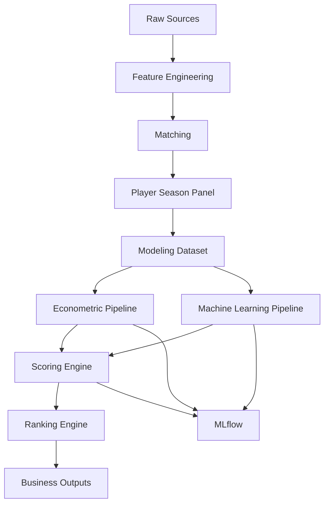

# 🔄 Referencia de pipelines

<div align="center">


</div>

---

# 🧠 Objetivo

Este documento describe los pipelines implementados en el proyecto, sus responsabilidades, inputs, outputs y relaciones entre componentes.

La referencia actúa como guía técnica para reconstruir el flujo completo del sistema analítico y garantizar reproducibilidad experimental.

---

# 📊 Estado actual

| Pipeline | Estado |
|---|---:|
| Data ingestion | ✅ |
| Feature engineering | ✅ |
| Matching | ✅ |
| Modeling dataset | ✅ |
| Econometric modeling | ✅ |
| Machine Learning | ✅ |
| Explainability | ✅ |
| Scoring Engine | ✅ |
| Ranking Engine | ✅ |
| Evaluation | ✅ |

---

# 🏗️ Pipeline global



---

# 📥 Data ingestion pipelines

## FBref

Pipeline:

```text
src/data/ingest_fbref.py
src/data/build_fbref_features.py
```

Input:

```text
data/raw/fbref/
```

Output:

```text
data/processed/fbref_features.parquet
```

---

## Transfermarkt

Pipeline:

```text
src/data/ingest_transfermarkt.py
src/data/build_transfermarkt_features.py
```

Input:

```text
data/raw/transfermarkt/
```

Output:

```text
data/processed/transfermarkt_features.parquet
```

---

# 🧪 Feature Engineering Pipeline

Objetivo:

Construcción de variables deportivas, temporales e índices compuestos.

Output:

```text
data/processed/player_season_modeling_indices.parquet
```

Variables añadidas:

- growth features
- positional normalization
- composite football indices

---

# 🤖 Machine Learning Pipeline

Pipeline principal:

```text
src/models/machine_learning/train_ml_tuned.py
```

Modelos:

- Tuned Random Forest
- Tuned XGBoost
- Tuned LightGBM
- HistGradientBoosting

Mejor modelo:

```text
Tuned XGBoost
R²=0.5536
RMSE=0.8753
```

Outputs:

```text
artifacts/models/
artifacts/predictions/
artifacts/feature_importance/
```

---

# 🎯 Scouting Scoring Pipeline

Arquitectura:

```text
predictions
    ↓
build_inefficiency_score.py
    ↓
build_growth_score.py
    ↓
build_confidence_score.py
    ↓
build_opportunity_score.py
    ↓
generate_rankings.py
```

---

## Scoring components

### Inefficiency Score

Objetivo:

Detectar desviaciones entre valor esperado y observado.

### Growth Score

Objetivo:

Capturar potencial futuro.

### Confidence Score

Objetivo:

Reducir falsos positivos.

### Opportunity Score

Objetivo:

Priorizar oportunidades reales de scouting.

---

# 📤 Outputs del scoring

```text
reports/rankings/

scoring_dataset.csv
scoring_dataset_growth.csv
scoring_dataset_confidence.csv
scoring_dataset_opportunity.csv

top_undervalued_global.csv
top_undervalued_by_league.csv
top_undervalued_by_position.csv
top_high_potential.csv
top_low_risk.csv
scouting_shortlist.csv
```

---

# 📈 Resultados actuales

| Métrica | Valor |
|---|---:|
| Observaciones scoreadas | 1,138 |
| Scouting targets | 53 |
| Alta prioridad + target | 376 |

---

# 🧠 Consideraciones metodológicas

- validación temporal estricta
- prevención de leakage
- configuración YAML desacoplada
- tracking MLflow
- persistencia de artefactos
- reproducibilidad completa

---

# 🚀 Evolución futura

- integración Understat
- xG y xA
- dashboard interactivo
- scouting reports automáticos
- simulación ROI
