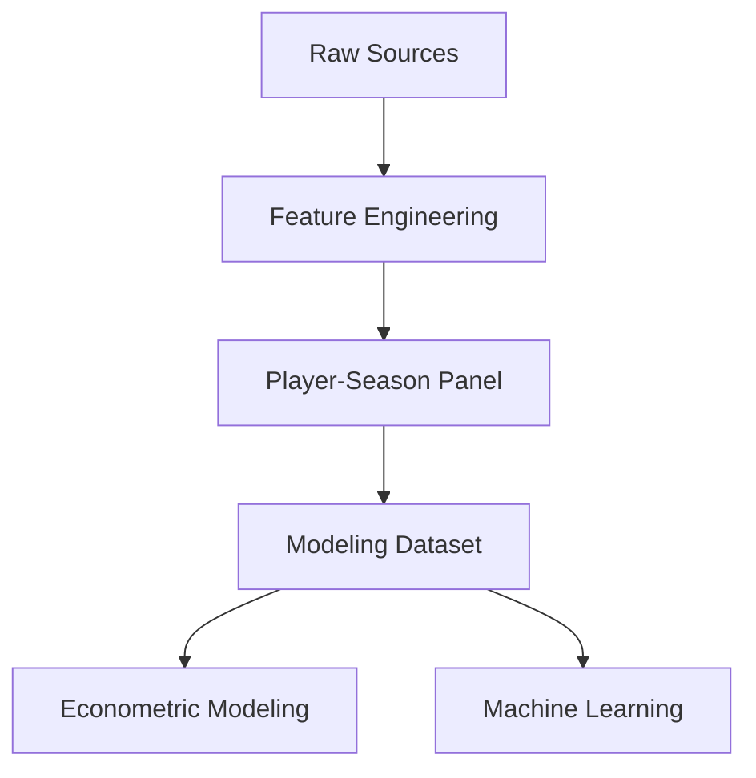

# 📘 Schema Decisions

---

# 📑 Tabla de contenidos

- [🧠 Objetivo del diseño del dataset](#-objetivo-del-diseño-del-dataset)
- [⚙️ Unidad de análisis](#️-unidad-de-análisis)
- [🗂️ Arquitectura general del dataset](#️-arquitectura-general-del-dataset)
- [🔑 Claves primarias e identificadores](#-claves-primarias-e-identificadores)
- [🎯 Variable objetivo](#-variable-objetivo)
- [📈 Variables derivadas](#-variables-derivadas)
- [📊 Bloques de variables explicativas](#-bloques-de-variables-explicativas)
- [🏷️ Variables categóricas](#️-variables-categóricas)
- [⚠️ Variables de matching y calidad](#️-variables-de-matching-y-calidad)
- [📚 Transformaciones aplicadas](#-transformaciones-aplicadas)
- [🛠️ Integración de datos](#️-integración-de-datos)
- [📉 Reglas de inclusión](#-reglas-de-inclusión)
- [📊 Dataset final de modelización](#-dataset-final-de-modelización)
- [⏳ Diseño temporal y prevención de leakage](#-diseño-temporal-y-prevención-de-leakage)
- [⚖️ Trade-offs metodológicos](#️-trade-offs-metodológicos)
- [🚨 Riesgos identificados](#-riesgos-identificados)
- [🧠 Conclusión](#-conclusión)

---

# 🧠 Objetivo del diseño del dataset

El diseño del dataset busca construir una estructura robusta y reproducible para modelar el valor de mercado de futbolistas jóvenes en el fútbol europeo.

El esquema debe permitir:

- integración multi-fuente
- modelización econométrica
- machine learning supervisado
- validación temporal
- construcción de rankings de scouting

---

# ⚙️ Unidad de análisis

La unidad de análisis utilizada es:

```text
Jugador – Temporada
```

Cada fila representa:

- rendimiento deportivo
- contexto competitivo
- valor de mercado
- situación demográfica

de un jugador en una temporada concreta.

---

## 📌 Justificación

Esta decisión se adopta porque:

- el valor de mercado es dinámico
- las fuentes están estructuradas por temporada
- permite econometría de panel
- facilita efectos fijos
- reduce inconsistencias temporales

---

# 🗂️ Arquitectura general del dataset

El sistema se estructura en cuatro capas principales:



---

# 🔑 Claves primarias e identificadores

## Clave primaria

La unicidad del dataset se define mediante:

```python
player_id + season
```

---

## Identificadores internos

| Variable | Descripción |
|---|---|
| `player_id` | identificador interno unificado |
| `season` | temporada deportiva |

---

## Identificadores externos

| Variable | Fuente |
|---|---|
| `player_id_tm` | Transfermarkt |
| `fbref_id` | FBref |

---

## Justificación

Se evita dependencia de una única fuente y se facilita:

- trazabilidad
- reproducibilidad
- futuras ampliaciones

---

# 🎯 Variable objetivo

## Variable principal

```python
log_market_value_eur
```

Derivada de:

```python
market_value_eur
```

Fuente:

```text
Transfermarkt
```

---

## Justificación

El valor de mercado presenta:

- skewness positiva
- colas largas
- heterocedasticidad

La transformación logarítmica:

- mejora linealidad
- reduce impacto de outliers
- estabiliza varianza
- facilita interpretación relativa

---

# 📈 Variables derivadas

## Variables principales

| Variable | Descripción |
|---|---|
| `log_market_value_eur` | target principal |
| `log_minutes_played` | transformación logarítmica |
| `g_a_per90` | goles + asistencias |
| `season_start_year` | inicio de temporada |

---

## Variables futuras

| Variable | Objetivo |
|---|---|
| `delta_log_market_value_1y` | Growth Score |
| `finishing_index` | eficiencia ofensiva |
| `playmaking_index` | creación |
| `progression_index` | progresión |
| `defensive_index` | defensa |

---

# 📊 Bloques de variables explicativas

## 1️⃣ Variables deportivas

### Producción ofensiva

- `goals_per90`
- `assists_per90`
- `g_a_per90`

---

### Volumen competitivo

- `minutes_played`
- `log_minutes_played`

---

### Variables futuras

- `progressive_passes_per90`
- `progressive_carries_per90`
- `xG`
- `xA`
- `tackles_per90`
- `interceptions_per90`

---

## 2️⃣ Variables demográficas

- `age`
- `position`
- `position_group`

---

## 3️⃣ Variables contextuales

- `league`
- `club`
- `season`

---

# 🏷️ Variables categóricas

## Position Group

Se agrupan posiciones en:

| Grupo | Descripción |
|---|---|
| GK | portero |
| DEF | defensa |
| MID | centrocampista |
| ATT | atacante |

---

## Justificación

- reducción dimensional
- interpretabilidad
- estabilidad econométrica
- efectos fijos por posición

---

# ⚠️ Variables de matching y calidad

El sistema incorpora variables específicas de calidad del matching.

## Variables principales

| Variable | Uso |
|---|---|
| `matching_method` | método de matching |
| `matching_confidence` | calidad estimada |
| `club_score` | similitud de club |
| `age_diff` | diferencia de edad |

---

## Decisión metodológica

Estas variables:

```text
NO representan rendimiento deportivo
```

Por tanto:

- se utilizan para robustness checks
- se utilizan para confidence scoring
- deben limitarse en modelos predictivos finales

---

# 📚 Transformaciones aplicadas

## Variables por 90 minutos

Objetivo:

- comparabilidad entre jugadores
- reducción sesgo por minutos

---

## Transformación logarítmica

Aplicada a:

- `market_value_eur`
- `minutes_played`

---

## Normalización de nombres

Aplicada para matching:

- lowercase
- eliminación de acentos
- limpieza de caracteres especiales

---

# 🛠️ Integración de datos

## Problema estructural

No existe identificador único compartido entre:

- FBref
- Transfermarkt

---

## Estrategia implementada

Matching jerárquico:

1. normalización
2. exact matching
3. validación por club
4. fuzzy matching

---

## Thresholds finales

```python
MAX_AGE_DIFF = 1.5
MIN_CLUB_SCORE = 70
FUZZY_THRESHOLD = 92
```

---

## Resultados

| Métrica | Resultado |
|---|---:|
| Match rate | 88.36% |
| Observaciones emparejadas | 20,836 |

---

# 📉 Reglas de inclusión

El dataset modelizable incluye únicamente:

- matching válido
- edad entre 18–23
- minutos mínimos
- valor de mercado disponible
- posición válida

---

# 📊 Dataset final de modelización

| Métrica | Resultado |
|---|---:|
| Observaciones | 3,297 |
| Jugadores | 1,847 |
| Ligas | 7 |
| Temporadas | 2019-2020 → 2024-2025 |

---

# ⏳ Diseño temporal y prevención de leakage

## Validación temporal

| Split | Temporadas |
|---|---|
| Train | 2019-2020 → 2023-2024 |
| Test | 2024-2025 |

---

## Decisión crítica

```text
No utilizar random split
```

---

## Justificación

El random split:

- rompe coherencia temporal
- introduce leakage
- genera optimismo artificial

---

# ⚖️ Trade-offs metodológicos

## Cobertura vs precisión

Decisión:

```text
Priorizar cobertura
```

---

## Justificación

Un matching ultra estricto:

- destruía tamaño muestral
- introducía sesgo de selección
- reducía capacidad predictiva

---

## Interpretabilidad vs complejidad

Decisión:

```text
OLS como núcleo principal
```

ML se utiliza como:

- comparación
- extensión predictiva
- validación complementaria

---

## Robustez vs coste computacional

Se optimizó:

- reducción espacio búsqueda
- matching jerárquico
- filtrado temporal

---

# 🚨 Riesgos identificados

## Riesgos estructurales

- ruido residual de matching
- sesgo por liga
- sesgo mediático
- cambios intra-temporada
- diferencias entre fuentes

---

## Riesgos metodológicos

- feature engineering limitado
- dependencia de métricas ofensivas
- posible infrarepresentación defensiva

---

# 🧠 Conclusión

El diseño del esquema de datos está orientado a maximizar:

- coherencia analítica
- robustez metodológica
- interpretabilidad
- capacidad predictiva

El dataset final constituye una base sólida para:

- econometría aplicada
- machine learning supervisado
- scouting cuantitativo
- identificación de ineficiencias de mercado
- construcción de rankings de fichajes

