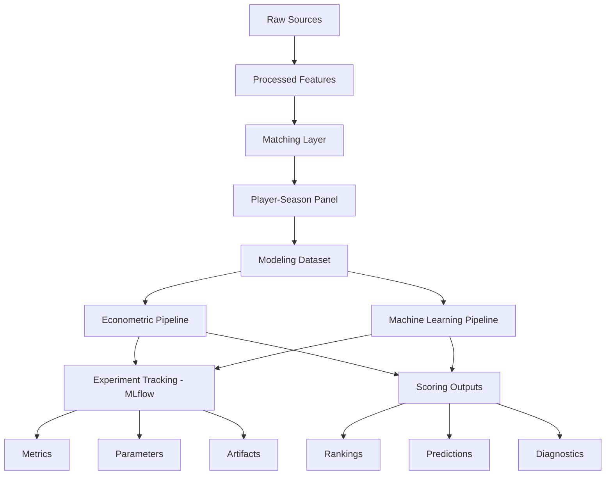

# 🏗️ Decisiones de esquema y modelado de datos

<div align="center">


</div>

---

# 📑 Tabla de contenidos

- [🧠 Objetivo del documento](#-objetivo-del-documento)
- [🏗️ Filosofía de diseño](#️-filosofía-de-diseño)
- [⚙️ Unidad de análisis](#️-unidad-de-análisis)
- [📊 Estructura conceptual del sistema](#-estructura-conceptual-del-sistema)
- [📂 Arquitectura física de datos](#-arquitectura-física-de-datos)
- [📦 Separación entre capas](#-separación-entre-capas)
- [📥 Esquema de datos raw](#-esquema-de-datos-raw)
- [🧪 Esquema de datos procesados](#-esquema-de-datos-procesados)
- [🔗 Esquema de integración y matching](#-esquema-de-integración-y-matching)
- [📊 Esquema del modeling dataset](#-esquema-del-modeling-dataset)
- [🏷️ Diseño de variables categóricas](#️-diseño-de-variables-categóricas)
- [📈 Diseño de variables numéricas](#-diseño-de-variables-numéricas)
- [📊 Diseño del target](#-diseño-del-target)
- [📂 Separación entre dataset y outputs](#-separación-entre-dataset-y-outputs)
- [💡 Variables derivadas y scoring](#-variables-derivadas-y-scoring)
- [🧪 Esquema de experiment tracking](#-esquema-de-experiment-tracking)
- [⚙️ Esquema de configuración centralizada](#️-esquema-de-configuración-centralizada)
- [📝 Esquema de logging](#-esquema-de-logging)
- [🛡️ Prevención de leakage](#️-prevención-de-leakage)
- [⏳ Diseño temporal](#-diseño-temporal)
- [📦 Gestión de artefactos](#-gestión-de-artefactos)
- [⚖️ Trade-offs metodológicos](#️-trade-offs-metodológicos)
- [🚀 Evolución prevista del esquema](#-evolución-prevista-del-esquema)
- [🧠 Conclusión](#-conclusión)

---

# 🧠 Objetivo del documento

Este documento describe las decisiones de diseño del esquema de datos utilizadas en el sistema analítico orientado a:

<pre>
identificar jugadores infravalorados en el mercado de fichajes europeo
</pre>

El objetivo es documentar:

- estructura lógica del dataset
- arquitectura de almacenamiento
- diseño de variables
- separación entre capas
- control de leakage
- consistencia temporal
- decisiones de analytics engineering
- configuración centralizada
- tracking experimental
- gestión de artefactos y logs

---

# 🏗️ Filosofía de diseño

El diseño del sistema sigue principios de:

- modularidad
- reproducibilidad
- trazabilidad
- desacoplamiento
- mantenibilidad
- escalabilidad futura
- auditoría experimental

---

## Principio central

Separar explícitamente:

- datos fuente
- datasets procesados
- datasets modelizables
- outputs derivados
- artefactos de modelos
- configuración
- experimentos
- logs operativos

---

## Objetivo

Evitar:

- contaminación entre etapas
- leakage accidental
- dependencia de notebooks
- mezcla entre lógica y outputs
- pérdida de trazabilidad experimental
- hardcoding de parámetros críticos

---

# ⚙️ Unidad de análisis

La unidad de análisis principal es:

<pre>
Jugador – Temporada
</pre>

---

## Justificación

Esta estructura permite:

- coherencia temporal
- integración multi-fuente
- modelización longitudinal
- comparabilidad entre jugadores
- validación temporal
- construcción de rankings reproducibles

---

## Implicaciones metodológicas

Cada fila representa:

- un jugador
- en una temporada concreta
- dentro de un contexto competitivo específico

---

# 📊 Estructura conceptual del sistema



---

# 📂 Arquitectura física de datos

```text
data/

├── raw/
├── interim/
├── processed/
└── external/
```

---

## 📌 Objetivo de separación

| Capa      | Función                          |
| --------- | -------------------------------- |
| raw       | Datos originales                 |
| interim   | Datos parcialmente transformados |
| processed | Datasets finales reutilizables   |
| external  | Datos auxiliares externos        |

---

# 📦 Separación entre capas

La arquitectura separa explícitamente:

| Elemento              | Directorio        |
| --------------------- | ----------------- |
| Datasets              | `data/processed/` |
| Outputs               | `reports/`        |
| Artefactos            | `artifacts/`      |
| Configuración         | `config/`         |
| Tracking experimental | `mlruns/`         |
| Logs                  | `logs/`           |
| Lógica                | `src/`            |

---

## Beneficios

Esta separación mejora:

* mantenibilidad
* trazabilidad
* auditoría
* reproducibilidad
* control de leakage
* comparación entre experimentos

---

# 📥 Esquema de datos raw

## Objetivo

Mantener los datos originales lo más cercanos posible a la fuente.

---

## Características

* mínima transformación
* persistencia original
* trazabilidad
* posibilidad de reprocesado

---

## Directorios principales

### FBref

<pre>
data/raw/fbref/
</pre>

---

### Transfermarkt

<pre>
data/raw/transfermarkt/
</pre>

---

## Decisión metodológica

Los datos raw no deben modificarse manualmente.

Cualquier transformación debe realizarse mediante pipelines versionables ubicados en:

<pre>
src/
</pre>

---

# 🧪 Esquema de datos procesados

## Objetivo

Construir datasets limpios y reutilizables.

---

## Datasets principales

| Archivo                          | Descripción               |
| -------------------------------- | ------------------------- |
| `fbref_features.parquet`         | Features deportivas       |
| `transfermarkt_features.parquet` | Variables de mercado      |
| `player_season_panel.parquet`    | Dataset integrado         |
| `player_season_modeling.parquet` | Dataset final modelizable |

---

## Formato

Se utiliza:

<pre>
Apache Parquet
</pre>

---

## Justificación

Parquet mejora:

* compresión
* velocidad
* eficiencia analítica
* integración con pandas y DuckDB

---

## Decisión metodológica

Los datasets procesados deben ser reproducibles a partir de:

* datos raw
* pipelines en `src/`
* configuración en `config/`

---

# 🔗 Esquema de integración y matching

## Problema principal

FBref y Transfermarkt:

<pre>
NO comparten identificador universal
</pre>

---

## Variables utilizadas para matching

| Variable         | Uso                   |
| ---------------- | --------------------- |
| player_name_norm | Matching principal    |
| age              | Validación            |
| club_norm        | Validación contextual |
| season           | Restricción temporal  |

---

## Variables de auditoría

| Variable            | Objetivo           |
| ------------------- | ------------------ |
| matching_method     | Método utilizado   |
| matching_confidence | Calidad estimada   |
| age_diff            | Diferencia edad    |
| club_score          | Similaridad clubes |

---

## Decisión metodológica

Las variables de matching:

* se preservan
* permiten auditoría
* facilitan robustness checks
* pueden contribuir a Confidence Score

pero:

<pre>
NO deben interpretarse como variables deportivas
</pre>

---

## Configuración asociada

Los parámetros de matching deben declararse en:

<pre>
config/matching.yaml
</pre>

Ejemplos:

```yaml
max_age_diff: 1.5
min_club_score: 70
fuzzy_threshold: 92
```

---

# 📊 Esquema del modeling dataset

## Archivo principal

<pre>
data/processed/player_season_modeling.parquet
</pre>

---

## Contenido

El dataset modelizable incluye:

* variables deportivas
* variables demográficas
* variables contextuales
* variables derivadas
* variables categóricas
* variables de calidad del matching

---

## Excluye explícitamente

* outputs de scoring
* predicciones
* variables futuras
* artefactos derivados
* métricas de evaluación
* variables internas de MLflow

---

## Resultado actual

| Métrica       | Valor |
| ------------- | ----: |
| Observaciones | 3,297 |
| Jugadores     | 1,847 |
| Edad          | 18–23 |
| Ligas         |     7 |

---

# 🏷️ Diseño de variables categóricas

## Variables categóricas actuales

| Variable         | Tipo     |
| ---------------- | -------- |
| `league`         | Category |
| `season`         | Category |
| `position_group` | Category |

---

## Justificación

Estas variables permiten modelar:

* efectos estructurales
* diferencias competitivas
* diferencias posicionales
* cambios temporales

---

## Position Group

| Grupo | Posiciones      |
| ----- | --------------- |
| GK    | Porteros        |
| DEF   | Defensas        |
| MID   | Centrocampistas |
| ATT   | Atacantes       |

---

## Uso en modelos

En econometría se utilizan como:

<pre>
fixed effects
</pre>

En Machine Learning se transforman mediante encoding categórico dentro del preprocessing pipeline.

---

# 📈 Diseño de variables numéricas

## Variables principales

| Variable             | Función                |
| -------------------- | ---------------------- |
| `age`                | Desarrollo             |
| `minutes_played`     | Exposición competitiva |
| `log_minutes_played` | Volumen robusto        |
| `goals_per90`        | Producción ofensiva    |
| `assists_per90`      | Creación ofensiva      |

---

## Principios de diseño

Las variables deben ser:

* interpretables
* coherentes futbolísticamente
* robustas
* temporalmente válidas

---

## Decisión metodológica

Se prioriza un set inicial compacto para establecer un baseline robusto antes de incorporar features avanzadas.

---

# 📊 Diseño del target

## Variable objetivo

```python
market_value_eur
```

---

## Transformación utilizada

```python
log_market_value_eur
```

---

## Justificación

La transformación logarítmica mejora:

* estabilidad
* linealidad
* robustez frente a outliers
* interpretabilidad relativa

---

## Decisión metodológica

El sistema modela:

<pre>
valor esperado de mercado
</pre>

y no:

* precio real de transferencia
* salario
* valor contractual exacto

---

# 📂 Separación entre dataset y outputs

## Dataset base

El modeling dataset representa:

<pre>
información disponible antes de modelizar
</pre>

---

## Outputs derivados

Los siguientes elementos se generan posteriormente:

* predicciones
* rankings
* scores
* métricas
* feature importance
* experimentos MLflow

---

## Directorios separados

| Tipo       | Directorio        |
| ---------- | ----------------- |
| Dataset    | `data/processed/` |
| Outputs    | `reports/`        |
| Artefactos | `artifacts/`      |
| Tracking   | `mlruns/`         |

---

## Justificación

Evita:

* contaminación del dataset
* leakage accidental
* mezcla entre inputs y outputs
* pérdida de trazabilidad entre modelo y ranking

---

# 💡 Variables derivadas y scoring

## Variables derivadas

| Variable               | Descripción                  |
| ---------------------- | ---------------------------- |
| `log_market_value_eur` | Log del target               |
| `log_minutes_played`   | Log de minutos               |
| `g_a_per90`            | Producción ofensiva agregada |

---

## Variables de scoring

Generadas posteriormente:

| Variable                     | Descripción                  |
| ---------------------------- | ---------------------------- |
| `predicted_market_value_eur` | Valor estimado               |
| `predicted_log_market_value` | Valor estimado en escala log |
| `market_value_gap_eur`       | Gap observado vs esperado    |
| `market_value_gap_pct`       | Gap porcentual               |
| `inefficiency_score`         | Score de infravaloración     |
| `inefficiency_score_z`       | Score normalizado            |

---

## Decisión crítica

Las variables de scoring:

<pre>
NO forman parte del dataset base de modelización
</pre>

---

## Uso correcto

Estas variables pertenecen a:

```text
reports/
artifacts/
mlruns/
```

---

# 🧪 Esquema de experiment tracking

## Herramienta

<pre>
MLflow
</pre>

---

## Directorio

<pre>
mlruns/
</pre>

---

## Objetivo

Registrar de forma estructurada:

* experimentos
* parámetros
* métricas
* artefactos
* modelos
* predicciones
* rankings derivados

---

## Elementos registrados

| Elemento      | Ejemplos                                         |
| ------------- | ------------------------------------------------ |
| Parámetros    | features, target, fixed effects, hiperparámetros |
| Métricas      | MAE, RMSE, R²                                    |
| Artefactos    | modelos, predicciones, feature importance        |
| Configuración | YAML usado en la ejecución                       |
| Outputs       | rankings, diagnósticos                           |

---

## Decisión metodológica

MLflow no debe mezclarse con el dataset base.

Los identificadores internos de MLflow, como `run_id` o `experiment_id`, pueden usarse para auditoría, pero no como features predictivas.

---

# ⚙️ Esquema de configuración centralizada

## Directorio

<pre>
config/
</pre>

---

## Archivos principales

| Archivo         | Función                        |
| --------------- | ------------------------------ |
| `config.yaml`   | Configuración general agregada |
| `paths.yaml`    | Rutas                          |
| `project.yaml`  | Metadatos del proyecto         |
| `matching.yaml` | Parámetros de matching         |
| `features.yaml` | Configuración de features      |
| `modeling.yaml` | Modelos, target, validación    |

---

## Principio

La configuración declara:

* rutas
* filtros
* thresholds
* listas de features
* modelos a ejecutar
* split temporal
* parámetros de scoring

---

## Lo que no debe contener

La configuración no debe contener:

* lógica compleja
* transformaciones algorítmicas
* reglas difíciles de testear
* outputs derivados

---

## Beneficio

La configuración centralizada permite:

* reproducibilidad
* mantenibilidad
* comparación de experimentos
* facilidad de cambio
* integración con MLflow

---

# 📝 Esquema de logging

## Directorio

<pre>
logs/
</pre>

---

## Objetivo

Registrar información operativa de ejecución.

---

## Contenido previsto

* inicio y fin de pipelines
* filas procesadas
* errores controlados
* rutas utilizadas
* warnings
* duración de procesos

---

## Diferencia con MLflow

| Elemento  | Función                                            |
| --------- | -------------------------------------------------- |
| `logs/`   | Trazabilidad operativa y debugging                 |
| `mlruns/` | Trazabilidad experimental y comparación de modelos |

---

## Decisión metodológica

Los logs no se utilizan como datos analíticos.

Su función es facilitar mantenimiento, debugging y auditoría operativa.

---

# 🛡️ Prevención de leakage

## Principio fundamental

Toda variable utilizada debe existir:

<pre>
en el momento real de decisión
</pre>

---

## Variables explícitamente excluidas

| Variable                     | Motivo                |
| ---------------------------- | --------------------- |
| `market_value_next_eur`      | Información futura    |
| `future_minutes`             | Información futura    |
| `future_xG`                  | Información futura    |
| `delta_log_market_value_1y`  | Información futura    |
| `predicted_market_value_eur` | Output derivado       |
| `predicted_log_market_value` | Output derivado       |
| `market_value_gap_eur`       | Output derivado       |
| `inefficiency_score`         | Output derivado       |
| `run_id`                     | Metadata experimental |
| `experiment_id`              | Metadata experimental |

---

## Decisión metodológica

Las variables futuras pueden usarse para:

* análisis descriptivo
* evaluación ex-post
* construcción futura de Growth Score con diseño temporal adecuado

pero no como inputs del modelo de valoración actual.

---

# ⏳ Diseño temporal

## Variables temporales

| Variable            | Función             |
| ------------------- | ------------------- |
| `season`            | Temporada deportiva |
| `season_start_year` | Orden temporal      |
| `valuation_date`    | Fecha de valoración |

---

## Split temporal

| Split | Temporadas            |
| ----- | --------------------- |
| Train | 2019-2020 → 2023-2024 |
| Test  | 2024-2025             |

---

## Justificación

El diseño temporal evita:

* leakage temporal
* optimismo artificial
* contaminación futura
* sobreestimación de rendimiento

---

## Configuración asociada

El split temporal se declara en:

<pre>
config/modeling.yaml
</pre>

---

# 📦 Gestión de artefactos

## Artefactos del proyecto

Directorio:

<pre>
artifacts/
</pre>

---

## Contenido

* modelos entrenados
* predicciones
* feature importance
* scalers
* encoders

---

## Artefactos experimentales

Directorio:

<pre>
mlruns/
</pre>

---

## Contenido

* runs
* métricas
* parámetros
* artefactos asociados
* modelos registrados localmente

---

## Decisión metodológica

Se mantiene una separación entre:

| Tipo                      | Directorio   | Uso                     |
| ------------------------- | ------------ | ----------------------- |
| Artefactos operativos     | `artifacts/` | Reutilización directa   |
| Artefactos experimentales | `mlruns/`    | Auditoría y comparación |
| Reports                   | `reports/`   | Outputs interpretables  |

---

# ⚖️ Trade-offs metodológicos

## Simplicidad vs riqueza del esquema

Un esquema muy amplio puede aumentar la señal predictiva, pero también:

* incrementar missing values
* introducir multicolinealidad
* complicar interpretación
* aumentar riesgo de leakage

---

## Decisión actual

Mantener un esquema inicial:

```text
compacto + interpretable + temporalmente válido
```

---

## Ventaja

Permite construir:

* baseline sólido
* evaluación clara
* scoring defendible
* evolución controlada

---

## Coste

Limita parcialmente la capacidad predictiva hasta incorporar feature engineering avanzado.

---

# 🚀 Evolución prevista del esquema

## Nuevos bloques de variables

### Features avanzadas

* z-scores por posición
* percentiles por liga
* métricas de progresión
* métricas defensivas
* rolling metrics

---

### Growth features

* delta_minutes_yoy
* market_value_growth_prev
* development acceleration
* age curve indicators

---

### Explainability

* SHAP global
* SHAP individual
* feature contributions por jugador

---

### Scoring avanzado

* Growth Score
* Confidence Score
* Opportunity Score

---

## Nuevas fuentes

* Understat
* StatsBomb Open Data

---

## Nuevos artefactos

* dashboards
* scouting reports
* API scoring
* modelos versionados

---

# 🧠 Conclusión

El diseño de esquema del proyecto está orientado a construir un sistema analítico reproducible, auditable y metodológicamente robusto.

La decisión central consiste en separar claramente:

* datos fuente
* datasets procesados
* dataset de modelización
* outputs derivados
* artefactos
* configuración
* experimentos
* logs

La incorporación de configuración centralizada y MLflow refuerza la trazabilidad del sistema, ya que permite reconstruir qué datos, parámetros, modelos y outputs participaron en cada ejecución.

El esquema actual es suficientemente sólido para sostener la fase de modelización y evaluación, y está preparado para evolucionar hacia un sistema más avanzado con nuevas features, nuevos modelos, explainability y outputs de scouting profesional.